# API文档

<cite>
**本文档中引用的文件**   
- [chat.ts](file://src/main/apiServer/routes/chat.ts)
- [mcp.ts](file://src/main/apiServer/routes/mcp.ts)
- [messages.ts](file://src/main/apiServer/routes/messages.ts)
- [models.ts](file://src/main/apiServer/routes/models.ts)
- [chat-completion.ts](file://src/main/apiServer/services/chat-completion.ts)
- [mcp.ts](file://src/main/apiServer/services/mcp.ts)
- [messages.ts](file://src/main/apiServer/services/messages.ts)
- [models.ts](file://src/main/apiServer/services/models.ts)
- [auth.ts](file://src/main/apiServer/middleware/auth.ts)
- [WebSocketService.ts](file://src/main/services/WebSocketService.ts)
- [app.ts](file://src/main/apiServer/app.ts)
- [server.ts](file://src/main/apiServer/server.ts)
- [index.ts](file://src/main/apiServer/utils/index.ts)
- [mcp.ts](file://src/main/apiServer/utils/mcp.ts)
</cite>

## 目录
1. [简介](#简介)
2. [RESTful API](#restful-api)
   1. [身份验证方法](#身份验证方法)
   2. [聊天完成API](#聊天完成api)
   3. [MCP API](#mcp-api)
   4. [消息API](#消息api)
   5. [模型API](#模型api)
3. [WebSocket API](#websocket-api)
   1. [连接处理](#连接处理)
   2. [消息格式](#消息格式)
   3. [事件类型](#事件类型)
   4. [实时交互模式](#实时交互模式)
4. [错误处理](#错误处理)
5. [安全注意事项](#安全注意事项)
6. [速率限制](#速率限制)
7. [版本控制](#版本控制)
8. [常见用例](#常见用例)
9. [客户端实现指南](#客户端实现指南)
10. [性能优化技巧](#性能优化技巧)
11. [调试工具和监控方法](#调试工具和监控方法)
12. [迁移指南](#迁移指南)

## 简介

Cherry Studio提供了一套全面的API接口，支持RESTful API和WebSocket API，用于与AI模型进行交互。API设计兼容OpenAI和Anthropic的标准，同时提供了扩展功能，如MCP（Model Context Protocol）服务器集成和WebSocket实时通信。

**本文档中引用的文件**
- [app.ts](file://src/main/apiServer/app.ts)
- [server.ts](file://src/main/apiServer/server.ts)

## RESTful API

Cherry Studio的RESTful API提供了一系列端点，用于与AI模型进行交互。所有API端点都遵循标准的HTTP方法和状态码。

### 身份验证方法

RESTful API使用API密钥进行身份验证。客户端可以通过以下两种方式之一提供API密钥：

1. **Authorization头**: 使用Bearer令牌格式
   ```
   Authorization: Bearer <api_key>
   ```

2. **X-API-Key头**: 直接提供API密钥
   ```
   X-API-Key: <api_key>
   ```

身份验证中间件会验证提供的凭证，并在验证失败时返回相应的HTTP状态码：
- `401 Unauthorized`: 缺少凭证或凭证格式错误
- `403 Forbidden`: 凭证无效或API密钥未配置

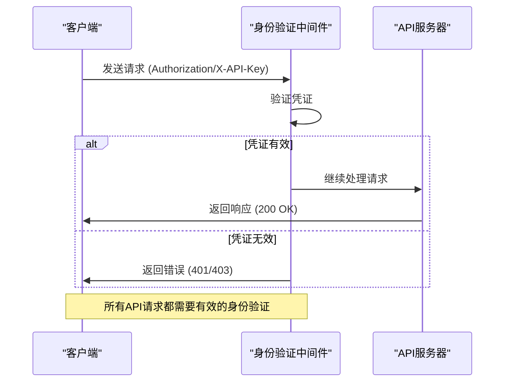

**Diagram sources**
- [auth.ts](file://src/main/apiServer/middleware/auth.ts)
- [app.ts](file://src/main/apiServer/app.ts)

**本文档中引用的文件**
- [auth.ts](file://src/main/apiServer/middleware/auth.ts)

### 聊天完成API

聊天完成API提供与OpenAI API兼容的接口，用于创建聊天完成响应。

#### 端点
- **URL模式**: `POST /v1/chat/completions`
- **HTTP方法**: POST

#### 请求参数

| 参数 | 类型 | 必需 | 描述 |
|------|------|------|------|
| model | string | 是 | 模型ID，格式为"provider:model_id" |
| messages | array | 是 | 消息数组，包含角色和内容 |
| stream | boolean | 否 | 是否流式传输响应 |
| temperature | number | 否 | 采样温度，0-1之间 |

#### 响应格式

对于非流式请求，返回标准的聊天完成响应：

```json
{
  "id": "string",
  "object": "chat.completion",
  "created": 1677652288,
  "model": "string",
  "choices": [
    {
      "index": 0,
      "message": {
        "role": "assistant",
        "content": "Hello, how can I help you?"
      },
      "finish_reason": "stop"
    }
  ],
  "usage": {
    "prompt_tokens": 9,
    "completion_tokens": 12,
    "total_tokens": 21
  }
}
```

对于流式请求，返回Server-Sent Events (SSE)流：

```
data: {"id":"...","object":"chat.completion.chunk",...}

data: {"id":"...","object":"chat.completion.chunk",...}

data: [DONE]
```

#### 错误处理

| 状态码 | 错误类型 | 描述 |
|--------|----------|------|
| 400 | invalid_request_error | 请求验证失败 |
| 401 | authentication_error | 身份验证失败 |
| 429 | rate_limit_error | 超出速率限制 |
| 500 | server_error | 服务器内部错误 |

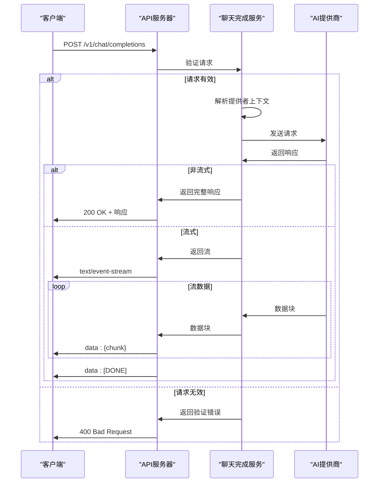

**Diagram sources**
- [chat.ts](file://src/main/apiServer/routes/chat.ts)
- [chat-completion.ts](file://src/main/apiServer/services/chat-completion.ts)

**本文档中引用的文件**
- [chat.ts](file://src/main/apiServer/routes/chat.ts)
- [chat-completion.ts](file://src/main/apiServer/services/chat-completion.ts)

### MCP API

MCP API提供对Model Context Protocol服务器的管理和访问。

#### 端点

1. **列出MCP服务器**
   - URL: `GET /v1/mcps`
   - 方法: GET
   - 响应:
   ```json
   {
     "success": true,
     "data": [
       {
         "id": "string",
         "name": "string",
         "type": "streamableHttp",
         "description": "string",
         "url": "string"
       }
     ]
   }
   ```

2. **获取MCP服务器信息**
   - URL: `GET /v1/mcps/{server_id}`
   - 方法: GET
   - 参数: server_id (路径参数)
   - 响应:
   ```json
   {
     "success": true,
     "data": {
       "id": "string",
       "name": "string",
       "type": "string",
       "description": "string",
       "tools": [
         {
           "name": "string",
           "description": "string",
           "inputSchema": {}
         }
       ]
     }
   }
   ```

3. **连接到MCP服务器**
   - URL: `ALL /v1/mcps/{server_id}/mcp`
   - 方法: ALL (GET, POST, PUT, DELETE等)
   - 参数: server_id (路径参数)
   - 功能: 代理所有请求到指定的MCP服务器

#### 错误处理

| 状态码 | 错误类型 | 描述 |
|--------|----------|------|
| 404 | not_found | MCP服务器未找到 |
| 503 | service_unavailable | 服务不可用 |

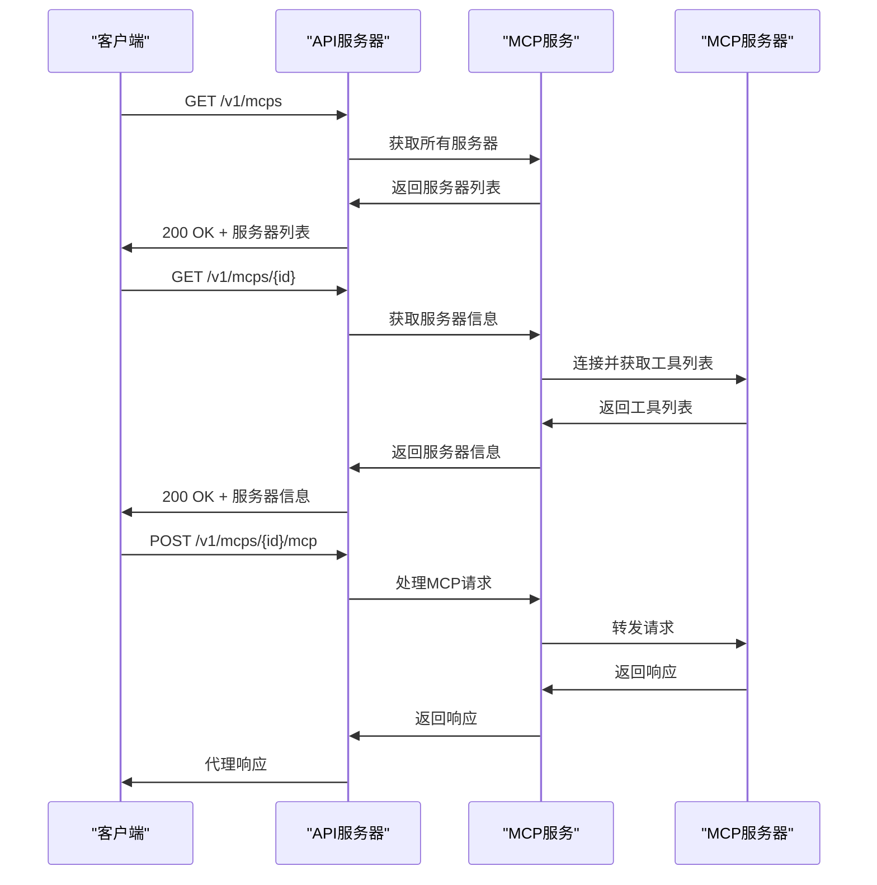

**Diagram sources**
- [mcp.ts](file://src/main/apiServer/routes/mcp.ts)
- [mcp.ts](file://src/main/apiServer/services/mcp.ts)

**本文档中引用的文件**
- [mcp.ts](file://src/main/apiServer/routes/mcp.ts)
- [mcp.ts](file://src/main/apiServer/services/mcp.ts)

### 消息API

消息API提供与Anthropic API格式兼容的接口，用于创建消息响应。

#### 端点

1. **创建消息**
   - URL: `POST /v1/messages`
   - 方法: POST
   - 请求体:
   ```json
   {
     "model": "provider:model_id",
     "max_tokens": 1024,
     "messages": [
       {
         "role": "user",
         "content": "Hello, Claude"
       }
     ],
     "stream": false
   }
   ```

2. **通过提供者路径创建消息**
   - URL: `POST /{provider_id}/v1/messages`
   - 方法: POST
   - 参数: provider_id (路径参数)
   - 功能: 使用URL路径中的提供者ID，请求体中的模型ID不需要包含提供者前缀

#### 响应格式

```json
{
  "id": "msg_abc123",
  "type": "message",
  "role": "assistant",
  "content": [
    {
      "type": "text",
      "text": "Hello, how can I help you?"
    }
  ],
  "model": "claude-3-opus-20240229",
  "stop_reason": "end_turn",
  "usage": {
    "input_tokens": 10,
    "output_tokens": 20
  }
}
```

#### 错误处理

| 状态码 | 错误类型 | 描述 |
|--------|----------|------|
| 400 | invalid_request_error | 请求验证失败 |
| 401 | authentication_error | 身份验证失败 |
| 500 | api_error | API错误 |

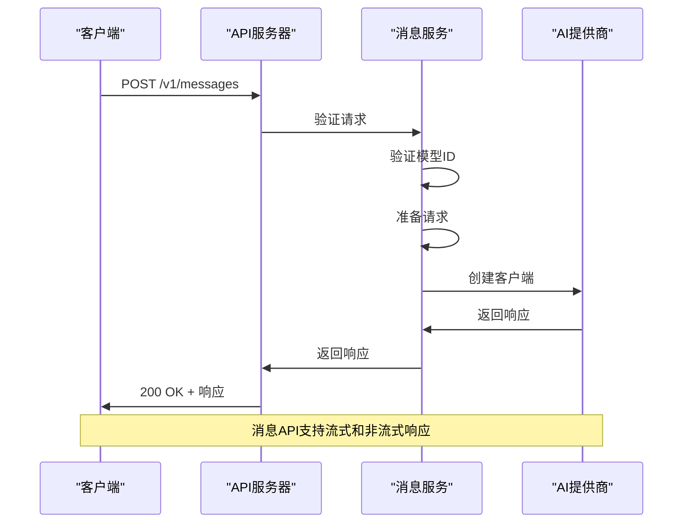

**Diagram sources**
- [messages.ts](file://src/main/apiServer/routes/messages.ts)
- [messages.ts](file://src/main/apiServer/services/messages.ts)

**本文档中引用的文件**
- [messages.ts](file://src/main/apiServer/routes/messages.ts)
- [messages.ts](file://src/main/apiServer/services/messages.ts)

### 模型API

模型API提供可用AI模型的列表。

#### 端点
- **URL模式**: `GET /v1/models`
- **HTTP方法**: GET
- **查询参数**:
  - providerType: 过滤提供者类型 (openai, anthropic, gemini)
  - offset: 分页偏移
  - limit: 返回的最大模型数

#### 响应格式

```json
{
  "object": "list",
  "data": [
    {
      "id": "provider:model_id",
      "object": "model",
      "name": "Model Name",
      "created": 1677610600,
      "owned_by": "provider_name",
      "provider": "provider_id",
      "provider_name": "Provider Display Name",
      "provider_type": "openai",
      "provider_model_id": "model_id"
    }
  ],
  "total": 10,
  "offset": 0,
  "limit": 10
}
```

#### 错误处理

| 状态码 | 错误类型 | 描述 |
|--------|----------|------|
| 400 | invalid_request_error | 查询参数无效 |
| 503 | service_unavailable | 服务不可用 |

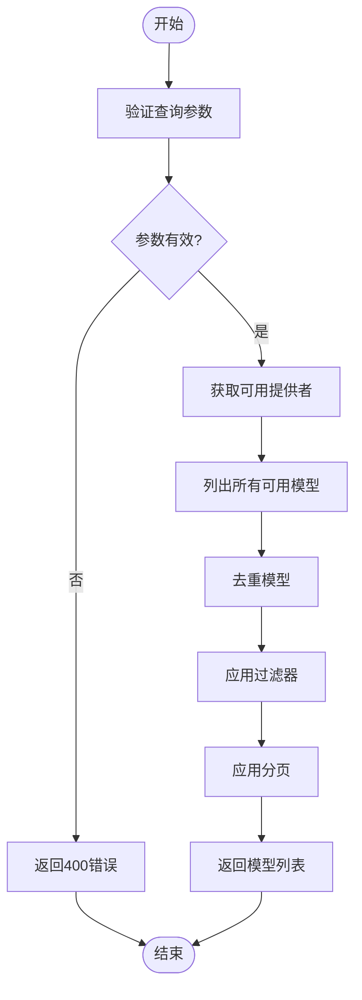

**Diagram sources**
- [models.ts](file://src/main/apiServer/routes/models.ts)
- [models.ts](file://src/main/apiServer/services/models.ts)
- [index.ts](file://src/main/apiServer/utils/index.ts)

**本文档中引用的文件**
- [models.ts](file://src/main/apiServer/routes/models.ts)
- [models.ts](file://src/main/apiServer/services/models.ts)

## WebSocket API

WebSocket API提供实时通信功能，主要用于移动设备连接和文件传输。

### 连接处理

WebSocket服务器在端口7017上运行，支持WebSocket和轮询传输。

#### 启动流程

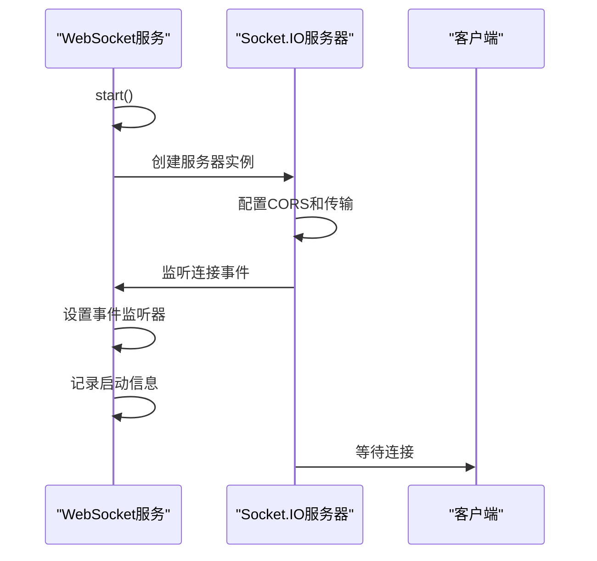

**本文档中引用的文件**
- [WebSocketService.ts](file://src/main/services/WebSocketService.ts)

### 消息格式

WebSocket API支持两种消息格式：

1. **普通消息**: JSON格式的文本消息
2. **文件传输**: 分块传输的二进制数据

#### 文件传输协议

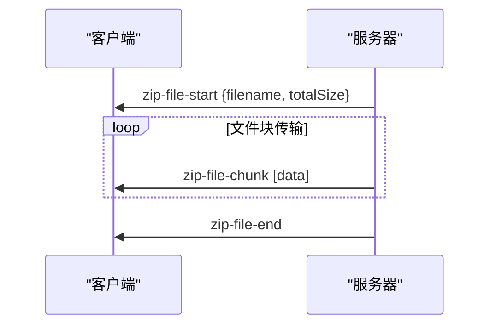

### 事件类型

| 事件 | 方向 | 载荷 | 描述 |
|------|------|------|------|
| connection | 服务器→客户端 | - | 客户端连接 |
| disconnect | 服务器→客户端 | - | 客户端断开 |
| message | 客户端→服务器 | string | 文本消息 |
| message_received | 服务器→客户端 | {success: true} | 消息接收确认 |
| zip-file-start | 服务器→客户端 | {filename, totalSize} | 文件传输开始 |
| zip-file-chunk | 服务器→客户端 | [data] | 文件数据块 |
| zip-file-end | 服务器→客户端 | - | 文件传输结束 |
| websocket-client-connected | 服务器→渲染器 | {connected, clientId} | 客户端连接状态 |
| websocket-message-received | 服务器→渲染器 | data | 消息接收 |

### 实时交互模式

WebSocket API支持以下实时交互模式：

1. **双向文本通信**: 客户端和服务器可以实时交换文本消息
2. **文件传输**: 服务器可以向连接的客户端传输文件
3. **状态同步**: 服务器向渲染器进程发送连接状态更新

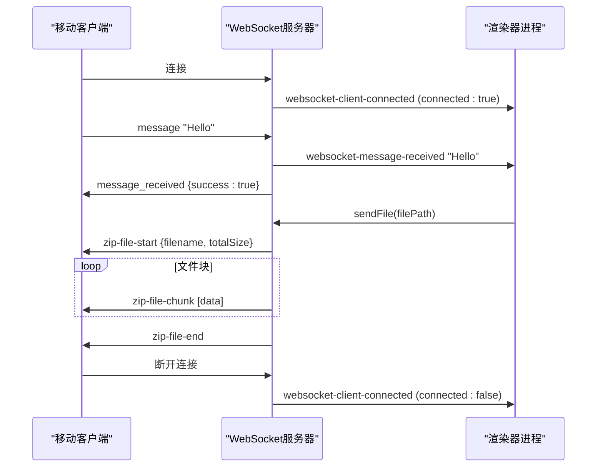

**Diagram sources**
- [WebSocketService.ts](file://src/main/services/WebSocketService.ts)

**本文档中引用的文件**
- [WebSocketService.ts](file://src/main/services/WebSocketService.ts)

## 错误处理

Cherry Studio API采用统一的错误处理策略，确保客户端能够正确处理各种错误情况。

### 错误响应格式

```json
{
  "error": {
    "message": "错误描述",
    "type": "错误类型",
    "code": "错误代码"
  }
}
```

### 错误类型映射

| HTTP状态码 | 错误类型 | 触发条件 |
|-----------|----------|----------|
| 400 | invalid_request_error | 请求验证失败 |
| 401 | authentication_error | 身份验证失败 |
| 403 | forbidden | 禁止访问 |
| 404 | not_found | 资源未找到 |
| 429 | rate_limit_error | 超出速率限制 |
| 500 | server_error | 服务器内部错误 |
| 502 | api_error | 上游API错误 |
| 503 | service_unavailable | 服务不可用 |

### 错误处理流程

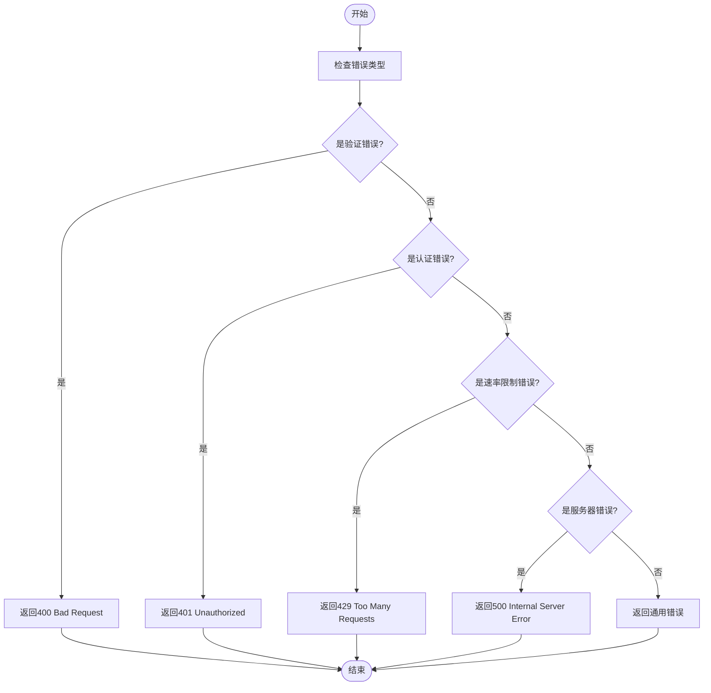

**本文档中引用的文件**
- [error.ts](file://src/main/apiServer/middleware/error.ts)
- [chat.ts](file://src/main/apiServer/routes/chat.ts)
- [mcp.ts](file://src/main/apiServer/routes/mcp.ts)

## 安全注意事项

### 身份验证

- 使用API密钥进行身份验证
- 支持Bearer令牌和X-API-Key头
- 使用timingSafeEqual进行安全的密钥比较
- 敏感头信息（如Authorization）不会被转发

### 数据保护

- 所有API请求都记录在日志中，但敏感信息（如API密钥）会被过滤
- WebSocket连接使用安全的传输层
- 文件传输使用分块传输，避免内存溢出

### 安全最佳实践

1. **API密钥管理**: 定期轮换API密钥
2. **HTTPS**: 在生产环境中始终使用HTTPS
3. **IP限制**: 限制API访问的IP范围
4. **监控**: 监控异常的API使用模式

**本文档中引用的文件**
- [auth.ts](file://src/main/apiServer/middleware/auth.ts)
- [WebSocketService.ts](file://src/main/services/WebSocketService.ts)

## 速率限制

Cherry Studio API实施速率限制以防止滥用：

- **默认限制**: 未明确指定，但系统会监控异常使用模式
- **监控**: 记录所有API请求的详细信息，包括方法、路径、状态码和持续时间
- **响应**: 当检测到滥用时，返回429状态码

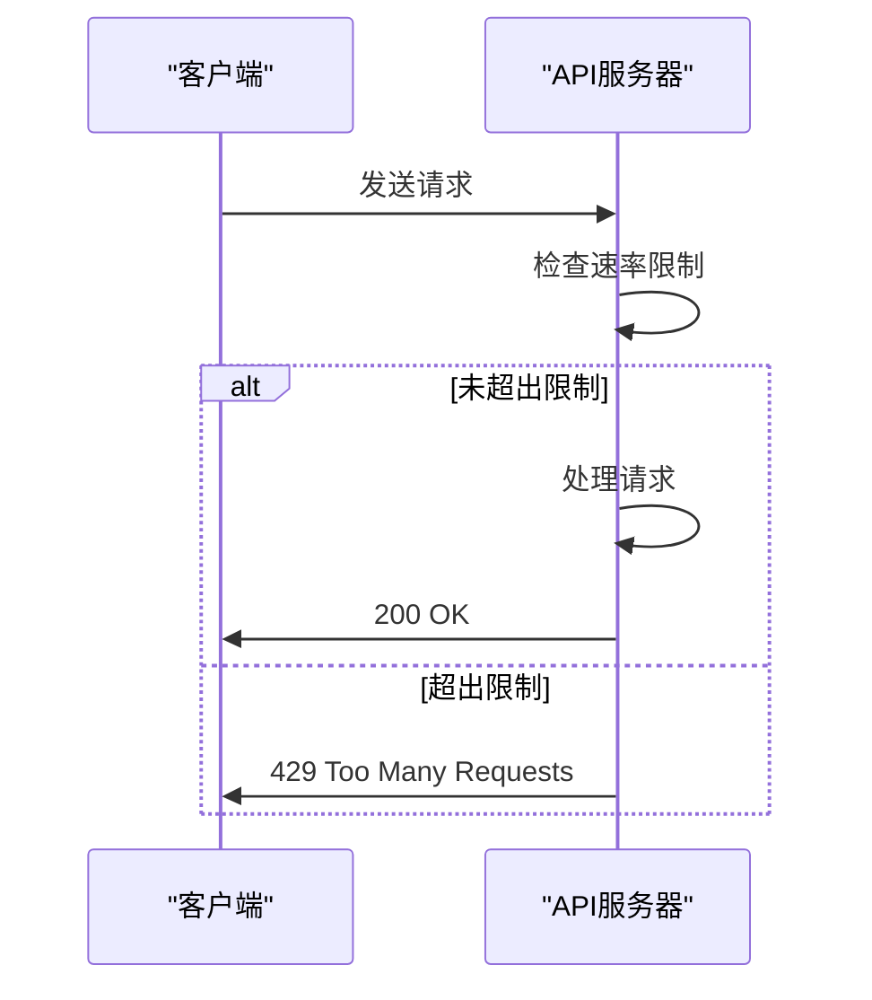

**本文档中引用的文件**
- [app.ts](file://src/main/apiServer/app.ts)

## 版本控制

API使用版本控制来管理向后兼容性：

- **版本前缀**: `/v1/` 用于所有API端点
- **向后兼容性**: 维护现有端点的向后兼容性
- **弃用策略**: 通过文档和日志通知弃用的端点

**本文档中引用的文件**
- [app.ts](file://src/main/apiServer/app.ts)

## 常见用例

### 聊天应用集成

```javascript
// 创建聊天完成
const response = await fetch('http://localhost:7016/v1/chat/completions', {
  method: 'POST',
  headers: {
    'Content-Type': 'application/json',
    'X-API-Key': 'your-api-key'
  },
  body: JSON.stringify({
    model: 'my-openai:gpt-4',
    messages: [
      { role: 'user', content: 'Hello, how are you?' }
    ]
  })
});
```

### MCP服务器管理

```javascript
// 列出所有MCP服务器
const response = await fetch('http://localhost:7016/v1/mcps', {
  headers: {
    'X-API-Key': 'your-api-key'
  }
});

// 获取特定MCP服务器信息
const serverInfo = await fetch('http://localhost:7016/v1/mcps/server-123', {
  headers: {
    'X-API-Key': 'your-api-key'
  }
});
```

### 实时文件传输

```javascript
// 连接到WebSocket服务器
const socket = io('http://localhost:7017');

// 监听文件传输事件
socket.on('zip-file-start', (data) => {
  console.log(`开始接收文件: ${data.filename}`);
});

socket.on('zip-file-chunk', (data) => {
  // 处理文件块
  appendToDownload(data);
});

socket.on('zip-file-end', () => {
  console.log('文件传输完成');
});
```

**本文档中引用的文件**
- [chat.ts](file://src/main/apiServer/routes/chat.ts)
- [mcp.ts](file://src/main/apiServer/routes/mcp.ts)
- [WebSocketService.ts](file://src/main/services/WebSocketService.ts)

## 客户端实现指南

### RESTful API客户端

1. **设置身份验证**: 在请求头中包含API密钥
2. **处理流式响应**: 对于流式端点，使用EventSource或类似库处理SSE
3. **错误处理**: 实现重试逻辑，特别是对于429和500错误
4. **超时处理**: 设置适当的请求超时

### WebSocket客户端

1. **连接管理**: 实现连接重试逻辑
2. **消息解析**: 正确解析不同类型的WebSocket事件
3. **文件传输**: 实现文件分块接收和重组
4. **状态同步**: 监听连接状态变化并更新UI

**本文档中引用的文件**
- [chat.ts](file://src/main/apiServer/routes/chat.ts)
- [WebSocketService.ts](file://src/main/services/WebSocketService.ts)

## 性能优化技巧

### 请求优化

- **批量请求**: 尽可能使用批量操作
- **缓存**: 缓存模型列表等不变的数据
- **连接复用**: 重用HTTP连接

### 流式传输

- **流式响应**: 对于长响应，使用流式传输以提供即时反馈
- **分块处理**: 在客户端分块处理流式数据

### WebSocket性能

- **压缩**: 考虑启用WebSocket压缩
- **心跳**: 实现适当的心跳机制保持连接活跃
- **资源清理**: 及时清理不再需要的连接

**本文档中引用的文件**
- [chat.ts](file://src/main/apiServer/routes/chat.ts)
- [WebSocketService.ts](file://src/main/services/WebSocketService.ts)

## 调试工具和监控方法

### 日志记录

- **详细日志**: 所有API请求和响应都记录在日志中
- **上下文信息**: 日志包含请求方法、路径、状态码和持续时间
- **错误日志**: 详细的错误信息，开发环境包含堆栈跟踪

### 监控指标

- **请求计数**: 按端点和状态码统计请求
- **响应时间**: 监控API响应时间
- **错误率**: 跟踪错误请求的比例

### 调试工具

- **OpenAPI文档**: 通过`/docs`端点提供API文档
- **健康检查**: `/health`端点用于检查服务器状态
- **WebSocket调试**: 详细的WebSocket连接和消息日志

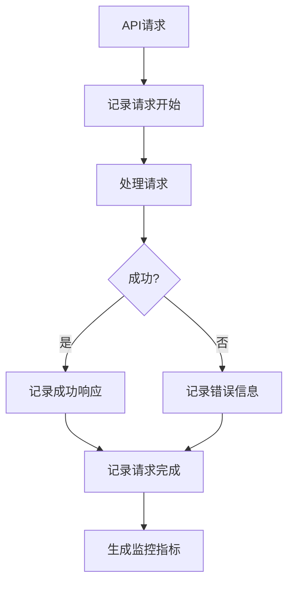

**本文档中引用的文件**
- [app.ts](file://src/main/apiServer/app.ts)
- [server.ts](file://src/main/apiServer/server.ts)

## 迁移指南

### 弃用功能

当前版本没有已弃用的功能。未来任何弃用的功能都将通过以下方式通知：

1. **文档更新**: 在API文档中明确标记弃用的端点
2. **日志警告**: 在服务器日志中记录弃用警告
3. **版本控制**: 使用新的API版本包含重大变更

### 向后兼容性

- **API版本**: `/v1/` 前缀确保向后兼容性
- **字段添加**: 只添加新字段，不修改现有字段
- **错误码**: 保持错误码的一致性

**本文档中引用的文件**
- [app.ts](file://src/main/apiServer/app.ts)