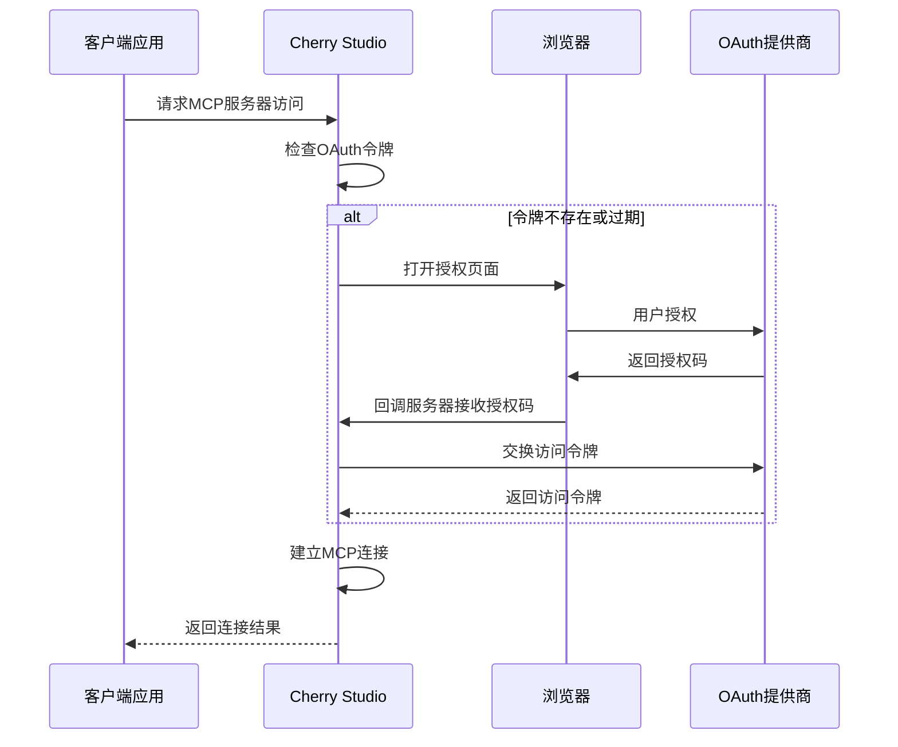
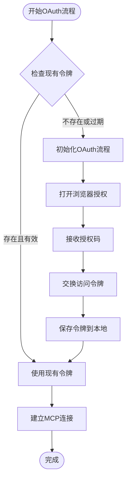
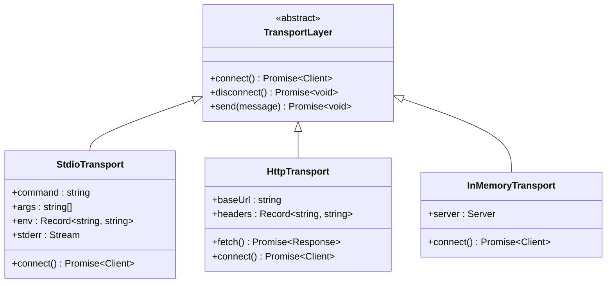
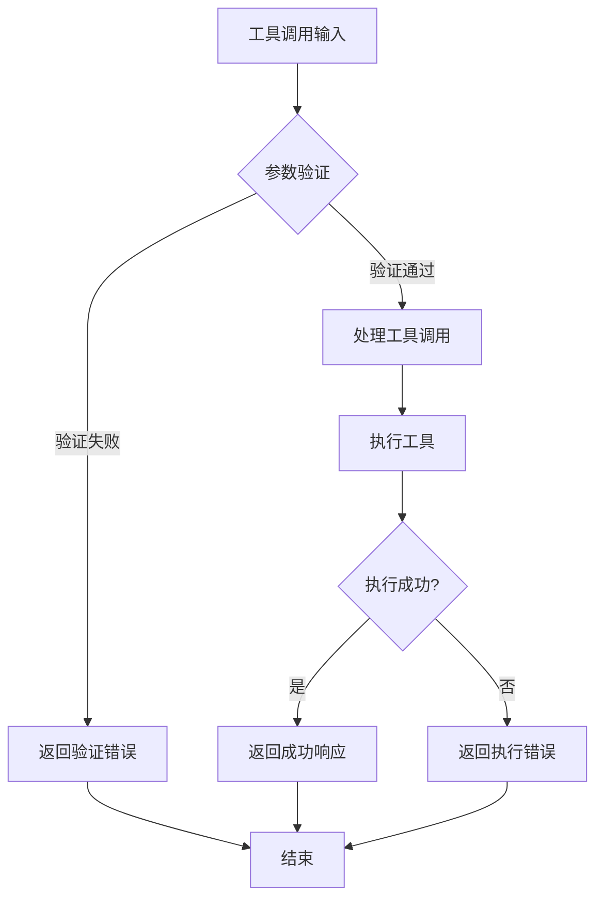
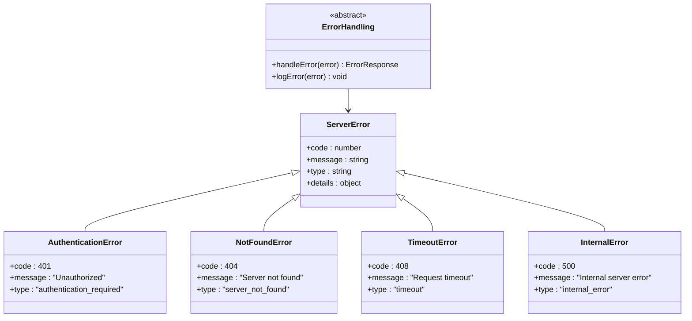
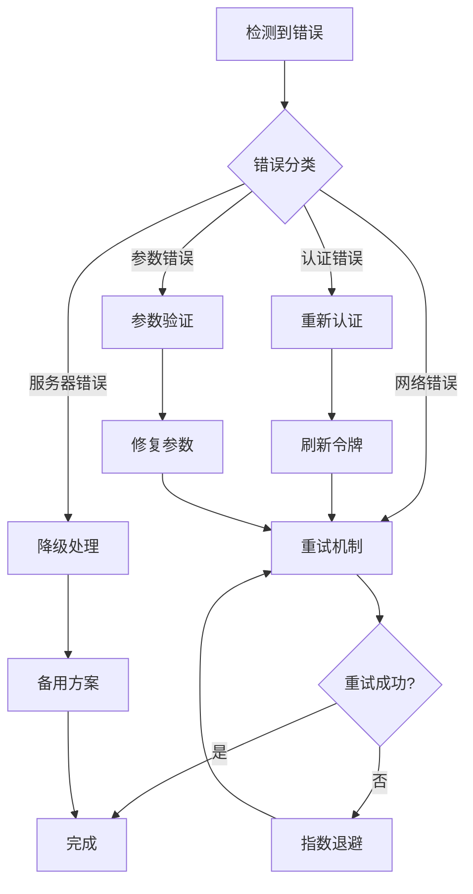
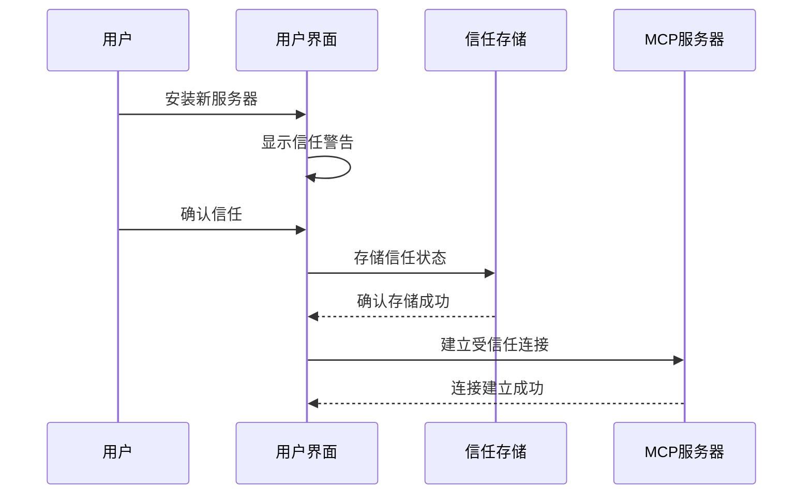

# Cherry Studio MCP服务API详细文档

<cite>
**本文档中引用的文件**
- [mcp.ts](file://src/main/apiServer/routes/mcp.ts)
- [MCPService.ts](file://src/main/services/MCPService.ts)
- [mcp.ts](file://src/main/apiServer/services/mcp.ts)
- [mcp.ts](file://src/main/apiServer/utils/mcp.ts)
- [sequentialthinking.ts](file://src/main/mcpServers/sequentialthinking.ts)
- [provider.ts](file://src/main/services/mcp/oauth/provider.ts)
- [callback.ts](file://src/main/services/mcp/oauth/callback.ts)
- [storage.ts](file://src/main/services/mcp/oauth/storage.ts)
- [mcp.ts](file://src/renderer/src/types/mcp.ts)
- [index.ts](file://src/renderer/src/types/index.ts)
</cite>

## 目录
1. [简介](#简介)
2. [API端点概览](#api端点概览)
3. [认证机制](#认证机制)
4. [MCP服务器类型](#mcp服务器类型)
5. [请求/响应模式](#请求响应模式)
6. [内置MCP服务器](#内置mcp服务器)
7. [错误处理](#错误处理)
8. [安全注意事项](#安全注意事项)
9. [客户端实现指南](#客户端实现指南)
10. [调试建议](#调试建议)

## 简介

Cherry Studio提供了完整的Model Context Protocol (MCP)服务API，允许开发者通过标准化接口与各种MCP服务器进行交互。该API支持多种通信方式，包括HTTP、WebSocket和STDIO，并提供了完整的OAuth认证机制和安全信任系统。

## API端点概览

### 核心端点

| HTTP方法 | URL模式 | 描述 | 身份验证 |
|---------|---------|------|----------|
| GET | `/v1/mcps` | 获取所有配置的MCP服务器列表 | 是 |
| GET | `/v1/mcps/{server_id}` | 获取特定MCP服务器的详细信息 | 是 |
| ALL | `/v1/mcps/{server_id}/mcp` | 连接到指定的MCP服务器 | 是 |

### 端点详细说明

#### 获取MCP服务器列表
- **URL**: `/v1/mcps`
- **方法**: GET
- **描述**: 返回所有已配置的MCP服务器列表
- **响应格式**: 
```json
{
  "success": true,
  "data": [
    {
      "id": "server-id",
      "name": "server-name",
      "type": "stdio|sse|streamableHttp|inMemory",
      "description": "服务器描述",
      "baseUrl": "http://localhost:8080"
    }
  ]
}
```

#### 获取MCP服务器详情
- **URL**: `/v1/mcps/{server_id}`
- **方法**: GET
- **描述**: 获取指定MCP服务器的详细配置信息
- **响应格式**: 
```json
{
  "success": true,
  "data": {
    "id": "server-id",
    "name": "server-name",
    "type": "stdio",
    "description": "服务器详细描述",
    "command": "uvx",
    "args": ["package-name"],
    "env": {},
    "headers": {}
  }
}
```

#### MCP服务器连接
- **URL**: `/v1/mcps/{server_id}/mcp`
- **方法**: ALL (支持GET、POST、PUT等)
- **描述**: 建立与指定MCP服务器的连接，支持工具调用和资源访问

**章节来源**
- [mcp.ts](file://src/main/apiServer/routes/mcp.ts#L1-L156)

## 认证机制

### OAuth 2.0集成

Cherry Studio完全支持OAuth 2.0协议，为MCP服务器提供安全的身份验证机制。



**图表来源**
- [provider.ts](file://src/main/services/mcp/oauth/provider.ts#L1-L86)
- [callback.ts](file://src/main/services/mcp/oauth/callback.ts#L1-L159)

### OAuth配置选项

| 配置项 | 类型 | 默认值 | 描述 |
|--------|------|--------|------|
| serverUrlHash | string | 必需 | 服务器URL的MD5哈希值 |
| callbackPort | number | 12346 | 回调服务器端口 |
| callbackPath | string | '/oauth/callback' | 回调路径 |
| clientName | string | 'Cherry Studio' | 客户端名称 |
| clientUri | string | 'https://github.com/CherryHQ/cherry-studio' | 客户端URI |

### 令牌存储机制

OAuth令牌通过加密的本地文件存储，确保安全性：



**图表来源**
- [storage.ts](file://src/main/services/mcp/oauth/storage.ts#L1-L124)

**章节来源**
- [provider.ts](file://src/main/services/mcp/oauth/provider.ts#L1-L86)
- [callback.ts](file://src/main/services/mcp/oauth/callback.ts#L1-L159)
- [storage.ts](file://src/main/services/mcp/oauth/storage.ts#L1-L124)

## MCP服务器类型

### 支持的传输类型

Cherry Studio支持四种主要的MCP服务器通信类型：

| 类型 | 描述 | 使用场景 | 示例 |
|------|------|----------|------|
| stdio | 标准输入输出通信 | 本地CLI工具 | `uvx mcp-package` |
| sse | Server-Sent Events | 实时数据流 | WebSocket替代方案 |
| streamableHttp | HTTP流式通信 | RESTful API | `http://localhost:8080` |
| inMemory | 内存通信 | 内置服务器 | `sequentialthinking` |

### 服务器配置结构

```typescript
interface MCPServer {
  id?: string;                    // 服务器内部ID
  name?: string;                  // 服务器名称
  type?: 'stdio' | 'sse' | 'streamableHttp' | 'inMemory';
  description?: string;           // 服务器描述
  baseUrl?: string;              // HTTP基础URL
  command?: string;              // 启动命令
  args?: string[];               // 命令参数
  env?: Record<string, string>;  // 环境变量
  headers?: Record<string, string>; // HTTP头部
  timeout?: number;              // 超时时间(秒)
  longRunning?: boolean;         // 长期运行标志
}
```

### 传输层实现



**图表来源**
- [MCPService.ts](file://src/main/services/MCPService.ts#L220-L260)

**章节来源**
- [mcp.ts](file://src/renderer/src/types/mcp.ts#L1-L220)
- [MCPService.ts](file://src/main/services/MCPService.ts#L220-L260)

## 请求/响应模式

### 工具调用请求格式

MCP工具调用遵循标准的JSON-RPC 2.0格式：

```json
{
  "jsonrpc": "2.0",
  "id": "unique-request-id",
  "method": "tools/call",
  "params": {
    "name": "tool-name",
    "arguments": {
      "parameter1": "value1",
      "parameter2": "value2"
    }
  }
}
```

### 响应格式

#### 成功响应
```json
{
  "jsonrpc": "2.0",
  "id": "unique-request-id",
  "result": {
    "content": [
      {
        "type": "text",
        "text": "工具执行结果"
      }
    ]
  }
}
```

#### 错误响应
```json
{
  "jsonrpc": "2.0",
  "id": "unique-request-id",
  "error": {
    "code": -32603,
    "message": "Internal error",
    "data": {
      "details": "具体错误信息"
    }
  }
}
```

### 参数验证

MCP服务提供了严格的参数验证机制：



**图表来源**
- [MCPService.ts](file://src/main/services/MCPService.ts#L660-L710)

**章节来源**
- [MCPService.ts](file://src/main/services/MCPService.ts#L660-L710)
- [mcp.ts](file://src/main/apiServer/utils/mcp.ts#L19-L39)

## 内置MCP服务器

### Sequential Thinking服务器

Sequential Thinking是一个强大的内置MCP服务器，专门用于复杂的推理和思考过程管理。

#### 功能特性

| 特性 | 描述 | 使用场景 |
|------|------|----------|
| 思维分支 | 支持思维分支和回溯 | 复杂问题解决 |
| 动态调整 | 可动态调整总思考数 | 不确定性处理 |
| 修订功能 | 支持思维修订和改进 | 迭代优化 |
| 不确定性表达 | 支持不确定性表达 | 探索性任务 |

#### 思维数据结构

```typescript
interface ThoughtData {
  thought: string;              // 当前思考内容
  thoughtNumber: number;        // 思考编号
  totalThoughts: number;        // 总思考数
  nextThoughtNeeded: boolean;   // 是否需要更多思考
  isRevision?: boolean;         // 是否为修订
  revisesThought?: number;      // 修订的思考编号
  branchFromThought?: number;   // 分支起点
  branchId?: string;            // 分支ID
  needsMoreThoughts?: boolean;  // 需要更多思考
}
```

#### 使用示例

```json
{
  "thought": "我们需要分析这个问题的各个方面。",
  "thoughtNumber": 1,
  "totalThoughts": 5,
  "nextThoughtNeeded": true,
  "isRevision": false
}
```

### 其他内置服务器

| 服务器名称 | 类型 | 功能描述 |
|------------|------|----------|
| filesystem | inMemory | 文件系统操作 |
| memory | inMemory | 内存数据管理 |
| python | stdio | Python脚本执行 |
| fetch | stdio | HTTP请求工具 |

**章节来源**
- [sequentialthinking.ts](file://src/main/mcpServers/sequentialthinking.ts#L1-L295)

## 错误处理

### 错误类型分类

Cherry Studio MCP服务实现了全面的错误处理机制：



### 常见错误响应

#### 服务器不可用
```json
{
  "success": false,
  "error": {
    "message": "Failed to retrieve MCP servers: Server unavailable",
    "type": "service_unavailable",
    "code": "servers_unavailable"
  }
}
```

#### 工具执行失败
```json
{
  "jsonrpc": "2.0",
  "id": "request-id",
  "error": {
    "code": -32603,
    "message": "Tool execution failed",
    "data": {
      "reason": "Invalid parameters",
      "server": "weather-server"
    }
  }
}
```

#### 超时错误
```json
{
  "success": false,
  "error": {
    "message": "Request timeout after 60 seconds",
    "type": "timeout",
    "code": "request_timeout"
  }
}
```

### 错误恢复策略



**图表来源**
- [MCPService.ts](file://src/main/services/MCPService.ts#L660-L710)

**章节来源**
- [mcp.ts](file://src/main/apiServer/routes/mcp.ts#L45-L63)
- [MCPService.ts](file://src/main/services/MCPService.ts#L660-L710)

## 安全注意事项

### 信任机制

Cherry Studio实现了多层次的安全信任机制：

#### 服务器信任级别

| 信任级别 | 描述 | 安全措施 |
|----------|------|----------|
| 未信任 | 新安装的服务器 | 需要用户确认 |
| 受信任 | 用户手动信任的服务器 | 有限权限访问 |
| 内置服务器 | Cherry Studio自带的服务器 | 最高权限 |

#### 信任流程



### 敏感信息保护

#### 敏感字段过滤

系统自动过滤以下敏感字段：
- authorization
- Authorization  
- apiKey
- api_key
- apikey
- token
- access_token

#### 日志脱敏

```typescript
// 敏感信息自动脱敏处理
function redactSensitive(input: any): any {
  const SENSITIVE_KEYS = ['authorization', 'apiKey', 'token'];
  const MAX_STRING = 300;
  
  // 自动识别并隐藏敏感信息
  // 输出示例: "<redacted>"
}
```

### 网络安全

#### HTTPS强制
- 所有HTTPS连接必须使用有效的SSL证书
- 自签名证书需要用户明确信任
- 中间人攻击防护

#### 端口限制
- 回调服务器使用固定端口范围
- 防止端口扫描攻击
- 自动清理临时端口

**章节来源**
- [MCPService.ts](file://src/main/services/MCPService.ts#L64-L90)
- [mcp.ts](file://src/renderer/src/types/mcp.ts#L175-L178)

## 客户端实现指南

### 基础客户端实现

#### JavaScript客户端示例

```javascript
class MCPClient {
  constructor(baseUrl, options = {}) {
    this.baseUrl = baseUrl;
    this.token = options.token;
    this.timeout = options.timeout || 60000;
  }
  
  async callTool(serverId, toolName, params) {
    const response = await fetch(`/v1/mcps/${serverId}/mcp`, {
      method: 'POST',
      headers: {
        'Content-Type': 'application/json',
        'Authorization': `Bearer ${this.token}`
      },
      body: JSON.stringify({
        jsonrpc: '2.0',
        id: this.generateRequestId(),
        method: 'tools/call',
        params: {
          name: toolName,
          arguments: params
        }
      }),
      timeout: this.timeout
    });
    
    return await response.json();
  }
  
  generateRequestId() {
    return 'xxxxxxxx-xxxx-4xxx-yxxx-xxxxxxxxxxxx'.replace(/[xy]/g, function(c) {
      var r = Math.random() * 16 | 0, v = c == 'x' ? r : (r & 0x3 | 0x8);
      return v.toString(16);
    });
  }
}
```

### 连接池管理

#### 多连接支持

```typescript
class MCPConnectionPool {
  private connections: Map<string, MCPClient>;
  private maxConnections: number;
  
  constructor(maxConnections = 10) {
    this.connections = new Map();
    this.maxConnections = maxConnections;
  }
  
  async getConnection(serverId: string): Promise<MCPClient> {
    if (this.connections.size >= this.maxConnections) {
      // 实现LRU淘汰机制
      await this.evictOldestConnection();
    }
    
    let client = this.connections.get(serverId);
    if (!client) {
      client = await this.createConnection(serverId);
      this.connections.set(serverId, client);
    }
    
    return client;
  }
  
  async evictOldestConnection() {
    const oldestKey = this.connections.keys().next().value;
    this.connections.delete(oldestKey);
  }
}
```

### 缓存策略

#### 工具列表缓存

```typescript
class MCPToolCache {
  private cache: Map<string, { tools: MCPTool[], timestamp: number }>;
  private ttl: number;
  
  constructor(ttl = 5 * 60 * 1000) { // 5分钟
    this.cache = new Map();
    this.ttl = ttl;
  }
  
  getCachedTools(serverId: string): MCPTool[] | null {
    const cached = this.cache.get(serverId);
    if (cached && (Date.now() - cached.timestamp) < this.ttl) {
      return cached.tools;
    }
    return null;
  }
  
  setCachedTools(serverId: string, tools: MCPTool[]) {
    this.cache.set(serverId, {
      tools,
      timestamp: Date.now()
    });
  }
}
```

**章节来源**
- [MCPService.ts](file://src/main/services/MCPService.ts#L638-L652)
- [mcp.ts](file://src/main/apiServer/utils/mcp.ts#L49-L68)

## 调试建议

### 日志配置

#### 详细日志级别

```typescript
// 启用详细日志
const logger = loggerService.withContext('MCPService', {
  level: 'debug',
  redactSensitive: true
});

// 关键操作日志记录
logger.debug('Initializing MCP client', {
  server: serverConfig.name,
  type: serverConfig.type,
  baseUrl: serverConfig.baseUrl
});
```

### 连接诊断

#### 网络连通性测试

```typescript
async function diagnoseConnection(server: MCPServer): Promise<ConnectionDiagnostic> {
  const diagnostic: ConnectionDiagnostic = {
    server: server.name,
    reachable: false,
    latency: null,
    error: null
  };
  
  try {
    // 测试基本连通性
    const startTime = Date.now();
    const client = await mcpService.initClient(server);
    const pingResult = await client.ping();
    const latency = Date.now() - startTime;
    
    diagnostic.reachable = true;
    diagnostic.latency = latency;
    
    // 测试工具列表获取
    const tools = await client.listTools();
    diagnostic.toolsAvailable = tools.tools.length > 0;
    
  } catch (error) {
    diagnostic.error = error.message;
  }
  
  return diagnostic;
}
```

### 性能监控

#### 关键指标跟踪

```typescript
interface MCPMetrics {
  connectionAttempts: number;
  successfulConnections: number;
  failedConnections: number;
  averageLatency: number;
  toolExecutionTimes: Map<string, number[]>;
}

class MCPMetricsCollector {
  private metrics: MCPMetrics;
  
  recordConnectionAttempt(server: string) {
    this.metrics.connectionAttempts++;
  }
  
  recordSuccessfulConnection(server: string, latency: number) {
    this.metrics.successfulConnections++;
    this.updateAverageLatency(latency);
  }
  
  recordToolExecution(tool: string, duration: number) {
    const times = this.metrics.toolExecutionTimes.get(tool) || [];
    times.push(duration);
    if (times.length > 100) {
      times.shift(); // 保持最近100次记录
    }
    this.metrics.toolExecutionTimes.set(tool, times);
  }
}
```

### 常见问题排查

#### 连接问题诊断清单

| 问题类型 | 检查项目 | 解决方案 |
|----------|----------|----------|
| 服务器不可达 | 网络连接、防火墙设置 | 检查网络配置 |
| 认证失败 | 令牌有效性、权限设置 | 重新授权 |
| 工具调用超时 | 服务器性能、网络延迟 | 增加超时时间 |
| 参数验证错误 | 输入格式、必需字段 | 检查参数结构 |

#### 调试工具

```typescript
class MCPDebugger {
  static async dumpServerInfo(server: MCPServer): Promise<string> {
    const info = {
      name: server.name,
      type: server.type,
      baseUrl: server.baseUrl,
      command: server.command,
      args: server.args,
      env: Object.keys(server.env || {}),
      headers: Object.keys(server.headers || {})
    };
    
    return JSON.stringify(info, null, 2);
  }
  
  static async testToolExecution(server: MCPServer, toolName: string): Promise<any> {
    try {
      const client = await mcpService.initClient(server);
      const result = await client.callTool({
        name: toolName,
        arguments: {}
      });
      
      return {
        success: true,
        result
      };
    } catch (error) {
      return {
        success: false,
        error: error.message
      };
    }
  }
}
```

**章节来源**
- [MCPService.ts](file://src/main/services/MCPService.ts#L92-L101)
- [MCPService.ts](file://src/main/services/MCPService.ts#L589-L613)