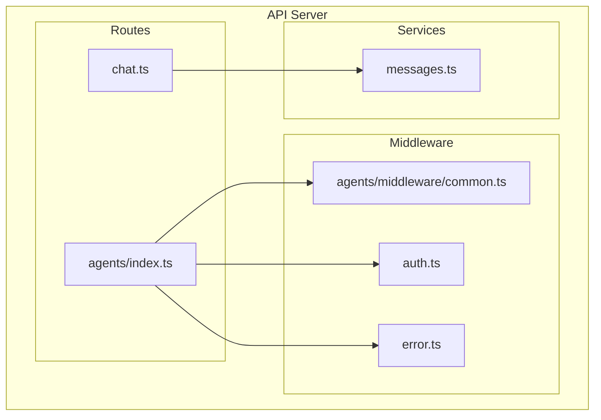
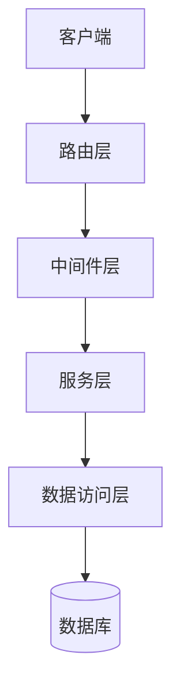
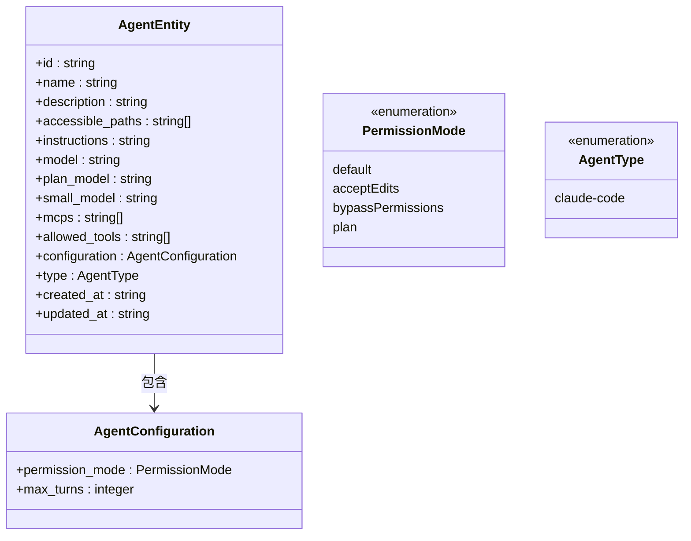
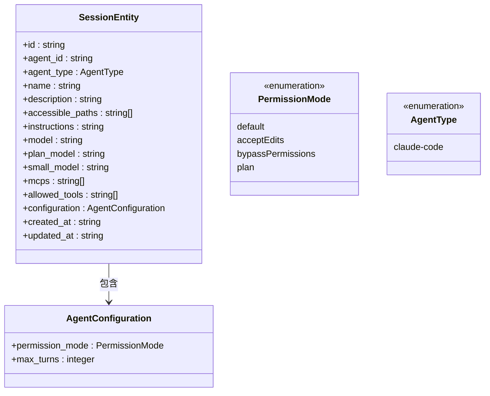
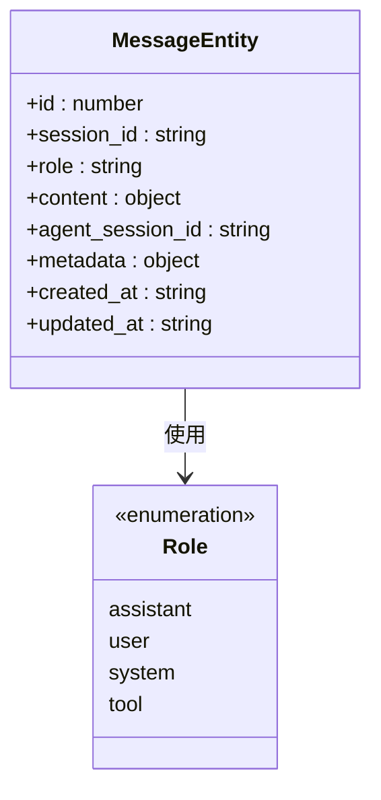
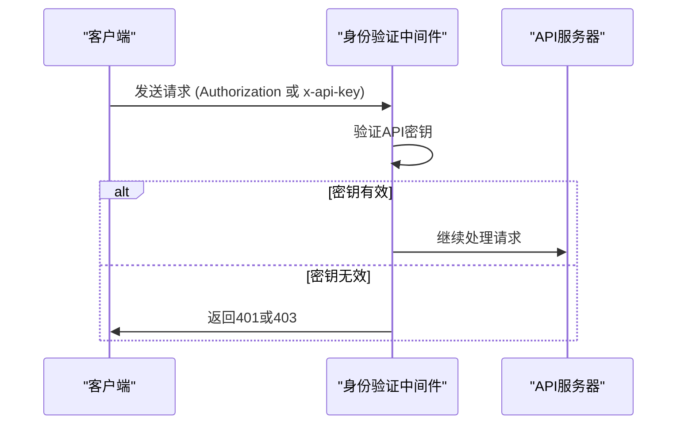
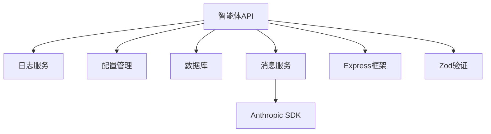

# 智能体API

<cite>
**本文档引用的文件**  
- [agents/index.ts](file://src/main/apiServer/routes/agents/index.ts)
- [agents/middleware/common.ts](file://src/main/apiServer/routes/agents/middleware/common.ts)
- [middleware/auth.ts](file://src/main/apiServer/middleware/auth.ts)
- [middleware/error.ts](file://src/main/apiServer/middleware/error.ts)
- [chat.ts](file://src/main/apiServer/routes/chat.ts)
- [messages.ts](file://src/main/apiServer/services/messages.ts)
</cite>

## 目录
1. [简介](#简介)
2. [项目结构](#项目结构)
3. [核心组件](#核心组件)
4. [架构概述](#架构概述)
5. [详细组件分析](#详细组件分析)
6. [依赖分析](#依赖分析)
7. [性能考虑](#性能考虑)
8. [故障排除指南](#故障排除指南)
9. [结论](#结论)
10. [附录](#附录)（如有必要）

## 简介
本文档详细记录了Cherry Studio智能体API的端点，包括HTTP方法、URL模式、请求/响应模式和身份验证方法。文档涵盖了智能体管理（创建、读取、更新、删除）、会话管理（创建会话、获取会话历史）和消息交互（发送消息、获取消息）的API端点。详细说明了请求参数和响应格式，包括智能体配置、会话状态和消息结构的定义。提供了完整的请求和响应示例，涵盖了各种操作场景。解释了验证逻辑和中间件处理，包括错误处理策略、状态码含义和最佳实践指南。

## 项目结构
Cherry Studio项目具有清晰的模块化结构，主要分为配置、包、资源、脚本和源代码等目录。智能体API主要位于`src/main/apiServer`目录下，包括路由、中间件和服务。`routes/agents`目录包含智能体、会话和消息的路由定义，`middleware`目录包含身份验证和错误处理中间件，`services`目录包含业务逻辑处理服务。

**图示来源**
- [agents/index.ts](file://src/main/apiServer/routes/agents/index.ts)
- [middleware/auth.ts](file://src/main/apiServer/middleware/auth.ts)
- [middleware/error.ts](file://src/main/apiServer/middleware/error.ts)
- [chat.ts](file://src/main/apiServer/routes/chat.ts)
- [messages.ts](file://src/main/apiServer/services/messages.ts)

**章节来源**
- [agents/index.ts](file://src/main/apiServer/routes/agents/index.ts)
- [middleware/auth.ts](file://src/main/apiServer/middleware/auth.ts)

## 核心组件
智能体API的核心组件包括智能体管理、会话管理和消息交互。智能体管理提供创建、读取、更新和删除智能体的功能。会话管理允许为智能体创建会话、列出会话、获取会话详情、更新会话和删除会话。消息交互支持在会话中创建消息和删除消息。所有操作都通过RESTful API端点暴露，并使用中间件进行身份验证和验证。

**章节来源**
- [agents/index.ts](file://src/main/apiServer/routes/agents/index.ts)
- [chat.ts](file://src/main/apiServer/routes/chat.ts)

## 架构概述
智能体API采用分层架构，包括路由层、中间件层、服务层和数据访问层。路由层定义了API端点，中间件层处理身份验证、验证和错误处理，服务层包含业务逻辑，数据访问层与数据库交互。API使用Express框架构建，遵循RESTful设计原则。

**图示来源**
- [agents/index.ts](file://src/main/apiServer/routes/agents/index.ts)
- [middleware/auth.ts](file://src/main/apiServer/middleware/auth.ts)
- [messages.ts](file://src/main/apiServer/services/messages.ts)

## 详细组件分析
### 智能体管理分析
智能体管理API提供对智能体的完整CRUD操作。支持创建、读取、更新和删除智能体。智能体配置包括名称、描述、访问路径、指令、模型、计划模型、小模型、MCP工具、允许的工具和配置。

#### 智能体管理API端点

**图示来源**
- [agents/index.ts](file://src/main/apiServer/routes/agents/index.ts)

**章节来源**
- [agents/index.ts](file://src/main/apiServer/routes/agents/index.ts)

### 会话管理分析
会话管理API允许为智能体创建会话、列出会话、获取会话详情、更新会话和删除会话。会话继承智能体的配置，但可以覆盖某些设置。

#### 会话管理API端点

**图示来源**
- [agents/index.ts](file://src/main/apiServer/routes/agents/index.ts)

**章节来源**
- [agents/index.ts](file://src/main/apiServer/routes/agents/index.ts)

### 消息交互分析
消息交互API支持在会话中创建消息和删除消息。消息包含内容、角色、元数据和时间戳。

#### 消息交互API端点

**图示来源**
- [agents/index.ts](file://src/main/apiServer/routes/agents/index.ts)

**章节来源**
- [agents/index.ts](file://src/main/apiServer/routes/agents/index.ts)

### 身份验证和中间件分析
身份验证和中间件处理API请求的认证、验证和错误处理。使用API密钥进行身份验证，支持Bearer令牌和x-api-key头。

#### 身份验证流程

**图示来源**
- [middleware/auth.ts](file://src/main/apiServer/middleware/auth.ts)

**章节来源**
- [middleware/auth.ts](file://src/main/apiServer/middleware/auth.ts)

## 依赖分析
智能体API依赖于多个内部和外部组件。内部依赖包括日志服务、配置管理、数据库访问和消息服务。外部依赖包括Anthropic SDK和其他第三方服务。API使用Express框架处理HTTP请求，使用Zod进行请求验证。

**图示来源**
- [agents/index.ts](file://src/main/apiServer/routes/agents/index.ts)
- [messages.ts](file://src/main/apiServer/services/messages.ts)
- [middleware/auth.ts](file://src/main/apiServer/middleware/auth.ts)

**章节来源**
- [agents/index.ts](file://src/main/apiServer/routes/agents/index.ts)
- [messages.ts](file://src/main/apiServer/services/messages.ts)

## 性能考虑
智能体API在设计时考虑了性能因素。使用流式响应处理大型消息，减少内存使用和响应时间。API支持分页查询，避免返回大量数据。使用缓存机制提高重复请求的性能。错误处理机制确保在出现异常时API能够优雅地降级。

## 故障排除指南
### 常见错误和解决方案
- **401 Unauthorized**: 检查API密钥是否正确，确保在请求头中正确传递。
- **404 Not Found**: 检查智能体ID或会话ID是否正确，确保资源存在。
- **400 Bad Request**: 检查请求体是否符合API规范，确保所有必需字段都已提供。
- **500 Internal Server Error**: 检查服务器日志，联系技术支持。

### 错误处理策略
API使用统一的错误响应格式，包含错误类型、消息和代码。中间件层捕获所有异常，防止内部错误暴露给客户端。在开发环境中，错误响应包含堆栈跟踪，便于调试。

**章节来源**
- [middleware/error.ts](file://src/main/apiServer/middleware/error.ts)
- [messages.ts](file://src/main/apiServer/services/messages.ts)

## 结论
Cherry Studio智能体API提供了一套完整的RESTful接口，用于管理智能体、会话和消息交互。API设计遵循最佳实践，具有清晰的端点、一致的响应格式和强大的错误处理机制。通过详细的文档和示例，开发者可以轻松集成和使用API功能。

## 附录
### API端点汇总
| 端点 | 方法 | 描述 |
|------|------|------|
| /agents | POST | 创建新智能体 |
| /agents | GET | 列出所有智能体 |
| /agents/{agentId} | GET | 获取智能体详情 |
| /agents/{agentId} | PUT | 替换智能体 |
| /agents/{agentId} | PATCH | 更新智能体 |
| /agents/{agentId} | DELETE | 删除智能体 |
| /agents/{agentId}/sessions | POST | 为智能体创建会话 |
| /agents/{agentId}/sessions | GET | 列出智能体的会话 |
| /agents/{agentId}/sessions/{sessionId} | GET | 获取会话详情 |
| /agents/{agentId}/sessions/{sessionId} | PUT | 替换会话 |
| /agents/{agentId}/sessions/{sessionId} | PATCH | 更新会话 |
| /agents/{agentId}/sessions/{sessionId} | DELETE | 删除会话 |
| /agents/{agentId}/sessions/{sessionId}/messages | POST | 在会话中创建消息 |
| /agents/{agentId}/sessions/{sessionId}/messages/{messageId} | DELETE | 删除消息 |

### 状态码含义
| 状态码 | 含义 |
|--------|------|
| 200 | 请求成功 |
| 201 | 资源创建成功 |
| 204 | 资源删除成功 |
| 400 | 请求无效 |
| 401 | 未授权 |
| 403 | 禁止访问 |
| 404 | 资源未找到 |
| 429 | 请求过多 |
| 500 | 服务器内部错误 |