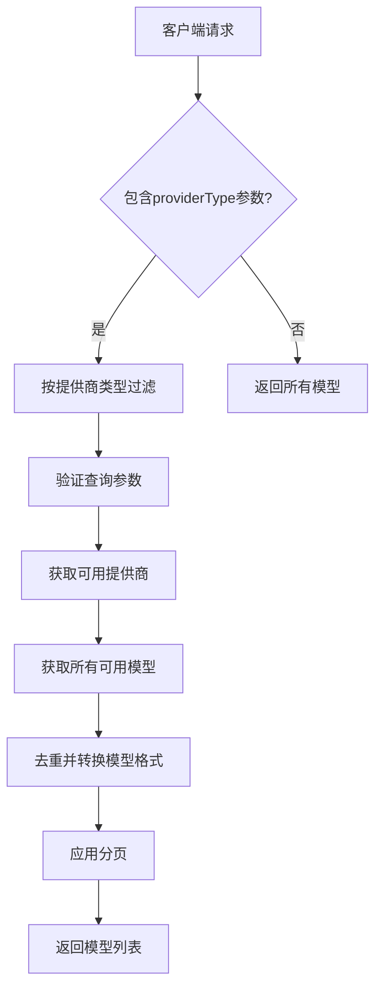
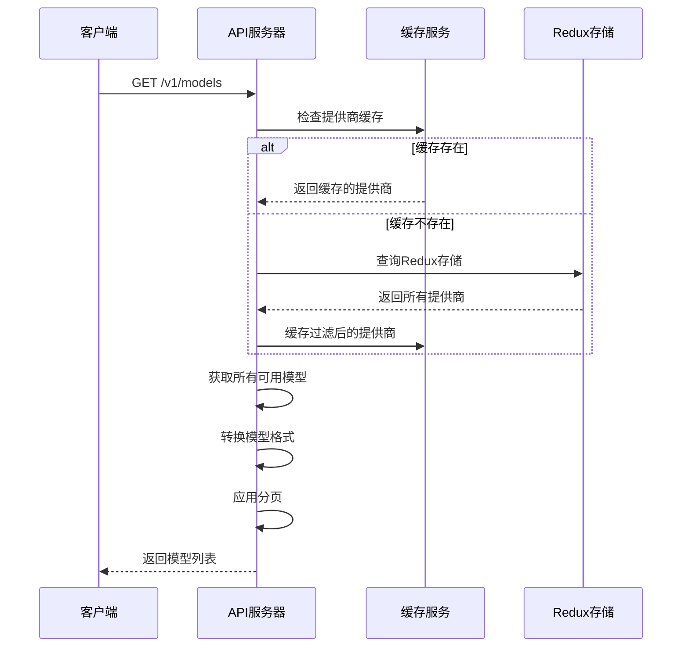
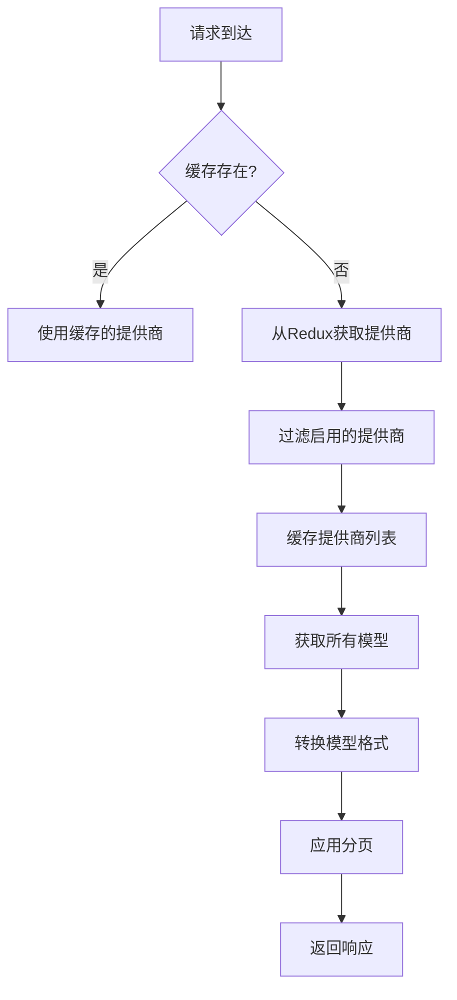
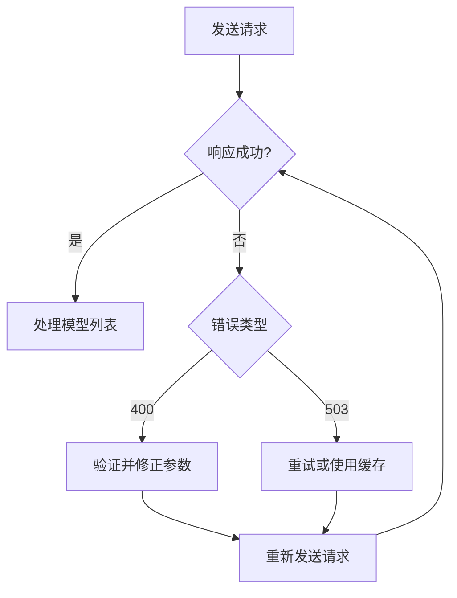

# 模型管理API

<cite>
**本文档引用的文件**  
- [models.ts](file://src/main/apiServer/routes/models.ts)
- [models.ts](file://src/main/apiServer/services/models.ts)
- [apiModels.ts](file://src/renderer/src/types/apiModels.ts)
- [index.ts](file://src/main/apiServer/utils/index.ts)
- [endpointTypes.ts](file://src/renderer/src/config/endpointTypes.ts)
- [provider.ts](file://src/renderer/src/types/provider.ts)
- [CacheService.ts](file://src/main/services/CacheService.ts)
</cite>

## 目录
1. [简介](#简介)
2. [API端点详情](#api端点详情)
3. [响应结构](#响应结构)
4. [模型能力表示](#模型能力表示)
5. [响应示例](#响应示例)
6. [元数据来源与更新机制](#元数据来源与更新机制)
7. [缓存策略与性能考虑](#缓存策略与性能考虑)
8. [客户端使用建议](#客户端使用建议)
9. [错误处理指南](#错误处理指南)

## 简介
Cherry Studio模型管理API提供了一个标准化的接口来获取系统中可用AI模型的列表。该API遵循OpenAI兼容的模型列表格式，允许客户端应用程序发现和使用各种AI提供商的模型。API端点返回详细的模型信息，包括模型ID、名称、提供商信息和功能支持。

**Section sources**
- [models.ts](file://src/main/apiServer/routes/models.ts#L1-L121)
- [models.ts](file://src/main/apiServer/services/models.ts#L1-L114)

## API端点详情
模型管理API通过HTTP GET方法暴露在`/v1/models`路径上，用于获取可用模型的列表。

### HTTP方法
`GET`

### URL模式
`/v1/models`

### 身份验证
该API端点需要有效的身份验证。客户端必须在请求头中包含有效的认证令牌。

### 查询参数
| 参数 | 类型 | 必需 | 描述 | 示例值 |
|------|------|------|------|--------|
| `providerType` | 字符串 | 否 | 按提供商类型过滤模型 | `openai`, `anthropic`, `gemini` |
| `offset` | 整数 | 否 | 分页偏移量，默认为0 | 0, 10, 20 |
| `limit` | 整数 | 否 | 返回模型的最大数量 | 10, 20, 50 |

**Section sources**
- [models.ts](file://src/main/apiServer/routes/models.ts#L14-L77)
- [apiModels.ts](file://src/renderer/src/types/apiModels.ts#L7-L11)

## 响应结构
API响应遵循OpenAI兼容的模型列表格式，包含模型信息的详细字段。

### 响应字段定义
| 字段 | 类型 | 描述 |
|------|------|------|
| `object` | 字符串 | 对象类型，固定为"list" |
| `data` | 数组 | 模型对象数组 |
| `total` | 整数 | 模型总数（分页时） |
| `offset` | 整数 | 当前偏移量（分页时） |
| `limit` | 整数 | 当前限制（分页时） |

### 模型对象字段
| 字段 | 类型 | 描述 |
|------|------|------|
| `id` | 字符串 | 模型唯一标识符，格式为"provider:model_id" |
| `object` | 字符串 | 对象类型，固定为"model" |
| `created` | 数字 | 创建时间戳（Unix时间） |
| `name` | 字符串 | 模型显示名称 |
| `owned_by` | 字符串 | 模型所有者 |
| `provider` | 字符串 | 提供商ID |
| `provider_name` | 字符串 | 提供商显示名称 |
| `provider_type` | 字符串 | 提供商类型 |
| `provider_model_id` | 字符串 | 提供商内部模型ID |

**Section sources**
- [apiModels.ts](file://src/renderer/src/types/apiModels.ts#L14-L24)
- [models.ts](file://src/main/apiServer/services/models.ts#L201-L214)

## 模型能力表示
模型能力通过提供商配置和模型元数据来表示，支持多种AI功能。

### 支持的能力类型
模型能力通过`supported_endpoint_types`字段表示，支持以下能力类型：

- **工具调用**: 通过`openai`和`openai-response`端点类型支持函数调用
- **图像生成**: 通过`image-generation`端点类型支持
- **重排序**: 通过`jina-rerank`端点类型支持
- **嵌入生成**: 通过`openai`端点类型支持
- **推理**: 通过`anthropic`端点类型支持

### 能力表示方式
模型能力在提供商配置中定义，通过`endpoint_type`字段指定。客户端可以通过查询参数`providerType`来过滤特定能力的模型。



**Diagram sources**
- [models.ts](file://src/main/apiServer/routes/models.ts#L78-L118)
- [models.ts](file://src/main/apiServer/services/models.ts#L19-L102)

**Section sources**
- [endpointTypes.ts](file://src/renderer/src/config/endpointTypes.ts#L3-L10)
- [provider.ts](file://src/renderer/src/types/provider.ts#L7-L19)

## 响应示例
以下是模型列表API的JSON响应示例。

### 成功响应示例
```json
{
  "object": "list",
  "data": [
    {
      "id": "openai:gpt-4-turbo",
      "object": "model",
      "created": 1700000000,
      "name": "GPT-4 Turbo",
      "owned_by": "OpenAI",
      "provider": "openai",
      "provider_name": "OpenAI",
      "provider_type": "openai",
      "provider_model_id": "gpt-4-turbo"
    },
    {
      "id": "anthropic:claude-3-opus-20240229",
      "object": "model",
      "created": 1700000000,
      "name": "Claude 3 Opus",
      "owned_by": "Anthropic",
      "provider": "anthropic",
      "provider_name": "Anthropic",
      "provider_type": "anthropic",
      "provider_model_id": "claude-3-opus-20240229"
    }
  ],
  "total": 2,
  "offset": 0,
  "limit": 20
}
```

### 分页响应示例
```json
{
  "object": "list",
  "data": [
    {
      "id": "openai:gpt-3.5-turbo",
      "object": "model",
      "created": 1700000000,
      "name": "GPT-3.5 Turbo",
      "owned_by": "OpenAI",
      "provider": "openai",
      "provider_name": "OpenAI",
      "provider_type": "openai",
      "provider_model_id": "gpt-3.5-turbo"
    }
  ],
  "total": 50,
  "offset": 10,
  "limit": 1
}
```

**Section sources**
- [models.ts](file://src/main/apiServer/services/models.ts#L87-L90)
- [models.ts](file://src/main/apiServer/services/models.ts#L93-L98)

## 元数据来源与更新机制
模型元数据来源于系统配置和提供商注册表，具有动态更新能力。

### 元数据来源
模型元数据主要来源于以下位置：
1. **提供商配置**: 在系统设置中定义的提供商及其模型
2. **系统内置模型**: 预定义的系统模型列表
3. **动态注册表**: 运行时注册的模型

### 更新机制
模型元数据通过以下机制保持更新：
- **缓存机制**: 提供商列表缓存10秒，减少重复查询
- **动态发现**: 每次请求时重新获取可用模型
- **去重处理**: 使用Map数据结构确保模型唯一性



**Diagram sources**
- [models.ts](file://src/main/apiServer/services/models.ts#L23-L48)
- [index.ts](file://src/main/apiServer/utils/index.ts#L13-L48)
- [CacheService.ts](file://src/main/services/CacheService.ts#L1-L75)

**Section sources**
- [models.ts](file://src/main/apiServer/services/models.ts#L23-L34)
- [index.ts](file://src/main/apiServer/utils/index.ts#L13-L48)

## 缓存策略与性能考虑
API实现了多层缓存策略以优化性能和响应时间。

### 缓存策略
- **提供商缓存**: 提供商列表缓存10秒，键名为`api-server:providers`
- **内存缓存**: 使用Map数据结构进行模型去重
- **无响应缓存**: 每次请求都重新生成响应，确保数据最新

### 性能优化
- **并行处理**: 所有模型获取操作并行执行
- **流式处理**: 大量模型列表支持分页流式处理
- **去重优化**: 使用Map数据结构实现O(1)查找性能

### 动态变化处理
当模型注册表发生动态变化时：
1. 缓存自动过期（10秒后）
2. 下次请求重新从Redux存储获取最新数据
3. 新的模型列表被缓存并返回



**Diagram sources**
- [index.ts](file://src/main/apiServer/utils/index.ts#L9-L11)
- [CacheService.ts](file://src/main/services/CacheService.ts#L16-L22)

**Section sources**
- [index.ts](file://src/main/apiServer/utils/index.ts#L10-L11)
- [CacheService.ts](file://src/main/services/CacheService.ts#L1-L75)

## 客户端使用建议
为确保最佳使用体验，建议客户端遵循以下最佳实践。

### 推荐使用模式
- **分页使用**: 对于大量模型，使用`limit`和`offset`参数分页获取
- **缓存响应**: 客户端可缓存响应以减少请求频率
- **错误重试**: 实现指数退避重试机制处理503错误

### 请求最佳实践
```typescript
// 示例：获取所有模型（使用SWR进行缓存）
const { models, error, isLoading } = useApiModels({
  limit: 100,
  offset: 0
})
```

### 性能建议
- **批量获取**: 一次性获取所需模型，减少API调用次数
- **本地缓存**: 在客户端实现本地缓存机制
- **智能刷新**: 根据用户操作触发模型列表刷新

**Section sources**
- [useModels.ts](file://src/renderer/src/hooks/agents/useModels.ts#L8-L35)
- [models.ts](file://src/main/apiServer/routes/models.ts#L80-L81)

## 错误处理指南
API提供详细的错误响应，帮助客户端正确处理各种错误情况。

### 错误类型
| HTTP状态码 | 错误类型 | 原因 | 建议操作 |
|-----------|---------|------|---------|
| 400 | `invalid_request_error` | 查询参数无效 | 检查参数格式和值 |
| 503 | `service_unavailable` | 无法从提供商获取模型 | 重试请求或检查提供商配置 |

### 400错误响应示例
```json
{
  "error": {
    "message": "Invalid query parameters",
    "type": "invalid_request_error",
    "code": "invalid_parameters",
    "details": [
      {
        "field": "limit",
        "message": "Number must be greater than or equal to 1"
      }
    ]
  }
}
```

### 503错误响应示例
```json
{
  "error": {
    "message": "Failed to retrieve models from available providers",
    "type": "service_unavailable",
    "code": "models_unavailable"
  }
}
```

### 错误处理建议
- **验证输入**: 在发送请求前验证查询参数
- **优雅降级**: 当API不可用时，显示缓存的模型列表
- **用户提示**: 向用户提供清晰的错误信息和解决方案



**Diagram sources**
- [models.ts](file://src/main/apiServer/routes/models.ts#L85-L98)
- [models.ts](file://src/main/apiServer/routes/models.ts#L109-L116)

**Section sources**
- [models.ts](file://src/main/apiServer/routes/models.ts#L85-L98)
- [models.ts](file://src/main/apiServer/routes/models.ts#L109-L116)