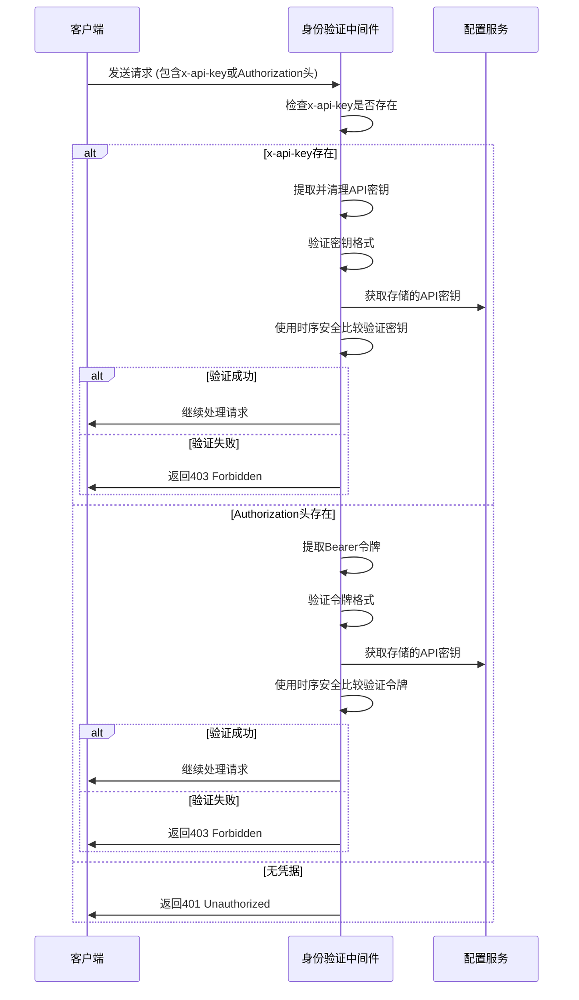
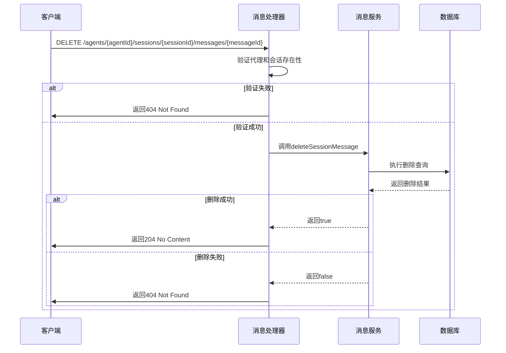
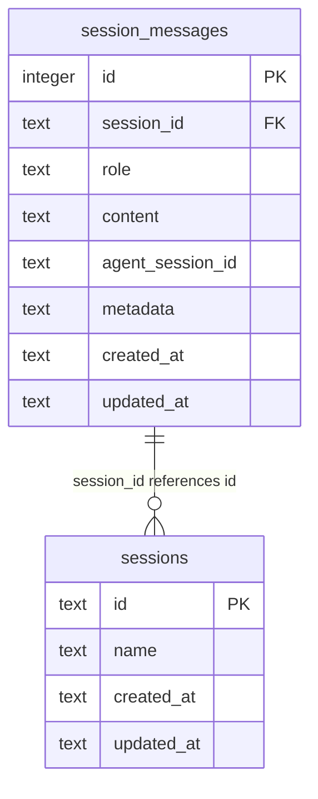

# 消息管理API

<cite>
**本文档中引用的文件**  
- [messages.ts](file://src/main/apiServer/routes/messages.ts)
- [messages.schema.ts](file://src/main/services/agents/database/schema/messages.schema.ts)
- [messages.ts](file://src/main/apiServer/services/messages.ts)
- [auth.ts](file://src/main/apiServer/middleware/auth.ts)
- [sessionMessageService.ts](file://src/main/services/agents/services/sessionMessageService.ts)
- [agents.ts](file://src/main/apiServer/routes/agents/index.ts)
</cite>

## 目录
1. [简介](#简介)
2. [API端点](#api端点)
3. [身份验证方法](#身份验证方法)
4. [获取消息历史](#获取消息历史)
5. [删除消息](#删除消息)
6. [分页参数](#分页参数)
7. [响应格式](#响应格式)
8. [请求示例](#请求示例)
9. [响应示例](#响应示例)
10. [消息存储结构](#消息存储结构)
11. [查询逻辑](#查询逻辑)
12. [软删除机制](#软删除机制)
13. [数据保留策略](#数据保留策略)
14. [性能优化建议](#性能优化建议)

## 简介
Cherry Studio消息管理API提供了一套完整的消息管理功能，支持创建、获取和删除消息操作。API遵循RESTful设计原则，使用标准的HTTP方法和状态码。该API主要用于管理会话中的消息记录，支持分页查询和流式响应。API设计考虑了性能和安全性，通过身份验证保护资源，并提供详细的错误响应。

**Section sources**
- [messages.ts](file://src/main/apiServer/routes/messages.ts#L85-L404)

## API端点
消息管理API提供了多个端点用于不同的操作：

- `POST /v1/messages`：创建消息
- `POST /{provider_id}/v1/messages`：使用提供程序ID创建消息
- `GET /agents/{agentId}/sessions/{sessionId}/messages`：获取会话中的消息历史
- `DELETE /agents/{agentId}/sessions/{sessionId}/messages/{messageId}`：删除特定消息

这些端点支持不同的使用场景，包括通用消息创建和特定提供程序的消息创建。API路径设计遵循层次化结构，便于资源定位和管理。

**Section sources**
- [messages.ts](file://src/main/apiServer/routes/messages.ts#L85-L404)
- [agents.ts](file://src/main/apiServer/routes/agents/index.ts#L831-L965)

## 身份验证方法
消息管理API使用基于API密钥的身份验证机制。客户端可以通过以下两种方式提供凭据：

1. **X-API-Key头**：在请求头中包含`x-api-key`字段
2. **Bearer令牌**：在Authorization头中使用Bearer方案

身份验证中间件首先检查`x-api-key`头，如果存在则优先使用。如果`x-api-key`不存在，则检查Bearer令牌作为备用方案。验证过程使用安全的时序安全比较（timing-safe comparison）来防止时序攻击。



**Diagram sources**
- [auth.ts](file://src/main/apiServer/middleware/auth.ts#L1-L67)

**Section sources**
- [auth.ts](file://src/main/apiServer/middleware/auth.ts#L1-L67)

## 获取消息历史
获取消息历史端点允许客户端检索特定会话中的消息记录。该端点支持分页查询，可以通过查询参数控制返回结果的数量和偏移量。

请求方法：`GET`
URL模式：`/agents/{agentId}/sessions/{sessionId}/messages`

该端点首先验证代理ID和会话ID的存在性，然后从数据库中检索相关消息。消息按创建时间排序，确保返回有序的结果集。查询结果可以使用limit和offset参数进行分页控制。

**Section sources**
- [sessionMessageService.ts](file://src/main/services/agents/services/sessionMessageService.ts#L118-L140)

## 删除消息
删除消息端点允许客户端从会话中移除特定消息。该操作是永久性删除，不会触发软删除机制。

请求方法：`DELETE`
URL模式：`/agents/{agentId}/sessions/{sessionId}/messages/{messageId}`

删除操作需要验证以下条件：
1. 代理ID和会话ID的有效性
2. 消息ID的存在性
3. 消息属于指定会话

如果所有验证通过，系统将从数据库中删除对应的消息记录，并返回204 No Content响应。如果消息不存在，则返回404 Not Found响应。



**Diagram sources**
- [agents.ts](file://src/main/apiServer/routes/agents/index.ts#L910-L945)

**Section sources**
- [agents.ts](file://src/main/apiServer/routes/agents/index.ts#L910-L945)
- [sessionMessageService.ts](file://src/main/services/agents/services/sessionMessageService.ts#L142-L149)

## 分页参数
消息查询支持以下分页参数：

- **limit**：指定返回结果的最大数量。如果未指定，则返回所有匹配的消息。
- **offset**：指定从结果集的哪个位置开始返回消息。与limit参数结合使用可实现分页。

当同时提供limit和offset参数时，系统首先应用offset偏移，然后限制返回结果的数量。分页查询在数据库层面执行，确保高效的数据检索。建议客户端合理使用分页参数，避免一次性请求过多数据导致性能问题。

**Section sources**
- [sessionMessageService.ts](file://src/main/services/agents/services/sessionMessageService.ts#L118-L140)

## 响应格式
API响应采用JSON格式，包含以下主要字段：

- **id**：消息的唯一标识符
- **type**：消息类型，固定为"message"
- **role**：消息角色，如"user"或"assistant"
- **content**：消息内容，可以是字符串或对象数组
- **model**：使用的模型标识符
- **stop_reason**：生成停止原因
- **stop_sequence**：停止序列
- **usage**：使用统计，包含输入和输出token数量

错误响应包含以下字段：
- **type**：错误类型，固定为"error"
- **error**：错误详情对象，包含type、message和可选的requestId字段

**Section sources**
- [messages.ts](file://src/main/apiServer/routes/messages.ts#L148-L183)

## 请求示例
以下是创建消息的请求示例：

```json
POST /v1/messages
Content-Type: application/json
x-api-key: your-api-key

{
  "model": "my-anthropic:claude-3-5-sonnet-20241022",
  "max_tokens": 1024,
  "messages": [
    {
      "role": "user",
      "content": "Hello, how are you?"
    }
  ],
  "temperature": 0.7
}
```

获取消息历史的请求示例：

```http
GET /agents/agent-123/sessions/session-456/messages?limit=10&offset=0
x-api-key: your-api-key
```

删除消息的请求示例：

```http
DELETE /agents/agent-123/sessions/session-456/messages/789
x-api-key: your-api-key
```

**Section sources**
- [messages.ts](file://src/main/apiServer/routes/messages.ts#L85-L404)

## 响应示例
成功创建消息的响应示例：

```json
{
  "id": "msg-123",
  "type": "message",
  "role": "assistant",
  "content": [
    {
      "type": "text",
      "text": "I'm doing well, thank you for asking!"
    }
  ],
  "model": "claude-3-5-sonnet-20241022",
  "stop_reason": "end_turn",
  "stop_sequence": null,
  "usage": {
    "input_tokens": 15,
    "output_tokens": 23
  }
}
```

获取消息历史的响应示例：

```json
{
  "messages": [
    {
      "id": 1,
      "session_id": "session-456",
      "role": "user",
      "content": "{\"type\":\"text\",\"text\":\"Hello\"}",
      "created_at": "2024-01-01T00:00:00Z",
      "updated_at": "2024-01-01T00:00:00Z"
    },
    {
      "id": 2,
      "session_id": "session-456",
      "role": "assistant",
      "content": "{\"type\":\"text\",\"text\":\"Hi there!\"}",
      "created_at": "2024-01-01T00:00:01Z",
      "updated_at": "2024-01-01T00:00:01Z"
    }
  ]
}
```

错误响应示例：

```json
{
  "type": "error",
  "error": {
    "type": "invalid_request_error",
    "message": "Model is required"
  }
}
```

**Section sources**
- [messages.ts](file://src/main/apiServer/routes/messages.ts#L148-L183)

## 消息存储结构
消息存储使用SQLite数据库，通过Drizzle ORM进行管理。消息表（session_messages）包含以下字段：

- **id**：主键，自增整数
- **session_id**：会话ID，文本类型，非空
- **role**：角色，文本类型，非空（可选值：'user', 'agent', 'system', 'tool'）
- **content**：内容，文本类型，非空（存储JSON结构化数据）
- **agent_session_id**：代理会话ID，文本类型，默认为空字符串
- **metadata**：元数据，文本类型（可选，存储JSON数据）
- **created_at**：创建时间，文本类型，非空
- **updated_at**：更新时间，文本类型，非空

表上定义了多个索引以优化查询性能：
- session_id索引：加速按会话ID查询
- created_at索引：加速按创建时间排序和范围查询
- updated_at索引：加速按更新时间查询

外键约束确保消息与会话的引用完整性，删除会话时自动级联删除相关消息。



**Diagram sources**
- [messages.schema.ts](file://src/main/services/agents/database/schema/messages.schema.ts#L6-L31)

**Section sources**
- [messages.schema.ts](file://src/main/services/agents/database/schema/messages.schema.ts#L6-L31)

## 查询逻辑
消息查询逻辑在SessionMessageService中实现。查询过程包括以下步骤：

1. 建立数据库连接
2. 构建基础查询，筛选特定会话ID的消息
3. 按创建时间排序
4. 应用分页参数（limit和offset）
5. 执行查询并获取结果
6. 反序列化结果中的JSON字段（content和metadata）
7. 返回消息实体数组

查询使用参数化语句防止SQL注入攻击。分页查询在数据库层面执行，确保高效的数据检索。对于大数据集，建议使用limit参数限制返回结果数量。

**Section sources**
- [sessionMessageService.ts](file://src/main/services/agents/services/sessionMessageService.ts#L118-L140)

## 软删除机制
根据代码分析，当前消息管理API未实现软删除机制。删除操作是永久性的，直接从数据库中移除记录。`deleteSessionMessage`方法使用DELETE SQL语句从`session_messages`表中删除指定消息，没有标记删除状态或保留记录。

如果需要实现软删除，建议添加`deleted_at`字段来标记删除时间，而不是物理删除记录。这将允许恢复误删的消息并维护数据完整性。

**Section sources**
- [sessionMessageService.ts](file://src/main/services/agents/services/sessionMessageService.ts#L142-L149)

## 数据保留策略
当前系统没有明确的数据保留策略实现。消息记录将永久存储在数据库中，直到被显式删除。由于使用外键约束和级联删除，当会话被删除时，相关消息也会被自动删除。

建议实施以下数据保留策略：
1. 定期归档旧消息
2. 实现基于时间的数据保留规则
3. 提供批量删除功能
4. 添加数据导出功能

这些策略可以帮助管理存储空间并满足数据隐私要求。

**Section sources**
- [messages.schema.ts](file://src/main/services/agents/database/schema/messages.schema.ts#L23-L27)

## 性能优化建议
为了优化消息管理API的性能，建议采取以下措施：

1. **合理使用分页**：始终使用limit参数限制返回结果数量，避免一次性请求过多数据。
2. **利用索引**：查询时尽量使用已建立索引的字段（如session_id和created_at）。
3. **批量操作**：对于大量消息的创建或删除，考虑实现批量处理接口。
4. **缓存策略**：对于频繁访问但不经常变化的消息历史，可以实现缓存机制。
5. **连接池**：确保数据库连接得到有效管理，避免频繁创建和销毁连接。
6. **监控和分析**：定期监控API性能，识别慢查询并进行优化。

此外，建议客户端实现适当的重试逻辑和错误处理，以应对临时性故障。

**Section sources**
- [sessionMessageService.ts](file://src/main/services/agents/services/sessionMessageService.ts#L118-L140)
- [messages.ts](file://src/main/apiServer/services/messages.ts#L146-L233)