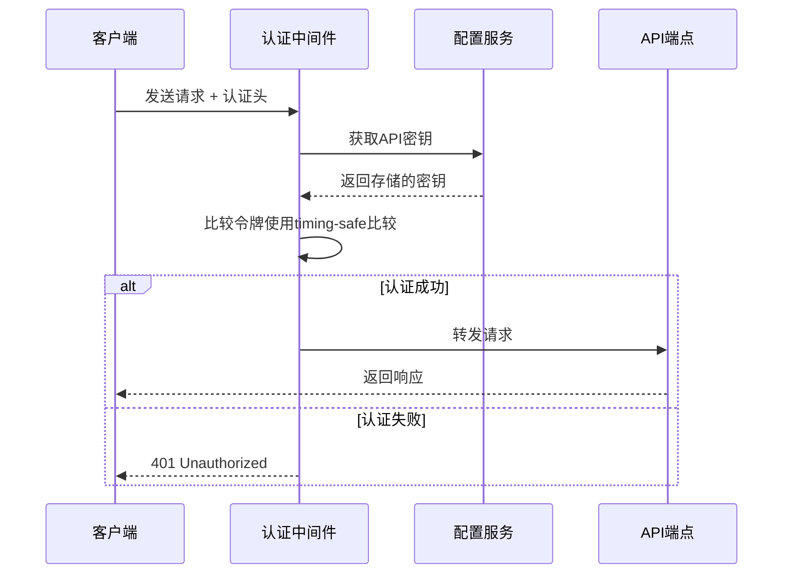
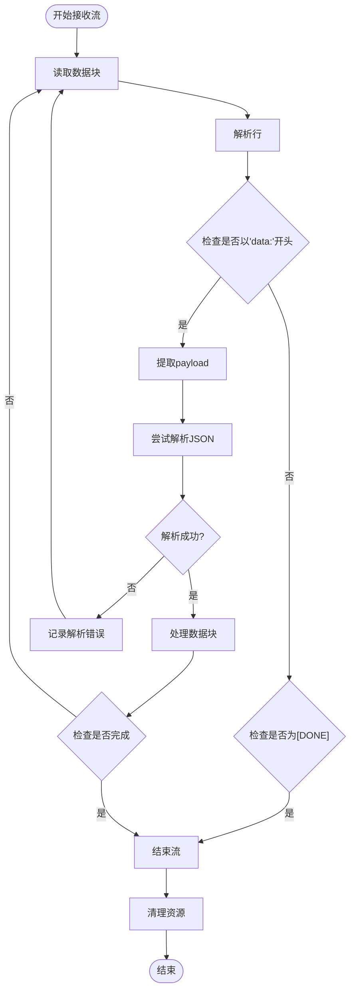
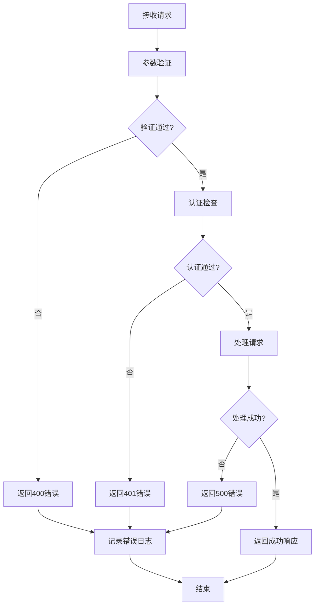
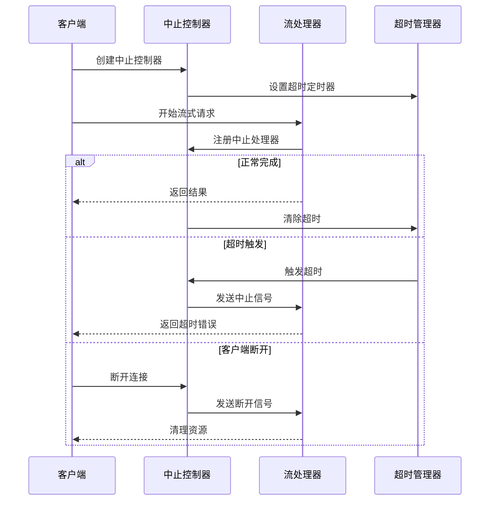

# Cherry Studio 聊天API详细文档

<cite>
**本文档引用的文件**
- [chat.ts](file://src/main/apiServer/routes/chat.ts)
- [chat-completion.ts](file://src/main/apiServer/services/chat-completion.ts)
- [auth.ts](file://src/main/apiServer/middleware/auth.ts)
- [createStreamAbortController.ts](file://src/main/apiServer/utils/createStreamAbortController.ts)
- [timeouts.ts](file://src/main/apiServer/config/timeouts.ts)
- [error.ts](file://src/main/apiServer/middleware/error.ts)
- [useSmoothStream.ts](file://src/renderer/src/hooks/useSmoothStream.ts)
- [messageThunk.ts](file://src/renderer/src/store/thunk/messageThunk.ts)
- [apiServer.ts](file://src/renderer/src/types/apiServer.ts)
</cite>

## 目录
1. [简介](#简介)
2. [API概述](#api概述)
3. [认证机制](#认证机制)
4. [请求格式](#请求格式)
5. [响应格式](#响应格式)
6. [流式响应处理](#流式响应处理)
7. [错误处理](#错误处理)
8. [超时与中止机制](#超时与中止机制)
9. [性能优化](#性能优化)
10. [客户端实现指南](#客户端实现指南)
11. [安全注意事项](#安全注意事项)
12. [故障排除](#故障排除)

## 简介

Cherry Studio聊天API是一个兼容OpenAI API规范的聊天完成服务，提供文本生成和对话交互功能。该API支持同步和流式两种响应模式，具备完善的错误处理、认证机制和性能优化特性。

## API概述

### 基本信息

- **协议**: HTTPS
- **内容类型**: `application/json`
- **编码**: UTF-8
- **版本**: v1

### 端点地址

```
POST https://api.cherrystudio.com/v1/chat/completions
```

### 支持的功能

- 文本聊天完成
- 流式响应处理
- 多模型支持
- 实时错误报告
- 完整的认证机制

## 认证机制

### Bearer Token认证

API使用Bearer Token进行身份验证，支持两种认证方式：

#### 方式一：Authorization Header
```http
Authorization: Bearer YOUR_API_KEY
```

#### 方式二：X-API-Key Header
```http
X-API-Key: YOUR_API_KEY
```

### 认证流程



**图表来源**
- [auth.ts](file://src/main/apiServer/middleware/auth.ts#L15-L67)

### 安全特性

- 使用定时安全比较防止时序攻击
- 支持优先级认证（X-API-Key > Authorization）
- 空白字符处理
- 异常情况下的安全拒绝

**章节来源**
- [auth.ts](file://src/main/apiServer/middleware/auth.ts#L1-L67)

## 请求格式

### 基本结构

```json
{
  "model": "gpt-4",
  "messages": [
    {
      "role": "system",
      "content": "你是一个有用的助手。"
    },
    {
      "role": "user", 
      "content": "你好，请介绍一下自己。"
    }
  ],
  "temperature": 0.7,
  "max_tokens": 150,
  "stream": false
}
```

### 参数详解

| 参数名 | 类型 | 必需 | 描述 | 默认值 |
|--------|------|------|------|--------|
| `model` | string | 是 | 模型标识符 | - |
| `messages` | array | 是 | 对话消息数组 | - |
| `temperature` | number | 否 | 控制随机性（0.0-2.0） | 1.0 |
| `max_tokens` | number | 否 | 最大生成token数 | - |
| `stream` | boolean | 否 | 是否启用流式响应 | false |
| `top_p` | number | 否 | 核采样参数（0.0-1.0） | 1.0 |
| `frequency_penalty` | number | 否 | 频率惩罚（-2.0-2.0） | 0.0 |
| `presence_penalty` | number | 否 | 存在惩罚（-2.0-2.0） | 0.0 |
| `stop` | string/array | 否 | 停止序列 | - |

### 消息格式

每个消息对象包含以下字段：

| 字段 | 类型 | 必需 | 描述 |
|------|------|------|------|
| `role` | string | 是 | 角色类型：system、user、assistant |
| `content` | string | 是 | 消息内容 |
| `name` | string | 否 | 发送者名称（可选） |

### 示例请求

#### 同步请求
```bash
curl -X POST "https://api.cherrystudio.com/v1/chat/completions" \
  -H "Content-Type: application/json" \
  -H "Authorization: Bearer YOUR_API_KEY" \
  -d '{
    "model": "gpt-4",
    "messages": [
      {
        "role": "user",
        "content": "解释一下量子计算的基本原理。"
      }
    ],
    "temperature": 0.3,
    "max_tokens": 200
  }'
```

#### 流式请求
```bash
curl -X POST "https://api.cherrystudio.com/v1/chat/completions" \
  -H "Content-Type: application/json" \
  -H "Authorization: Bearer YOUR_API_KEY" \
  -d '{
    "model": "gpt-4",
    "messages": [
      {
        "role": "user",
        "content": "写一首关于春天的诗。"
      }
    ],
    "stream": true
  }'
```

**章节来源**
- [chat.ts](file://src/main/apiServer/routes/chat.ts#L183-L245)
- [chat-completion.ts](file://src/main/apiServer/services/chat-completion.ts#L128-L155)

## 响应格式

### 同步响应

```json
{
  "id": "chatcmpl-123",
  "object": "chat.completion",
  "created": 1677652288,
  "model": "gpt-4",
  "choices": [
    {
      "index": 0,
      "message": {
        "role": "assistant",
        "content": "量子计算是一种利用量子力学原理进行信息处理的计算方式..."
      },
      "finish_reason": "stop"
    }
  ],
  "usage": {
    "prompt_tokens": 25,
    "completion_tokens": 150,
    "total_tokens": 175
  }
}
```

### 响应字段说明

| 字段 | 类型 | 描述 |
|------|------|------|
| `id` | string | 响应唯一标识符 |
| `object` | string | 对象类型，固定为"chat.completion" |
| `created` | integer | 创建时间戳 |
| `model` | string | 使用的模型名称 |
| `choices` | array | 结果候选列表 |
| `usage` | object | token使用统计 |

### Choices对象结构

```json
{
  "index": 0,
  "message": {
    "role": "assistant",
    "content": "回复内容",
    "tool_calls": []  // 工具调用（如果适用）
  },
  "finish_reason": "stop"
}
```

### Finish Reasons

| 原因 | 描述 |
|------|------|
| `stop` | 正常完成 |
| `length` | 达到最大token限制 |
| `tool_calls` | 调用了工具 |
| `content_filter` | 内容被过滤 |

**章节来源**
- [chat.ts](file://src/main/apiServer/routes/chat.ts#L104-L182)

## 流式响应处理

### SSE格式规范

流式响应采用Server-Sent Events (SSE) 格式，每条消息以`data:`开头：

```
data: {"id":"chatcmpl-1","object":"chat.completion.chunk","created":1677652288,"model":"gpt-4","choices":[{"index":0,"delta":{"role":"assistant","content":"这是"},"finish_reason":null}]}

data: {"id":"chatcmpl-1","object":"chat.completion.chunk","created":1677652288,"model":"gpt-4","choices":[{"index":0,"delta":{"content":"一个"},"finish_reason":null}]}

data: [DONE]
```

### 数据解析流程



**图表来源**
- [messageThunk.ts](file://src/renderer/src/store/thunk/messageThunk.ts#L241-L275)

### 客户端处理示例

#### JavaScript实现

```javascript
async function handleStreamResponse(response) {
  const reader = response.body.getReader();
  const decoder = new TextDecoder();
  let buffer = '';
  
  while (true) {
    const { done, value } = await reader.read();
    if (done) break;
    
    buffer += decoder.decode(value, { stream: true });
    
    // 分割完整的消息
    const lines = buffer.split('\n');
    buffer = lines.pop(); // 保留未完成的行
    
    for (const line of lines) {
      if (line.startsWith('data: ')) {
        const data = line.slice(6);
        
        if (data === '[DONE]') {
          console.log('流处理完成');
          return;
        }
        
        try {
          const chunk = JSON.parse(data);
          // 处理数据块
          processChunk(chunk);
        } catch (error) {
          console.error('解析错误:', error);
        }
      }
    }
  }
}
```

#### React Hook实现

使用[`useSmoothStream`](file://src/renderer/src/hooks/useSmoothStream.ts#L13-L97)钩子可以实现平滑的流式显示效果：

```typescript
const { addChunk, reset } = useSmoothStream({
  onUpdate: (text) => {
    // 更新UI显示
    setDisplayText(text);
  },
  streamDone: streamComplete,
  minDelay: 10, // 最小延迟
  initialText: '' // 初始文本
});
```

**章节来源**
- [chat.ts](file://src/main/apiServer/routes/chat.ts#L206-L233)
- [messageThunk.ts](file://src/renderer/src/store/thunk/messageThunk.ts#L234-L275)
- [useSmoothStream.ts](file://src/renderer/src/hooks/useSmoothStream.ts#L1-L97)

## 错误处理

### 错误响应格式

所有错误响应都遵循统一格式：

```json
{
  "error": {
    "message": "错误描述信息",
    "type": "错误类型",
    "code": "错误代码"
  }
}
```

### HTTP状态码映射

| 状态码 | 错误类型 | 描述 | 场景 |
|--------|----------|------|------|
| 400 | `invalid_request_error` | 请求无效 | 参数验证失败、缺少必需参数 |
| 401 | `authentication_error` | 认证失败 | API密钥无效或缺失 |
| 429 | `rate_limit_error` | 速率限制 | 请求频率超过限制 |
| 500 | `server_error` | 服务器错误 | 内部处理错误 |
| 502 | `upstream_error` | 上游错误 | 连接超时或上游服务不可用 |

### 具体错误类型

#### 请求验证错误
```json
{
  "error": {
    "message": "Messages array is required; Messages must be an array",
    "type": "invalid_request_error",
    "code": "validation_failed"
  }
}
```

#### 模型错误
```json
{
  "error": {
    "message": "Model 'invalid-model' not found",
    "type": "invalid_request_error", 
    "code": "model_not_found"
  }
}
```

#### 认证错误
```json
{
  "error": {
    "message": "Invalid API key",
    "type": "authentication_error",
    "code": "invalid_api_key"
  }
}
```

#### 速率限制错误
```json
{
  "error": {
    "message": "Rate limit exceeded",
    "type": "rate_limit_error",
    "code": "rate_limit_exceeded"
  }
}
```

### 错误处理流程



**图表来源**
- [chat.ts](file://src/main/apiServer/routes/chat.ts#L24-L102)

**章节来源**
- [chat.ts](file://src/main/apiServer/routes/chat.ts#L24-L102)
- [chat-completion.ts](file://src/main/apiServer/services/chat-completion.ts#L16-L55)
- [error.ts](file://src/main/apiServer/middleware/error.ts#L1-L22)

## 超时与中止机制

### 超时配置

系统提供了多层次的超时保护机制：

```typescript
// 主要超时设置
export const LONG_POLL_TIMEOUT_MS = 120 * 60_000; // 120分钟
export const MESSAGE_STREAM_TIMEOUT_MS = LONG_POLL_TIMEOUT_MS; // 消息流超时
```

### 中止控制器实现

使用[`createStreamAbortController`](file://src/main/apiServer/utils/createStreamAbortController.ts#L15-L65)创建流式请求的中止控制：

```typescript
interface CreateStreamAbortControllerOptions {
  timeoutMs: number; // 超时时间（毫秒）
}

export const createStreamAbortController = (options: CreateStreamAbortControllerOptions): StreamAbortController => {
  const { timeoutMs } = options;
  const abortController = new AbortController();
  const signal = abortController.signal;
  
  // 设置超时
  if (timeoutMs > 0) {
    setTimeout(() => {
      if (!signal.aborted) {
        abortController.abort(STREAM_TIMEOUT_REASON);
      }
    }, timeoutMs);
  }
  
  return {
    abortController,
    registerAbortHandler,
    clearAbortTimeout
  };
};
```

### 中止处理流程



**图表来源**
- [createStreamAbortController.ts](file://src/main/apiServer/utils/createStreamAbortController.ts#L15-L65)

### 中止原因类型

| 原因 | 描述 | 处理方式 |
|------|------|----------|
| `stream timeout` | 流式响应超时 | 返回超时错误 |
| `Client disconnected` | 客户端断开连接 | 清理资源 |
| `手动中止` | 用户主动取消 | 返回取消状态 |

**章节来源**
- [timeouts.ts](file://src/main/apiServer/config/timeouts.ts#L1-L4)
- [createStreamAbortController.ts](file://src/main/apiServer/utils/createStreamAbortController.ts#L1-L65)

## 性能优化

### 流式显示优化

#### 平滑渲染算法

[`useSmoothStream`](file://src/renderer/src/hooks/useSmoothStream.ts#L13-L97)实现了智能的流式显示优化：

```typescript
// 动态计算渲染字符数
let charsToRenderCount = Math.max(1, Math.floor(chunkQueueRef.current.length / 5));

// 流结束时一次性渲染
if (streamDone) {
  charsToRenderCount = chunkQueueRef.current.length;
}
```

#### 国际化分段处理

```typescript
const languages = ['en-US', 'de-DE', 'es-ES', 'zh-CN', 'zh-TW', 'ja-JP', 'ru-RU', 'el-GR', 'fr-FR', 'pt-PT'];
const segmenter = new Intl.Segmenter(languages);

// 按语言环境分割文本
const chars = Array.from(segmenter.segment(chunk)).map((s) => s.segment);
```

### 节流与防抖

#### 消息块更新节流

```typescript
// 节流器函数
const throttler = getBlockThrottler(messageId);
throttler(blockUpdate);
```

#### 动画帧优化

```typescript
// 使用requestAnimationFrame实现平滑动画
const renderLoop = useCallback((currentTime: number) => {
  if (currentTime - lastUpdateTimeRef.current < minDelay) {
    animationFrameRef.current = requestAnimationFrame(renderLoop);
    return;
  }
  
  // 执行渲染逻辑...
  
  if (chunkQueueRef.current.length > 0) {
    animationFrameRef.current = requestAnimationFrame(renderLoop);
  }
}, [minDelay]);
```

### 缓存策略

- **模型验证缓存**: 避免重复验证相同的模型ID
- **响应缓存**: 对于相同请求的结果进行缓存
- **连接池**: 复用HTTP连接减少建立连接的开销

### 性能监控指标

| 指标 | 描述 | 目标值 |
|------|------|--------|
| 响应时间 | 从请求到首次响应的时间 | < 2秒 |
| 流式延迟 | 首个数据块到达时间 | < 500ms |
| 吞吐量 | 每秒处理的请求数 | > 100 QPS |
| 错误率 | 失败请求的比例 | < 1% |

**章节来源**
- [useSmoothStream.ts](file://src/renderer/src/hooks/useSmoothStream.ts#L1-L97)
- [messageThunk.ts](file://src/renderer/src/store/thunk/messageThunk.ts#L414-L461)

## 客户端实现指南

### 基础HTTP客户端实现

#### JavaScript/Node.js示例

```javascript
class CherryStudioClient {
  constructor(apiKey, baseUrl = 'https://api.cherrystudio.com') {
    this.apiKey = apiKey;
    this.baseUrl = baseUrl;
    this.abortControllers = new Map();
  }
  
  async chatCompletion(request) {
    const controller = new AbortController();
    const signal = controller.signal;
    
    // 设置超时
    const timeout = setTimeout(() => {
      controller.abort('Request timeout');
    }, 30000); // 30秒超时
    
    try {
      const response = await fetch(`${this.baseUrl}/v1/chat/completions`, {
        method: 'POST',
        headers: {
          'Content-Type': 'application/json',
          'Authorization': `Bearer ${this.apiKey}`,
          'Accept': request.stream ? 'text/event-stream' : 'application/json'
        },
        body: JSON.stringify(request),
        signal
      });
      
      clearTimeout(timeout);
      
      if (request.stream) {
        return this.handleStreamResponse(response);
      } else {
        return response.json();
      }
    } catch (error) {
      clearTimeout(timeout);
      throw error;
    }
  }
  
  handleStreamResponse(response) {
    // 实现流式响应处理
    return this.processStream(response.body);
  }
  
  processStream(stream) {
    const reader = stream.getReader();
    const decoder = new TextDecoder();
    let buffer = '';
    
    return new ReadableStream({
      start(controller) {
        function pump() {
          return reader.read().then(({ done, value }) => {
            if (done) {
              controller.close();
              return;
            }
            
            buffer += decoder.decode(value, { stream: true });
            const lines = buffer.split('\n');
            buffer = lines.pop();
            
            for (const line of lines) {
              if (line.startsWith('data: ')) {
                const data = line.slice(6);
                if (data === '[DONE]') {
                  controller.close();
                  return;
                }
                
                try {
                  const chunk = JSON.parse(data);
                  controller.enqueue(chunk);
                } catch (error) {
                  console.error('解析错误:', error);
                }
              }
            }
            
            return pump();
          });
        }
        
        return pump();
      }
    });
  }
  
  cancelRequest(requestId) {
    const controller = this.abortControllers.get(requestId);
    if (controller) {
      controller.abort('Request cancelled by user');
      this.abortControllers.delete(requestId);
    }
  }
}
```

#### TypeScript实现

```typescript
interface ChatCompletionRequest {
  model: string;
  messages: ChatMessage[];
  temperature?: number;
  max_tokens?: number;
  stream?: boolean;
  top_p?: number;
  frequency_penalty?: number;
  presence_penalty?: number;
  stop?: string | string[];
}

interface ChatMessage {
  role: 'system' | 'user' | 'assistant';
  content: string;
  name?: string;
}

interface ChatCompletionResponse {
  id: string;
  object: 'chat.completion';
  created: number;
  model: string;
  choices: Choice[];
  usage: Usage;
}

interface Choice {
  index: number;
  message: Message;
  finish_reason: 'stop' | 'length' | 'tool_calls' | 'content_filter';
}

interface Message {
  role: 'system' | 'user' | 'assistant';
  content: string;
}

interface Usage {
  prompt_tokens: number;
  completion_tokens: number;
  total_tokens: number;
}
```

### 流式数据解析方法

#### React组件实现

```tsx
import React, { useState, useEffect } from 'react';

interface StreamingChatProps {
  client: CherryStudioClient;
  request: ChatCompletionRequest;
}

const StreamingChat: React.FC<StreamingChatProps> = ({ client, request }) => {
  const [messages, setMessages] = useState<string>('');
  const [isLoading, setIsLoading] = useState<boolean>(false);
  
  const handleStreamingResponse = async () => {
    setIsLoading(true);
    setMessages('');
    
    try {
      const response = await client.chatCompletion({
        ...request,
        stream: true
      });
      
      const reader = response.getReader();
      const decoder = new TextDecoder();
      let buffer = '';
      
      while (true) {
        const { done, value } = await reader.read();
        if (done) break;
        
        buffer += decoder.decode(value, { stream: true });
        const lines = buffer.split('\n');
        buffer = lines.pop()!;
        
        for (const line of lines) {
          if (line.startsWith('data: ')) {
            const data = line.slice(6);
            
            if (data === '[DONE]') {
              setIsLoading(false);
              return;
            }
            
            try {
              const chunk = JSON.parse(data);
              const content = chunk.choices[0]?.delta?.content;
              if (content) {
                setMessages(prev => prev + content);
              }
            } catch (error) {
              console.error('解析错误:', error);
            }
          }
        }
      }
    } catch (error) {
      console.error('流式响应错误:', error);
      setIsLoading(false);
    }
  };
  
  return (
    <div className="chat-container">
      <div className="chat-messages">
        {messages.split('\n').map((line, index) => (
          <div key={index} className="message">{line}</div>
        ))}
      </div>
      <button onClick={handleStreamingResponse} disabled={isLoading}>
        {isLoading ? '发送中...' : '发送消息'}
      </button>
    </div>
  );
};
```

#### Vue.js实现

```vue
<script setup lang="ts">
import { ref } from 'vue';
import CherryStudioClient from './cherry-studio-client';

const messages = ref<string>('');
const isLoading = ref<boolean>(false);
const client = new CherryStudioClient('your-api-key');

const handleStreamingResponse = async () => {
  isLoading.value = true;
  messages.value = '';
  
  try {
    const response = await client.chatCompletion({
      model: 'gpt-4',
      messages: [{ role: 'user', content: '你好' }],
      stream: true
    });
    
    const reader = response.getReader();
    const decoder = new TextDecoder();
    let buffer = '';
    
    while (true) {
      const { done, value } = await reader.read();
      if (done) break;
      
      buffer += decoder.decode(value, { stream: true });
      const lines = buffer.split('\n');
      buffer = lines.pop()!;
      
      for (const line of lines) {
        if (line.startsWith('data: ')) {
          const data = line.slice(6);
          
          if (data === '[DONE]') {
            isLoading.value = false;
            return;
          }
          
          try {
            const chunk = JSON.parse(data);
            const content = chunk.choices[0]?.delta?.content;
            if (content) {
              messages.value += content;
            }
          } catch (error) {
            console.error('解析错误:', error);
          }
        }
      }
    }
  } catch (error) {
    console.error('流式响应错误:', error);
    isLoading.value = false;
  }
};
</script>

<template>
  <div class="chat-container">
    <div class="chat-messages">{{ messages }}</div>
    <button @click="handleStreamingResponse" :disabled="isLoading">
      {{ isLoading ? '发送中...' : '发送消息' }}
    </button>
  </div>
</template>
```

### 错误处理最佳实践

#### 重试机制

```typescript
class RetryableError extends Error {
  constructor(message: string, public retryAfter?: number) {
    super(message);
  }
}

async function chatWithRetry(client: CherryStudioClient, request: ChatCompletionRequest, maxRetries = 3) {
  let lastError: Error;
  
  for (let i = 0; i < maxRetries; i++) {
    try {
      return await client.chatCompletion(request);
    } catch (error) {
      lastError = error;
      
      if (error instanceof RetryableError) {
        const delay = error.retryAfter || Math.pow(2, i) * 1000; // 指数退避
        await new Promise(resolve => setTimeout(resolve, delay));
        continue;
      }
      
      // 不可重试的错误直接抛出
      throw error;
    }
  }
  
  throw lastError;
}
```

#### 连接恢复

```typescript
class ConnectionManager {
  private isConnected = true;
  private reconnectAttempts = 0;
  private maxReconnectAttempts = 5;
  
  async connectWithRecovery(client: CherryStudioClient, request: ChatCompletionRequest) {
    try {
      return await client.chatCompletion(request);
    } catch (error) {
      if (this.reconnectAttempts < this.maxReconnectAttempts) {
        this.reconnectAttempts++;
        await this.reconnect();
        return this.connectWithRecovery(client, request);
      }
      throw error;
    }
  }
  
  private async reconnect() {
    // 实现重连逻辑
    await new Promise(resolve => setTimeout(resolve, 1000 * this.reconnectAttempts));
    this.isConnected = true;
  }
}
```

**章节来源**
- [messageThunk.ts](file://src/renderer/src/store/thunk/messageThunk.ts#L234-L275)
- [useSmoothStream.ts](file://src/renderer/src/hooks/useSmoothStream.ts#L1-L97)

## 安全注意事项

### API密钥管理

#### 存储安全

- **环境变量**: 将API密钥存储在环境变量中，避免硬编码
- **加密存储**: 在客户端本地存储时使用加密
- **定期轮换**: 定期更换API密钥

#### 传输安全

```typescript
// 安全的HTTPS请求
const response = await fetch(`${this.baseUrl}/v1/chat/completions`, {
  method: 'POST',
  headers: {
    'Content-Type': 'application/json',
    'Authorization': `Bearer ${this.apiKey}`, // 使用Bearer认证
    'X-Forwarded-Proto': 'https' // 确保HTTPS传输
  },
  body: JSON.stringify(request)
});
```

### 输入验证

#### 客户端验证

```typescript
function validateRequest(request: ChatCompletionRequest): string[] {
  const errors: string[] = [];
  
  if (!request.model) {
    errors.push('模型名称不能为空');
  }
  
  if (!request.messages || request.messages.length === 0) {
    errors.push('消息不能为空');
  }
  
  if (request.temperature !== undefined) {
    if (request.temperature < 0 || request.temperature > 2) {
      errors.push('温度值必须在0到2之间');
    }
  }
  
  return errors;
}
```

#### 服务端验证

```typescript
validateRequest(request: ChatCompletionCreateParams): ValidationResult {
  const errors: string[] = [];
  
  // 验证消息数组
  if (!request.messages) {
    errors.push('Messages array is required');
  } else if (!Array.isArray(request.messages)) {
    errors.push('Messages must be an array');
  } else if (request.messages.length === 0) {
    errors.push('Messages array cannot be empty');
  } else {
    // 验证每个消息
    request.messages.forEach((message, index) => {
      if (!message.role) {
        errors.push(`Message ${index}: role is required`);
      }
      if (!message.content) {
        errors.push(`Message ${index}: content is required`);
      }
    });
  }
  
  return {
    isValid: errors.length === 0,
    errors
  };
}
```

### 速率限制

#### 客户端限流

```typescript
class RateLimiter {
  private requests: number[] = [];
  private maxRequests: number;
  private timeWindow: number;
  
  constructor(maxRequests: number = 100, timeWindow: number = 60000) {
    this.maxRequests = maxRequests;
    this.timeWindow = timeWindow;
  }
  
  async wait(): Promise<void> {
    const now = Date.now();
    
    // 移除窗口外的请求
    this.requests = this.requests.filter(time => now - time < this.timeWindow);
    
    if (this.requests.length >= this.maxRequests) {
      const oldestRequest = this.requests[0];
      const waitTime = this.timeWindow - (now - oldestRequest);
      
      if (waitTime > 0) {
        await new Promise(resolve => setTimeout(resolve, waitTime));
      }
    }
    
    this.requests.push(now);
  }
}
```

### 数据保护

#### 敏感信息过滤

```typescript
function sanitizeMessage(content: string): string {
  // 过滤可能的敏感信息
  const sensitivePatterns = [
    /\b\d{4}-?\d{4}-?\d{4}-?\d{4}\b/, // 卡号
    /\b[A-Za-z0-9._%+-]+@[A-Za-z0-9.-]+\.[A-Z|a-z]{2,}\b/, // 邮箱
    /\b\d{3}-?\d{2}-?\d{4}\b/, // 社保号
  ];
  
  return sensitivePatterns.reduce((text, pattern) => {
    return text.replace(pattern, '[REDACTED]');
  }, content);
}
```

**章节来源**
- [auth.ts](file://src/main/apiServer/middleware/auth.ts#L1-L67)
- [chat-completion.ts](file://src/main/apiServer/services/chat-completion.ts#L128-L155)

## 故障排除

### 常见问题及解决方案

#### 认证问题

**问题**: 401 Unauthorized错误
**原因**: API密钥无效或缺失
**解决方案**:
1. 检查API密钥是否正确
2. 确认认证头格式正确
3. 验证密钥权限设置

```bash
# 检查认证头
curl -I "https://api.cherrystudio.com/v1/chat/completions" \
  -H "Authorization: Bearer YOUR_API_KEY"
```

#### 请求超时

**问题**: 请求超时或连接中断
**原因**: 网络问题或服务器负载过高
**解决方案**:
1. 增加超时时间设置
2. 实现指数退避重试
3. 检查网络连接稳定性

```typescript
const controller = new AbortController();
setTimeout(() => controller.abort(), 30000); // 30秒超时

const response = await fetch(url, {
  signal: controller.signal,
  // 其他配置...
});
```

#### 流式响应问题

**问题**: 流式响应不完整或中断
**原因**: 网络不稳定或服务器端问题
**解决方案**:
1. 实现断线重连机制
2. 添加缓冲区处理
3. 监控连接状态

```typescript
async function handleStreamWithRecovery(stream: ReadableStream) {
  let attempt = 0;
  const maxAttempts = 3;
  
  while (attempt < maxAttempts) {
    try {
      await processStream(stream);
      break;
    } catch (error) {
      attempt++;
      if (attempt === maxAttempts) throw error;
      
      await new Promise(resolve => setTimeout(resolve, Math.pow(2, attempt) * 1000));
    }
  }
}
```

#### 性能问题

**问题**: 响应速度慢或内存占用高
**原因**: 大量并发请求或数据处理效率低
**解决方案**:
1. 实现请求队列和限流
2. 优化数据处理逻辑
3. 使用流式处理减少内存占用

```typescript
// 请求队列实现
class RequestQueue {
  private queue: (() => Promise<any>)[] = [];
  private processing = false;
  
  async add<T>(task: () => Promise<T>): Promise<T> {
    return new Promise((resolve, reject) => {
      this.queue.push(async () => {
        try {
          const result = await task();
          resolve(result);
        } catch (error) {
          reject(error);
        }
      });
      
      this.process();
    });
  }
  
  private async process() {
    if (this.processing || this.queue.length === 0) return;
    
    this.processing = true;
    const task = this.queue.shift()!;
    
    try {
      await task();
    } finally {
      this.processing = false;
      this.process();
    }
  }
}
```

### 调试工具

#### 日志记录

```typescript
class DebugLogger {
  static logRequest(request: any) {
    console.log('=== 请求详情 ===');
    console.log('URL:', '/v1/chat/completions');
    console.log('Method:', 'POST');
    console.log('Headers:', {
      'Content-Type': 'application/json',
      'Authorization': 'Bearer ***',
      'X-API-Key': '***'
    });
    console.log('Body:', request);
  }
  
  static logResponse(response: any) {
    console.log('=== 响应详情 ===');
    console.log('Status:', response.status);
    console.log('Headers:', response.headers);
    console.log('Body:', response.body);
  }
}
```

#### 性能监控

```typescript
class PerformanceMonitor {
  static measure<T>(name: string, fn: () => T): T {
    const start = performance.now();
    const result = fn();
    const end = performance.now();
    
    console.log(`${name} 耗时: ${(end - start).toFixed(2)}ms`);
    return result;
  }
  
  static trackMemory(name: string) {
    if (performance.memory) {
      console.log(`${name} 内存使用:`, {
        used: `${(performance.memory.usedJSHeapSize / 1024 / 1024).toFixed(2)}MB`,
        total: `${(performance.memory.totalJSHeapSize / 1024 / 1024).toFixed(2)}MB`,
        limit: `${(performance.memory.jsHeapSizeLimit / 1024 / 1024).toFixed(2)}MB`
      });
    }
  }
}
```

### 监控指标

#### 关键性能指标(KPI)

| 指标 | 描述 | 目标值 | 监控方法 |
|------|------|--------|----------|
| 响应时间 | 请求到响应的时间 | < 2秒 | 自动埋点 |
| 成功率 | 成功请求比例 | > 99% | 错误计数 |
| 吞吐量 | 每秒请求数 | > 100 QPS | 请求计数 |
| 错误率 | 失败请求比例 | < 1% | 错误统计 |
| 并发数 | 同时处理的请求数 | < 1000 | 连接监控 |

#### 告警规则

```yaml
alerts:
  - name: 高错误率
    condition: error_rate > 5%
    duration: 5m
    action: 发送告警邮件
  
  - name: 响应时间过长
    condition: avg_response_time > 3s
    duration: 2m
    action: 自动扩容
  
  - name: 内存使用过高
    condition: memory_usage > 80%
    duration: 1m
    action: 清理缓存
```

**章节来源**
- [chat.ts](file://src/main/apiServer/routes/chat.ts#L24-L102)
- [createStreamAbortController.ts](file://src/main/apiServer/utils/createStreamAbortController.ts#L1-L65)