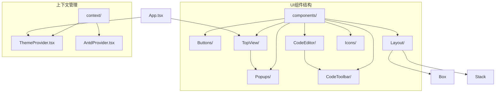
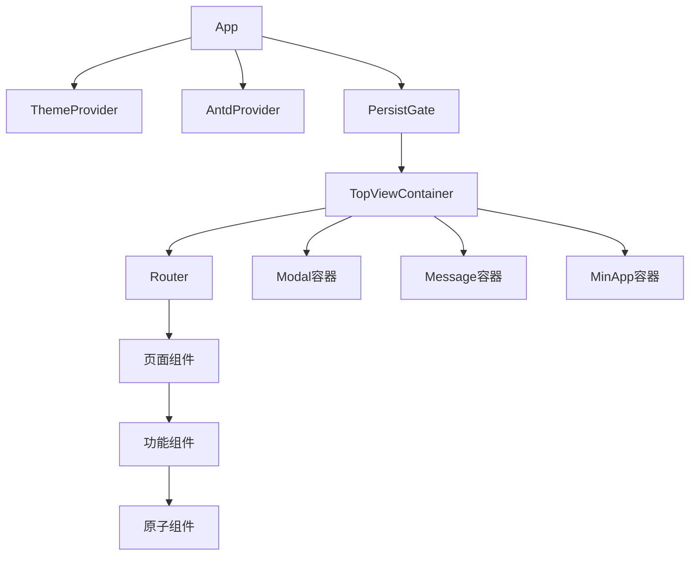
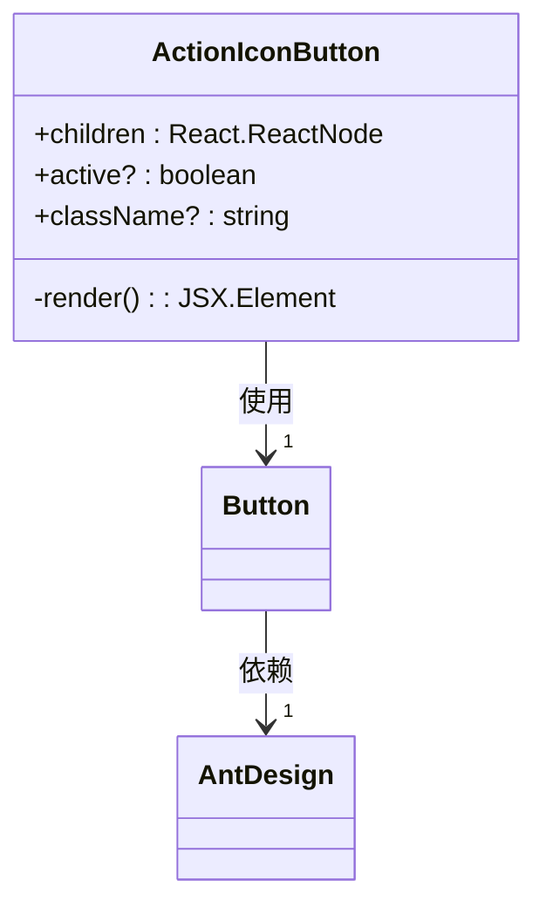
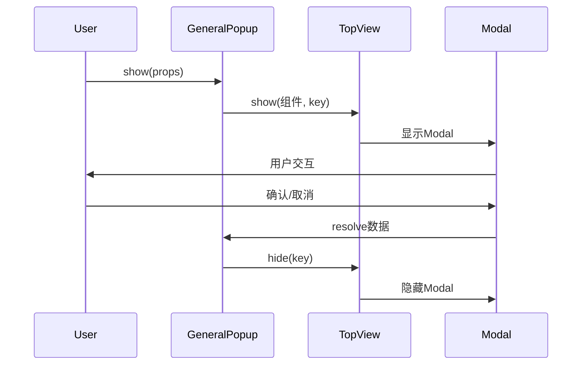
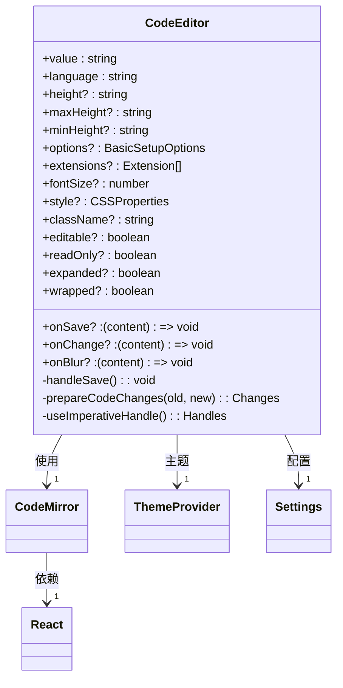
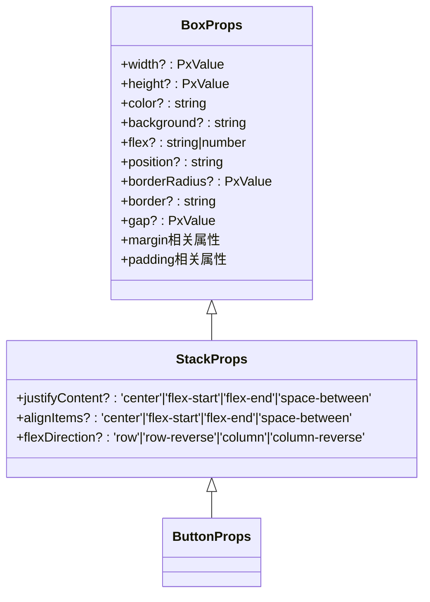
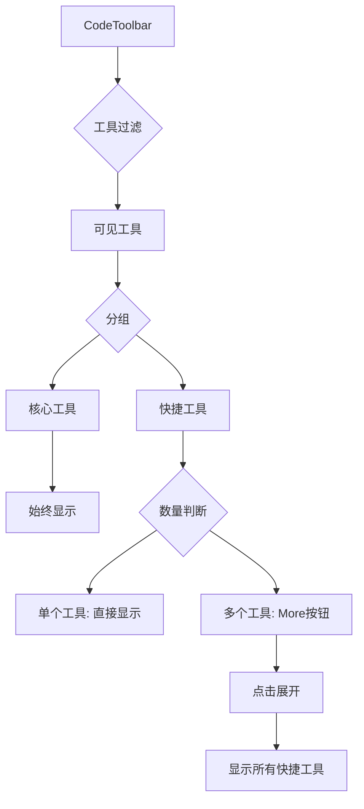
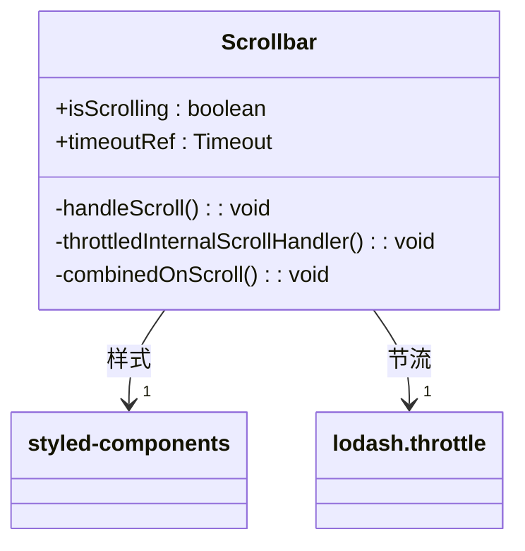

# UI组件

<cite>
**本文档引用的文件**
- [ActionIconButton.tsx](file://src/renderer/src/components/Buttons/ActionIconButton.tsx)
- [GeneralPopup.tsx](file://src/renderer/src/components/Popups/GeneralPopup.tsx)
- [CodeEditor.tsx](file://src/renderer/src/components/CodeEditor/index.tsx)
- [TopView.tsx](file://src/renderer/src/components/TopView/index.tsx)
- [CodeToolbar.tsx](file://src/renderer/src/components/CodeToolbar/toolbar.tsx)
- [Layout.ts](file://src/renderer/src/components/Layout/index.ts)
- [SVGIcon.tsx](file://src/renderer/src/components/Icons/SVGIcon.tsx)
- [ThemeProvider.tsx](file://src/renderer/src/context/ThemeProvider.tsx)
- [App.tsx](file://src/renderer/src/App.tsx)
- [Scrollbar.tsx](file://src/renderer/src/components/Scrollbar/index.tsx)
- [MathInputDialog.tsx](file://src/renderer/src/components/RichEditor/components/MathInputDialog.tsx)
</cite>

## 目录
1. [简介](#简介)
2. [项目结构](#项目结构)
3. [核心UI组件](#核心ui组件)
4. [架构概述](#架构概述)
5. [详细组件分析](#详细组件分析)
6. [依赖分析](#依赖分析)
7. [性能考虑](#性能考虑)
8. [故障排除指南](#故障排除指南)
9. [结论](#结论)

## 简介
Cherry Studio的UI组件系统提供了一套完整的用户界面构建模块，支持丰富的交互功能和视觉效果。本文档详细描述了主要UI组件的视觉外观、行为模式、用户交互方式以及技术实现细节。组件系统基于React构建，结合了Ant Design和自定义组件，提供了高度可定制的界面元素。

## 项目结构
Cherry Studio的UI组件主要位于`src/renderer/src/components`目录下，采用模块化组织结构。每个组件都有独立的目录，包含实现文件、样式文件和测试文件。组件系统通过主题提供者(ThemeProvider)实现暗色/亮色主题切换，通过TopView容器管理全屏覆盖层。



**图源**
- [App.tsx](file://src/renderer/src/App.tsx#L1-L56)
- [ThemeProvider.tsx](file://src/renderer/src/context/ThemeProvider.tsx#L1-L96)

**本节源**
- [App.tsx](file://src/renderer/src/App.tsx#L1-L56)
- [components/](file://src/renderer/src/components/)

## 核心UI组件
Cherry Studio的核心UI组件包括按钮、弹窗、代码编辑器、工具栏和布局容器。这些组件构成了应用程序的主要交互界面，支持主题切换、响应式设计和无障碍访问。

**本节源**
- [Buttons/ActionIconButton.tsx](file://src/renderer/src/components/Buttons/ActionIconButton.tsx#L1-L32)
- [Popups/GeneralPopup.tsx](file://src/renderer/src/components/Popups/GeneralPopup.tsx#L1-L69)
- [CodeEditor/index.tsx](file://src/renderer/src/components/CodeEditor/index.tsx#L1-L281)

## 架构概述
UI架构采用分层设计，顶层是App组件，负责初始化全局上下文和状态管理。ThemeProvider提供主题支持，TopView管理全屏覆盖层，各功能组件通过props和事件进行通信。



**图源**
- [App.tsx](file://src/renderer/src/App.tsx#L29-L56)
- [TopView/index.tsx](file://src/renderer/src/components/TopView/index.tsx#L33-L122)

## 详细组件分析

### 按钮组件分析
ActionIconButton是一个圆形文本按钮，用于触发操作。它支持激活状态的视觉反馈，通过CSS类控制外观。



**图源**
- [ActionIconButton.tsx](file://src/renderer/src/components/Buttons/ActionIconButton.tsx#L6-L32)

**本节源**
- [ActionIconButton.tsx](file://src/renderer/src/components/Buttons/ActionIconButton.tsx#L1-L32)

### 弹窗组件分析
GeneralPopup是一个通用弹窗组件，通过TopView系统管理显示和隐藏。它支持Promise接口，便于异步操作处理。



**图源**
- [GeneralPopup.tsx](file://src/renderer/src/components/Popups/GeneralPopup.tsx#L1-L69)
- [TopView/index.tsx](file://src/renderer/src/components/TopView/index.tsx#L114-L122)

**本节源**
- [GeneralPopup.tsx](file://src/renderer/src/components/Popups/GeneralPopup.tsx#L1-L69)

### 代码编辑器组件分析
CodeEditor是基于CodeMirror的代码编辑组件，支持语法高亮、行号显示和自定义扩展。



**图源**
- [CodeEditor.tsx](file://src/renderer/src/components/CodeEditor/index.tsx#L19-L281)

**本节源**
- [CodeEditor.tsx](file://src/renderer/src/components/CodeEditor/index.tsx#L1-L281)

### 布局组件分析
Layout组件提供灵活的布局系统，支持盒模型和堆栈布局，通过props控制样式。



**图源**
- [Layout/index.ts](file://src/renderer/src/components/Layout/index.ts#L3-L79)

**本节源**
- [Layout/index.ts](file://src/renderer/src/components/Layout/index.ts#L1-L79)

### 工具栏组件分析
CodeToolbar为代码块提供操作工具栏，支持核心工具和快捷工具的分组显示。



**图源**
- [CodeToolbar/toolbar.tsx](file://src/renderer/src/components/CodeToolbar/toolbar.tsx#L12-L74)

**本节源**
- [CodeToolbar/toolbar.tsx](file://src/renderer/src/components/CodeToolbar/toolbar.tsx#L1-L74)

### 滚动条组件分析
Scrollbar组件提供自定义滚动条样式，支持滚动状态检测和过渡效果。



**图源**
- [Scrollbar/index.tsx](file://src/renderer/src/components/Scrollbar/index.tsx#L1-L76)

**本节源**
- [Scrollbar/index.tsx](file://src/renderer/src/components/Scrollbar/index.tsx#L1-L76)

### 图标组件分析
SVGIcon组件提供多种SVG图标，支持主题色和动画效果。

```mermaid
classDiagram
class SVGIcon {
+StreamlineGoodHealthAndWellBeing
+MdiLightbulbOffOutline
+MdiLightbulbAutoOutline
+MdiLightbulbOn10-90
+BingLogo
+SearXNGLogo
+TavilyLogo
+ExaLogo
+BochaLogo
+ZhipuLogo
+PoeLogo
}
SVGIcon --> "1" motion/react : 动画
SVGIcon --> "1" @renderer/utils/motionVariants : 动画变体
```

**图源**
- [Icons/SVGIcon.tsx](file://src/renderer/src/components/Icons/SVGIcon.tsx#L1-L298)

**本节源**
- [Icons/SVGIcon.tsx](file://src/renderer/src/components/Icons/SVGIcon.tsx#L1-L298)

### 数学输入对话框分析
MathInputDialog为数学公式输入提供浮动对话框，支持位置自适应和实时预览。

```mermaid
classDiagram
class MathInputDialogProps {
+visible : boolean
+onSubmit : (formula) => void
+onCancel : () => void
+defaultValue? : string
+onFormulaChange? : (formula) => void
+position? : {x, y, top}
+scrollContainer? : Ref
}
MathInputDialogProps --> "1" MathInputDialog : 使用
MathInputDialog --> "1" ThemeProvider : 主题
MathInputDialog --> "1" react-i18next : 国际化
```

**图源**
- [RichEditor/components/MathInputDialog.tsx](file://src/renderer/src/components/RichEditor/components/MathInputDialog.tsx#L6-L133)

**本节源**
- [RichEditor/components/MathInputDialog.tsx](file://src/renderer/src/components/RichEditor/components/MathInputDialog.tsx#L1-L133)

## 依赖分析
UI组件系统依赖多个外部库和内部模块，形成复杂的依赖网络。

```mermaid
graph TD
A[UI组件] --> B[Ant Design]
A --> C[React]
A --> D[styled-components]
A --> E[lodash]
A --> F[motion/react]
A --> G[react-i18next]
A --> H[@renderer/hooks]
A --> I[@renderer/context]
A --> J[@renderer/utils]
H --> K[useSettings]
H --> L[useAppInit]
H --> M[useShortcuts]
I --> N[ThemeProvider]
I --> O[AntdProvider]
J --> P[cn]
J --> Q[motionVariants]
```

**图源**
- [package.json](file://package.json)
- [App.tsx](file://src/renderer/src/App.tsx#L1-L56)

**本节源**
- [package.json](file://package.json)
- [App.tsx](file://src/renderer/src/App.tsx#L1-L56)

## 性能考虑
UI组件系统在性能方面进行了多项优化，包括组件记忆化、事件节流和虚拟化渲染。

- **组件记忆化**: 使用React.memo避免不必要的重新渲染
- **事件节流**: 对滚动事件进行节流处理，减少性能开销
- **虚拟化**: 在列表组件中使用虚拟滚动，提高大数据集的渲染性能
- **懒加载**: 对非关键组件进行懒加载，优化初始加载时间

**本节源**
- [Scrollbar/index.tsx](file://src/renderer/src/components/Scrollbar/index.tsx#L31-L34)
- [ActionIconButton.tsx](file://src/renderer/src/components/Buttons/ActionIconButton.tsx#L31)
- [CodeEditor.tsx](file://src/renderer/src/components/CodeEditor/index.tsx#L280)

## 故障排除指南
常见UI问题及解决方案：

1. **主题不生效**: 确保ThemeProvider正确包裹应用组件
2. **弹窗无法显示**: 检查TopViewContainer是否在组件树中
3. **滚动条不显示**: 确认容器有足够内容产生滚动
4. **按钮无响应**: 检查事件处理器是否正确绑定
5. **样式冲突**: 使用CSS模块或styled-components避免全局样式污染

**本节源**
- [ThemeProvider.tsx](file://src/renderer/src/context/ThemeProvider.tsx#L33-L92)
- [TopView/index.tsx](file://src/renderer/src/components/TopView/index.tsx#L33-L122)

## 结论
Cherry Studio的UI组件系统提供了完整、灵活且高性能的界面构建方案。通过模块化设计和良好的架构，支持快速开发和维护。组件系统充分考虑了用户体验、可访问性和性能优化，为开发者提供了强大的工具集。