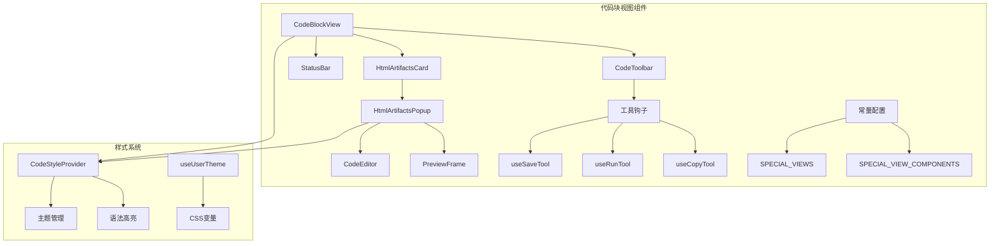
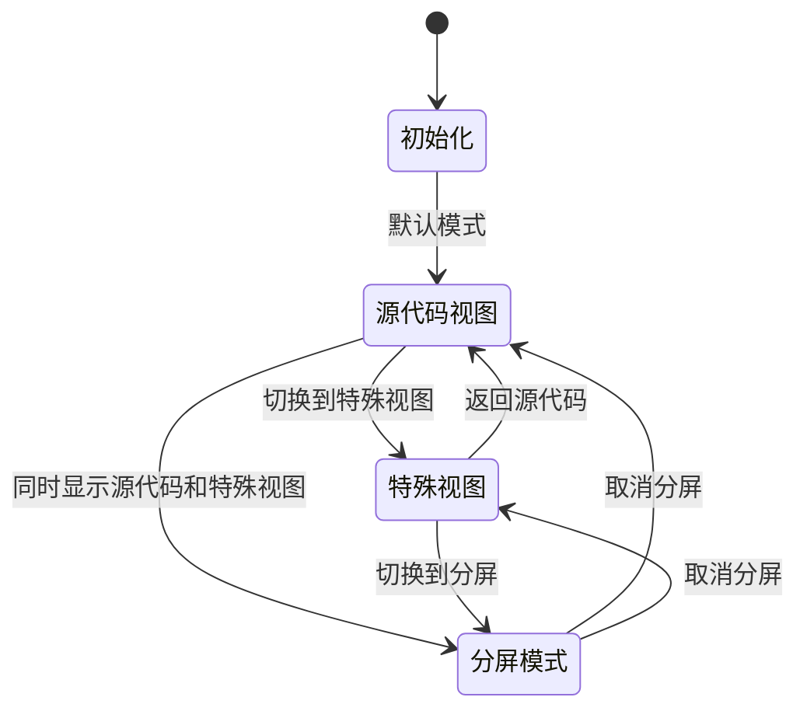
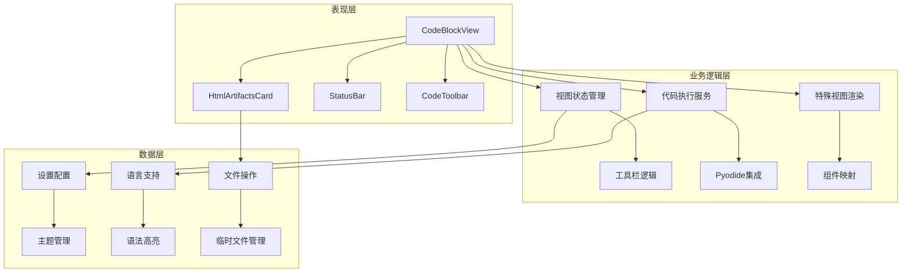
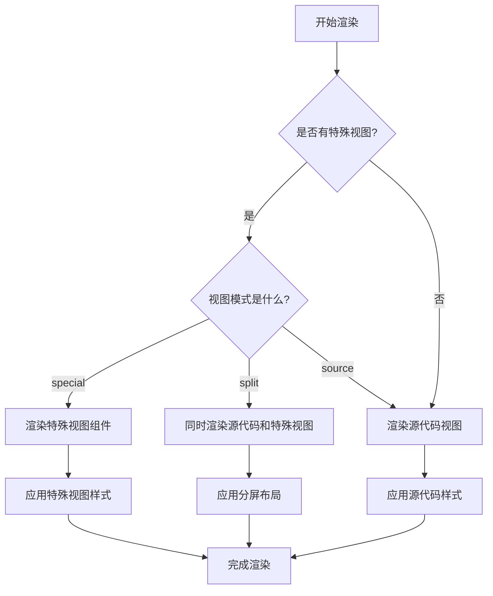
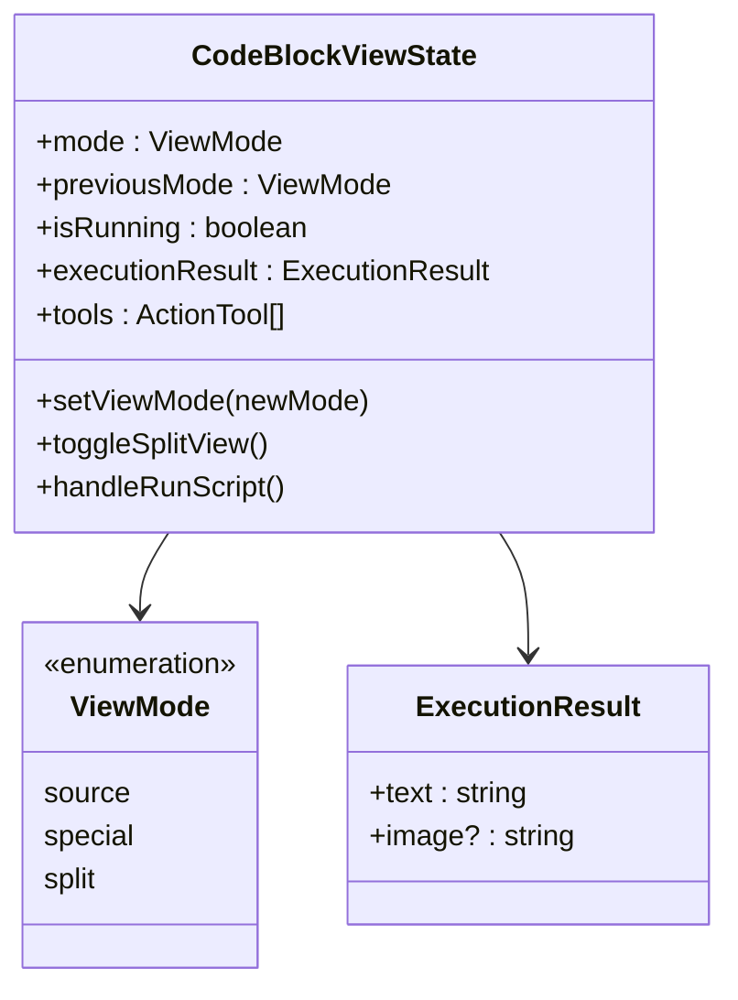
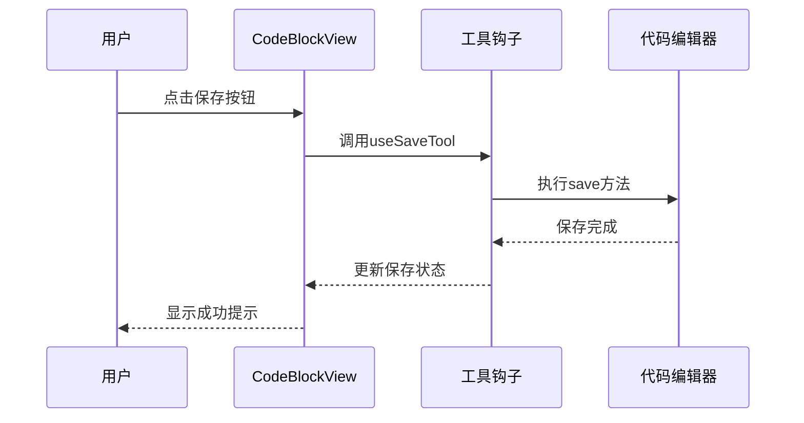
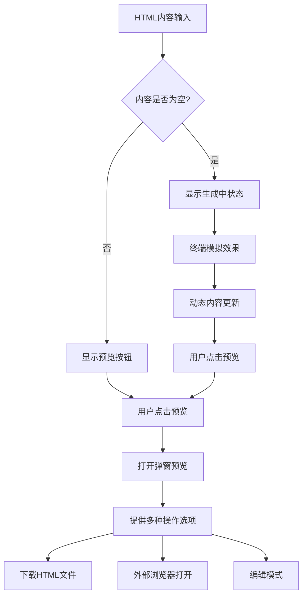
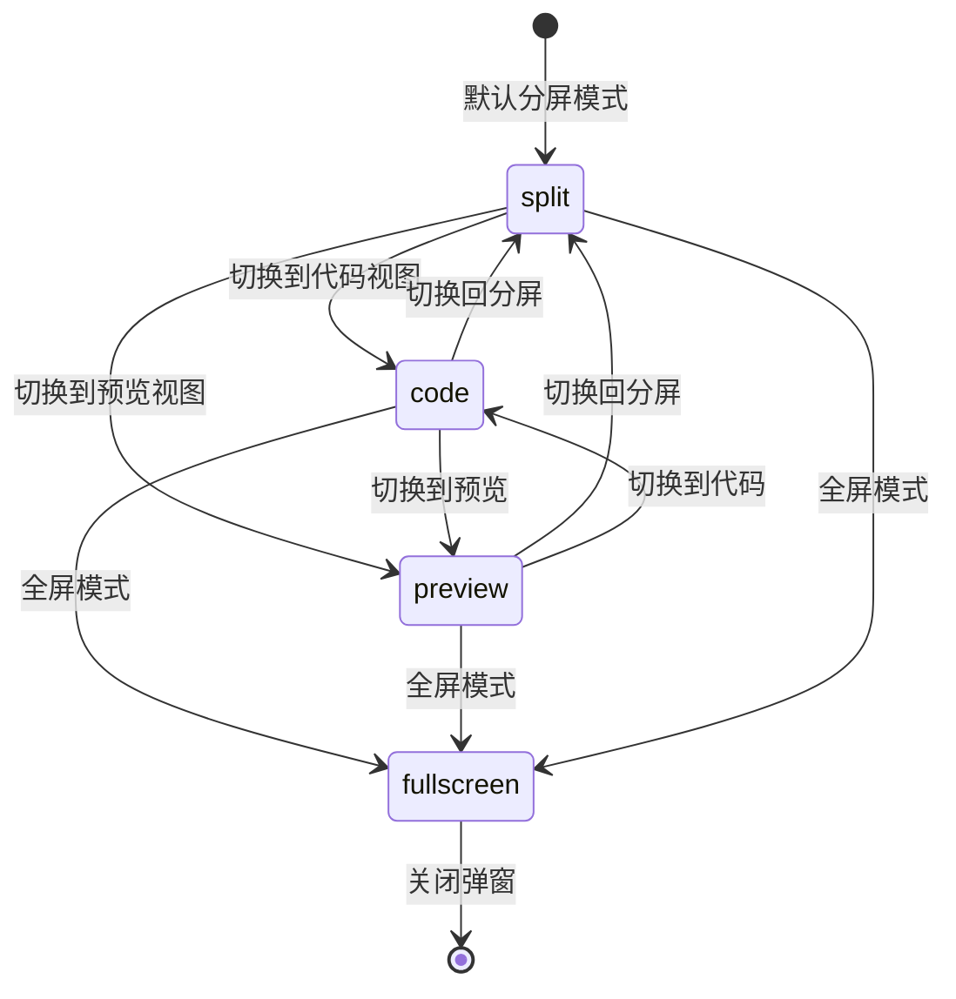
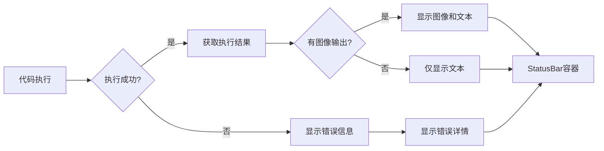
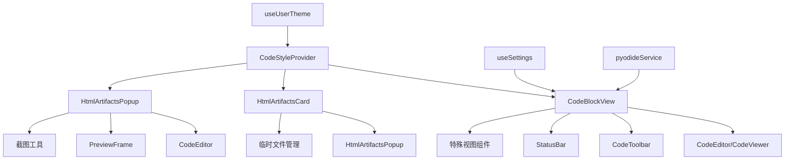

# 代码块视图组件

<cite>
**本文档中引用的文件**
- [index.ts](file://src/renderer/src/components/CodeBlockView/index.ts)
- [types.ts](file://src/renderer/src/components/CodeBlockView/types.ts)
- [view.tsx](file://src/renderer/src/components/CodeBlockView/view.tsx)
- [HtmlArtifactsCard.tsx](file://src/renderer/src/components/CodeBlockView/HtmlArtifactsCard.tsx)
- [HtmlArtifactsPopup.tsx](file://src/renderer/src/components/CodeBlockView/HtmlArtifactsPopup.tsx)
- [StatusBar.tsx](file://src/renderer/src/components/CodeBlockView/StatusBar.tsx)
- [constants.ts](file://src/renderer/src/components/CodeBlockView/constants.ts)
- [CodeBlock.tsx](file://src/renderer/src/pages/home/Markdown/CodeBlock.tsx)
- [CodeStyleProvider.tsx](file://src/renderer/src/context/CodeStyleProvider.tsx)
- [useSaveTool.tsx](file://src/renderer/src/components/CodeToolbar/hooks/useSaveTool.tsx)
- [useUserTheme.ts](file://src/renderer/src/hooks/useUserTheme.ts)
</cite>

## 目录
1. [简介](#简介)
2. [项目结构](#项目结构)
3. [核心组件](#核心组件)
4. [架构概览](#架构概览)
5. [详细组件分析](#详细组件分析)
6. [依赖关系分析](#依赖关系分析)
7. [性能考虑](#性能考虑)
8. [故障排除指南](#故障排除指南)
9. [结论](#结论)

## 简介

Cherry Studio的代码块视图组件是一个功能丰富的代码展示和交互系统，专门设计用于在AI对话环境中呈现和操作代码片段。该组件提供了多种视图模式、实时编辑、代码执行和HTML产物处理等功能，为用户提供了一个完整的代码开发环境。

核心特性包括：
- **多视图模式支持**：源代码视图、特殊视图（Mermaid、PlantUML等）和分屏模式
- **实时代码编辑**：内置代码编辑器，支持语法高亮和智能提示
- **HTML产物处理**：专门的HTML代码块处理和预览功能
- **响应式设计**：适配不同屏幕尺寸和设备
- **主题化支持**：深色/浅色主题切换和自定义样式

## 项目结构

代码块视图组件采用模块化架构，主要分为以下几个部分：

**图表来源**
- [view.tsx](file://src/renderer/src/components/CodeBlockView/view.tsx#L1-L50)
- [HtmlArtifactsCard.tsx](file://src/renderer/src/components/CodeBlockView/HtmlArtifactsCard.tsx#L1-L30)
- [constants.ts](file://src/renderer/src/components/CodeBlockView/constants.ts#L1-L18)

**章节来源**
- [index.ts](file://src/renderer/src/components/CodeBlockView/index.ts#L1-L4)
- [view.tsx](file://src/renderer/src/components/CodeBlockView/view.tsx#L1-L100)

## 核心组件

### CodeBlockView - 主要代码块视图

CodeBlockView是整个代码块系统的核心组件，负责管理代码块的渲染、编辑和交互逻辑。

#### 主要功能特性

| 功能 | 描述 | 实现方式 |
|------|------|----------|
| 多视图模式 | 支持源代码、特殊视图和分屏模式 | `ViewMode` 类型定义 |
| 代码编辑 | 内置代码编辑器，支持语法高亮 | `CodeEditor` 组件 |
| 特殊视图 | 支持Mermaid、PlantUML、SVG等特殊渲染 | `SPECIAL_VIEW_COMPONENTS` 映射 |
| 代码执行 | Python代码实时执行和结果展示 | `pyodideService` 集成 |
| 响应式布局 | 自适应不同屏幕尺寸 | CSS Grid 和 Flexbox 布局 |

#### 状态管理

**图表来源**
- [view.tsx](file://src/renderer/src/components/CodeBlockView/view.tsx#L61-L83)

### HtmlArtifactsCard - HTML产物卡片

HtmlArtifactsCard专门处理HTML代码块的展示和交互，提供预览、下载和外部打开功能。

#### 核心功能

| 功能 | 实现细节 | 用户体验 |
|------|----------|----------|
| 实时预览 | 流式生成时的终端效果 | 生成过程中的动态反馈 |
| 外部打开 | 创建临时文件并打开系统浏览器 | 无缝的外部工作流集成 |
| 下载功能 | 支持HTML文件下载 | 便捷的内容保存 |
| 编辑模式 | 弹窗形式的代码编辑界面 | 完整的编辑体验 |

**章节来源**
- [HtmlArtifactsCard.tsx](file://src/renderer/src/components/CodeBlockView/HtmlArtifactsCard.tsx#L30-L120)

## 架构概览

代码块视图组件采用分层架构设计，确保了良好的可维护性和扩展性：

**图表来源**
- [view.tsx](file://src/renderer/src/components/CodeBlockView/view.tsx#L57-L100)
- [HtmlArtifactsCard.tsx](file://src/renderer/src/components/CodeBlockView/HtmlArtifactsCard.tsx#L1-L50)

## 详细组件分析

### CodeBlockView组件深度分析

#### 渲染机制

CodeBlockView采用了智能的渲染策略，根据不同的条件选择合适的组件进行渲染：

**图表来源**
- [view.tsx](file://src/renderer/src/components/CodeBlockView/view.tsx#L290-L304)

#### 状态管理系统

组件使用了复杂的状态管理系统来处理各种交互场景：

**图表来源**
- [view.tsx](file://src/renderer/src/components/CodeBlockView/view.tsx#L61-L83)
- [types.ts](file://src/renderer/src/components/CodeBlockView/types.ts#L1-L5)

#### 工具栏集成

CodeBlockView通过工具钩子系统集成了丰富的交互功能：

**图表来源**
- [useSaveTool.tsx](file://src/renderer/src/components/CodeToolbar/hooks/useSaveTool.tsx#L15-L41)
- [view.tsx](file://src/renderer/src/components/CodeBlockView/view.tsx#L235-L240)

**章节来源**
- [view.tsx](file://src/renderer/src/components/CodeBlockView/view.tsx#L57-L402)

### HtmlArtifactsCard组件分析

#### HTML产物处理流程

HtmlArtifactsCard实现了完整的HTML产物处理生命周期：

**图表来源**
- [HtmlArtifactsCard.tsx](file://src/renderer/src/components/CodeBlockView/HtmlArtifactsCard.tsx#L73-L109)

#### 终端样式模拟

组件提供了逼真的终端样式模拟，增强用户体验：

| 元素 | 样式特征 | 实现方式 |
|------|----------|----------|
| 背景颜色 | 基于主题的深色背景 | CSS变量动态计算 |
| 提示符 | 绿色命令行提示符 | CSS动画和颜色 |
| 光标闪烁 | 持续的闪烁效果 | CSS keyframes动画 |
| 文本样式 | 等宽字体和断行 | CSS font-family和white-space |

**章节来源**
- [HtmlArtifactsCard.tsx](file://src/renderer/src/components/CodeBlockView/HtmlArtifactsCard.tsx#L1-L271)

### HtmlArtifactsPopup组件分析

#### 弹窗预览系统

HtmlArtifactsPopup提供了完整的弹窗预览体验，支持多种视图模式：

**图表来源**
- [HtmlArtifactsPopup.tsx](file://src/renderer/src/components/CodeBlockView/HtmlArtifactsPopup.tsx#L25-L30)

#### 截图和导出功能

组件集成了强大的截图和导出功能：

| 功能 | 实现方式 | 用户体验 |
|------|----------|----------|
| 文件截图 | `captureScrollableIframeAsDataURL` | 保存为PNG文件 |
| 剪贴板截图 | `captureScrollableIframeAsBlob` | 直接复制到剪贴板 |
| 多格式支持 | 自动检测HTML标题生成文件名 | 智能的文件命名 |
| 实时预览 | iframe沙盒环境渲染 | 安全的HTML预览 |

**章节来源**
- [HtmlArtifactsPopup.tsx](file://src/renderer/src/components/CodeBlockView/HtmlArtifactsPopup.tsx#L1-L442)

### StatusBar组件分析

StatusBar组件负责展示代码执行的结果和状态信息：

#### 结果展示机制

**图表来源**
- [view.tsx](file://src/renderer/src/components/CodeBlockView/view.tsx#L310-L318)
- [StatusBar.tsx](file://src/renderer/src/components/CodeBlockView/StatusBar.tsx#L1-L26)

**章节来源**
- [StatusBar.tsx](file://src/renderer/src/components/CodeBlockView/StatusBar.tsx#L1-L26)

## 依赖关系分析

### 组件间依赖关系

**图表来源**
- [view.tsx](file://src/renderer/src/components/CodeBlockView/view.tsx#L1-L30)
- [HtmlArtifactsCard.tsx](file://src/renderer/src/components/CodeBlockView/HtmlArtifactsCard.tsx#L1-L20)

### 外部依赖

组件依赖多个外部服务和库：

| 依赖项 | 用途 | 版本要求 |
|--------|------|----------|
| @uiw/codemirror-themes-all | 代码编辑器主题 | 最新版本 |
| shiki | 语法高亮引擎 | 最新版本 |
| antd | UI组件库 | 最新版本 |
| lucide-react | 图标库 | 最新版本 |
| pyodide | Python运行时 | 最新版本 |

**章节来源**
- [CodeStyleProvider.tsx](file://src/renderer/src/context/CodeStyleProvider.tsx#L1-L50)

## 性能考虑

### 渲染优化策略

1. **组件记忆化**：大量使用`memo`和`useMemo`避免不必要的重新渲染
2. **懒加载**：特殊视图组件按需加载
3. **虚拟滚动**：长代码块的高效渲染
4. **防抖处理**：频繁的用户操作进行防抖处理

### 内存管理

- **Worker清理**：Shiki服务使用Worker，组件卸载时自动清理
- **事件监听器**：及时移除不需要的事件监听器
- **定时器清理**：临时值和动画定时器的正确清理

### 代码执行性能

- **超时控制**：Python代码执行设置了合理的超时时间
- **沙盒安全**：使用安全的沙盒环境执行代码
- **结果缓存**：避免重复的代码执行

## 故障排除指南

### 常见问题及解决方案

#### 代码高亮问题

**问题**：代码块不显示语法高亮
**解决方案**：
1. 检查语言标识是否正确
2. 验证主题配置是否有效
3. 确认Shiki服务是否正常初始化

#### HTML预览问题

**问题**：HTML产物无法正常预览
**解决方案**：
1. 检查iframe沙盒设置
2. 验证HTML内容的有效性
3. 确认临时文件创建权限

#### 代码执行失败

**问题**：Python代码执行超时或失败
**解决方案**：
1. 检查代码复杂度和执行时间
2. 验证Pyodide服务状态
3. 查看浏览器控制台错误信息

**章节来源**
- [view.tsx](file://src/renderer/src/components/CodeBlockView/view.tsx#L152-L170)
- [HtmlArtifactsCard.tsx](file://src/renderer/src/components/CodeBlockView/HtmlArtifactsCard.tsx#L39-L55)

## 结论

Cherry Studio的代码块视图组件是一个功能完善、架构清晰的代码展示和交互系统。它成功地整合了现代Web技术，为AI对话环境提供了专业级的代码开发体验。

### 主要优势

1. **模块化设计**：清晰的组件分离和职责划分
2. **丰富功能**：涵盖了从基础展示到高级编辑的完整功能链
3. **良好性能**：通过多种优化策略确保流畅的用户体验
4. **可扩展性**：灵活的架构支持未来功能的扩展

### 技术亮点

- **智能渲染策略**：根据内容类型自动选择最优的展示方式
- **实时交互**：支持即时的代码编辑和预览
- **安全执行**：Python代码在安全的沙盒环境中执行
- **主题化支持**：完整的深色/浅色主题切换能力

这个组件系统为Cherry Studio的AI对话功能提供了坚实的技术基础，使得用户能够在自然的对话环境中高效地编写和调试代码。