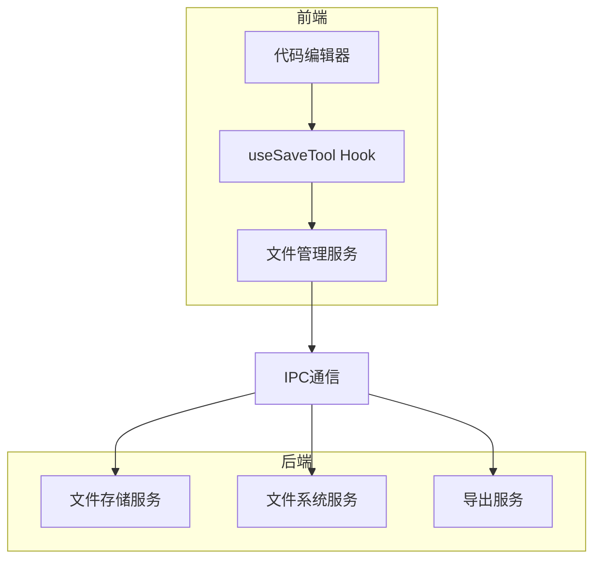
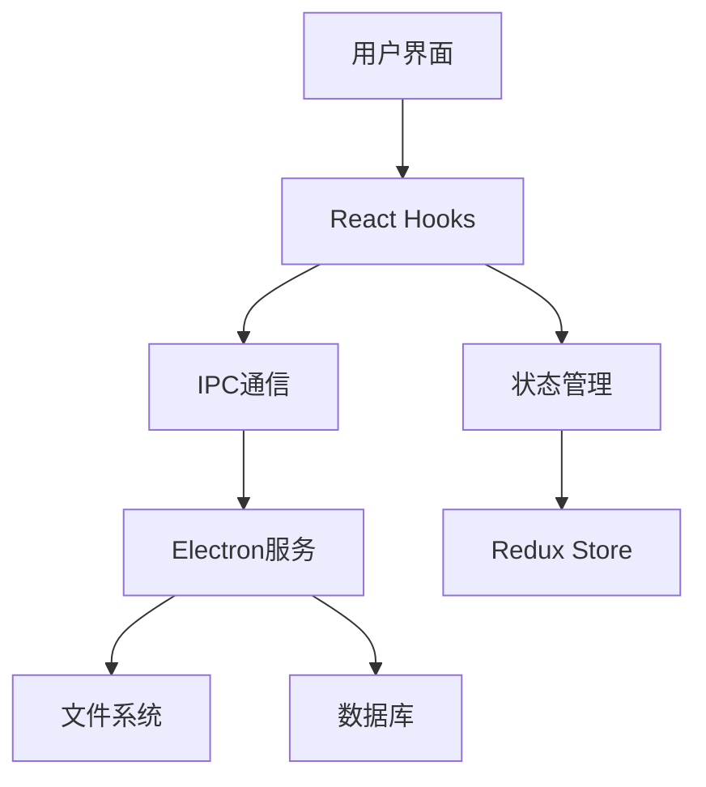
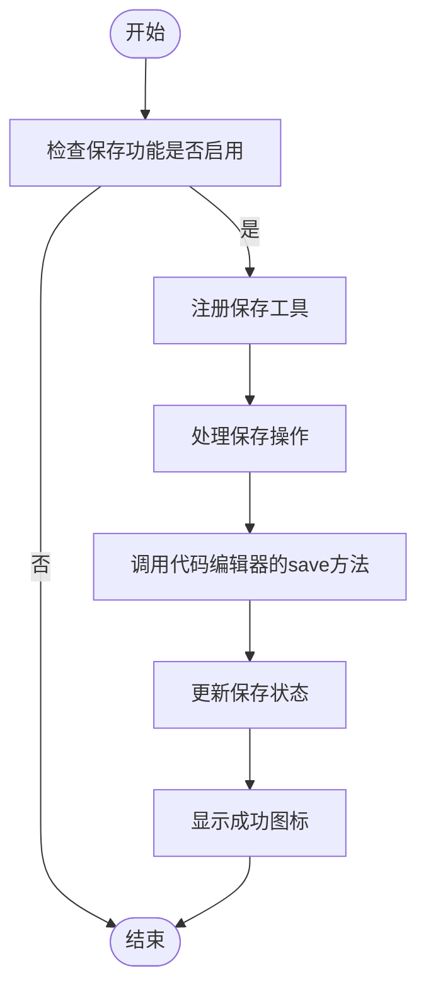
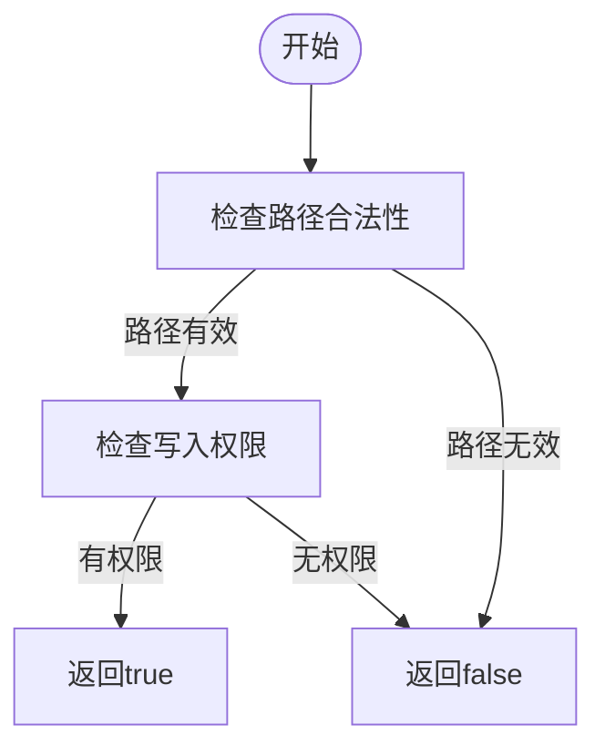
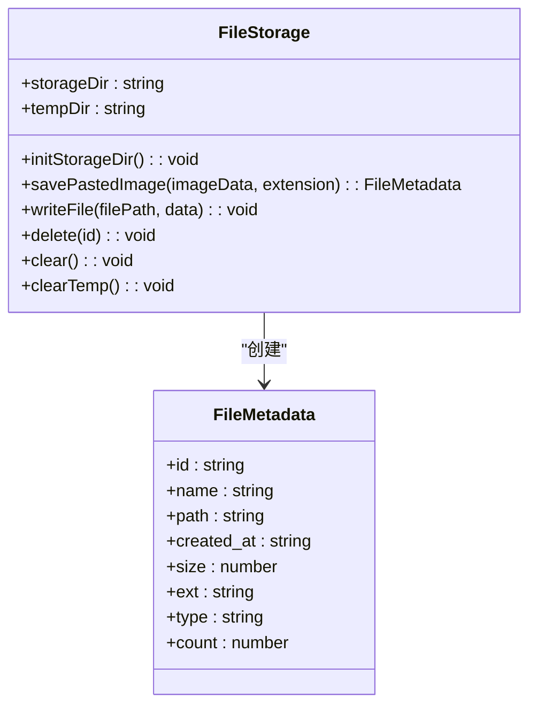
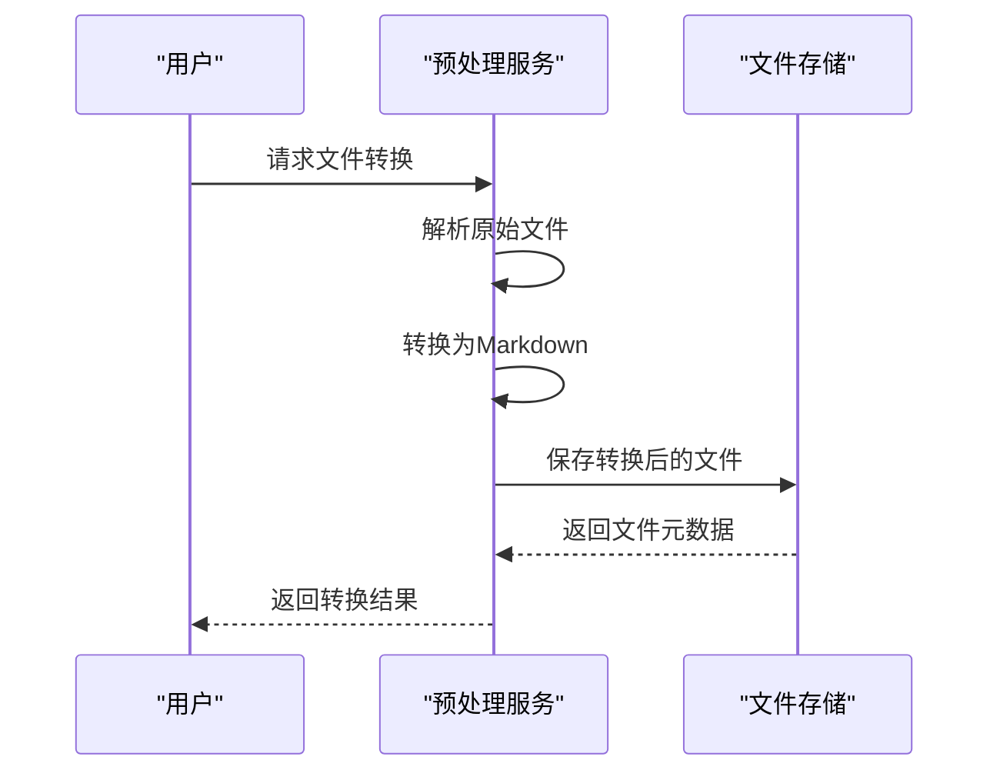
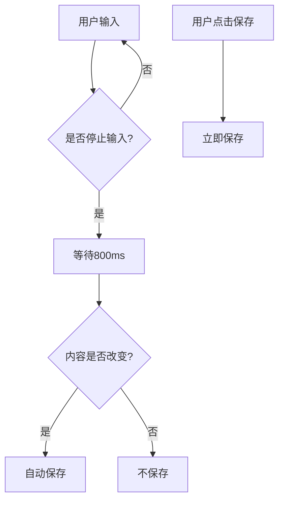
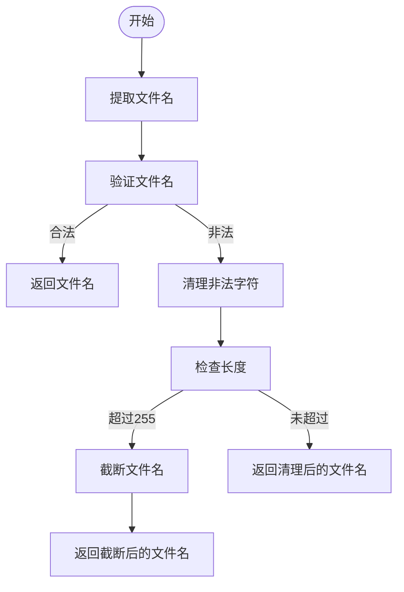
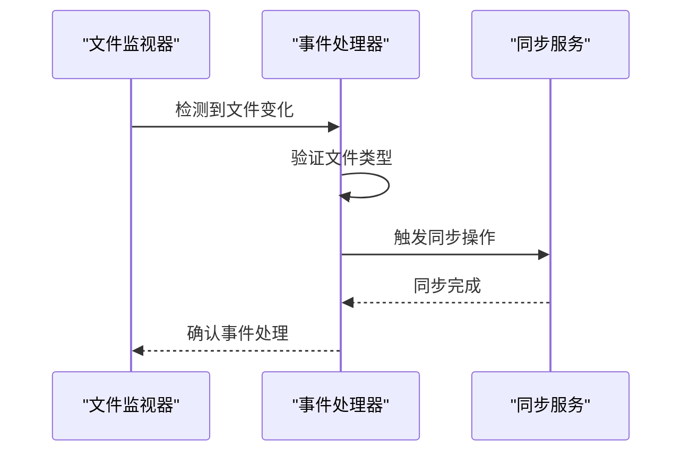
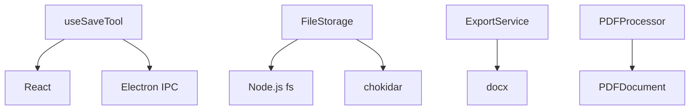

# 代码保存工具

<cite>
**本文档引用的文件**  
- [useSaveTool.tsx](file://src/renderer/src/components/CodeToolbar/hooks/useSaveTool.tsx)
- [CodeEditor.tsx](file://src/renderer/src/components/CodeEditor/index.tsx)
- [FileStorage.ts](file://src/main/services/FileStorage.ts)
- [FileManager.ts](file://src/renderer/src/services/FileManager.ts)
- [file.ts](file://src/main/utils/file.ts)
- [fileOperations.ts](file://src/main/utils/fileOperations.ts)
- [NotesPage.tsx](file://src/renderer/src/pages/notes/NotesPage.tsx)
- [ExportService.ts](file://src/main/services/ExportService.ts)
</cite>

## 目录
1. [简介](#简介)
2. [项目结构](#项目结构)
3. [核心组件](#核心组件)
4. [架构概述](#架构概述)
5. [详细组件分析](#详细组件分析)
6. [依赖分析](#依赖分析)
7. [性能考虑](#性能考虑)
8. [故障排除指南](#故障排除指南)
9. [结论](#结论)

## 简介
Cherry Studio代码保存工具为用户提供了一套完整的文件管理解决方案，包括自动保存、手动保存、文件系统访问权限处理、本地存储机制和文件格式转换等功能。本工具通过useSaveTool Hook实现代码编辑器的保存功能，结合前端React组件和后端Electron服务，为用户提供流畅的代码编辑和保存体验。

## 项目结构
Cherry Studio的项目结构清晰地分为前端和后端两个主要部分。前端代码位于`src/renderer/src`目录下，包含组件、页面、服务和工具等模块。后端代码位于`src/main`目录下，负责处理文件系统操作、服务管理和主进程逻辑。代码保存工具的核心功能分布在多个文件中，通过IPC（进程间通信）机制实现前后端的协同工作。

**Diagram sources**
- [useSaveTool.tsx](file://src/renderer/src/components/CodeToolbar/hooks/useSaveTool.tsx)
- [FileStorage.ts](file://src/main/services/FileStorage.ts)
- [FileManager.ts](file://src/renderer/src/services/FileManager.ts)

**Section sources**
- [useSaveTool.tsx](file://src/renderer/src/components/CodeToolbar/hooks/useSaveTool.tsx)
- [FileStorage.ts](file://src/main/services/FileStorage.ts)

## 核心组件
代码保存工具的核心组件包括useSaveTool Hook、CodeEditor组件、FileStorage服务和FileManager服务。这些组件协同工作，实现了从用户界面到文件系统底层的完整保存流程。useSaveTool Hook负责处理保存操作的UI逻辑和状态管理，CodeEditor组件提供代码编辑功能，FileStorage服务处理文件的持久化存储，FileManager服务管理文件元数据和数据库操作。

**Section sources**
- [useSaveTool.tsx](file://src/renderer/src/components/CodeToolbar/hooks/useSaveTool.tsx)
- [CodeEditor.tsx](file://src/renderer/src/components/CodeEditor/index.tsx)
- [FileStorage.ts](file://src/main/services/FileStorage.ts)
- [FileManager.ts](file://src/renderer/src/services/FileManager.ts)

## 架构概述
代码保存工具采用分层架构设计，将用户界面、业务逻辑和数据存储分离。前端通过React Hooks管理UI状态，后端通过Electron服务处理文件系统操作。前后端通过IPC机制进行通信，确保数据的安全传输和操作的原子性。这种架构设计提高了代码的可维护性和可扩展性，同时保证了系统的稳定性和性能。

**Diagram sources**
- [useSaveTool.tsx](file://src/renderer/src/components/CodeToolbar/hooks/useSaveTool.tsx)
- [FileStorage.ts](file://src/main/services/FileStorage.ts)
- [FileManager.ts](file://src/renderer/src/services/FileManager.ts)

## 详细组件分析

### useSaveTool Hook分析
useSaveTool Hook是代码保存工具的核心，负责处理保存操作的UI逻辑和状态管理。该Hook接收三个参数：enabled（是否启用）、sourceViewRef（代码编辑器引用）和setTools（工具栏更新函数）。当用户点击保存按钮时，Hook会调用代码编辑器的save方法，并更新保存状态图标。

**Diagram sources**
- [useSaveTool.tsx](file://src/renderer/src/components/CodeToolbar/hooks/useSaveTool.tsx)

**Section sources**
- [useSaveTool.tsx](file://src/renderer/src/components/CodeToolbar/hooks/useSaveTool.tsx)

### 文件系统访问权限处理
文件系统访问权限处理是代码保存工具的重要组成部分，确保用户对文件系统的操作安全可靠。系统通过hasWritePermission函数检查目录的写入权限，并在创建目录时验证路径的合法性。对于系统根目录等敏感位置，系统会阻止用户进行操作，防止意外修改系统文件。

**Diagram sources**
- [file.ts](file://src/main/utils/file.ts)

**Section sources**
- [file.ts](file://src/main/utils/file.ts)
- [FileStorage.ts](file://src/main/services/FileStorage.ts)

### 本地存储机制
本地存储机制通过FileStorage服务实现，负责管理应用程序的文件存储。服务提供文件的读取、写入、删除和元数据管理功能。文件存储采用UUID作为文件ID，确保文件的唯一性。同时，服务还提供临时文件管理功能，用于处理临时文件的创建和清理。

**Diagram sources**
- [FileStorage.ts](file://src/main/services/FileStorage.ts)

**Section sources**
- [FileStorage.ts](file://src/main/services/FileStorage.ts)

### 文件格式转换逻辑
文件格式转换逻辑主要在预处理服务中实现，支持将不同格式的文件转换为Markdown格式。系统通过MistralPreprocessProvider等预处理提供者，将PDF、Word等文档转换为Markdown格式，并保存转换后的文件。转换过程中，系统会处理图片、表格等复杂元素，确保转换结果的准确性。

**Diagram sources**
- [MistralPreprocessProvider.ts](file://src/main/knowledge/preprocess/MistralPreprocessProvider.ts)
- [FileStorage.ts](file://src/main/services/FileStorage.ts)

**Section sources**
- [MistralPreprocessProvider.ts](file://src/main/knowledge/preprocess/MistralPreprocessProvider.ts)

### 自动保存与手动保存
自动保存与手动保存是代码保存工具的两种主要保存方式。自动保存通过防抖机制实现，在用户停止输入800ms后自动保存内容，避免频繁的文件写入操作。手动保存则通过用户点击保存按钮触发，立即保存当前内容。两种保存方式相互补充，既保证了数据的安全性，又提高了用户体验。

**Diagram sources**
- [NotesPage.tsx](file://src/renderer/src/pages/notes/NotesPage.tsx)

**Section sources**
- [NotesPage.tsx](file://src/renderer/src/pages/notes/NotesPage.tsx)

### 文件命名策略与路径管理
文件命名策略采用安全的命名规则，自动清理文件名中的非法字符，防止路径遍历攻击。系统通过checkName和sanitizeFilename函数处理文件名，替换Windows和macOS系统中的非法字符，并限制文件名长度。路径管理通过isPathInside函数实现，确保操作路径在允许的范围内，防止越权访问。

**Diagram sources**
- [file.ts](file://src/main/utils/file.ts)

**Section sources**
- [file.ts](file://src/main/utils/file.ts)

### 版本控制集成
版本控制集成通过文件监视器实现，实时监控指定目录的文件变化。系统使用chokidar库创建文件监视器，监听文件的添加、删除和修改事件。当检测到文件变化时，系统会触发相应的同步操作，确保本地文件与版本控制系统保持一致。

**Diagram sources**
- [FileStorage.ts](file://src/main/services/FileStorage.ts)

**Section sources**
- [FileStorage.ts](file://src/main/services/FileStorage.ts)

## 依赖分析
代码保存工具的依赖关系清晰，前端组件依赖于React和Electron的IPC通信，后端服务依赖于Node.js的文件系统模块和第三方库。主要依赖包括：React用于UI组件开发，Electron用于桌面应用框架，chokidar用于文件监视，docx用于Word文档导出，PDFDocument用于PDF文件处理。

**Diagram sources**
- [package.json](file://package.json)

**Section sources**
- [package.json](file://package.json)

## 性能考虑
代码保存工具在性能方面进行了多项优化。自动保存采用防抖机制，减少不必要的文件写入操作。文件监视器使用防抖和节流技术，避免频繁触发事件处理。大文件处理时，系统会进行压缩处理，减少存储空间占用。同时，系统还实现了缓存机制，提高文件读取速度。

## 故障排除指南
代码保存工具提供了完善的错误处理机制，针对常见的文件系统问题提供解决方案。对于磁盘空间不足的情况，系统会提示用户清理磁盘空间。对于权限拒绝的情况，系统会提示用户检查目录权限或选择其他保存位置。对于文件名非法的情况，系统会自动清理非法字符并提示用户。

**Section sources**
- [FileStorage.ts](file://src/main/services/FileStorage.ts)
- [file.ts](file://src/main/utils/file.ts)

## 结论
Cherry Studio代码保存工具通过精心设计的架构和完善的实现，为用户提供了一套安全、可靠、高效的文件管理解决方案。工具不仅实现了基本的保存功能，还提供了自动保存、文件格式转换、版本控制集成等高级特性。通过严格的权限控制和错误处理机制，确保了系统的稳定性和数据的安全性。