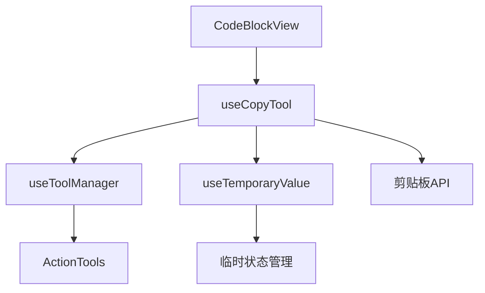
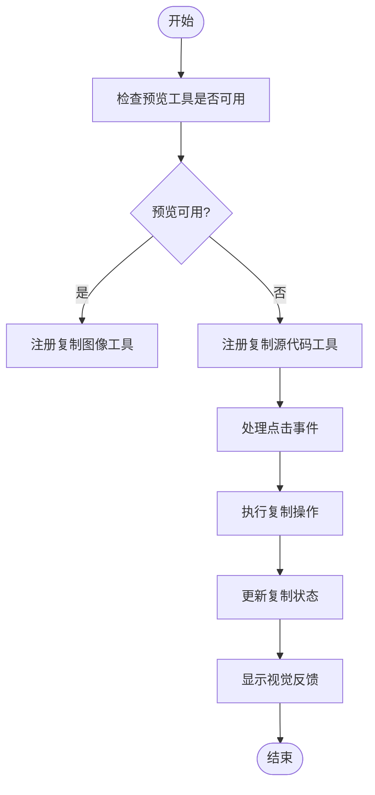
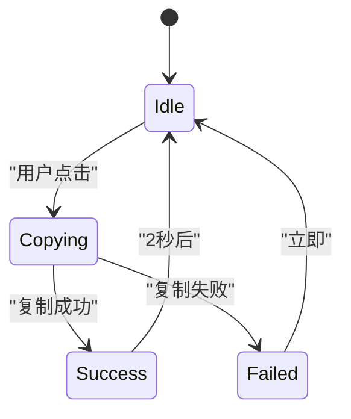
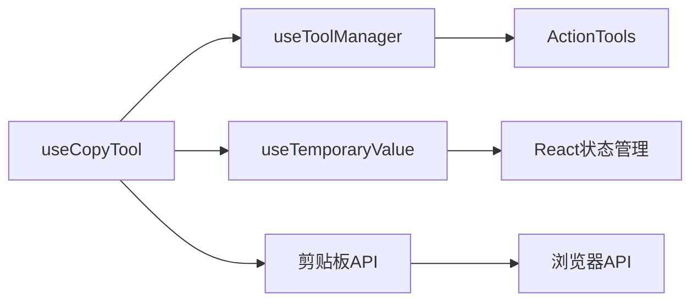

# 代码复制工具

<cite>
**本文档引用的文件**
- [useCopyTool.tsx](file://src/renderer/src/components/CodeToolbar/hooks/useCopyTool.tsx)
- [copy.ts](file://src/renderer/src/utils/copy.ts)
- [CodeBlockView/view.tsx](file://src/renderer/src/components/CodeBlockView/view.tsx)
- [useTemporaryValue.ts](file://src/renderer/src/hooks/useTemporaryValue.ts)
- [constants.ts](file://src/renderer/src/components/ActionTools/constants.ts)
- [useToolManager.ts](file://src/renderer/src/components/ActionTools/hooks/useToolManager.ts)
- [ImageViewer.tsx](file://src/renderer/src/components/ImageViewer.tsx)
</cite>

## 目录
1. [简介](#简介)
2. [核心组件](#核心组件)
3. [架构概述](#架构概述)
4. [详细组件分析](#详细组件分析)
5. [依赖分析](#依赖分析)
6. [性能考虑](#性能考虑)
7. [故障排除指南](#故障排除指南)
8. [结论](#结论)

## 简介
Cherry Studio的代码复制工具为用户提供了一种便捷的方式来复制代码块和图像内容。该工具通过useCopyTool Hook实现，提供了直观的用户界面和流畅的交互体验。本文档将深入解析该工具的实现机制，包括剪贴板API的调用方式、异步复制操作的处理流程以及成功/失败状态的管理。

## 核心组件

代码复制工具的核心是useCopyTool Hook，它负责管理复制功能的逻辑和状态。该Hook通过与工具管理器交互来注册和管理复制工具，并处理用户交互。

**Section sources**
- [useCopyTool.tsx](file://src/renderer/src/components/CodeToolbar/hooks/useCopyTool.tsx)
- [useTemporaryValue.ts](file://src/renderer/src/hooks/useTemporaryValue.ts)

## 架构概述

代码复制工具的架构基于React Hooks和组件化设计模式。它通过useCopyTool Hook封装了复制功能的逻辑，并通过工具管理器将其集成到UI中。

**Diagram sources**
- [useCopyTool.tsx](file://src/renderer/src/components/CodeToolbar/hooks/useCopyTool.tsx)
- [CodeBlockView/view.tsx](file://src/renderer/src/components/CodeBlockView/view.tsx)

## 详细组件分析

### useCopyTool Hook分析

useCopyTool Hook是代码复制工具的核心，它负责处理复制操作的逻辑和状态管理。

#### 功能实现
useCopyTool Hook通过以下方式实现复制功能：

1. **状态管理**：使用useTemporaryValue Hook来管理复制状态，该状态会在一定时间后自动重置。
2. **工具注册**：通过useToolManager将复制工具注册到工具栏中。
3. **事件处理**：处理用户点击复制按钮的事件，并调用相应的复制逻辑。

**Diagram sources**
- [useCopyTool.tsx](file://src/renderer/src/components/CodeToolbar/hooks/useCopyTool.tsx)
- [useTemporaryValue.ts](file://src/renderer/src/hooks/useTemporaryValue.ts)

**Section sources**
- [useCopyTool.tsx](file://src/renderer/src/components/CodeToolbar/hooks/useCopyTool.tsx)
- [useTemporaryValue.ts](file://src/renderer/src/hooks/useTemporaryValue.ts)

### 工具交互逻辑

#### 按钮交互逻辑
复制工具的按钮交互逻辑如下：

1. **初始状态**：显示复制图标。
2. **点击后**：执行复制操作，并将按钮图标更改为勾选图标。
3. **短暂延迟后**：自动恢复为复制图标。

#### 视觉反馈机制
视觉反馈通过以下方式实现：

1. **图标变化**：从复制图标变为勾选图标，表示复制成功。
2. **状态管理**：使用useTemporaryValue Hook来管理临时状态，确保图标在一定时间后自动恢复。
3. **样式应用**：通过CSS类应用不同的样式，如颜色变化。

**Diagram sources**
- [useCopyTool.tsx](file://src/renderer/src/components/CodeToolbar/hooks/useCopyTool.tsx)
- [constants.ts](file://src/renderer/src/components/ActionTools/constants.ts)

**Section sources**
- [useCopyTool.tsx](file://src/renderer/src/components/CodeToolbar/hooks/useCopyTool.tsx)
- [constants.ts](file://src/renderer/src/components/ActionTools/constants.ts)

## 依赖分析

代码复制工具依赖于多个核心组件和API。

**Diagram sources**
- [useCopyTool.tsx](file://src/renderer/src/components/CodeToolbar/hooks/useCopyTool.tsx)
- [useToolManager.ts](file://src/renderer/src/components/ActionTools/hooks/useToolManager.ts)
- [useTemporaryValue.ts](file://src/renderer/src/hooks/useTemporaryValue.ts)

**Section sources**
- [useCopyTool.tsx](file://src/renderer/src/components/CodeToolbar/hooks/useCopyTool.tsx)
- [useToolManager.ts](file://src/renderer/src/components/ActionTools/hooks/useToolManager.ts)
- [useTemporaryValue.ts](file://src/renderer/src/hooks/useTemporaryValue.ts)

## 性能考虑

代码复制工具在设计时考虑了性能优化：

1. **状态管理**：使用useTemporaryValue Hook来避免不必要的重新渲染。
2. **事件处理**：通过useCallback优化事件处理函数，避免每次渲染都创建新函数。
3. **资源释放**：在组件卸载时清除定时器，防止内存泄漏。

## 故障排除指南

### 常见问题及解决方案

#### 浏览器兼容性问题
某些浏览器可能不支持Clipboard API，导致复制功能无法正常工作。

**解决方案**：
- 检查浏览器是否支持Clipboard API
- 提供降级方案，如使用document.execCommand('copy')

#### 操作系统特定问题
不同操作系统对剪贴板的处理方式可能有所不同。

**解决方案**：
- 针对不同操作系统进行测试
- 在配置文件中定义特定操作系统的处理规则

#### 安全策略限制
某些安全策略可能限制剪贴板访问。

**解决方案**：
- 确保应用在安全上下文中运行
- 请求必要的权限

**Section sources**
- [useCopyTool.tsx](file://src/renderer/src/components/CodeToolbar/hooks/useCopyTool.tsx)
- [ImageViewer.tsx](file://src/renderer/src/components/ImageViewer.tsx)

## 结论

Cherry Studio的代码复制工具通过精心设计的Hook和组件架构，为用户提供了一个高效、可靠的复制功能。通过useCopyTool Hook，工具能够优雅地处理复制操作的各个方面，包括状态管理、用户交互和视觉反馈。该工具的模块化设计使其易于维护和扩展，为未来的功能增强提供了坚实的基础。