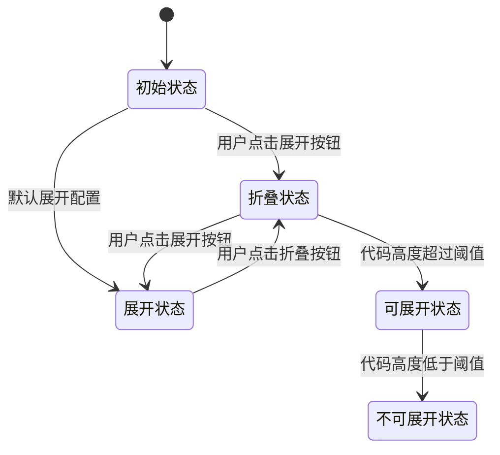
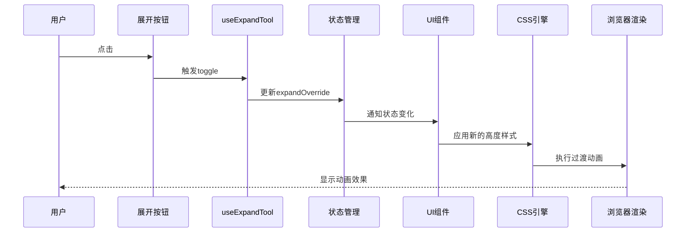
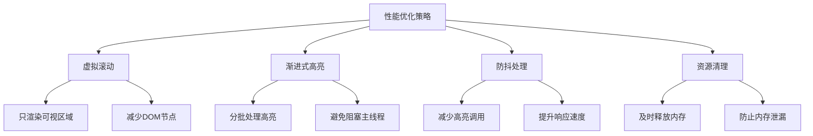
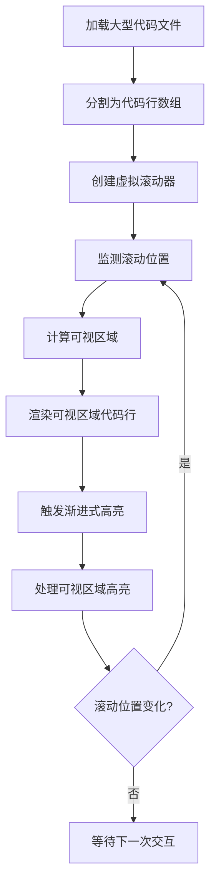
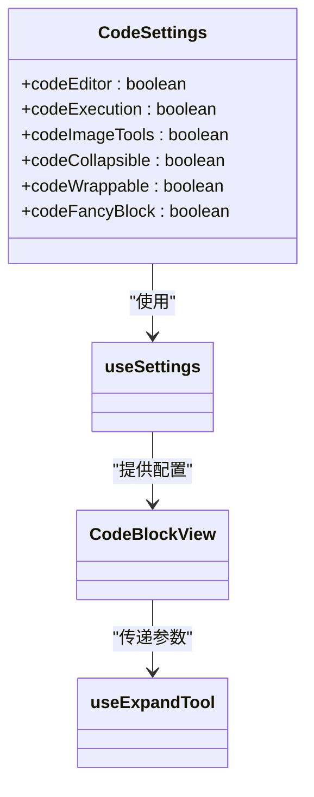
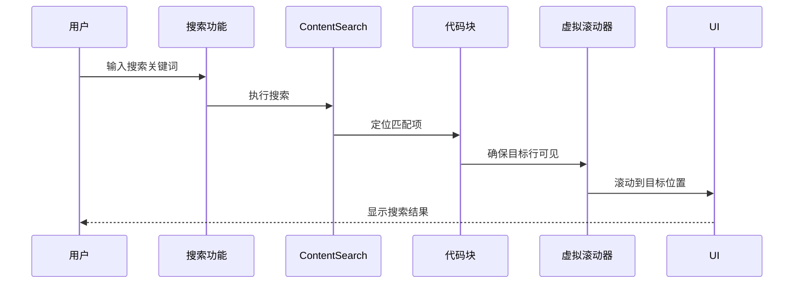

# 代码展开/折叠工具

<cite>
**本文档引用的文件**   
- [useExpandTool.tsx](file://src/renderer/src/components/CodeToolbar/hooks/useExpandTool.tsx)
- [CodeBlockView/view.tsx](file://src/renderer/src/components/CodeBlockView/view.tsx)
- [CodeViewer.tsx](file://src/renderer/src/components/CodeViewer.tsx)
- [constant.ts](file://src/renderer/src/config/constant.ts)
- [useSettings.ts](file://src/renderer/src/hooks/useSettings.ts)
- [settings.ts](file://src/renderer/src/store/settings.ts)
- [useCodeHighlight.ts](file://src/renderer/src/hooks/useCodeHighlight.ts)
- [ContentSearch.tsx](file://src/renderer/src/components/ContentSearch.tsx)
</cite>

## 目录
1. [简介](#简介)
2. [核心组件分析](#核心组件分析)
3. [状态管理机制](#状态管理机制)
4. [动画效果实现](#动画效果实现)
5. [性能优化策略](#性能优化策略)
6. [渐进式加载处理](#渐进式加载处理)
7. [配置选项说明](#配置选项说明)
8. [与其他编辑功能的协同](#与其他编辑功能的协同)
9. [结论](#结论)

## 简介
Cherry Studio的代码展开/折叠工具为用户提供了一种高效管理代码块显示状态的机制。该工具通过智能的状态管理、流畅的动画效果和优化的性能策略，提升了大型代码文件的浏览体验。本文档深入分析了`useExpandTool` Hook的实现细节，包括状态切换逻辑、动画实现方式、性能优化策略以及与其他编辑功能的协同工作。

## 核心组件分析

**Section sources**
- [useExpandTool.tsx](file://src/renderer/src/components/CodeToolbar/hooks/useExpandTool.tsx)
- [CodeBlockView/view.tsx](file://src/renderer/src/components/CodeBlockView/view.tsx)

## 状态管理机制

**Diagram sources**
- [useExpandTool.tsx](file://src/renderer/src/components/CodeToolbar/hooks/useExpandTool.tsx)
- [CodeBlockView/view.tsx](file://src/renderer/src/components/CodeBlockView/view.tsx)

代码展开/折叠工具的状态管理主要通过`useExpandTool` Hook实现，其核心逻辑包括：

1. **状态定义**：使用`useState`管理`expandOverride`状态，记录用户手动切换的展开状态。
2. **计算属性**：通过`useMemo`计算`shouldExpand`和`expandable`等衍生状态。
3. **副作用管理**：使用`useEffect`监听配置变化，自动重置用户操作。

状态切换逻辑如下：
- 当`codeCollapsible`设置为`false`时，代码块默认始终展开
- 当代码块高度超过`MAX_COLLAPSED_CODE_HEIGHT`（350px）时，才显示展开/折叠按钮
- 用户点击按钮时，通过`setExpandOverride`切换状态，实现展开/折叠功能

```mermaid
flowchart TD
A[开始] --> B{代码高度 > 350px?}
B --> |是| C[显示展开/折叠按钮]
B --> |否| D[隐藏按钮，始终展开]
C --> E{用户点击按钮?}
E --> |是| F[切换expandOverride状态]
F --> G[更新shouldExpand计算结果]
G --> H[渲染相应UI]
E --> |否| I[保持当前状态]
```

**Diagram sources**
- [CodeBlockView/view.tsx](file://src/renderer/src/components/CodeBlockView/view.tsx)
- [constant.ts](file://src/renderer/src/config/constant.ts)

**Section sources**
- [CodeBlockView/view.tsx](file://src/renderer/src/components/CodeBlockView/view.tsx#L103-L123)
- [useExpandTool.tsx](file://src/renderer/src/components/CodeToolbar/hooks/useExpandTool.tsx#L15-L36)

## 动画效果实现

代码展开/折叠的动画效果通过以下方式实现：

1. **CSS过渡**：使用CSS的`transition`属性实现平滑的高度变化
2. **虚拟滚动**：对于大型代码文件，采用虚拟滚动技术优化渲染性能
3. **渐进式高亮**：代码高亮采用渐进式处理，提升用户体验

**Diagram sources**
- [CodeViewer.tsx](file://src/renderer/src/components/CodeViewer.tsx)
- [CodeBlockView/view.tsx](file://src/renderer/src/components/CodeBlockView/view.tsx)

**Section sources**
- [CodeViewer.tsx](file://src/renderer/src/components/CodeViewer.tsx#L92-L153)
- [CodeBlockView/view.tsx](file://src/renderer/src/components/CodeBlockView/view.tsx#L243-L268)

## 性能优化策略

**Diagram sources**
- [CodeViewer.tsx](file://src/renderer/src/components/CodeViewer.tsx)
- [useCodeHighlight.ts](file://src/renderer/src/hooks/useCodeHighlight.ts)

代码展开/折叠工具采用了多项性能优化策略：

1. **虚拟滚动技术**：使用`@tanstack/react-virtual`实现虚拟滚动，只渲染可视区域内的代码行，大幅减少DOM节点数量。
2. **渐进式高亮**：通过`useCodeHighlight` Hook实现流式代码高亮，将高亮过程分批处理，避免阻塞主线程。
3. **防抖处理**：对高亮操作进行防抖处理，避免频繁触发高亮计算。
4. **资源清理**：在组件卸载时及时清理高亮资源，防止内存泄漏。

**Section sources**
- [CodeViewer.tsx](file://src/renderer/src/components/CodeViewer.tsx#L115-L148)
- [useCodeHighlight.ts](file://src/renderer/src/hooks/useCodeHighlight.ts#L32-L72)

## 渐进式加载处理

对于大型代码文件，系统采用渐进式加载策略：

1. **按需渲染**：通过虚拟滚动技术，只渲染当前可视区域的代码行
2. **分批高亮**：代码高亮按滚动位置分批进行，优先处理可视区域
3. **高度监测**：实时监测代码块高度变化，动态调整展开状态

**Diagram sources**
- [CodeViewer.tsx](file://src/renderer/src/components/CodeViewer.tsx)
- [useCodeHighlight.ts](file://src/renderer/src/hooks/useCodeHighlight.ts)

**Section sources**
- [CodeViewer.tsx](file://src/renderer/src/components/CodeViewer.tsx#L122-L148)
- [useCodeHighlight.ts](file://src/renderer/src/hooks/useCodeHighlight.ts#L32-L72)

## 配置选项说明

**Diagram sources**
- [useSettings.ts](file://src/renderer/src/hooks/useSettings.ts)
- [settings.ts](file://src/renderer/src/store/settings.ts)

系统提供了多项配置选项来定制代码块行为：

- **默认展开层级**：通过`codeCollapsible`配置项控制，默认值为`true`，可在设置中修改
- **用户偏好记忆**：用户的展开/折叠操作会被记录，下次打开同一代码块时保持相同状态
- **自动换行**：通过`codeWrappable`配置项控制是否启用自动换行
- **执行功能**：通过`codeExecution`配置项控制是否显示运行按钮

这些配置通过Redux Store集中管理，确保状态的一致性和可预测性。

**Section sources**
- [useSettings.ts](file://src/renderer/src/hooks/useSettings.ts#L26-L106)
- [settings.ts](file://src/renderer/src/store/settings.ts#L586-L620)
- [CodeBlockView/view.tsx](file://src/renderer/src/components/CodeBlockView/view.tsx#L59-L60)

## 与其他编辑功能的协同

代码展开/折叠工具与搜索、高亮等编辑功能紧密协同：

1. **与搜索功能协同**：当用户在代码块中进行搜索时，工具会确保搜索结果的可见性
2. **与高亮功能协同**：展开/折叠状态变化时，会触发相应区域的代码高亮
3. **与滚动功能协同**：滚动位置变化时，动态调整虚拟滚动的渲染范围

**Diagram sources**
- [ContentSearch.tsx](file://src/renderer/src/components/ContentSearch.tsx)
- [CodeViewer.tsx](file://src/renderer/src/components/CodeViewer.tsx)

**Section sources**
- [ContentSearch.tsx](file://src/renderer/src/components/ContentSearch.tsx#L195-L259)
- [CodeViewer.tsx](file://src/renderer/src/components/CodeViewer.tsx#L122-L148)

## 结论
Cherry Studio的代码展开/折叠工具通过精心设计的状态管理、流畅的动画效果和多项性能优化策略，为用户提供了优秀的代码浏览体验。工具的核心`useExpandTool` Hook实现了高效的状态切换逻辑，结合虚拟滚动和渐进式高亮技术，能够流畅处理大型代码文件。通过灵活的配置选项，用户可以根据个人偏好定制代码块的显示行为。该工具与搜索、高亮等编辑功能的紧密协同，进一步提升了代码编辑的整体体验。