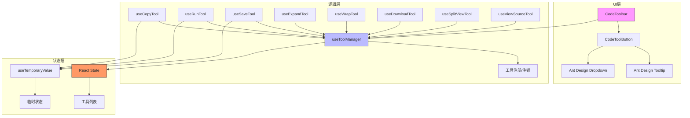
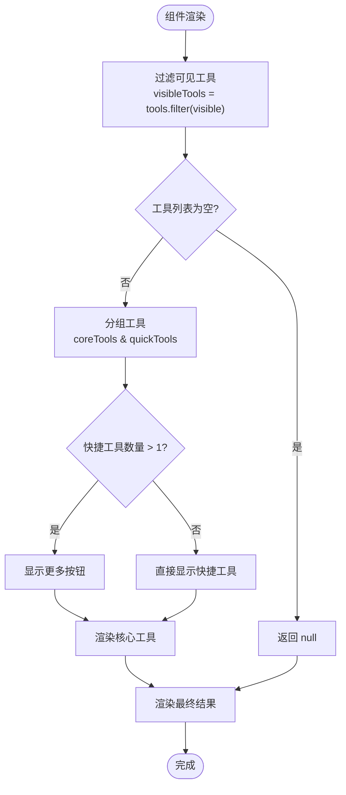
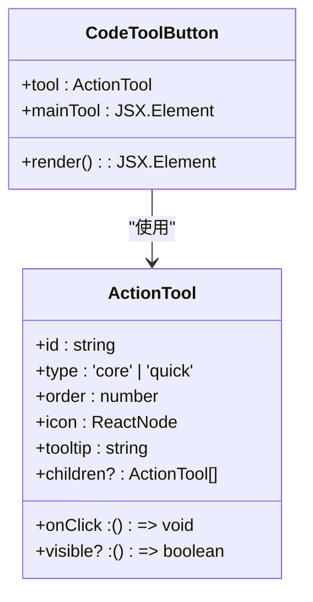
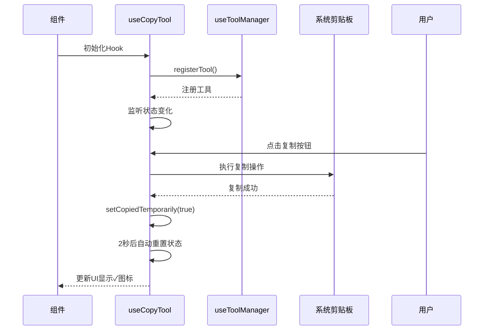
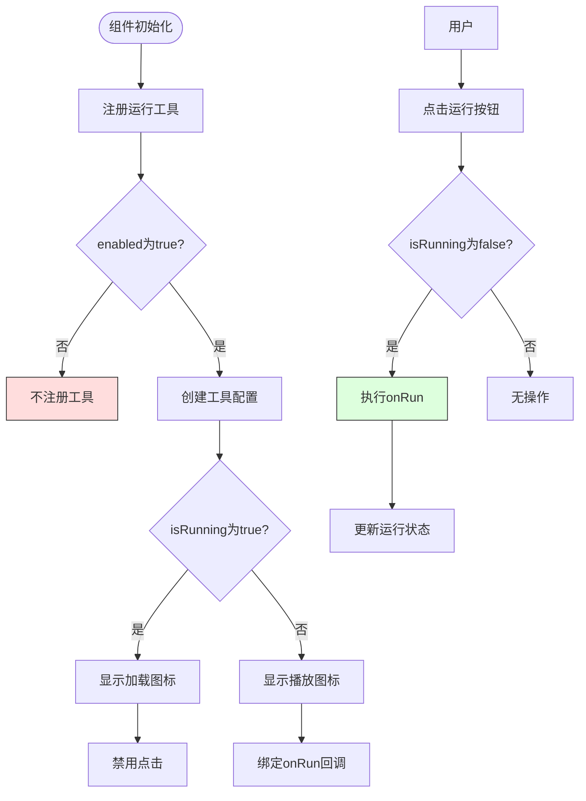
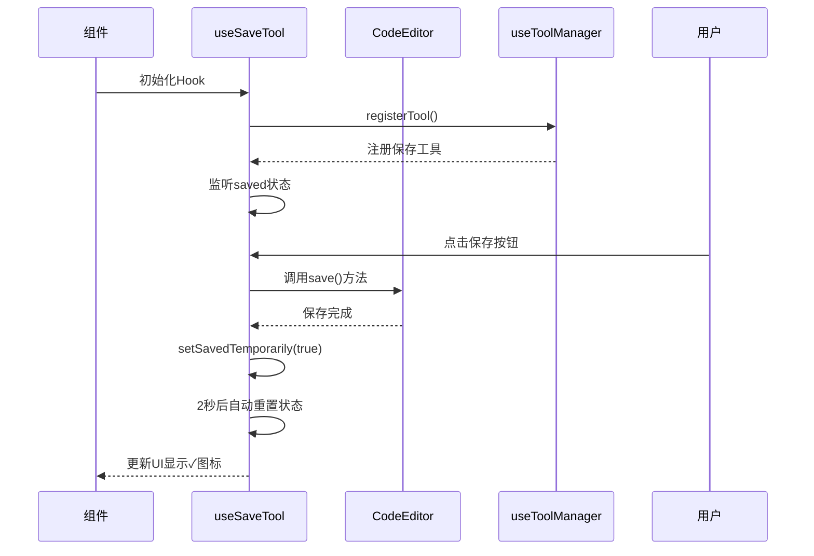
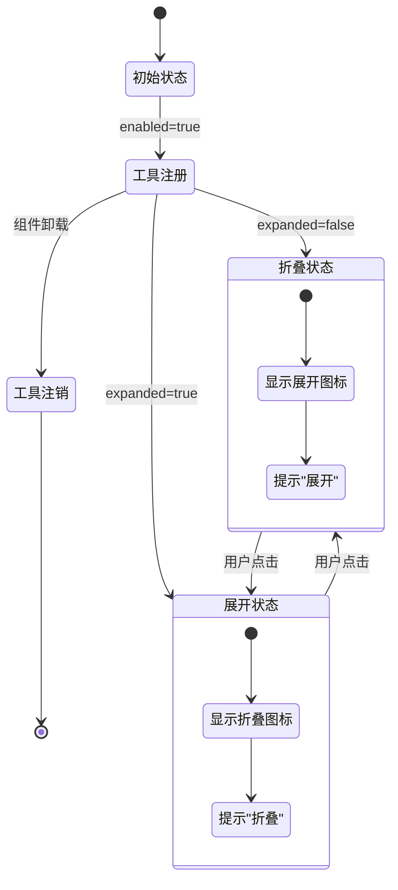
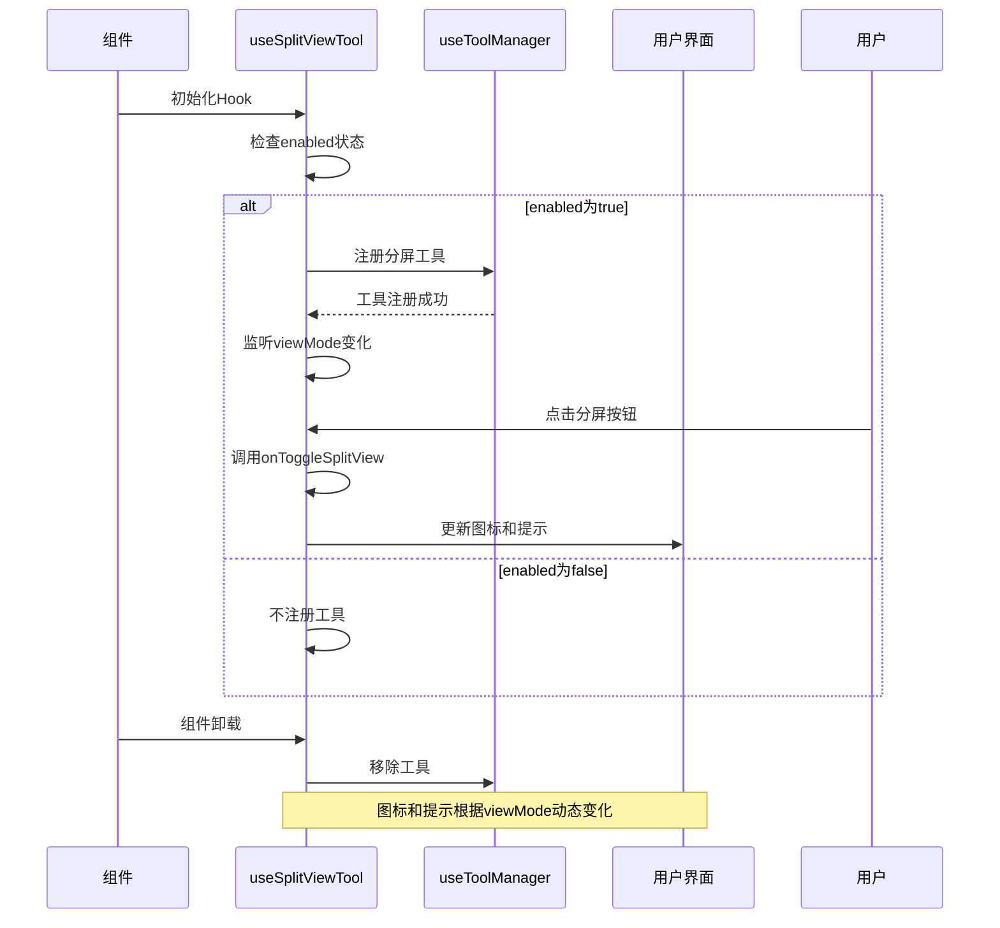
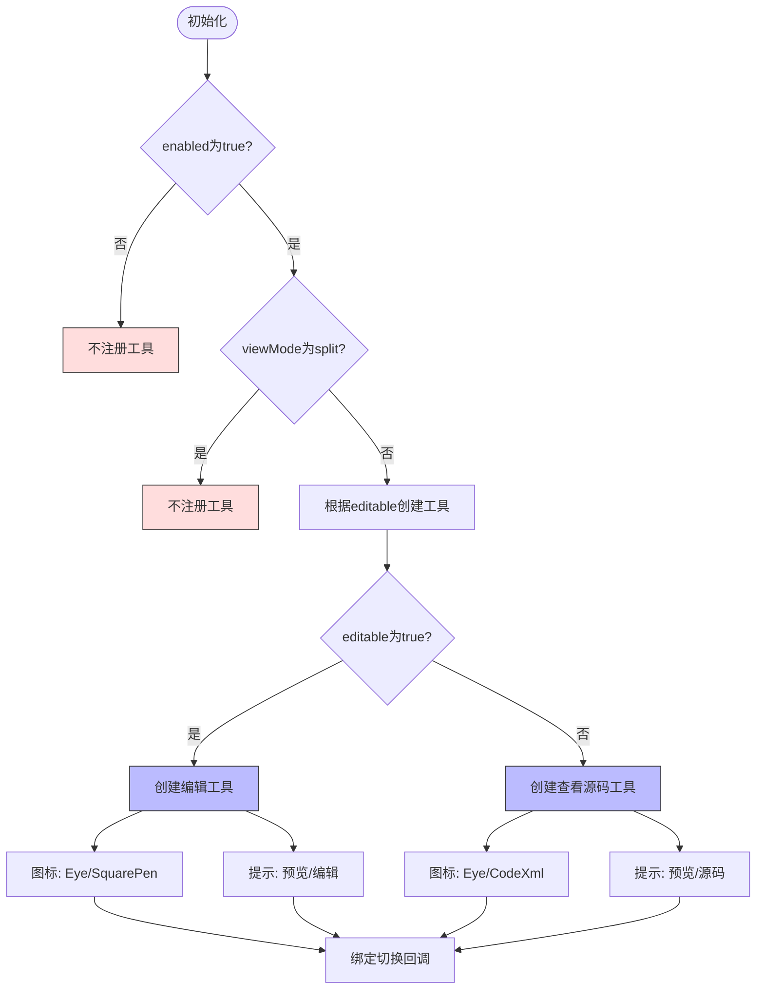

# 代码工具栏组件

<cite>
**本文档引用的文件**  
- [toolbar.tsx](file://src/renderer/src/components/CodeToolbar/toolbar.tsx)
- [button.tsx](file://src/renderer/src/components/CodeToolbar/button.tsx)
- [styles.ts](file://src/renderer/src/components/CodeToolbar/styles.ts)
- [useCopyTool.tsx](file://src/renderer/src/components/CodeToolbar/hooks/useCopyTool.tsx)
- [useRunTool.tsx](file://src/renderer/src/components/CodeToolbar/hooks/useRunTool.tsx)
- [useSaveTool.tsx](file://src/renderer/src/components/CodeToolbar/hooks/useSaveTool.tsx)
- [useExpandTool.tsx](file://src/renderer/src/components/CodeToolbar/hooks/useExpandTool.tsx)
- [useWrapTool.tsx](file://src/renderer/src/components/CodeToolbar/hooks/useWrapTool.tsx)
- [useDownloadTool.tsx](file://src/renderer/src/components/CodeToolbar/hooks/useDownloadTool.tsx)
- [useSplitViewTool.tsx](file://src/renderer/src/components/CodeToolbar/hooks/useSplitViewTool.tsx)
- [useViewSourceTool.tsx](file://src/renderer/src/components/CodeToolbar/hooks/useViewSourceTool.tsx)
- [index.ts](file://src/renderer/src/components/CodeToolbar/hooks/index.ts)
</cite>

## 目录
1. [简介](#简介)
2. [项目结构](#项目结构)
3. [核心组件](#核心组件)
4. [架构概述](#架构概述)
5. [详细组件分析](#详细组件分析)
6. [依赖分析](#依赖分析)
7. [性能考虑](#性能考虑)
8. [故障排除指南](#故障排除指南)
9. [结论](#结论)

## 简介
Cherry Studio的代码工具栏组件（CodeToolbar）为代码块提供了一套完整的交互式工具集，支持代码复制、运行、保存、展开/折叠等操作。该组件采用模块化设计，通过自定义Hook机制实现状态管理和功能扩展，具有良好的可扩展性和响应式特性。

## 项目结构
代码工具栏组件位于`src/renderer/src/components/CodeToolbar/`目录下，采用清晰的模块化结构：

```
CodeToolbar/
├── __tests__/
│   ├── 各功能单元测试文件
├── hooks/
│   ├── useCopyTool.tsx
│   ├── useRunTool.tsx
│   ├── useSaveTool.tsx
│   ├── useExpandTool.tsx
│   ├── useWrapTool.tsx
│   ├── useDownloadTool.tsx
│   ├── useSplitViewTool.tsx
│   └── useViewSourceTool.tsx
├── button.tsx
├── styles.ts
└── toolbar.tsx
```

**组件结构说明**：
- `toolbar.tsx`：工具栏主组件，负责布局和工具管理
- `button.tsx`：工具按钮组件，支持普通按钮和下拉菜单
- `styles.ts`：样式定义，使用styled-components实现主题化
- `hooks/`：各个工具功能的Hook实现，每个Hook封装特定功能

**Section sources**
- [toolbar.tsx](file://src/renderer/src/components/CodeToolbar/toolbar.tsx)
- [button.tsx](file://src/renderer/src/components/CodeToolbar/button.tsx)
- [styles.ts](file://src/renderer/src/components/CodeToolbar/styles.ts)

## 核心组件
代码工具栏的核心组件包括工具栏容器、工具按钮和一系列自定义Hook。这些组件协同工作，提供完整的代码操作功能。

**主要功能特性**：
- **代码复制**：支持复制代码内容和预览图
- **代码运行**：执行代码并显示结果
- **代码保存**：保存代码更改
- **展开/折叠**：控制代码块的显示状态
- **换行控制**：切换代码换行模式
- **下载功能**：支持下载源码和预览图
- **分屏视图**：切换单屏和分屏显示模式
- **源码查看**：在编辑模式和预览模式间切换

**Section sources**
- [toolbar.tsx](file://src/renderer/src/components/CodeToolbar/toolbar.tsx)
- [button.tsx](file://src/renderer/src/components/CodeToolbar/button.tsx)

## 架构概述
代码工具栏采用分层架构设计，各层职责分明：



**Diagram sources**
- [toolbar.tsx](file://src/renderer/src/components/CodeToolbar/toolbar.tsx)
- [useToolManager](file://src/renderer/src/components/ActionTools/index.ts)
- [useTemporaryValue](file://src/renderer/src/hooks/useTemporaryValue.ts)

## 详细组件分析

### 工具栏主组件分析
`CodeToolbar`组件是工具栏的容器，负责管理工具的显示和布局。

**核心功能**：
- 工具过滤：根据`visible`属性过滤显示的工具
- 工具分组：将工具分为核心工具和快捷工具
- 响应式布局：支持工具的折叠显示



**Diagram sources**
- [toolbar.tsx](file://src/renderer/src/components/CodeToolbar/toolbar.tsx#L12-L53)

**Section sources**
- [toolbar.tsx](file://src/renderer/src/components/CodeToolbar/toolbar.tsx)

### 工具按钮组件分析
`CodeToolButton`组件负责渲染单个工具按钮，支持普通按钮和下拉菜单两种模式。



**交互逻辑**：
- 当工具没有子工具时，渲染为普通按钮
- 当工具有子工具时，渲染为下拉菜单按钮
- 使用Tooltip提供工具提示
- 支持鼠标悬停效果

**Diagram sources**
- [button.tsx](file://src/renderer/src/components/CodeToolbar/button.tsx#L11-L39)
- [ActionTool](file://src/renderer/src/components/ActionTools/index.ts)

**Section sources**
- [button.tsx](file://src/renderer/src/components/CodeToolbar/button.tsx)

### 样式系统分析
工具栏的样式系统使用styled-components实现，提供了统一的视觉风格。

```mermaid
classDiagram
class ToolWrapper {
+display : flex
+align-items : center
+justify-content : center
+width : 24px
+height : 24px
+border-radius : 4px
+cursor : pointer
+transition : all 0.2s ease
+color : var(--color-text-3)
}
ToolWrapper --> & : hover : "悬停样式"
ToolWrapper --> &.active : "激活样式"
ToolWrapper --> .tool-icon : "图标样式"
class & : hover {
+background-color : var(--color-background-soft)
+.tool-icon : color : var(--color-text-1)
}
class &.active {
+color : var(--color-primary)
+.tool-icon : color : var(--color-primary)
}
class .tool-icon {
+width : 14px
+height : 14px
+color : var(--color-text-3)
}
```

**样式特性**：
- 固定尺寸：24×24像素
- 圆角设计：4像素圆角
- 悬停效果：背景色变化和图标颜色变化
- 激活状态：显示为主色调
- 图标样式：14×14像素，使用CSS变量控制颜色

**Diagram sources**
- [styles.ts](file://src/renderer/src/components/CodeToolbar/styles.ts#L3-L35)

**Section sources**
- [styles.ts](file://src/renderer/src/components/CodeToolbar/styles.ts)

## 详细功能分析

### 复制工具实现
`useCopyTool` Hook实现了代码复制功能，支持复制源码和预览图。



**关键特性**：
- 使用`useTemporaryValue`管理临时状态
- 复制成功后显示✓图标，2秒后恢复
- 支持复制预览图功能
- 可配置是否显示预览工具

**Section sources**
- [useCopyTool.tsx](file://src/renderer/src/components/CodeToolbar/hooks/useCopyTool.tsx)
- [useTemporaryValue](file://src/renderer/src/hooks/useTemporaryValue.ts)

### 运行工具实现
`useRunTool` Hook实现了代码运行功能。



**状态管理**：
- `enabled`：控制工具是否启用
- `isRunning`：显示运行状态（加载中/可运行）
- 使用`useTranslation`支持国际化

**Section sources**
- [useRunTool.tsx](file://src/renderer/src/components/CodeToolbar/hooks/useRunTool.tsx)

### 保存工具实现
`useSaveTool` Hook实现了代码保存功能。



**实现细节**：
- 通过`sourceViewRef`引用代码编辑器
- 保存成功后显示✓图标，2秒后恢复
- `enabled`参数控制工具是否显示

**Section sources**
- [useSaveTool.tsx](file://src/renderer/src/components/CodeToolbar/hooks/useSaveTool.tsx)

### 展开/折叠工具实现
`useExpandTool` Hook实现了代码块的展开/折叠功能。



**交互特性**：
- 图标动态变化：展开时显示`ChevronsDownUp`，折叠时显示`ChevronsUpDown`
- 提示文本动态变化：根据状态显示"展开"或"折叠"
- `expandable`参数控制工具是否可见
- `toggle`回调处理状态切换

**Section sources**
- [useExpandTool.tsx](file://src/renderer/src/components/CodeToolbar/hooks/useExpandTool.tsx)

### 换行控制工具实现
`useWrapTool` Hook实现了代码换行控制功能。

```mermaid
classDiagram
class useWrapTool {
+enabled : boolean
+wrapped : boolean
+wrappable : boolean
+toggle : () => void
+setTools : Dispatch<SetStateAction<ActionTool[]>>
}
useWrapTool --> ActionTool : "创建"
ActionTool --> ToolManager : "注册"
class ActionTool {
+id : "wrap"
+type : "core"
+order : 30
+icon : ReactNode
+tooltip : string
+visible : () => boolean
+onClick : () => void
}
note right of useWrapTool
根据wrapped状态动态设置 :
- 图标 : WrapIcon/UnWrapIcon
- 提示 : "开启换行"/"关闭换行"
end note
```

**功能特点**：
- 图标动态切换：换行时显示`WrapIcon`，不换行时显示`UnWrapIcon`
- 提示文本动态变化：根据状态显示"开启换行"或"关闭换行"
- `wrappable`参数控制工具可见性
- 通过`toggle`回调处理状态切换

**Section sources**
- [useWrapTool.tsx](file://src/renderer/src/components/CodeToolbar/hooks/useWrapTool.tsx)

### 下载工具实现
`useDownloadTool` Hook实现了代码和预览图的下载功能。

```mermaid
flowchart TD
A([初始化]) --> B[判断是否显示预览工具]
B --> |否| C[注册基础下载工具]
B --> |是| D[注册带下拉菜单的下载工具]
C --> E[绑定onDownloadSource回调]
D --> F[创建下拉菜单项]
F --> G[源码下载]
F --> H[SVG下载]
F --> I[PNG下载]
G --> J[调用onDownloadSource]
H --> K[调用previewRef.current?.download('svg')]
I --> L[调用previewRef.current?.download('png')]
style C fill:#bbf,stroke:#333
style D fill:#bbf,stroke:#333
style G fill:#dfd,stroke:#333
style H fill:#dfd,stroke:#333
style I fill:#dfd,stroke:#333
```

**多格式支持**：
- 源码下载：调用`onDownloadSource`回调
- SVG下载：通过`previewRef`调用下载SVG
- PNG下载：通过`previewRef`调用下载PNG
- 根据上下文自动切换显示模式

**Section sources**
- [useDownloadTool.tsx](file://src/renderer/src/components/CodeToolbar/hooks/useDownloadTool.tsx)

### 分屏视图工具实现
`useSplitViewTool` Hook实现了分屏视图的切换功能。



**视图模式**：
- 单屏模式：显示`SquareSplitHorizontal`图标，提示"分屏"
- 分屏模式：显示`Square`图标，提示"恢复"
- 通过`viewMode`参数同步当前视图状态

**Section sources**
- [useSplitViewTool.tsx](file://src/renderer/src/components/CodeToolbar/hooks/useSplitViewTool.tsx)

### 源码查看工具实现
`useViewSourceTool` Hook实现了源码查看模式的切换功能。



**模式切换**：
- 编辑模式：支持编辑和预览切换
- 只读模式：支持预览和源码查看切换
- 分屏模式：不显示此工具
- 图标和提示根据当前模式动态变化

**Section sources**
- [useViewSourceTool.tsx](file://src/renderer/src/components/CodeToolbar/hooks/useViewSourceTool.tsx)

## 依赖分析
代码工具栏组件依赖于多个核心模块和第三方库：

```mermaid
dependency-graph
CodeToolbar --> React
CodeToolbar --> styled-components
CodeToolbar --> antd
CodeToolbar --> lucide-react
useCopyTool --> useToolManager
useCopyTool --> useTemporaryValue
useCopyTool --> react-i18next
useRunTool --> useToolManager
useRunTool --> react-i18next
useSaveTool --> useToolManager
useSaveTool --> useTemporaryValue
useSaveTool --> react-i18next
useExpandTool --> useToolManager
useExpandTool --> react-i18next
useWrapTool --> useToolManager
useWrapTool --> react-i18next
useDownloadTool --> useToolManager
useDownloadTool --> react-i18next
useSplitViewTool --> useToolManager
useSplitViewTool --> react-i18next
useViewSourceTool --> useToolManager
useViewSourceTool --> react-i18next
CodeToolButton --> antd
CodeToolbar --> CodeToolButton
CodeToolbar --> HStack
style CodeToolbar fill:#f9f,stroke:#333
style useToolManager fill:#bbf,stroke:#333
style useTemporaryValue fill:#f96,stroke:#333
```

**主要依赖**：
- **React**：核心UI框架
- **styled-components**：CSS-in-JS样式解决方案
- **Ant Design**：UI组件库（Tooltip、Dropdown）
- **Lucide React**：图标库
- **react-i18next**：国际化支持
- **自定义Hook**：`useToolManager`、`useTemporaryValue`等

**Diagram sources**
- [package.json](file://package.json)
- [toolbar.tsx](file://src/renderer/src/components/CodeToolbar/toolbar.tsx)
- [hooks目录下所有文件](file://src/renderer/src/components/CodeToolbar/hooks/)

**Section sources**
- [package.json](file://package.json)
- [toolbar.tsx](file://src/renderer/src/components/CodeToolbar/toolbar.tsx)

## 性能考虑
代码工具栏组件在设计时考虑了多项性能优化：

1. **组件记忆化**：使用`memo`对`CodeToolbar`和`CodeToolButton`进行记忆化，避免不必要的重新渲染
2. **状态优化**：使用`useMemo`缓存计算结果，如`quickToolButtons`
3. **事件处理**：使用`useCallback`缓存事件处理函数，避免每次渲染都创建新函数
4. **条件渲染**：只在必要时渲染组件，如当工具列表为空时返回`null`
5. **资源管理**：在组件卸载时清理注册的工具，避免内存泄漏

**性能监控建议**：
- 监控工具栏的渲染性能，特别是在工具数量较多时
- 优化`useToolManager`的注册/注销性能
- 考虑对大量工具的支持，如虚拟滚动

## 故障排除指南

### 常见问题及解决方案

| 问题现象 | 可能原因 | 解决方案 |
|---------|---------|---------|
| 工具栏不显示 | 工具列表为空或所有工具都不可见 | 检查`tools`数组是否为空，确认工具的`visible`函数返回值 |
| 某个工具不显示 | `enabled`参数为`false`或`visible`函数返回`false` | 检查对应Hook的`enabled`参数和工具的`visible`函数 |
| 点击无响应 | `onClick`回调未正确绑定或存在错误 | 检查回调函数的实现，确保没有抛出异常 |
| 图标显示异常 | 图标组件未正确导入或样式冲突 | 检查图标导入路径和CSS样式 |
| 状态不更新 | 状态依赖项未正确设置 | 检查`useEffect`的依赖数组是否完整 |

### 调试技巧
1. 使用React DevTools检查组件状态和props
2. 在关键位置添加console.log调试信息
3. 检查`useToolManager`注册的工具列表
4. 验证回调函数是否被正确调用
5. 检查国际化字符串是否正确加载

**Section sources**
- [toolbar.tsx](file://src/renderer/src/components/CodeToolbar/toolbar.tsx)
- [button.tsx](file://src/renderer/src/components/CodeToolbar/button.tsx)
- [各useTool Hook文件](file://src/renderer/src/components/CodeToolbar/hooks/)

## 结论
Cherry Studio的代码工具栏组件是一个功能丰富、设计良好的UI组件，通过模块化和Hook机制实现了高度的可扩展性和可维护性。组件提供了完整的代码操作功能，包括复制、运行、保存、展开/折叠等，满足了开发者的基本需求。

**主要优势**：
- **模块化设计**：每个功能通过独立的Hook实现，便于维护和扩展
- **状态管理**：使用`useToolManager`统一管理工具状态，避免状态混乱
- **响应式布局**：支持工具的折叠显示，适应不同屏幕尺寸
- **国际化支持**：全面支持多语言
- **样式主题化**：使用CSS变量实现主题化，易于定制

**改进建议**：
- 增加更多可配置选项，如工具排序、自定义工具等
- 优化大量工具时的性能表现
- 增加键盘快捷键支持
- 提供更详细的文档和使用示例

该组件为Cherry Studio的代码编辑体验提供了重要支持，是项目中不可或缺的一部分。