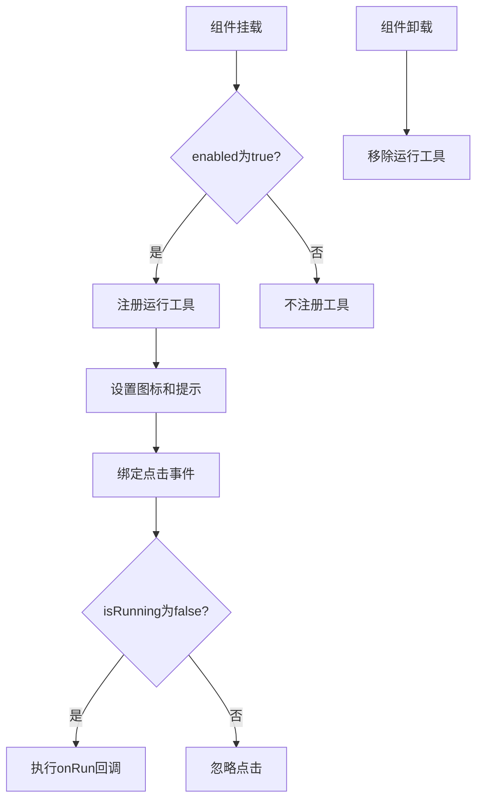
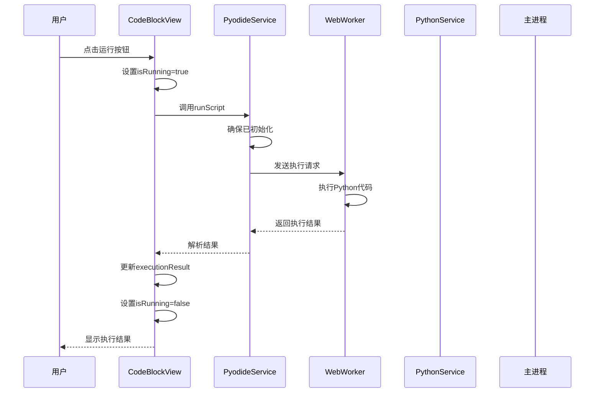
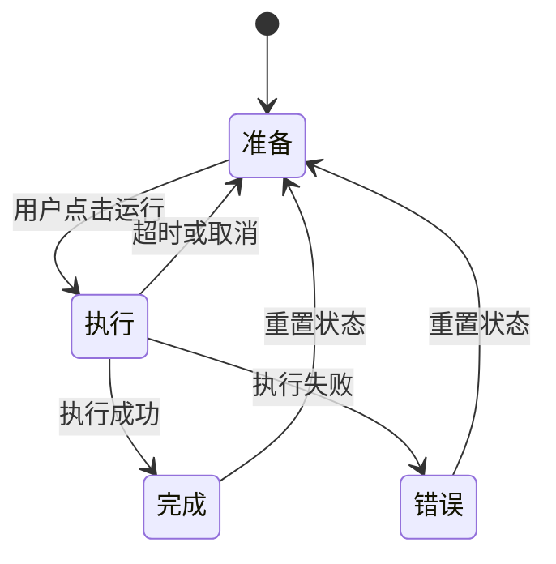
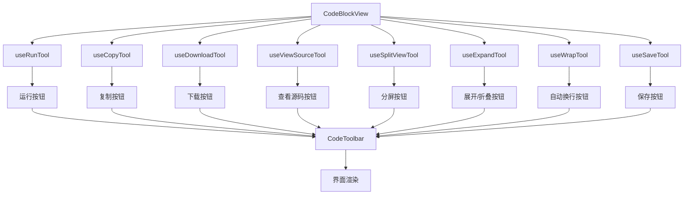
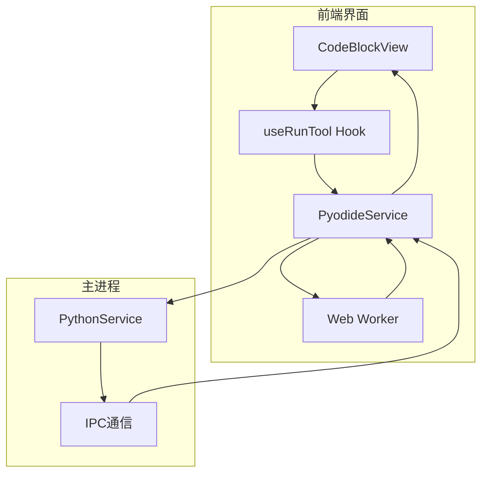

# 代码运行工具

<cite>
**本文档引用的文件**  
- [useRunTool.tsx](file://src/renderer/src/components/CodeToolbar/hooks/useRunTool.tsx)
- [CodeBlockView/view.tsx](file://src/renderer/src/components/CodeBlockView/view.tsx)
- [PyodideService.ts](file://src/renderer/src/services/PyodideService.ts)
- [PythonService.ts](file://src/main/services/PythonService.ts)
- [useToolManager.ts](file://src/renderer/src/components/ActionTools/hooks/useToolManager.ts)
- [types.ts](file://src/renderer/src/components/ActionTools/types.ts)
- [constants.ts](file://src/renderer/src/components/ActionTools/constants.ts)
</cite>

## 目录
1. [简介](#简介)
2. [核心组件分析](#核心组件分析)
3. [useRunTool Hook 工作原理](#useruntool-hook-工作原理)
4. [代码执行流程](#代码执行流程)
5. [运行状态生命周期管理](#运行状态生命周期管理)
6. [配置选项说明](#配置选项说明)
7. [前端界面集成](#前端界面集成)
8. [异常处理机制](#异常处理机制)
9. [架构图示](#架构图示)

## 简介
Cherry Studio代码运行工具为用户提供在应用内直接执行代码的能力，特别针对Python代码提供完整的执行环境。该工具通过前端界面集成、后端服务通信和运行时管理的协同工作，实现了安全、高效的代码执行体验。本文档详细说明useRunTool Hook的工作原理、代码执行流程、运行状态管理以及相关配置选项。

## 核心组件分析

**Section sources**
- [useRunTool.tsx](file://src/renderer/src/components/CodeToolbar/hooks/useRunTool.tsx)
- [CodeBlockView/view.tsx](file://src/renderer/src/components/CodeBlockView/view.tsx)
- [PyodideService.ts](file://src/renderer/src/services/PyodideService.ts)
- [PythonService.ts](file://src/main/services/PythonService.ts)

## useRunTool Hook 工作原理

useRunTool Hook是代码运行工具的核心前端组件，负责管理运行按钮的显示状态、交互逻辑和生命周期。该Hook接收四个关键参数：enabled（是否启用）、isRunning（是否正在运行）、onRun（运行回调函数）和setTools（工具状态更新函数）。

当组件挂载时，useRunTool通过useEffect监听这些参数的变化。如果enabled为true，它会调用registerTool函数注册运行工具；当组件卸载时，通过返回的清理函数调用removeTool移除工具，避免内存泄漏。

运行按钮的图标会根据isRunning状态动态切换：运行时显示加载图标，空闲时显示播放图标。点击事件处理函数通过短路运算符!isRunning && onRun?.()确保只有在非运行状态下才会触发onRun回调，防止重复执行。

**Diagram sources**
- [useRunTool.tsx](file://src/renderer/src/components/CodeToolbar/hooks/useRunTool.tsx#L15-L30)

**Section sources**
- [useRunTool.tsx](file://src/renderer/src/components/CodeToolbar/hooks/useRunTool.tsx#L8-L12)

## 代码执行流程

代码执行流程涉及前端界面、渲染进程和主进程的协同工作。当用户点击运行按钮时，首先触发CodeBlockView组件中的handleRunScript函数，该函数设置isRunning状态为true并清空之前的执行结果。

随后，系统调用pyodideService的runScript方法执行Python代码。如果Pyodide环境尚未初始化，系统会先完成初始化过程。执行请求通过Web Worker异步处理，Worker返回结果后，系统将其格式化并更新executionResult状态。无论执行成功或失败，最终都会将isRunning状态重置为false。

在主进程层面，PythonService通过IPC机制与渲染进程通信。当收到执行请求时，它创建一个Promise并存储在pendingRequests映射中，然后将请求发送到渲染进程。执行完成后，渲染进程通过IPC返回结果，主进程找到对应的Promise并解析或拒绝。

**Diagram sources**
- [CodeBlockView/view.tsx](file://src/renderer/src/components/CodeBlockView/view.tsx#L152-L169)
- [PyodideService.ts](file://src/renderer/src/services/PyodideService.ts#L151-L199)
- [PythonService.ts](file://src/main/services/PythonService.ts#L57-L95)

**Section sources**
- [CodeBlockView/view.tsx](file://src/renderer/src/components/CodeBlockView/view.tsx#L152-L169)

## 运行状态生命周期管理

代码运行工具的运行状态管理涵盖了准备、执行、完成和错误四种主要状态。状态管理通过isRunning布尔值和executionResult对象实现。

准备状态：当用户准备执行代码时，系统检查代码语言是否为Python且执行功能已启用。此时运行按钮处于可点击状态，显示播放图标。

执行状态：用户点击运行按钮后，isRunning状态立即设置为true，按钮图标切换为加载动画，禁用再次点击。系统开始执行代码，期间界面显示加载状态。

完成状态：代码执行成功后，系统将执行结果（文本输出或图像）存储在executionResult中，并在状态栏显示。同时isRunning状态重置为false，按钮恢复为可点击状态。

错误状态：执行过程中发生任何错误（如初始化失败、超时或运行时异常），系统捕获错误信息并格式化为用户友好的错误消息，同样通过executionResult显示在界面中。

**Diagram sources**
- [CodeBlockView/view.tsx](file://src/renderer/src/components/CodeBlockView/view.tsx#L84-L86)
- [PyodideService.ts](file://src/renderer/src/services/PyodideService.ts#L156-L163)

**Section sources**
- [CodeBlockView/view.tsx](file://src/renderer/src/components/CodeBlockView/view.tsx#L84-L86)

## 配置选项说明

代码运行工具提供多项配置选项，允许用户根据需求定制执行环境。主要配置包括执行环境选择和超时设置。

执行环境选择：目前工具主要支持Python执行环境，通过Pyodide在浏览器中运行Python代码。系统通过codeExecution.enabled配置项控制是否启用代码执行功能，通过language === 'python'条件限制仅Python代码可执行。

超时设置：系统提供可配置的超时机制，防止长时间运行的代码阻塞界面。超时时间通过codeExecution.timeoutMinutes配置项设置，单位为分钟。在PyodideService中，默认运行超时为60秒，可通过参数覆盖。主进程中的PythonService额外添加5秒缓冲时间处理IPC通信延迟。

其他相关配置包括：是否启用代码编辑器(codeEditor.enabled)、是否启用代码图像工具(codeImageTools)、是否启用代码折叠(codeCollapsible)和自动换行(codeWrappable)等，这些配置共同决定了代码块的显示和交互行为。

**Section sources**
- [CodeBlockView/view.tsx](file://src/renderer/src/components/CodeBlockView/view.tsx#L58-L59)
- [PyodideService.ts](file://src/renderer/src/services/PyodideService.ts#L6-L13)

## 前端界面集成

代码运行功能在前端界面中通过CodeBlockView组件集成。该组件使用多种自定义Hook管理不同的工具按钮，包括复制、下载、运行、展开/折叠等。

运行工具的集成通过useRunTool Hook实现，传递isExecutable条件（执行功能启用且语言为Python）、isRunning状态、handleRunScript回调函数和setTools状态更新函数。当满足执行条件时，运行按钮显示在代码工具栏中。

执行结果显示在代码块底部的状态栏中，支持文本输出和图像显示（如Matplotlib图表）。对于包含图像的执行结果，系统使用ImageViewer组件渲染，并添加点击交互功能。

工具栏的显示逻辑通过useMemo优化，仅在相关依赖变化时重新计算。状态更新使用React的startTransition进行优化，确保界面响应性。

**Diagram sources**
- [CodeBlockView/view.tsx](file://src/renderer/src/components/CodeBlockView/view.tsx#L209-L239)

**Section sources**
- [CodeBlockView/view.tsx](file://src/renderer/src/components/CodeBlockView/view.tsx#L209-L239)

## 异常处理机制

代码运行工具实现了多层次的异常处理机制，确保系统的稳定性和用户体验。

前端异常处理：在handleRunScript函数中，系统使用Promise的catch方法捕获执行过程中的任何异常，包括Pyodide初始化失败和代码运行错误。捕获的错误被格式化为用户友好的消息并显示在界面中。

超时处理：PyodideService和PythonService都实现了超时机制。PyodideService使用Promise.race模式设置执行超时，超时后自动拒绝Promise。PythonService在主进程侧设置超时，超时后清理pendingRequests并拒绝Promise。

资源清理：当Worker终止或发生错误时，系统清理所有等待的请求解析器，防止内存泄漏。在组件卸载时，useRunTool Hook会自动移除注册的工具，确保资源正确释放。

错误日志：系统使用loggerService记录各种错误信息，包括初始化失败、执行超时和运行时异常，便于问题排查和调试。

**Section sources**
- [CodeBlockView/view.tsx](file://src/renderer/src/components/CodeBlockView/view.tsx#L160-L165)
- [PyodideService.ts](file://src/renderer/src/services/PyodideService.ts#L175-L178)
- [PythonService.ts](file://src/main/services/PythonService.ts#L73-L76)

## 架构图示

**Diagram sources**
- [CodeBlockView/view.tsx](file://src/renderer/src/components/CodeBlockView/view.tsx)
- [PyodideService.ts](file://src/renderer/src/services/PyodideService.ts)
- [PythonService.ts](file://src/main/services/PythonService.ts)