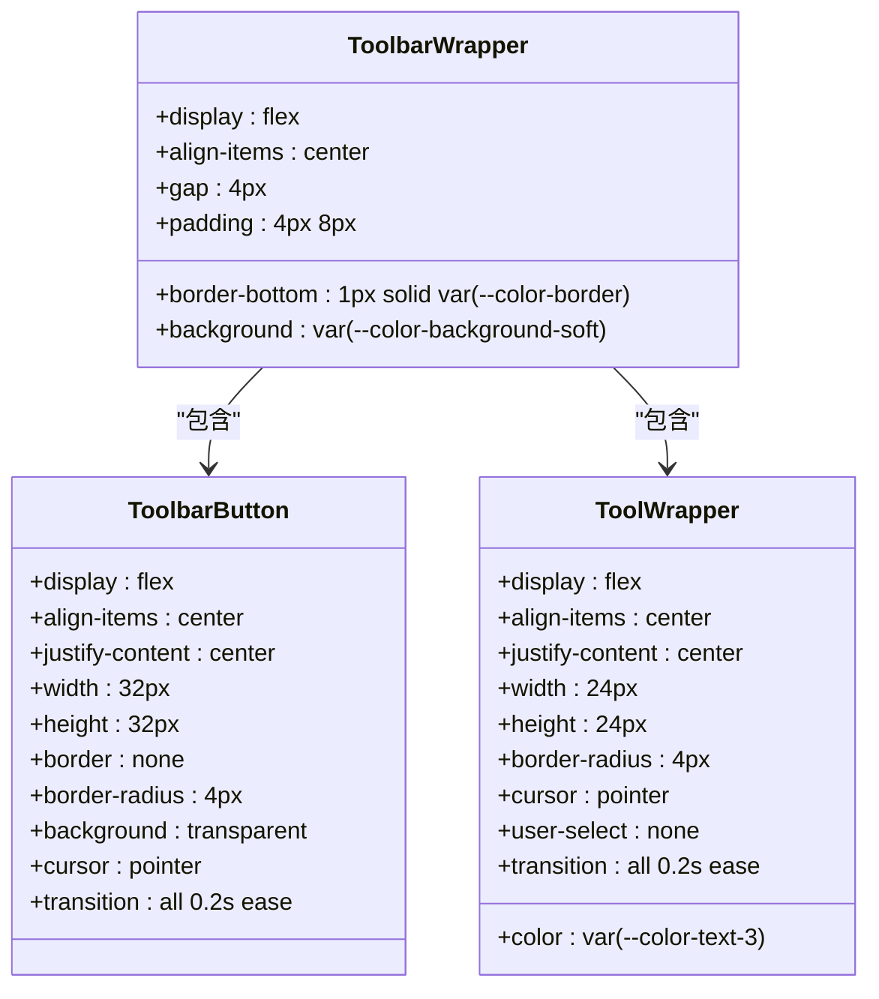
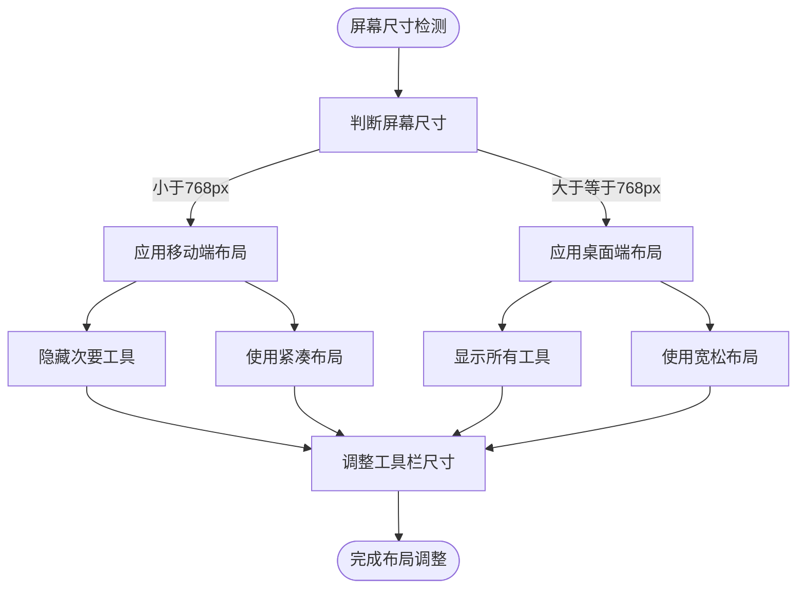
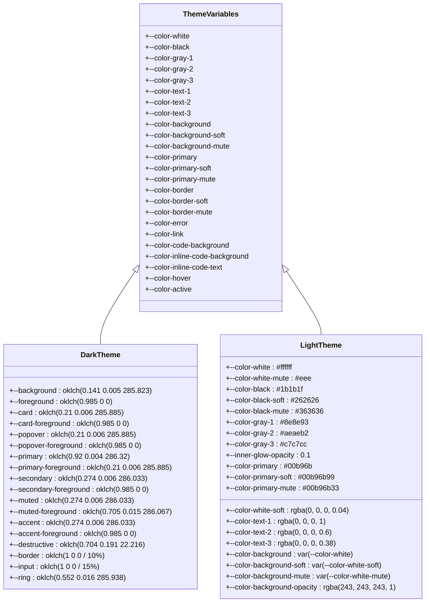
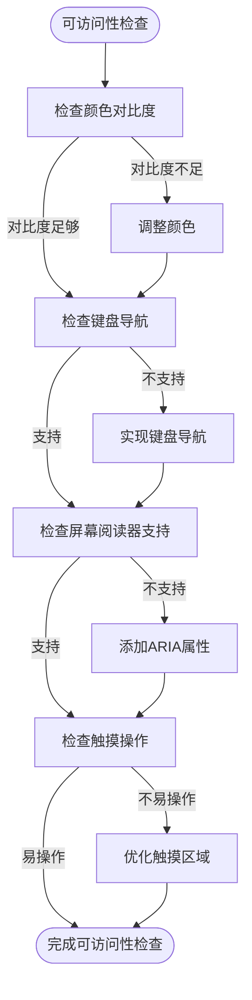
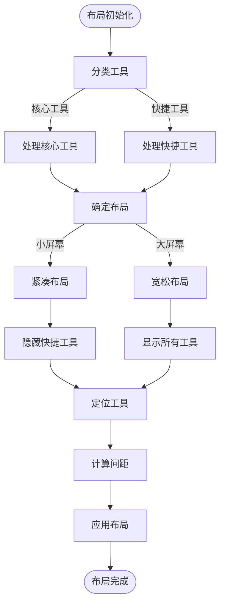
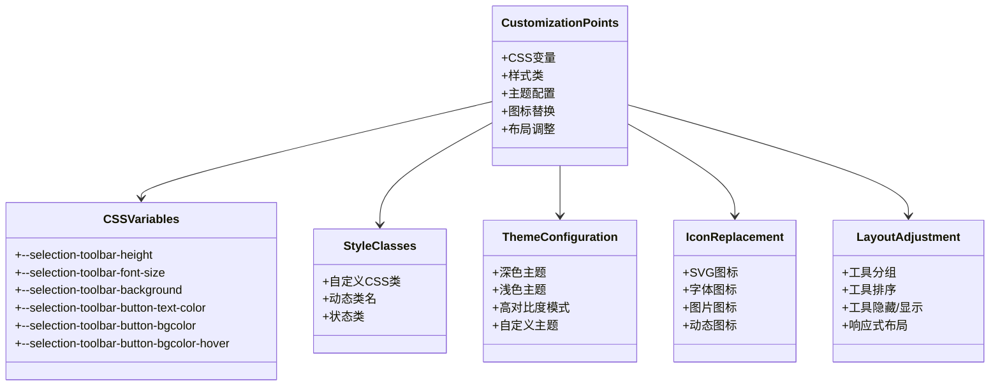

# 工具栏样式与布局

<cite>
**本文档引用的文件**
- [toolbar.tsx](file://src/renderer/src/components/CodeToolbar/toolbar.tsx)
- [styles.ts](file://src/renderer/src/components/CodeToolbar/styles.ts)
- [button.tsx](file://src/renderer/src/components/CodeToolbar/button.tsx)
- [toolbar.tsx](file://src/renderer/src/components/RichEditor/toolbar.tsx)
- [styles.ts](file://src/renderer/src/components/RichEditor/styles.ts)
- [selection-toolbar.css](file://src/renderer/src/assets/styles/selection-toolbar.css)
- [color.css](file://src/renderer/src/assets/styles/color.css)
- [tailwind.css](file://src/renderer/src/assets/styles/tailwind.css)
- [style.ts](file://src/renderer/src/utils/style.ts)
</cite>

## 目录
1. [简介](#简介)
2. [核心组件](#核心组件)
3. [CSS-in-JS实现方案](#css-in-js实现方案)
4. [响应式设计策略](#响应式设计策略)
5. [主题适配机制](#主题适配机制)
6. [可访问性考虑](#可访问性考虑)
7. [布局算法](#布局算法)
8. [自定义样式扩展点](#自定义样式扩展点)
9. [视觉一致性维护](#视觉一致性维护)

## 简介
Cherry Studio的工具栏样式与布局系统采用CSS-in-JS技术实现，提供了高度可定制的用户界面。该系统支持多种工具栏类型，包括代码工具栏、富文本编辑器工具栏和选择工具栏，每种工具栏都针对其特定使用场景进行了优化。系统通过styled-components库实现动态样式，并结合CSS变量和响应式设计原则，确保在不同设备和主题下都能提供一致的用户体验。

## 核心组件
工具栏系统由多个核心组件构成，这些组件通过组合和继承的方式实现不同的功能和外观。主要组件包括工具栏容器、工具按钮、分隔符和下拉菜单等。这些组件的设计遵循模块化原则，使得它们可以在不同的上下文中重复使用。

**Section sources**
- [toolbar.tsx](file://src/renderer/src/components/CodeToolbar/toolbar.tsx)
- [toolbar.tsx](file://src/renderer/src/components/RichEditor/toolbar.tsx)

## CSS-in-JS实现方案
工具栏的样式主要通过styled-components库实现，这是一种CSS-in-JS的解决方案，允许将CSS样式直接写在JavaScript/TypeScript文件中。这种实现方式提供了动态样式的能力，可以根据组件的状态和属性实时调整样式。

工具栏的CSS-in-JS实现采用了组件化的样式定义方式，每个样式组件都封装了特定的视觉特征和交互行为。例如，`ToolbarWrapper`组件定义了工具栏的容器样式，包括布局、间距和背景等；`ToolbarButton`组件则定义了工具按钮的外观和交互效果。

样式定义中广泛使用了CSS变量，这些变量在`:root`选择器中定义，并可以在整个应用中共享。这种方式使得主题切换和样式定制变得更加容易，因为只需要修改变量的值就可以全局改变应用的外观。

**Diagram sources**
- [styles.ts](file://src/renderer/src/components/RichEditor/styles.ts)
- [styles.ts](file://src/renderer/src/components/CodeToolbar/styles.ts)

**Section sources**
- [styles.ts](file://src/renderer/src/components/RichEditor/styles.ts)
- [styles.ts](file://src/renderer/src/components/CodeToolbar/styles.ts)

## 响应式设计策略
工具栏系统采用了响应式设计策略，能够根据屏幕尺寸动态调整布局和显示方式。系统定义了多个断点，用于区分不同的屏幕尺寸，包括超小屏幕(0px)、小屏幕(576px)、中等屏幕(768px)、大屏幕(1080px)、超大屏幕(1200px)和超超大屏幕(1400px)。

在不同屏幕尺寸下，工具栏会自动调整其布局和内容密度。例如，在小屏幕上，工具栏可能会隐藏一些次要功能，只显示核心工具；在大屏幕上，则可以显示完整的工具集。这种自适应布局确保了在移动设备和桌面设备上都能提供良好的用户体验。

响应式设计还体现在工具栏的定位和尺寸上。工具栏可以设置为固定定位(sticky)，使其在页面滚动时保持可见。同时，工具栏的尺寸也会根据屏幕尺寸进行调整，以确保在不同设备上都有合适的点击区域。

**Diagram sources**
- [style.ts](file://src/renderer/src/utils/style.ts)
- [Sortable.tsx](file://src/renderer/src/components/dnd/Sortable.tsx)

**Section sources**
- [style.ts](file://src/renderer/src/utils/style.ts)
- [Sortable.tsx](file://src/renderer/src/components/dnd/Sortable.tsx)

## 主题适配机制
工具栏系统实现了完善的主题适配机制，支持深色和浅色两种主题模式。主题切换通过CSS变量实现，这些变量在`:root`选择器中定义，并在不同主题模式下有不同的值。

深色主题使用较暗的背景色和较亮的前景色，以减少在暗环境下的视觉疲劳；浅色主题则使用较亮的背景色和较暗的前景色，以提供清晰的视觉对比。主题变量涵盖了颜色、字体、间距等多个方面，确保整个工具栏在主题切换时能够协调一致地变化。

主题适配还考虑了可访问性要求，确保在不同主题下文本和背景之间有足够的对比度。系统使用WCAG 2.0规范计算颜色的相对亮度，并根据亮度值选择合适的文本颜色，以保证可读性。

**Diagram sources**
- [color.css](file://src/renderer/src/assets/styles/color.css)
- [tailwind.css](file://src/renderer/src/assets/styles/tailwind.css)

**Section sources**
- [color.css](file://src/renderer/src/assets/styles/color.css)
- [tailwind.css](file://src/renderer/src/assets/styles/tailwind.css)

## 可访问性考虑
工具栏系统在设计时充分考虑了可访问性要求，确保所有用户，包括残障人士，都能方便地使用。系统遵循WCAG 2.0规范，通过计算颜色的相对亮度来确保文本和背景之间有足够的对比度。

工具按钮都配备了适当的ARIA属性，如`aria-label`和`aria-disabled`，以提供更好的屏幕阅读器支持。同时，工具栏支持键盘导航，用户可以通过Tab键在工具按钮之间移动，并通过Enter键激活选中的工具。

对于视觉障碍用户，系统提供了高对比度模式，通过调整颜色变量的值来增强视觉对比。此外，工具栏的点击区域大小也经过优化，确保在触摸设备上易于操作。

**Diagram sources**
- [style.ts](file://src/renderer/src/utils/style.ts)
- [color.css](file://src/renderer/src/assets/styles/color.css)

**Section sources**
- [style.ts](file://src/renderer/src/utils/style.ts)
- [color.css](file://src/renderer/src/assets/styles/color.css)

## 布局算法
工具栏的布局算法基于Flexbox和CSS Grid技术实现，能够根据屏幕尺寸和内容动态调整布局。算法的核心是将工具栏划分为多个逻辑区域，每个区域包含一组相关的工具按钮。

布局算法首先根据工具的类型将其分类，如核心工具、快捷工具等。然后根据屏幕尺寸决定每个区域的显示方式，如在小屏幕上将快捷工具隐藏在"更多"按钮后面，在大屏幕上则直接显示所有工具。

算法还考虑了工具的优先级和使用频率，高频使用的工具会被放置在更显眼的位置。同时，算法支持动态调整，当用户自定义工具栏时，布局会自动重新计算以适应新的配置。

**Diagram sources**
- [toolbar.tsx](file://src/renderer/src/components/CodeToolbar/toolbar.tsx)
- [toolbar.tsx](file://src/renderer/src/components/RichEditor/toolbar.tsx)

**Section sources**
- [toolbar.tsx](file://src/renderer/src/components/CodeToolbar/toolbar.tsx)
- [toolbar.tsx](file://src/renderer/src/components/RichEditor/toolbar.tsx)

## 自定义样式扩展点
工具栏系统提供了多个自定义样式扩展点，允许用户根据需要修改工具栏的外观。这些扩展点主要包括CSS变量、样式类和主题配置等。

用户可以通过修改CSS变量来改变工具栏的颜色、字体、间距等基本样式。例如，可以通过修改`--selection-toolbar-background`变量来改变选择工具栏的背景色，通过修改`--selection-toolbar-button-text-color`变量来改变按钮文本的颜色。

系统还支持通过样式类来添加自定义样式。用户可以为工具栏或工具按钮添加自定义的CSS类，然后在自己的样式文件中定义这些类的样式。这种方式提供了更大的灵活性，可以实现复杂的样式效果。

**Diagram sources**
- [selection-toolbar.css](file://src/renderer/src/assets/styles/selection-toolbar.css)
- [color.css](file://src/renderer/src/assets/styles/color.css)

**Section sources**
- [selection-toolbar.css](file://src/renderer/src/assets/styles/selection-toolbar.css)
- [color.css](file://src/renderer/src/assets/styles/color.css)

## 视觉一致性维护
为了确保工具栏与其他UI组件的视觉一致性，系统采用了一系列设计和实现策略。首先，所有组件都使用相同的颜色调色板和字体系统，确保在整个应用中颜色和字体的一致性。

其次，组件的间距和圆角半径等几何属性也遵循统一的设计规范。例如，工具按钮的圆角半径为4px，与其他按钮组件保持一致；工具栏的内边距和外边距也遵循统一的间距系统。

系统还使用了Ant Design等UI框架的组件，这些组件本身就遵循一致的设计语言。通过继承和扩展这些组件的样式，可以确保新组件与现有组件在视觉上协调一致。

最后，系统提供了设计系统文档和样式指南，指导开发人员如何正确使用和扩展UI组件，确保在团队协作开发中也能保持视觉一致性。

**Section sources**
- [color.css](file://src/renderer/src/assets/styles/color.css)
- [font.css](file://src/renderer/src/assets/styles/font.css)
- [tailwind.css](file://src/renderer/src/assets/styles/tailwind.css)