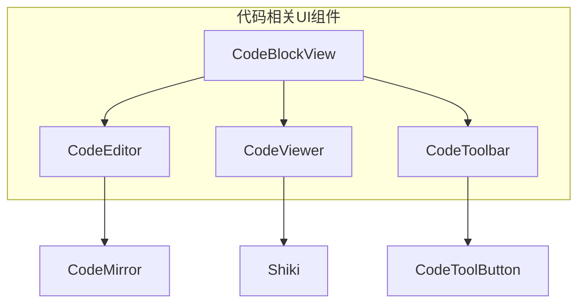
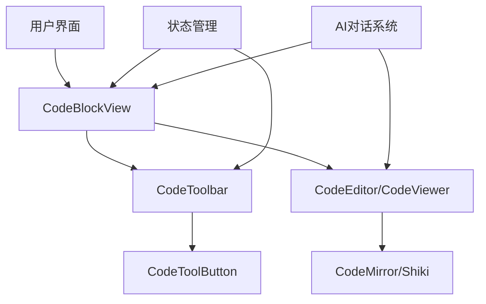
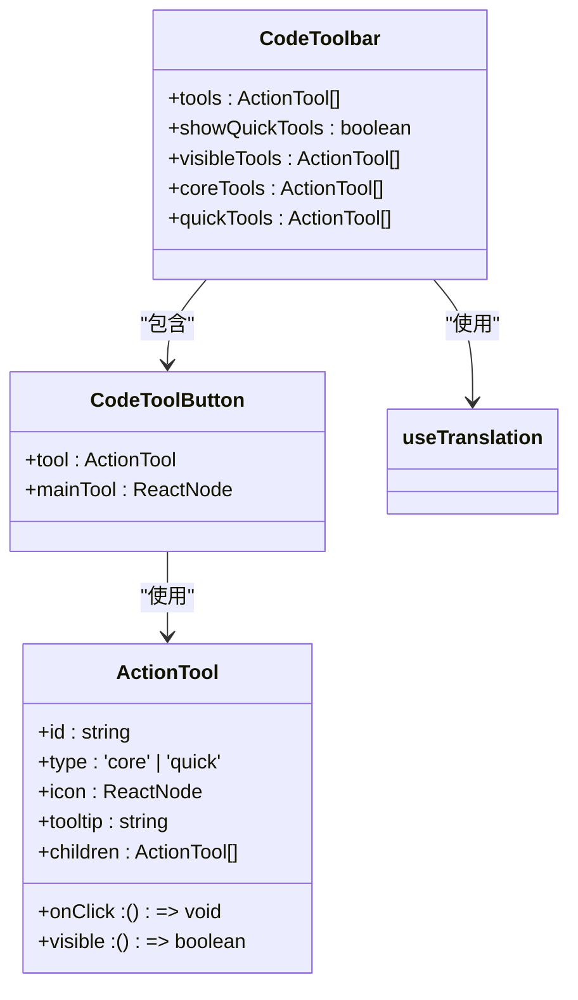
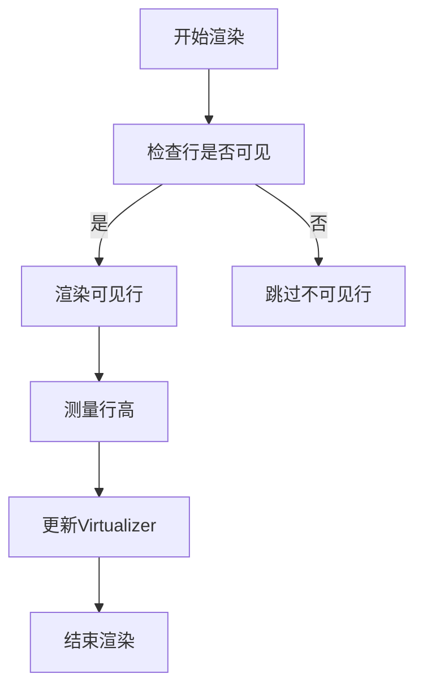
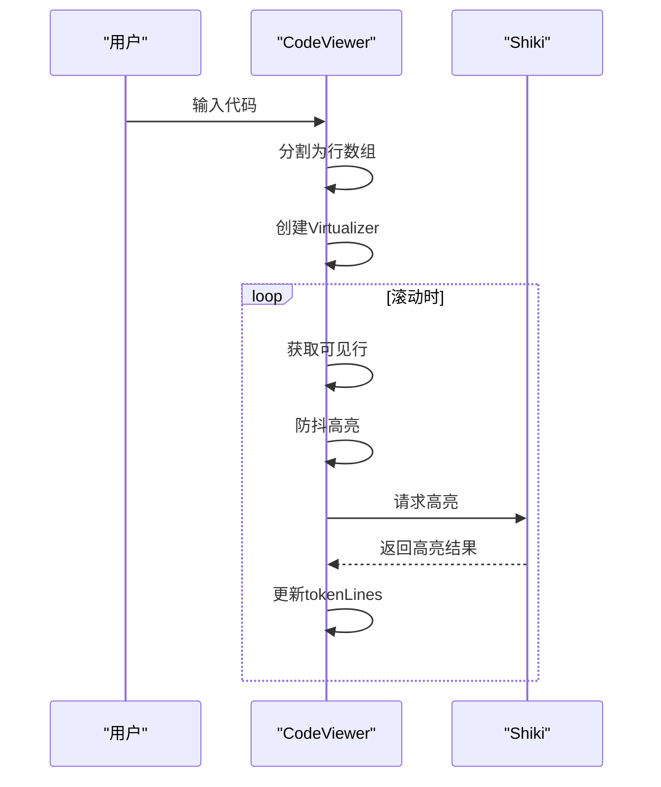
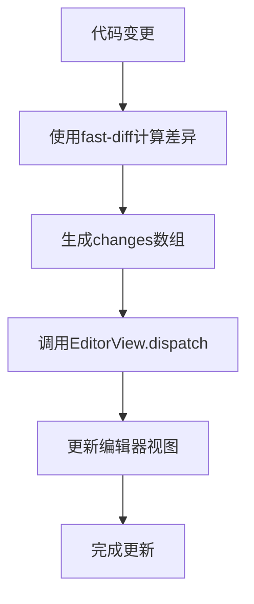

# 代码相关组件

<cite>
**本文档引用的文件**  
- [CodeEditor/index.tsx](file://src/renderer/src/components/CodeEditor/index.tsx)
- [CodeToolbar/toolbar.tsx](file://src/renderer/src/components/CodeToolbar/toolbar.tsx)
- [CodeToolbar/button.tsx](file://src/renderer/src/components/CodeToolbar/button.tsx)
- [CodeBlockView/view.tsx](file://src/renderer/src/components/CodeBlockView/view.tsx)
- [CodeBlockView/constants.ts](file://src/renderer/src/components/CodeBlockView/constants.ts)
- [CodeViewer.tsx](file://src/renderer/src/components/CodeViewer.tsx)
- [useCodeHighlight.ts](file://src/renderer/src/hooks/useCodeHighlight.ts)
- [CodeToolbar/hooks/useViewSourceTool.tsx](file://src/renderer/src/components/CodeToolbar/hooks/useViewSourceTool.tsx)
- [CodeToolbar/hooks/useSaveTool.tsx](file://src/renderer/src/components/CodeToolbar/hooks/useSaveTool.tsx)
- [CodeToolbar/hooks/useRunTool.tsx](file://src/renderer/src/components/CodeToolbar/hooks/useRunTool.tsx)
- [main/services/CodeToolsService.ts](file://src/main/services/CodeToolsService.ts)
</cite>

## 目录
1. [简介](#简介)
2. [项目结构](#项目结构)
3. [核心组件](#核心组件)
4. [架构概述](#架构概述)
5. [详细组件分析](#详细组件分析)
6. [依赖分析](#依赖分析)
7. [性能考虑](#性能考虑)
8. [故障排除指南](#故障排除指南)
9. [结论](#结论)

## 简介
本文档详细描述了Cherry Studio中与代码相关的UI组件，包括CodeEditor、CodeToolbar、CodeBlockView和CodeViewer。这些组件共同构成了一个功能丰富的代码编辑和展示系统，支持代码高亮、语法分析、工具栏操作和代码块渲染。文档将深入探讨这些组件的实现机制、集成方式以及它们如何与AI对话系统协同工作。

## 项目结构
Cherry Studio的代码相关UI组件主要位于`src/renderer/src/components`目录下，采用模块化设计，各组件职责分明且高度可复用。



**图表来源**
- [CodeBlockView/view.tsx](file://src/renderer/src/components/CodeBlockView/view.tsx#L1-L402)
- [CodeEditor/index.tsx](file://src/renderer/src/components/CodeEditor/index.tsx#L1-L281)
- [CodeViewer.tsx](file://src/renderer/src/components/CodeViewer.tsx#L1-L320)
- [CodeToolbar/toolbar.tsx](file://src/renderer/src/components/CodeToolbar/toolbar.tsx#L1-L74)

## 核心组件
Cherry Studio的代码相关UI组件主要包括四个核心部分：CodeEditor、CodeToolbar、CodeBlockView和CodeViewer。这些组件通过精心设计的API和状态管理机制协同工作，提供流畅的代码编辑和展示体验。

**章节来源**
- [CodeEditor/index.tsx](file://src/renderer/src/components/CodeEditor/index.tsx#L1-L281)
- [CodeToolbar/toolbar.tsx](file://src/renderer/src/components/CodeToolbar/toolbar.tsx#L1-L74)
- [CodeBlockView/view.tsx](file://src/renderer/src/components/CodeBlockView/view.tsx#L1-L402)
- [CodeViewer.tsx](file://src/renderer/src/components/CodeViewer.tsx#L1-L320)

## 架构概述
Cherry Studio的代码相关组件采用分层架构设计，从底层的代码编辑器到上层的代码块视图，每一层都有明确的职责和接口。



**图表来源**
- [CodeBlockView/view.tsx](file://src/renderer/src/components/CodeBlockView/view.tsx#L1-L402)
- [CodeEditor/index.tsx](file://src/renderer/src/components/CodeEditor/index.tsx#L1-L281)
- [CodeViewer.tsx](file://src/renderer/src/components/CodeViewer.tsx#L1-L320)

## 详细组件分析
本节将深入分析每个核心组件的实现细节、功能特性和集成方式。

### CodeEditor分析
CodeEditor组件是基于CodeMirror构建的代码编辑器封装，提供了丰富的配置选项和扩展能力。

```mermaid
classDiagram
class CodeEditor {
+ref : React.RefObject
+value : string
+placeholder : string | HTMLElement
+language : string
+onSave : (newContent : string) => void
+onChange : (newContent : string) => void
+onBlur : (newContent : string) => void
+onHeightChange : (scrollHeight : number) => void
+height : string
+maxHeight : string
+minHeight : string
+options : BasicSetupOptions
+extensions : Extension[]
+fontSize : number
+style : React.CSSProperties
+className : string
+editable : boolean
+readOnly : boolean
+expanded : boolean
+wrapped : boolean
+save() : void
+scrollToLine(lineNumber : number, options : { highlight? : boolean }) : void
}
class CodeMirror {
+value : string
+placeholder : string
+width : string
+height : string
+maxHeight : string
+minHeight : string
+editable : boolean
+readOnly : boolean
+theme : string
+extensions : Extension[]
+onCreateEditor : (view : EditorView) => void
+onChange : (value : string, viewUpdate : ViewUpdate) => void
+basicSetup : BasicSetupOptions
+style : React.CSSProperties
+className : string
}
CodeEditor --> CodeMirror : "封装"
CodeEditor --> useSettings : "使用"
CodeEditor --> useCodeStyle : "使用"
CodeEditor --> useLanguageExtensions : "使用"
CodeEditor --> useSaveKeymap : "使用"
CodeEditor --> useBlurHandler : "使用"
CodeEditor --> useHeightListener : "使用"
CodeEditor --> useScrollToLine : "使用"
```

**图表来源**
- [CodeEditor/index.tsx](file://src/renderer/src/components/CodeEditor/index.tsx#L1-L281)

**章节来源**
- [CodeEditor/index.tsx](file://src/renderer/src/components/CodeEditor/index.tsx#L1-L281)

### CodeToolbar分析
CodeToolbar组件为代码块提供了一组可配置的工具按钮，支持快速操作和核心功能。



**图表来源**
- [CodeToolbar/toolbar.tsx](file://src/renderer/src/components/CodeToolbar/toolbar.tsx#L1-L74)
- [CodeToolbar/button.tsx](file://src/renderer/src/components/CodeToolbar/button.tsx#L1-L42)

**章节来源**
- [CodeToolbar/toolbar.tsx](file://src/renderer/src/components/CodeToolbar/toolbar.tsx#L1-L74)
- [CodeToolbar/button.tsx](file://src/renderer/src/components/CodeToolbar/button.tsx#L1-L42)

### CodeBlockView分析
CodeBlockView组件是代码块的容器组件，集成了编辑器、查看器和工具栏，支持多种视图模式。

```mermaid
classDiagram
class CodeBlockView {
+children : string
+language : string
+onSave : (newContent : string) => void
+viewState : { mode : ViewMode, previousMode : ViewMode }
+viewMode : ViewMode
+isRunning : boolean
+executionResult : { text : string, image? : string } | null
+tools : ActionTool[]
+sourceViewRef : React.RefObject
+specialViewRef : React.RefObject
+hasSpecialView : boolean
+isInSpecialView : boolean
+expandOverride : boolean
+wrapOverride : boolean
+shouldExpand : boolean
+shouldWrap : boolean
+sourceScrollHeight : number
+expandable : boolean
}
class ViewMode {
<<enumeration>>
source
special
split
}
CodeBlockView --> CodeEditor : "条件渲染"
CodeBlockView --> CodeViewer : "条件渲染"
CodeBlockView --> CodeToolbar : "包含"
CodeBlockView --> StatusBar : "包含"
CodeBlockView --> ImageViewer : "包含"
CodeBlockView --> useSettings : "使用"
CodeBlockView --> useTranslation : "使用"
CodeBlockView --> pyodideService : "使用"
CodeBlockView --> SPECIAL_VIEWS : "使用"
CodeBlockView --> SPECIAL_VIEW_COMPONENTS : "使用"
```

**图表来源**
- [CodeBlockView/view.tsx](file://src/renderer/src/components/CodeBlockView/view.tsx#L1-L402)
- [CodeBlockView/constants.ts](file://src/renderer/src/components/CodeBlockView/constants.ts#L1-L18)

**章节来源**
- [CodeBlockView/view.tsx](file://src/renderer/src/components/CodeBlockView/view.tsx#L1-L402)
- [CodeBlockView/constants.ts](file://src/renderer/src/components/CodeBlockView/constants.ts#L1-L18)

### CodeViewer分析
CodeViewer组件是基于Shiki的高性能代码查看器，支持流式代码高亮和虚拟滚动。

```mermaid
classDiagram
class CodeViewer {
+value : string
+language : string
+height : string | number
+maxHeight : string | number
+onHeightChange : (scrollHeight : number) => void
+options : { lineNumbers? : boolean }
+fontSize : number
+className : string
+expanded : boolean
+wrapped : boolean
+rawLines : string[]
+gutterDigits : number
+virtualizer : Virtualizer
+virtualItems : VirtualItem[]
+tokenLines : ThemedToken[][]
+callerId : string
}
class VirtualizedRow {
+rawLine : string
+tokenLine : ThemedToken[]
+showLineNumbers : boolean
+index : number
+completeTokenLine : ThemedToken[]
}
CodeViewer --> VirtualizedRow : "渲染"
CodeViewer --> useCodeStyle : "使用"
CodeViewer --> useCodeHighlight : "使用"
CodeViewer --> useSettings : "使用"
CodeViewer --> useVirtualizer : "使用"
CodeViewer --> debounce : "使用"
```

**图表来源**
- [CodeViewer.tsx](file://src/renderer/src/components/CodeViewer.tsx#L1-L320)
- [useCodeHighlight.ts](file://src/renderer/src/hooks/useCodeHighlight.ts#L1-L100)

**章节来源**
- [CodeViewer.tsx](file://src/renderer/src/components/CodeViewer.tsx#L1-L320)
- [useCodeHighlight.ts](file://src/renderer/src/hooks/useCodeHighlight.ts#L1-L100)

## 依赖分析
Cherry Studio的代码相关组件依赖于多个外部库和内部服务，形成了一个复杂的依赖网络。

```mermaid
graph TD
CodeEditor --> CodeMirror["@uiw/react-codemirror"]
CodeViewer --> Shiki["shiki/core"]
CodeViewer --> react-virtual["@tanstack/react-virtual"]
CodeToolbar --> antd["antd"]
CodeToolbar --> lucide-react["lucide-react"]
CodeBlockView --> styled-components["styled-components"]
CodeBlockView --> pyodideService["@renderer/services/PyodideService"]
CodeEditor --> useSettings["@renderer/hooks/useSettings"]
CodeEditor --> useCodeStyle["@renderer/context/CodeStyleProvider"]
CodeViewer --> useCodeHighlight["@renderer/hooks/useCodeHighlight"]
CodeBlockView --> useSettings["@renderer/hooks/useSettings"]
CodeBlockView --> useTranslation["react-i18next"]
```



**图表来源**
- [CodeEditor/index.tsx](file://src/renderer/src/components/CodeEditor/index.tsx#L1-L281)
- [CodeViewer.tsx](file://src/renderer/src/components/CodeViewer.tsx#L1-L320)
- [CodeToolbar/toolbar.tsx](file://src/renderer/src/components/CodeToolbar/toolbar.tsx#L1-L74)
- [CodeBlockView/view.tsx](file://src/renderer/src/components/CodeBlockView/view.tsx#L1-L402)

**章节来源**
- [CodeEditor/index.tsx](file://src/renderer/src/components/CodeEditor/index.tsx#L1-L281)
- [CodeViewer.tsx](file://src/renderer/src/components/CodeViewer.tsx#L1-L320)
- [CodeToolbar/toolbar.tsx](file://src/renderer/src/components/CodeToolbar/toolbar.tsx#L1-L74)
- [CodeBlockView/view.tsx](file://src/renderer/src/components/CodeBlockView/view.tsx#L1-L402)

## 性能考虑
Cherry Studio的代码相关组件在设计时充分考虑了性能优化，特别是在处理大型代码文件时。

### 虚拟滚动优化
CodeViewer组件使用`@tanstack/react-virtual`实现虚拟滚动，只渲染可见区域的代码行，大大提升了渲染性能。



**图表来源**
- [CodeViewer.tsx](file://src/renderer/src/components/CodeViewer.tsx#L1-L320)

### 流式代码高亮
CodeViewer组件采用流式代码高亮策略，结合防抖技术，避免频繁的高亮计算影响性能。



**图表来源**
- [CodeViewer.tsx](file://src/renderer/src/components/CodeViewer.tsx#L1-L320)
- [useCodeHighlight.ts](file://src/renderer/src/hooks/useCodeHighlight.ts#L1-L100)

### 增量更新机制
CodeEditor组件使用`fast-diff`库计算代码变更，实现增量更新，避免全量重新渲染。



**图表来源**
- [CodeEditor/index.tsx](file://src/renderer/src/components/CodeEditor/index.tsx#L1-L281)

## 故障排除指南
本节提供常见问题的解决方案和调试建议。

### 代码高亮不正确
如果遇到代码高亮不正确的问题，可以检查以下几点：
- 确认语言标识符是否正确
- 检查Shiki主题是否加载成功
- 验证代码内容是否包含特殊字符

**章节来源**
- [CodeViewer.tsx](file://src/renderer/src/components/CodeViewer.tsx#L1-L320)
- [useCodeHighlight.ts](file://src/renderer/src/hooks/useCodeHighlight.ts#L1-L100)

### 工具栏按钮不显示
如果工具栏按钮不显示，可能的原因包括：
- 工具的visible条件不满足
- 权限配置问题
- 组件状态未正确更新

**章节来源**
- [CodeToolbar/toolbar.tsx](file://src/renderer/src/components/CodeToolbar/toolbar.tsx#L1-L74)
- [CodeBlockView/view.tsx](file://src/renderer/src/components/CodeBlockView/view.tsx#L1-L402)

### 大型文件性能问题
对于大型文件的性能问题，建议：
- 确保虚拟滚动正常工作
- 检查防抖时间是否合适
- 监控内存使用情况

**章节来源**
- [CodeViewer.tsx](file://src/renderer/src/components/CodeViewer.tsx#L1-L320)
- [CodeEditor/index.tsx](file://src/renderer/src/components/CodeEditor/index.tsx#L1-L281)

## 结论
Cherry Studio的代码相关UI组件通过精心设计的架构和高效的实现，提供了强大的代码编辑和展示功能。组件之间的清晰职责划分和良好的API设计使得系统既灵活又易于维护。通过虚拟滚动、流式高亮和增量更新等性能优化技术，系统能够流畅处理大型代码文件。与AI对话系统的深度集成进一步增强了开发体验，使Cherry Studio成为一个功能全面的开发环境。