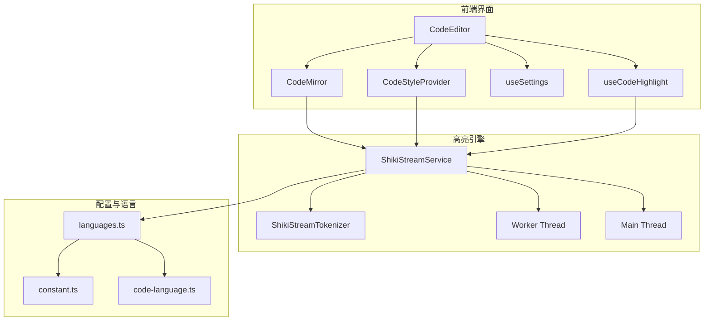
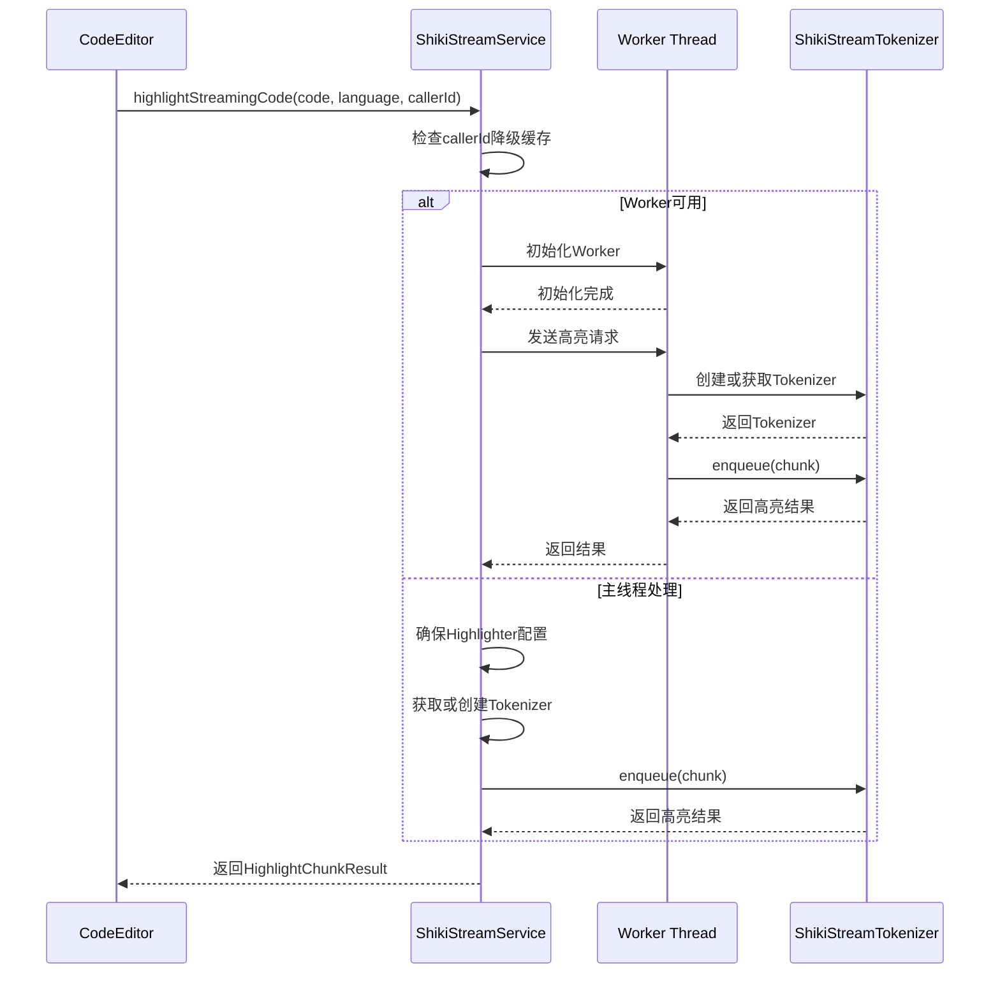
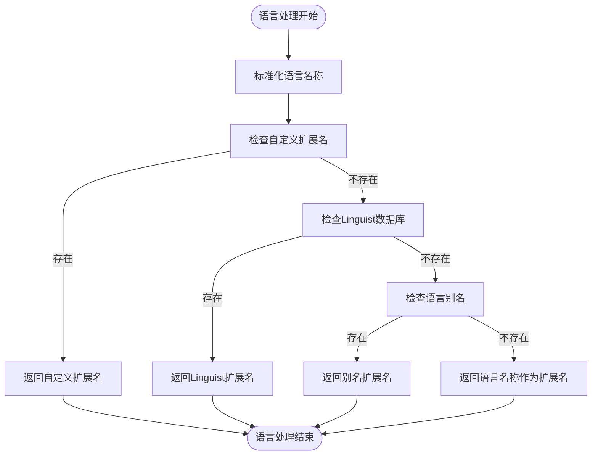
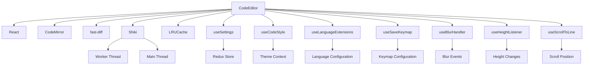
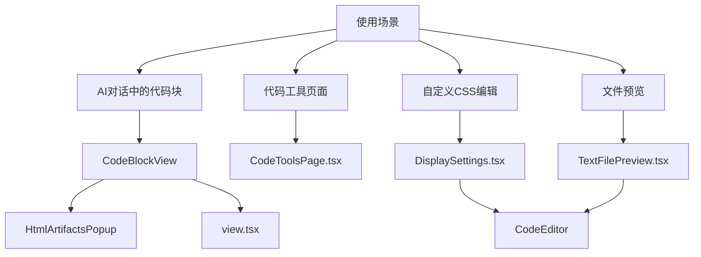

# 代码编辑器组件

<cite>
**本文档引用的文件**   
- [index.tsx](file://src/renderer/src/components/CodeEditor/index.tsx)
- [useCodeHighlight.ts](file://src/renderer/src/hooks/useCodeHighlight.ts)
- [CodeStyleProvider.tsx](file://src/renderer/src/context/CodeStyleProvider.tsx)
- [ShikiStreamService.ts](file://src/renderer/src/services/ShikiStreamService.ts)
- [ShikiStreamTokenizer.ts](file://src/renderer/src/services/ShikiStreamTokenizer.ts)
- [code-language.ts](file://src/renderer/src/utils/code-language.ts)
- [languages.ts](file://packages/shared/config/languages.ts)
- [constant.ts](file://packages/shared/config/constant.ts)
- [DisplaySettings.tsx](file://src/renderer/src/pages/settings/DisplaySettings/DisplaySettings.tsx)
</cite>

## 目录
1. [简介](#简介)
2. [核心组件](#核心组件)
3. [架构概述](#架构概述)
4. [详细组件分析](#详细组件分析)
5. [依赖分析](#依赖分析)
6. [性能考虑](#性能考虑)
7. [使用示例](#使用示例)
8. [自定义开发指导](#自定义开发指导)
9. [故障排除指南](#故障排除指南)

## 简介
Cherry Studio的代码编辑器组件是一个基于CodeMirror构建的高级代码编辑解决方案，专为AI对话场景中的代码交互而设计。该组件提供了完整的代码编辑功能，包括语法高亮、智能补全、代码折叠等特性，并通过与Shiki高亮引擎的深度集成实现了卓越的性能表现。组件支持流式响应处理，能够高效处理大型代码文件，同时提供了丰富的自定义选项，允许开发者根据具体需求调整编辑器行为和外观。

## 核心组件

代码编辑器组件的核心实现基于React和CodeMirror框架，通过一系列精心设计的hooks和服务实现了复杂的代码编辑功能。组件的主要职责包括代码渲染、语法分析、用户交互处理和性能优化。通过与Shiki高亮引擎的集成，组件能够在保持高性能的同时提供高质量的语法高亮效果。组件的props接口设计充分考虑了可控性需求，支持受控模式下的代码块编辑，同时提供了丰富的事件回调机制，便于集成到各种应用场景中。

**Section sources**
- [index.tsx](file://src/renderer/src/components/CodeEditor/index.tsx#L1-L281)

## 架构概述



**Diagram sources **
- [index.tsx](file://src/renderer/src/components/CodeEditor/index.tsx#L1-L281)
- [ShikiStreamService.ts](file://src/renderer/src/services/ShikiStreamService.ts#L1-L550)
- [CodeStyleProvider.tsx](file://src/renderer/src/context/CodeStyleProvider.tsx#L1-L203)

## 详细组件分析

### CodeEditor组件分析
CodeEditor组件是Cherry Studio中负责代码编辑功能的核心组件，它封装了CodeMirror编辑器并提供了更高级的API接口。组件通过props接收代码内容、语言类型、编辑选项等参数，并通过回调函数向父组件传递编辑状态变化。

```mermaid
classDiagram
class CodeEditor {
+ref : React.RefObject
+value : string
+placeholder : string | HTMLElement
+language : string
+onSave : (newContent : string) => void
+onChange : (newContent : string) => void
+onBlur : (newContent : string) => void
+onHeightChange : (scrollHeight : number) => void
+height : string
+maxHeight : string
+minHeight : string
+options : BasicSetupOptions
+extensions : Extension[]
+fontSize : number
+style : CSSProperties
+className : string
+editable : boolean
+readOnly : boolean
+expanded : boolean
+wrapped : boolean
}
class CodeEditorHandles {
+save() : void
+scrollToLine(lineNumber : number, options : { highlight? : boolean }) : void
}
CodeEditor --> CodeEditorHandles : "ref"
CodeEditor --> useSettings : "使用"
CodeEditor --> useCodeStyle : "使用"
CodeEditor --> useLanguageExtensions : "使用"
CodeEditor --> useSaveKeymap : "使用"
CodeEditor --> useBlurHandler : "使用"
CodeEditor --> useHeightListener : "使用"
CodeEditor --> useScrollToLine : "使用"
```

**Diagram sources **
- [index.tsx](file://src/renderer/src/components/CodeEditor/index.tsx#L13-L101)

**Section sources**
- [index.tsx](file://src/renderer/src/components/CodeEditor/index.tsx#L102-L281)

### 高亮引擎集成分析
代码编辑器通过Shiki高亮引擎实现高质量的语法高亮功能。ShikiStreamService作为核心服务，管理着高亮引擎的生命周期和资源分配，通过Worker线程和主线程的协同工作，确保在处理大型代码文件时仍能保持流畅的用户体验。



**Diagram sources **
- [ShikiStreamService.ts](file://src/renderer/src/services/ShikiStreamService.ts#L64-L547)
- [ShikiStreamTokenizer.ts](file://src/renderer/src/services/ShikiStreamTokenizer.ts#L1-L100)

### 语言处理与配置分析
代码编辑器组件通过一套完整的语言处理机制来支持多种编程语言的识别和高亮。系统基于linguist-languages数据库构建了全面的语言配置，同时支持自定义扩展名映射，确保能够正确识别各种代码文件。



**Diagram sources **
- [code-language.ts](file://src/renderer/src/utils/code-language.ts#L1-L35)
- [languages.ts](file://packages/shared/config/languages.ts#L1-L100)
- [constant.ts](file://packages/shared/config/constant.ts#L1-L100)

## 依赖分析



**Diagram sources **
- [index.tsx](file://src/renderer/src/components/CodeEditor/index.tsx#L1-L281)
- [ShikiStreamService.ts](file://src/renderer/src/services/ShikiStreamService.ts#L1-L550)

**Section sources**
- [index.tsx](file://src/renderer/src/components/CodeEditor/index.tsx#L1-L281)
- [ShikiStreamService.ts](file://src/renderer/src/services/ShikiStreamService.ts#L1-L550)

## 性能考虑

代码编辑器组件在性能优化方面采用了多项先进技术，确保在处理大型代码文件时仍能保持流畅的用户体验。核心性能优化策略包括：

1. **Worker线程分离**：通过将高亮处理任务移至Worker线程，避免阻塞主线程，确保UI响应性。
2. **LRU缓存机制**：使用LRU缓存存储tokenizer实例和处理结果，减少重复计算开销。
3. **增量更新**：采用diff算法计算代码变更，仅更新变化部分，减少DOM操作。
4. **降级策略**：当Worker处理超时时，自动降级到主线程处理，确保功能可用性。
5. **资源清理**：在组件卸载时及时清理tokenizer和缓存资源，防止内存泄漏。

这些优化措施共同作用，使得代码编辑器能够在保持高质量语法高亮的同时，处理大型代码文件而不会导致界面卡顿。

**Section sources**
- [ShikiStreamService.ts](file://src/renderer/src/services/ShikiStreamService.ts#L17-L547)
- [index.tsx](file://src/renderer/src/components/CodeEditor/index.tsx#L251-L278)

## 使用示例

代码编辑器组件在Cherry Studio中有多种使用场景，以下是一些典型的使用示例：



一个具体的使用示例是在显示设置页面中编辑自定义CSS：

```tsx
<CodeEditor
  value={customCss}
  language="css"
  placeholder={t('settings.display.custom.css.placeholder')}
  onChange={(value) => dispatch(setCustomCss(value))}
  height="60vh"
  expanded={false}
  wrapped
  options={{
    autocompletion: true,
    lineNumbers: true,
    foldGutter: true,
    keymap: true
  }}
  style={{
    outline: '0.5px solid var(--color-border)',
    borderRadius: '5px'
  }}
/>
```

**Diagram sources **
- [DisplaySettings.tsx](file://src/renderer/src/pages/settings/DisplaySettings/DisplaySettings.tsx#L432-L450)

**Section sources**
- [DisplaySettings.tsx](file://src/renderer/src/pages/settings/DisplaySettings/DisplaySettings.tsx#L422-L486)

## 自定义开发指导

### 自定义代码主题
开发者可以通过配置系统自定义代码编辑器的主题。主题配置分为CodeMirror主题和Shiki主题两种：

1. **CodeMirror主题**：用于编辑器界面，可通过`activeCmTheme`属性设置。
2. **Shiki主题**：用于代码预览，可通过`activeShikiTheme`属性设置。

主题配置存储在Redux store中，通过`useSettings` hook访问：

```ts
const { codeEditor, codeViewer } = useSettings()
```

### 扩展编辑功能
要扩展编辑器功能，可以通过以下方式：

1. **添加自定义扩展**：通过`extensions` prop传入CodeMirror扩展。
2. **修改基本设置**：通过`options` prop调整编辑器行为。
3. **自定义语言支持**：在`_customLanguageExtensions`中添加新的语言映射。

例如，添加自定义语言扩展：

```ts
const _customLanguageExtensions: Record<string, string> = {
  svg: 'xml',
  vab: 'vb',
  graphviz: 'dot'
}
```

### 性能优化建议
1. 对于大型代码文件，启用`stream`模式以支持流式响应。
2. 合理配置`maxHeight`和`expanded`属性以控制编辑器尺寸。
3. 根据需要启用或禁用`autocompletion`、`foldGutter`等特性以平衡功能和性能。

**Section sources**
- [CodeStyleProvider.tsx](file://src/renderer/src/context/CodeStyleProvider.tsx#L26-L203)
- [index.tsx](file://src/renderer/src/components/CodeEditor/index.tsx#L54-L70)
- [utils.ts](file://src/renderer/src/components/CodeEditor/utils.ts#L6-L10)

## 故障排除指南

### 常见问题及解决方案

1. **语法高亮不工作**
   - 检查语言名称是否正确
   - 确认语言是否在支持列表中
   - 检查Shiki引擎是否正确初始化

2. **编辑器卡顿**
   - 检查是否处理了过大的代码文件
   - 确认Worker线程是否正常工作
   - 考虑启用降级策略

3. **Worker初始化失败**
   - 检查浏览器是否支持Web Workers
   - 确认worker文件路径是否正确
   - 查看控制台错误日志

4. **缓存问题**
   - 清理tokenizer缓存
   - 重置codeCache
   - 检查LRU缓存配置

### 调试工具
1. 使用`loggerService`查看ShikiStreamService的调试日志
2. 通过Redux DevTools检查状态管理
3. 使用浏览器开发者工具监控Worker线程

**Section sources**
- [ShikiStreamService.ts](file://src/renderer/src/services/ShikiStreamService.ts#L15-L547)
- [CodeStyleProvider.tsx](file://src/renderer/src/context/CodeStyleProvider.tsx#L1-L203)