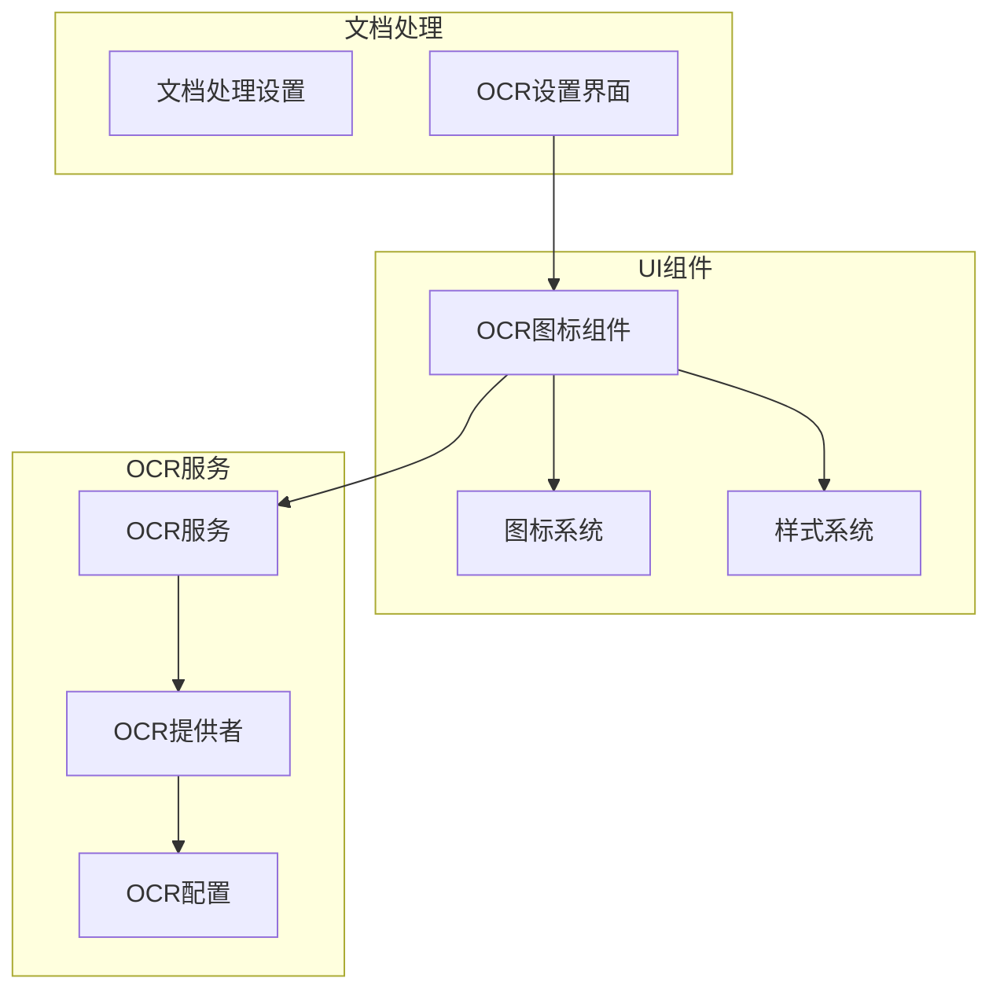
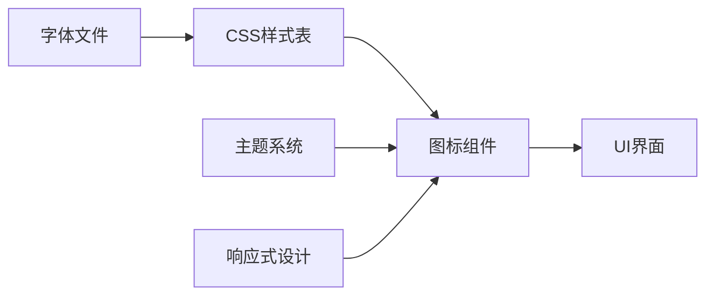
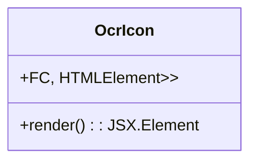
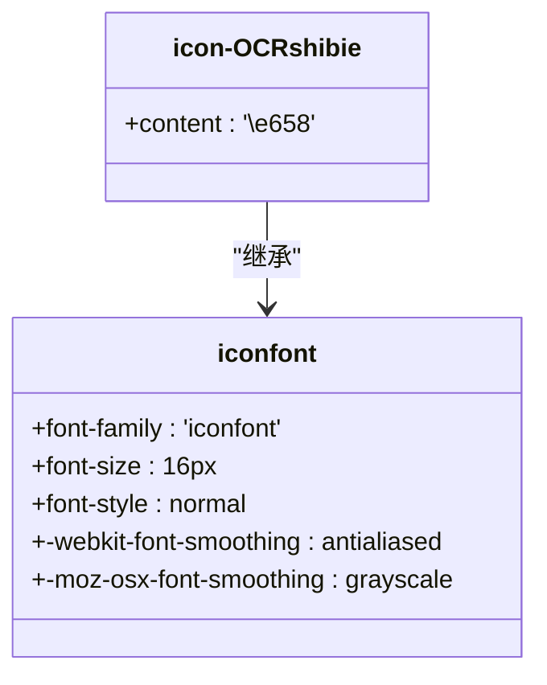
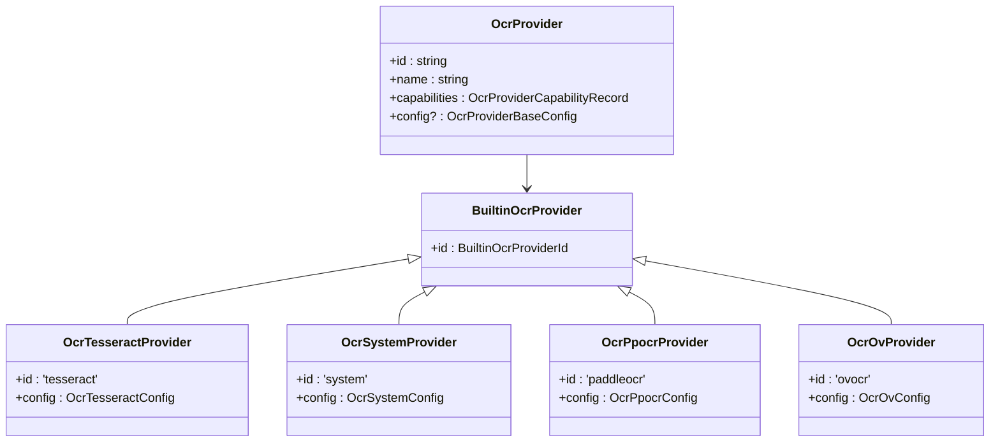
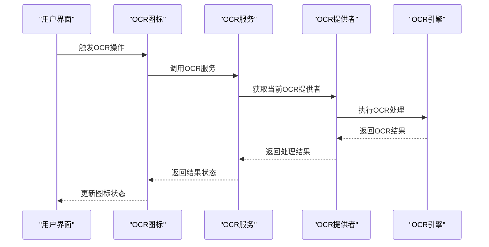
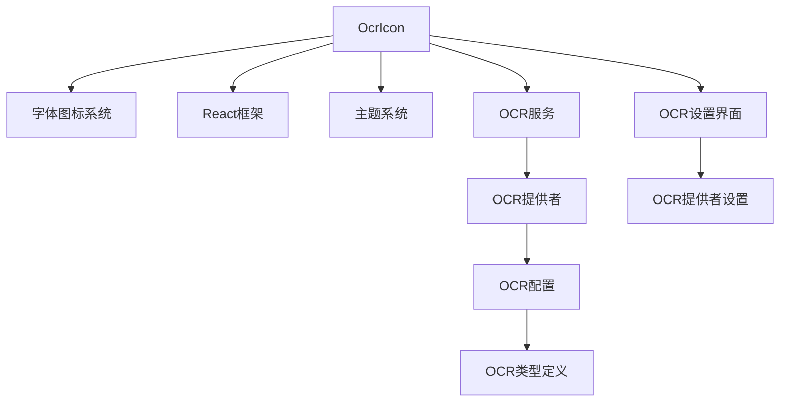

# OCR图标

<cite>
**本文档引用的文件**  
- [OcrIcon.tsx](file://src/renderer/src/components/Icons/OcrIcon.tsx)
- [iconfont.css](file://src/renderer/src/assets/fonts/icon-fonts/iconfont.css)
- [ocr.ts](file://src/renderer/src/config/ocr.ts)
- [useOcrProvider.tsx](file://src/renderer/src/hooks/useOcrProvider.tsx)
- [OcrSettings.tsx](file://src/renderer/src/pages/settings/DocProcessSettings/OcrSettings.tsx)
- [OcrOVSettings.tsx](file://src/renderer/src/pages/settings/DocProcessSettings/OcrOVSettings.tsx)
- [OcrTesseractSettings.tsx](file://src/renderer/src/pages/settings/DocProcessSettings/OcrTesseractSettings.tsx)
- [OcrProviderSettings.tsx](file://src/renderer/src/pages/settings/DocProcessSettings/OcrProviderSettings.tsx)
- [types/ocr.ts](file://src/renderer/src/types/ocr.ts)
</cite>

## 目录
1. [简介](#简介)
2. [项目结构](#项目结构)
3. [核心组件](#核心组件)
4. [架构概述](#架构概述)
5. [详细组件分析](#详细组件分析)
6. [依赖分析](#依赖分析)
7. [性能考虑](#性能考虑)
8. [故障排除指南](#故障排除指南)
9. [结论](#结论)

## 简介
本文档详细描述了Cherry Studio中OCR图标的实现方式，包括其文档扫描风格的SVG设计、颜色主题集成和状态指示功能。文档提供了使用示例，展示如何在OCR服务、文档处理功能和图像文本提取中使用该图标。同时解释了图标如何表示OCR处理的不同阶段，如扫描、识别和结果生成，并记录了图标的响应式设计，确保在不同UI上下文中的清晰可辨。

## 项目结构
OCR图标组件位于Cherry Studio的组件目录中，作为UI系统的一部分。该图标通过字体图标系统实现，集成在整体UI框架中，与OCR服务和文档处理功能紧密关联。

**Diagram sources**
- [OcrIcon.tsx](file://src/renderer/src/components/Icons/OcrIcon.tsx)
- [OcrSettings.tsx](file://src/renderer/src/pages/settings/DocProcessSettings/OcrSettings.tsx)

**Section sources**
- [OcrIcon.tsx](file://src/renderer/src/components/Icons/OcrIcon.tsx)
- [OcrSettings.tsx](file://src/renderer/src/pages/settings/DocProcessSettings/OcrSettings.tsx)

## 核心组件
OCR图标的核心实现基于字体图标系统，通过CSS类名映射到特定的Unicode字符。该组件设计为可复用的React函数组件，支持通过props传递额外的CSS类名以实现样式定制。

**Section sources**
- [OcrIcon.tsx](file://src/renderer/src/components/Icons/OcrIcon.tsx)
- [iconfont.css](file://src/renderer/src/assets/fonts/icon-fonts/iconfont.css)

## 架构概述
OCR图标的架构设计遵循Cherry Studio的整体UI架构原则，采用组件化和模块化的设计模式。图标作为独立的UI组件，通过字体图标技术实现，确保了在不同分辨率和缩放级别下的清晰显示。

**Diagram sources**
- [iconfont.css](file://src/renderer/src/assets/fonts/icon-fonts/iconfont.css)
- [OcrIcon.tsx](file://src/renderer/src/components/Icons/OcrIcon.tsx)

## 详细组件分析

### OCR图标分析
OCR图标组件是一个简单的React函数组件，通过继承HTML元素属性来实现灵活性。组件使用字体图标技术，将特定的CSS类名映射到OCR识别的图标。

#### 组件实现

**Diagram sources**
- [OcrIcon.tsx](file://src/renderer/src/components/Icons/OcrIcon.tsx)

#### 图标样式定义

**Diagram sources**
- [iconfont.css](file://src/renderer/src/assets/fonts/icon-fonts/iconfont.css)

### OCR服务集成分析
OCR图标与多种OCR服务提供者集成，包括Tesseract、系统OCR、PaddleOCR和Intel OV(NPU) OCR。每种提供者都有相应的配置和状态指示。

#### OCR提供者配置

**Diagram sources**
- [types/ocr.ts](file://src/renderer/src/types/ocr.ts)
- [ocr.ts](file://src/renderer/src/config/ocr.ts)

#### OCR处理流程

**Diagram sources**
- [OcrIcon.tsx](file://src/renderer/src/components/Icons/OcrIcon.tsx)
- [useOcrProvider.tsx](file://src/renderer/src/hooks/useOcrProvider.tsx)

**Section sources**
- [OcrIcon.tsx](file://src/renderer/src/components/Icons/OcrIcon.tsx)
- [useOcrProvider.tsx](file://src/renderer/src/hooks/useOcrProvider.tsx)

## 依赖分析
OCR图标组件依赖于多个系统组件和配置文件，形成了一个完整的OCR功能生态系统。

**Diagram sources**
- [OcrIcon.tsx](file://src/renderer/src/components/Icons/OcrIcon.tsx)
- [OcrSettings.tsx](file://src/renderer/src/pages/settings/DocProcessSettings/OcrSettings.tsx)
- [OcrProviderSettings.tsx](file://src/renderer/src/pages/settings/DocProcessSettings/OcrProviderSettings.tsx)

**Section sources**
- [OcrIcon.tsx](file://src/renderer/src/components/Icons/OcrIcon.tsx)
- [OcrSettings.tsx](file://src/renderer/src/pages/settings/DocProcessSettings/OcrSettings.tsx)
- [OcrProviderSettings.tsx](file://src/renderer/src/pages/settings/DocProcessSettings/OcrProviderSettings.tsx)

## 性能考虑
OCR图标的设计考虑了性能优化，通过字体图标技术减少了HTTP请求，提高了加载速度。同时，组件的轻量化设计确保了在复杂UI中的流畅渲染。

## 故障排除指南
当OCR图标显示异常时，应检查以下方面：
- 确认字体文件是否正确加载
- 检查CSS类名是否正确应用
- 验证OCR服务是否正常运行
- 确认OCR提供者配置是否正确

**Section sources**
- [OcrIcon.tsx](file://src/renderer/src/components/Icons/OcrIcon.tsx)
- [iconfont.css](file://src/renderer/src/assets/fonts/icon-fonts/iconfont.css)

## 结论
Cherry Studio的OCR图标通过简洁而高效的设计，实现了文档扫描风格的视觉效果。该图标不仅具有美观的外观，还与底层OCR服务紧密集成，提供了完整的状态指示功能。通过响应式设计，确保了在不同UI上下文中的清晰可辨性，为用户提供了一致的使用体验。