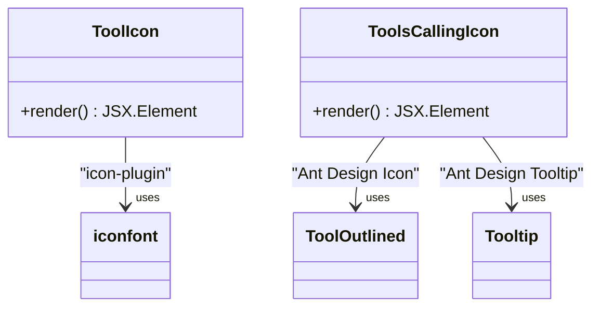
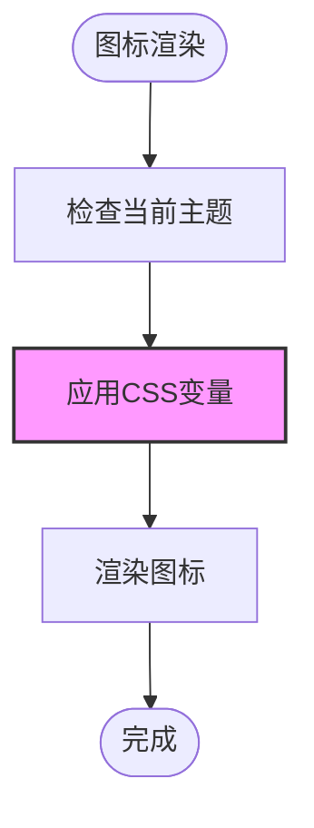
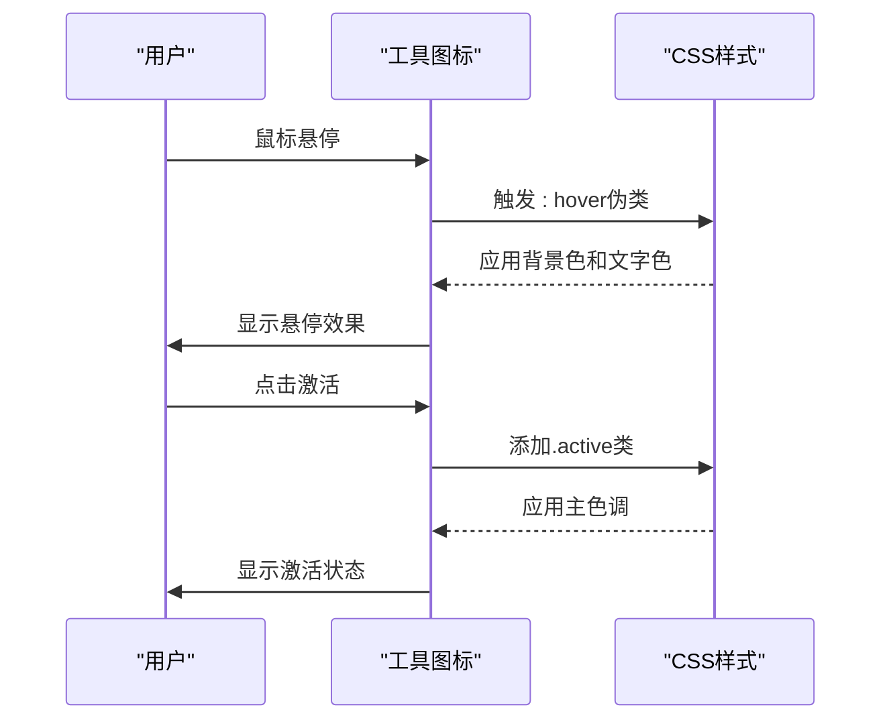
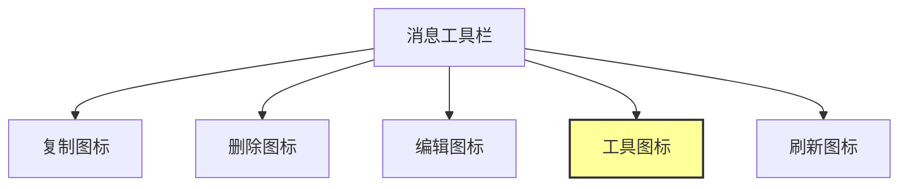
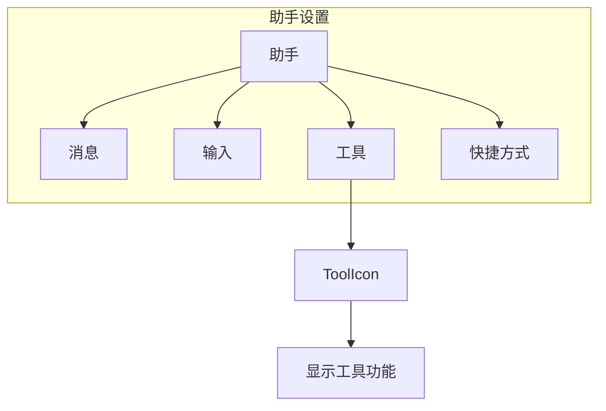
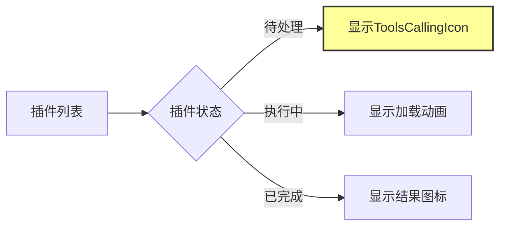
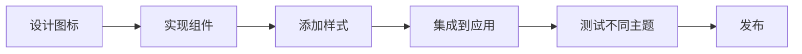

# 工具图标

<cite>
**本文档引用的文件**
- [ToolIcon.tsx](file://src/renderer/src/components/Icons/ToolIcon.tsx)
- [ToolsCallingIcon.tsx](file://src/renderer/src/components/Icons/ToolsCallingIcon.tsx)
- [SVGIcon.tsx](file://src/renderer/src/components/Icons/SVGIcon.tsx)
- [index.ts](file://src/renderer/src/components/Icons/index.ts)
- [styles.ts](file://src/renderer/src/components/CodeToolbar/styles.ts)
- [CodeToolbar/toolbar.tsx](file://src/renderer/src/components/CodeToolbar/toolbar.tsx)
- [InputbarTools.tsx](file://src/renderer/src/pages/home/Inputbar/InputbarTools.tsx)
- [MessageMcpTool.tsx](file://src/renderer/src/pages/home/Messages/Tools/MessageMcpTool.tsx)
</cite>

## 目录
1. [简介](#简介)
2. [核心组件](#核心组件)
3. [实现细节](#实现细节)
4. [使用场景](#使用场景)
5. [可配置属性](#可配置属性)
6. [自定义方法与最佳实践](#自定义方法与最佳实践)

## 简介
Cherry Studio中的工具图标是用户界面的重要组成部分，用于表示各种功能和工具。这些图标不仅提供了视觉反馈，还增强了用户体验。本文档将深入分析`ToolIcon`和`ToolsCallingIcon`的实现细节，包括SVG路径定义、颜色主题适配逻辑和动态动画效果，并提供具体使用示例。

## 核心组件

### ToolIcon
`ToolIcon`是一个简单的图标组件，基于iconfont实现，用于表示通用工具。

### ToolsCallingIcon
`ToolsCallingIcon`是一个更复杂的图标组件，结合了Ant Design的`ToolOutlined`图标和Tooltip，用于表示工具调用功能。

**Section sources**
- [ToolIcon.tsx](file://src/renderer/src/components/Icons/ToolIcon.tsx)
- [ToolsCallingIcon.tsx](file://src/renderer/src/components/Icons/ToolsCallingIcon.tsx)

## 实现细节

### SVG路径定义
`ToolIcon`使用了iconfont字体图标系统，通过CSS类名`icon-plugin`来显示插件图标。这种实现方式轻量且易于维护。



**Diagram sources**
- [ToolIcon.tsx](file://src/renderer/src/components/Icons/ToolIcon.tsx)
- [ToolsCallingIcon.tsx](file://src/renderer/src/components/Icons/ToolsCallingIcon.tsx)

### 颜色主题适配逻辑
工具图标的颜色通过CSS变量进行主题适配，确保在不同主题下都能保持良好的可读性和视觉一致性。



**Diagram sources**
- [styles.ts](file://src/renderer/src/components/CodeToolbar/styles.ts)
- [ToolsCallingIcon.tsx](file://src/renderer/src/components/Icons/ToolsCallingIcon.tsx)

### 动画效果
`ToolsCallingIcon`通过styled-components实现了简单的动画效果，当图标处于活动状态时会有颜色变化。



**Diagram sources**
- [styles.ts](file://src/renderer/src/components/CodeToolbar/styles.ts)
- [ToolsCallingIcon.tsx](file://src/renderer/src/components/Icons/ToolsCallingIcon.tsx)

## 使用场景

### 消息工具栏
在消息工具栏中，工具图标用于提供各种操作功能。



**Section sources**
- [MessageMcpTool.tsx](file://src/renderer/src/pages/home/Messages/Tools/MessageMcpTool.tsx)

### 助手设置界面
在助手设置界面中，工具图标用于标识不同的功能模块。



**Section sources**
- [SettingsPage.tsx](file://src/renderer/src/pages/settings/SettingsPage.tsx)

### 插件系统
在插件系统中，`ToolsCallingIcon`用于表示插件调用状态。



**Section sources**
- [InputbarTools.tsx](file://src/renderer/src/pages/home/Inputbar/InputbarTools.tsx)

## 可配置属性

### 大小控制
工具图标支持通过`size`属性控制图标大小。

### 颜色控制
通过CSS变量`--color-primary`和`--color-text-3`控制图标颜色。

### 旋转动画控制
虽然当前实现中没有直接的旋转动画控制，但可以通过CSS自定义实现。

```typescript
interface ToolIconProps {
  size?: number;
  className?: string;
}

interface ToolsCallingIconProps {
  size?: number;
  showTooltip?: boolean;
  showLabel?: boolean;
}
```

**Section sources**
- [ToolIcon.tsx](file://src/renderer/src/components/Icons/ToolIcon.tsx)
- [ToolsCallingIcon.tsx](file://src/renderer/src/components/Icons/ToolsCallingIcon.tsx)

## 自定义方法与最佳实践

### 自定义工具图标
可以通过创建新的SVG图标组件来扩展工具图标库。

### 最佳实践
1. 使用一致的图标大小和间距
2. 确保图标在不同主题下都有良好的可读性
3. 为图标添加适当的Tooltip提示
4. 保持图标的语义清晰



**Section sources**
- [SVGIcon.tsx](file://src/renderer/src/components/Icons/SVGIcon.tsx)
- [index.ts](file://src/renderer/src/components/Icons/index.ts)