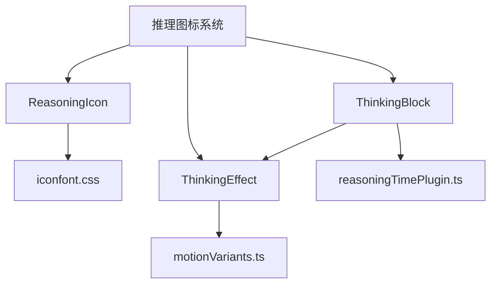
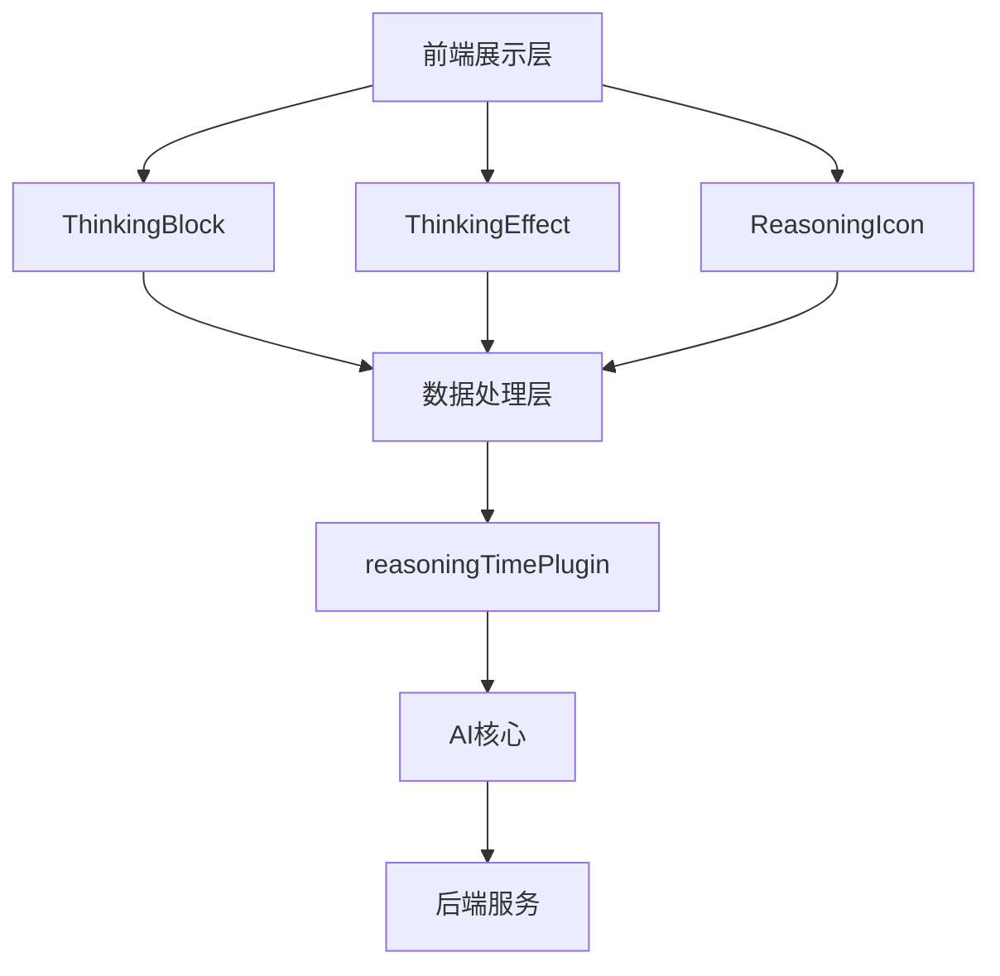
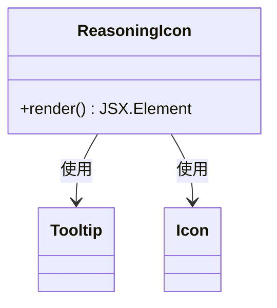
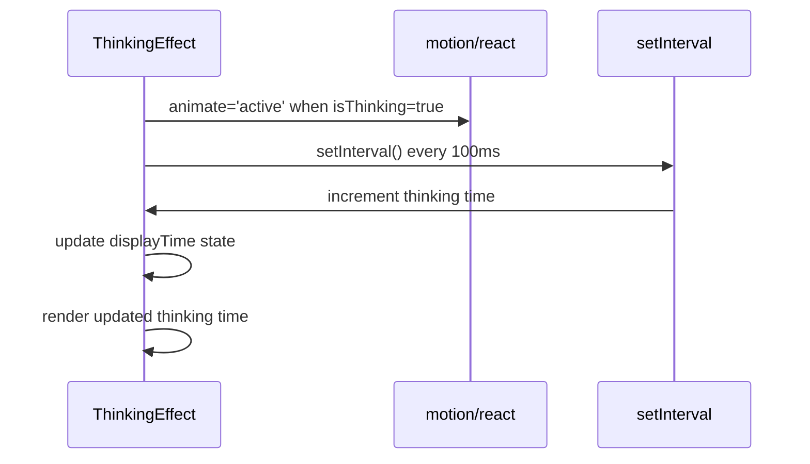
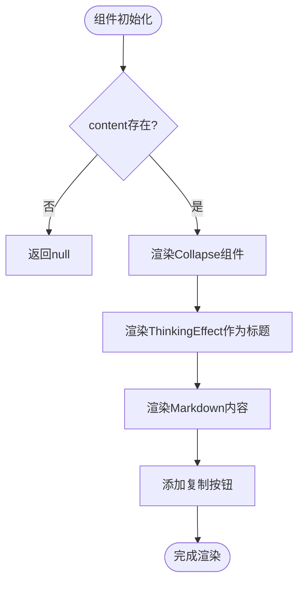
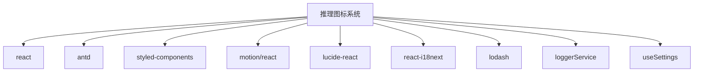

# 推理图标

<cite>
**本文档引用的文件**
- [ReasoningIcon.tsx](file://src/renderer/src/components/Icons/ReasoningIcon.tsx)
- [ThinkingEffect.tsx](file://src/renderer/src/components/ThinkingEffect.tsx)
- [ThinkingBlock.tsx](file://src/renderer/src/pages/home/Messages/Blocks/ThinkingBlock.tsx)
- [motionVariants.ts](file://src/renderer/src/utils/motionVariants.ts)
- [ReasoningTag.tsx](file://src/renderer/src/components/Tags/Model/ReasoningTag.tsx)
- [reasoningTimePlugin.ts](file://src/renderer/src/aiCore/plugins/reasoningTimePlugin.ts)
- [iconfont.css](file://src/renderer/src/assets/fonts/icon-fonts/iconfont.css)
- [index.css](file://src/renderer/src/assets/styles/index.css)
</cite>

## 目录
1. [简介](#简介)
2. [项目结构](#项目结构)
3. [核心组件](#核心组件)
4. [架构概述](#架构概述)
5. [详细组件分析](#详细组件分析)
6. [依赖分析](#依赖分析)
7. [性能考虑](#性能考虑)
8. [故障排除指南](#故障排除指南)
9. [结论](#结论)

## 简介
本文档详细描述了Cherry Studio中的推理图标（ReasoningIcon）及其相关组件的实现方式。推理图标用于可视化AI模型的推理过程，包括思维链和逐步推理的视觉表示。该图标结合了独特的SVG设计、动态思维动画效果和颜色主题集成，为用户提供直观的AI思考状态反馈。

## 项目结构
推理图标相关组件主要分布在`src/renderer/src/components`和`src/renderer/src/pages/home/Messages/Blocks`目录下。核心文件包括`ReasoningIcon.tsx`、`ThinkingEffect.tsx`和`ThinkingBlock.tsx`。这些组件通过`iconfont.css`引入的自定义字体图标实现视觉效果，并通过`motionVariants.ts`定义动画效果。

**图表来源**
- [ReasoningIcon.tsx](file://src/renderer/src/components/Icons/ReasoningIcon.tsx)
- [ThinkingEffect.tsx](file://src/renderer/src/components/ThinkingEffect.tsx)
- [ThinkingBlock.tsx](file://src/renderer/src/pages/home/Messages/Blocks/ThinkingBlock.tsx)
- [motionVariants.ts](file://src/renderer/src/utils/motionVariants.ts)
- [reasoningTimePlugin.ts](file://src/renderer/src/aiCore/plugins/reasoningTimePlugin.ts)

**章节来源**
- [ReasoningIcon.tsx](file://src/renderer/src/components/Icons/ReasoningIcon.tsx)
- [ThinkingEffect.tsx](file://src/renderer/src/components/ThinkingEffect.tsx)
- [ThinkingBlock.tsx](file://src/renderer/src/pages/home/Messages/Blocks/ThinkingBlock.tsx)

## 核心组件
推理图标系统由三个核心组件构成：`ReasoningIcon`、`ThinkingEffect`和`ThinkingBlock`。`ReasoningIcon`是一个简单的图标组件，用于显示推理状态的视觉标识。`ThinkingEffect`实现了动态的思维动画效果，包括灯泡图标的变化和思考时间的显示。`ThinkingBlock`是消息块组件，集成了`ThinkingEffect`，用于在聊天界面中展示AI的推理过程。

**章节来源**
- [ReasoningIcon.tsx](file://src/renderer/src/components/Icons/ReasoningIcon.tsx#L6-L30)
- [ThinkingEffect.tsx](file://src/renderer/src/components/ThinkingEffect.tsx#L14-L187)
- [ThinkingBlock.tsx](file://src/renderer/src/pages/home/Messages/Blocks/ThinkingBlock.tsx#L19-L201)

## 架构概述
推理图标系统采用分层架构，从底层的图标字体到上层的动画效果和组件集成。系统通过`iconfont.css`定义的自定义字体提供图标资源，通过`styled-components`实现样式封装，通过`motion/react`实现动画效果。`reasoningTimePlugin.ts`插件负责跟踪AI模型的推理时间，并将相关信息传递给前端组件。

**图表来源**
- [ThinkingBlock.tsx](file://src/renderer/src/pages/home/Messages/Blocks/ThinkingBlock.tsx)
- [ThinkingEffect.tsx](file://src/renderer/src/components/ThinkingEffect.tsx)
- [reasoningTimePlugin.ts](file://src/renderer/src/aiCore/plugins/reasoningTimePlugin.ts)

## 详细组件分析

### ReasoningIcon 分析
`ReasoningIcon`组件是一个简单的图标封装，使用`iconfont`字体中的`icon-thinking`图标。该组件通过`Tooltip`组件提供悬停提示，显示"reasoning"文本。图标颜色使用CSS变量`--color-link`，确保与主题颜色一致。

**图表来源**
- [ReasoningIcon.tsx](file://src/renderer/src/components/Icons/ReasoningIcon.tsx#L7-L31)

**章节来源**
- [ReasoningIcon.tsx](file://src/renderer/src/components/Icons/ReasoningIcon.tsx#L7-L31)

### ThinkingEffect 分析
`ThinkingEffect`组件实现了复杂的思维动画效果。组件包含一个灯泡图标，使用`motion/react`库实现动态效果。当AI处于思考状态时，灯泡图标会以脉冲方式闪烁。组件还显示思考时间，通过`ThinkingTimeSeconds`组件实时更新。消息内容以滚动方式显示，模拟AI逐步推理的过程。

**图表来源**
- [ThinkingEffect.tsx](file://src/renderer/src/components/ThinkingEffect.tsx#L14-L187)
- [motionVariants.ts](file://src/renderer/src/utils/motionVariants.ts#L2-L19)

**章节来源**
- [ThinkingEffect.tsx](file://src/renderer/src/components/ThinkingEffect.tsx#L14-L187)

### ThinkingBlock 分析
`ThinkingBlock`组件是推理效果的完整实现，集成了`ThinkingEffect`和其他UI元素。该组件使用`Collapse`组件实现可折叠的思考过程展示。当用户点击时，可以展开查看完整的推理过程。组件还包含复制按钮，允许用户复制推理内容。

**图表来源**
- [ThinkingBlock.tsx](file://src/renderer/src/pages/home/Messages/Blocks/ThinkingBlock.tsx#L19-L201)

**章节来源**
- [ThinkingBlock.tsx](file://src/renderer/src/pages/home/Messages/Blocks/ThinkingBlock.tsx#L19-L201)

## 依赖分析
推理图标系统依赖多个外部库和内部模块。主要依赖包括`react`、`antd`、`styled-components`、`motion/react`和`lucide-react`。系统还依赖`react-i18next`实现国际化，`lodash`用于对象比较。内部依赖包括`loggerService`用于日志记录，`useSettings`用于获取用户设置。

**图表来源**
- [ThinkingEffect.tsx](file://src/renderer/src/components/ThinkingEffect.tsx#L1-L6)
- [ThinkingBlock.tsx](file://src/renderer/src/pages/home/Messages/Blocks/ThinkingBlock.tsx#L1-L10)

**章节来源**
- [ThinkingEffect.tsx](file://src/renderer/src/components/ThinkingEffect.tsx#L1-L6)
- [ThinkingBlock.tsx](file://src/renderer/src/pages/home/Messages/Blocks/ThinkingBlock.tsx#L1-L10)

## 性能考虑
推理图标系统在高频率更新场景下进行了优化。`ThinkingEffect`组件使用`useMemo`和`useCallback`避免不必要的重新渲染。动画效果使用CSS过渡而不是JavaScript动画循环，确保流畅的60fps性能。`ThinkingBlock`组件使用`memo`进行记忆化，只有在props变化时才重新渲染。

**章节来源**
- [ThinkingEffect.tsx](file://src/renderer/src/components/ThinkingEffect.tsx#L28-L37)
- [ThinkingBlock.tsx](file://src/renderer/src/pages/home/Messages/Blocks/ThinkingBlock.tsx#L201)

## 故障排除指南
如果推理图标无法正常显示，请检查以下事项：1) 确认`iconfont.css`已正确加载；2) 检查网络连接是否正常；3) 确认浏览器支持Web Fonts；4) 检查控制台是否有CSS加载错误。如果动画效果不流畅，请检查系统性能是否足够，或尝试在设置中关闭动画效果。

**章节来源**
- [ThinkingEffect.tsx](file://src/renderer/src/components/ThinkingEffect.tsx#L42-L47)
- [index.css](file://src/renderer/src/assets/styles/index.css#L10-L12)

## 结论
Cherry Studio的推理图标系统通过精心设计的组件和动画效果，为用户提供直观的AI推理过程可视化。系统采用模块化设计，易于维护和扩展。通过性能优化，确保在各种设备上都能流畅运行。未来可以考虑增加更多自定义动画效果和主题选项，进一步提升用户体验。