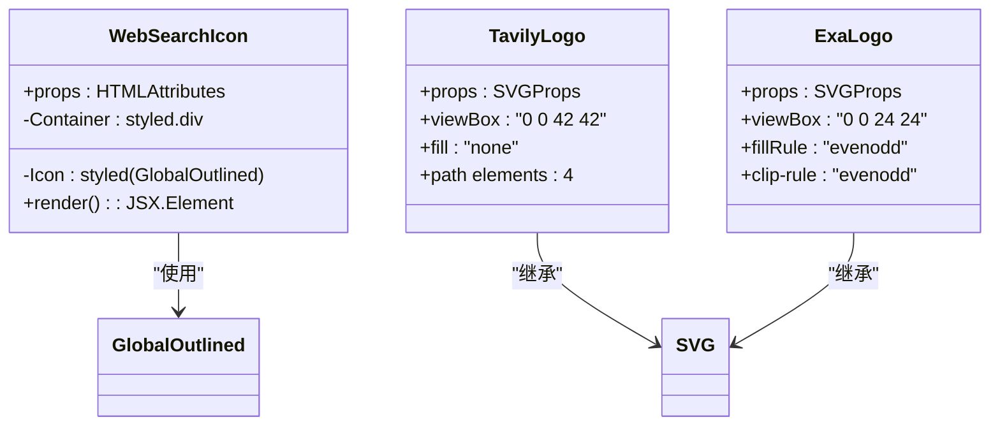
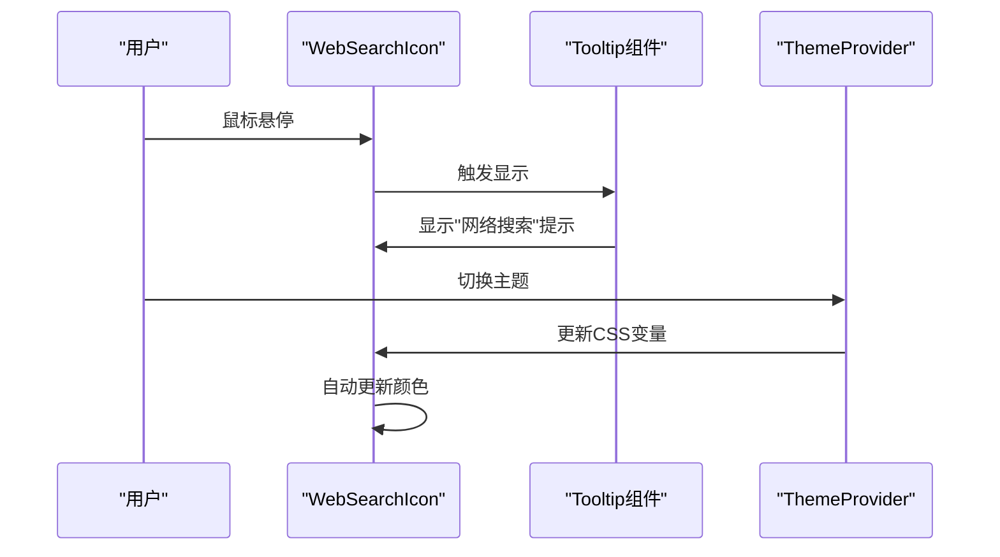
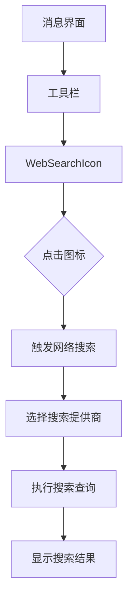
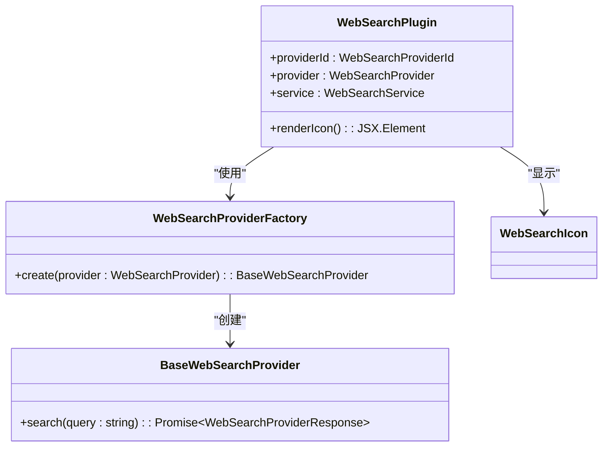
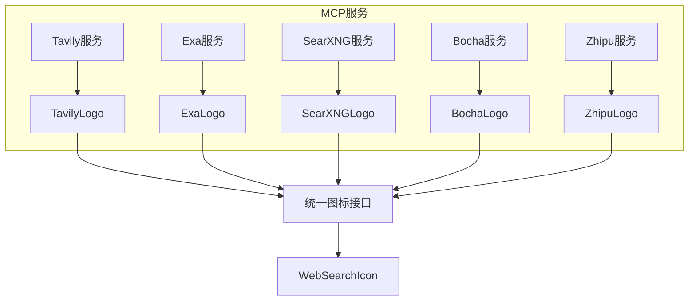
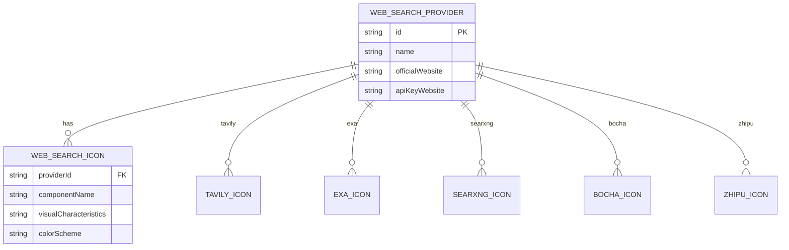
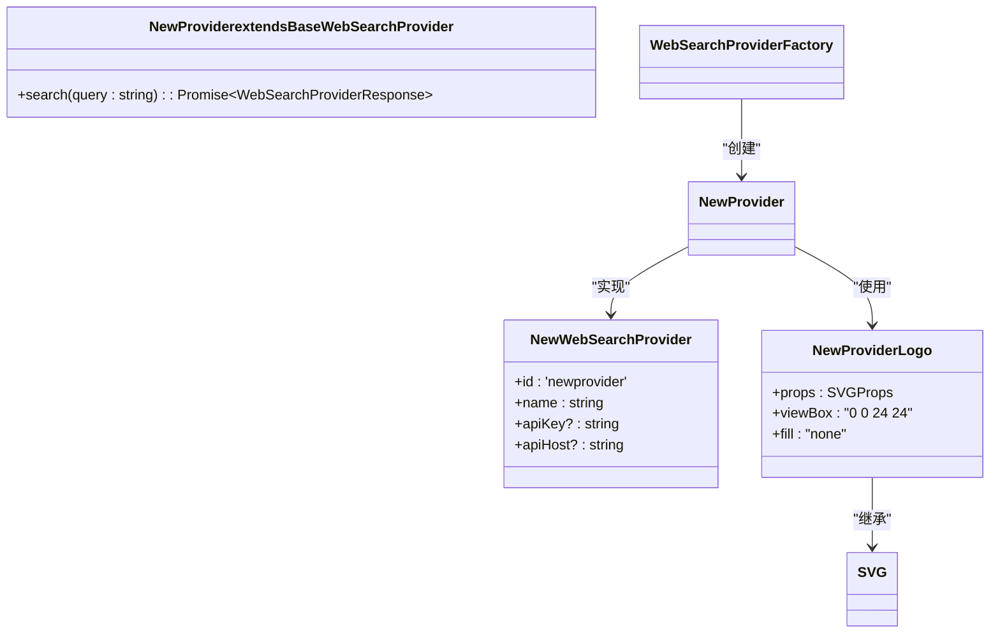

# 网络搜索图标

<cite>
**本文档引用的文件**   
- [WebSearchIcon.tsx](file://src/renderer/src/components/Icons/WebSearchIcon.tsx)
- [SVGIcon.tsx](file://src/renderer/src/components/Icons/SVGIcon.tsx)
- [webSearchProviders.ts](file://src/renderer/src/config/webSearchProviders.ts)
- [BaseWebSearchProvider.ts](file://src/renderer/src/providers/WebSearchProvider/BaseWebSearchProvider.ts)
- [WebSearchProviderFactory.ts](file://src/renderer/src/providers/WebSearchProvider/WebSearchProviderFactory.ts)
- [TavilyProvider.ts](file://src/renderer/src/providers/WebSearchProvider/TavilyProvider.ts)
- [ExaProvider.ts](file://src/renderer/src/providers/WebSearchProvider/ExaProvider.ts)
- [WebSearchService.ts](file://src/renderer/src/services/WebSearchService.ts)
- [types/index.ts](file://src/renderer/src/types/index.ts)
</cite>

## 目录
1. [简介](#简介)
2. [SVG结构设计](#svg结构设计)
3. [颜色主题适配机制](#颜色主题适配机制)
4. [交互效果](#交互效果)
5. [使用示例](#使用示例)
6. [网络搜索提供商视觉区分](#网络搜索提供商视觉区分)
7. [响应式设计特性](#响应式设计特性)
8. [扩展网络搜索图标库](#扩展网络搜索图标库)
9. [结论](#结论)

## 简介

Cherry Studio中的网络搜索图标系统为用户提供了一套完整的网络搜索功能可视化方案。该系统不仅包含通用的WebSearchIcon，还为不同的网络搜索提供商（如Tavily、Exa等）提供了独特的视觉标识。这些图标在搜索工具、网络搜索插件和MCP服务中发挥着重要作用，帮助用户快速识别和区分不同的搜索服务。

**Section sources**
- [WebSearchIcon.tsx](file://src/renderer/src/components/Icons/WebSearchIcon.tsx)

## SVG结构设计

Cherry Studio的网络搜索图标采用SVG（可缩放矢量图形）格式设计，确保在不同分辨率下都能保持清晰的显示效果。核心的WebSearchIcon基于Ant Design的GlobalOutlined图标构建，这是一个简洁的全球网络图标，由一个圆形地球轮廓和两条交叉的经线纬线组成。

对于特定的网络搜索提供商，系统提供了专门设计的SVG图标：

- **TavilyLogo**: 由四个相互连接的三角形组成，形成一个动态的四面体结构，象征着全面的信息搜索和连接。
- **ExaLogo**: 采用简洁的几何设计，由一个矩形和对角线组成，代表精确和高效的搜索能力。
- **SearXNGLogo**: 由一个圆形和内部的搜索路径组成，圆形代表互联网的完整性，搜索路径表示信息检索过程。
- **BochaLogo**: 采用抽象的波浪形设计，象征着信息流和数据的动态性。
- **ZhipuLogo**: 基于中文"智"字的抽象设计，体现了人工智能和智能搜索的概念。

这些SVG图标都使用`currentColor`作为填充颜色，这使得图标能够继承父元素的文本颜色，便于主题适配。



**Diagram sources**
- [WebSearchIcon.tsx](file://src/renderer/src/components/Icons/WebSearchIcon.tsx#L8-L32)
- [SVGIcon.tsx](file://src/renderer/src/components/Icons/SVGIcon.tsx#L161-L189)
- [SVGIcon.tsx](file://src/renderer/src/components/Icons/SVGIcon.tsx#L191-L207)

## 颜色主题适配机制

网络搜索图标的颜色主题适配机制主要通过CSS变量和SVG的`currentColor`特性实现。核心适配机制如下：

1. **CSS变量继承**: WebSearchIcon使用`var(--color-link)`作为颜色值，这使得图标颜色能够与应用程序的整体主题保持一致。当用户切换主题（如从浅色主题切换到深色主题）时，`--color-link`变量的值会相应改变，图标颜色也会自动更新。

2. **currentColor特性**: 所有SVG图标都使用`fill="currentColor"`或`stroke="currentColor"`，这使得SVG图形的颜色继承自父元素的文本颜色。这种设计确保了图标与周围文本颜色的一致性。

3. **主题上下文**: 通过ThemeProvider上下文，图标组件能够感知当前的主题模式（浅色或深色），并在必要时调整显示效果。

4. **状态颜色**: 在不同的交互状态下（如悬停、激活），图标可以通过CSS伪类改变颜色，提供视觉反馈。

这种多层次的颜色适配机制确保了网络搜索图标在各种主题和状态下都能保持良好的可读性和视觉一致性。

**Section sources**
- [WebSearchIcon.tsx](file://src/renderer/src/components/Icons/WebSearchIcon.tsx#L27)
- [SVGIcon.tsx](file://src/renderer/src/components/Icons/SVGIcon.tsx)

## 交互效果

网络搜索图标实现了多种交互效果，提升用户体验：

1. **工具提示（Tooltip）**: WebSearchIcon包裹在Ant Design的Tooltip组件中，当用户将鼠标悬停在图标上时，会显示"网络搜索"的提示文本。这提供了无障碍访问支持，帮助用户理解图标的功能。

2. **尺寸响应**: 图标通过styled-components的CSS设置固定为15px大小，并通过margin-right: 6px与其他元素保持适当的间距。这种设计确保了图标在不同界面组件中的一致性。

3. **容器布局**: 使用flex布局的Container组件确保图标在父容器中居中对齐，无论父容器的大小如何变化，图标都能保持良好的视觉位置。

4. **可访问性**: 通过使用标准的HTML属性和ARIA支持的UI组件，确保图标对屏幕阅读器等辅助技术友好。

这些交互效果共同作用，使得网络搜索图标不仅美观，而且实用，为用户提供直观的操作体验。



**Diagram sources**
- [WebSearchIcon.tsx](file://src/renderer/src/components/Icons/WebSearchIcon.tsx)
- [WebSearchSettings/index.tsx](file://src/renderer/src/pages/settings/WebSearchSettings/index.tsx#L2)

## 使用示例

网络搜索图标在Cherry Studio中有多种使用场景，以下是一些典型的集成示例：

### 搜索工具中的集成

在网络搜索工具中，WebSearchIcon作为功能标识被广泛使用：



### 网络搜索插件中的集成

在MCP（Model Control Protocol）服务中，网络搜索图标用于标识不同的搜索提供商：



### MCP服务中的集成

在MCP服务配置中，不同提供商的图标帮助用户快速识别服务类型：



**Section sources**
- [WebSearchIcon.tsx](file://src/renderer/src/components/Icons/WebSearchIcon.tsx)
- [WebSearchService.ts](file://src/renderer/src/services/WebSearchService.ts)
- [WebSearchProviderFactory.ts](file://src/renderer/src/providers/WebSearchProvider/WebSearchProviderFactory.ts)

## 网络搜索提供商视觉区分

Cherry Studio通过独特的视觉设计来区分不同的网络搜索提供商，帮助用户快速识别和选择所需的服务：

### 提供商图标映射

| 提供商 | 图标组件 | 视觉特征 |
|-------|---------|---------|
| Tavily | TavilyLogo | 四个连接的三角形，动态四面体结构 |
| Exa | ExaLogo | 矩形与对角线，简洁几何设计 |
| SearXNG | SearXNGLogo | 圆形与搜索路径，互联网完整性 |
| Bocha | BochaLogo | 抽象波浪形，信息流动感 |
| Zhipu | ZhipuLogo | "智"字抽象设计，智能搜索概念 |
| Bing | BingLogo | 经典Bing字母设计 |
| Google | Google图标 | 经典Google颜色组合 |

### 视觉区分机制

1. **形状识别**: 每个提供商的图标都有独特的基本形状，如Tavily的三角形、Exa的矩形等，用户可以通过形状快速识别。

2. **颜色编码**: 虽然图标使用`currentColor`继承主题色，但在特定上下文中，可以通过背景色或边框色进行颜色编码。

3. **品牌一致性**: 图标设计遵循各提供商的品牌视觉语言，确保用户能够将其与熟悉的网站或服务关联起来。

4. **尺寸统一**: 所有提供商图标都标准化为相似的视觉重量和尺寸，确保界面的一致性。

这种视觉区分机制不仅提高了用户体验，还增强了系统的专业性和可信赖度。



**Diagram sources**
- [webSearchProviders.ts](file://src/renderer/src/config/webSearchProviders.ts)
- [SVGIcon.tsx](file://src/renderer/src/components/Icons/SVGIcon.tsx)
- [types/index.ts](file://src/renderer/src/types/index.ts#L599-L613)

## 响应式设计特性

网络搜索图标系统具有良好的响应式设计特性，确保在不同设备和屏幕尺寸下都能提供优质的用户体验：

### 尺寸适应性

1. **固定尺寸设计**: WebSearchIcon采用固定的15px尺寸设计，确保在标准界面中的一致性。
2. **相对单位**: 使用em和rem等相对单位，使图标能够根据用户设置的字体大小进行缩放。
3. **容器适配**: 通过flex布局的Container组件，图标能够自动适应父容器的尺寸变化。

### 多场景显示效果

| 场景 | 尺寸 | 显示效果 |
|------|------|---------|
| 工具栏 | 15px | 与其他工具图标一致，紧凑布局 |
| 消息状态 | 15px | 在消息旁边作为状态指示器 |
| 设置界面 | 15px | 在提供商列表中作为标识 |
| 移动设备 | 自适应 | 根据屏幕尺寸调整 |

### 响应式实现

1. **CSS媒体查询**: 在必要时使用媒体查询调整图标在不同屏幕尺寸下的显示效果。
2. **矢量图形优势**: SVG格式的天然可缩放性确保图标在高DPI屏幕上也能清晰显示。
3. **布局弹性**: 使用flexbox布局确保图标在不同容器大小下都能正确对齐和定位。

这些响应式设计特性确保了网络搜索图标在各种使用场景下都能保持良好的可读性和美观性。

**Section sources**
- [WebSearchIcon.tsx](file://src/renderer/src/components/Icons/WebSearchIcon.tsx#L28)
- [SVGIcon.tsx](file://src/renderer/src/components/Icons/SVGIcon.tsx)

## 扩展网络搜索图标库

Cherry Studio提供了灵活的机制来扩展网络搜索图标库，支持新的搜索服务集成：

### 扩展步骤

1. **创建新的SVG图标组件**: 在`SVGIcon.tsx`文件中添加新的SVG图标组件，遵循现有的设计规范。

```typescript
export function NewProviderLogo(props: SVGProps<SVGSVGElement>) {
  return (
    <svg width="1em" height="1em" viewBox="0 0 24 24" fill="none" xmlns="http://www.w3.org/2000/svg" {...props}>
      <path fill="currentColor" d="M..."/>
    </svg>
  )
}
```

2. **注册新的搜索提供商**: 在`webSearchProviders.ts`中添加新的提供商配置。

```typescript
export const WEB_SEARCH_PROVIDER_CONFIG: Record<WebSearchProviderId, WebSearchProviderConfig> = {
  // ... existing providers
  newprovider: {
    websites: {
      official: 'https://newprovider.com',
      apiKey: 'https://newprovider.com/api-keys'
    }
  }
}
```

3. **实现新的提供商类**: 创建继承自BaseWebSearchProvider的新类，实现具体的搜索逻辑。

4. **更新工厂模式**: 在WebSearchProviderFactory中添加对新提供商的支持。

```typescript
static create(provider: WebSearchProvider): BaseWebSearchProvider {
  switch (provider.id) {
    // ... existing cases
    case 'newprovider':
      return new NewProvider(provider)
    default:
      return new DefaultProvider(provider)
  }
}
```

### 扩展最佳实践

1. **设计一致性**: 新的图标应遵循现有的视觉设计语言，保持整体风格统一。
2. **性能优化**: 确保SVG代码简洁，移除不必要的元数据和注释。
3. **可访问性**: 为图标添加适当的ARIA标签和工具提示。
4. **主题兼容**: 使用`currentColor`确保图标与各种主题兼容。

通过这种模块化的设计，Cherry Studio能够轻松集成新的网络搜索服务，保持系统的可扩展性和灵活性。



**Diagram sources**
- [WebSearchProviderFactory.ts](file://src/renderer/src/providers/WebSearchProvider/WebSearchProviderFactory.ts)
- [BaseWebSearchProvider.ts](file://src/renderer/src/providers/WebSearchProvider/BaseWebSearchProvider.ts)
- [webSearchProviders.ts](file://src/renderer/src/config/webSearchProviders.ts)

## 结论

Cherry Studio的网络搜索图标系统是一个精心设计的可视化组件，它不仅提供了美观的界面元素，还实现了强大的功能性和可扩展性。通过SVG矢量图形、智能的颜色主题适配、丰富的交互效果和清晰的视觉区分，该系统为用户提供了直观、一致且愉悦的使用体验。

核心的WebSearchIcon作为通用标识，而针对Tavily、Exa等特定提供商的专用图标则增强了品牌的识别度。系统的响应式设计确保了在各种设备和场景下的良好表现，而模块化的架构使得扩展新的搜索服务变得简单高效。

未来，可以进一步优化图标系统，例如引入动态主题颜色、增强的动画效果或更智能的上下文感知显示，以持续提升用户体验。