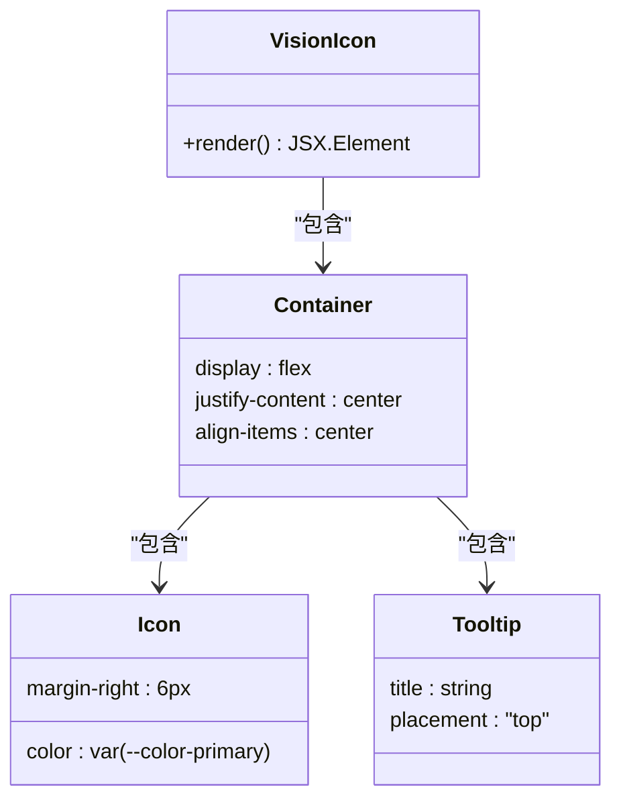
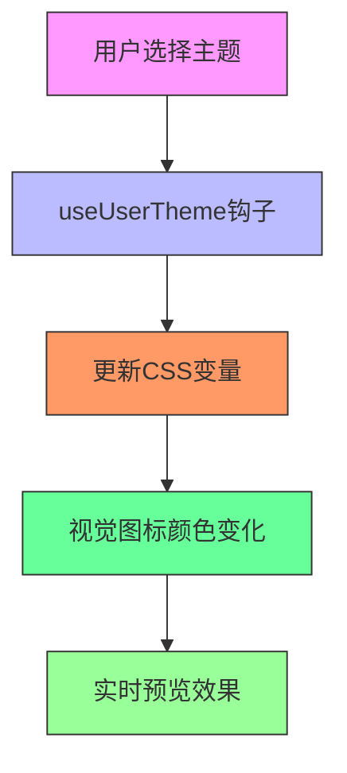
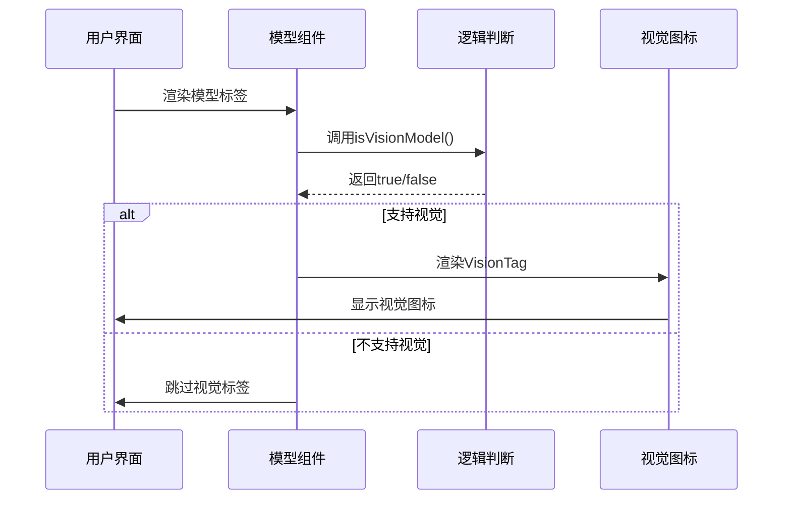
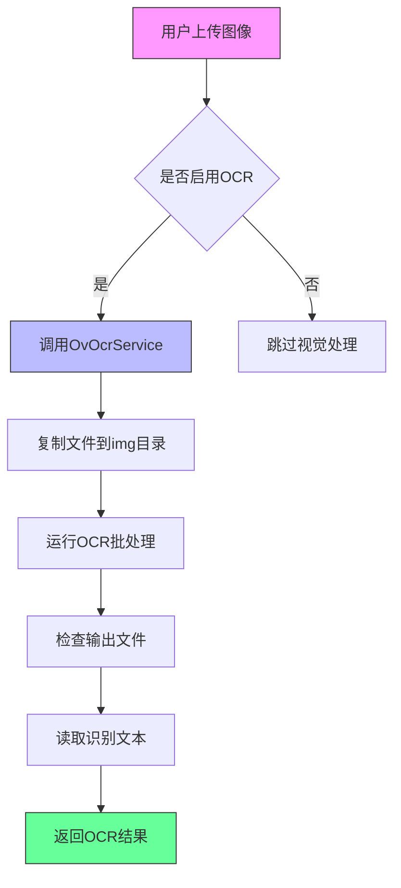

# 视觉图标

<cite>
**本文档引用的文件**  
- [VisionIcon.tsx](file://src/renderer/src/components/Icons/VisionIcon.tsx)
- [VisionTag.tsx](file://src/renderer/src/components/Tags/Model/VisionTag.tsx)
- [ModelTagsWithLabel.tsx](file://src/renderer/src/components/ModelTagsWithLabel.tsx)
- [color.css](file://src/renderer/src/assets/styles/color.css)
- [tailwind.css](file://src/renderer/src/assets/styles/tailwind.css)
- [useUserTheme.ts](file://src/renderer/src/hooks/useUserTheme.ts)
- [OvOcrService.ts](file://src/main/services/ocr/builtin/OvOcrService.ts)
- [OcrService.ts](file://src/main/services/ocr/OcrService.ts)
- [ocr.ts](file://src/renderer/src/store/ocr.ts)
- [models.ts](file://src/renderer/src/config/models/__tests__/vision.test.ts)
</cite>

## 目录
1. [简介](#简介)
2. [核心组件](#核心组件)
3. [视觉图标设计](#视觉图标设计)
4. [颜色主题适配](#颜色主题适配)
5. [交互状态与可访问性](#交互状态与可访问性)
6. [使用示例与集成](#使用示例与集成)
7. [视觉处理模式扩展](#视觉处理模式扩展)
8. [结论](#结论)

## 简介
Cherry Studio中的视觉图标（VisionIcon）是用于表示视觉能力的核心UI元素，主要应用于图像识别、视觉理解功能和多模态模型的界面展示。该图标通过眼睛形状的SVG设计直观地传达了"视觉"概念，并与系统的颜色主题和交互逻辑深度集成。本文档将深入分析VisionIcon的实现细节，包括其设计原理、主题适配机制、交互状态以及在不同场景下的使用方式。

## 核心组件

VisionIcon组件基于React和styled-components构建，使用lucide-react库中的ImageIcon作为基础图标。该组件封装了Tooltip功能，当用户悬停时会显示"vision"的本地化文本提示。图标通过CSS变量`--color-primary`获取主题颜色，确保与整体UI风格的一致性。VisionIcon通常与其他视觉相关组件如VisionTag协同工作，共同构建完整的视觉功能标识系统。

**本节来源**  
- [VisionIcon.tsx](file://src/renderer/src/components/Icons/VisionIcon.tsx#L1-L32)
- [VisionTag.tsx](file://src/renderer/src/components/Tags/Model/VisionTag.tsx#L1-L27)

## 视觉图标设计

### 图标形状与结构
VisionIcon采用ImageIcon作为基础图形，这是一种简化的眼睛形状设计，通过SVG路径精确描述。图标设计遵循简洁明了的原则，确保在不同尺寸下都能清晰识别。图标右侧留有6px的外边距，为文本标签提供适当的视觉间隔。

### 布局容器
图标被包裹在一个flex布局的容器中，通过`justify-content: center`和`align-items: center`确保图标在父容器中居中对齐。这种布局设计使得VisionIcon可以灵活地集成到各种UI组件中，如标签、按钮或列表项。

**图表来源**  
- [VisionIcon.tsx](file://src/renderer/src/components/Icons/VisionIcon.tsx#L8-L31)

## 颜色主题适配

### 主题颜色系统
视觉图标通过CSS变量`--color-primary`实现主题颜色适配。这一设计使得图标能够自动响应用户选择的主题色，无需额外的代码修改。在深色模式下，图标呈现为明亮的绿色调；在浅色模式下，则调整为更适合浅色背景的对比度。

### 颜色定义
系统在`color.css`文件中定义了完整的颜色体系，其中`--color-primary`的默认值为`#00b96b`（一种清新的绿色）。用户可以通过设置界面自定义主色调，`useUserTheme`钩子会动态更新CSS变量，实现即时的主题切换效果。

**图表来源**  
- [color.css](file://src/renderer/src/assets/styles/color.css#L96-L98)
- [useUserTheme.ts](file://src/renderer/src/hooks/useUserTheme.ts#L1-L35)
- [tailwind.css](file://src/renderer/src/assets/styles/tailwind.css#L97)

## 交互状态与可访问性

### 悬停提示
VisionIcon集成了Ant Design的Tooltip组件，当用户将鼠标悬停在图标上时，会显示"vision"的本地化文本提示。提示位置默认在图标上方（placement="top"），确保不会遮挡主要内容。

### 可访问性支持
图标系统充分考虑了可访问性需求：
- 通过`useTranslation`钩子实现多语言支持，确保不同语言用户都能理解图标含义
- Tooltip组件提供了屏幕阅读器可识别的ARIA标签
- 图标尺寸可配置，适应不同用户的视觉需求
- 颜色对比度符合WCAG标准，确保在各种环境下都有良好的可读性

**本节来源**  
- [VisionIcon.tsx](file://src/renderer/src/components/Icons/VisionIcon.tsx#L13-L14)
- [VisionTag.tsx](file://src/renderer/src/components/Tags/Model/VisionTag.tsx#L21-L22)

## 使用示例与集成

### 模型标签集成
VisionIcon最常见的使用场景是在模型标签中。`ModelTagsWithLabel`组件会根据模型特性自动显示相应的标签，当模型支持视觉功能时，会渲染VisionTag组件。VisionTag使用`isVisionModel`函数判断模型是否具备视觉能力。

**图表来源**  
- [ModelTagsWithLabel.tsx](file://src/renderer/src/components/ModelTagsWithLabel.tsx#L79-L89)
- [models.ts](file://src/renderer/src/config/models/__tests__/vision.test.ts#L167-L258)

### 图像识别功能
在图像识别功能中，VisionIcon作为功能启用的视觉指示器。当用户上传图片或启用视觉分析时，图标会显示在相关操作按钮旁边，提示用户当前可以进行视觉相关的操作。

### 多模态模型表示
对于支持多模态输入的模型（如GPT-4o、Gemini等），VisionIcon用于标识这些模型能够处理图像输入。系统通过正则表达式匹配模型ID（如包含"gpt-4o"、"gemini"等）来自动识别视觉模型。

## 视觉处理模式扩展

### OCR集成
视觉图标与系统的OCR（光学字符识别）功能深度集成。当用户使用OV OCR服务处理图像时，VisionIcon会作为处理进度的视觉指示器。系统通过`OvOcrService`处理图像文件，提取文本内容。

**图表来源**  
- [OvOcrService.ts](file://src/main/services/ocr/builtin/OvOcrService.ts#L85-L130)
- [OcrService.ts](file://src/main/services/ocr/OcrService.ts#L42-L49)

### 处理状态表示
可以通过扩展视觉图标来表示不同的视觉处理状态：
- **静态状态**：常规的VisionIcon，表示视觉功能已启用
- **处理中状态**：添加脉冲动画，表示正在分析图像
- **完成状态**：图标变为绿色对勾，表示处理完成
- **错误状态**：图标变为红色感叹号，表示处理失败

## 结论
Cherry Studio的视觉图标系统通过精心设计的SVG图形、灵活的主题适配和丰富的交互功能，为用户提供了一致且直观的视觉体验。该系统不仅美观实用，而且具有良好的可扩展性，能够适应未来更多的视觉处理需求。通过与其他组件的紧密集成，VisionIcon成功地将复杂的视觉功能转化为用户易于理解的界面元素。