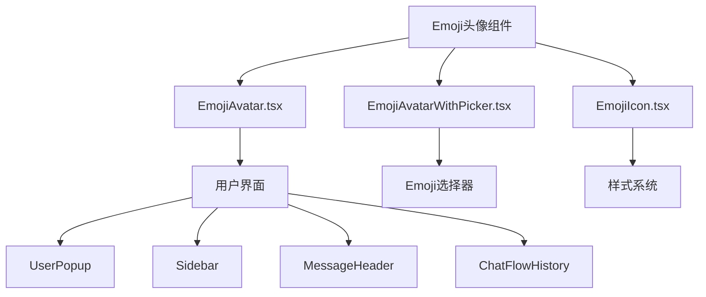
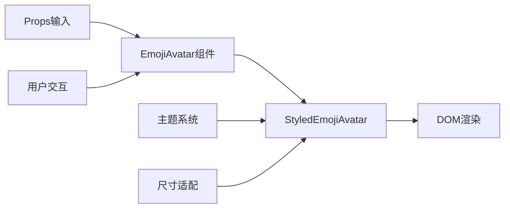
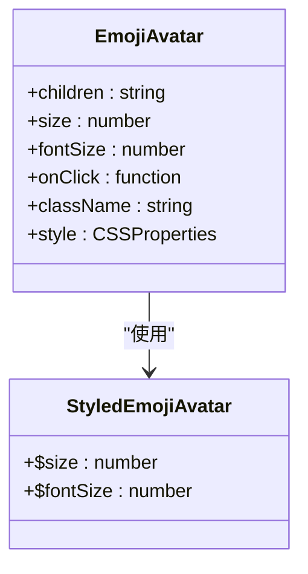
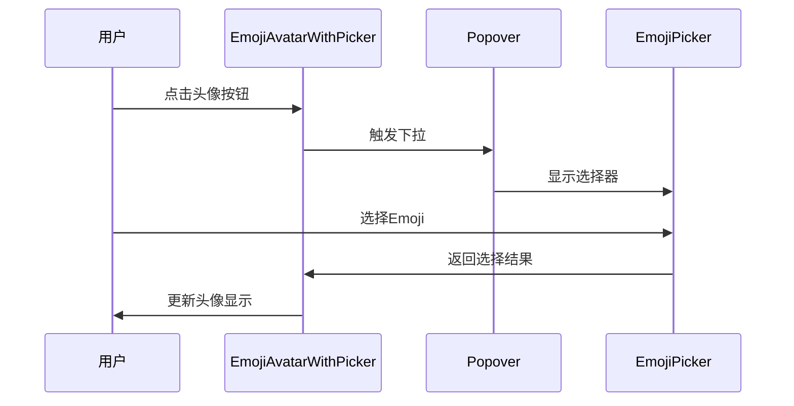
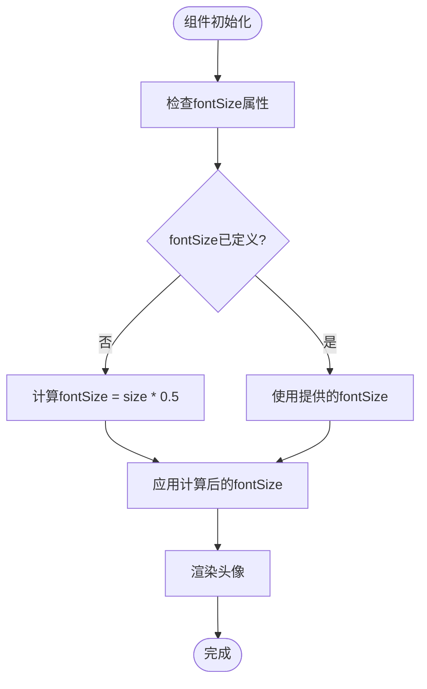
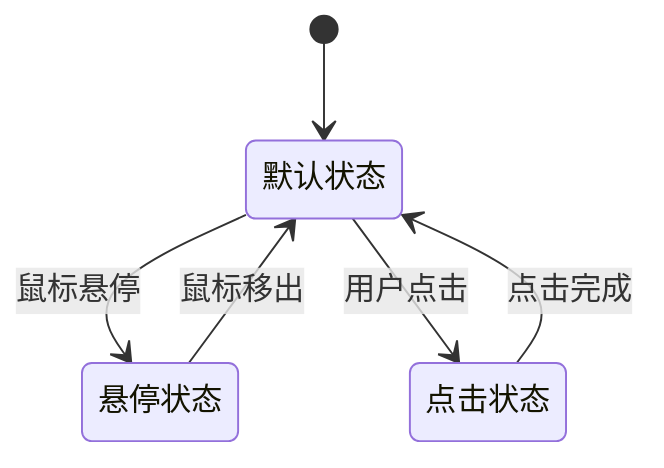
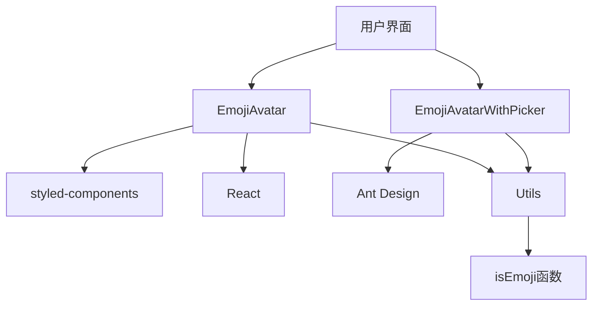

# Emoji头像组件

<cite>
**本文档引用的文件**
- [EmojiAvatar.tsx](file://src/renderer/src/components/Avatar/EmojiAvatar.tsx)
- [EmojiAvatarWithPicker.tsx](file://src/renderer/src/components/Avatar/EmojiAvatarWithPicker.tsx)
- [EmojiIcon.tsx](file://src/renderer/src/components/EmojiIcon.tsx)
- [UserPopup.tsx](file://src/renderer/src/components/Popups/UserPopup.tsx)
- [Sidebar.tsx](file://src/renderer/src/components/app/Sidebar.tsx)
- [MessageHeader.tsx](file://src/renderer/src/pages/home/Messages/MessageHeader.tsx)
- [ChatFlowHistory.tsx](file://src/renderer/src/pages/home/Messages/ChatFlowHistory.tsx)
- [naming.ts](file://src/renderer/src/utils/naming.ts)
</cite>

## 目录
1. [简介](#简介)
2. [项目结构](#项目结构)
3. [核心组件](#核心组件)
4. [架构概述](#架构概述)
5. [详细组件分析](#详细组件分析)
6. [依赖分析](#依赖分析)
7. [性能考虑](#性能考虑)
8. [故障排除指南](#故障排除指南)
9. [结论](#结论)

## 简介
Emoji头像组件是Cherry Studio应用中的核心UI元素，用于在用户界面中显示用户和助手的个性化头像。该组件支持纯Emoji作为头像显示，并提供了完整的交互功能和可访问性支持。组件设计注重跨平台一致性，通过智能的尺寸适配机制确保在不同设备和场景下都能提供优质的视觉体验。

## 项目结构
Emoji头像组件位于应用的组件目录中，作为Avatar子系统的一部分。该组件与其他UI元素紧密集成，包括用户弹窗、侧边栏、消息历史等界面。组件采用模块化设计，与Emoji选择器、头像管理工具函数等其他模块协同工作，形成完整的头像管理系统。

**图示来源**
- [EmojiAvatar.tsx](file://src/renderer/src/components/Avatar/EmojiAvatar.tsx)
- [UserPopup.tsx](file://src/renderer/src/components/Popups/UserPopup.tsx)
- [Sidebar.tsx](file://src/renderer/src/components/app/Sidebar.tsx)

## 核心组件
Emoji头像组件系统由多个核心组件构成，包括基础的EmojiAvatar、带选择器的EmojiAvatarWithPicker以及辅助的EmojiIcon。这些组件共同实现了头像的显示、选择和样式化功能。组件通过props接收配置参数，支持灵活的尺寸调整、交互反馈和可访问性特性。

**组件来源**
- [EmojiAvatar.tsx](file://src/renderer/src/components/Avatar/EmojiAvatar.tsx#L1-L53)
- [EmojiAvatarWithPicker.tsx](file://src/renderer/src/components/Avatar/EmojiAvatarWithPicker.tsx#L1-L20)
- [EmojiIcon.tsx](file://src/renderer/src/components/EmojiIcon.tsx#L1-L49)

## 架构概述
Emoji头像组件采用React函数式组件架构，结合styled-components进行样式管理。组件通过props接收外部配置，内部使用TypeScript定义严格的接口类型，确保类型安全。组件与应用的状态管理系统集成，能够响应用户设置的变化。

**图示来源**
- [EmojiAvatar.tsx](file://src/renderer/src/components/Avatar/EmojiAvatar.tsx#L1-L53)

## 详细组件分析

### EmojiAvatar组件分析
EmojiAvatar组件是系统的核心显示组件，负责渲染纯Emoji头像。组件接收Emoji字符作为子元素，通过styled-components创建样式化的容器。组件支持点击交互，提供视觉反馈，并能根据不同的使用场景调整尺寸和字体大小。

**图示来源**
- [EmojiAvatar.tsx](file://src/renderer/src/components/Avatar/EmojiAvatar.tsx#L4-L11)

### Emoji选择器集成
EmojiAvatarWithPicker组件集成了Emoji选择功能，允许用户通过点击按钮打开选择器来更换头像。该组件使用Ant Design的Popover组件实现下拉菜单，内部嵌入EmojiPicker组件提供选择界面。

**图示来源**
- [EmojiAvatarWithPicker.tsx](file://src/renderer/src/components/Avatar/EmojiAvatarWithPicker.tsx#L1-L20)

### 尺寸适配机制
Emoji头像组件实现了智能的尺寸适配机制，通过size和fontSize属性控制显示效果。当fontSize未指定时，组件会根据size属性自动计算合适的字体大小（默认为size的50%）。这种机制确保了Emoji在不同尺寸的容器中都能保持良好的视觉比例。

**图示来源**
- [EmojiAvatar.tsx](file://src/renderer/src/components/Avatar/EmojiAvatar.tsx#L17-L25)

### 状态表现机制
Emoji头像组件实现了多种状态表现，包括默认状态、悬停状态和交互状态。通过CSS transition属性实现平滑的视觉过渡效果。悬停时，头像的透明度会降低到0.8，提供清晰的交互反馈。组件还支持通过onClick属性定义点击行为，实现与用户界面的深度集成。

**图示来源**
- [EmojiAvatar.tsx](file://src/renderer/src/components/Avatar/EmojiAvatar.tsx#L46-L50)

## 依赖分析
Emoji头像组件系统依赖于多个外部模块和内部工具函数。主要依赖包括styled-components用于样式管理，Ant Design的Popover和Button组件用于交互界面，以及应用内部的utils模块中的isEmoji函数用于数据验证。

**图示来源**
- [EmojiAvatar.tsx](file://src/renderer/src/components/Avatar/EmojiAvatar.tsx#L1-L2)
- [naming.ts](file://src/renderer/src/utils/naming.ts#L130-L140)

## 性能考虑
Emoji头像组件在设计时充分考虑了性能优化。组件使用React.memo进行记忆化，避免不必要的重新渲染。样式通过styled-components的CSS-in-JS机制生成，确保样式复用和性能优化。字体加载方面，组件依赖系统默认的Emoji字体，避免了额外的网络请求。

**性能来源**
- [EmojiAvatar.tsx](file://src/renderer/src/components/Avatar/EmojiAvatar.tsx#L52)
- [EmojiIcon.tsx](file://src/renderer/src/components/EmojiIcon.tsx#L48)

## 故障排除指南
在使用Emoji头像组件时，可能会遇到跨平台显示不一致的问题。这通常是由于不同操作系统对Emoji的渲染差异造成的。解决方案包括使用标准化的Emoji字符、避免使用复合Emoji，以及在必要时提供回退显示方案。此外，应确保传入组件的字符串是纯Emoji，避免混合文本和Emoji导致显示异常。

**故障排除来源**
- [naming.ts](file://src/renderer/src/utils/naming.ts#L130-L140)
- [UserPopup.tsx](file://src/renderer/src/components/Popups/UserPopup.tsx#L158-L161)

## 结论
Emoji头像组件是一个功能完整、设计精良的UI组件，为Cherry Studio应用提供了个性化的用户标识功能。组件通过简洁的API、灵活的配置选项和良好的性能表现，满足了在多种场景下的使用需求。未来可以考虑增加更多自定义选项，如边框样式、背景渐变等，进一步提升用户体验。