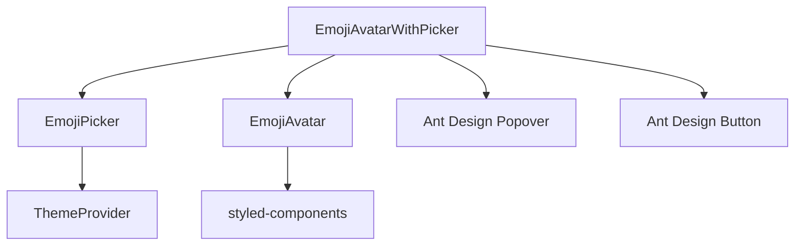
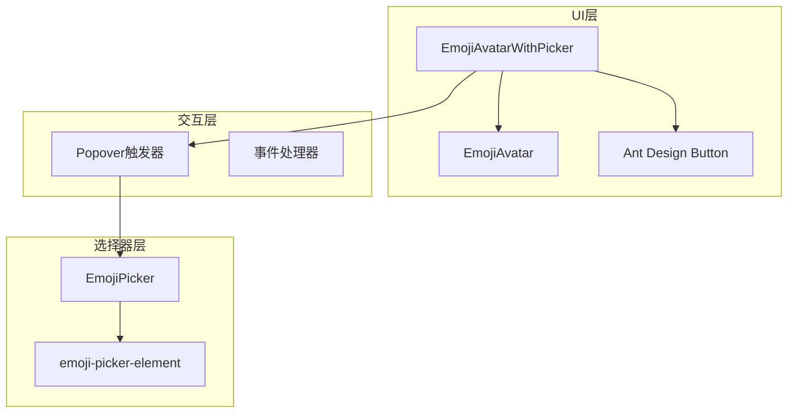
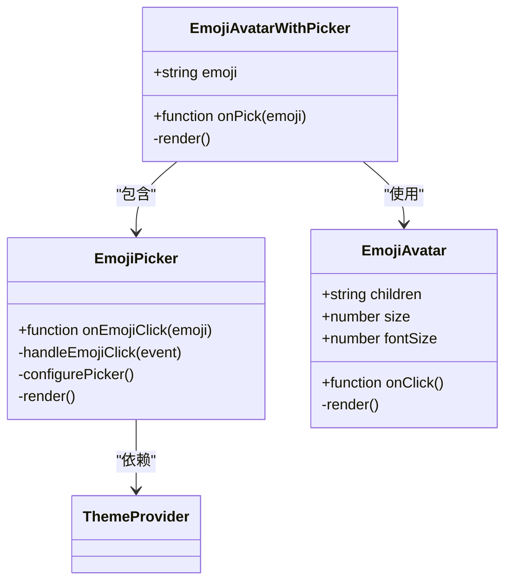
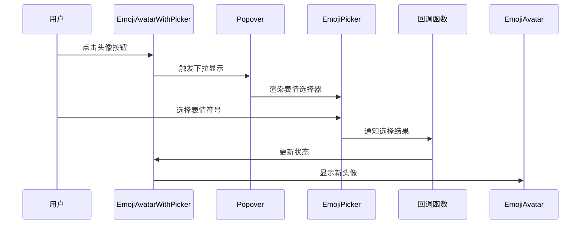
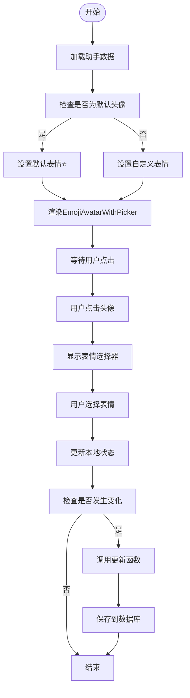
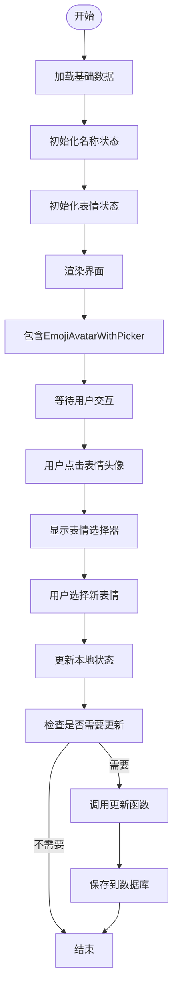
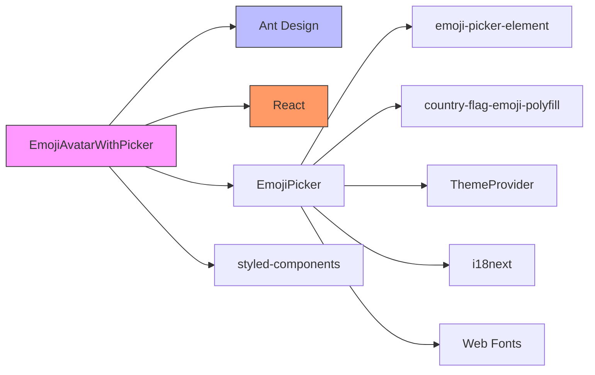

# Emoji选择器头像组件

<cite>
**本文档引用的文件**  
- [EmojiAvatarWithPicker.tsx](file://src/renderer/src/components/Avatar/EmojiAvatarWithPicker.tsx)
- [EmojiAvatar.tsx](file://src/renderer/src/components/Avatar/EmojiAvatar.tsx)
- [EmojiPicker/index.tsx](file://src/renderer/src/components/EmojiPicker/index.tsx)
- [AvatarSetting.tsx](file://src/renderer/src/pages/settings/AgentSettings/AvatarSetting.tsx)
- [NameSetting.tsx](file://src/renderer/src/pages/settings/AgentSettings/NameSetting.tsx)
- [agent.ts](file://src/renderer/src/types/agent.ts)
- [ThemeProvider.tsx](file://src/renderer/src/context/ThemeProvider.tsx)
</cite>

## 目录
1. [简介](#简介)
2. [项目结构](#项目结构)
3. [核心组件](#核心组件)
4. [架构概述](#架构概述)
5. [详细组件分析](#详细组件分析)
6. [依赖分析](#依赖分析)
7. [性能考虑](#性能考虑)
8. [故障排除指南](#故障排除指南)
9. [结论](#结论)

## 简介
EmojiAvatarWithPicker组件是一个复合UI组件，用于在创建和编辑AI助手时选择和显示头像。该组件集成了Emoji选择器功能，允许用户从丰富的表情符号库中选择个性化的头像。组件设计注重用户体验，提供了直观的交互流程和良好的可访问性支持。

## 项目结构
EmojiAvatarWithPicker组件位于项目的组件目录中，与其他UI组件共同构成了应用程序的用户界面。该组件依赖于多个子组件和上下文服务，形成了一个完整的头像选择解决方案。

**图表来源**  
- [EmojiAvatarWithPicker.tsx](file://src/renderer/src/components/Avatar/EmojiAvatarWithPicker.tsx#L1-L19)
- [EmojiAvatar.tsx](file://src/renderer/src/components/Avatar/EmojiAvatar.tsx#L1-L53)
- [EmojiPicker/index.tsx](file://src/renderer/src/components/EmojiPicker/index.tsx#L1-L127)

**章节来源**  
- [EmojiAvatarWithPicker.tsx](file://src/renderer/src/components/Avatar/EmojiAvatarWithPicker.tsx#L1-L19)

## 核心组件
EmojiAvatarWithPicker组件由多个核心部分组成：基础头像显示组件(EmojiAvatar)、表情选择器(EmojiPicker)和交互控制器。这些组件协同工作，提供完整的头像选择功能。组件通过props传递数据和回调函数，实现了清晰的职责分离和高内聚低耦合的设计原则。

**章节来源**  
- [EmojiAvatarWithPicker.tsx](file://src/renderer/src/components/Avatar/EmojiAvatarWithPicker.tsx#L6-L9)
- [EmojiAvatar.tsx](file://src/renderer/src/components/Avatar/EmojiAvatar.tsx#L4-L11)

## 架构概述
EmojiAvatarWithPicker组件采用分层架构设计，将UI展示、交互逻辑和状态管理分离。组件通过Ant Design的Popover组件实现下拉选择器功能，内部集成了第三方表情选择库，提供了丰富的表情符号选择体验。

**图表来源**  
- [EmojiAvatarWithPicker.tsx](file://src/renderer/src/components/Avatar/EmojiAvatarWithPicker.tsx#L11-L18)
- [EmojiPicker/index.tsx](file://src/renderer/src/components/EmojiPicker/index.tsx#L81-L124)

## 详细组件分析

### EmojiAvatarWithPicker组件分析
EmojiAvatarWithPicker是一个功能完整的复合组件，集成了头像显示和表情选择功能。组件通过简单的API暴露核心功能，使集成变得简单直接。

#### 组件架构图

**图表来源**  
- [EmojiAvatarWithPicker.tsx](file://src/renderer/src/components/Avatar/EmojiAvatarWithPicker.tsx#L11-L18)
- [EmojiAvatar.tsx](file://src/renderer/src/components/Avatar/EmojiAvatar.tsx#L13-L30)
- [EmojiPicker/index.tsx](file://src/renderer/src/components/EmojiPicker/index.tsx#L81-L124)

#### 交互流程图

**图表来源**  
- [EmojiAvatarWithPicker.tsx](file://src/renderer/src/components/Avatar/EmojiAvatarWithPicker.tsx#L13-L17)
- [EmojiPicker/index.tsx](file://src/renderer/src/components/EmojiPicker/index.tsx#L105-L111)

**章节来源**  
- [EmojiAvatarWithPicker.tsx](file://src/renderer/src/components/Avatar/EmojiAvatarWithPicker.tsx#L1-L19)

### 集成使用示例
EmojiAvatarWithPicker组件在AI助手设置界面中有两个主要使用场景：头像设置和名称设置。

#### 头像设置场景

**图表来源**  
- [AvatarSetting.tsx](file://src/renderer/src/pages/settings/AgentSettings/AvatarSetting.tsx#L16-L48)

#### 名称设置场景

**图表来源**  
- [NameSetting.tsx](file://src/renderer/src/pages/settings/AgentSettings/NameSetting.tsx#L15-L75)

**章节来源**  
- [AvatarSetting.tsx](file://src/renderer/src/pages/settings/AgentSettings/AvatarSetting.tsx#L16-L48)
- [NameSetting.tsx](file://src/renderer/src/pages/settings/AgentSettings/NameSetting.tsx#L15-L75)

## 依赖分析
EmojiAvatarWithPicker组件依赖于多个外部库和内部服务，形成了一个完整的依赖网络。

**图表来源**  
- [EmojiAvatarWithPicker.tsx](file://src/renderer/src/components/Avatar/EmojiAvatarWithPicker.tsx#L1-L5)
- [EmojiPicker/index.tsx](file://src/renderer/src/components/EmojiPicker/index.tsx#L1-L32)

## 性能考虑
EmojiAvatarWithPicker组件在设计时考虑了性能优化，通过以下方式确保流畅的用户体验：
- 使用memoized组件避免不必要的重渲染
- 懒加载表情选择器资源
- 优化事件处理机制
- 使用IndexedDB缓存表情数据
- 支持多语言环境下的本地化搜索

## 故障排除指南
在使用EmojiAvatarWithPicker组件时可能遇到以下常见问题及解决方案：

1. **表情选择器不显示**：检查Ant Design的Popover组件是否正确导入和配置
2. **表情显示异常**：确保字体资源正确加载，特别是国旗表情的特殊字体
3. **多语言支持问题**：验证i18n配置是否正确映射到表情选择器的语言设置
4. **主题不一致**：确认ThemeProvider正确提供主题信息给EmojiPicker组件
5. **性能问题**：检查是否启用了表情数据的IndexedDB缓存

**章节来源**  
- [EmojiPicker/index.tsx](file://src/renderer/src/components/EmojiPicker/index.tsx#L87-L99)
- [ThemeProvider.tsx](file://src/renderer/src/context/ThemeProvider.tsx#L9-L95)

## 结论
EmojiAvatarWithPicker组件是一个设计精良、功能完整的复合UI组件，为AI助手的头像选择提供了优雅的解决方案。组件通过合理的架构设计和清晰的API，实现了高可维护性和易用性。其集成的国际化支持和主题适配能力，确保了在不同环境下的良好表现。该组件的成功实现展示了现代前端开发中组件化设计的优势，为类似功能的开发提供了有价值的参考。