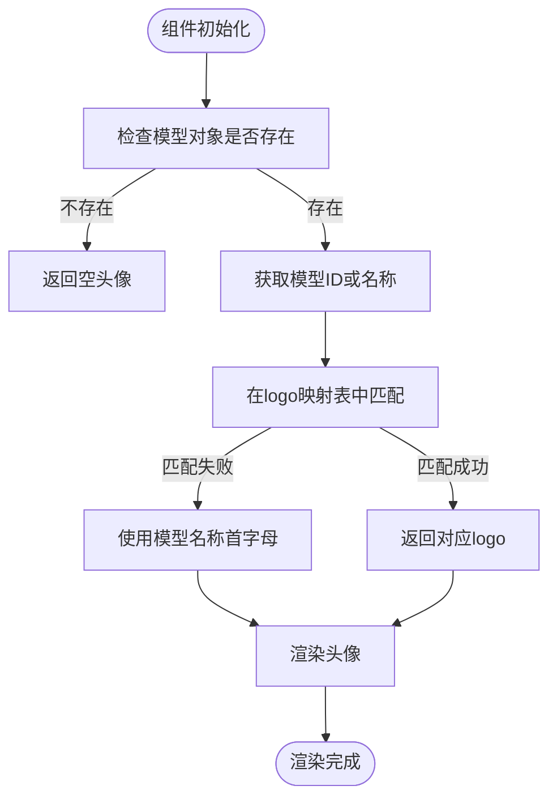
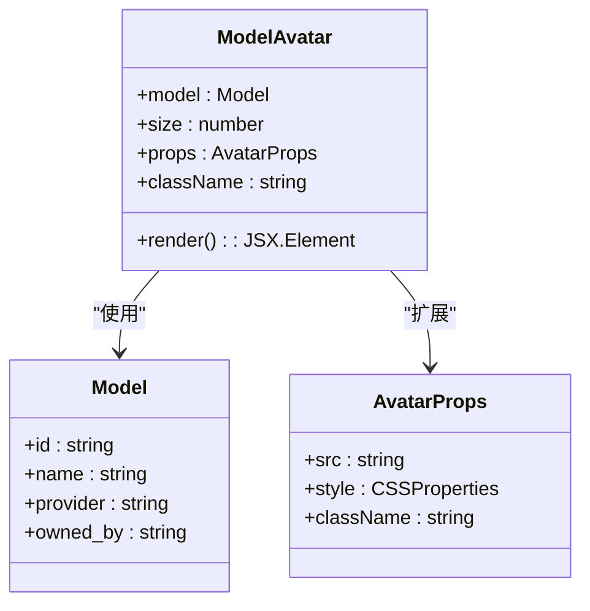
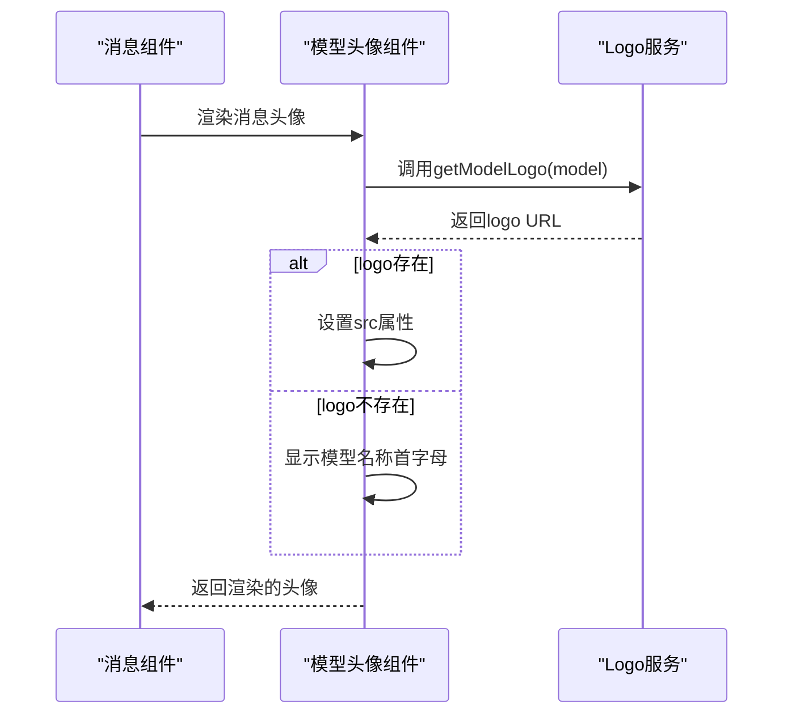
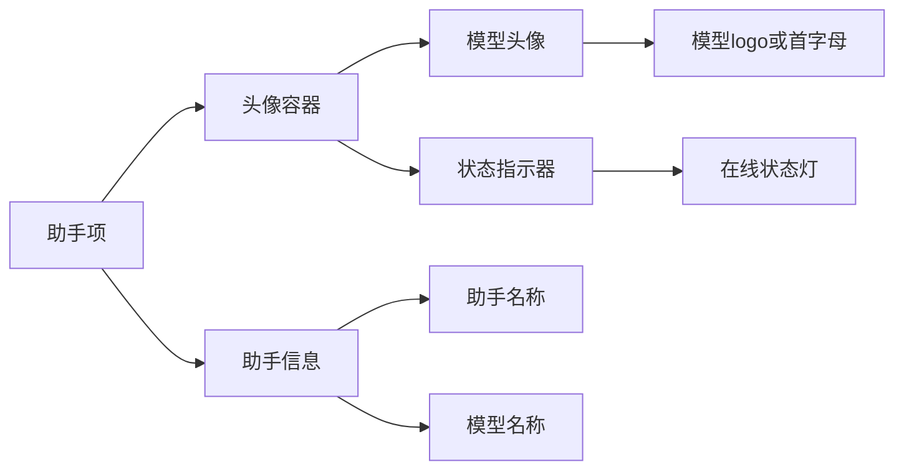
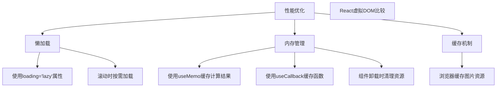
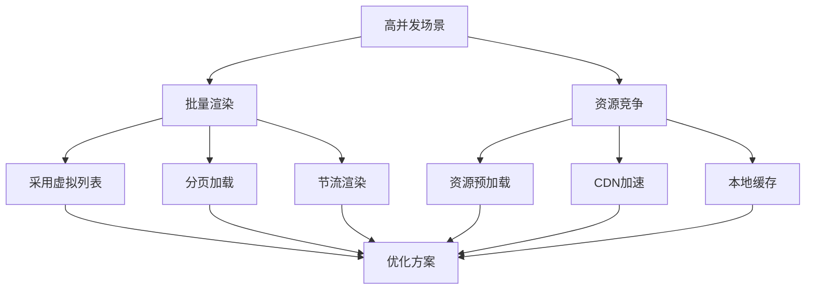

# 模型头像组件

<cite>
**本文档引用的文件**
- [ModelAvatar.tsx](file://src/renderer/src/components/Avatar/ModelAvatar.tsx)
- [logo.ts](file://src/renderer/src/config/models/logo.ts)
- [utils.ts](file://src/renderer/src/config/models/utils.ts)
- [types.ts](file://src/renderer/src/types/index.ts)
- [ModelSelector.tsx](file://src/renderer/src/components/ModelSelector.tsx)
- [MessageGroupModelList.tsx](file://src/renderer/src/pages/home/Messages/MessageGroupModelList.tsx)
</cite>

## 目录
1. [简介](#简介)
2. [核心实现机制](#核心实现机制)
3. [属性接口](#属性接口)
4. [集成用法示例](#集成用法示例)
5. [性能优化建议](#性能优化建议)
6. [高并发场景解决方案](#高并发场景解决方案)

## 简介
模型头像组件（ModelAvatar）是Cherry Studio应用中的核心UI组件，负责将AI模型标识符映射为相应的视觉头像。该组件根据模型提供商动态渲染品牌标识，为用户提供直观的模型识别体验。组件广泛应用于对话界面、助手列表和模型选择器等场景，通过统一的视觉语言增强用户体验。

## 核心实现机制

模型头像组件的核心功能是将模型标识符（model ID）映射到相应的视觉头像。这一过程通过`getModelLogo`函数实现，该函数根据模型ID或名称匹配预定义的logo映射表。

**Diagram sources**
- [ModelAvatar.tsx](file://src/renderer/src/components/Avatar/ModelAvatar.tsx#L1-L35)
- [logo.ts](file://src/renderer/src/config/models/logo.ts#L165-L318)

**Section sources**
- [ModelAvatar.tsx](file://src/renderer/src/components/Avatar/ModelAvatar.tsx#L1-L35)
- [logo.ts](file://src/renderer/src/config/models/logo.ts#L165-L318)

## 属性接口

模型头像组件提供了一系列属性接口，支持灵活的配置和定制：

| 属性 | 类型 | 必需 | 默认值 | 描述 |
|------|------|------|--------|------|
| model | Model | 否 | - | 模型对象，包含ID、名称和提供商信息 |
| size | number | 是 | - | 头像尺寸（像素） |
| props | AvatarProps | 否 | - | 传递给底层Ant Design Avatar组件的属性 |
| className | string | 否 | - | 自定义CSS类名 |

**Diagram sources**
- [ModelAvatar.tsx](file://src/renderer/src/components/Avatar/ModelAvatar.tsx#L8-L13)
- [types.ts](file://src/renderer/src/types/index.ts#L28-L56)

**Section sources**
- [ModelAvatar.tsx](file://src/renderer/src/components/Avatar/ModelAvatar.tsx#L8-L13)
- [types.ts](file://src/renderer/src/types/index.ts#L28-L56)

## 集成用法示例

### 对话界面中的使用
在对话界面中，模型头像组件用于显示消息发送者的模型标识。当模型正在处理消息时，会添加脉冲动画效果。

**Diagram sources**
- [MessageGroupModelList.tsx](file://src/renderer/src/pages/home/Messages/MessageGroupModelList.tsx#L50-L65)
- [ModelAvatar.tsx](file://src/renderer/src/components/Avatar/ModelAvatar.tsx#L1-L35)

### 助手列表中的使用
在助手列表中，模型头像组件与其他UI元素结合使用，提供丰富的视觉层次。

**Diagram sources**
- [ModelSelector.tsx](file://src/renderer/src/components/ModelSelector.tsx#L60-L75)
- [MessageGroupModelList.tsx](file://src/renderer/src/pages/home/Messages/MessageGroupModelList.tsx#L50-L65)

## 性能优化建议

### 懒加载策略
模型头像组件利用浏览器的原生图片懒加载特性，通过``属性实现滚动时的按需加载。

### 内存管理
组件采用函数式组件和React Hooks，确保在组件卸载时自动清理相关资源。通过`useMemo`和`useCallback`等Hooks避免不必要的重新渲染。

**Diagram sources**
- [ModelAvatar.tsx](file://src/renderer/src/components/Avatar/ModelAvatar.tsx#L1-L35)
- [ModelSelector.tsx](file://src/renderer/src/components/ModelSelector.tsx#L60-L75)

## 高并发场景解决方案

### 批量渲染优化
在高并发场景下，当需要同时渲染大量模型头像时，建议采用虚拟列表技术，只渲染可视区域内的组件。

### 资源预加载
对于常用的模型logo，可以在应用启动时进行预加载，减少首次渲染的延迟。

**Diagram sources**
- [MessageGroupModelList.tsx](file://src/renderer/src/pages/home/Messages/MessageGroupModelList.tsx#L88-L106)
- [ModelSelector.tsx](file://src/renderer/src/components/ModelSelector.tsx#L80-L97)