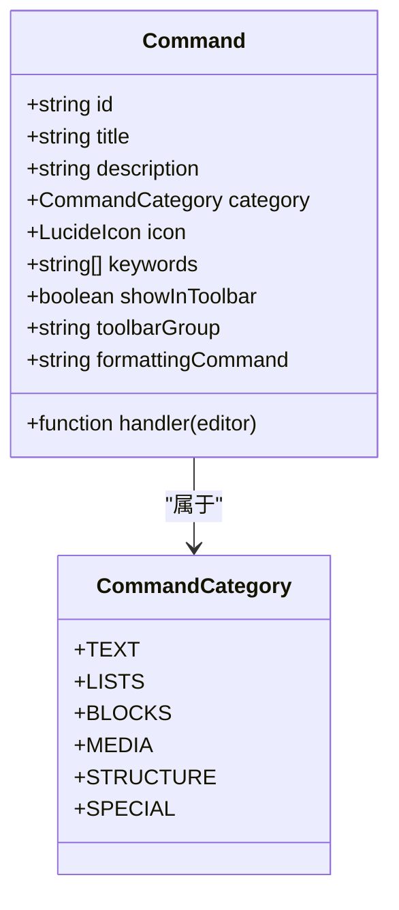
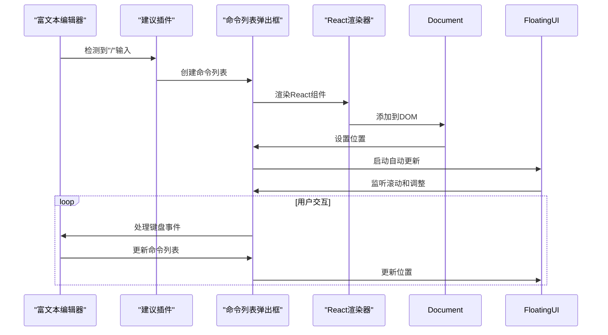
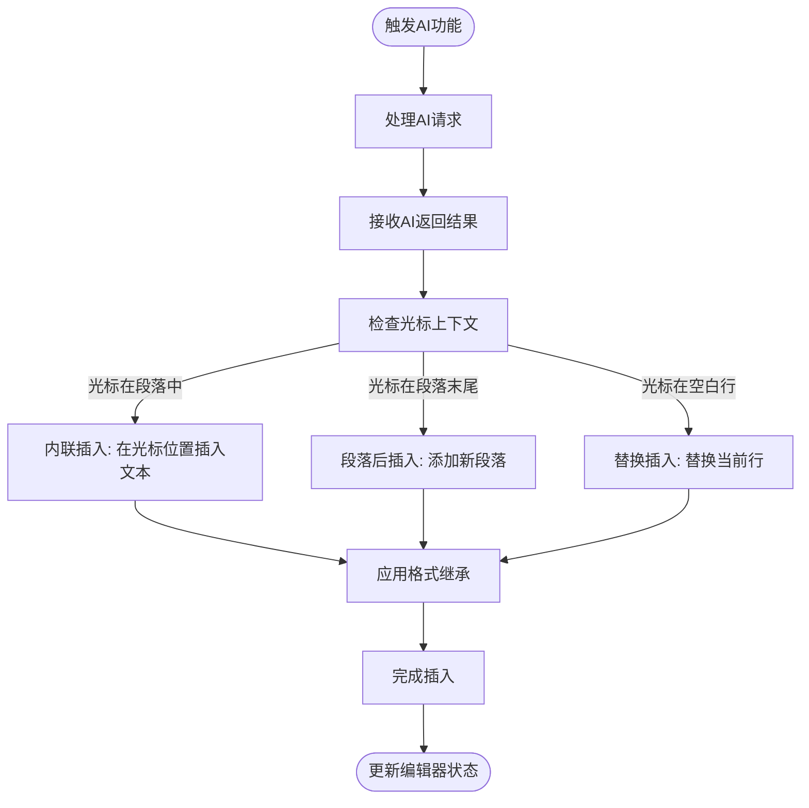

# AI系统集成

<cite>
**本文档引用的文件**   
- [command.ts](file://src/renderer/src/components/RichEditor/command.ts)
- [CommandListPopover.tsx](file://src/renderer/src/components/RichEditor/CommandListPopover.tsx)
- [index.tsx](file://src/renderer/src/components/RichEditor/index.tsx)
- [useRichEditor.ts](file://src/renderer/src/components/RichEditor/useRichEditor.ts)
- [builtinSlashCommands.ts](file://src/main/services/agents/services/claudecode/commands.ts)
</cite>

## 目录
1. [简介](#简介)
2. [富文本编辑器与AI对话系统集成](#富文本编辑器与ai对话系统集成)
3. [AI命令定义与管理](#ai命令定义与管理)
4. [命令列表弹出框实现机制](#命令列表弹出框实现机制)
5. [AI生成内容插入策略](#ai生成内容插入策略)
6. [上下文感知的智能建议功能](#上下文感知的智能建议功能)
7. [集成示例](#集成示例)

## 简介
本文档详细描述了富文本编辑器与AI对话系统的集成机制。系统通过`command.ts`文件定义AI相关命令，并利用`CommandListPopover`组件动态显示可用的AI操作。用户可以通过编辑器界面触发AI功能，系统将处理返回结果并智能地插入到文档中。该集成支持上下文感知的智能建议，为用户提供高效的AI辅助创作体验。

## 富文本编辑器与AI对话系统集成
富文本编辑器与AI对话系统通过命令系统实现深度集成。编辑器使用TipTap框架构建，支持Markdown格式的内容存储和HTML渲染。AI功能通过命令系统集成到编辑器中，用户可以通过快捷键或界面操作触发AI功能。

系统通过动态命令注册机制管理AI相关命令，支持在运行时注册和注销命令。命令分为两类：显示在工具栏中的命令和仅在命令列表中显示的命令。AI相关命令通常通过斜杠命令（slash commands）触发，用户输入"/"后会显示可用的AI操作列表。

**Section sources**
- [index.tsx](file://src/renderer/src/components/RichEditor/index.tsx#L1-L626)
- [useRichEditor.ts](file://src/renderer/src/components/RichEditor/useRichEditor.ts#L1-L870)

## AI命令定义与管理
AI相关命令在`command.ts`文件中定义和管理。系统使用命令注册表（command registry）来存储和管理所有可用命令。每个命令包含ID、标题、描述、分类、图标、关键词和处理函数等属性。



**Diagram sources**
- [command.ts](file://src/renderer/src/components/RichEditor/command.ts#L38-L51)

命令管理提供以下核心功能：
- `registerCommand`: 注册新命令
- `unregisterCommand`: 注销命令
- `getAllCommands`: 获取所有命令
- `getToolbarCommands`: 获取工具栏命令
- `filterCommands`: 根据查询条件过滤命令

AI相关的斜杠命令在`builtinSlashCommands.ts`文件中定义，包括清除对话历史、压缩对话、可视化上下文使用情况等操作。

**Section sources**
- [command.ts](file://src/renderer/src/components/RichEditor/command.ts#L68-L116)
- [builtinSlashCommands.ts](file://src/main/services/agents/services/claudecode/commands.ts#L1-L12)

## 命令列表弹出框实现机制
命令列表弹出框（CommandListPopover）是AI功能的核心交互组件，负责显示可用的AI操作并处理用户选择。该组件使用Floating UI库实现定位和自动更新，确保弹出框始终相对于编辑器光标位置正确显示。



**Diagram sources**
- [command.ts](file://src/renderer/src/components/RichEditor/command.ts#L593-L635)
- [CommandListPopover.tsx](file://src/renderer/src/components/RichEditor/CommandListPopover.tsx#L1-L230)

弹出框的实现包含以下关键步骤：
1. 使用`ReactRenderer`创建React组件实例
2. 将组件元素添加到文档body中
3. 使用`autoUpdate`函数设置自动位置更新，响应滚动和窗口大小变化
4. 通过`computePosition`计算弹出框相对于编辑器光标的位置
5. 监听键盘事件并传递给弹出框组件处理

弹出框支持虚拟滚动（Virtual List），可以高效地渲染大量命令选项，同时提供搜索过滤功能，用户可以输入关键词快速找到所需命令。

**Section sources**
- [command.ts](file://src/renderer/src/components/RichEditor/command.ts#L593-L635)
- [CommandListPopover.tsx](file://src/renderer/src/components/RichEditor/CommandListPopover.tsx#L1-L230)

## AI生成内容插入策略
AI生成内容的插入策略设计为无缝集成到编辑器工作流中。当用户触发AI功能并收到返回结果后，系统会根据上下文智能地决定内容插入位置和格式。

系统采用以下插入策略：
- **光标位置插入**：默认在当前光标位置插入AI生成的内容
- **段落智能分割**：根据语义自动分割长文本，避免破坏现有段落结构
- **格式继承**：新插入的内容继承周围文本的格式设置
- **上下文感知**：根据光标周围的上下文调整插入内容的格式和样式



**Diagram sources**
- [index.tsx](file://src/renderer/src/components/RichEditor/index.tsx#L485-L552)
- [useRichEditor.ts](file://src/renderer/src/components/RichEditor/useRichEditor.ts#L449-L464)

对于特殊内容类型（如代码块、数学公式、表格等），系统会使用相应的TipTap命令进行插入，确保内容被正确解析和渲染。例如，代码块会使用`toggleCodeBlock`命令，数学公式会使用`updateBlockMath`命令。

**Section sources**
- [index.tsx](file://src/renderer/src/components/RichEditor/index.tsx#L485-L552)
- [useRichEditor.ts](file://src/renderer/src/components/RichEditor/useRichEditor.ts#L449-L464)

## 上下文感知的智能建议功能
上下文感知的智能建议功能是AI集成的核心优势。系统能够分析用户当前的编辑上下文，提供相关的AI操作建议。建议功能通过分析光标位置、选中文本、文档结构等信息，预测用户可能需要的AI功能。

智能建议的实现基于以下机制：
1. **上下文分析**：分析光标周围的文本内容、格式和结构
2. **意图识别**：根据上下文推断用户可能的操作意图
3. **命令过滤**：根据意图过滤和排序可用的AI命令
4. **动态更新**：随着用户输入实时更新建议列表

系统使用`filterCommands`函数实现智能过滤，支持按分类、搜索查询和最大结果数进行过滤。过滤算法考虑关键词匹配度，优先显示精确匹配和标题匹配的命令。

```mermaid
flowchart LR
A[用户输入"/"] --> B[激活建议插件]
B --> C[获取所有AI命令]
C --> D[分析编辑上下文]
D --> E[识别用户意图]
E --> F[过滤相关命令]
F --> G[按相关性排序]
G --> H[显示建议列表]
H --> I[用户选择命令]
I --> J[执行AI功能]
J --> K[插入AI生成内容]
```

**Diagram sources**
- [command.ts](file://src/renderer/src/components/RichEditor/command.ts#L466-L505)
- [useRichEditor.ts](file://src/renderer/src/components/RichEditor/useRichEditor.ts#L360-L361)

建议功能还支持快捷键导航，用户可以使用上下箭头键选择命令，按Enter键执行。系统会高亮显示当前选中的命令，并在底部显示命令描述，帮助用户做出选择。

**Section sources**
- [command.ts](file://src/renderer/src/components/RichEditor/command.ts#L466-L505)
- [useRichEditor.ts](file://src/renderer/src/components/RichEditor/useRichEditor.ts#L360-L361)

## 集成示例
以下示例展示用户如何通过编辑器界面触发AI功能并处理返回结果：

1. **触发AI功能**：
   - 用户在编辑器中输入"/"字符
   - 系统检测到斜杠输入，激活命令建议插件
   - 命令列表弹出框显示可用的AI操作

2. **选择AI命令**：
   - 用户使用上下箭头键浏览命令列表
   - 系统高亮显示当前选中的命令
   - 用户按Enter键选择所需命令

3. **处理AI请求**：
   - 系统执行命令处理函数
   - 向AI服务发送请求，包含当前文档上下文
   - 等待AI生成响应

4. **插入AI结果**：
   - 接收AI返回的生成内容
   - 根据上下文选择合适的插入策略
   - 将内容插入到编辑器的适当位置

5. **更新界面**：
   - 关闭命令列表弹出框
   - 聚焦回编辑器
   - 更新文档状态

此集成模式为用户提供了一致且直观的AI交互体验，使AI功能成为编辑工作流的自然延伸。

**Section sources**
- [index.tsx](file://src/renderer/src/components/RichEditor/index.tsx#L344-L359)
- [command.ts](file://src/renderer/src/components/RichEditor/command.ts#L139-L195)
- [useRichEditor.ts](file://src/renderer/src/components/RichEditor/useRichEditor.ts#L449-L464)