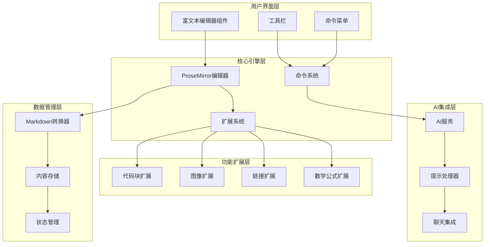
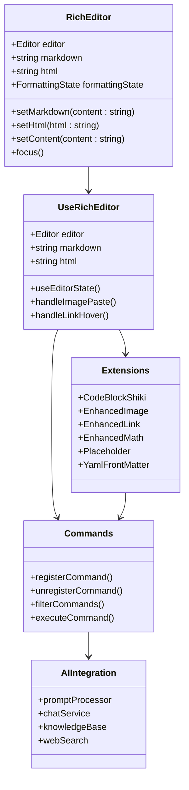
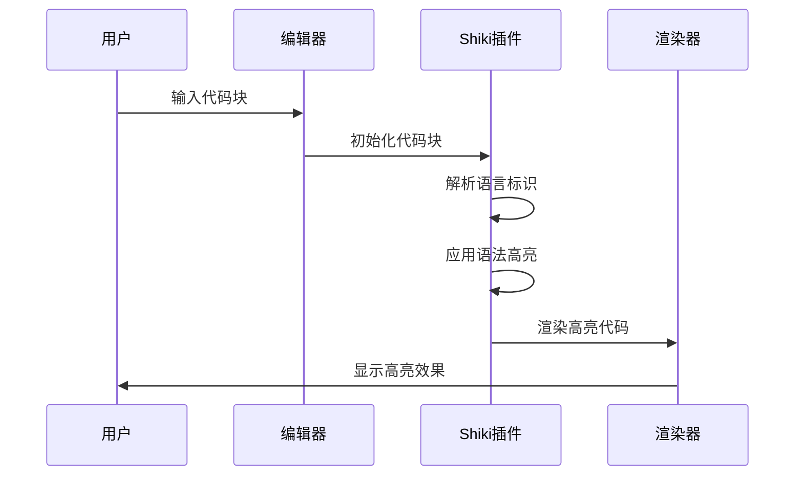
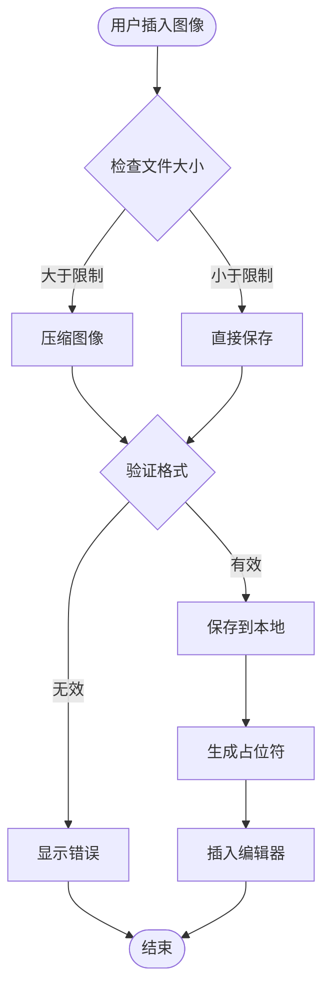
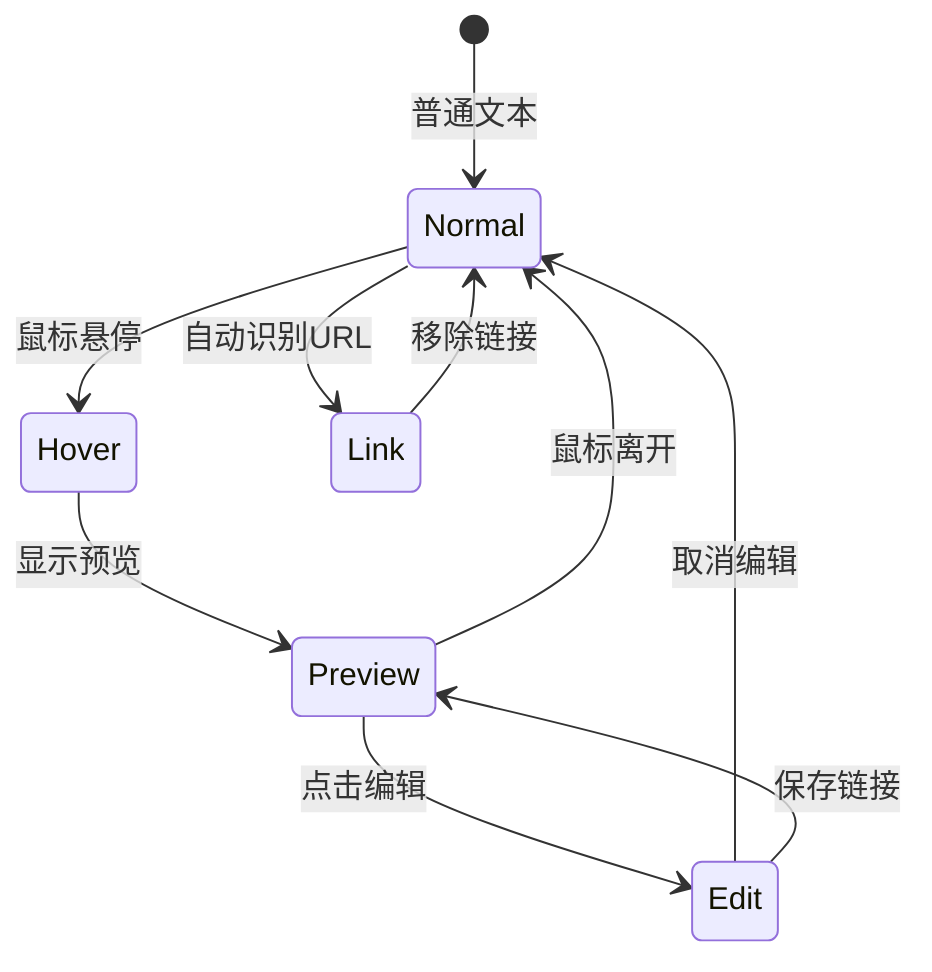
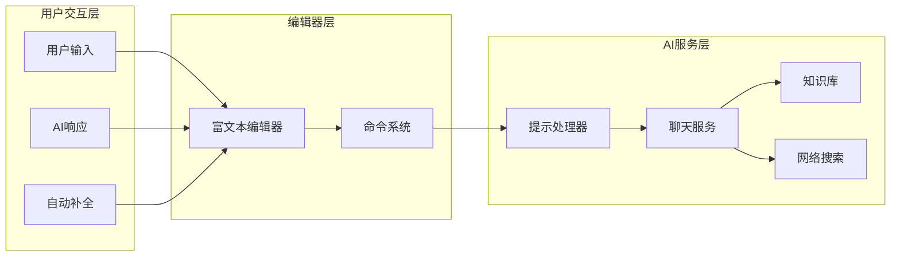
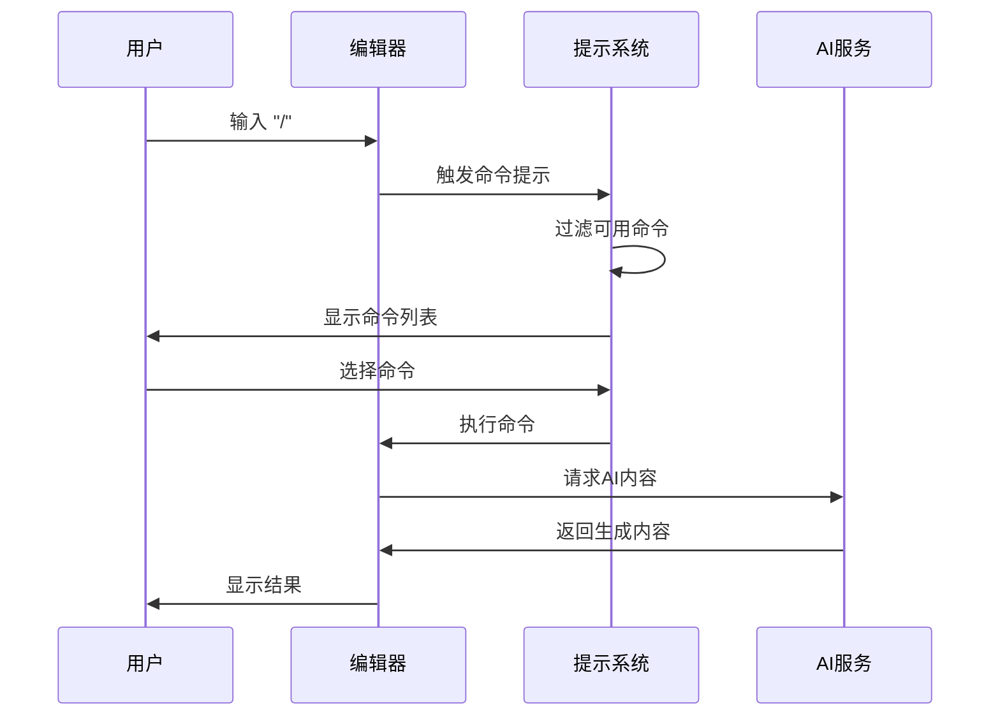
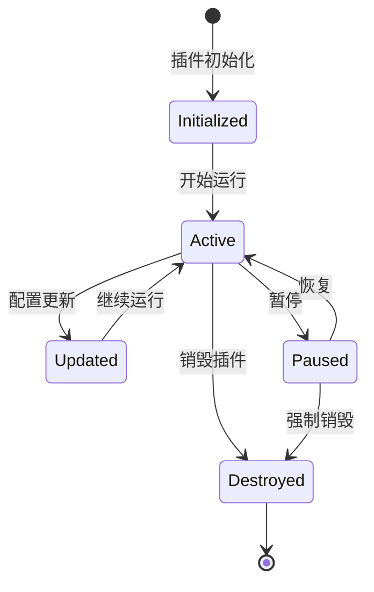

# Cherry Studio富文本编辑器组件深度技术文档

<cite>
**本文档引用的文件**
- [useRichEditor.ts](file://src/renderer/src/components/RichEditor/useRichEditor.ts)
- [index.tsx](file://src/renderer/src/components/RichEditor/index.tsx)
- [code-block-shiki.ts](file://src/renderer/src/components/RichEditor/extensions/code-block-shiki/code-block-shiki.ts)
- [enhanced-image.ts](file://src/renderer/src/components/RichEditor/extensions/enhanced-image.ts)
- [enhanced-link.ts](file://src/renderer/src/components/RichEditor/extensions/enhanced-link.ts)
- [enhanced-math.ts](file://src/renderer/src/components/RichEditor/extensions/enhanced-math.ts)
- [imageUtils.ts](file://src/renderer/src/components/RichEditor/helpers/imageUtils.ts)
- [types.ts](file://src/renderer/src/components/RichEditor/types.ts)
- [command.ts](file://src/renderer/src/components/RichEditor/command.ts)
- [toolbar.tsx](file://src/renderer/src/components/RichEditor/toolbar.tsx)
</cite>

## 目录
1. [概述](#概述)
2. [架构设计](#架构设计)
3. [核心组件分析](#核心组件分析)
4. [扩展功能详解](#扩展功能详解)
5. [AI集成方案](#ai集成方案)
6. [性能优化策略](#性能优化策略)
7. [扩展开发指南](#扩展开发指南)
8. [最佳实践](#最佳实践)
9. [故障排除](#故障排除)

## 概述

Cherry Studio富文本编辑器是一个基于ProseMirror构建的强大编辑器组件，专为AI驱动的写作场景设计。该编辑器不仅支持标准的Markdown格式，还集成了代码高亮、数学公式、图像处理等高级功能，并与AI对话系统无缝集成。

### 主要特性

- **基于ProseMirror的现代架构**：提供流畅的编辑体验和强大的可扩展性
- **丰富的扩展功能**：code-block-shiki代码高亮、enhanced-image图像增强、enhanced-link链接管理、enhanced-math数学公式
- **AI集成能力**：与聊天系统深度集成，支持智能提示和自动补全
- **高性能渲染**：针对大型文档优化的渲染策略
- **灵活的扩展系统**：支持自定义插件和功能扩展

## 架构设计

### 整体架构图



**架构图来源**
- [useRichEditor.ts](file://src/renderer/src/components/RichEditor/useRichEditor.ts#L224-L386)
- [index.tsx](file://src/renderer/src/components/RichEditor/index.tsx#L207-L246)

### 核心模块关系



**类图来源**
- [useRichEditor.ts](file://src/renderer/src/components/RichEditor/useRichEditor.ts#L147-L870)
- [types.ts](file://src/renderer/src/components/RichEditor/types.ts#L87-L308)
- [command.ts](file://src/renderer/src/components/RichEditor/command.ts#L38-L670)

## 核心组件分析

### useRichEditor Hook

`useRichEditor`是编辑器的核心Hook，负责管理编辑器的状态和行为。

#### 主要功能

1. **编辑器实例管理**：创建和配置ProseMirror编辑器实例
2. **内容转换**：在Markdown和HTML之间双向转换
3. **状态同步**：维护编辑器状态与外部状态的一致性
4. **事件处理**：处理粘贴、焦点变化等用户交互

#### 关键配置

编辑器通过多个扩展提供丰富的功能：

```typescript
const extensions = useMemo(() => [
  SourceLineAttribute,
  StarterKit.configure({ /* 基础配置 */ }),
  EnhancedLink,
  TableOfContents,
  CodeBlockShiki,
  EnhancedMath,
  EnhancedImage,
  Placeholder,
  YamlFrontMatter,
  Mention,
  Typography,
  TableKit,
  TaskList,
  TaskItem
], [placeholder, activeShikiTheme, handleLinkHover, handleLinkHoverEnd]);
```

**章节来源**
- [useRichEditor.ts](file://src/renderer/src/components/RichEditor/useRichEditor.ts#L224-L386)

### 编辑器组件

RichEditor组件提供了完整的编辑器界面，包括工具栏、内容区域和辅助功能。

#### 组件特性

- **响应式布局**：根据容器大小自动调整
- **工具栏定制**：支持自定义工具栏项目
- **拖拽支持**：支持内容块的拖拽排序
- **搜索功能**：内置内容搜索和高亮

#### 导出接口

编辑器通过ref暴露丰富的API：

```typescript
export interface RichEditorRef {
  getContent: () => string
  getHtml: () => string
  getMarkdown: () => string
  setContent: (content: string) => void
  setHtml: (html: string) => void
  setMarkdown: (markdown: string) => void
  focus: () => void
  clear: () => void
  insertText: (text: string) => void
  scrollToLine: (lineNumber: number, options?: { highlight?: boolean }) => void
}
```

**章节来源**
- [index.tsx](file://src/renderer/src/components/RichEditor/index.tsx#L543-L549)
- [types.ts](file://src/renderer/src/components/RichEditor/types.ts#L87-L131)

## 扩展功能详解

### code-block-shiki 代码高亮扩展

code-block-shiki扩展提供了强大的代码语法高亮功能，基于Shiki主题系统。

#### 核心特性

1. **多语言支持**：支持超过100种编程语言
2. **主题系统**：内置多种颜色主题
3. **动态语言检测**：支持```language语法
4. **代码编辑增强**：提供缩进管理和行号显示

#### 实现机制



**序列图来源**
- [code-block-shiki.ts](file://src/renderer/src/components/RichEditor/extensions/code-block-shiki/code-block-shiki.ts#L94-L128)

#### 配置选项

```typescript
export interface CodeBlockShikiOptions extends CodeBlockOptions {
  defaultLanguage: string  // 默认语言
  theme: string           // 主题名称
}
```

**章节来源**
- [code-block-shiki.ts](file://src/renderer/src/components/RichEditor/extensions/code-block-shiki/code-block-shiki.ts#L8-L20)

### enhanced-image 图像增强扩展

enhanced-image扩展提供了现代化的图像处理功能，支持图像占位符和自动上传。

#### 功能特性

1. **图像占位符**：提供视觉反馈的图像插入机制
2. **自动压缩**：智能压缩大图像文件
3. **格式支持**：支持PNG、JPEG、WebP等多种格式
4. **拖拽上传**：支持拖拽方式插入图像

#### 图像处理流程



**流程图来源**
- [imageUtils.ts](file://src/renderer/src/components/RichEditor/helpers/imageUtils.ts#L18-L73)
- [enhanced-image.ts](file://src/renderer/src/components/RichEditor/extensions/enhanced-image.ts#L58-L67)

#### 压缩算法

图像压缩采用Canvas API进行处理：

```typescript
async function compressImage(file: File, options: ImageCompressionOptions): Promise<Blob> {
  const { maxWidth = 1200, maxHeight = 1200, quality = 0.8, outputFormat = 'jpeg' } = options
  
  return new Promise((resolve, reject) => {
    const img = new Image()
    const canvas = document.createElement('canvas')
    const ctx = canvas.getContext('2d')
    
    img.onload = () => {
      // 计算新尺寸
      let { width, height } = img
      const aspectRatio = width / height
      
      if (width > maxWidth) {
        width = maxWidth
        height = width / aspectRatio
      }
      
      // 绘制到Canvas
      canvas.width = width
      canvas.height = height
      ctx.drawImage(img, 0, 0, width, height)
      
      // 转换为Blob
      canvas.toBlob((blob) => {
        if (blob) resolve(blob)
        else reject(new Error('图片压缩失败'))
      }, outputFormat === 'png' ? 'image/png' : `image/${outputFormat}`, quality)
    }
  })
}
```

**章节来源**
- [imageUtils.ts](file://src/renderer/src/components/RichEditor/helpers/imageUtils.ts#L18-L73)

### enhanced-link 链接增强扩展

enhanced-link扩展提供了智能的链接管理和悬停交互功能。

#### 核心功能

1. **智能链接识别**：自动识别URL并创建链接
2. **悬停预览**：鼠标悬停时显示链接预览
3. **自动更新**：链接文本与URL自动同步
4. **编辑器集成**：与链接编辑器无缝集成

#### 链接处理机制



**状态图来源**
- [enhanced-link.ts](file://src/renderer/src/components/RichEditor/extensions/enhanced-link.ts#L50-L221)

#### 悬停处理逻辑

链接悬停功能通过ProseMirror插件实现：

```typescript
const createLinkHoverPlugin = (options: LinkHoverPluginOptions) => {
  return new Plugin({
    key: linkHoverPlugin,
    props: {
      handleDOMEvents: {
        mouseover: (view, event) => {
          const linkElement = target.closest('a[href]')
          if (linkElement) {
            // 延迟处理以避免频繁触发
            hoverTimeout = setTimeout(() => {
              const href = linkElement.getAttribute('href') || ''
              const text = linkElement.textContent || ''
              
              // 获取链接范围和位置
              const linkRange = getMarkRange($pos, linkMark.type, linkMark.attrs)
              const linkRect = calculateSmartPosition(linkElement.getBoundingClientRect())
              
              options.onLinkHover?.({ href, text }, linkRect, linkElement, linkRange)
            }, hoverDelay)
          }
        }
      }
    }
  })
}
```

**章节来源**
- [enhanced-link.ts](file://src/renderer/src/components/RichEditor/extensions/enhanced-link.ts#L50-L221)

### enhanced-math 数学公式扩展

enhanced-math扩展支持LaTeX数学公式的输入和渲染。

#### 支持的公式类型

1. **内联公式**：使用`$...$`语法
2. **块级公式**：使用`$$...$$`语法
3. **公式编辑器**：集成MathJax/KaTeX渲染

#### 公式输入规则

```typescript
// 内联公式规则
new InputRule({
  find: /(^|[^$])(\$([^$\n]+?)\$)(?!\$)/,
  handler: ({ state, range, match }) => {
    const latex = match[3]
    const { tr } = state
    tr.replaceWith(range.from, range.to, this.type.create({ latex }))
  }
})

// 块级公式规则  
new InputRule({
  find: /^\$\$([^$]+)\$\$$/,
  handler: ({ state, range, match }) => {
    const latex = match[1]
    const { tr } = state
    tr.replaceWith(range.from, range.to, this.type.create({ latex }))
  }
})
```

**章节来源**
- [enhanced-math.ts](file://src/renderer/src/components/RichEditor/extensions/enhanced-math.ts#L45-L74)

## AI集成方案

### 与聊天系统的集成

富文本编辑器与AI对话系统深度集成，提供智能写作辅助。

#### 集成架构



**架构图来源**
- [command.ts](file://src/renderer/src/components/RichEditor/command.ts#L559-L669)

#### 命令系统集成

编辑器通过动态命令系统与AI服务集成：

```typescript
// 注册AI相关命令
registerCommand({
  id: 'aiGenerate',
  title: 'AI生成内容',
  description: '使用AI生成内容',
  category: CommandCategory.SPECIAL,
  icon: Sparkles,
  keywords: ['ai', 'generate', 'assistant'],
  handler: (editor) => {
    // 调用AI服务生成内容
    aiService.generateContent(editor.getText())
      .then((generatedText) => {
        editor.commands.insertContent(generatedText)
      })
  }
})
```

#### 提示处理器

提示处理器负责处理AI相关的提示和指令：

```typescript
export interface PromptProcessor {
  processPrompt(prompt: string): Promise<string>
  getContext(): Promise<ContextItem[]>
  updateContext(context: ContextItem[]): void
}
```

**章节来源**
- [command.ts](file://src/renderer/src/components/RichEditor/command.ts#L38-L670)

### 智能提示系统

编辑器内置智能提示系统，支持多种类型的自动补全：

1. **命令提示**：使用`/`触发的命令列表
2. **Mention提示**：@符号触发的人员提及
3. **AI提示**：基于上下文的智能建议

#### 命令提示实现



**序列图来源**
- [command.ts](file://src/renderer/src/components/RichEditor/command.ts#L559-L669)

## 性能优化策略

### 大型文档处理

对于大型文档，编辑器采用多种优化策略确保流畅的用户体验。

#### 渲染优化

1. **虚拟滚动**：只渲染可见区域的内容
2. **懒加载**：延迟加载非关键内容
3. **分块处理**：将大文档分割成小块处理

#### 内存管理

```typescript
// 编辑器销毁时清理资源
useEffect(() => {
  return () => {
    if (editor && !editor.isDestroyed) {
      editor.destroy()
    }
  }
}, [editor])

// 防止内存泄漏的监听器清理
useEffect(() => {
  const handleMathDialog = (event: CustomEvent) => {
    // 处理事件
  }
  
  window.addEventListener('openMathDialog', handleMathDialog)
  return () => {
    window.removeEventListener('openMathDialog', handleMathDialog)
  }
}, [])
```

**章节来源**
- [useRichEditor.ts](file://src/renderer/src/components/RichEditor/useRichEditor.ts#L667-L673)

### 响应式优化

#### 防抖和节流

```typescript
// 防抖处理内容变化
const debouncedOnChange = useCallback(
  debounce((markdown: string) => {
    onChange?.(markdown)
  }, 300),
  [onChange]
)

// 节流处理滚动事件
const throttledScroll = useCallback(
  throttle((event: Event) => {
    updatePosition(editor, element)
  }, 16),
  [editor, updatePosition]
)
```

#### 异步处理

```typescript
// 异步处理图像上传
const handleImagePaste = useCallback(async (file: File) => {
  try {
    // 异步压缩图像
    const processedFile = shouldCompressImage(file) 
      ? await compressImage(file, { maxWidth: 1200 })
      : file
    
    // 异步保存到本地
    const fileMetadata = await window.api.file.savePastedImage(
      new Uint8Array(await blobToArrayBuffer(processedFile)),
      getFileExtension(file)
    )
    
    // 同步更新编辑器
    if (editor && !editor.isDestroyed) {
      editor.chain().focus().setImage({ src: `file://${fileMetadata.path}` }).run()
    }
  } catch (error) {
    logger.error('图像处理失败:', error)
  }
}, [editor])
```

**章节来源**
- [useRichEditor.ts](file://src/renderer/src/components/RichEditor/useRichEditor.ts#L479-L526)

## 扩展开发指南

### 创建自定义扩展

开发者可以通过继承基础扩展类来创建自定义功能。

#### 基本扩展结构

```typescript
import { Extension } from '@tiptap/core'

export const CustomExtension = Extension.create({
  name: 'customExtension',
  
  addOptions() {
    return {
      // 默认选项
    }
  },
  
  addCommands() {
    return {
      customCommand: () => ({ commands }) => {
        return commands.insertContent('<custom-content />')
      }
    }
  },
  
  addKeyboardShortcuts() {
    return {
      'Mod-Shift-C': () => {
        return this.editor.commands.customCommand()
      }
    }
  },
  
  addProseMirrorPlugins() {
    return [
      // 自定义ProseMirror插件
    ]
  }
})
```

#### 扩展注册

```typescript
// 在编辑器初始化时注册扩展
const extensions = useMemo(() => [
  StarterKit,
  CustomExtension,
  // 其他扩展...
], [])

const editor = useEditor({
  extensions,
  // 其他配置...
})
```

### 插件开发模式

#### 插件生命周期



#### 插件最佳实践

1. **资源管理**：正确清理事件监听器和定时器
2. **错误处理**：优雅处理异常情况
3. **性能考虑**：避免阻塞主线程的操作
4. **兼容性**：确保与其他扩展的兼容性

### 自定义功能添加

#### 添加新的命令

```typescript
// 定义新命令
const customCommand: Command = {
  id: 'customFeature',
  title: '自定义功能',
  description: '演示如何添加自定义功能',
  category: CommandCategory.SPECIAL,
  icon: CustomIcon,
  keywords: ['custom', 'feature'],
  handler: (editor) => {
    // 实现功能逻辑
    editor.commands.insertContent('这是自定义功能的结果')
  }
}

// 注册命令
registerCommand(customCommand)
```

#### 创建自定义节点视图

```typescript
import { NodeView } from '@tiptap/core'
import { ReactNodeViewRenderer } from '@tiptap/react'

export class CustomNodeView extends NodeView {
  render() {
    return ReactNodeViewRenderer(CustomComponent)
  }
}

// 在扩展中使用
addNodeView() {
  return () => new CustomNodeView(this.node, this.editor, this.getPos)
}
```

**章节来源**
- [command.ts](file://src/renderer/src/components/RichEditor/command.ts#L69-L116)

## 最佳实践

### 开发建议

1. **遵循单一职责原则**：每个扩展专注于一个特定功能
2. **保持向后兼容**：新版本应兼容旧的配置和API
3. **充分测试**：为所有功能编写单元测试和集成测试
4. **文档完善**：为每个扩展提供详细的使用文档

### 性能监控

```typescript
// 性能监控示例
const usePerformanceMonitoring = () => {
  const [metrics, setMetrics] = useState({
    renderTime: 0,
    memoryUsage: 0,
    commandCount: 0
  })

  useEffect(() => {
    // 监控渲染时间
    const startTime = performance.now()
    
    // 执行操作...
    
    const endTime = performance.now()
    setMetrics(prev => ({
      ...prev,
      renderTime: endTime - startTime,
      commandCount: prev.commandCount + 1
    }))
  }, [editor])
}
```

### 错误处理

```typescript
// 优雅的错误处理
const safeExecute = async (operation: () => Promise<void>) => {
  try {
    await operation()
  } catch (error) {
    logger.error('操作失败:', error)
    // 显示用户友好的错误消息
    showErrorNotification('操作失败，请重试')
  }
}
```

## 故障排除

### 常见问题及解决方案

#### 编辑器不响应

**问题**：编辑器无响应或卡顿

**解决方案**：
1. 检查是否有无限循环的扩展
2. 确认没有阻塞主线程的操作
3. 检查内存泄漏

```typescript
// 检查内存使用
const checkMemoryUsage = () => {
  if (performance.memory) {
    console.log('内存使用:', {
      used: performance.memory.usedJSHeapSize,
      total: performance.memory.totalJSHeapSize,
      limit: performance.memory.jsHeapSizeLimit
    })
  }
}
```

#### 扩展冲突

**问题**：两个扩展产生冲突

**解决方案**：
1. 检查扩展的优先级和依赖关系
2. 使用`addExtensions()`方法正确组合扩展
3. 避免重复定义相同的功能

#### 性能问题

**问题**：大型文档加载缓慢

**解决方案**：
1. 实现虚拟滚动
2. 使用分块加载
3. 优化渲染频率

```typescript
// 虚拟滚动示例
const VirtualScroll = ({ items, renderItem }) => {
  const [visibleItems, setVisibleItems] = useState([])
  
  const observer = useRef(new IntersectionObserver((entries) => {
    entries.forEach(entry => {
      if (entry.isIntersecting) {
        // 加载可见项
      }
    })
  }))
  
  return items.map(item => (
    <div ref={el => observer.current.observe(el)}>
      {renderItem(item)}
    </div>
  ))
}
```

### 调试技巧

#### 启用调试模式

```typescript
// 开发环境启用详细日志
const debugMode = process.env.NODE_ENV === 'development'

const logger = debugMode ? console : {
  log: () => {},
  error: console.error,
  warn: console.warn
}
```

#### 扩展调试

```typescript
// 扩展调试包装器
const debugExtension = (extension: any, name: string) => {
  return extension.extend({
    addCommands() {
      const originalCommands = this.parent?.()
      
      return {
        ...originalCommands,
        [`${name}Debug`]: () => () => {
          console.log(`${name} 扩展状态:`, this.editor.state)
          return true
        }
      }
    }
  })
}
```

通过遵循这些最佳实践和故障排除指南，开发者可以充分利用Cherry Studio富文本编辑器的强大功能，构建出色的AI驱动写作体验。