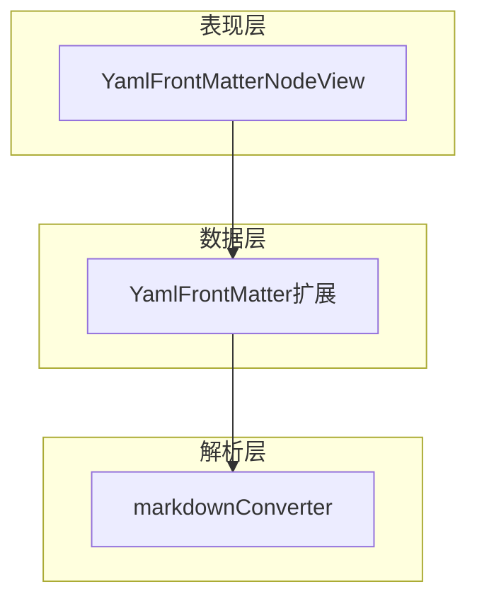
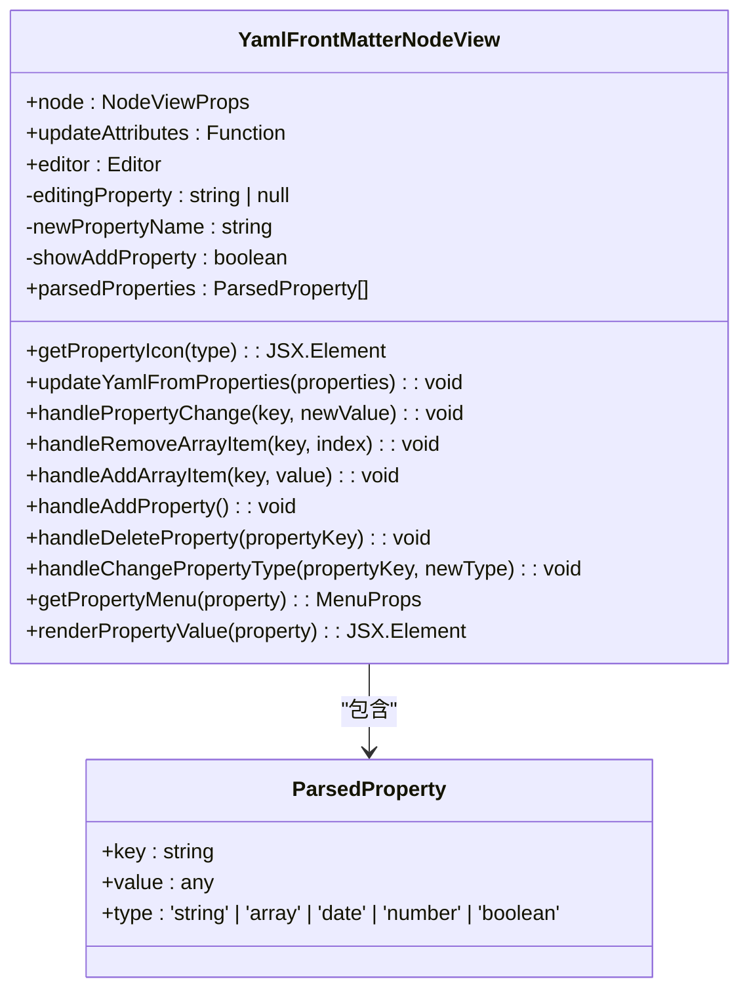
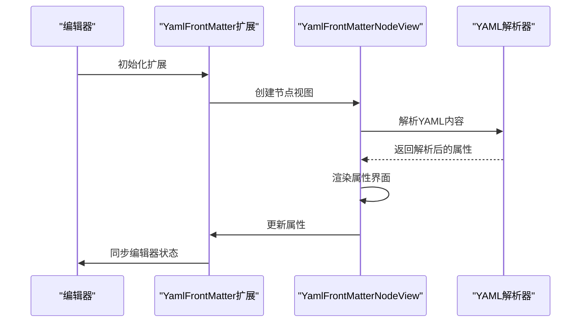
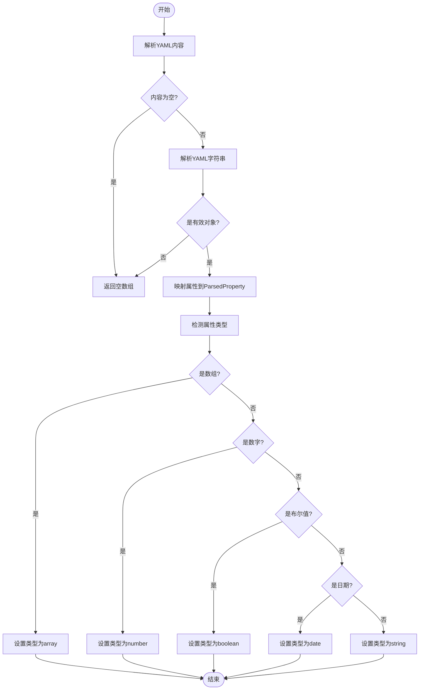
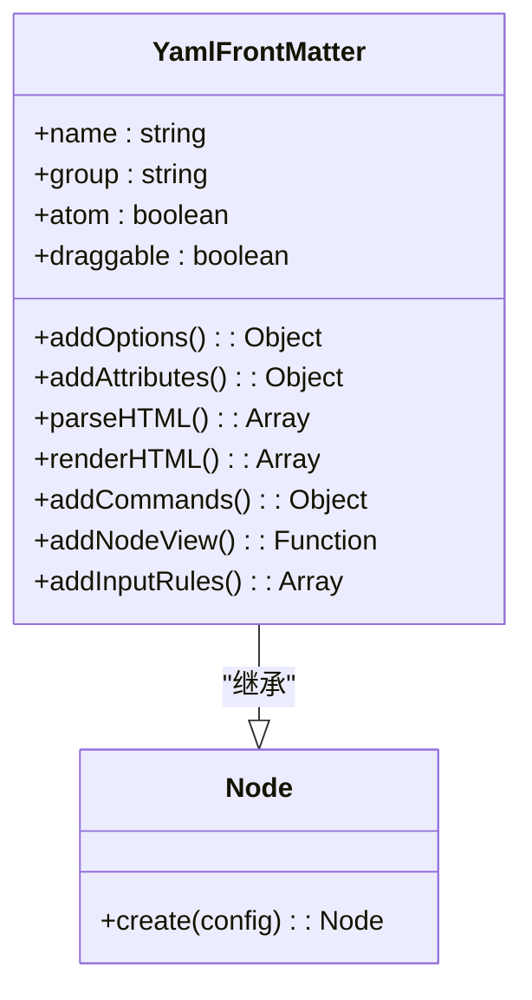
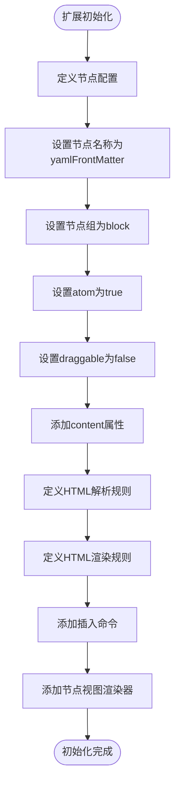

# YAML前置元数据

<cite>
**本文档引用的文件**
- [YamlFrontMatterNodeView.tsx](file://src/renderer/src/components/RichEditor/components/YamlFrontMatterNodeView.tsx)
- [yaml-front-matter.ts](file://src/renderer/src/components/RichEditor/extensions/yaml-front-matter.ts)
- [markdownConverter.ts](file://src/renderer/src/utils/markdownConverter.ts)
- [useRichEditor.ts](file://src/renderer/src/components/RichEditor/useRichEditor.ts)
</cite>

## 目录
1. [简介](#简介)
2. [核心组件](#核心组件)
3. [架构概述](#架构概述)
4. [详细组件分析](#详细组件分析)
5. [依赖分析](#依赖分析)
6. [性能考虑](#性能考虑)
7. [故障排除指南](#故障排除指南)
8. [结论](#结论)

## 简介
YAML前置元数据插件为文档编辑器提供了强大的元数据管理功能。该插件允许用户在文档开头使用YAML格式定义结构化元数据，支持多种数据类型（字符串、数字、布尔值、日期和数组）的解析与渲染。通过直观的图形界面，用户可以轻松地编辑、验证和管理文档元数据，提升内容组织和信息管理的效率。

## 核心组件
YAML前置元数据功能由多个核心组件构成，包括解析器、渲染器和编辑器视图。这些组件协同工作，实现了从YAML文本到可视化编辑界面的转换，以及从用户交互到YAML文本的反向更新。系统支持元数据模式定义、默认值处理和错误校验，确保数据的完整性和一致性。

**文档来源**
- [YamlFrontMatterNodeView.tsx](file://src/renderer/src/components/RichEditor/components/YamlFrontMatterNodeView.tsx#L1-L774)
- [yaml-front-matter.ts](file://src/renderer/src/components/RichEditor/extensions/yaml-front-matter.ts#L1-L101)
- [markdownConverter.ts](file://src/renderer/src/utils/markdownConverter.ts#L280-L386)

## 架构概述
YAML前置元数据插件采用分层架构设计，分为解析层、数据层和表现层。解析层负责识别和解析YAML格式的元数据；数据层管理元数据的结构化表示和状态；表现层提供用户友好的编辑界面。这种架构确保了功能的模块化和可维护性。



**图表来源**
- [YamlFrontMatterNodeView.tsx](file://src/renderer/src/components/RichEditor/components/YamlFrontMatterNodeView.tsx#L1-L774)
- [yaml-front-matter.ts](file://src/renderer/src/components/RichEditor/extensions/yaml-front-matter.ts#L1-L101)
- [markdownConverter.ts](file://src/renderer/src/utils/markdownConverter.ts#L280-L386)

## 详细组件分析

### YAML前置元数据节点视图分析
YamlFrontMatterNodeView组件实现了YAML元数据的可视化编辑功能。它提供了一个交互式界面，允许用户添加、编辑和删除元数据属性。每个属性都有相应的图标表示其数据类型，并支持上下文菜单进行类型转换和删除操作。

#### 对象导向组件


**图表来源**
- [YamlFrontMatterNodeView.tsx](file://src/renderer/src/components/RichEditor/components/YamlFrontMatterNodeView.tsx#L1-L774)

#### API/服务组件


**图表来源**
- [yaml-front-matter.ts](file://src/renderer/src/components/RichEditor/extensions/yaml-front-matter.ts#L1-L101)
- [YamlFrontMatterNodeView.tsx](file://src/renderer/src/components/RichEditor/components/YamlFrontMatterNodeView.tsx#L1-L774)

#### 复杂逻辑组件


**图表来源**
- [YamlFrontMatterNodeView.tsx](file://src/renderer/src/components/RichEditor/components/YamlFrontMatterNodeView.tsx#L28-L57)

**文档来源**
- [YamlFrontMatterNodeView.tsx](file://src/renderer/src/components/RichEditor/components/YamlFrontMatterNodeView.tsx#L1-L774)

### YAML前置元数据扩展分析
YamlFrontMatter扩展是连接编辑器和节点视图的桥梁。它定义了YAML前置元数据的节点类型、属性和命令，确保元数据在编辑器中的正确处理和存储。

#### 对象导向组件


**图表来源**
- [yaml-front-matter.ts](file://src/renderer/src/components/RichEditor/extensions/yaml-front-matter.ts#L1-L101)

#### 复杂逻辑组件


**图表来源**
- [yaml-front-matter.ts](file://src/renderer/src/components/RichEditor/extensions/yaml-front-matter.ts#L14-L95)

**文档来源**
- [yaml-front-matter.ts](file://src/renderer/src/components/RichEditor/extensions/yaml-front-matter.ts#L1-L101)

## 依赖分析
YAML前置元数据插件依赖于多个外部库和内部组件。主要依赖包括yaml库用于YAML解析和序列化，@tiptap系列库提供富文本编辑器基础功能，antd提供UI组件，lucide-react提供图标。这些依赖确保了插件功能的完整性和用户体验的流畅性。

```mermaid
graph LR
A[YamlFrontMatter] --> B[yaml]
A --> C[@tiptap/core]
A --> D[@tiptap/react]
A --> E[antd]
A --> F[lucide-react]
A --> G[styled-components]
A --> H[react-i18next]
```

**图表来源**
- [YamlFrontMatterNodeView.tsx](file://src/renderer/src/components/RichEditor/components/YamlFrontMatterNodeView.tsx#L1-L8)
- [yaml-front-matter.ts](file://src/renderer/src/components/RichEditor/extensions/yaml-front-matter.ts#L1-L4)

**文档来源**
- [YamlFrontMatterNodeView.tsx](file://src/renderer/src/components/RichEditor/components/YamlFrontMatterNodeView.tsx#L1-L774)
- [yaml-front-matter.ts](file://src/renderer/src/components/RichEditor/extensions/yaml-front-matter.ts#L1-L101)

## 性能考虑
YAML前置元数据插件在性能方面进行了优化，确保在处理大型文档时仍能保持流畅的用户体验。通过使用useMemo和useCallback等React Hooks，避免了不必要的重新渲染和函数创建。YAML解析和序列化操作被限制在必要的时候执行，减少了计算开销。此外，错误处理机制确保了即使在解析失败的情况下，编辑器也能正常工作。

## 故障排除指南
当YAML前置元数据功能出现问题时，可以参考以下常见问题的解决方案：

1. **YAML内容无法解析**：检查YAML语法是否正确，确保使用正确的缩进和格式。
2. **元数据不显示**：确认文档开头是否有正确的YAML分隔符（---）。
3. **编辑器卡顿**：如果文档包含大量元数据，尝试减少属性数量或优化数据结构。
4. **类型检测错误**：确保日期格式符合YYYY-MM-DD标准，数字和布尔值使用正确的格式。

**文档来源**
- [YamlFrontMatterNodeView.tsx](file://src/renderer/src/components/RichEditor/components/YamlFrontMatterNodeView.tsx#L53-L56)
- [markdownConverter.ts](file://src/renderer/src/utils/markdownConverter.ts#L324-L326)

## 结论
YAML前置元数据插件为文档编辑器提供了强大而灵活的元数据管理功能。通过直观的用户界面和稳健的技术实现，它极大地提升了内容组织和信息管理的效率。该插件的设计考虑了易用性、性能和可维护性，为用户提供了一个可靠的元数据管理解决方案。未来可以进一步扩展功能，如支持自定义元数据模式和验证规则，以满足更复杂的应用场景需求。