# 代码块高亮插件架构设计文档

<cite>
**本文档引用的文件**
- [shikijsPlugin.ts](file://src/renderer/src/components/RichEditor/extensions/code-block-shiki/shikijsPlugin.ts)
- [code-block-shiki.ts](file://src/renderer/src/components/RichEditor/extensions/code-block-shiki/code-block-shiki.ts)
- [CodeBlockNodeView.tsx](file://src/renderer/src/components/RichEditor/extensions/code-block-shiki/CodeBlockNodeView.tsx)
- [shiki.ts](file://src/renderer/src/utils/shiki.ts)
- [ShikiStreamService.ts](file://src/renderer/src/services/ShikiStreamService.ts)
- [ShikiStreamTokenizer.ts](file://src/renderer/src/services/ShikiStreamTokenizer.ts)
- [shiki-stream.worker.ts](file://src/renderer/src/workers/shiki-stream.worker.ts)
- [index.ts](file://src/renderer/src/components/RichEditor/extensions/code-block-shiki/index.ts)
</cite>

## 目录
1. [概述](#概述)
2. [系统架构](#系统架构)
3. [核心组件分析](#核心组件分析)
4. [Shiki语法高亮引擎集成](#shiki语法高亮引擎集成)
5. [CodeBlockNodeView渲染机制](#codeblocknodeview渲染机制)
6. [异步语法分析与主题管理](#异步语法分析与主题管理)
7. [性能优化策略](#性能优化策略)
8. [配置选项与扩展性](#配置选项与扩展性)
9. [支持的语言列表](#支持的语言列表)
10. [自定义主题实现](#自定义主题实现)
11. [故障排除指南](#故障排除指南)
12. [总结](#总结)

## 概述

代码块高亮插件是Cherry Studio中一个重要的编辑器扩展，基于Shiki语法高亮引擎构建，为Markdown编辑器提供了强大的代码语法高亮功能。该插件采用模块化架构设计，支持多种编程语言的语法高亮、实时主题切换、流式代码处理以及高性能的异步渲染机制。

### 主要特性

- **多语言支持**：内置大量编程语言语法高亮规则
- **主题系统**：支持多种预设主题和自定义主题
- **流式处理**：基于Worker的异步高亮处理
- **实时渲染**：ProseMirror插件驱动的实时语法高亮
- **性能优化**：LRU缓存和增量处理机制
- **可扩展性**：支持动态语言和主题加载

## 系统架构

代码块高亮插件采用分层架构设计，从底层的Shiki引擎到顶层的React组件，形成了完整的语法高亮生态系统。

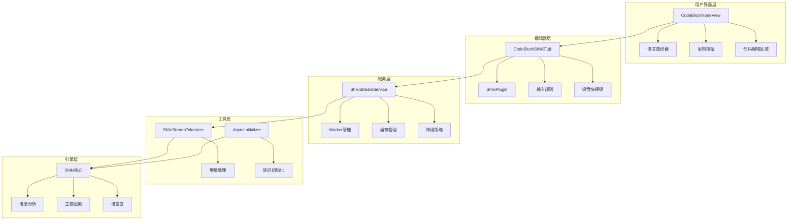

**图表来源**
- [CodeBlockNodeView.tsx](file://src/renderer/src/components/RichEditor/extensions/code-block-shiki/CodeBlockNodeView.tsx#L8-L89)
- [code-block-shiki.ts](file://src/renderer/src/components/RichEditor/extensions/code-block-shiki/code-block-shiki.ts#L12-L144)
- [ShikiStreamService.ts](file://src/renderer/src/services/ShikiStreamService.ts#L64-L550)

## 核心组件分析

### CodeBlockShiki扩展

CodeBlockShiki是整个插件的核心扩展，继承自@tiptap/extension-code-block，提供了完整的代码块功能。

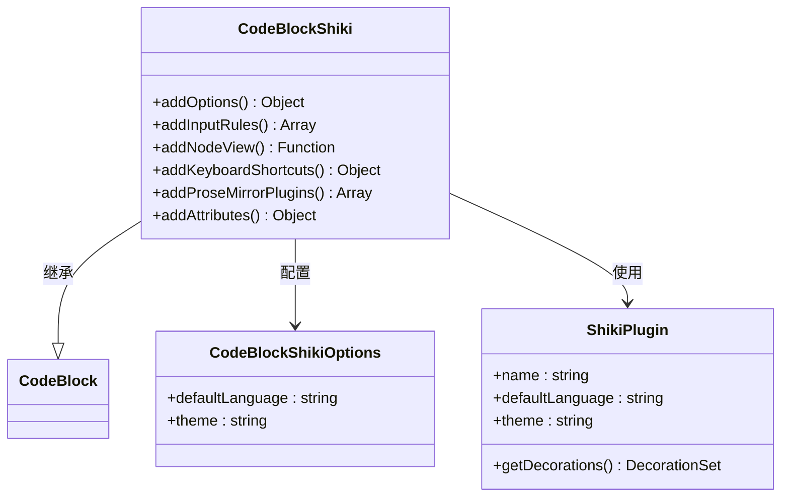

**图表来源**
- [code-block-shiki.ts](file://src/renderer/src/components/RichEditor/extensions/code-block-shiki/code-block-shiki.ts#L8-L11)
- [shikijsPlugin.ts](file://src/renderer/src/components/RichEditor/extensions/code-block-shiki/shikijsPlugin.ts#L86-L94)

**章节来源**
- [code-block-shiki.ts](file://src/renderer/src/components/RichEditor/extensions/code-block-shiki/code-block-shiki.ts#L12-L144)

### ShikiPlugin语法高亮插件

ShikiPlugin是负责语法高亮渲染的核心ProseMirror插件，通过装饰器系统实现实时语法高亮。

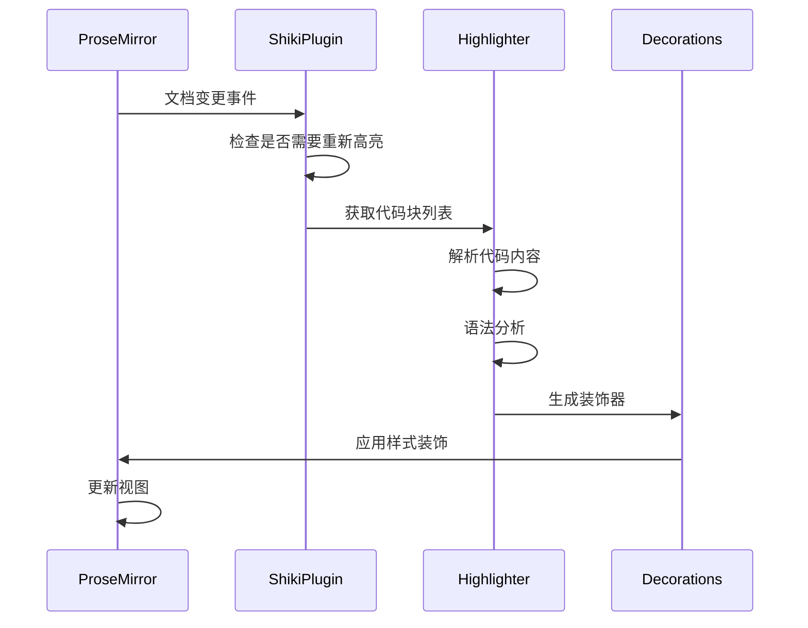

**图表来源**
- [shikijsPlugin.ts](file://src/renderer/src/components/RichEditor/extensions/code-block-shiki/shikijsPlugin.ts#L17-L84)

**章节来源**
- [shikijsPlugin.ts](file://src/renderer/src/components/RichEditor/extensions/code-block-shiki/shikijsPlugin.ts#L86-L250)

## Shiki语法高亮引擎集成

### 引擎初始化与管理

Shiki引擎采用延迟初始化和单例管理模式，确保资源的有效利用。

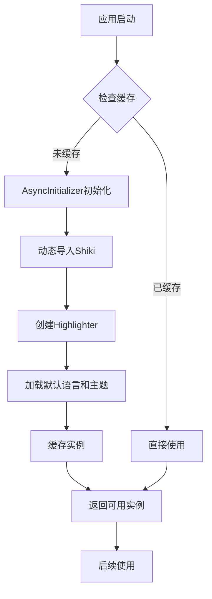

**图表来源**
- [shiki.ts](file://src/renderer/src/utils/shiki.ts#L16-L44)

### 语言和主题加载机制

插件支持动态加载语言和主题，提供智能的降级策略。

| 加载类型 | 加载方式 | 降级策略 | 缓存机制 |
|---------|---------|---------|---------|
| 内置语言 | 静态导入 | 回退到text | LRU缓存 |
| 外部语言 | 动态导入 | 回退到text | LRU缓存 |
| 内置主题 | 静态导入 | 回退到one-light | LRU缓存 |
| 外部主题 | 动态导入 | 回退到one-light | LRU缓存 |

**章节来源**
- [shiki.ts](file://src/renderer/src/utils/shiki.ts#L46-L102)

## CodeBlockNodeView渲染机制

### React组件架构

CodeBlockNodeView是一个React组件，负责代码块的可视化渲染和用户交互。

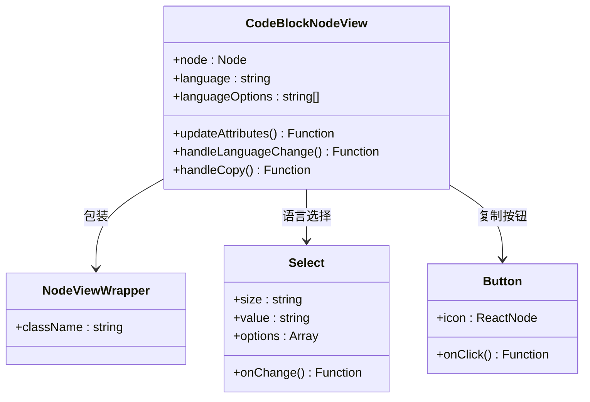

**图表来源**
- [CodeBlockNodeView.tsx](file://src/renderer/src/components/RichEditor/extensions/code-block-shiki/CodeBlockNodeView.tsx#L8-L89)

### 语言选项动态加载

组件在初始化时动态加载可用的语言选项，确保支持所有已加载的语言。

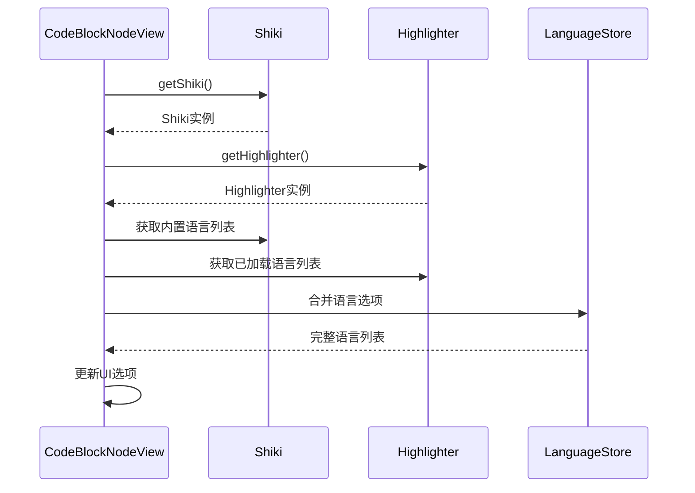

**图表来源**
- [CodeBlockNodeView.tsx](file://src/renderer/src/components/RichEditor/extensions/code-block-shiki/CodeBlockNodeView.tsx#L16-L37)

**章节来源**
- [CodeBlockNodeView.tsx](file://src/renderer/src/components/RichEditor/extensions/code-block-shiki/CodeBlockNodeView.tsx#L8-L89)

## 异步语法分析与主题管理

### ShikiStreamService架构

ShikiStreamService是插件的核心服务，实现了基于Worker的异步语法高亮处理。

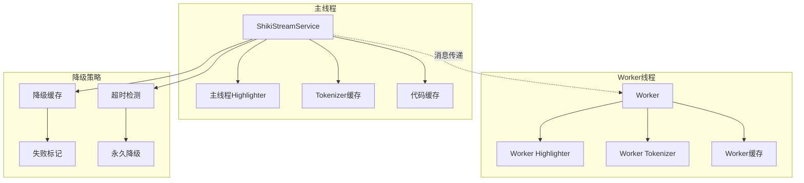

**图表来源**
- [ShikiStreamService.ts](file://src/renderer/src/services/ShikiStreamService.ts#L64-L550)

### 流式处理机制

插件采用增量处理算法，只处理新增或修改的代码块部分。

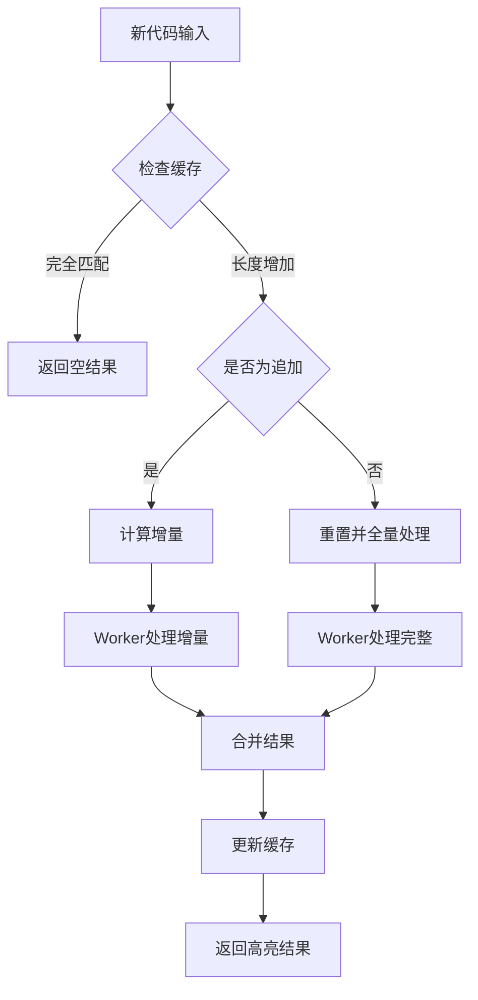

**图表来源**
- [ShikiStreamService.ts](file://src/renderer/src/services/ShikiStreamService.ts#L312-L362)

### 主题管理策略

主题管理系统支持动态加载和智能降级。

| 主题类型 | 加载方式 | 降级目标 | 错误处理 |
|---------|---------|---------|---------|
| 内置主题 | 静态导入 | one-light | 记录日志 |
| 外部主题 | 动态导入 | one-light | 永久降级 |
| 自定义主题 | 动态导入 | one-light | 永久降级 |

**章节来源**
- [ShikiStreamService.ts](file://src/renderer/src/services/ShikiStreamService.ts#L312-L419)

## 性能优化策略

### 缓存机制

插件实现了多层次的缓存策略来提升性能：

1. **LRU缓存**：限制最大缓存数量，自动淘汰最久未使用的项目
2. **TTL过期**：设置合理的过期时间，平衡内存使用和性能
3. **增量处理**：只处理变化的部分，避免全量重新计算

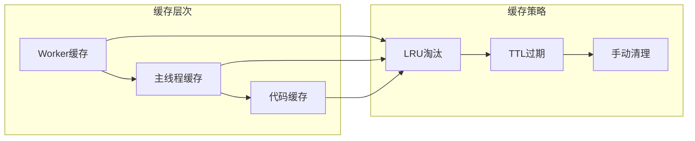

**图表来源**
- [ShikiStreamService.ts](file://src/renderer/src/services/ShikiStreamService.ts#L17-L39)

### Worker并行处理

对于复杂的语法高亮任务，插件会自动使用Web Worker进行并行处理。

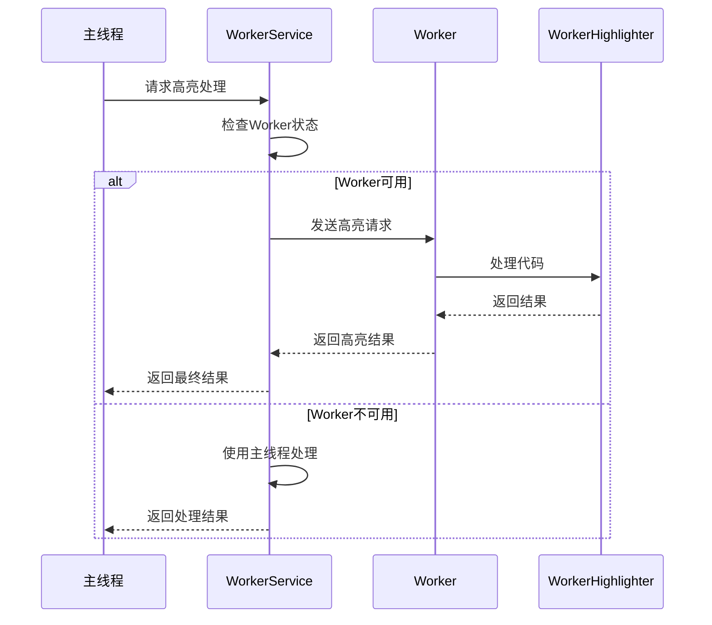

**图表来源**
- [ShikiStreamService.ts](file://src/renderer/src/services/ShikiStreamService.ts#L364-L419)

### 降级策略

当Worker处理失败时，插件会自动降级到主线程处理，并记录失败的调用者ID以避免重复失败。

**章节来源**
- [ShikiStreamService.ts](file://src/renderer/src/services/ShikiStreamService.ts#L381-L419)

## 配置选项与扩展性

### 基础配置

CodeBlockShiki扩展提供了丰富的配置选项：

| 配置项 | 类型 | 默认值 | 描述 |
|-------|------|--------|------|
| defaultLanguage | string | 'text' | 默认编程语言 |
| theme | string | 'one-light' | 默认主题 |
| languageClassPrefix | string | 'language-' | 语言类前缀 |
| exitOnTripleEnter | boolean | true | 三连击退出 |
| exitOnArrowDown | boolean | true | 向下箭头退出 |
| HTMLAttributes | object | {} | HTML属性 |

**章节来源**
- [code-block-shiki.ts](file://src/renderer/src/components/RichEditor/extensions/code-block-shiki/code-block-shiki.ts#L13-L24)

### 输入规则支持

插件支持多种代码块语法：

- ```语言名 语法（GitHub风格）
- ~~~语言名 语法（传统风格）

```mermaid
flowchart TD
A[用户输入] --> B{检测语法}
B --> |
```| C[GitHub语法规则]
    B -->|~~~| D[传统语法规则]
    C --> E[提取语言信息]
    D --> E
    E --> F[创建代码块节点]
    F --> G[应用语言属性]
```

**图表来源**
- [code-block-shiki.ts](file://src/renderer/src/components/RichEditor/extensions/code-block-shiki/code-block-shiki.ts#L27-L52)

### 键盘快捷键

插件提供了智能的键盘快捷键支持：

- **Tab键**：插入两个空格缩进
- **Shift+Tab**：移除两个字符的缩进
- **Enter键**：自动延续当前行的缩进

**章节来源**
- [code-block-shiki.ts](file://src/renderer/src/components/RichEditor/extensions/code-block-shiki/code-block-shiki.ts#L59-L93)

## 支持的语言列表

### 内置语言支持

插件基于Shiki的核心语言包，支持以下编程语言：

- **JavaScript/TypeScript**：现代Web开发语言
- **Python**：数据科学和脚本语言
- **Java**：企业级应用语言
- **Markdown**：文档标记语言
- **JSON**：数据交换格式
- **HTML/CSS**：前端开发语言
- **SQL**：数据库查询语言
- **Shell/Bash**：系统脚本语言

### 动态语言加载

插件支持动态加载新的编程语言，通过语言检测和自动加载机制。

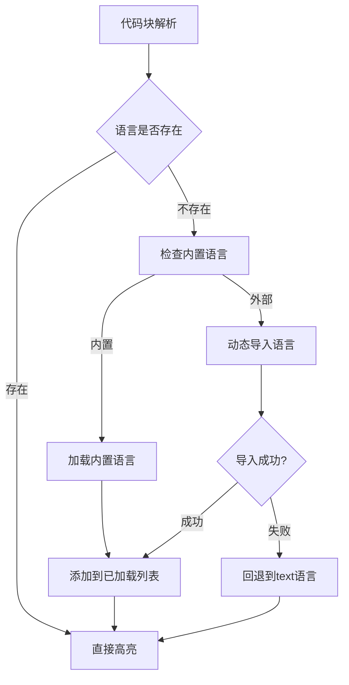

**图表来源**
- [shiki.ts](file://src/renderer/src/utils/shiki.ts#L52-L74)

**章节来源**
- [shiki.ts](file://src/renderer/src/utils/shiki.ts#L8-L10)

## 自定义主题实现

### 主题加载机制

插件支持自定义主题的动态加载和应用。

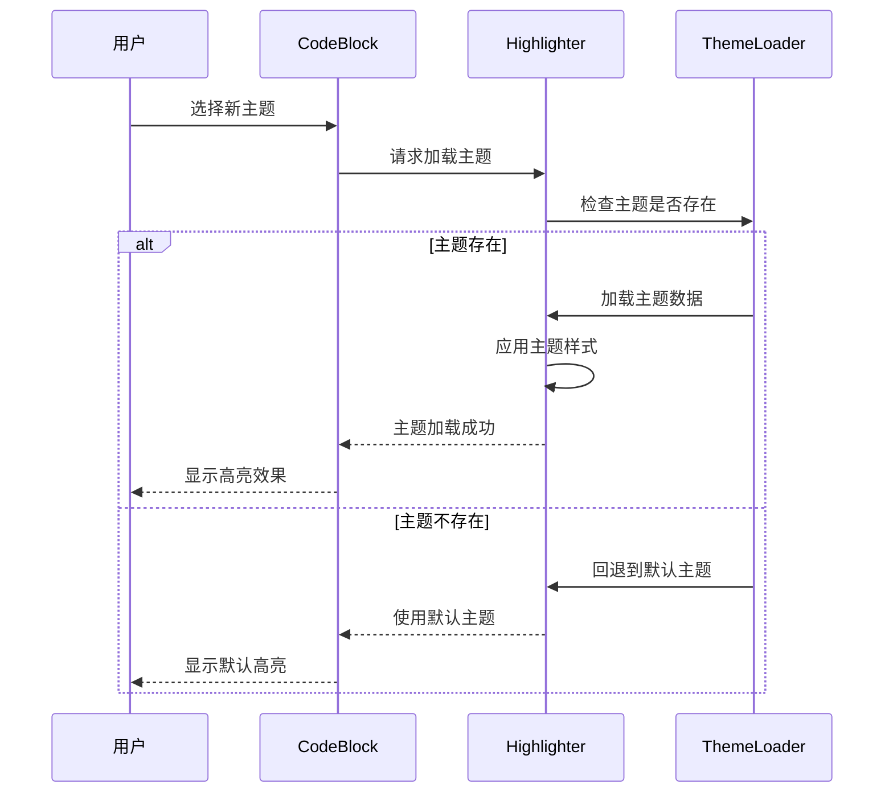

**图表来源**
- [shiki.ts](file://src/renderer/src/utils/shiki.ts#L77-L102)

### 主题样式转换

插件提供了将Shiki token样式转换为React样式对象的机制。

| Shiki属性 | React样式属性 | 示例值 |
|----------|-------------|--------|
| font-style | fontStyle | italic |
| font-weight | fontWeight | bold |
| background-color | backgroundColor | #ffffff |
| text-decoration | textDecoration | underline |

**章节来源**
- [shiki.ts](file://src/renderer/src/utils/shiki.ts#L104-L132)

### 主题持久化

主题设置可以通过配置系统持久化存储，确保用户偏好的一致性。

## 故障排除指南

### 常见问题及解决方案

#### 1. 语法高亮不生效

**可能原因**：
- 语言包未正确加载
- 主题加载失败
- Worker初始化失败

**解决步骤**：
1. 检查浏览器控制台错误信息
2. 验证网络连接和资源加载
3. 尝试刷新页面重新初始化

#### 2. 性能问题

**可能原因**：
- 代码块过大
- Worker频繁失败
- 缓存配置不当

**优化建议**：
1. 减少单个代码块的大小
2. 检查Worker状态
3. 调整缓存配置参数

#### 3. 主题显示异常

**可能原因**：
- 主题文件损坏
- CSS样式冲突
- 浏览器兼容性问题

**解决方法**：
1. 重置为主题默认设置
2. 检查CSS优先级
3. 更新浏览器版本

### 调试工具

插件提供了详细的日志记录功能，可以通过浏览器开发者工具查看调试信息。

**章节来源**
- [shikijsPlugin.ts](file://src/renderer/src/components/RichEditor/extensions/code-block-shiki/shikijsPlugin.ts#L79-L80)
- [ShikiStreamService.ts](file://src/renderer/src/services/ShikiStreamService.ts#L547-L550)

## 总结

代码块高亮插件是Cherry Studio中一个设计精良的编辑器扩展，它成功地将Shiki语法高亮引擎集成到了ProseMirror编辑器中。通过模块化的架构设计、高效的缓存机制、智能的降级策略和灵活的配置选项，该插件为用户提供了优秀的代码编辑体验。

### 技术亮点

1. **异步处理架构**：基于Worker的并行处理确保了大型代码块的流畅渲染
2. **智能缓存策略**：多层次的缓存机制显著提升了性能表现
3. **优雅的降级机制**：当高级功能不可用时，能够平滑降级到基础功能
4. **高度可配置性**：丰富的配置选项满足不同用户的个性化需求

### 扩展性评估

该插件的设计充分考虑了未来的扩展需求，无论是添加新的编程语言支持还是自定义主题功能，都能够相对容易地进行扩展和维护。

### 性能表现

通过精心设计的性能优化策略，插件能够在保持良好用户体验的同时，有效控制资源消耗，特别是在处理大型文档和复杂语法结构时表现出色。