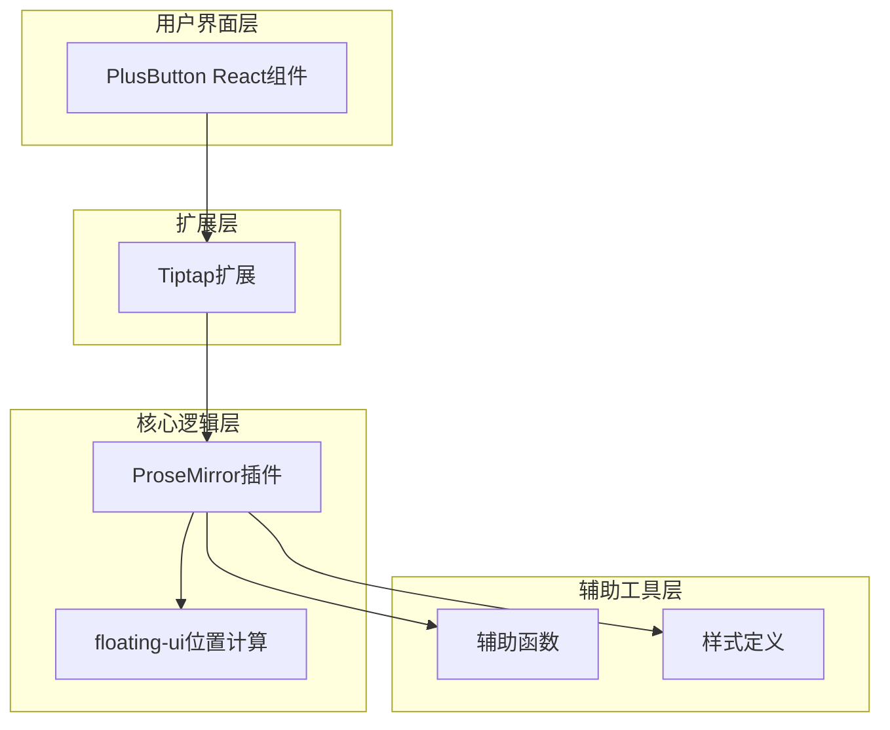
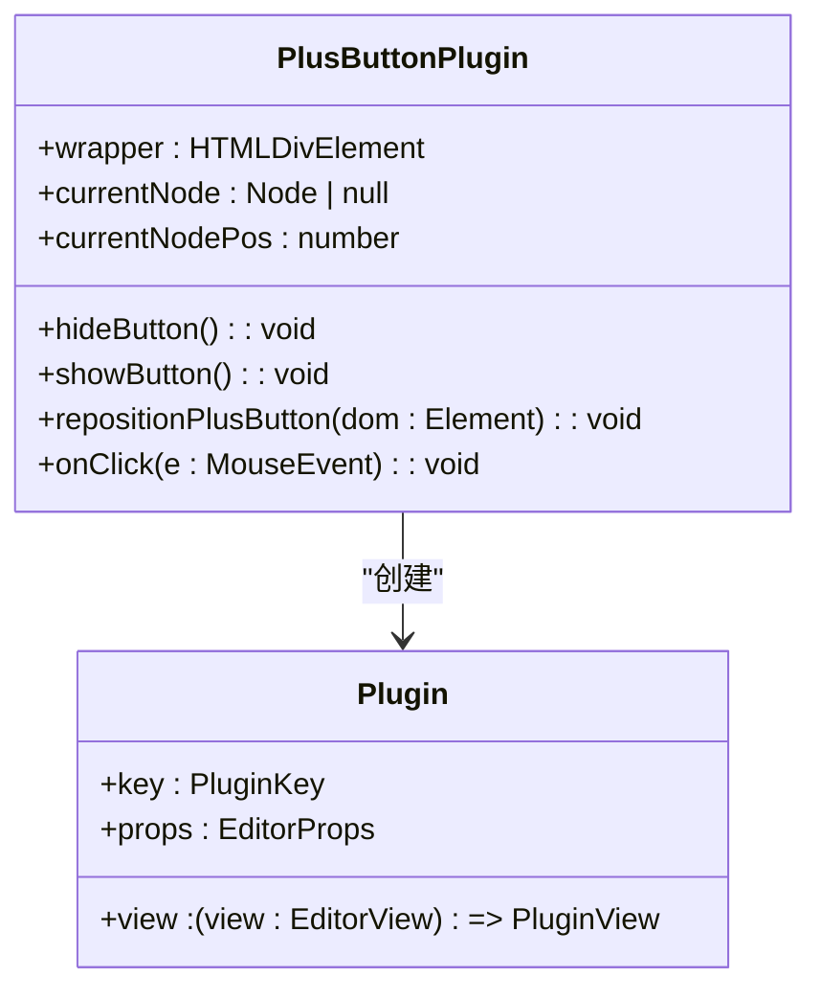
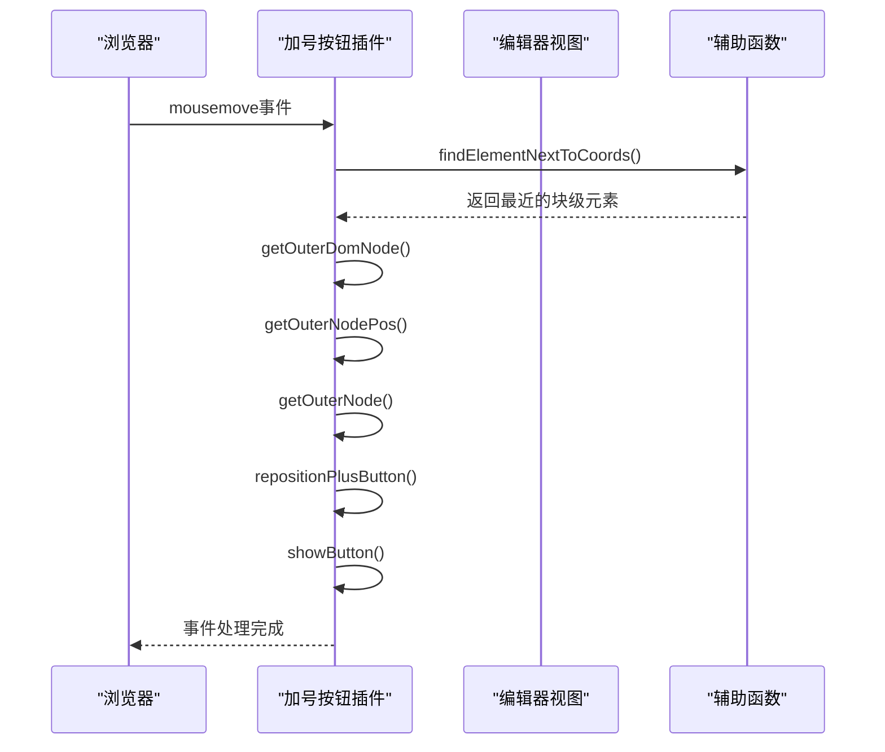
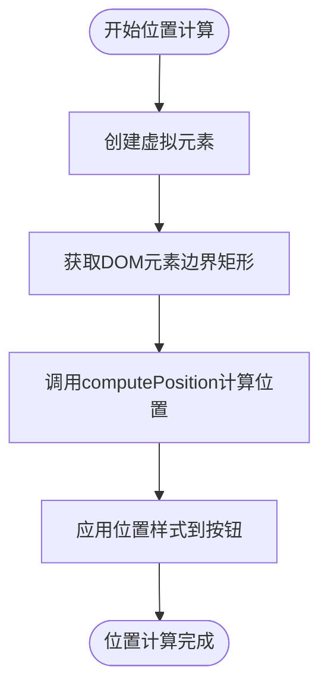
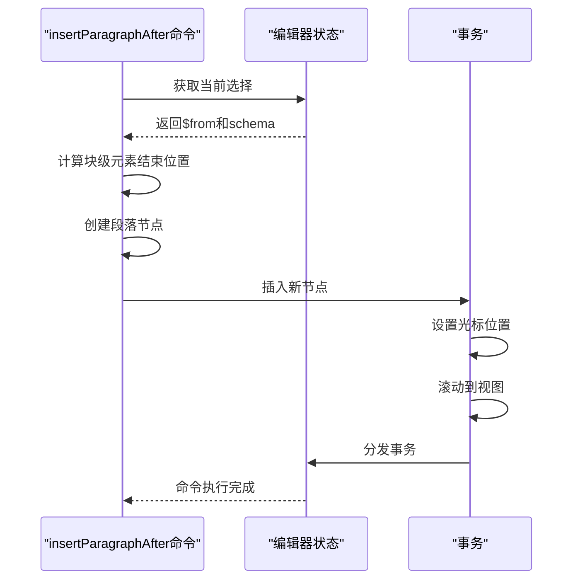
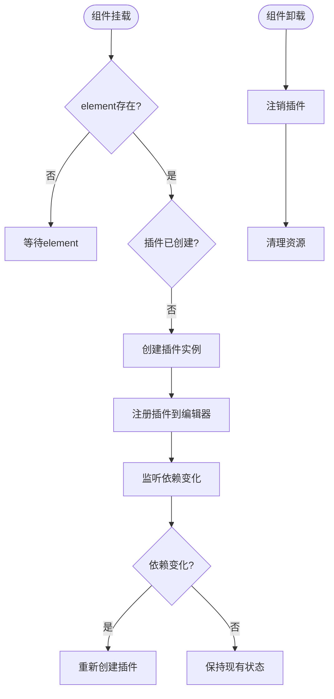

# 加号按钮插件

<cite>
**本文档中引用的文件**   
- [plusButtonPlugin.ts](file://src/renderer/src/components/RichEditor/plugins/plusButtonPlugin.ts)
- [plus-button.ts](file://src/renderer/src/components/RichEditor/extensions/plus-button.ts)
- [PlusButton.tsx](file://src/renderer/src/components/RichEditor/components/PlusButton.tsx)
- [getOutNode.ts](file://src/renderer/src/components/RichEditor/helpers/getOutNode.ts)
- [findNextElementFromCursor.ts](file://src/renderer/src/components/RichEditor/helpers/findNextElementFromCursor.ts)
- [removeNode.ts](file://src/renderer/src/components/RichEditor/helpers/removeNode.ts)
- [styles.ts](file://src/renderer/src/components/RichEditor/styles.ts)
</cite>

## 目录
1. [简介](#简介)
2. [核心组件](#核心组件)
3. [架构概述](#架构概述)
4. [详细组件分析](#详细组件分析)
5. [依赖分析](#依赖分析)
6. [性能考虑](#性能考虑)
7. [故障排除指南](#故障排除指南)
8. [结论](#结论)

## 简介
加号按钮插件是一个基于ProseMirror的富文本编辑器扩展，为用户提供了一种直观的内容插入机制。该插件通过在编辑器块级元素旁边动态显示一个加号按钮，允许用户通过点击按钮来插入新的内容节点。插件实现了复杂的事件处理逻辑，包括鼠标移动检测、位置计算和内容插入，为用户提供流畅的编辑体验。

## 核心组件
加号按钮插件由多个核心组件构成，包括ProseMirror插件实现、Tiptap扩展和React组件。这些组件协同工作，实现了按钮的显示、定位和交互功能。插件通过监听鼠标移动事件来检测用户悬停的块级元素，并使用floating-ui库计算按钮的精确位置。当用户点击加号按钮时，插件会根据配置插入指定类型的内容节点。

**Section sources**
- [plusButtonPlugin.ts](file://src/renderer/src/components/RichEditor/plugins/plusButtonPlugin.ts#L1-L260)
- [plus-button.ts](file://src/renderer/src/components/RichEditor/extensions/plus-button.ts#L1-L96)
- [PlusButton.tsx](file://src/renderer/src/components/RichEditor/components/PlusButton.tsx#L1-L81)

## 架构概述
加号按钮插件采用分层架构设计，将功能划分为不同的组件和模块。插件的核心是ProseMirror插件实现，它负责处理编辑器事件和状态管理。Tiptap扩展层提供了插件的配置接口和命令注册，而React组件层则实现了用户界面的渲染和交互。这种分层设计使得插件具有良好的可维护性和可扩展性。



**Diagram sources **
- [plusButtonPlugin.ts](file://src/renderer/src/components/RichEditor/plugins/plusButtonPlugin.ts#L1-L260)
- [plus-button.ts](file://src/renderer/src/components/RichEditor/extensions/plus-button.ts#L1-L96)
- [PlusButton.tsx](file://src/renderer/src/components/RichEditor/components/PlusButton.tsx#L1-L81)

## 详细组件分析

### 插件实现分析
加号按钮插件的核心实现位于`plusButtonPlugin.ts`文件中，它创建了一个ProseMirror插件，通过事件监听和DOM操作来管理加号按钮的显示和行为。

#### 插件初始化
插件在初始化时创建一个包装器元素，并设置初始状态变量来跟踪当前悬停的节点和位置。插件提供了`hideButton`和`showButton`函数来控制按钮的可见性，这些函数通过修改CSS样式来实现。



**Diagram sources **
- [plusButtonPlugin.ts](file://src/renderer/src/components/RichEditor/plugins/plusButtonPlugin.ts#L1-L260)

#### 事件处理流程
插件通过ProseMirror的`handleDOMEvents`机制注册多个事件处理器，包括`mousemove`、`keydown`、`scroll`和`mouseleave`。`mousemove`事件处理器是核心，它使用`findElementNextToCoords`辅助函数来检测鼠标位置附近的块级元素，并更新按钮的位置和状态。



**Diagram sources **
- [plusButtonPlugin.ts](file://src/renderer/src/components/RichEditor/plugins/plusButtonPlugin.ts#L1-L260)
- [findNextElementFromCursor.ts](file://src/renderer/src/components/RichEditor/helpers/findNextElementFromCursor.ts#L1-L55)
- [getOutNode.ts](file://src/renderer/src/components/RichEditor/helpers/getOutNode.ts#L1-L36)

#### 位置计算机制
插件使用floating-ui库来计算加号按钮的精确位置。`repositionPlusButton`函数创建一个虚拟元素，该元素的边界矩形基于目标块级元素的边界矩形，然后调用`computePosition`函数来计算按钮的最终位置。



**Diagram sources **
- [plusButtonPlugin.ts](file://src/renderer/src/components/RichEditor/plugins/plusButtonPlugin.ts#L77-L89)

### 扩展与命令注册
`plus-button.ts`文件实现了Tiptap扩展，为加号按钮插件提供了配置接口和命令注册功能。

#### 配置选项
扩展定义了`PlusButtonOptions`接口，允许用户自定义按钮的渲染方式、位置计算配置和节点变化回调函数。默认配置使用`defaultComputePositionConfig`对象，该对象指定了按钮的放置位置和定位策略。

```mermaid
classDiagram
class PlusButtonOptions {
+render() : HTMLElement
+computePositionConfig? : ComputePositionConfig
+onNodeChange? : (options : { node : Node | null; editor : Editor; pos : number }) => void
}
class ComputePositionConfig {
+placement : string
+strategy : string
}
PlusButtonOptions --> ComputePositionConfig : "包含"
```

**Diagram sources **
- [plus-button.ts](file://src/renderer/src/components/RichEditor/extensions/plus-button.ts#L1-L96)

#### 命令注册
扩展通过`addCommands`方法注册了`insertParagraphAfter`命令，该命令允许在当前块级元素后插入一个新的段落节点。命令实现使用ProseMirror的事务系统来插入新节点，并设置光标位置。



**Diagram sources **
- [plus-button.ts](file://src/renderer/src/components/RichEditor/extensions/plus-button.ts#L65-L92)

### React组件集成
`PlusButton.tsx`文件实现了React组件，用于在React应用中集成加号按钮插件。

#### 组件生命周期
组件使用React的`useEffect`钩子来管理插件的生命周期。当组件挂载时，它创建插件实例并注册到编辑器；当组件卸载时，它注销插件并清理资源。



**Diagram sources **
- [PlusButton.tsx](file://src/renderer/src/components/RichEditor/components/PlusButton.tsx#L1-L81)

#### 属性传递
组件通过`PlusButtonProps`接口定义了可配置的属性，包括编辑器实例、插件键、点击处理函数、位置计算配置等。组件使用`Omit`和`Optional`类型工具来确保属性的正确传递。

```mermaid
classDiagram
class PlusButtonProps {
+className? : string
+editor : Editor
+pluginKey? : PluginKey | string
+onNodeChange? : (data : { node : Node | null; editor : Editor; pos : number }) => void
+onElementClick? : (event : MouseEvent) => void
+computePositionConfig? : ComputePositionConfig
+children : ReactNode
}
class PlusButtonPluginOptions {
+pluginKey? : PluginKey | string
+editor : Editor
+element : HTMLElement
+insertNodeType? : string
+insertNodeAttrs? : Record<string, any>
+onNodeChange? : (data : { editor : Editor; node : Node | null; pos : number }) => void
+onElementClick? : (event : MouseEvent) => void
+computePositionConfig? : ComputePositionConfig
}
PlusButtonProps --> PlusButtonPluginOptions : "扩展"
```

**Diagram sources **
- [PlusButton.tsx](file://src/renderer/src/components/RichEditor/components/PlusButton.tsx#L1-L81)
- [plusButtonPlugin.ts](file://src/renderer/src/components/RichEditor/plugins/plusButtonPlugin.ts#L1-L260)

## 依赖分析
加号按钮插件依赖于多个外部库和内部模块，这些依赖关系构成了插件的功能基础。

```mermaid
graph LR
A[加号按钮插件] --> B[@tiptap/core]
A --> C[@tiptap/pm/state]
A --> D[@tiptap/pm/view]
A --> E[@floating-ui/dom]
A --> F[findNextElementFromCursor]
A --> G[getOutNode]
A --> H[removeNode]
A --> I[styles]
```

**Diagram sources **
- [plusButtonPlugin.ts](file://src/renderer/src/components/RichEditor/plugins/plusButtonPlugin.ts#L1-L260)
- [plus-button.ts](file://src/renderer/src/components/RichEditor/extensions/plus-button.ts#L1-L96)
- [PlusButton.tsx](file://src/renderer/src/components/RichEditor/components/PlusButton.tsx#L1-L81)

## 性能考虑
加号按钮插件在设计时考虑了性能优化，通过多种机制确保在大型文档中的流畅运行。插件使用了防抖和节流技术来减少不必要的重新定位计算，只有在节点发生变化时才更新按钮位置。此外，插件通过缓存当前节点和位置信息来避免重复的DOM查询和计算。

## 故障排除指南
当加号按钮插件出现问题时，可以检查以下几个常见问题：确保编辑器实例正确传递给组件，验证插件是否已正确注册到编辑器，检查CSS样式是否正确应用，以及确认floating-ui库是否正确加载。如果按钮不显示，可能是由于`mousemove`事件未正确触发或节点检测失败。

**Section sources**
- [plusButtonPlugin.ts](file://src/renderer/src/components/RichEditor/plugins/plusButtonPlugin.ts#L1-L260)
- [PlusButton.tsx](file://src/renderer/src/components/RichEditor/components/PlusButton.tsx#L1-L81)

## 结论
加号按钮插件通过巧妙的架构设计和事件处理机制，为ProseMirror编辑器提供了一个直观的内容插入功能。插件的分层设计使其易于集成和扩展，而详细的配置选项则允许开发者根据具体需求定制插件行为。通过理解插件的实现机制，开发者可以更好地利用其功能，并在需要时进行定制和优化。