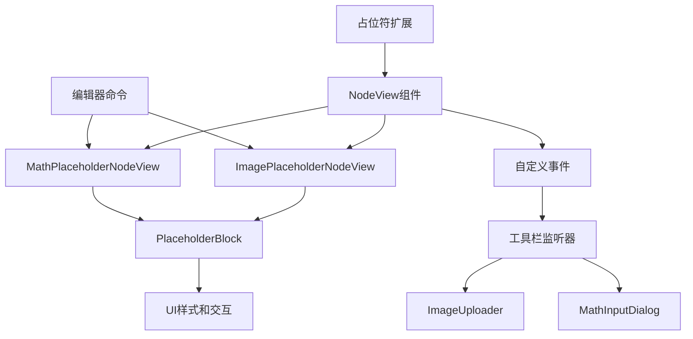
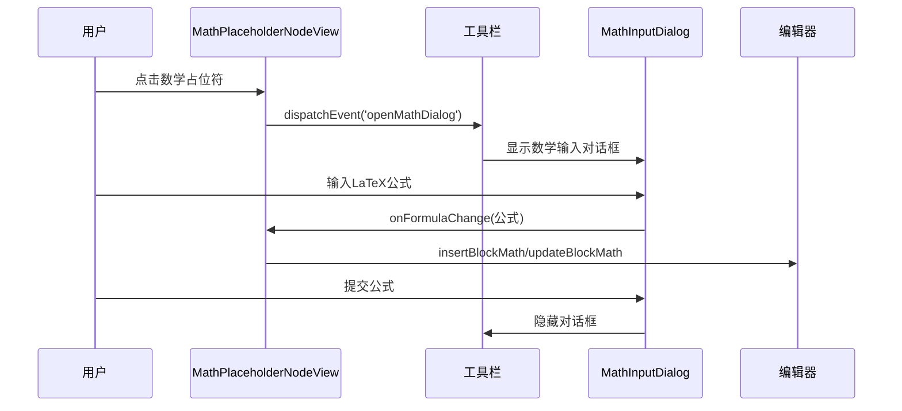
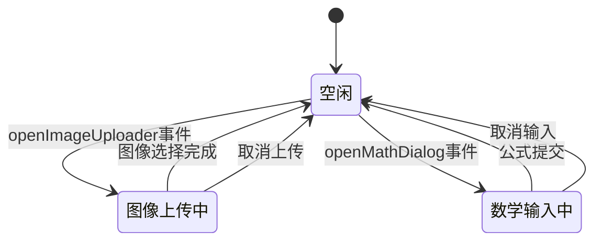
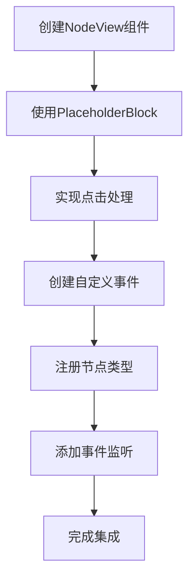

# 占位符插件

<cite>
**本文档引用的文件**   
- [ImagePlaceholderNodeView.tsx](file://src/renderer/src/components/RichEditor/components/placeholder/ImagePlaceholderNodeView.tsx)
- [MathPlaceholderNodeView.tsx](file://src/renderer/src/components/RichEditor/components/placeholder/MathPlaceholderNodeView.tsx)
- [PlaceholderBlock.tsx](file://src/renderer/src/components/RichEditor/components/placeholder/PlaceholderBlock.tsx)
- [enhanced-image.ts](file://src/renderer/src/components/RichEditor/extensions/enhanced-image.ts)
- [enhanced-math.ts](file://src/renderer/src/components/RichEditor/extensions/enhanced-math.ts)
- [toolbar.tsx](file://src/renderer/src/components/RichEditor/toolbar.tsx)
- [MathInputDialog.tsx](file://src/renderer/src/components/RichEditor/components/MathInputDialog.tsx)
</cite>

## 目录
1. [简介](#简介)
2. [占位符系统架构](#占位符系统架构)
3. [核心组件](#核心组件)
4. [占位符状态管理](#占位符状态管理)
5. [加载指示器和错误处理](#加载指示器和错误处理)
6. [开发指南](#开发指南)
7. [结论](#结论)

## 简介
占位符插件系统是Cherry Studio富文本编辑器的核心功能之一，为特殊内容节点（如图像和数学公式）提供直观的交互式占位符。该系统通过可重用的UI组件和清晰的事件驱动架构，实现了用户友好的内容插入体验。当用户需要插入图像或数学公式时，系统会显示一个带有图标和提示文本的占位符块，用户点击后即可触发相应的输入流程。

**Section sources**
- [ImagePlaceholderNodeView.tsx](file://src/renderer/src/components/RichEditor/components/placeholder/ImagePlaceholderNodeView.tsx#L1-L48)
- [MathPlaceholderNodeView.tsx](file://src/renderer/src/components/RichEditor/components/placeholder/MathPlaceholderNodeView.tsx#L1-L75)

## 占位符系统架构
占位符插件系统采用模块化架构，由多个协同工作的组件构成。系统核心是Tiptap编辑器的NodeView机制，它允许在编辑器中渲染自定义的React组件。每个占位符类型（如图像和数学公式）都有一个对应的NodeView组件，这些组件共享一个通用的`PlaceholderBlock`UI组件来确保视觉一致性。

系统通过自定义DOM事件在不同组件间进行通信，实现了关注点分离。当用户与占位符交互时，NodeView组件会触发自定义事件，由工具栏组件监听并处理这些事件，从而显示相应的输入对话框。这种架构避免了组件间的直接依赖，提高了系统的可维护性和可扩展性。

**Diagram sources**
- [enhanced-image.ts](file://src/renderer/src/components/RichEditor/extensions/enhanced-image.ts#L75-L125)
- [enhanced-math.ts](file://src/renderer/src/components/RichEditor/extensions/enhanced-math.ts#L76-L124)
- [toolbar.tsx](file://src/renderer/src/components/RichEditor/toolbar.tsx#L95-L123)

## 核心组件

### ImagePlaceholderNodeView实现机制
`ImagePlaceholderNodeView`是图像占位符的视图组件，负责渲染图像插入的占位符UI并处理用户交互。该组件使用Tiptap的NodeViewWrapper来包装自定义的React组件，使其能够作为编辑器节点的一部分进行渲染。

当用户点击占位符时，组件会创建一个名为`openImageUploader`的自定义DOM事件，并通过`window.dispatchEvent`将其分发。事件的`detail`对象包含`onImageSelect`和`onCancel`回调函数，这些回调在占位符被删除的同时，将图像URL插入到编辑器中。这种设计确保了占位符在内容插入后自动消失，提供了流畅的用户体验。

**Section sources**
- [ImagePlaceholderNodeView.tsx](file://src/renderer/src/components/RichEditor/components/placeholder/ImagePlaceholderNodeView.tsx#L1-L48)
- [enhanced-image.ts](file://src/renderer/src/components/RichEditor/extensions/enhanced-image.ts#L75-L125)

### MathPlaceholderNodeView实现机制
`MathPlaceholderNodeView`是数学公式占位符的视图组件，其架构与图像占位符类似，但处理逻辑更为复杂。除了基本的插入功能外，该组件还支持公式的实时预览和更新。当用户点击占位符时，组件会创建一个名为`openMathDialog`的自定义事件。

事件的`detail`对象包含三个关键回调：`onSubmit`、`onCancel`和`onFormulaChange`。`onFormulaChange`回调特别重要，它允许在用户输入公式时实时更新预览，而无需关闭对话框。组件通过`hasCreatedMath`标志来区分是首次插入还是更新现有公式，从而正确调用`insertBlockMath`或`updateBlockMath`编辑器命令。

**Diagram sources**
- [MathPlaceholderNodeView.tsx](file://src/renderer/src/components/RichEditor/components/placeholder/MathPlaceholderNodeView.tsx#L8-L75)
- [toolbar.tsx](file://src/renderer/src/components/RichEditor/toolbar.tsx#L97-L108)
- [MathInputDialog.tsx](file://src/renderer/src/components/RichEditor/components/MathInputDialog.tsx#L28-L46)

### PlaceholderBlock可重用组件
`PlaceholderBlock`是一个可重用的UI组件，为所有类型的占位符提供一致的视觉外观和交互行为。该组件接收图标、消息文本和点击处理函数作为props，并根据当前主题（明暗模式）自动调整颜色。

组件实现了悬停反馈效果，当用户将鼠标悬停在占位符上时，边框和背景颜色会动态变化，提供视觉反馈。样式通过内联CSS实现，包括虚线边框、圆角、内边距和居中对齐的布局。这种设计确保了占位符在编辑器中清晰可见，同时保持了简洁美观的外观。

**Section sources**
- [PlaceholderBlock.tsx](file://src/renderer/src/components/RichEditor/components/placeholder/PlaceholderBlock.tsx#L1-L63)

## 占位符状态管理
占位符系统通过事件驱动的状态管理机制来协调不同组件之间的交互。工具栏组件使用`useState`钩子维护占位符相关的回调函数和状态，包括`onImageSelect`、`onMathSubmit`和位置信息等。

当接收到`openImageUploader`或`openMathDialog`事件时，工具栏会更新其状态并显示相应的输入组件。这种状态管理方式确保了同一时间只有一个占位符操作处于活动状态，避免了多个对话框同时出现的混乱情况。状态在操作完成后自动重置，保证了系统的稳定性和可预测性。

**Diagram sources**
- [toolbar.tsx](file://src/renderer/src/components/RichEditor/toolbar.tsx#L85-L93)

## 加载指示器和错误处理
占位符系统通过清晰的错误处理流程确保用户体验的健壮性。当用户取消操作或输入为空时，系统会自动删除占位符节点，保持编辑器内容的整洁。对于数学公式，系统在`onSubmit`回调中检查公式是否为空，仅在为空时删除占位符。

虽然当前代码中没有显式的加载指示器，但系统架构支持在未来的扩展中添加。例如，可以在`onImageSelect`回调中添加加载状态，在图像上传过程中显示进度指示器。错误处理主要通过回调函数实现，`onCancel`回调确保无论何种原因取消操作，占位符都会被正确清理。

**Section sources**
- [ImagePlaceholderNodeView.tsx](file://src/renderer/src/components/RichEditor/components/placeholder/ImagePlaceholderNodeView.tsx#L20-L34)
- [MathPlaceholderNodeView.tsx](file://src/renderer/src/components/RichEditor/components/placeholder/MathPlaceholderNodeView.tsx#L30-L37)

## 开发指南

### 创建新的占位符类型
要创建新的占位符类型，需要遵循以下步骤：

1. 创建新的NodeView组件，类似于`ImagePlaceholderNodeView`或`MathPlaceholderNodeView`
2. 在组件中使用`PlaceholderBlock`作为基础UI
3. 实现点击处理逻辑，创建自定义DOM事件
4. 在相应的Tiptap扩展中注册新的节点类型
5. 在工具栏组件中添加事件监听器

**Diagram sources**
- [enhanced-image.ts](file://src/renderer/src/components/RichEditor/extensions/enhanced-image.ts#L75-L125)
- [toolbar.tsx](file://src/renderer/src/components/RichEditor/toolbar.tsx#L95-L123)

### 集成到编辑器
将新的占位符类型集成到编辑器需要修改两个主要文件：扩展文件和工具栏文件。在扩展文件中，使用`Node.create`方法定义新的节点类型，并通过`addNodeView`将其关联到NodeView组件。在工具栏文件中，添加对自定义事件的监听，并在状态中存储相应的回调函数。

集成时需要注意事件命名的唯一性，避免与其他组件冲突。建议使用`open[FeatureName]`的命名约定，如`openImageUploader`和`openMathDialog`。同时，确保在组件卸载时移除事件监听器，防止内存泄漏。

**Section sources**
- [enhanced-image.ts](file://src/renderer/src/components/RichEditor/extensions/enhanced-image.ts#L75-L125)
- [toolbar.tsx](file://src/renderer/src/components/RichEditor/toolbar.tsx#L95-L123)

## 结论
占位符插件系统通过模块化设计和事件驱动架构，为Cherry Studio编辑器提供了强大而灵活的内容插入机制。系统的核心优势在于其可扩展性和关注点分离，使得添加新的占位符类型变得简单而可靠。通过共享的`PlaceholderBlock`组件，系统确保了所有占位符在视觉和交互上的一致性，提升了用户体验。

未来可以在此基础上进一步优化，例如添加加载指示器、支持拖拽上传、实现更复杂的验证逻辑等。系统的架构为这些扩展提供了坚实的基础，开发者可以轻松地在此之上构建更多功能。