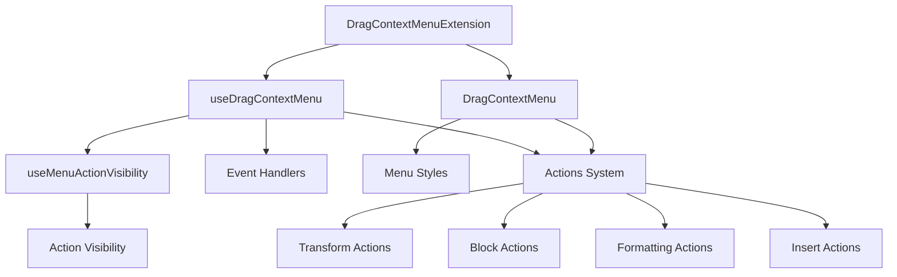
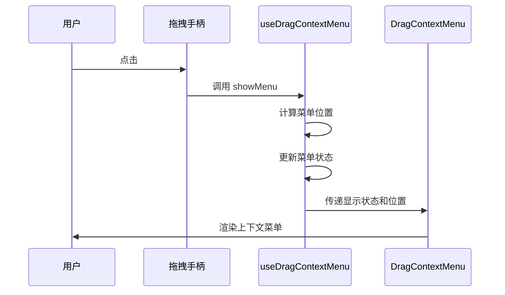
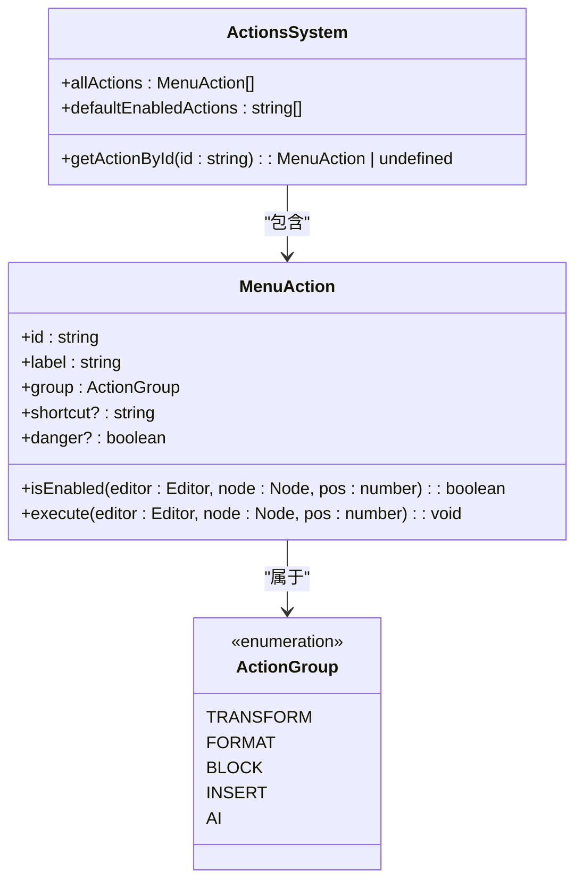
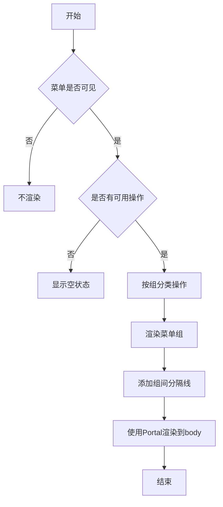

# 拖拽上下文菜单

<cite>
**本文档引用的文件**
- [drag-context-menu.ts](file://src/renderer/src/components/RichEditor/extensions/drag-context-menu.ts)
- [useDragContextMenu.ts](file://src/renderer/src/components/RichEditor/components/dragContextMenu/hooks/useDragContextMenu.ts)
- [DragContextMenu.tsx](file://src/renderer/src/components/RichEditor/components/dragContextMenu/DragContextMenu.tsx)
- [index.ts](file://src/renderer/src/components/RichEditor/components/dragContextMenu/index.ts)
- [types.ts](file://src/renderer/src/components/RichEditor/components/dragContextMenu/types.ts)
- [block.ts](file://src/renderer/src/components/RichEditor/components/dragContextMenu/actions/block.ts)
- [formatting.ts](file://src/renderer/src/components/RichEditor/components/dragContextMenu/actions/formatting.ts)
- [transform.ts](file://src/renderer/src/components/RichEditor/components/dragContextMenu/actions/transform.ts)
- [useMenuActionVisibility.ts](file://src/renderer/src/components/RichEditor/components/dragContextMenu/hooks/useMenuActionVisibility.ts)
</cite>

## 目录
1. [简介](#简介)
2. [核心架构](#核心架构)
3. [事件监听与菜单触发](#事件监听与菜单触发)
4. [菜单项注册机制](#菜单项注册机制)
5. [UI渲染逻辑](#ui渲染逻辑)
6. [使用示例](#使用示例)

## 简介

拖拽上下文菜单插件为编辑器提供了类似 Notion 的块级操作体验，允许用户通过拖拽手柄或点击操作来访问上下文相关的功能菜单。该插件实现了完整的拖拽上下文菜单系统，包括拖拽手柄、上下文菜单、节点转换操作、格式化和块操作等功能。插件基于 Tiptap 编辑器框架构建，利用 React 组件和自定义扩展实现交互逻辑。

**Section sources**
- [index.ts](file://src/renderer/src/components/RichEditor/components/dragContextMenu/index.ts#L1-L54)

## 核心架构

拖拽上下文菜单插件采用模块化架构设计，主要由以下几个核心组件构成：

1. **DragContextMenuExtension**: Tiptap 扩展，负责集成拖拽手柄和上下文菜单功能到编辑器中
2. **useDragContextMenu**: React Hook，管理菜单的显示状态、位置计算和操作执行
3. **DragContextMenu**: React 组件，负责渲染上下文菜单的 UI 界面
4. **Actions System**: 操作系统，定义和管理所有可用的菜单操作
5. **Hooks**: 提供各种功能的 Hook，如 `useMenuActionVisibility` 用于管理操作可见性

该架构通过将逻辑与 UI 分离，实现了高内聚低耦合的设计。核心逻辑由 Hook 管理，UI 渲染由组件负责，操作定义独立管理，便于维护和扩展。



**Diagram sources**
- [drag-context-menu.ts](file://src/renderer/src/components/RichEditor/extensions/drag-context-menu.ts#L287-L365)
- [useDragContextMenu.ts](file://src/renderer/src/components/RichEditor/components/dragContextMenu/hooks/useDragContextMenu.ts#L22-L280)
- [DragContextMenu.tsx](file://src/renderer/src/components/RichEditor/components/dragContextMenu/DragContextMenu.tsx#L46-L240)

**Section sources**
- [drag-context-menu.ts](file://src/renderer/src/components/RichEditor/extensions/drag-context-menu.ts#L287-L365)
- [useDragContextMenu.ts](file://src/renderer/src/components/RichEditor/components/dragContextMenu/hooks/useDragContextMenu.ts#L22-L280)
- [DragContextMenu.tsx](file://src/renderer/src/components/RichEditor/components/dragContextMenu/DragContextMenu.tsx#L46-L240)

## 事件监听与菜单触发

拖拽上下文菜单通过多种方式监听用户交互并触发菜单显示。核心的事件监听机制由 `useDragContextMenu` Hook 实现，该 Hook 管理菜单的显示、隐藏和交互逻辑。

### 事件监听流程

1. **拖拽手柄点击**: 当用户点击拖拽手柄时，触发菜单显示
2. **编辑器状态监听**: 监听编辑器的更新和失焦事件，适时隐藏菜单
3. **全局事件监听**: 监听文档级别的点击和键盘事件，实现菜单的交互控制

### 菜单触发机制

菜单的显示和隐藏由 `useDragContextMenu` Hook 提供的 `showMenu` 和 `hideMenu` 方法控制。当检测到拖拽手柄点击时，会调用 `showMenu` 方法，传入当前节点信息和鼠标位置，计算合适的菜单位置并显示菜单。



**Diagram sources**
- [useDragContextMenu.ts](file://src/renderer/src/components/RichEditor/components/dragContextMenu/hooks/useDragContextMenu.ts#L78-L130)
- [drag-context-menu.ts](file://src/renderer/src/components/RichEditor/extensions/drag-context-menu.ts#L357-L365)

**Section sources**
- [useDragContextMenu.ts](file://src/renderer/src/components/RichEditor/components/dragContextMenu/hooks/useDragContextMenu.ts#L78-L130)
- [drag-context-menu.ts](file://src/renderer/src/components/RichEditor/extensions/drag-context-menu.ts#L357-L365)

## 菜单项注册机制

拖拽上下文菜单的菜单项通过一个灵活的注册系统进行管理。所有菜单操作都遵循统一的接口定义，并按功能分组管理。

### 菜单项接口

菜单项通过 `MenuAction` 接口定义，包含以下属性：
- **id**: 操作的唯一标识符
- **label**: 显示标签
- **group**: 所属操作组
- **isEnabled**: 检查操作是否可用的函数
- **execute**: 执行操作的函数
- **shortcut**: 快捷键描述
- **danger**: 是否为危险操作

### 操作分组

菜单操作按功能分为多个组，便于组织和管理：
- **transform**: 节点转换操作
- **format**: 格式化操作
- **block**: 块级操作
- **insert**: 插入操作
- **ai**: AI 相关操作

### 操作注册

所有操作在各自的模块中定义，并通过 `allActions` 数组统一注册。系统提供了 `getActionById` 函数用于根据 ID 查找操作。



**Diagram sources**
- [types.ts](file://src/renderer/src/components/RichEditor/components/dragContextMenu/types.ts#L19-L38)
- [index.ts](file://src/renderer/src/components/RichEditor/components/dragContextMenu/index.ts#L21-L22)
- [block.ts](file://src/renderer/src/components/RichEditor/components/dragContextMenu/actions/block.ts#L10-L113)
- [formatting.ts](file://src/renderer/src/components/RichEditor/components/dragContextMenu/actions/formatting.ts#L10-L55)
- [transform.ts](file://src/renderer/src/components/RichEditor/components/dragContextMenu/actions/transform.ts#L10-L146)

**Section sources**
- [types.ts](file://src/renderer/src/components/RichEditor/components/dragContextMenu/types.ts#L19-L38)
- [index.ts](file://src/renderer/src/components/RichEditor/components/dragContextMenu/index.ts#L21-L22)
- [block.ts](file://src/renderer/src/components/RichEditor/components/dragContextMenu/actions/block.ts#L10-L113)
- [formatting.ts](file://src/renderer/src/components/RichEditor/components/dragContextMenu/actions/formatting.ts#L10-L55)
- [transform.ts](file://src/renderer/src/components/RichEditor/components/dragContextMenu/actions/transform.ts#L10-L146)

## UI渲染逻辑

上下文菜单的 UI 渲染由 `DragContextMenu` 组件负责，该组件基于 React 实现，使用函数式组件和 Hook 管理状态。

### 渲染流程

1. **获取可见操作**: 通过 `useMenuActionVisibility` Hook 获取当前上下文下可见的操作列表
2. **合并自定义操作**: 将自定义操作与默认操作合并，并过滤禁用的操作
3. **按组分类**: 将操作按组分类，便于组织菜单结构
4. **计算位置**: 根据鼠标位置和视口边界计算菜单的显示位置
5. **渲染菜单**: 使用 React Portal 将菜单渲染到 body 元素下，确保层级正确

### 菜单结构

菜单采用分组显示的方式，每个操作组包含一个标题和多个菜单项。组之间使用分隔线区分，提升可读性。



**Diagram sources**
- [DragContextMenu.tsx](file://src/renderer/src/components/RichEditor/components/dragContextMenu/DragContextMenu.tsx#L46-L240)
- [useMenuActionVisibility.ts](file://src/renderer/src/components/RichEditor/components/dragContextMenu/hooks/useMenuActionVisibility.ts#L12-L101)

**Section sources**
- [DragContextMenu.tsx](file://src/renderer/src/components/RichEditor/components/dragContextMenu/DragContextMenu.tsx#L46-L240)
- [useMenuActionVisibility.ts](file://src/renderer/src/components/RichEditor/components/dragContextMenu/hooks/useMenuActionVisibility.ts#L12-L101)

## 使用示例

### 基本使用

在编辑器中集成拖拽上下文菜单非常简单，只需将 `DragContextMenuExtension` 添加到 Tiptap 编辑器的扩展列表中：

```typescript
import { DragContextMenuExtension } from './path/to/drag-context-menu'

const editor = useEditor({
  extensions: [
    // 其他扩展...
    DragContextMenuExtension,
  ],
})
```

### 自定义菜单项

可以通过 `customActions` 属性添加自定义菜单项：

```typescript
const customActions: MenuAction[] = [
  {
    id: 'my-custom-action',
    label: 'My Action',
    group: ActionGroup.INSERT,
    isEnabled: (editor, node) => true,
    execute: (editor, node, pos) => {
      // 执行自定义逻辑
      console.log('Custom action executed')
    }
  }
]

// 在组件中使用
<DragContextMenu 
  editor={editor}
  node={currentNode}
  position={position}
  visible={isMenuVisible}
  menuPosition={menuPosition}
  onClose={hideMenu}
  customActions={customActions}
/>
```

### 禁用特定操作

可以通过 `disabledActions` 属性禁用特定的菜单项：

```typescript
<DragContextMenu 
  editor={editor}
  node={currentNode}
  position={position}
  visible={isMenuVisible}
  menuPosition={menuPosition}
  onClose={hideMenu}
  disabledActions={['block-delete', 'block-duplicate']}
/>
```

### 监听事件

可以通过 `eventHandlers` 属性监听菜单的生命周期事件：

```typescript
const eventHandlers: EventHandlers = {
  onMenuShow: (node, position) => {
    console.log('Menu shown for node:', node.type.name, 'at position:', position)
  },
  onMenuHide: () => {
    console.log('Menu hidden')
  },
  onActionExecute: (action, result) => {
    console.log('Action executed:', action.id, 'success:', result.success)
  },
  onError: (error, context) => {
    console.error('Error in context menu:', error, 'context:', context)
  }
}

const { showMenu, hideMenu, executeAction } = useDragContextMenu({
  editor,
  eventHandlers
})
```

**Section sources**
- [DragContextMenu.tsx](file://src/renderer/src/components/RichEditor/components/dragContextMenu/DragContextMenu.tsx#L46-L240)
- [useDragContextMenu.ts](file://src/renderer/src/components/RichEditor/components/dragContextMenu/hooks/useDragContextMenu.ts#L22-L280)
- [types.ts](file://src/renderer/src/components/RichEditor/components/dragContextMenu/types.ts#L205-L210)