# 富文本编辑器插件系统

<cite>
**本文档引用的文件**
- [plusButtonPlugin.ts](file://src/renderer/src/components/RichEditor/plugins/plusButtonPlugin.ts)
- [plus-button.ts](file://src/renderer/src/components/RichEditor/extensions/plus-button.ts)
- [drag-context-menu.ts](file://src/renderer/src/components/RichEditor/extensions/drag-context-menu.ts)
- [placeholder.ts](file://src/renderer/src/components/RichEditor/extensions/placeholder.ts)
- [PlusButton.tsx](file://src/renderer/src/components/RichEditor/components/PlusButton.tsx)
- [index.tsx](file://src/renderer/src/components/RichEditor/index.tsx)
- [types.ts](file://src/renderer/src/components/RichEditor/types.ts)
- [command.ts](file://src/renderer/src/components/RichEditor/command.ts)
- [useRichEditor.ts](file://src/renderer/src/components/RichEditor/useRichEditor.ts)
- [pluginEngine.ts](file://packages/aiCore/src/core/runtime/pluginEngine.ts)
- [manager.ts](file://packages/aiCore/src/core/plugins/manager.ts)
- [plugin.ts](file://src/renderer/src/types/plugin.ts)
</cite>

## 目录
1. [简介](#简介)
2. [插件系统架构](#插件系统架构)
3. [核心插件组件](#核心插件组件)
4. [plusButtonPlugin详解](#plusbuttonplugin详解)
5. [拖拽上下文菜单插件](#拖拽上下文菜单插件)
6. [占位符插件](#占位符插件)
7. [插件生命周期管理](#插件生命周期管理)
8. [API接口设计](#api接口设计)
9. [自定义插件开发指南](#自定义插件开发指南)
10. [最佳实践与故障排除](#最佳实践与故障排除)

## 简介

Cherry Studio的富文本编辑器采用模块化的插件系统架构，提供了强大的扩展能力。该系统基于TipTap框架构建，支持多种类型的插件，包括命令插件、UI组件插件和功能增强插件。插件系统的核心设计理念是提供可插拔的功能模块，使开发者能够轻松地扩展编辑器的功能而无需修改核心代码。

## 插件系统架构

### 整体架构概览

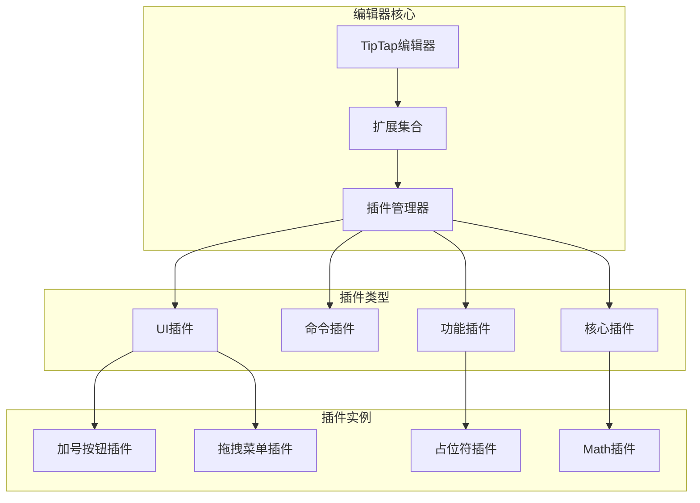

**图表来源**
- [index.tsx](file://src/renderer/src/components/RichEditor/index.tsx#L224-L386)
- [useRichEditor.ts](file://src/renderer/src/components/RichEditor/useRichEditor.ts#L224-L386)

### 插件分类体系

插件系统根据功能特性分为以下几类：

| 插件类型 | 功能描述 | 实现方式 | 示例 |
|---------|----------|----------|------|
| **UI插件** | 提供用户界面组件 | React组件 + ProseMirror插件 | PlusButton, DragHandle |
| **命令插件** | 注册和管理编辑器命令 | 命令注册表 + 动态管理 | Slash命令系统 |
| **功能插件** | 增强特定功能 | 扩展 + 插件组合 | 数学公式、图片处理 |
| **核心插件** | 编辑器基础功能 | TipTap扩展 | 表格、任务列表 |

**章节来源**
- [types.ts](file://src/renderer/src/components/RichEditor/types.ts#L242-L276)
- [command.ts](file://src/renderer/src/components/RichEditor/command.ts#L38-L51)

## 核心插件组件

### 插件注册与发现机制

编辑器通过统一的插件注册机制管理所有插件：

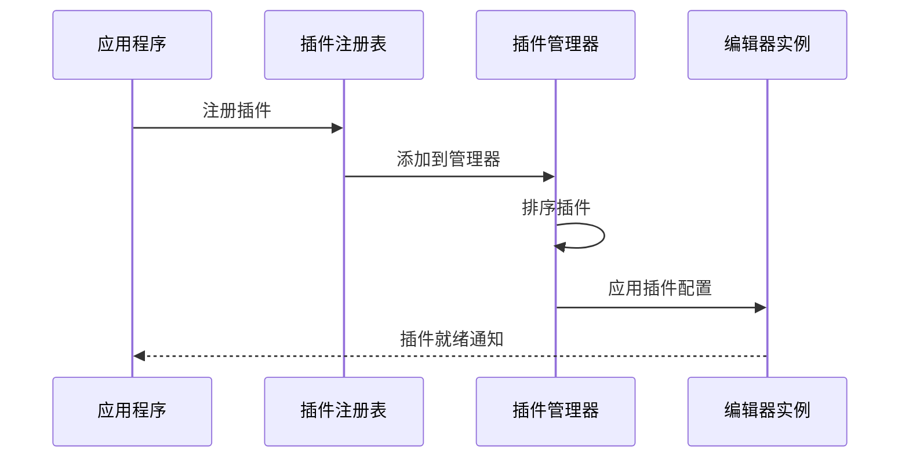

**图表来源**
- [manager.ts](file://packages/aiCore/src/core/plugins/manager.ts#L15-L26)
- [command.ts](file://src/renderer/src/components/RichEditor/command.ts#L71-L76)

### 插件依赖关系

插件之间存在明确的依赖关系和加载顺序：

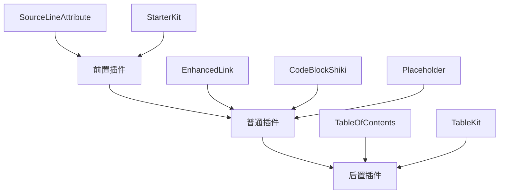

**图表来源**
- [useRichEditor.ts](file://src/renderer/src/components/RichEditor/useRichEditor.ts#L224-L386)

**章节来源**
- [useRichEditor.ts](file://src/renderer/src/components/RichEditor/useRichEditor.ts#L224-L386)

## plusButtonPlugin详解

### 架构设计

plusButtonPlugin是富文本编辑器中最核心的UI插件之一，它为用户提供了一个智能的"加号"按钮，用于快速插入新的内容块。

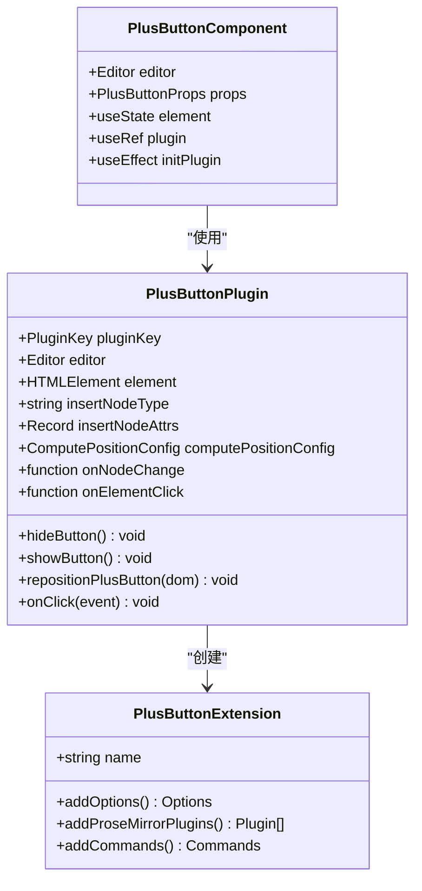

**图表来源**
- [plusButtonPlugin.ts](file://src/renderer/src/components/RichEditor/plugins/plusButtonPlugin.ts#L40-L260)
- [plus-button.ts](file://src/renderer/src/components/RichEditor/extensions/plus-button.ts#L41-L96)

### 核心功能实现

#### 1. 按钮定位算法

plusButtonPlugin使用floating-ui库实现精确的按钮定位：

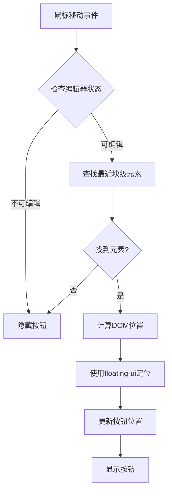

**图表来源**
- [plusButtonPlugin.ts](file://src/renderer/src/components/RichEditor/plugins/plusButtonPlugin.ts#L168-L220)

#### 2. 事件处理流程

插件的事件处理遵循严格的优先级和状态管理：

| 事件类型 | 处理优先级 | 功能描述 | 触发条件 |
|---------|-----------|----------|----------|
| **mousemove** | 高 | 更新按钮位置 | 鼠标移动时 |
| **keydown** | 中 | 隐藏按钮 | 键盘输入时 |
| **scroll** | 中 | 隐藏按钮 | 滚动时 |
| **mouseleave** | 低 | 隐藏按钮 | 鼠标离开编辑器 |

**章节来源**
- [plusButtonPlugin.ts](file://src/renderer/src/components/RichEditor/plugins/plusButtonPlugin.ts#L168-L256)

### 插件配置选项

plusButtonPlugin提供了丰富的配置选项：

```typescript
interface PlusButtonPluginOptions {
  pluginKey?: PluginKey | string
  editor: Editor
  element: HTMLElement
  insertNodeType?: string
  insertNodeAttrs?: Record<string, any>
  onNodeChange?: (data: { editor: Editor; node: Node | null; pos: number }) => void
  onElementClick?: (event: MouseEvent) => void
  computePositionConfig?: ComputePositionConfig
}
```

**章节来源**
- [plusButtonPlugin.ts](file://src/renderer/src/components/RichEditor/plugins/plusButtonPlugin.ts#L29-L38)

## 拖拽上下文菜单插件

### 功能概述

拖拽上下文菜单插件为用户提供了一套完整的块级元素操作界面，支持格式化、转换和删除等操作。

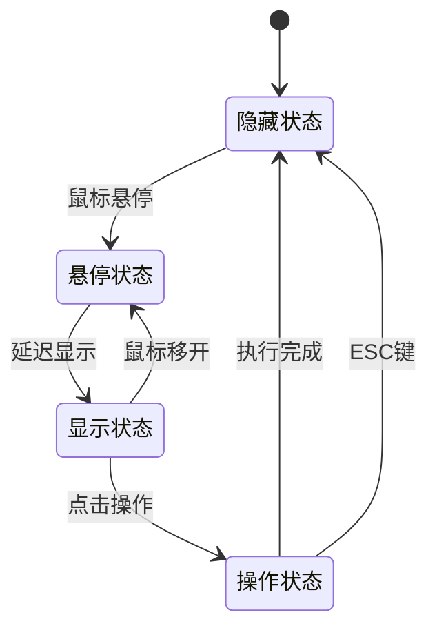

**图表来源**
- [drag-context-menu.ts](file://src/renderer/src/components/RichEditor/extensions/drag-context-menu.ts#L261-L462)

### 上下文菜单结构

菜单按照功能分组，提供清晰的操作层次：

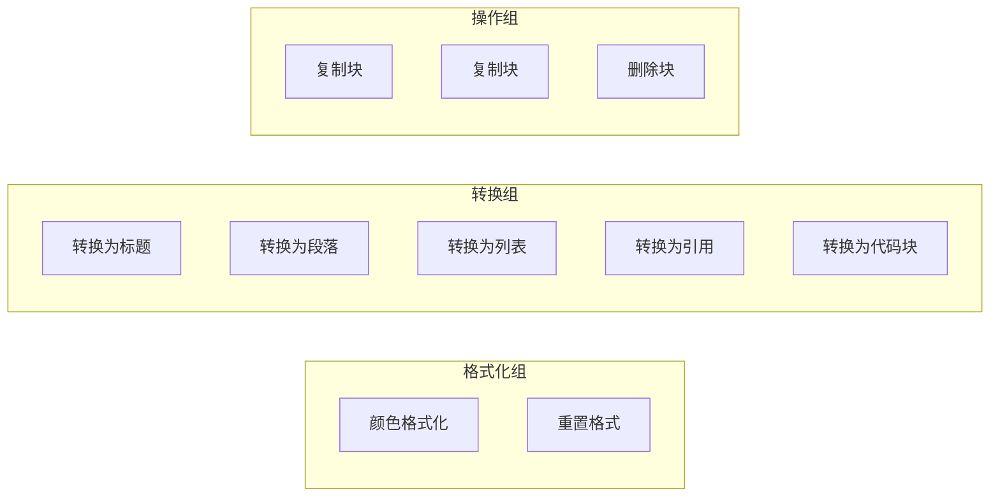

**图表来源**
- [drag-context-menu.ts](file://src/renderer/src/components/RichEditor/extensions/drag-context-menu.ts#L44-L56)

### 动态菜单生成

菜单项根据当前节点类型和可用性动态生成：

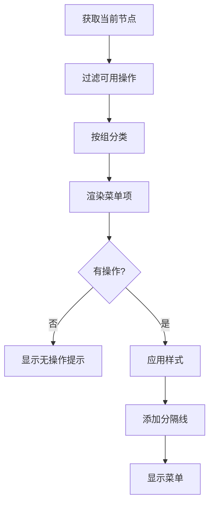

**图表来源**
- [drag-context-menu.ts](file://src/renderer/src/components/RichEditor/extensions/drag-context-menu.ts#L34-L174)

**章节来源**
- [drag-context-menu.ts](file://src/renderer/src/components/RichEditor/extensions/drag-context-menu.ts#L34-L174)

## 占位符插件

### 设计理念

占位符插件负责管理编辑器中的空内容提示，提供直观的用户体验。

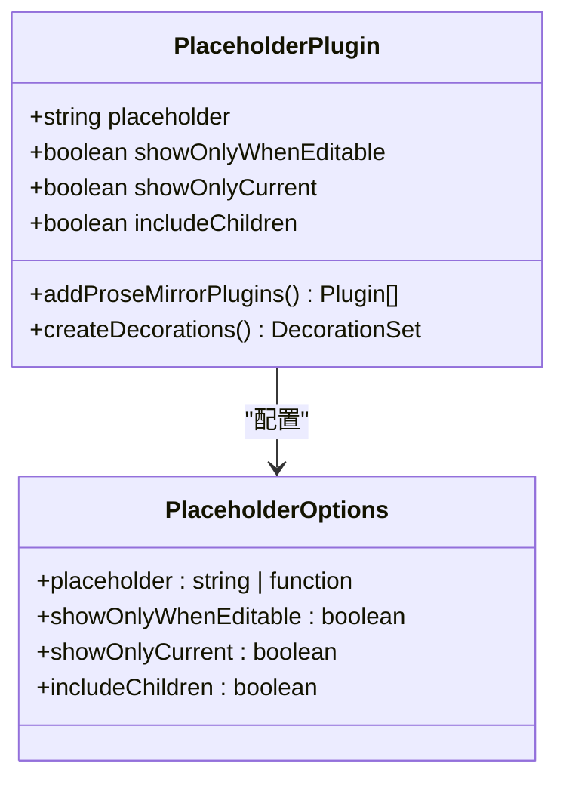

**图表来源**
- [placeholder.ts](file://src/renderer/src/components/RichEditor/extensions/placeholder.ts#L14-L85)

### 占位符显示逻辑

插件根据多种条件决定何时显示占位符：

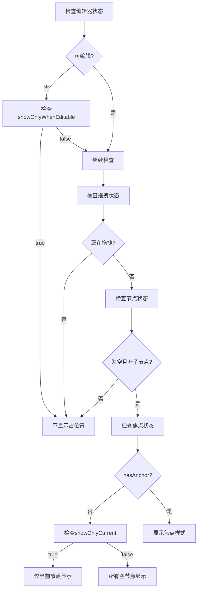

**图表来源**
- [placeholder.ts](file://src/renderer/src/components/RichEditor/extensions/placeholder.ts#L31-L80)

### 动态占位符内容

占位符支持静态文本和动态函数两种模式：

| 模式 | 描述 | 使用场景 | 示例 |
|------|------|----------|------|
| **静态文本** | 固定的占位符文本 | 默认情况 | "写点什么..." |
| **动态函数** | 基于上下文生成的文本 | 条件占位符 | 根据节点类型显示不同提示 |

**章节来源**
- [placeholder.ts](file://src/renderer/src/components/RichEditor/extensions/placeholder.ts#L7-L8)

## 插件生命周期管理

### 生命周期阶段

插件系统遵循标准的生命周期管理模式：

```mermaid
sequenceDiagram
participant Init as 初始化
participant Load as 加载
participant Active as 激活
participant Running as 运行
participant Cleanup as 清理
participant Destroy as 销毁
Init->>Load : 插件注册
Load->>Active : 配置验证
Active->>Running : 开始运行
Running->>Cleanup : 状态变更
Cleanup->>Destroy : 组件卸载
Destroy->>Init : 重新初始化
```

**图表来源**
- [manager.ts](file://packages/aiCore/src/core/plugins/manager.ts#L15-L48)

### 插件排序机制

插件按照执行优先级自动排序：

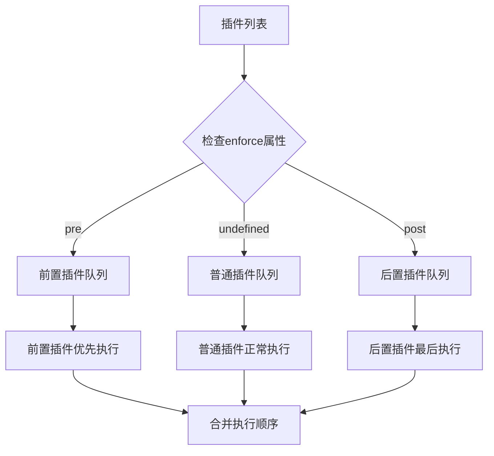

**图表来源**
- [manager.ts](file://packages/aiCore/src/core/plugins/manager.ts#L30-L47)

### 状态管理

插件系统维护全局状态以确保一致性：

| 状态类型 | 描述 | 管理方式 | 示例 |
|---------|------|----------|------|
| **活跃状态** | 插件当前是否激活 | 自动检测 | 编辑器可编辑状态 |
| **可用性状态** | 插件功能是否可用 | 条件判断 | 特定节点类型下的功能 |
| **配置状态** | 插件配置参数 | 用户设置 | 位置计算配置 |

**章节来源**
- [manager.ts](file://packages/aiCore/src/core/plugins/manager.ts#L15-L48)

## API接口设计

### 插件API规范

插件系统提供标准化的API接口：

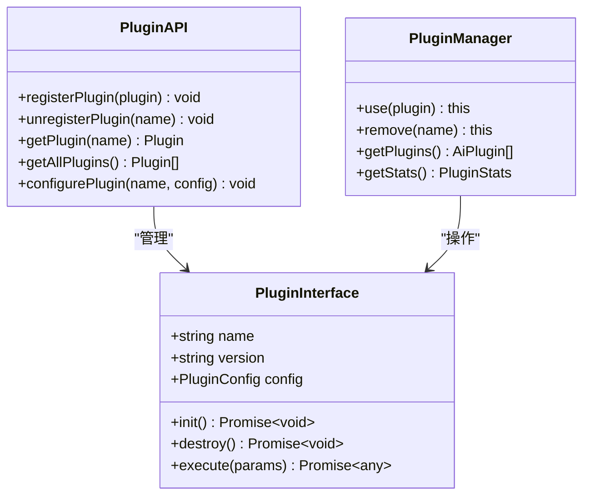

**图表来源**
- [pluginEngine.ts](file://packages/aiCore/src/core/runtime/pluginEngine.ts#L19-L66)

### 命令系统API

编辑器提供了完整的命令管理系统：

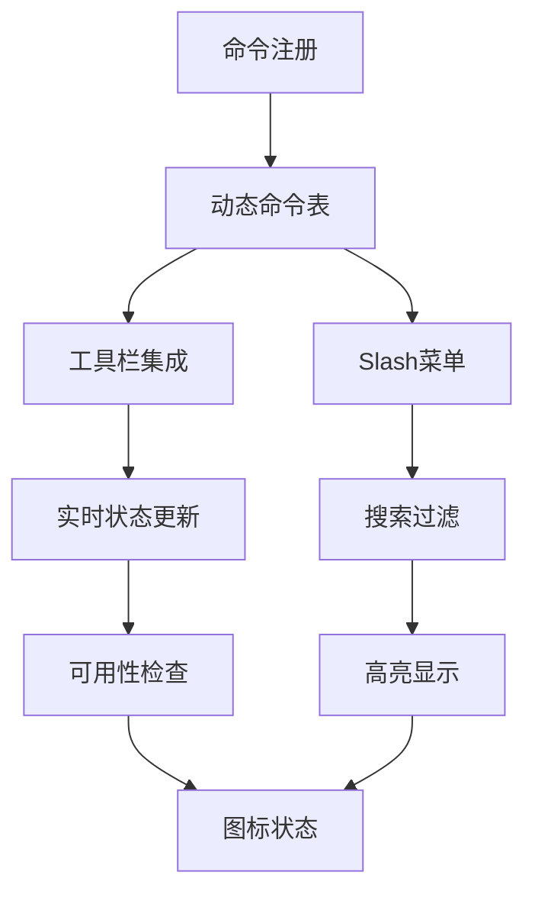

**图表来源**
- [command.ts](file://src/renderer/src/components/RichEditor/command.ts#L71-L116)

### 扩展接口

插件可以通过扩展接口与编辑器深度集成：

| 接口类型 | 功能描述 | 实现方式 | 示例 |
|---------|----------|----------|------|
| **扩展方法** | 添加新的编辑器功能 | Extension.create() | 自定义节点类型 |
| **插件方法** | 添加ProseMirror插件 | addProseMirrorPlugins() | 自定义事件处理器 |
| **命令方法** | 注册编辑器命令 | addCommands() | 自定义格式化命令 |

**章节来源**
- [plus-button.ts](file://src/renderer/src/components/RichEditor/extensions/plus-button.ts#L41-L96)

## 自定义插件开发指南

### 开发步骤

创建自定义插件需要遵循以下步骤：

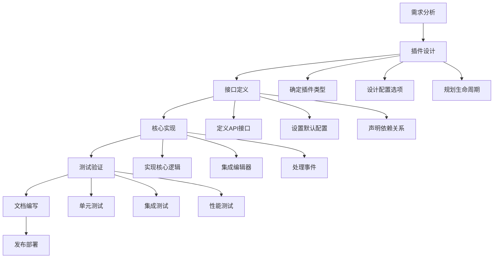

### 插件模板

以下是标准的插件开发模板：

```typescript
// 基础插件结构示例
export const CustomPlugin = Extension.create({
  name: 'customPlugin',
  
  addOptions() {
    return {
      // 插件配置选项
      customOption: 'default value'
    }
  },
  
  addProseMirrorPlugins() {
    return [
      new Plugin({
        // 插件逻辑实现
      })
    ]
  },
  
  addCommands() {
    return {
      // 命令注册
    }
  }
})
```

### 最佳实践

#### 1. 性能优化

- **懒加载**：按需加载插件资源
- **缓存策略**：缓存计算结果和DOM查询
- **事件节流**：限制高频事件的处理频率

#### 2. 错误处理

- **优雅降级**：插件失败不影响主功能
- **错误边界**：使用React错误边界捕获异常
- **日志记录**：详细的错误日志便于调试

#### 3. 兼容性

- **版本兼容**：支持多个编辑器版本
- **浏览器兼容**：适配不同的浏览器环境
- **移动端适配**：考虑触摸设备的特殊需求

**章节来源**
- [command.ts](file://src/renderer/src/components/RichEditor/command.ts#L71-L116)

## 最佳实践与故障排除

### 性能优化策略

#### 内存管理

插件系统实现了完善的内存管理机制：

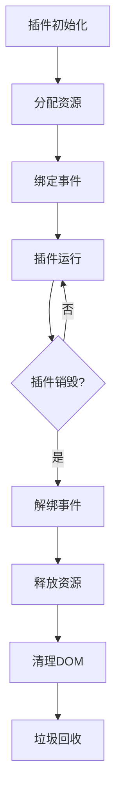

#### 事件处理优化

- **事件委托**：使用事件委托减少事件监听器数量
- **防抖节流**：对高频事件进行防抖处理
- **异步处理**：将耗时操作放入微任务队列

### 常见问题解决

#### 插件冲突

当多个插件同时操作同一功能时可能出现冲突：

| 冲突类型 | 症状 | 解决方案 | 预防措施 |
|---------|------|----------|----------|
| **事件冲突** | 事件被意外阻止 | 使用事件冒泡控制 | 明确事件处理优先级 |
| **状态冲突** | 状态不一致 | 实现状态同步机制 | 使用单一状态源 |
| **样式冲突** | 样式覆盖 | 使用CSS命名空间 | 遵循CSS隔离原则 |

#### 性能问题

常见的性能瓶颈及解决方案：

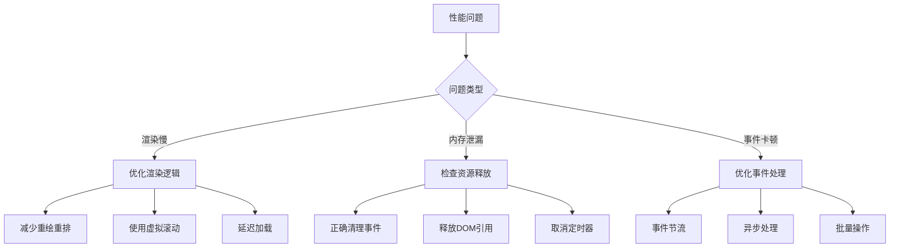

### 调试技巧

#### 开发工具

- **浏览器开发者工具**：监控DOM变化和事件
- **React DevTools**：调试React组件状态
- **ProseMirror调试器**：查看编辑器状态

#### 日志系统

插件系统内置了完整的日志记录机制：

```typescript
// 日志级别和使用示例
const logger = loggerService.withContext('CustomPlugin')

logger.debug('插件初始化完成')
logger.info('插件配置已更新')
logger.warn('插件依赖缺失')
logger.error('插件执行失败', error)
```

**章节来源**
- [useRichEditor.ts](file://src/renderer/src/components/RichEditor/useRichEditor.ts#L667-L673)

## 结论

Cherry Studio的富文本编辑器插件系统是一个设计精良、功能完备的扩展框架。通过plusButtonPlugin、拖拽上下文菜单插件和占位符插件等核心组件，系统提供了强大的功能扩展能力。插件系统的设计充分考虑了性能、可维护性和用户体验，为开发者提供了灵活而可靠的扩展平台。

随着项目的不断发展，插件系统将继续演进，支持更多的插件类型和更复杂的交互模式。开发者可以基于现有的插件架构，创建满足特定需求的功能模块，从而构建出更加丰富和个性化的编辑体验。