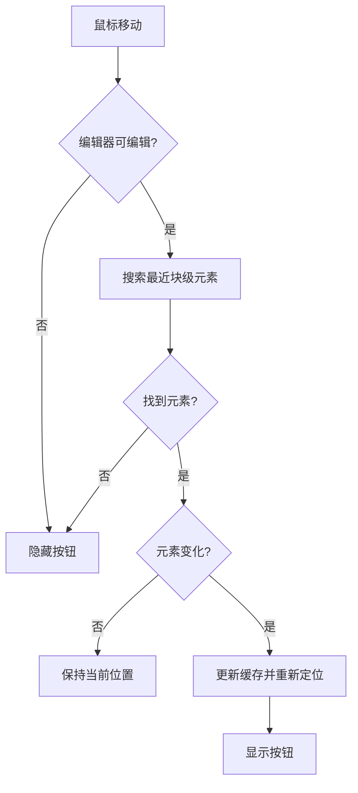
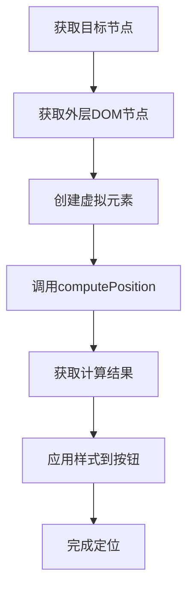
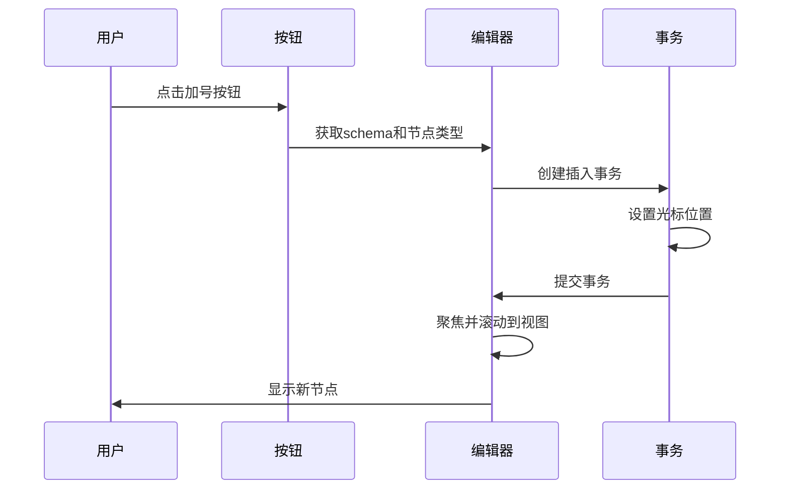
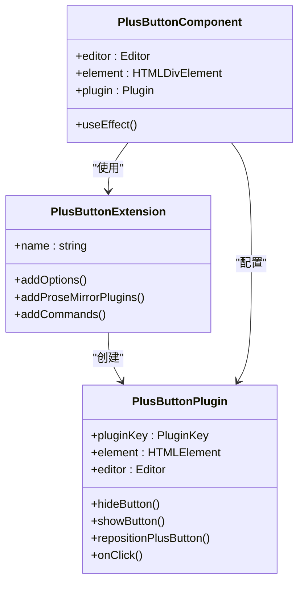
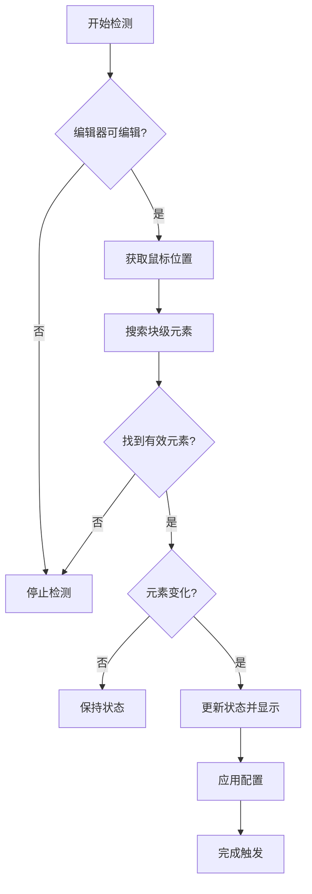
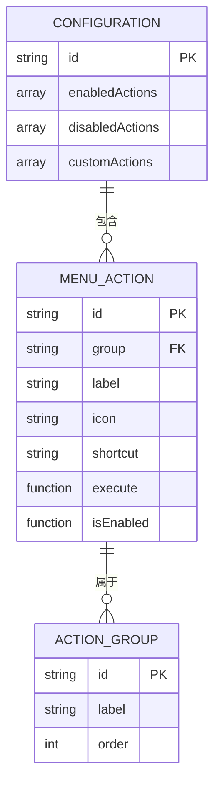
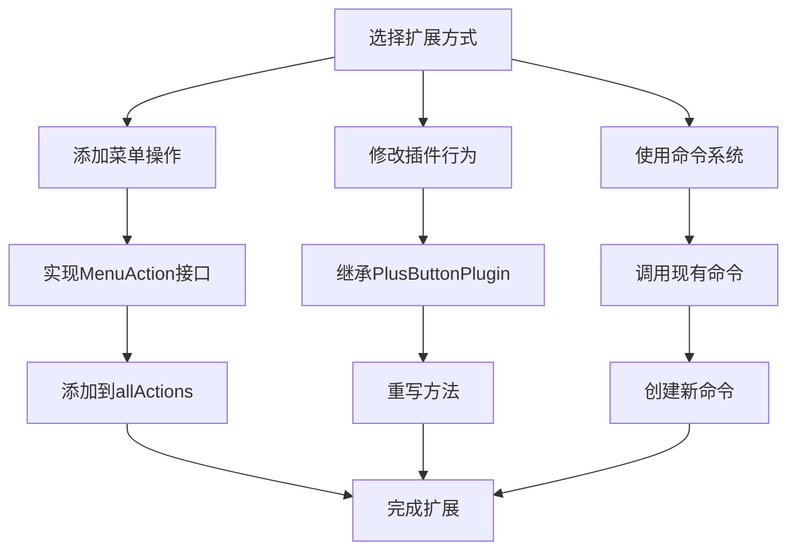

# 加号按钮

<cite>
**本文档引用的文件**  
- [plusButtonPlugin.ts](file://src/renderer/src/components/RichEditor/plugins/plusButtonPlugin.ts)
- [PlusButton.tsx](file://src/renderer/src/components/RichEditor/components/PlusButton.tsx)
- [plus-button.ts](file://src/renderer/src/components/RichEditor/extensions/plus-button.ts)
- [index.tsx](file://src/renderer/src/components/RichEditor/index.tsx)
- [findNextElementFromCursor.ts](file://src/renderer/src/components/RichEditor/helpers/findNextElementFromCursor.ts)
- [getOutNode.ts](file://src/renderer/src/components/RichEditor/helpers/getOutNode.ts)
- [dragContextMenu.tsx](file://src/renderer/src/components/RichEditor/components/dragContextMenu/DragContextMenu.tsx)
- [actions/index.ts](file://src/renderer/src/components/RichEditor/components/dragContextMenu/actions/index.ts)
</cite>

## 目录
1. [简介](#简介)
2. [核心组件](#核心组件)
3. [动态显示逻辑](#动态显示逻辑)
4. [位置计算机制](#位置计算机制)
5. [动画与交互效果](#动画与交互效果)
6. [与扩展和插件的协作机制](#与扩展和插件的协作机制)
7. [触发条件与配置](#触发条件与配置)
8. [菜单项配置与自定义操作](#菜单项配置与自定义操作)
9. [功能扩展开发指南](#功能扩展开发指南)
10. [结论](#结论)

## 简介
加号按钮是RichEditor中的一个重要UI组件，用于在文档编辑过程中提供便捷的内容插入功能。该组件通过智能定位、动态显示和交互式菜单为用户提供流畅的编辑体验。本文档详细描述了加号按钮的实现机制、协作模式和扩展方法。

## 核心组件

加号按钮系统由多个核心组件构成，包括React组件、ProseMirror插件和Tiptap扩展。这些组件协同工作，实现了按钮的渲染、定位和交互功能。

**Section sources**
- [PlusButton.tsx](file://src/renderer/src/components/RichEditor/components/PlusButton.tsx#L1-L80)
- [plusButtonPlugin.ts](file://src/renderer/src/components/RichEditor/plugins/plusButtonPlugin.ts#L1-L260)
- [plus-button.ts](file://src/renderer/src/components/RichEditor/extensions/plus-button.ts#L1-L96)

## 动态显示逻辑

加号按钮的显示状态由鼠标移动事件和编辑器状态共同控制。系统通过监听`mousemove`事件来检测用户交互，并根据光标位置和编辑器可编辑状态决定按钮的可见性。

当鼠标在编辑器区域内移动时，系统会通过`findElementNextToCoords`函数向右搜索最近的块级元素。如果找到合适的块级节点且编辑器处于可编辑状态，加号按钮将被显示；否则，按钮将被隐藏。此外，在用户开始输入（`keydown`事件）或滚动（`scroll`事件）时，按钮也会自动隐藏以避免干扰。

**Diagram sources**
- [plusButtonPlugin.ts](file://src/renderer/src/components/RichEditor/plugins/plusButtonPlugin.ts#L171-L254)

**Section sources**
- [plusButtonPlugin.ts](file://src/renderer/src/components/RichEditor/plugins/plusButtonPlugin.ts#L171-L254)
- [findNextElementFromCursor.ts](file://src/renderer/src/components/RichEditor/helpers/findNextElementFromCursor.ts#L1-L55)

## 位置计算机制

加号按钮的位置计算依赖于`@floating-ui/dom`库的`computePosition`函数。系统通过虚拟元素（virtual element）获取目标块级元素的边界矩形，然后计算加号按钮的最佳显示位置。

位置计算配置默认使用`left-start`放置策略和`absolute`定位策略。系统首先获取目标DOM节点，然后通过`getOuterDomNode`函数遍历到顶层节点，最后调用`computePosition`进行精确的位置计算。计算结果包括x、y坐标和定位策略，这些值被直接应用到按钮的样式中。

**Diagram sources**
- [plusButtonPlugin.ts](file://src/renderer/src/components/RichEditor/plugins/plusButtonPlugin.ts#L77-L89)
- [getOutNode.ts](file://src/renderer/src/components/RichEditor/helpers/getOutNode.ts#L1-L36)

**Section sources**
- [plusButtonPlugin.ts](file://src/renderer/src/components/RichEditor/plugins/plusButtonPlugin.ts#L77-L89)
- [plus-button.ts](file://src/renderer/src/components/RichEditor/extensions/plus-button.ts#L9-L12)

## 动画与交互效果

加号按钮通过CSS样式实现基本的动画效果。按钮的可见性通过`visibility`属性控制，指针事件通过`pointer-events`属性管理。当按钮需要显示时，系统会清除`visibility`样式并启用`pointer-events`；当需要隐藏时，则设置`visibility`为`hidden`并禁用指针事件。

按钮的点击交互通过事件监听器实现。当用户点击加号按钮时，系统会根据配置的`insertNodeType`创建新的节点，并将其插入到当前节点之后。插入后，编辑器会自动将光标定位到新节点内部，并触发滚动到视图的操作，确保新内容可见。

**Diagram sources**
- [plusButtonPlugin.ts](file://src/renderer/src/components/RichEditor/plugins/plusButtonPlugin.ts#L91-L104)
- [plus-button.ts](file://src/renderer/src/components/RichEditor/extensions/plus-button.ts#L67-L91)

**Section sources**
- [plusButtonPlugin.ts](file://src/renderer/src/components/RichEditor/plugins/plusButtonPlugin.ts#L54-L75)
- [plusButtonPlugin.ts](file://src/renderer/src/components/RichEditor/plugins/plusButtonPlugin.ts#L91-L104)

## 与扩展和插件的协作机制

加号按钮系统采用分层架构，通过Tiptap扩展、ProseMirror插件和React组件的协作实现完整功能。`PlusButton`扩展负责创建和注册插件，`PlusButtonPlugin`负责处理底层的编辑器交互和定位逻辑，而`PlusButton` React组件则负责UI渲染和生命周期管理。

React组件通过`useEffect`钩子在挂载时创建并注册ProseMirror插件，在卸载时注销插件并清理资源。这种设计确保了组件与编辑器状态的同步，避免了内存泄漏。扩展还提供了`insertParagraphAfter`命令，允许其他组件通过Tiptap的命令系统与加号按钮功能进行交互。

**Diagram sources**
- [plus-button.ts](file://src/renderer/src/components/RichEditor/extensions/plus-button.ts#L41-L95)
- [plusButtonPlugin.ts](file://src/renderer/src/components/RichEditor/plugins/plusButtonPlugin.ts#L40-L110)
- [PlusButton.tsx](file://src/renderer/src/components/RichEditor/components/PlusButton.tsx#L18-L78)

**Section sources**
- [plus-button.ts](file://src/renderer/src/components/RichEditor/extensions/plus-button.ts#L41-L95)
- [plusButtonPlugin.ts](file://src/renderer/src/components/RichEditor/plugins/plusButtonPlugin.ts#L40-L110)
- [PlusButton.tsx](file://src/renderer/src/components/RichEditor/components/PlusButton.tsx#L18-L78)

## 触发条件与配置

加号按钮的触发条件主要基于鼠标位置和编辑器状态。只有当编辑器处于可编辑状态且鼠标悬停在有效的块级元素上时，按钮才会显示。系统通过`isEditable`属性检查编辑器状态，并通过`findElementNextToCoords`函数检测有效的块级元素。

组件支持多种配置选项，包括插入节点类型、节点属性、位置计算配置和事件回调。开发者可以通过`insertNodeType`指定要插入的节点类型，默认为段落节点。`insertNodeAttrs`允许设置新节点的属性，`computePositionConfig`可以自定义位置计算策略，而`onNodeChange`和`onElementClick`则提供了事件回调机制。

**Diagram sources**
- [plusButtonPlugin.ts](file://src/renderer/src/components/RichEditor/plugins/plusButtonPlugin.ts#L68-L71)
- [plusButtonPlugin.ts](file://src/renderer/src/components/RichEditor/plugins/plusButtonPlugin.ts#L171-L190)

**Section sources**
- [plusButtonPlugin.ts](file://src/renderer/src/components/RichEditor/plugins/plusButtonPlugin.ts#L29-L38)
- [PlusButton.tsx](file://src/renderer/src/components/RichEditor/components/PlusButton.tsx#L12-L16)

## 菜单项配置与自定义操作

加号按钮与拖拽上下文菜单系统集成，支持丰富的菜单项配置和自定义操作。系统预定义了多种操作类型，包括转换、格式化、块操作、插入和AI操作。这些操作通过`allActions`集合统一管理，并可以根据需要启用或禁用。

开发者可以通过`customActions`参数添加自定义操作，或通过`disabledActions`参数禁用特定操作。每个操作包含ID、组别、标签、图标、快捷键和执行函数等属性。当用户点击菜单项时，系统会调用相应的执行函数，并传递编辑器、节点和位置等上下文信息。

**Diagram sources**
- [actions/index.ts](file://src/renderer/src/components/RichEditor/components/dragContextMenu/actions/index.ts#L7-L53)
- [dragContextMenu.tsx](file://src/renderer/src/components/RichEditor/components/dragContextMenu/DragContextMenu.tsx#L58-L111)

**Section sources**
- [actions/index.ts](file://src/renderer/src/components/RichEditor/components/dragContextMenu/actions/index.ts#L7-L53)
- [dragContextMenu.tsx](file://src/renderer/src/components/RichEditor/components/dragContextMenu/DragContextMenu.tsx#L58-L111)

## 功能扩展开发指南

开发者可以通过多种方式扩展加号按钮的功能。首先，可以通过创建新的菜单操作来添加自定义功能。新操作需要实现`MenuAction`接口，包括ID、组别、标签、图标和执行函数等属性。然后将新操作添加到`allActions`集合或通过`customActions`参数传入。

其次，可以通过继承或修改现有插件来改变按钮的行为。开发者可以创建自定义的`PlusButtonPlugin`变体，重写`onClick`、`showButton`或`hideButton`等方法。还可以通过`computePositionConfig`自定义位置计算策略，实现不同的定位行为。

最后，可以通过Tiptap的命令系统与加号按钮功能集成。开发者可以调用`insertParagraphAfter`命令或创建新的命令来触发加号按钮的相关操作。这种基于命令的架构使得功能扩展更加灵活和模块化。

**Diagram sources**
- [plus-button.ts](file://src/renderer/src/components/RichEditor/extensions/plus-button.ts#L65-L92)
- [actions/index.ts](file://src/renderer/src/components/RichEditor/components/dragContextMenu/actions/index.ts#L7-L53)

**Section sources**
- [plus-button.ts](file://src/renderer/src/components/RichEditor/extensions/plus-button.ts#L65-L92)
- [actions/index.ts](file://src/renderer/src/components/RichEditor/components/dragContextMenu/actions/index.ts#L7-L53)

## 结论
加号按钮组件通过精心设计的架构实现了智能定位、动态显示和丰富交互。其模块化的组件结构和灵活的扩展机制为开发者提供了强大的定制能力。通过理解其核心原理和协作模式，开发者可以有效地扩展和定制加号按钮功能，满足各种复杂的编辑需求。