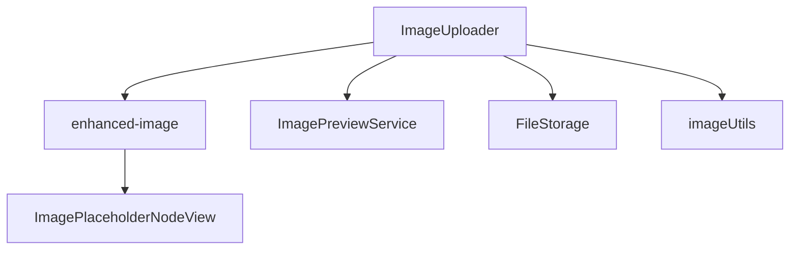
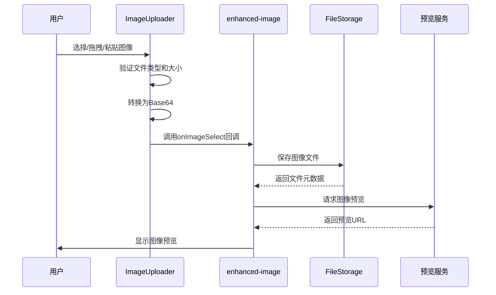
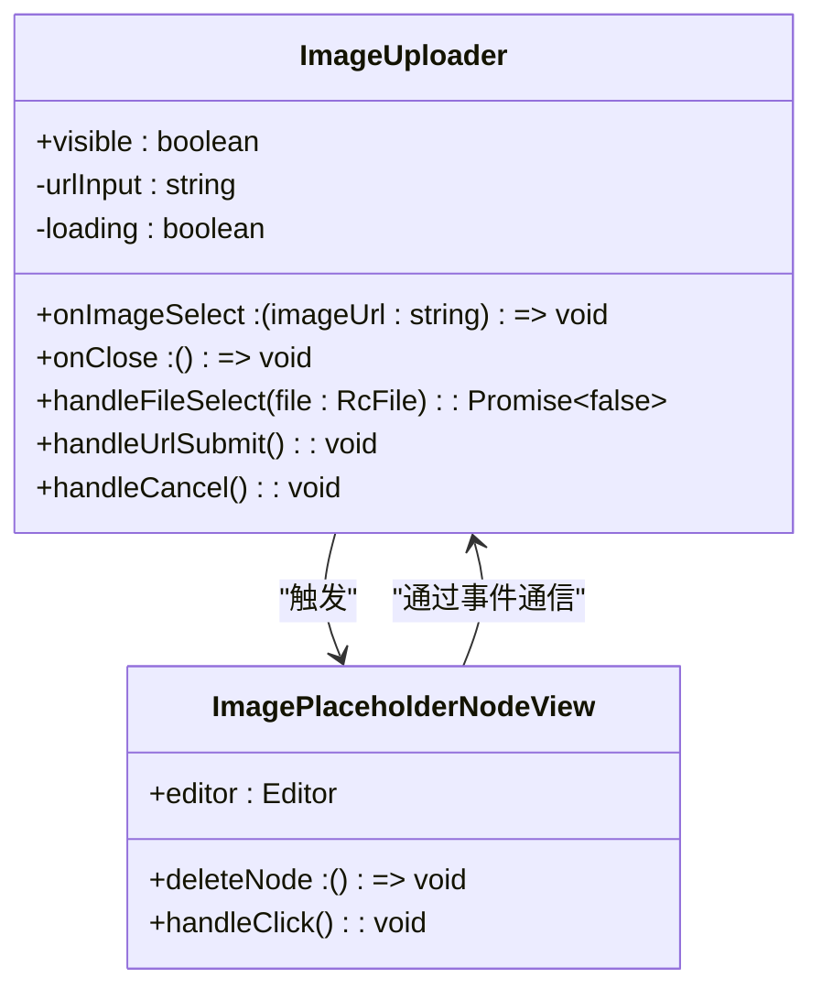
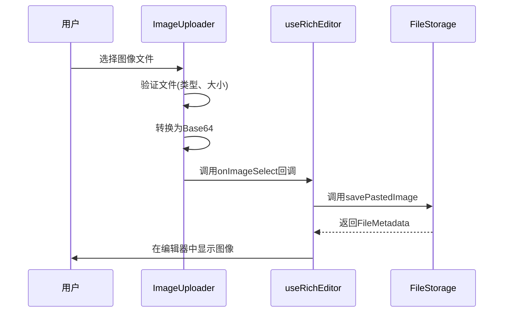
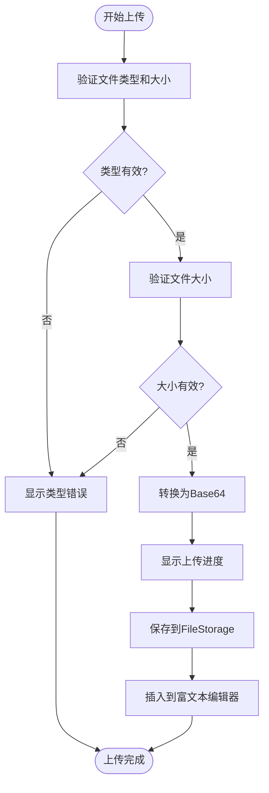
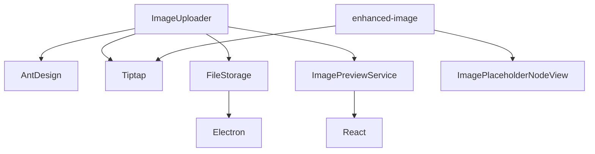

# 图像上传组件

<cite>
**本文档引用的文件**   
- [ImageUploader.tsx](file://src/renderer/src/components/RichEditor/components/ImageUploader.tsx)
- [enhanced-image.ts](file://src/renderer/src/components/RichEditor/extensions/enhanced-image.ts)
- [ImagePlaceholderNodeView.tsx](file://src/renderer/src/components/RichEditor/components/placeholder/ImagePlaceholderNodeView.tsx)
- [useRichEditor.ts](file://src/renderer/src/components/RichEditor/useRichEditor.ts)
- [ImagePreviewService.ts](file://src/renderer/src/services/ImagePreviewService.ts)
- [FileStorage.ts](file://src/main/services/FileStorage.ts)
- [image.ts](file://src/renderer/src/utils/image.ts)
</cite>

## 目录
1. [简介](#简介)
2. [项目结构](#项目结构)
3. [核心组件](#核心组件)
4. [架构概述](#架构概述)
5. [详细组件分析](#详细组件分析)
6. [依赖分析](#依赖分析)
7. [性能考虑](#性能考虑)
8. [故障排除指南](#故障排除指南)
9. [结论](#结论)

## 简介
图像上传组件是Cherry Studio富文本编辑器中的关键功能，支持多种图像插入方式，包括文件选择、拖拽上传和粘贴操作。该组件与enhanced-image扩展紧密集成，提供完整的图像处理流程，从上传到预览再到存储。组件支持常见的图像格式，具有大小限制和上传进度显示功能，并提供了丰富的配置选项和错误处理机制。

## 项目结构
图像上传功能分布在多个组件和服务中，形成了一个完整的图像处理生态系统。主要文件包括图像上传器组件、增强图像扩展、占位符视图、预览服务和文件存储服务。



**图表来源**
- [ImageUploader.tsx](file://src/renderer/src/components/RichEditor/components/ImageUploader.tsx)
- [enhanced-image.ts](file://src/renderer/src/components/RichEditor/extensions/enhanced-image.ts)
- [ImagePlaceholderNodeView.tsx](file://src/renderer/src/components/RichEditor/components/placeholder/ImagePlaceholderNodeView.tsx)
- [ImagePreviewService.ts](file://src/renderer/src/services/ImagePreviewService.ts)
- [FileStorage.ts](file://src/main/services/FileStorage.ts)
- [image.ts](file://src/renderer/src/utils/image.ts)

**章节来源**
- [ImageUploader.tsx](file://src/renderer/src/components/RichEditor/components/ImageUploader.tsx)
- [enhanced-image.ts](file://src/renderer/src/components/RichEditor/extensions/enhanced-image.ts)

## 核心组件
图像上传组件由多个核心部分组成：ImageUploader负责用户界面和交互，enhanced-image扩展处理图像插入逻辑，ImagePlaceholderNodeView提供图像占位符的可视化表示，ImagePreviewService管理图像预览功能，FileStorage服务处理图像的持久化存储。

**章节来源**
- [ImageUploader.tsx](file://src/renderer/src/components/RichEditor/components/ImageUploader.tsx)
- [enhanced-image.ts](file://src/renderer/src/components/RichEditor/extensions/enhanced-image.ts)
- [ImagePlaceholderNodeView.tsx](file://src/renderer/src/components/RichEditor/components/placeholder/ImagePlaceholderNodeView.tsx)

## 架构概述
图像上传组件采用分层架构设计，将用户界面、业务逻辑和数据存储分离。用户通过ImageUploader组件发起上传操作，组件验证文件并转换为Base64格式，然后通过回调函数将图像数据传递给编辑器。enhanced-image扩展接收图像数据并将其插入到编辑内容中，同时提供预览和管理功能。



**图表来源**
- [ImageUploader.tsx](file://src/renderer/src/components/RichEditor/components/ImageUploader.tsx)
- [enhanced-image.ts](file://src/renderer/src/components/RichEditor/extensions/enhanced-image.ts)
- [FileStorage.ts](file://src/main/services/FileStorage.ts)
- [ImagePreviewService.ts](file://src/renderer/src/services/ImagePreviewService.ts)

## 详细组件分析

### 图像上传器分析
ImageUploader组件提供了一个模态对话框，允许用户通过两种方式上传图像：文件上传和URL嵌入。组件使用Ant Design的Dragger组件实现拖拽上传功能，并提供了清晰的用户反馈。

#### 对象导向组件


**图表来源**
- [ImageUploader.tsx](file://src/renderer/src/components/RichEditor/components/ImageUploader.tsx)
- [ImagePlaceholderNodeView.tsx](file://src/renderer/src/components/RichEditor/components/placeholder/ImagePlaceholderNodeView.tsx)

#### API/服务组件


**图表来源**
- [ImageUploader.tsx](file://src/renderer/src/components/RichEditor/components/ImageUploader.tsx)
- [useRichEditor.ts](file://src/renderer/src/components/RichEditor/useRichEditor.ts)
- [FileStorage.ts](file://src/main/services/FileStorage.ts)

#### 复杂逻辑组件


**图表来源**
- [ImageUploader.tsx](file://src/renderer/src/components/RichEditor/components/ImageUploader.tsx)
- [useRichEditor.ts](file://src/renderer/src/components/RichEditor/useRichEditor.ts)
- [FileStorage.ts](file://src/main/services/FileStorage.ts)

**章节来源**
- [ImageUploader.tsx](file://src/renderer/src/components/RichEditor/components/ImageUploader.tsx)
- [useRichEditor.ts](file://src/renderer/src/components/RichEditor/useRichEditor.ts)
- [FileStorage.ts](file://src/main/services/FileStorage.ts)

### 增强图像扩展分析
enhanced-image扩展是图像上传功能的核心，它扩展了Tiptap的默认图像功能，添加了对Base64图像的支持和自定义的HTML属性。

#### 类图
```mermaid
classDiagram
class EnhancedImage {
+allowBase64 : true
+HTMLAttributes : {class : 'rich-editor-image'}
+src : string
+alt : string
+title : string
+width : number
+height : number
+insertImagePlaceholder() : Command
}
class ImagePlaceholder {
+data-type : 'image-placeholder'
+insertImagePlaceholder() : Command
}
EnhancedImage --> ImagePlaceholder : "包含"
```

**图表来源**
- [enhanced-image.ts](file://src/renderer/src/components/RichEditor/extensions/enhanced-image.ts)

**章节来源**
- [enhanced-image.ts](file://src/renderer/src/components/RichEditor/extensions/enhanced-image.ts)

## 依赖分析
图像上传组件依赖于多个其他组件和服务，形成了一个复杂的依赖网络。主要依赖包括UI组件库(Ant Design)、富文本编辑框架(Tiptap)、文件存储服务和图像处理工具。



**图表来源**
- [ImageUploader.tsx](file://src/renderer/src/components/RichEditor/components/ImageUploader.tsx)
- [enhanced-image.ts](file://src/renderer/src/components/RichEditor/extensions/enhanced-image.ts)
- [ImagePreviewService.ts](file://src/renderer/src/services/ImagePreviewService.ts)
- [FileStorage.ts](file://src/main/services/FileStorage.ts)

**章节来源**
- [ImageUploader.tsx](file://src/renderer/src/components/RichEditor/components/ImageUploader.tsx)
- [enhanced-image.ts](file://src/renderer/src/components/RichEditor/extensions/enhanced-image.ts)
- [ImagePreviewService.ts](file://src/renderer/src/services/ImagePreviewService.ts)
- [FileStorage.ts](file://src/main/services/FileStorage.ts)

## 性能考虑
图像上传组件在设计时考虑了性能优化，特别是在处理大图像文件时。组件实现了图像压缩功能，当检测到大图像时会自动进行压缩，以减少内存占用和提高加载速度。此外，Base64编码的图像数据直接在客户端处理，避免了不必要的网络传输。

**章节来源**
- [image.ts](file://src/renderer/src/utils/image.ts)
- [useRichEditor.ts](file://src/renderer/src/components/RichEditor/useRichEditor.ts)

## 故障排除指南
当图像上传功能出现问题时，可以检查以下几个常见问题：确保文件类型是支持的图像格式，检查文件大小是否超过10MB限制，确认网络连接是否正常，以及检查文件存储目录是否有写入权限。错误处理通过Ant Design的消息组件向用户显示友好的错误信息。

**章节来源**
- [ImageUploader.tsx](file://src/renderer/src/components/RichEditor/components/ImageUploader.tsx)
- [FileStorage.ts](file://src/main/services/FileStorage.ts)

## 结论
图像上传组件为Cherry Studio提供了强大而灵活的图像处理能力。通过将用户界面、业务逻辑和数据存储分离，组件实现了高内聚低耦合的设计。支持多种上传方式、提供清晰的用户反馈、实现自动压缩优化，并通过完善的错误处理机制确保了良好的用户体验。