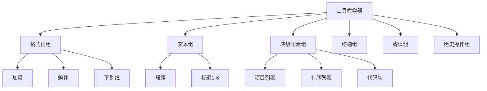
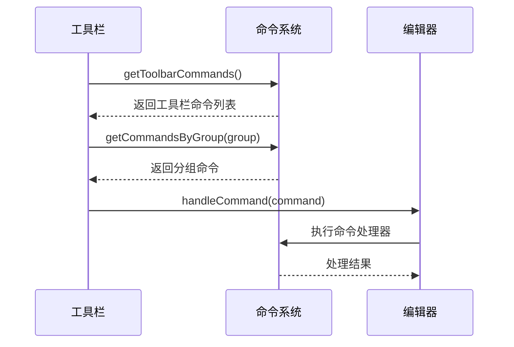

# 工具栏组件

<cite>
**本文档中引用的文件**  
- [toolbar.tsx](file://src/renderer/src/components/RichEditor/toolbar.tsx)
- [command.ts](file://src/renderer/src/components/RichEditor/command.ts)
- [CommandListPopover.tsx](file://src/renderer/src/components/RichEditor/CommandListPopover.tsx)
- [CodeToolbar/toolbar.tsx](file://src/renderer/src/components/CodeToolbar/toolbar.tsx)
- [SelectionService.ts](file://src/main/services/SelectionService.ts)
- [ShortcutService.ts](file://src/main/services/ShortcutService.ts)
- [useShortcuts.ts](file://src/renderer/src/hooks/useShortcuts.ts)
- [selection-toolbar.css](file://src/renderer/src/assets/styles/selection-toolbar.css)
</cite>

## 目录
1. [简介](#简介)
2. [布局结构](#布局结构)
3. [按钮分组与状态管理](#按钮分组与状态管理)
4. [命令系统集成](#命令系统集成)
5. [编辑操作与快捷键](#编辑操作与快捷键)
6. [上下文敏感显示逻辑](#上下文敏感显示逻辑)
7. [自定义配置方法](#自定义配置方法)
8. [CommandListPopover功能](#commandlistpopover功能)
9. [结论](#结论)

## 简介
工具栏组件是Cherry Studio中的核心UI元素，提供文本编辑、代码操作和内容管理功能。该组件包含富文本编辑器工具栏和代码块工具栏两种主要类型，支持动态命令注册、上下文敏感显示和快捷键绑定。工具栏通过与命令系统的深度集成，实现了灵活的扩展性和一致的用户体验。

**Section sources**
- [toolbar.tsx](file://src/renderer/src/components/RichEditor/toolbar.tsx#L1-L341)
- [CodeToolbar/toolbar.tsx](file://src/renderer/src/components/CodeToolbar/toolbar.tsx#L1-L74)

## 布局结构
工具栏组件采用模块化设计，主要由以下几个部分组成：

1. **容器层**：使用`ToolbarWrapper`组件包裹所有工具按钮，提供统一的样式和布局控制
2. **按钮组**：按功能分组显示工具按钮，组间通过分隔线(`ToolbarDivider`)区分
3. **定位机制**：选择文本时，工具栏会根据光标位置智能定位，支持多种对齐方式

工具栏的布局顺序遵循预定义的分组顺序：格式化、文本、块级元素、结构、媒体和历史操作。这种设计确保了用户界面的一致性和可预测性。



**Diagram sources**
- [toolbar.tsx](file://src/renderer/src/components/RichEditor/toolbar.tsx#L22-L23)
- [styles.ts](file://src/renderer/src/components/RichEditor/styles.ts#L52-L80)

**Section sources**
- [toolbar.tsx](file://src/renderer/src/components/RichEditor/toolbar.tsx#L22-L46)
- [styles.ts](file://src/renderer/src/components/RichEditor/styles.ts#L52-L80)

## 按钮分组与状态管理
工具栏按钮通过`getToolbarItems`函数生成，该函数根据预定义的分组顺序组织命令。每个按钮的状态由`getFormattingState`和`getDisabledState`函数管理，确保按钮的激活状态和可用性与当前编辑上下文保持同步。

按钮分组策略：
- **格式化组**：包含加粗、斜体、下划线等文本格式化操作
- **文本组**：提供段落和标题样式选择
- **块级元素组**：管理列表、代码块、引用等块级元素
- **媒体组**：处理图片、链接等媒体内容
- **历史操作组**：提供撤销和重做功能

状态管理机制通过`formattingState`对象跟踪当前选区的格式状态，包括是否已应用特定格式以及是否可以在当前上下文中应用该格式。

**Section sources**
- [toolbar.tsx](file://src/renderer/src/components/RichEditor/toolbar.tsx#L25-L46)
- [toolbar.tsx](file://src/renderer/src/components/RichEditor/toolbar.tsx#L164-L340)

## 命令系统集成
工具栏组件与`command.ts`中的命令系统深度集成，通过`registerCommand`和`getCommandsByGroup`等API实现动态命令管理。每个命令包含ID、标题、描述、图标、关键词和处理器函数等属性，支持在工具栏和命令面板中复用。

命令注册流程：
1. 定义命令对象，包含必要的元数据和处理器
2. 调用`registerToolbarCommand`将命令注册到全局命令注册表
3. 命令自动出现在相应的工具栏分组中

这种设计实现了命令的集中管理和跨组件复用，确保了用户界面的一致性。



**Diagram sources**
- [command.ts](file://src/renderer/src/components/RichEditor/command.ts#L68-L109)
- [toolbar.tsx](file://src/renderer/src/components/RichEditor/toolbar.tsx#L129-L138)

**Section sources**
- [command.ts](file://src/renderer/src/components/RichEditor/command.ts#L38-L109)
- [toolbar.tsx](file://src/renderer/src/components/RichEditor/toolbar.tsx#L129-L138)

## 编辑操作与快捷键
工具栏支持丰富的编辑操作，包括文本格式化、内容插入和结构修改。每个操作都关联相应的快捷键，用户可以通过键盘快速执行常用命令。

主要编辑操作：
- **文本格式化**：加粗、斜体、下划线、删除线
- **内容插入**：图片、链接、表格、数学公式
- **结构修改**：列表、引用、代码块、分隔线
- **历史操作**：撤销、重做

快捷键系统通过`useShortcuts`钩子和`ShortcutService`实现，支持用户自定义快捷键绑定。快捷键在`settings/shortcut`页面中配置，并通过`react-hotkeys-hook`库进行监听和处理。

**Section sources**
- [command.ts](file://src/renderer/src/components/RichEditor/command.ts#L139-L458)
- [useShortcuts.ts](file://src/renderer/src/hooks/useShortcuts.ts#L20-L60)
- [ShortcutService.ts](file://src/main/services/ShortcutService.ts#L24-L54)

## 上下文敏感显示逻辑
工具栏的显示逻辑具有上下文敏感性，根据当前编辑环境动态调整可见的工具按钮。这种机制通过`getDisabledState`函数实现，该函数检查当前选区是否支持特定操作。

上下文敏感规则：
- 在代码块中禁用富文本格式化命令
- 在表格内显示特定的表格操作按钮
- 根据光标位置决定是否显示插入图片按钮
- 在只读模式下禁用所有编辑命令

选择文本时，工具栏的显示行为由`SelectionService`控制，支持三种触发模式：选择文本、Ctrl键按下和自定义快捷键。工具栏在用户点击外部区域或按下非修饰键时自动隐藏。

**Section sources**
- [toolbar.tsx](file://src/renderer/src/components/RichEditor/toolbar.tsx#L308-L339)
- [SelectionService.ts](file://src/main/services/SelectionService.ts#L976-L1014)

## 自定义配置方法
开发者可以通过多种方式自定义工具栏布局和行为：

1. **添加新命令**：
```typescript
registerToolbarCommand({
  id: 'custom-command',
  title: '自定义命令',
  description: '执行自定义操作',
  icon: CustomIcon,
  handler: (editor) => {
    // 自定义逻辑
  },
  showInToolbar: true,
  toolbarGroup: 'formatting'
})
```

2. **修改按钮行为**：通过`setCommandAvailability`函数动态控制命令的可用性

3. **调整布局**：修改`TOOLBAR_GROUP_ORDER`常量来改变分组顺序

4. **样式定制**：通过CSS变量覆盖默认样式，如`--selection-toolbar-background`和`--selection-toolbar-button-text-color`

**Section sources**
- [command.ts](file://src/renderer/src/components/RichEditor/command.ts#L71-L136)
- [selection-toolbar.css](file://src/renderer/src/assets/styles/selection-toolbar.css#L7-L72)

## CommandListPopover功能
`CommandListPopover`组件提供命令搜索和导航功能，允许用户通过输入命令名称快速执行操作。该组件支持键盘导航，用户可以使用方向键选择命令，按Enter键执行。

主要特性：
- **虚拟滚动**：使用`DynamicVirtualList`实现高性能渲染，支持大量命令的流畅滚动
- **搜索过滤**：实时搜索命令标题、描述和关键词
- **键盘导航**：支持上下箭头选择、Enter执行、Esc关闭
- **主题适配**：自动适配亮色和暗色主题

命令面板通过`commandSuggestion`配置与编辑器集成，当用户输入"/"时自动显示。搜索结果按相关性排序，精确匹配优先显示。

```mermaid
flowchart TD
A[用户输入"/"] --> B{触发命令面板}
B --> C[获取所有命令]
C --> D[根据查询过滤]
D --> E[按相关性排序]
E --> F[渲染虚拟列表]
F --> G[用户选择命令]
G --> H[执行命令处理器]
H --> I[关闭面板]
```

**Diagram sources**
- [CommandListPopover.tsx](file://src/renderer/src/components/RichEditor/CommandListPopover.tsx#L24-L231)
- [command.ts](file://src/renderer/src/components/RichEditor/command.ts#L559-L668)

**Section sources**
- [CommandListPopover.tsx](file://src/renderer/src/components/RichEditor/CommandListPopover.tsx#L24-L231)
- [command.ts](file://src/renderer/src/components/RichEditor/command.ts#L559-L668)

## 结论
工具栏组件通过模块化设计和灵活的扩展机制，为Cherry Studio提供了强大而直观的编辑体验。其与命令系统的深度集成、上下文敏感的显示逻辑和可定制的布局结构，使得该组件既能满足基本的编辑需求，又能支持复杂的自定义场景。开发者可以通过注册新命令、调整布局和修改样式来满足特定的业务需求，同时保持一致的用户体验。