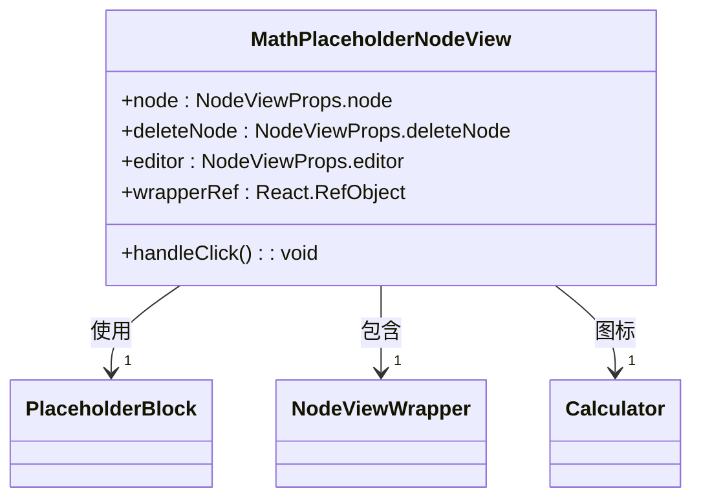
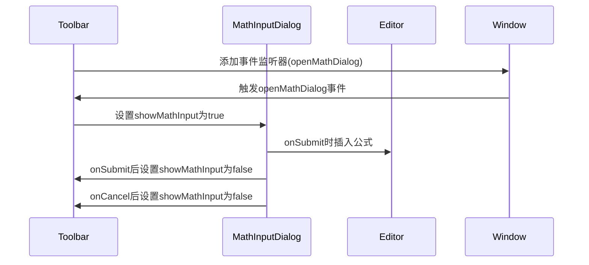
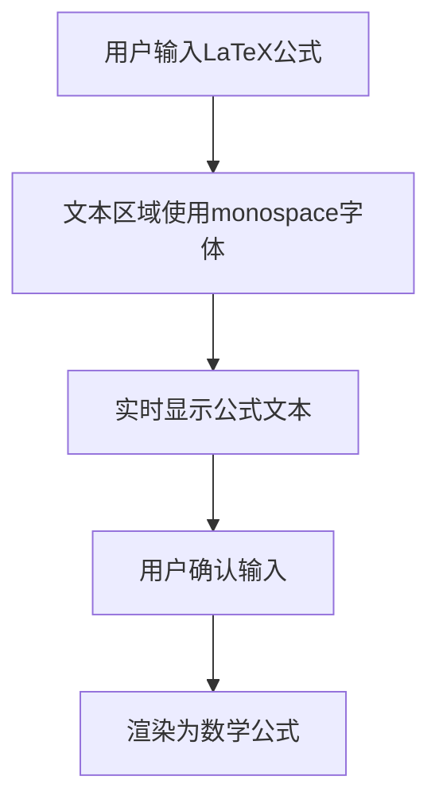
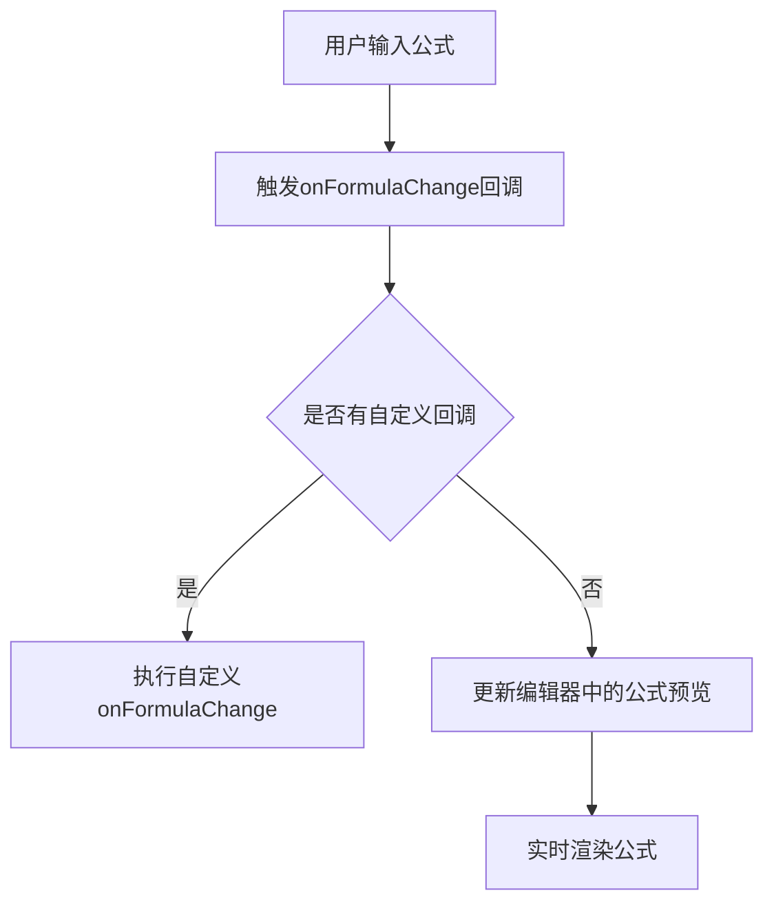
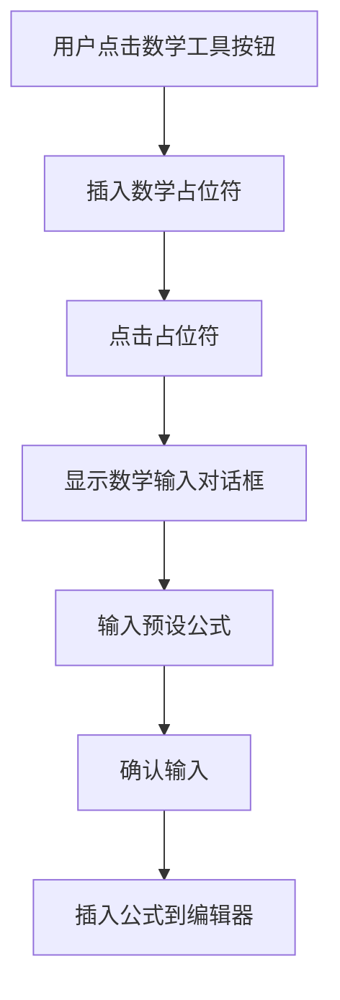
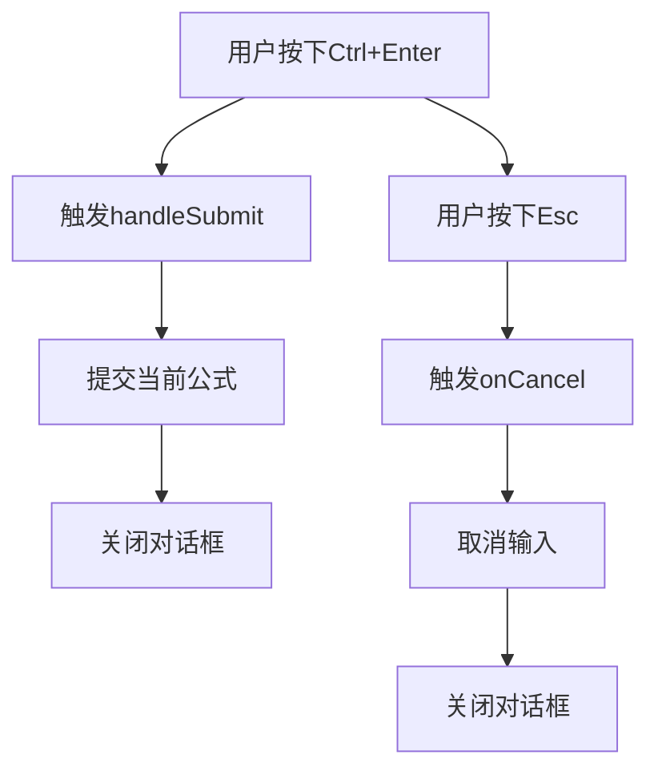
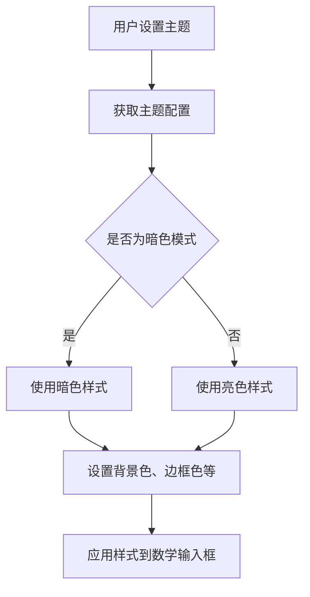
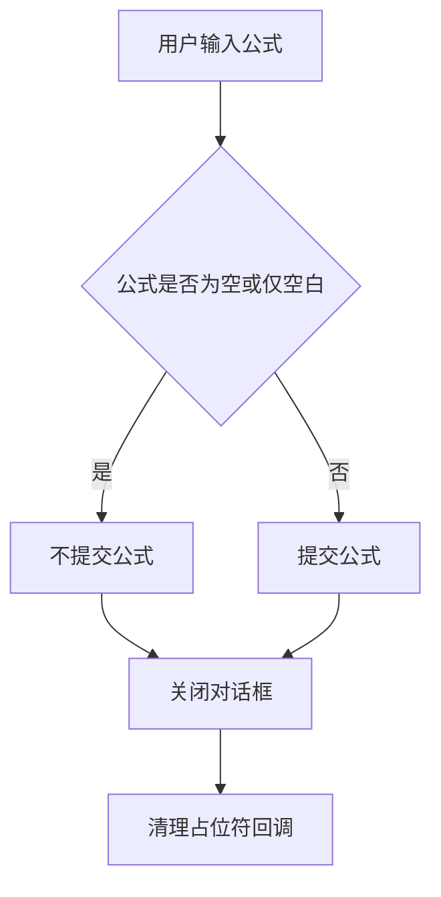
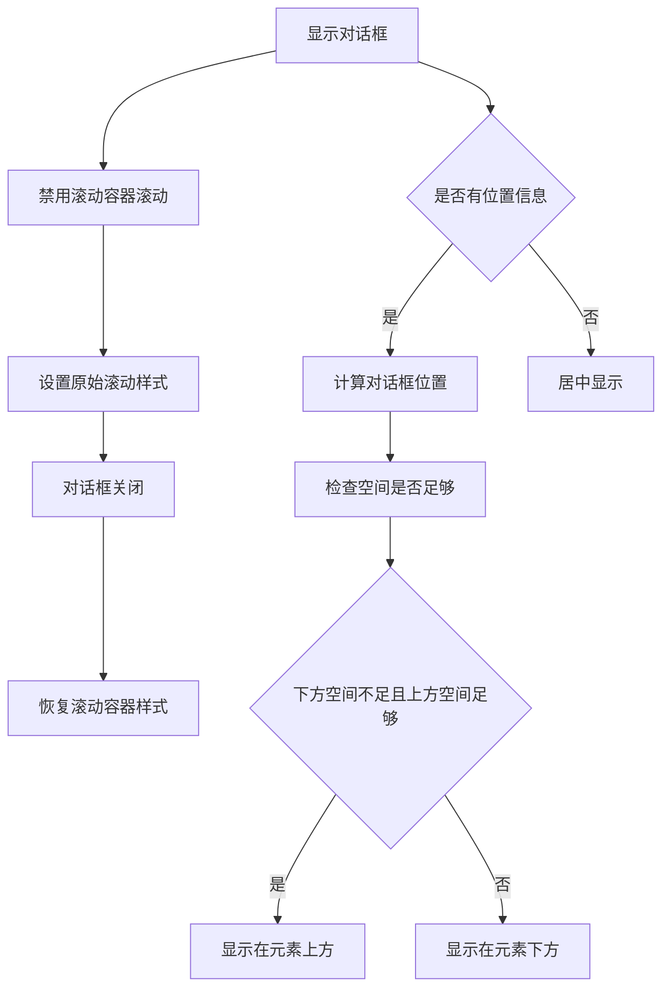

# 数学公式输入对话框

<cite>
**本文档引用的文件**
- [MathInputDialog.tsx](file://src/renderer/src/components/RichEditor/components/MathInputDialog.tsx)
- [enhanced-math.ts](file://src/renderer/src/components/RichEditor/extensions/enhanced-math.ts)
- [toolbar.tsx](file://src/renderer/src/components/RichEditor/toolbar.tsx)
- [MathPlaceholderNodeView.tsx](file://src/renderer/src/components/RichEditor/components/placeholder/MathPlaceholderNodeView.tsx)
- [PlaceholderBlock.tsx](file://src/renderer/src/components/RichEditor/components/placeholder/PlaceholderBlock.tsx)
- [markdownConverter.ts](file://src/renderer/src/utils/markdownConverter.ts)
- [useRichEditor.ts](file://src/renderer/src/components/RichEditor/useRichEditor.ts)
</cite>

## 目录
1. [简介](#简介)
2. [核心组件分析](#核心组件分析)
3. [架构与集成](#架构与集成)
4. [功能特性](#功能特性)
5. [使用示例](#使用示例)
6. [错误处理与边界情况](#错误处理与边界情况)

## 简介

数学公式输入对话框是一个内联对话框组件，用于在富文本编辑器中输入LaTeX数学公式。该组件提供了一个浮动的输入框，用户可以在其中输入数学表达式，支持实时预览和错误验证。对话框与enhanced-math扩展紧密集成，实现了从占位符到实际公式的无缝转换。

**Section sources**
- [MathInputDialog.tsx](file://src/renderer/src/components/RichEditor/components/MathInputDialog.tsx#L1-L162)

## 核心组件分析

### MathInputDialog 组件

MathInputDialog 组件是数学公式输入的核心UI组件，提供了一个简洁的对话框界面，允许用户输入LaTeX公式。

```mermaid
classDiagram
class MathInputDialog {
+visible : boolean
+onSubmit(formula : string) : void
+onCancel() : void
+defaultValue? : string
+onFormulaChange?(formula : string) : void
+position? : { x : number; y : number; top? : number }
+scrollContainer? : React.RefObject<HTMLDivElement | null>
-value : string
-containerRef : React.RefObject<HTMLDivElement>
+handleSubmit() : void
+handleKeyDown(e : KeyboardEvent) : void
+getPositionStyles() : CSSProperties
}
MathInputDialog --> "1" PlaceholderBlock : 使用
MathInputDialog --> "1" Input.TextArea : 包含
MathInputDialog --> "2" Button : 包含
```

**Diagram sources**
- [MathInputDialog.tsx](file://src/renderer/src/components/RichEditor/components/MathInputDialog.tsx#L6-L21)

### MathPlaceholderNodeView 组件

MathPlaceholderNodeView 组件是TipTap编辑器的节点视图，用于显示数学公式的占位符。当用户点击占位符时，会触发数学公式输入对话框。



**Diagram sources**
- [MathPlaceholderNodeView.tsx](file://src/renderer/src/components/RichEditor/components/placeholder/MathPlaceholderNodeView.tsx#L8-L74)

### PlaceholderBlock 组件

PlaceholderBlock 组件是一个可重用的占位符块，用于TipTap NodeViews（如数学、图像等）。它处理暗色模式的颜色和简单的悬停反馈。

```mermaid
classDiagram
class PlaceholderBlock {
+icon : React.ReactNode
+message : string
+onClick : () => void
+theme : Theme
+isDark : boolean
+colors : { border, background, hoverBorder, hoverBackground }
}
PlaceholderBlock --> "1" useTheme : 使用
```

**Diagram sources**
- [PlaceholderBlock.tsx](file://src/renderer/src/components/RichEditor/components/placeholder/PlaceholderBlock.tsx#L4-L63)

## 架构与集成

### enhanced-math 扩展

enhanced-math 扩展是数学公式功能的核心，它扩展了TipTap编辑器的功能，添加了对数学公式的支持。

```mermaid
classDiagram
class EnhancedMath {
+name : 'enhancedMath'
+addOptions() : { inlineOptions, blockOptions, katexOptions }
+addCommands() : { insertMathPlaceholder }
+addExtensions() : [BlockMath, InlineMath, Node]
}
EnhancedMath --> "1" BlockMath : 扩展
EnhancedMath --> "1" InlineMath : 扩展
EnhancedMath --> "1" Node : 创建
BlockMath --> "1" InputRule : 使用
InlineMath --> "1" InputRule : 使用
Node --> "1" MathPlaceholderNodeView : 使用
```

**Diagram sources**
- [enhanced-math.ts](file://src/renderer/src/components/RichEditor/extensions/enhanced-math.ts#L1-L124)

### 工具栏集成

工具栏组件集成了数学公式输入功能，通过监听自定义事件来显示和隐藏数学公式输入对话框。



**Diagram sources**
- [toolbar.tsx](file://src/renderer/src/components/RichEditor/toolbar.tsx#L95-L258)

## 功能特性

### LaTeX语法高亮

数学公式输入对话框通过monospace字体和特定的样式来实现LaTeX语法的视觉高亮，使用户能够清晰地看到输入的公式。



**Diagram sources**
- [MathInputDialog.tsx](file://src/renderer/src/components/RichEditor/components/MathInputDialog.tsx#L147)

### 实时预览

当用户在输入公式时，系统会实时更新预览，让用户能够立即看到公式的渲染效果。



**Diagram sources**
- [MathInputDialog.tsx](file://src/renderer/src/components/RichEditor/components/MathInputDialog.tsx#L144)
- [toolbar.tsx](file://src/renderer/src/components/RichEditor/toolbar.tsx#L241-L254)

### 错误验证

系统通过输入规则来验证LaTeX公式的正确性，确保用户输入的公式符合语法要求。

```mermaid
erDiagram
INPUT_RULE {
string find
function handler
string description
}
BLOCK_MATH_RULE {
string find: ^\\$\\$([^$]+)\\$\\$$
function handler: 处理块级数学公式
}
INLINE_MATH_RULE {
string find: (^|[^$])(\\$([^$\\n]+?)\\$)(?!\\$)
function handler: 处理行内数学公式
}
INPUT_RULE ||--o{ BLOCK_MATH_RULE : 包含
INPUT_RULE ||--o{ INLINE_MATH_RULE : 包含
```

**Diagram sources**
- [enhanced-math.ts](file://src/renderer/src/components/RichEditor/extensions/enhanced-math.ts#L46-L73)

## 使用示例

### 自定义预设公式

用户可以通过配置预设公式来快速插入常用的数学表达式。



**Section sources**
- [toolbar.tsx](file://src/renderer/src/components/RichEditor/toolbar.tsx#L132-L135)
- [MathPlaceholderNodeView.tsx](file://src/renderer/src/components/RichEditor/components/placeholder/MathPlaceholderNodeView.tsx#L12-L62)

### 快捷键绑定

系统支持通过快捷键快速插入数学公式，提高用户的输入效率。



**Section sources**
- [MathInputDialog.tsx](file://src/renderer/src/components/RichEditor/components/MathInputDialog.tsx#L89-L93)

### 渲染样式配置

用户可以根据自己的偏好配置数学公式的渲染样式，包括字体、颜色等。



**Section sources**
- [MathInputDialog.tsx](file://src/renderer/src/components/RichEditor/components/MathInputDialog.tsx#L95-L133)
- [PlaceholderBlock.tsx](file://src/renderer/src/components/RichEditor/components/placeholder/PlaceholderBlock.tsx#L19-L26)

## 错误处理与边界情况

### 无效输入处理

当用户输入无效的LaTeX公式时，系统会进行相应的处理，确保编辑器的稳定性。



**Section sources**
- [MathInputDialog.tsx](file://src/renderer/src/components/RichEditor/components/MathInputDialog.tsx#L83-L87)
- [toolbar.tsx](file://src/renderer/src/components/RichEditor/toolbar.tsx#L210-L215)

### 边界情况处理

系统考虑了多种边界情况，如滚动容器的处理、对话框位置的自动调整等。



**Section sources**
- [MathInputDialog.tsx](file://src/renderer/src/components/RichEditor/components/MathInputDialog.tsx#L49-L66)
- [MathInputDialog.tsx](file://src/renderer/src/components/RichEditor/components/MathInputDialog.tsx#L97-L115)