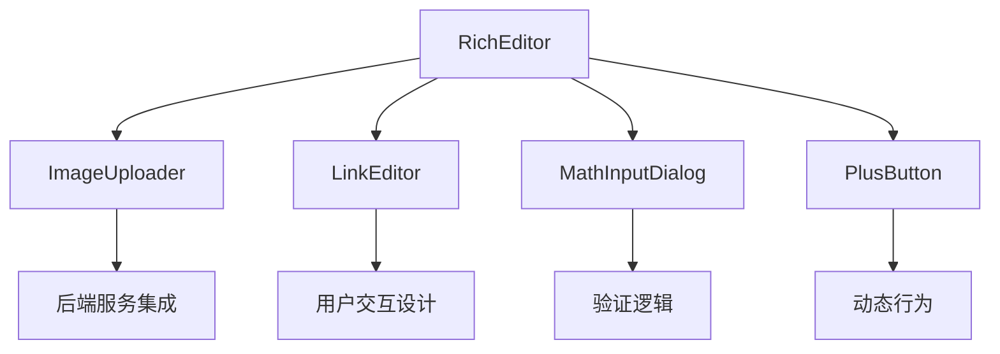
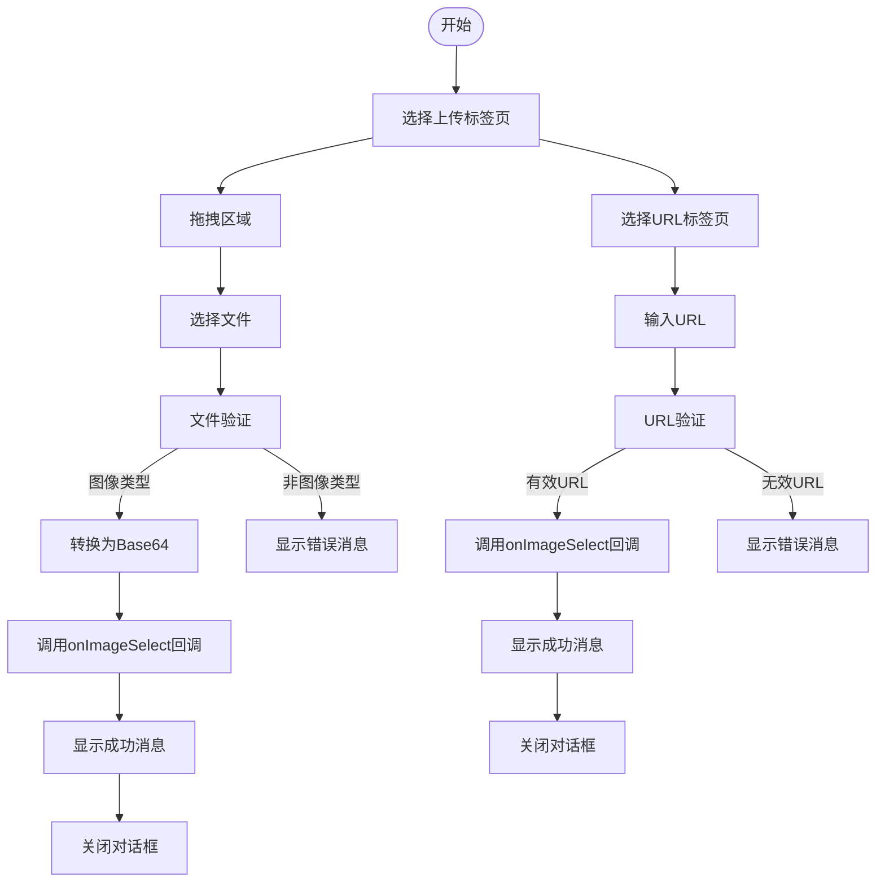
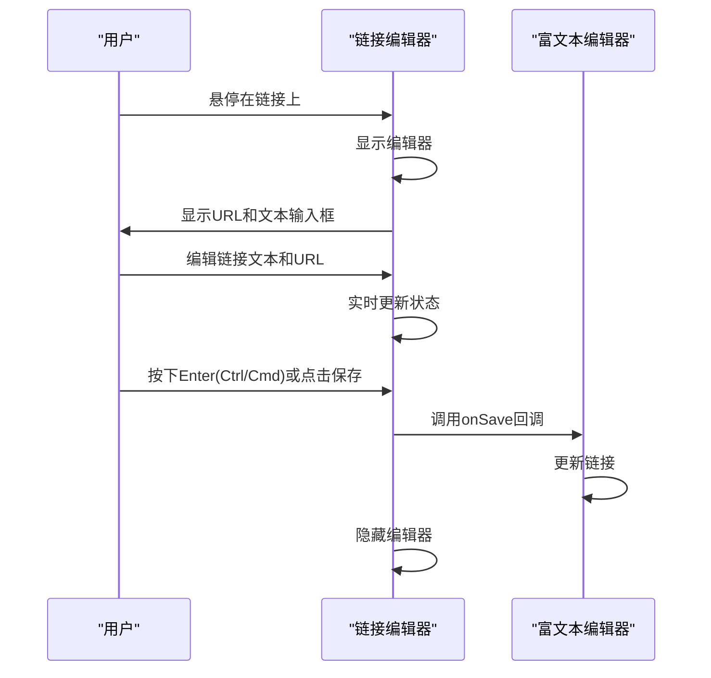
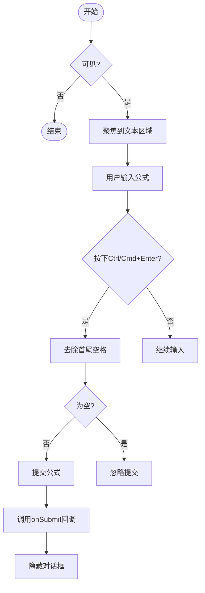
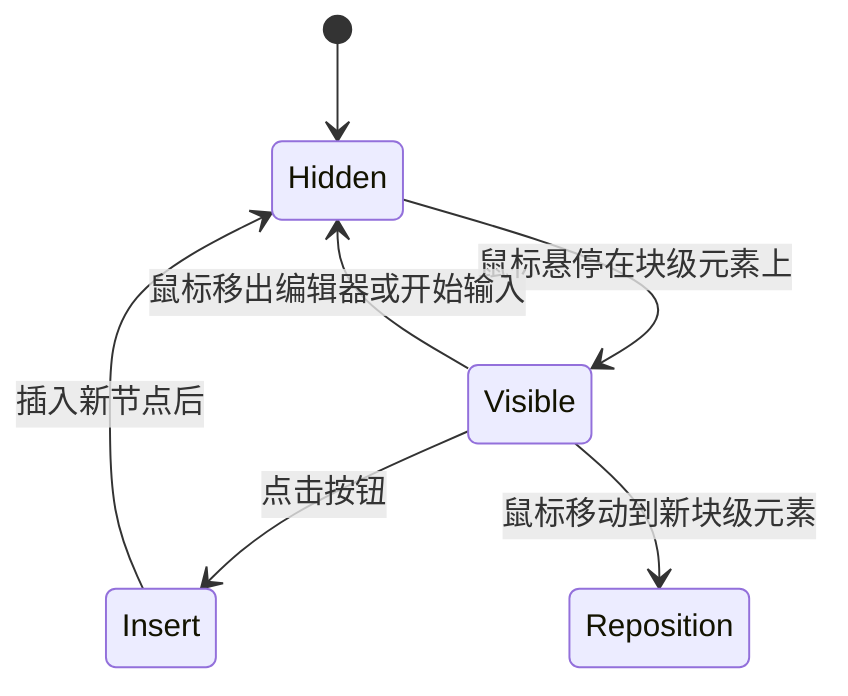
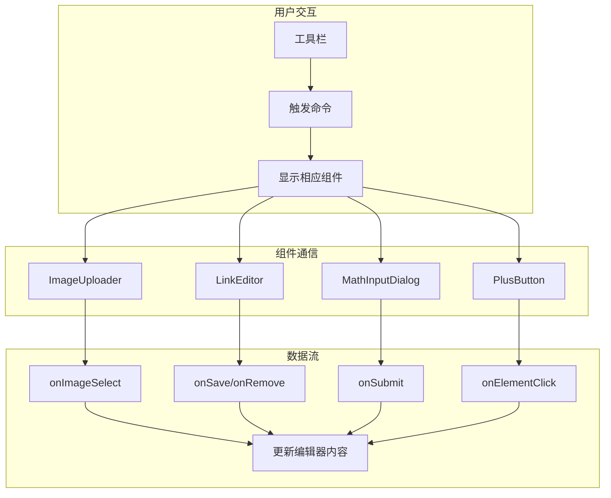

# 核心UI组件

<cite>
**本文档引用的文件**
- [ImageUploader.tsx](file://src/renderer/src/components/RichEditor/components/ImageUploader.tsx)
- [LinkEditor.tsx](file://src/renderer/src/components/RichEditor/components/LinkEditor.tsx)
- [MathInputDialog.tsx](file://src/renderer/src/components/RichEditor/components/MathInputDialog.tsx)
- [PlusButton.tsx](file://src/renderer/src/components/RichEditor/components/PlusButton.tsx)
- [toolbar.tsx](file://src/renderer/src/components/RichEditor/toolbar.tsx)
- [types.ts](file://src/renderer/src/components/RichEditor/types.ts)
- [styles.ts](file://src/renderer/src/components/RichEditor/styles.ts)
- [plusButtonPlugin.ts](file://src/renderer/src/components/RichEditor/plugins/plusButtonPlugin.ts)
</cite>

## 目录
1. [简介](#简介)
2. [核心组件概览](#核心组件概览)
3. [ImageUploader 图像上传组件](#imageuploader-图像上传组件)
4. [LinkEditor 链接编辑器](#linkeditor-链接编辑器)
5. [MathInputDialog 数学公式输入对话框](#mathinputdialog-数学公式输入对话框)
6. [PlusButton 加号按钮](#plusbutton-加号按钮)
7. [组件组合使用最佳实践](#组件组合使用最佳实践)
8. [结论](#结论)

## 简介
本文档详细描述了富文本编辑器中的四个核心UI组件：ImageUploader（图像上传）、LinkEditor（链接编辑）、MathInputDialog（数学公式输入）和PlusButton（加号按钮）。这些组件共同构成了编辑器的核心交互体验，提供了丰富的文本编辑功能。文档将深入分析每个组件的实现细节、接口定义、事件回调和样式定制方法，并提供组件组合使用的最佳实践。

## 核心组件概览
富文本编辑器的核心UI组件采用模块化设计，每个组件都有明确的职责和接口。这些组件通过事件系统和状态管理进行通信，共同构建完整的编辑体验。ImageUploader负责图像的上传和嵌入，LinkEditor提供链接的编辑功能，MathInputDialog处理数学公式的输入，而PlusButton则提供动态的内容插入功能。

**组件来源**
- [ImageUploader.tsx](file://src/renderer/src/components/RichEditor/components/ImageUploader.tsx)
- [LinkEditor.tsx](file://src/renderer/src/components/RichEditor/components/LinkEditor.tsx)
- [MathInputDialog.tsx](file://src/renderer/src/components/RichEditor/components/MathInputDialog.tsx)
- [PlusButton.tsx](file://src/renderer/src/components/RichEditor/components/PlusButton.tsx)

## ImageUploader 图像上传组件

### 实现细节
ImageUploader组件提供了一个模态对话框，支持两种图像插入方式：文件上传和URL嵌入。组件使用Ant Design的Modal、Upload和Tabs组件构建用户界面，通过base64编码实现本地文件的预览和上传。

**组件来源**
- [ImageUploader.tsx](file://src/renderer/src/components/RichEditor/components/ImageUploader.tsx#L1-L207)

### 接口与事件
ImageUploader组件的主要props接口包括：
- `onImageSelect`: 图像选择后的回调函数，接收图像URL作为参数
- `visible`: 控制对话框可见性的布尔值
- `onClose`: 对话框关闭时的回调函数

组件实现了完整的文件验证逻辑，包括文件类型检查（必须为图像）和文件大小限制（小于10MB）。对于URL嵌入，组件使用JavaScript的URL构造函数进行基本的URL格式验证。

### 后端服务集成
虽然当前实现主要使用base64编码将图像嵌入文档，但组件的设计为后端服务集成提供了良好的扩展性。`onImageSelect`回调可以被实现为向后端服务器上传文件并返回持久化URL的逻辑，从而支持大规模图像存储和管理。

**组件来源**
- [ImageUploader.tsx](file://src/renderer/src/components/RichEditor/components/ImageUploader.tsx#L10-L17)

## LinkEditor 链接编辑器

### 用户交互设计
LinkEditor是一个浮动的内联编辑器，当用户悬停在链接上时出现。组件采用固定定位（fixed positioning）确保在滚动时保持可见，并实现了点击外部区域自动关闭的功能。

**组件来源**
- [LinkEditor.tsx](file://src/renderer/src/components/RichEditor/components/LinkEditor.tsx#L1-L167)

### 实现细节
LinkEditor组件通过`position` prop接收显示位置，并使用`link` prop获取当前链接的属性。组件实现了键盘快捷键支持，包括Ctrl/Cmd+Enter保存和Escape取消。为了防止点击事件冒泡，组件使用了事件委托和元素包含检查。

组件的样式根据主题动态调整，支持深色和浅色模式。通过`showRemove` prop可以控制是否显示删除按钮，提供了灵活的配置选项。

### 接口与事件
LinkEditor组件的主要props接口包括：
- `visible`: 控制编辑器可见性的布尔值
- `position`: 编辑器的显示位置坐标
- `link`: 当前链接的属性对象，包含href和text
- `onSave`: 保存链接时的回调函数
- `onRemove`: 删除链接时的回调函数
- `onCancel`: 取消编辑时的回调函数
- `showRemove`: 是否显示删除按钮的布尔值

**组件来源**
- [LinkEditor.tsx](file://src/renderer/src/components/RichEditor/components/LinkEditor.tsx#L6-L21)

## MathInputDialog 数学公式输入对话框

### 验证逻辑
MathInputDialog组件提供了一个简洁的数学公式输入界面，支持LaTeX语法。组件实现了基本的输入验证，确保用户输入非空内容后才能提交。

**组件来源**
- [MathInputDialog.tsx](file://src/renderer/src/components/RichEditor/components/MathInputDialog.tsx#L1-L162)

### 实现细节
组件使用多行文本输入框（TextArea）支持复杂的数学公式输入，并实现了智能定位功能，能够根据屏幕空间自动选择在元素上方或下方显示。为了防止滚动冲突，组件在显示时会临时禁用滚动容器的滚动条。

组件支持实时更新回调（`onFormulaChange`），允许父组件监听公式输入的变化。通过`scrollContainer` prop，组件可以获取滚动容器的引用，实现更精确的滚动控制。

### 接口与事件
MathInputDialog组件的主要props接口包括：
- `visible`: 控制对话框可见性的布尔值
- `onSubmit`: 提交公式时的回调函数
- `onCancel`: 取消输入时的回调函数
- `defaultValue`: 初始LaTeX值
- `onFormulaChange`: 公式变化时的实时回调
- `position`: 相对于目标元素的位置
- `scrollContainer`: 滚动容器的引用，用于防止滚动冲突

**组件来源**
- [MathInputDialog.tsx](file://src/renderer/src/components/RichEditor/components/MathInputDialog.tsx#L6-L21)

## PlusButton 加号按钮

### 动态行为
PlusButton组件实现了智能的动态行为，根据鼠标位置自动显示在块级元素的左侧。组件使用ProseMirror的插件系统实现复杂的交互逻辑，包括鼠标移动检测、节点变化监听和位置自动更新。

**组件来源**
- [PlusButton.tsx](file://src/renderer/src/components/RichEditor/components/PlusButton.tsx#L1-L81)
- [plusButtonPlugin.ts](file://src/renderer/src/components/RichEditor/plugins/plusButtonPlugin.ts#L1-L260)

### 实现细节
PlusButton组件基于ProseMirror插件系统构建，通过`PlusButtonPlugin`实现核心功能。组件使用Floating UI库进行精确的位置计算，确保按钮始终正确地定位在目标元素旁边。

组件的动态行为包括：
- 鼠标移动时自动检测最近的块级元素
- 根据元素位置自动重新定位按钮
- 输入开始时自动隐藏按钮
- 滚动时自动隐藏按钮
- 点击时插入新节点并设置光标位置

### 接口与事件
PlusButton组件的主要props接口包括：
- `className`: 自定义CSS类名
- `children`: 按钮的子元素
- `editor`: 富文本编辑器实例
- `pluginKey`: 插件键，用于唯一标识
- `onNodeChange`: 节点变化时的回调函数
- `onElementClick`: 按钮点击时的回调函数
- `computePositionConfig`: 位置计算配置

**组件来源**
- [PlusButton.tsx](file://src/renderer/src/components/RichEditor/components/PlusButton.tsx#L12-L16)

## 组件组合使用最佳实践

### 构建完整编辑体验
这些核心UI组件通过事件系统和状态管理协同工作，构建完整的编辑体验。以下是组件组合使用的推荐模式：

**组件来源**
- [toolbar.tsx](file://src/renderer/src/components/RichEditor/toolbar.tsx#L81-L215)

### 集成模式
1. **工具栏集成**：在工具栏中添加按钮，点击时触发相应组件的显示
2. **快捷键支持**：结合键盘事件，实现快捷键触发组件显示
3. **上下文感知**：根据编辑器状态动态显示或隐藏组件
4. **主题一致性**：确保所有组件遵循相同的视觉设计语言

### 性能优化
- **懒加载**：仅在需要时创建组件实例
- **事件节流**：对频繁触发的事件（如鼠标移动）进行节流处理
- **内存管理**：及时清理不再使用的组件和事件监听器
- **样式优化**：使用CSS变量实现主题切换，避免重复的样式计算

## 结论
本文档详细分析了富文本编辑器的四个核心UI组件：ImageUploader、LinkEditor、MathInputDialog和PlusButton。这些组件通过精心设计的接口和事件系统，提供了丰富的编辑功能和流畅的用户体验。通过理解这些组件的实现细节和最佳实践，开发者可以有效地扩展和定制编辑器功能，构建满足特定需求的编辑体验。