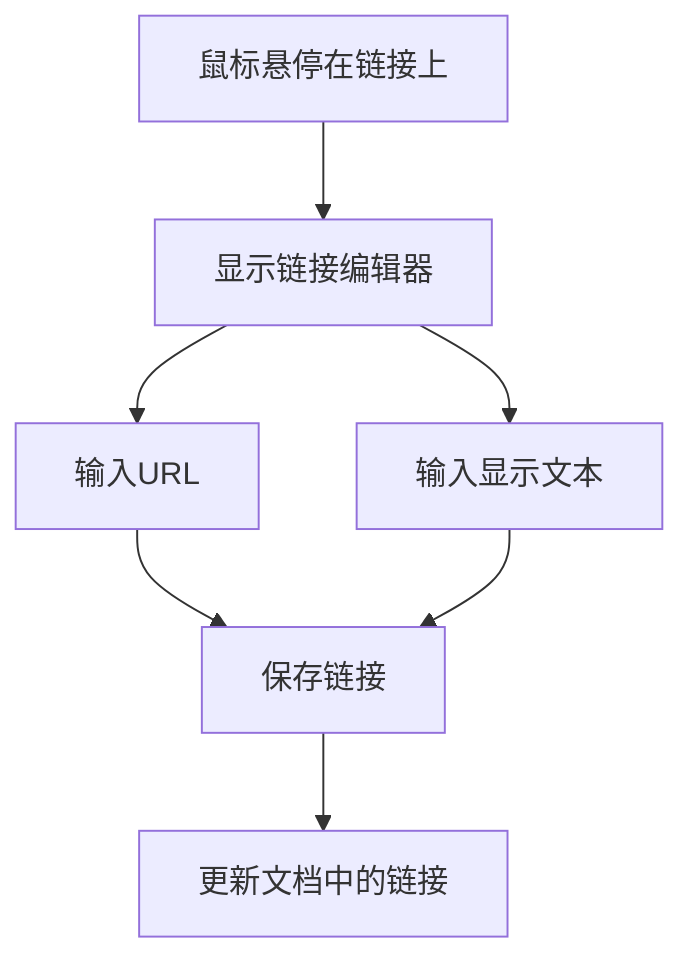
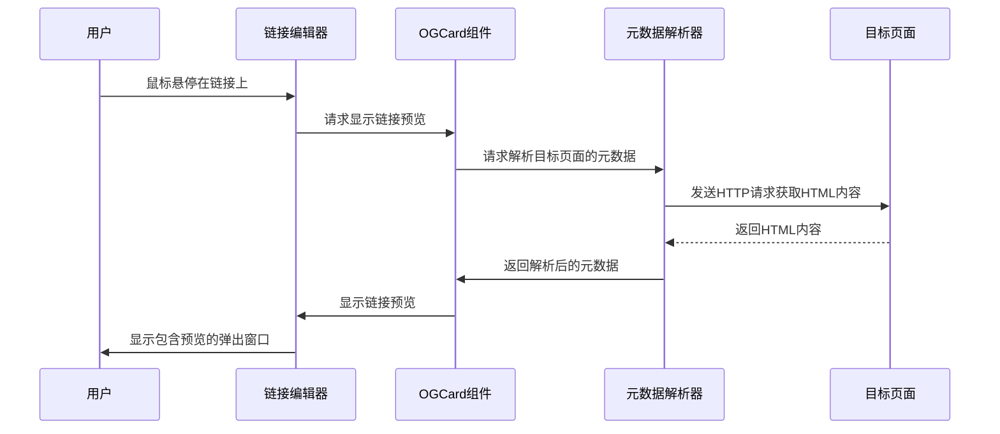

# 链接编辑器

<cite>
**本文档引用的文件**  
- [enhanced-link.ts](file://src/renderer/src/components/RichEditor/extensions/enhanced-link.ts)
- [LinkEditor.tsx](file://src/renderer/src/components/RichEditor/components/LinkEditor.tsx)
- [useRichEditor.ts](file://src/renderer/src/components/RichEditor/useRichEditor.ts)
- [Hyperlink.tsx](file://src/renderer/src/pages/home/Markdown/Hyperlink.tsx)
- [linkConverter.ts](file://src/renderer/src/utils/linkConverter.ts)
- [OGCard.tsx](file://src/renderer/src/components/OGCard.tsx)
- [useMetaDataParser.ts](file://src/renderer/src/hooks/useMetaDataParser.ts)
</cite>

## 目录
1. [简介](#简介)
2. [用户界面设计](#用户界面设计)
3. [交互逻辑](#交互逻辑)
4. [URL输入验证](#url输入验证)
5. [链接文本自动检测](#链接文本自动检测)
6. [协议补全功能](#协议补全功能)
7. [与enhanced-link扩展的协作机制](#与enhanced-link扩展的协作机制)
8. [支持的链接类型](#支持的链接类型)
9. [安全过滤规则](#安全过滤规则)
10. [自定义验证规则配置](#自定义验证规则配置)
11. [默认参数注入](#默认参数注入)
12. [链接预览功能](#链接预览功能)

## 简介
链接编辑器是Cherry Studio中的一个核心组件，用于在富文本编辑器中创建和管理超链接。该组件提供了一个直观的用户界面，允许用户轻松地添加、编辑和删除链接。链接编辑器不仅支持基本的链接功能，还集成了高级特性，如自动协议补全、链接预览和安全过滤。通过与enhanced-link扩展的紧密协作，链接编辑器能够提供更加丰富和安全的用户体验。

**Section sources**
- [enhanced-link.ts](file://src/renderer/src/components/RichEditor/extensions/enhanced-link.ts#L1-L406)
- [LinkEditor.tsx](file://src/renderer/src/components/RichEditor/components/LinkEditor.tsx#L1-L167)

## 用户界面设计
链接编辑器的用户界面设计简洁而直观，旨在提供最佳的用户体验。当用户将鼠标悬停在已存在的链接上时，会弹出一个内联的链接编辑器，允许用户直接编辑链接的URL和显示文本。链接编辑器包含两个输入框：一个用于输入链接的URL，另一个用于输入链接的显示文本。此外，还提供了一个保存按钮和一个取消按钮，以及一个可选的删除按钮，用于移除链接。

**Diagram sources**
- [LinkEditor.tsx](file://src/renderer/src/components/RichEditor/components/LinkEditor.tsx#L1-L167)

**Section sources**
- [LinkEditor.tsx](file://src/renderer/src/components/RichEditor/components/LinkEditor.tsx#L1-L167)

## 交互逻辑
链接编辑器的交互逻辑设计得非常流畅。当用户开始编辑链接时，链接编辑器会自动获取焦点，并允许用户立即开始输入。用户可以通过点击保存按钮或按下Ctrl+Enter组合键来保存更改。如果用户不想保存更改，可以点击取消按钮或按下Esc键来关闭链接编辑器而不做任何更改。此外，如果启用了删除功能，用户还可以通过点击删除按钮来移除链接。

**Section sources**
- [LinkEditor.tsx](file://src/renderer/src/components/RichEditor/components/LinkEditor.tsx#L1-L167)

## URL输入验证
链接编辑器对URL输入进行了严格的验证，以确保所有链接都是有效的。当用户输入URL时，系统会检查URL是否符合标准格式，包括是否包含必要的协议（如http、https、mailto等）。如果URL不符合标准格式，链接编辑器会提示用户进行修正。此外，系统还会检查URL是否指向一个可访问的资源，以防止用户创建无效的链接。

**Section sources**
- [enhanced-link.ts](file://src/renderer/src/components/RichEditor/extensions/enhanced-link.ts#L242-L264)

## 链接文本自动检测
链接编辑器具备智能的链接文本自动检测功能。当用户输入文本时，系统会自动检测文本中是否包含潜在的链接。如果检测到潜在的链接，系统会自动将其转换为可点击的链接。例如，如果用户输入了"www.example.com"，系统会自动将其转换为"[www.example.com](http://www.example.com)"。这一功能极大地提高了用户的编辑效率，减少了手动创建链接的需要。

**Section sources**
- [enhanced-link.ts](file://src/renderer/src/components/RichEditor/extensions/enhanced-link.ts#L242-L264)

## 协议补全功能
链接编辑器提供了自动协议补全功能，以简化用户的链接创建过程。当用户输入一个没有指定协议的域名时，系统会自动为其添加"https://"前缀。例如，如果用户输入"example.com"，系统会自动将其转换为"https://example.com"。这一功能确保了所有链接都能正确地指向目标资源，避免了因缺少协议而导致的链接失效问题。

**Section sources**
- [enhanced-link.ts](file://src/renderer/src/components/RichEditor/extensions/enhanced-link.ts#L242-L264)

## 与enhanced-link扩展的协作机制
链接编辑器与enhanced-link扩展紧密协作，共同提供了丰富的链接管理功能。enhanced-link扩展负责处理链接的底层逻辑，如链接的创建、更新和删除，而链接编辑器则负责提供用户界面和交互逻辑。两者通过事件机制进行通信，确保了数据的一致性和操作的同步性。例如，当用户在链接编辑器中修改链接时，链接编辑器会触发相应的事件，通知enhanced-link扩展更新文档中的链接。

**Section sources**
- [enhanced-link.ts](file://src/renderer/src/components/RichEditor/extensions/enhanced-link.ts#L1-L406)
- [useRichEditor.ts](file://src/renderer/src/components/RichEditor/useRichEditor.ts#L1-L870)

## 支持的链接类型
链接编辑器支持多种类型的链接，包括HTTP、HTTPS、mailto和自定义协议。对于HTTP和HTTPS链接，系统会自动验证URL的有效性，并确保其指向一个可访问的资源。对于mailto链接，系统会检查邮箱地址的格式是否正确。对于自定义协议，系统允许用户指定任意的协议前缀，但会提醒用户注意安全性。

**Section sources**
- [enhanced-link.ts](file://src/renderer/src/components/RichEditor/extensions/enhanced-link.ts#L312-L313)

## 安全过滤规则
为了保护用户免受恶意链接的侵害，链接编辑器实施了一系列安全过滤规则。这些规则包括但不限于：禁止使用JavaScript协议（如javascript:alert('XSS')），限制外部链接的访问，以及对可疑的URL进行警告。此外，系统还会定期更新黑名单，以阻止已知的恶意网站。

**Section sources**
- [blacklistMatchPattern.ts](file://src/renderer/src/utils/blacklistMatchPattern.ts#L43-L86)

## 自定义验证规则配置
链接编辑器允许开发者配置自定义的验证规则，以满足特定的应用需求。通过在配置文件中定义验证规则，开发者可以控制哪些类型的链接是允许的，哪些是禁止的。例如，可以配置规则只允许特定域名的链接，或者禁止包含特定关键词的链接。这种灵活性使得链接编辑器能够适应各种不同的应用场景。

**Section sources**
- [ProxyManager.ts](file://src/main/services/ProxyManager.ts#L55-L159)

## 默认参数注入
链接编辑器支持默认参数注入功能，可以在创建新链接时自动填充一些常用的参数。例如，可以配置系统在创建HTTP链接时自动添加查询参数，如utm_source=cherry-studio。这一功能不仅简化了用户的操作，还有助于统一链接的格式和追踪来源。

**Section sources**
- [AssistantModelSettings.tsx](file://src/renderer/src/pages/settings/AssistantSettings/AssistantModelSettings.tsx#L110-L143)

## 链接预览功能
链接编辑器集成了链接预览功能，允许用户在不离开当前页面的情况下查看链接的目标内容。当用户将鼠标悬停在链接上时，系统会自动抓取目标页面的元数据（如标题、描述和缩略图），并显示在一个弹出窗口中。这一功能极大地提升了用户体验，使用户能够快速了解链接的内容，而无需实际跳转到目标页面。

**Diagram sources**
- [Hyperlink.tsx](file://src/renderer/src/pages/home/Markdown/Hyperlink.tsx#L1-L43)
- [OGCard.tsx](file://src/renderer/src/components/OGCard.tsx#L1-L87)
- [useMetaDataParser.ts](file://src/renderer/src/hooks/useMetaDataParser.ts#L1-L37)

**Section sources**
- [Hyperlink.tsx](file://src/renderer/src/pages/home/Markdown/Hyperlink.tsx#L1-L43)
- [OGCard.tsx](file://src/renderer/src/components/OGCard.tsx#L1-L87)
- [useMetaDataParser.ts](file://src/renderer/src/hooks/useMetaDataParser.ts#L1-L37)