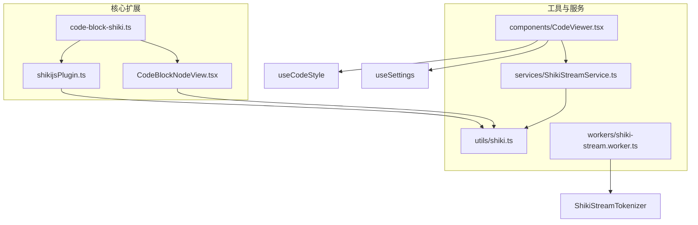
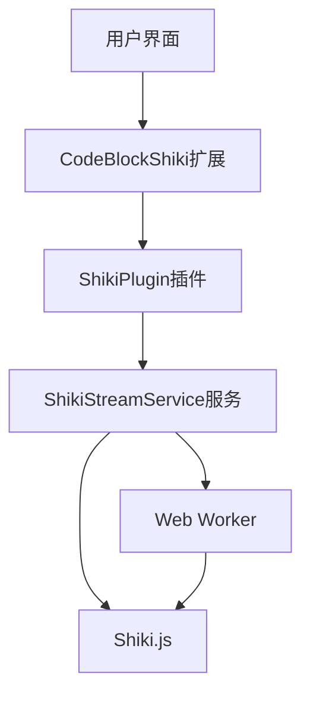
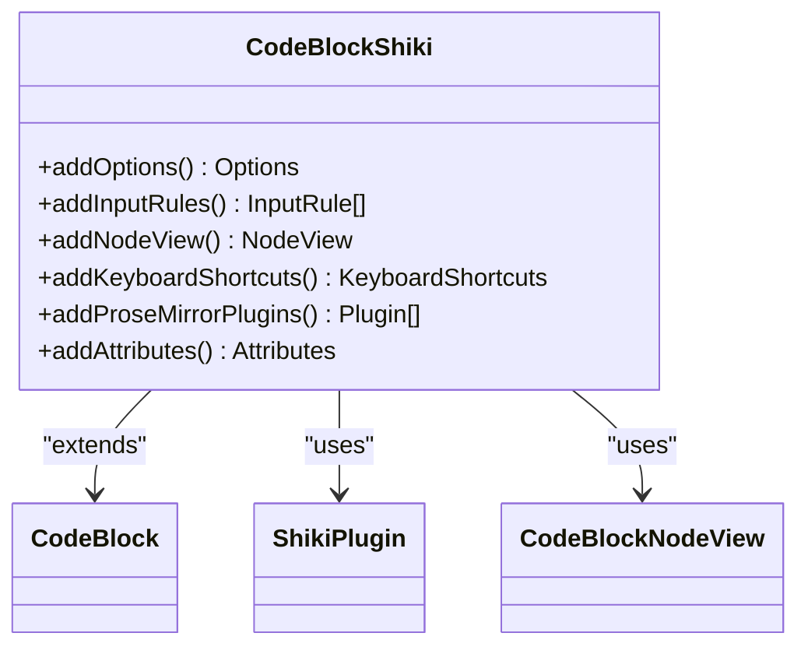
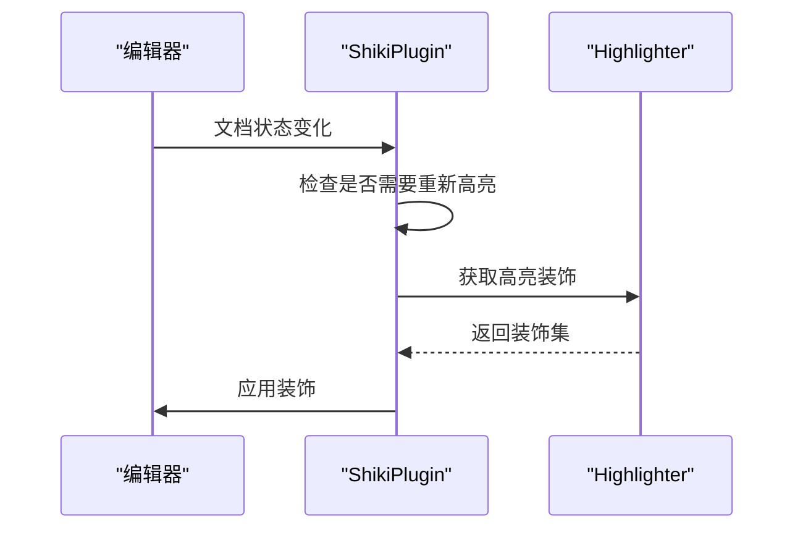
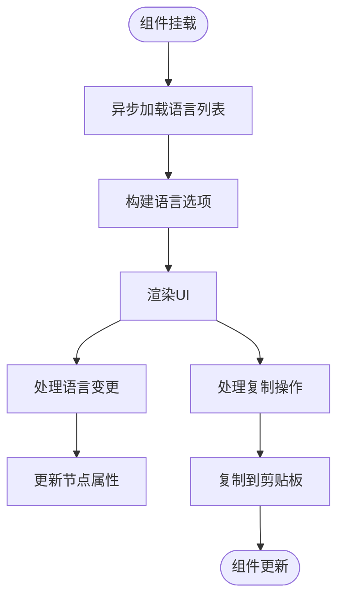
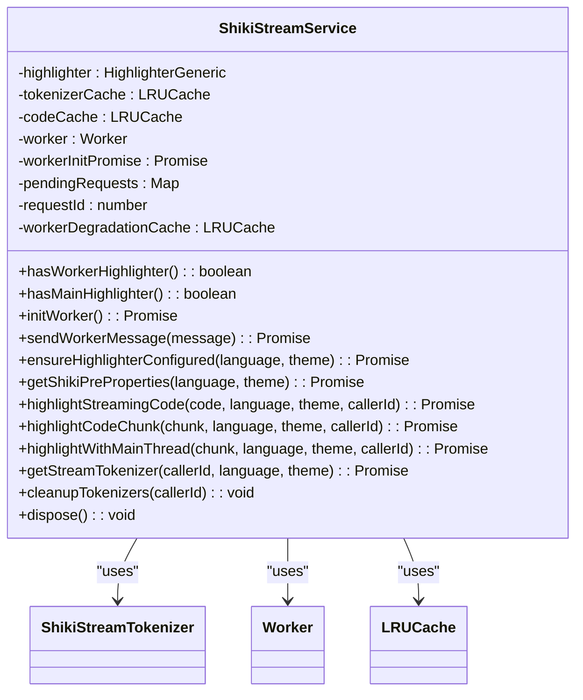
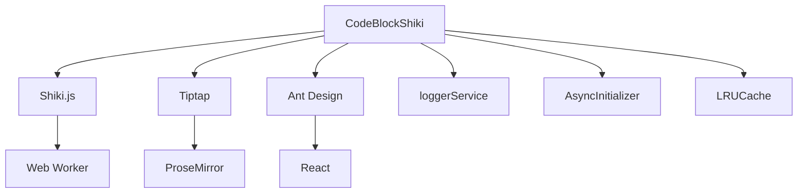

# 代码块高亮扩展

<cite>
**本文档引用的文件**  
- [code-block-shiki.ts](file://src/renderer/src/components/RichEditor/extensions/code-block-shiki/code-block-shiki.ts)
- [shikijsPlugin.ts](file://src/renderer/src/components/RichEditor/extensions/code-block-shiki/shikijsPlugin.ts)
- [CodeBlockNodeView.tsx](file://src/renderer/src/components/RichEditor/extensions/code-block-shiki/CodeBlockNodeView.tsx)
- [shiki.ts](file://src/renderer/src/utils/shiki.ts)
- [ShikiStreamService.ts](file://src/renderer/src/services/ShikiStreamService.ts)
- [CodeViewer.tsx](file://src/renderer/src/components/CodeViewer.tsx)
- [shiki-stream.worker.ts](file://src/renderer/src/workers/shiki-stream.worker.ts)
- [languages.ts](file://packages/shared/config/languages.ts)
</cite>

## 目录
1. [简介](#简介)
2. [项目结构](#项目结构)
3. [核心组件](#核心组件)
4. [架构概述](#架构概述)
5. [详细组件分析](#详细组件分析)
6. [依赖分析](#依赖分析)
7. [性能考虑](#性能考虑)
8. [故障排除指南](#故障排除指南)
9. [结论](#结论)

## 简介
代码块高亮扩展是Cherry Studio中的一个关键功能，它通过集成Shiki.js实现了强大的语法高亮能力。该扩展不仅支持多种编程语言和主题，还通过优化的渲染机制和错误处理策略确保了高性能和稳定性。本文档将深入分析该扩展的实现细节，包括其架构、核心组件、性能优化策略以及与其他编辑器功能的集成方式。

## 项目结构
代码块高亮扩展的实现主要分布在`src/renderer/src/components/RichEditor/extensions/code-block-shiki`目录下，相关工具和服务则分散在`src/renderer/src/utils`和`src/renderer/src/services`目录中。该扩展通过模块化设计，将不同的功能分离到独立的文件中，便于维护和扩展。

**Diagram sources**
- [code-block-shiki.ts](file://src/renderer/src/components/RichEditor/extensions/code-block-shiki/code-block-shiki.ts)
- [shikijsPlugin.ts](file://src/renderer/src/components/RichEditor/extensions/code-block-shiki/shikijsPlugin.ts)
- [CodeBlockNodeView.tsx](file://src/renderer/src/components/RichEditor/extensions/code-block-shiki/CodeBlockNodeView.tsx)
- [shiki.ts](file://src/renderer/src/utils/shiki.ts)
- [ShikiStreamService.ts](file://src/renderer/src/services/ShikiStreamService.ts)
- [CodeViewer.tsx](file://src/renderer/src/components/CodeViewer.tsx)
- [shiki-stream.worker.ts](file://src/renderer/src/workers/shiki-stream.worker.ts)

**Section sources**
- [code-block-shiki.ts](file://src/renderer/src/components/RichEditor/extensions/code-block-shiki/code-block-shiki.ts)
- [shikijsPlugin.ts](file://src/renderer/src/components/RichEditor/extensions/code-block-shiki/shikijsPlugin.ts)
- [CodeBlockNodeView.tsx](file://src/renderer/src/components/RichEditor/extensions/code-block-shiki/CodeBlockNodeView.tsx)
- [shiki.ts](file://src/renderer/src/utils/shiki.ts)
- [ShikiStreamService.ts](file://src/renderer/src/services/ShikiStreamService.ts)
- [CodeViewer.tsx](file://src/renderer/src/components/CodeViewer.tsx)
- [shiki-stream.worker.ts](file://src/renderer/src/workers/shiki-stream.worker.ts)

## 核心组件
代码块高亮扩展的核心组件包括`CodeBlockShiki`扩展、`ShikiPlugin`插件、`CodeBlockNodeView`节点视图以及`ShikiStreamService`服务。这些组件协同工作，实现了从代码块的创建到高亮渲染的完整流程。

**Section sources**
- [code-block-shiki.ts](file://src/renderer/src/components/RichEditor/extensions/code-block-shiki/code-block-shiki.ts)
- [shikijsPlugin.ts](file://src/renderer/src/components/RichEditor/extensions/code-block-shiki/shikijsPlugin.ts)
- [CodeBlockNodeView.tsx](file://src/renderer/src/components/RichEditor/extensions/code-block-shiki/CodeBlockNodeView.tsx)
- [ShikiStreamService.ts](file://src/renderer/src/services/ShikiStreamService.ts)

## 架构概述
代码块高亮扩展的架构设计遵循了模块化和分层的原则。最上层是`CodeBlockShiki`扩展，它负责定义代码块的基本行为和属性。中间层是`ShikiPlugin`插件，它通过ProseMirror的插件系统实现了语法高亮的动态计算。底层是`ShikiStreamService`服务，它提供了高性能的流式高亮能力，并通过Web Worker实现了计算密集型任务的异步处理。

**Diagram sources**
- [code-block-shiki.ts](file://src/renderer/src/components/RichEditor/extensions/code-block-shiki/code-block-shiki.ts)
- [shikijsPlugin.ts](file://src/renderer/src/components/RichEditor/extensions/code-block-shiki/shikijsPlugin.ts)
- [ShikiStreamService.ts](file://src/renderer/src/services/ShikiStreamService.ts)
- [shiki-stream.worker.ts](file://src/renderer/src/workers/shiki-stream.worker.ts)

## 详细组件分析

### CodeBlockShiki扩展分析
`CodeBlockShiki`扩展是代码块高亮功能的入口点。它继承了Tiptap的`CodeBlock`扩展，并添加了对Shiki.js的支持。该扩展定义了代码块的默认语言、主题等选项，并通过`addInputRules`方法实现了对代码块语言的动态匹配。

**Diagram sources**
- [code-block-shiki.ts](file://src/renderer/src/components/RichEditor/extensions/code-block-shiki/code-block-shiki.ts)

**Section sources**
- [code-block-shiki.ts](file://src/renderer/src/components/RichEditor/extensions/code-block-shiki/code-block-shiki.ts)

### ShikiPlugin插件分析
`ShikiPlugin`插件是实现语法高亮的核心。它通过ProseMirror的插件系统，在文档状态变化时动态计算代码块的高亮装饰。该插件使用缓存的`highlighter`实例，确保高亮计算可以同步进行，从而提高性能。

**Diagram sources**
- [shikijsPlugin.ts](file://src/renderer/src/components/RichEditor/extensions/code-block-shiki/shikijsPlugin.ts)

**Section sources**
- [shikijsPlugin.ts](file://src/renderer/src/components/RichEditor/extensions/code-block-shiki/shikijsPlugin.ts)

### CodeBlockNodeView节点视图分析
`CodeBlockNodeView`是代码块的React节点视图组件。它提供了代码块的UI交互，包括语言选择和代码复制功能。该组件通过`useEffect`钩子异步加载可用的语言列表，并根据当前代码块的语言属性进行渲染。

**Diagram sources**
- [CodeBlockNodeView.tsx](file://src/renderer/src/components/RichEditor/extensions/code-block-shiki/CodeBlockNodeView.tsx)

**Section sources**
- [CodeBlockNodeView.tsx](file://src/renderer/src/components/RichEditor/extensions/code-block-shiki/CodeBlockNodeView.tsx)

### ShikiStreamService服务分析
`ShikiStreamService`服务提供了高性能的流式代码高亮能力。它通过Web Worker将高亮计算任务移出主线程，避免阻塞UI。该服务还实现了LRU缓存和降级策略，以应对Worker初始化失败或高亮超时的情况。

**Diagram sources**
- [ShikiStreamService.ts](file://src/renderer/src/services/ShikiStreamService.ts)

**Section sources**
- [ShikiStreamService.ts](file://src/renderer/src/services/ShikiStreamService.ts)

## 依赖分析
代码块高亮扩展依赖于多个外部库和内部服务。主要的外部依赖包括Shiki.js用于语法高亮，Tiptap用于富文本编辑，以及Ant Design用于UI组件。内部依赖则包括`loggerService`用于日志记录，`AsyncInitializer`用于异步初始化，以及`LRUCache`用于缓存管理。

**Diagram sources**
- [code-block-shiki.ts](file://src/renderer/src/components/RichEditor/extensions/code-block-shiki/code-block-shiki.ts)
- [shikijsPlugin.ts](file://src/renderer/src/components/RichEditor/extensions/code-block-shiki/shikijsPlugin.ts)
- [ShikiStreamService.ts](file://src/renderer/src/services/ShikiStreamService.ts)

**Section sources**
- [code-block-shiki.ts](file://src/renderer/src/components/RichEditor/extensions/code-block-shiki/code-block-shiki.ts)
- [shikijsPlugin.ts](file://src/renderer/src/components/RichEditor/extensions/code-block-shiki/shikijsPlugin.ts)
- [ShikiStreamService.ts](file://src/renderer/src/services/ShikiStreamService.ts)

## 性能考虑
代码块高亮扩展在设计时充分考虑了性能优化。通过使用Web Worker进行高亮计算，避免了主线程的阻塞。同时，`ShikiStreamService`服务实现了LRU缓存，减少了重复的高亮计算。此外，`CodeViewer`组件使用了虚拟滚动技术，只渲染可见区域的代码行，大大提高了长代码块的渲染性能。

**Section sources**
- [ShikiStreamService.ts](file://src/renderer/src/services/ShikiStreamService.ts)
- [CodeViewer.tsx](file://src/renderer/src/components/CodeViewer.tsx)

## 故障排除指南
在使用代码块高亮扩展时，可能会遇到一些常见问题。例如，某些语言的高亮可能无法正常工作，这通常是由于该语言未被正确加载。此时可以检查`shiki.bundledLanguages`中是否包含该语言。另一个常见问题是Web Worker初始化失败，这可能是由于浏览器不支持Worker或网络问题导致。在这种情况下，`ShikiStreamService`会自动降级到主线程处理。

**Section sources**
- [shiki.ts](file://src/renderer/src/utils/shiki.ts)
- [ShikiStreamService.ts](file://src/renderer/src/services/ShikiStreamService.ts)

## 结论
代码块高亮扩展通过集成Shiki.js和Tiptap，实现了强大而灵活的语法高亮功能。其模块化的设计和分层的架构使得扩展易于维护和扩展。通过使用Web Worker和虚拟滚动等技术，该扩展在保证功能完整性的同时，也提供了出色的性能表现。未来可以进一步优化语言加载策略，支持更多的编程语言和主题。