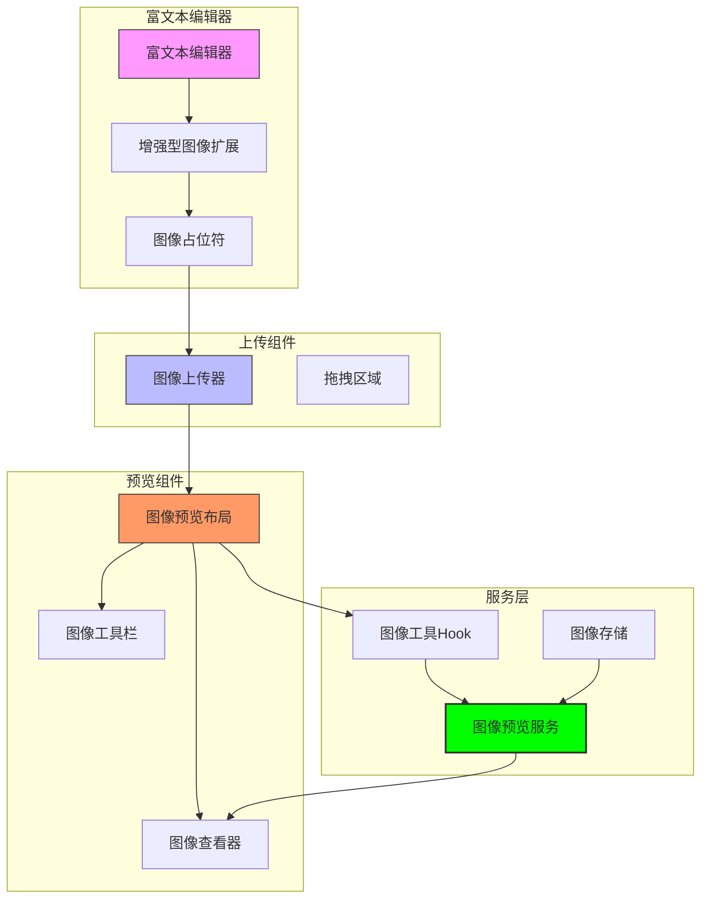
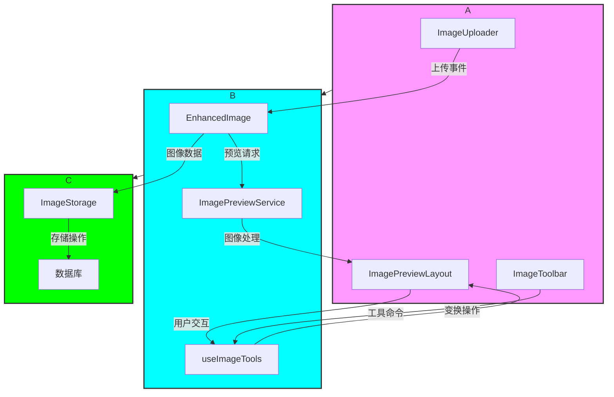
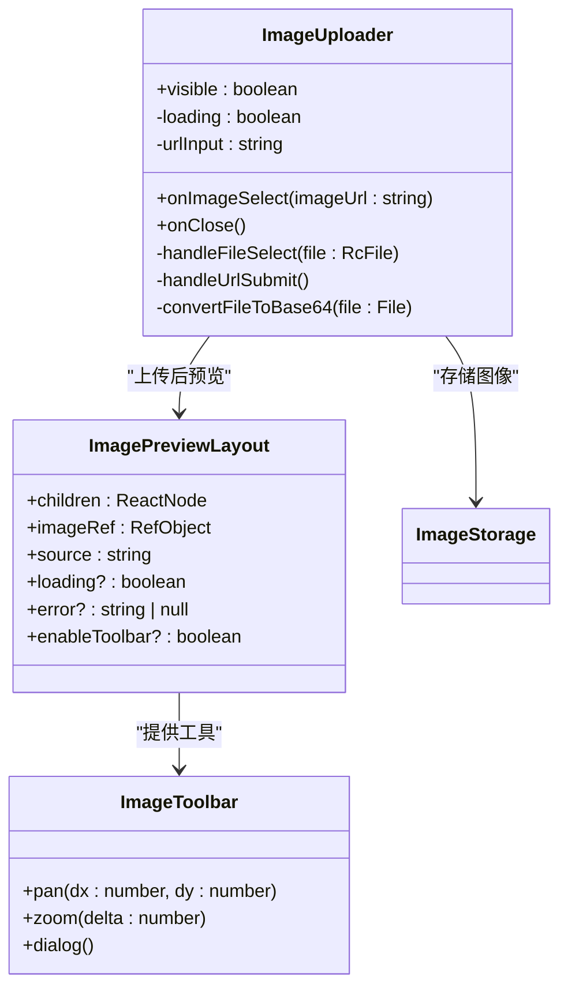
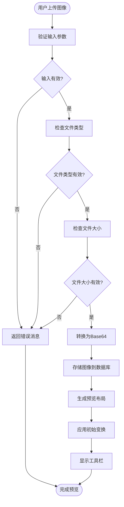
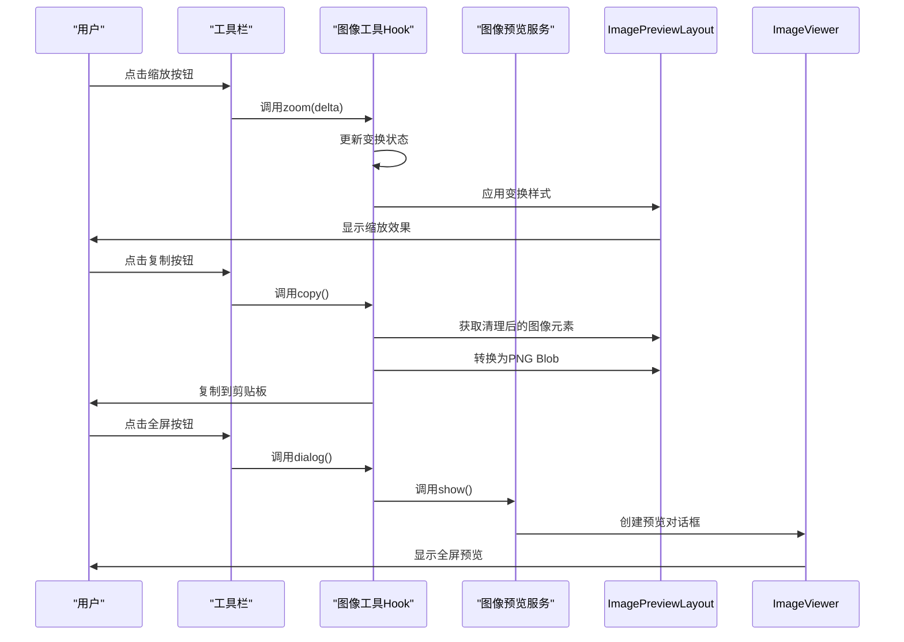
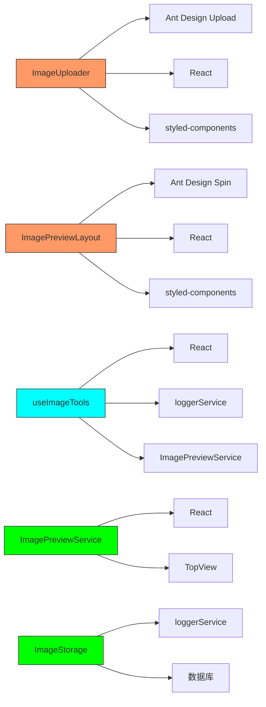
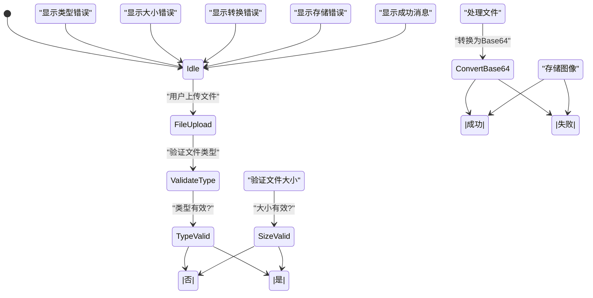

# 图像扩展功能

<cite>
**本文档引用的文件**
- [ImageUploader.tsx](file://src/renderer/src/components/RichEditor/components/ImageUploader.tsx)
- [ImagePreviewLayout.tsx](file://src/renderer/src/components/Preview/ImagePreviewLayout.tsx)
- [ImageToolbar.tsx](file://src/renderer/src/components/Preview/ImageToolbar.tsx)
- [useImageTools.tsx](file://src/renderer/src/components/ActionTools/hooks/useImageTools.tsx)
- [ImagePreviewService.ts](file://src/renderer/src/services/ImagePreviewService.ts)
- [ImageStorage.ts](file://src/renderer/src/services/ImageStorage.ts)
- [image.ts](file://src/renderer/src/utils/image.ts)
- [ImageViewer.tsx](file://src/renderer/src/components/ImageViewer.tsx)
- [enhanced-image.ts](file://src/renderer/src/components/RichEditor/extensions/enhanced-image.ts)
- [ImagePlaceholderNodeView.tsx](file://src/renderer/src/components/RichEditor/components/placeholder/ImagePlaceholderNodeView.tsx)
- [constant.ts](file://packages/shared/config/constant.ts)
</cite>

## 目录
1. [简介](#简介)
2. [项目结构](#项目结构)
3. [核心组件](#核心组件)
4. [架构概述](#架构概述)
5. [详细组件分析](#详细组件分析)
6. [依赖分析](#依赖分析)
7. [性能考虑](#性能考虑)
8. [故障排除指南](#故障排除指南)
9. [结论](#结论)

## 简介
本文档详细介绍了增强型图像扩展功能，该功能为富文本编辑器提供了完整的图像上传、预览和管理能力。系统通过集成ImageUploader组件和ImagePreviewLayout渲染流程，实现了直观的图像处理工作流。文档涵盖了支持的图像格式、上传限制、预览模式配置、拖拽上传功能以及错误处理策略。同时，还提供了图像插入、编辑和删除的完整工作流示例，并解释了性能优化方案和大文件处理策略。

## 项目结构
图像扩展功能主要分布在富文本编辑器和预览组件中，形成了一个完整的图像处理生态系统。系统通过多个组件协同工作，实现了从图像上传到预览的完整流程。

**图表来源**
- [ImageUploader.tsx](file://src/renderer/src/components/RichEditor/components/ImageUploader.tsx)
- [ImagePreviewLayout.tsx](file://src/renderer/src/components/Preview/ImagePreviewLayout.tsx)
- [ImagePreviewService.ts](file://src/renderer/src/services/ImagePreviewService.ts)

**章节来源**
- [ImageUploader.tsx](file://src/renderer/src/components/RichEditor/components/ImageUploader.tsx)
- [ImagePreviewLayout.tsx](file://src/renderer/src/components/Preview/ImagePreviewLayout.tsx)

## 核心组件
图像扩展功能的核心组件包括ImageUploader（图像上传器）、ImagePreviewLayout（图像预览布局）和ImagePreviewService（图像预览服务）。这些组件共同构成了图像处理的基础架构。

ImageUploader组件提供了两种图像添加方式：文件上传和URL嵌入。它通过拖拽区域和链接输入框为用户提供直观的交互界面。上传的图像会被转换为Base64编码并存储在本地数据库中。

ImagePreviewLayout组件负责图像的渲染和交互，集成了缩放、平移、复制和下载等操作。它通过ImageToolbar提供用户友好的控制界面，并通过useImageTools Hook管理图像变换状态。

ImagePreviewService作为服务层组件，提供了统一的图像预览功能，支持多种输入类型（SVG元素、HTML图像元素、字符串URL和Blob对象），并处理预览对话框的显示和清理。

**章节来源**
- [ImageUploader.tsx](file://src/renderer/src/components/RichEditor/components/ImageUploader.tsx)
- [ImagePreviewLayout.tsx](file://src/renderer/src/components/Preview/ImagePreviewLayout.tsx)
- [ImagePreviewService.ts](file://src/renderer/src/services/ImagePreviewService.ts)

## 架构概述
图像扩展功能采用分层架构设计，将用户界面、业务逻辑和数据存储分离，确保了系统的可维护性和可扩展性。

**图表来源**
- [enhanced-image.ts](file://src/renderer/src/components/RichEditor/extensions/enhanced-image.ts)
- [ImagePreviewService.ts](file://src/renderer/src/services/ImagePreviewService.ts)
- [ImageStorage.ts](file://src/renderer/src/services/ImageStorage.ts)

## 详细组件分析

### 图像上传器分析
ImageUploader组件是图像扩展功能的入口点，负责处理所有图像上传相关的操作。它提供了直观的用户界面和严格的验证机制，确保上传的图像符合系统要求。

#### 组件架构

**图表来源**
- [ImageUploader.tsx](file://src/renderer/src/components/RichEditor/components/ImageUploader.tsx)
- [ImagePreviewLayout.tsx](file://src/renderer/src/components/Preview/ImagePreviewLayout.tsx)
- [ImageToolbar.tsx](file://src/renderer/src/components/Preview/ImageToolbar.tsx)

**章节来源**
- [ImageUploader.tsx](file://src/renderer/src/components/RichEditor/components/ImageUploader.tsx)

### 图像预览流程分析
图像预览流程从用户上传图像开始，经过一系列处理步骤，最终在用户界面中呈现可交互的预览效果。

#### 预览流程

**图表来源**
- [ImageUploader.tsx](file://src/renderer/src/components/RichEditor/components/ImageUploader.tsx)
- [ImageStorage.ts](file://src/renderer/src/services/ImageStorage.ts)
- [ImagePreviewLayout.tsx](file://src/renderer/src/components/Preview/ImagePreviewLayout.tsx)

**章节来源**
- [ImageUploader.tsx](file://src/renderer/src/components/RichEditor/components/ImageUploader.tsx)
- [ImagePreviewLayout.tsx](file://src/renderer/src/components/Preview/ImagePreviewLayout.tsx)

### 图像工具分析
图像工具系统提供了丰富的图像操作功能，包括平移、缩放、复制、下载和全屏预览等。这些功能通过useImageTools Hook统一管理，确保了操作的一致性和可靠性。

#### 工具操作流程

**图表来源**
- [useImageTools.tsx](file://src/renderer/src/components/ActionTools/hooks/useImageTools.tsx)
- [ImagePreviewService.ts](file://src/renderer/src/services/ImagePreviewService.ts)
- [ImageViewer.tsx](file://src/renderer/src/components/ImageViewer.tsx)

**章节来源**
- [useImageTools.tsx](file://src/renderer/src/components/ActionTools/hooks/useImageTools.tsx)

## 依赖分析
图像扩展功能依赖于多个内部和外部组件，形成了复杂的依赖网络。这些依赖关系确保了功能的完整性和用户体验的一致性。

**图表来源**
- [ImageUploader.tsx](file://src/renderer/src/components/RichEditor/components/ImageUploader.tsx)
- [ImagePreviewLayout.tsx](file://src/renderer/src/components/Preview/ImagePreviewLayout.tsx)
- [useImageTools.tsx](file://src/renderer/src/components/ActionTools/hooks/useImageTools.tsx)
- [ImagePreviewService.ts](file://src/renderer/src/services/ImagePreviewService.ts)
- [ImageStorage.ts](file://src/renderer/src/services/ImageStorage.ts)

**章节来源**
- [ImageUploader.tsx](file://src/renderer/src/components/RichEditor/components/ImageUploader.tsx)
- [ImagePreviewLayout.tsx](file://src/renderer/src/components/Preview/ImagePreviewLayout.tsx)
- [useImageTools.tsx](file://src/renderer/src/components/ActionTools/hooks/useImageTools.tsx)

## 性能考虑
图像扩展功能在设计时充分考虑了性能优化，特别是在大文件处理和内存管理方面。系统采用了多种策略来确保流畅的用户体验。

### 大文件处理策略
对于大尺寸图像，系统采用了以下处理策略：
1. **压缩处理**：上传的图像如果超过一定尺寸，会自动进行压缩，限制最大宽度和高度为1200px，质量为80%。
2. **Base64编码**：图像被转换为Base64编码存储，避免了文件路径管理的复杂性，但需要注意Base64编码会增加约33%的存储空间。
3. **懒加载**：预览图像采用懒加载机制，只有在需要显示时才进行解码和渲染。
4. **内存清理**：预览对话框关闭时，会自动清理创建的Blob URL，防止内存泄漏。

### 性能优化方案
系统实现了多项性能优化措施：
1. **变换状态管理**：使用useRef来管理图像的变换状态（缩放、平移），避免了不必要的重新渲染。
2. **事件节流**：鼠标拖拽和滚轮缩放操作使用了事件节流，减少了频繁的状态更新。
3. **资源预加载**：常用的图像处理工具（如svgToPngBlob）在组件初始化时预加载，减少了运行时的延迟。
4. **缓存机制**：图像预览服务使用了缓存机制，避免重复处理相同的图像源。

**章节来源**
- [useImageTools.tsx](file://src/renderer/src/components/ActionTools/hooks/useImageTools.tsx)
- [ImagePreviewService.ts](file://src/renderer/src/services/ImagePreviewService.ts)
- [image.ts](file://src/renderer/src/utils/image.ts)

## 故障排除指南
本节提供了图像扩展功能常见问题的解决方案和错误处理策略。

### 错误处理策略
系统实现了全面的错误处理机制，确保用户能够获得清晰的反馈：

**图表来源**
- [ImageUploader.tsx](file://src/renderer/src/components/RichEditor/components/ImageUploader.tsx)

**章节来源**
- [ImageUploader.tsx](file://src/renderer/src/components/RichEditor/components/ImageUploader.tsx)
- [ImagePreviewLayout.tsx](file://src/renderer/src/components/Preview/ImagePreviewLayout.tsx)

### 常见问题及解决方案
1. **图像上传失败**：检查文件类型是否为支持的图像格式（JPG、JPEG、PNG、GIF、BMP、WEBP），并确保文件大小不超过10MB。
2. **预览显示异常**：尝试刷新页面或清除浏览器缓存，检查是否有JavaScript错误。
3. **工具栏按钮无响应**：确认图像预览布局已正确加载，检查控制台是否有错误信息。
4. **内存占用过高**：避免同时预览大量大尺寸图像，关闭不需要的预览对话框以释放内存。

## 结论
图像扩展功能通过精心设计的架构和组件协作，为富文本编辑器提供了强大而直观的图像处理能力。系统支持多种图像格式和上传方式，提供了丰富的预览和编辑功能，并通过有效的性能优化策略确保了流畅的用户体验。错误处理机制和清晰的用户反馈进一步增强了系统的可靠性和可用性。未来可以考虑增加更多图像处理功能，如图像裁剪、滤镜应用等，以满足更复杂的用户需求。