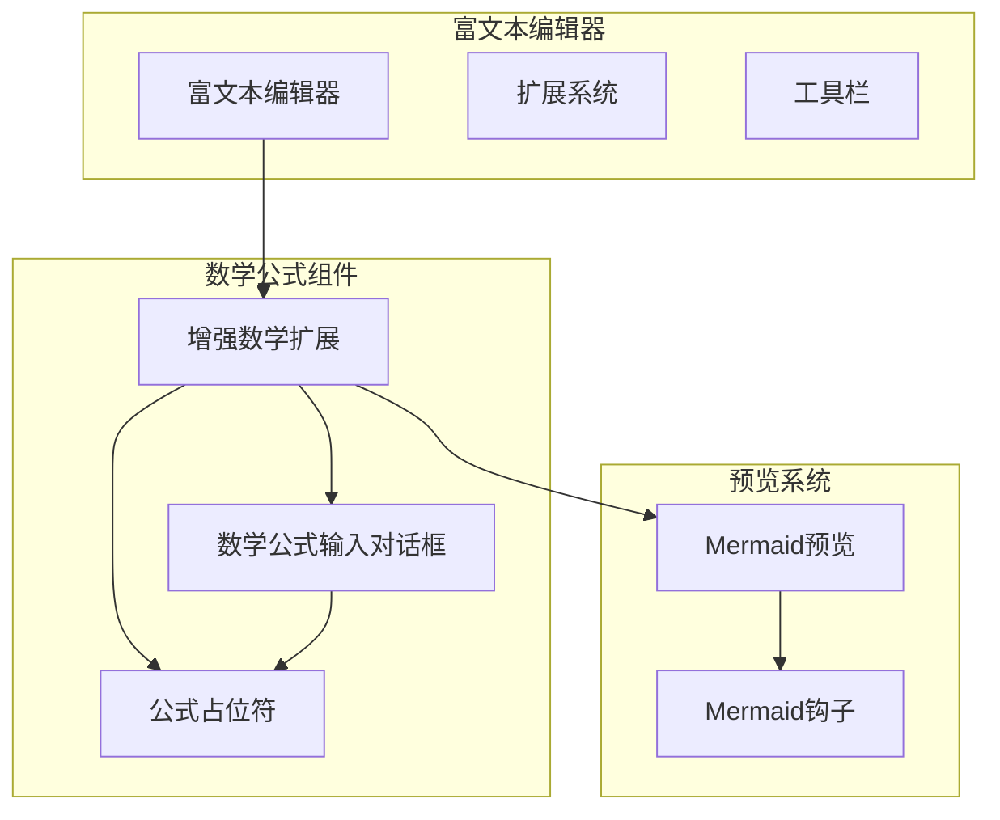
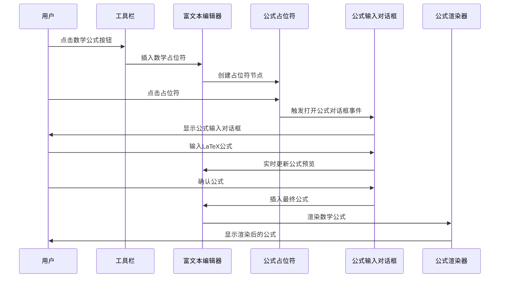
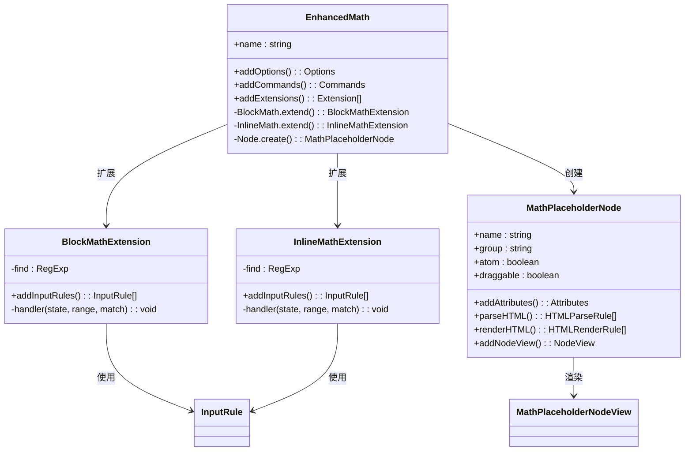
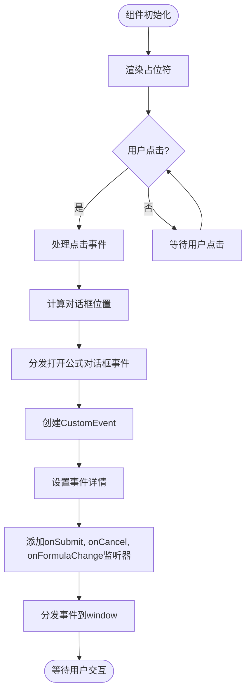
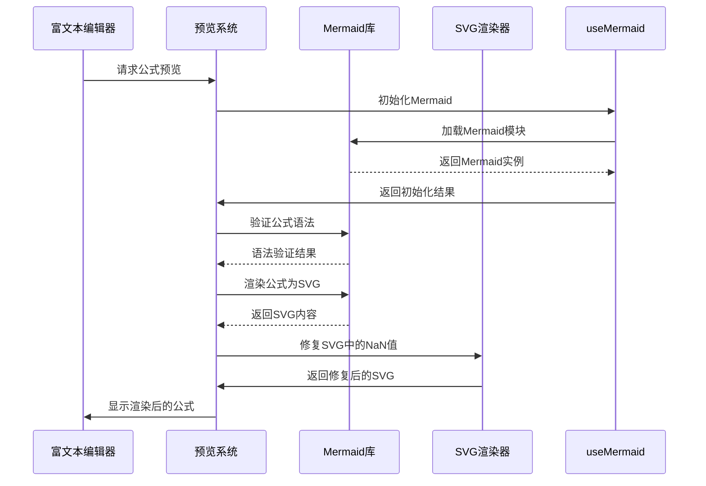

# 数学公式扩展

<cite>
**本文档引用的文件**  
- [enhanced-math.ts](file://src/renderer/src/components/RichEditor/extensions/enhanced-math.ts)
- [MathInputDialog.tsx](file://src/renderer/src/components/RichEditor/components/MathInputDialog.tsx)
- [MathPlaceholderNodeView.tsx](file://src/renderer/src/components/RichEditor/components/placeholder/MathPlaceholderNodeView.tsx)
- [toolbar.tsx](file://src/renderer/src/components/RichEditor/toolbar.tsx)
- [MermaidPreview.tsx](file://src/renderer/src/components/Preview/MermaidPreview.tsx)
- [useMermaid.ts](file://src/renderer/src/hooks/useMermaid.ts)
- [markdownConverter.ts](file://src/renderer/src/utils/markdownConverter.ts)
</cite>

## 目录
1. [简介](#简介)
2. [项目结构](#项目结构)
3. [核心组件](#核心组件)
4. [架构概述](#架构概述)
5. [详细组件分析](#详细组件分析)
6. [依赖分析](#依赖分析)
7. [性能考虑](#性能考虑)
8. [故障排除指南](#故障排除指南)
9. [结论](#结论)

## 简介
数学公式扩展为Cherry Studio提供了强大的LaTeX公式渲染功能，允许用户在富文本编辑器中插入和编辑复杂的数学表达式。该扩展通过集成KaTeX库实现高性能的数学公式渲染，并提供了直观的用户界面来处理公式输入和预览。扩展支持行内公式和块级公式两种模式，通过智能输入规则自动识别和转换LaTeX语法。系统还实现了与Mermaid预览组件的集成，确保数学公式在各种上下文中的正确显示。

## 项目结构
数学公式扩展的实现分布在多个组件和模块中，形成了一个完整的公式处理生态系统。核心功能主要集中在RichEditor组件的扩展中，通过模块化设计实现了功能分离和代码复用。



**图表来源**  
- [enhanced-math.ts](file://src/renderer/src/components/RichEditor/extensions/enhanced-math.ts#L1-L124)
- [MathInputDialog.tsx](file://src/renderer/src/components/RichEditor/components/MathInputDialog.tsx#L1-L161)
- [MermaidPreview.tsx](file://src/renderer/src/components/Preview/MermaidPreview.tsx#L1-L139)

**本节来源**  
- [enhanced-math.ts](file://src/renderer/src/components/RichEditor/extensions/enhanced-math.ts#L1-L124)
- [MathInputDialog.tsx](file://src/renderer/src/components/RichEditor/components/MathInputDialog.tsx#L1-L161)

## 核心组件
数学公式扩展的核心组件包括enhanced-math扩展、MathInputDialog输入对话框和MathPlaceholderNodeView占位符视图。这些组件协同工作，提供完整的公式输入和渲染功能。enhanced-math扩展基于Tiptap框架构建，通过扩展BlockMath和InlineMath节点实现了对块级和行内公式的全面支持。MathInputDialog组件提供了一个轻量级的浮动对话框，允许用户输入和编辑LaTeX公式。MathPlaceholderNodeView则在编辑器中创建一个可视化的占位符，用户点击后可以触发公式输入流程。

**本节来源**  
- [enhanced-math.ts](file://src/renderer/src/components/RichEditor/extensions/enhanced-math.ts#L1-L124)
- [MathInputDialog.tsx](file://src/renderer/src/components/RichEditor/components/MathInputDialog.tsx#L1-L161)
- [MathPlaceholderNodeView.tsx](file://src/renderer/src/components/RichEditor/components/placeholder/MathPlaceholderNodeView.tsx#L1-L75)

## 架构概述
数学公式扩展采用分层架构设计，将输入处理、公式解析和渲染显示分离。该架构基于Tiptap编辑器框架，通过扩展机制添加数学公式功能。系统通过自定义输入规则自动识别LaTeX语法，并将其转换为相应的数学节点。当用户输入特定的数学符号模式时，系统会自动触发公式创建流程。



**图表来源**  
- [enhanced-math.ts](file://src/renderer/src/components/RichEditor/extensions/enhanced-math.ts#L1-L124)
- [toolbar.tsx](file://src/renderer/src/components/RichEditor/toolbar.tsx#L1-L341)
- [MathInputDialog.tsx](file://src/renderer/src/components/RichEditor/components/MathInputDialog.tsx#L1-L161)

## 详细组件分析

### 数学公式输入对话框分析
MathInputDialog组件是一个轻量级的浮动对话框，专门用于输入和编辑LaTeX数学公式。该组件提供了多行文本输入区域和确认/取消按钮，为用户提供直观的公式编辑界面。

```mermaid
classDiagram
class MathInputDialog {
+visible : boolean
+onSubmit(formula : string) : void
+onCancel() : void
+defaultValue? : string
+onFormulaChange?(formula : string) : void
+position? : { x : number; y : number; top? : number }
+scrollContainer? : RefObject<HTMLDivElement>
-value : string
-containerRef : RefObject<HTMLDivElement>
+handleKeyDown(e : KeyboardEvent) : void
+handleSubmit() : void
}
MathInputDialog --> Input.TextArea : 使用
MathInputDialog --> Button : 使用
MathInputDialog --> Flex : 使用
```

**图表来源**  
- [MathInputDialog.tsx](file://src/renderer/src/components/RichEditor/components/MathInputDialog.tsx#L1-L161)

### 增强数学扩展分析
enhanced-math扩展是数学公式功能的核心，它通过Tiptap的扩展机制为编辑器添加了完整的数学公式支持。该扩展不仅实现了基本的公式输入和渲染，还提供了智能的输入规则和占位符系统。



**图表来源**  
- [enhanced-math.ts](file://src/renderer/src/components/RichEditor/extensions/enhanced-math.ts#L1-L124)
- [MathPlaceholderNodeView.tsx](file://src/renderer/src/components/RichEditor/components/placeholder/MathPlaceholderNodeView.tsx#L1-L75)

### 公式占位符节点视图分析
MathPlaceholderNodeView组件实现了数学公式占位符的可视化表示和交互逻辑。当编辑器中需要插入数学公式时，该组件会显示一个带有计算器图标的占位符，用户点击后即可开始输入公式。



**图表来源**  
- [MathPlaceholderNodeView.tsx](file://src/renderer/src/components/RichEditor/components/placeholder/MathPlaceholderNodeView.tsx#L1-L75)
- [toolbar.tsx](file://src/renderer/src/components/RichEditor/toolbar.tsx#L95-L123)

### Mermaid预览集成分析
数学公式扩展与Mermaid预览系统集成，确保数学公式在各种上下文中的正确显示。这种集成通过useMermaid钩子和MermaidPreview组件实现，提供了高性能的公式渲染能力。



**图表来源**  
- [MermaidPreview.tsx](file://src/renderer/src/components/Preview/MermaidPreview.tsx#L1-L139)
- [useMermaid.ts](file://src/renderer/src/hooks/useMermaid.ts#L1-L80)

**本节来源**  
- [enhanced-math.ts](file://src/renderer/src/components/RichEditor/extensions/enhanced-math.ts#L1-L124)
- [MathInputDialog.tsx](file://src/renderer/src/components/RichEditor/components/MathInputDialog.tsx#L1-L161)
- [MathPlaceholderNodeView.tsx](file://src/renderer/src/components/RichEditor/components/placeholder/MathPlaceholderNodeView.tsx#L1-L75)
- [toolbar.tsx](file://src/renderer/src/components/RichEditor/toolbar.tsx#L1-L341)
- [MermaidPreview.tsx](file://src/renderer/src/components/Preview/MermaidPreview.tsx#L1-L139)
- [useMermaid.ts](file://src/renderer/src/hooks/useMermaid.ts#L1-L80)

## 依赖分析
数学公式扩展依赖于多个核心库和组件，形成了一个复杂的依赖网络。这些依赖关系确保了公式的正确解析、渲染和交互。

```mermaid
graph TD
enhancedMath[enhanced-math扩展] --> Tiptap[@tiptap/core]
enhancedMath --> Mathematics[@tiptap/extension-mathematics]
enhancedMath --> ReactNodeView[@tiptap/react]
enhancedMath --> MathInputDialog[MathInputDialog]
enhancedMath --> MathPlaceholderNodeView[MathPlaceholderNodeView]
MathInputDialog --> Antd[antd]
MathInputDialog --> React[React]
MathInputDialog --> i18next[react-i18next]
MathPlaceholderNodeView --> TiptapReact[@tiptap/react]
MathPlaceholderNodeView --> Lucide[lucide-react]
MathPlaceholderNodeView --> React[React]
MathPlaceholderNodeView --> i18next[react-i18next]
MathPlaceholderNodeView --> PlaceholderBlock[PlaceholderBlock]
MermaidPreview --> Mermaid[mermaid]
MermaidPreview --> React[React]
MermaidPreview --> Redux[@reduxjs/toolkit]
MermaidPreview --> useDebouncedRender[useDebouncedRender]
MermaidPreview --> ImagePreviewLayout[ImagePreviewLayout]
useMermaid --> React[React]
useMermaid --> ThemeProvider[ThemeProvider]
toolbar --> enhancedMath
toolbar --> MathInputDialog
toolbar --> Antd[antd]
toolbar --> React[React]
toolbar --> i18next[react-i18next]
```

**图表来源**  
- [enhanced-math.ts](file://src/renderer/src/components/RichEditor/extensions/enhanced-math.ts#L1-L124)
- [MathInputDialog.tsx](file://src/renderer/src/components/RichEditor/components/MathInputDialog.tsx#L1-L161)
- [MathPlaceholderNodeView.tsx](file://src/renderer/src/components/RichEditor/components/placeholder/MathPlaceholderNodeView.tsx#L1-L75)
- [MermaidPreview.tsx](file://src/renderer/src/components/Preview/MermaidPreview.tsx#L1-L139)
- [useMermaid.ts](file://src/renderer/src/hooks/useMermaid.ts#L1-L80)
- [toolbar.tsx](file://src/renderer/src/components/RichEditor/toolbar.tsx#L1-L341)

**本节来源**  
- [enhanced-math.ts](file://src/renderer/src/components/RichEditor/extensions/enhanced-math.ts#L1-L124)
- [MathInputDialog.tsx](file://src/renderer/src/components/RichEditor/components/MathInputDialog.tsx#L1-L161)
- [MathPlaceholderNodeView.tsx](file://src/renderer/src/components/RichEditor/components/placeholder/MathPlaceholderNodeView.tsx#L1-L75)
- [MermaidPreview.tsx](file://src/renderer/src/components/Preview/MermaidPreview.tsx#L1-L139)
- [useMermaid.ts](file://src/renderer/src/hooks/useMermaid.ts#L1-L80)

## 性能考虑
数学公式扩展在设计时充分考虑了性能优化，通过多种策略确保在处理复杂公式时仍能保持流畅的用户体验。系统采用延迟渲染技术，避免在用户输入过程中频繁重新渲染公式。对于Mermaid预览，系统使用useDebouncedRender钩子实现防抖渲染，将渲染延迟300毫秒，从而避免在用户快速输入时产生过多的渲染调用。此外，系统还实现了可见性检测机制，只有当公式元素在视口内时才进行渲染，减少了不必要的计算开销。KaTeX渲染器的配置也经过优化，确保在不同主题模式下都能快速加载和渲染公式。

**本节来源**  
- [MermaidPreview.tsx](file://src/renderer/src/components/Preview/MermaidPreview.tsx#L63-L83)
- [useMermaid.ts](file://src/renderer/src/hooks/useMermaid.ts#L38-L71)

## 故障排除指南
当数学公式扩展出现问题时，可以按照以下步骤进行排查和解决。首先检查浏览器控制台是否有JavaScript错误，特别是与KaTeX或Mermaid相关的加载错误。如果公式无法正确渲染，检查LaTeX语法是否正确，特别是括号匹配和特殊字符的转义。对于输入对话框不显示的问题，确认工具栏的数学公式按钮是否正常工作，并检查相关事件监听器是否正确注册。如果遇到性能问题，可以尝试简化复杂的公式或分批输入内容。在暗色主题下，如果公式显示异常，检查主题配置是否正确传递给渲染器。

**本节来源**  
- [MermaidPreview.tsx](file://src/renderer/src/components/Preview/MermaidPreview.tsx#L121-L124)
- [useMermaid.ts](file://src/renderer/src/hooks/useMermaid.ts#L57-L59)
- [MathInputDialog.tsx](file://src/renderer/src/components/RichEditor/components/MathInputDialog.tsx#L136-L158)

## 结论
数学公式扩展为Cherry Studio提供了强大而灵活的LaTeX公式支持，通过精心设计的架构和组件实现了高效的公式输入和渲染。该扩展不仅支持基本的行内和块级公式，还提供了智能的输入规则和实时预览功能，极大地提升了用户的数学表达体验。与Mermaid预览系统的集成确保了公式在各种上下文中的正确显示，而性能优化策略则保证了即使在处理复杂公式时也能保持流畅的交互。未来可以进一步扩展支持更多的数学符号和格式，以及提供更丰富的公式编辑辅助功能。