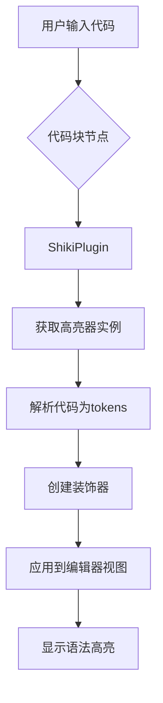
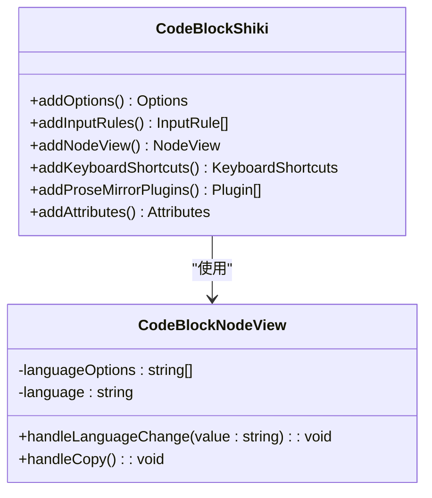
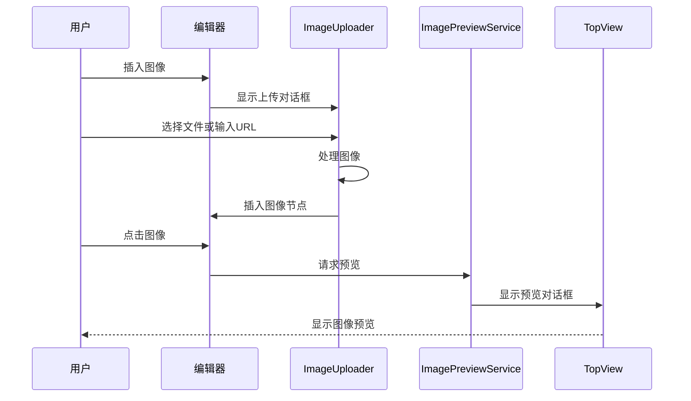
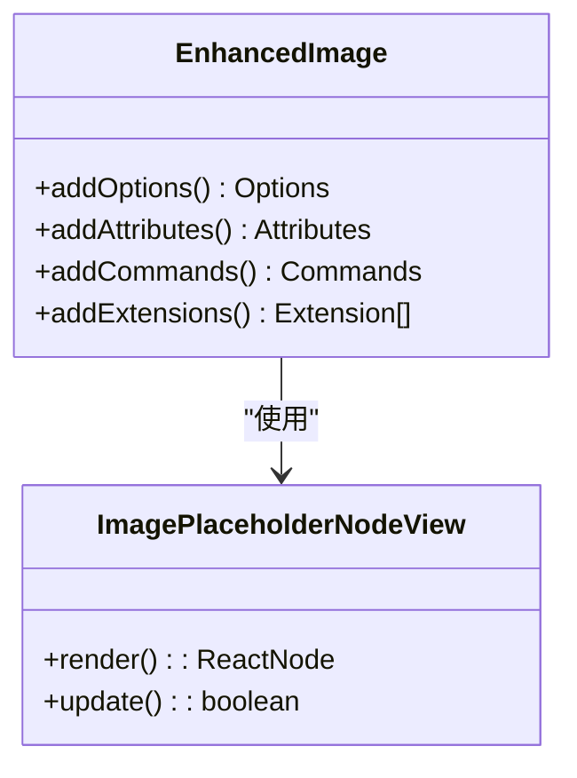
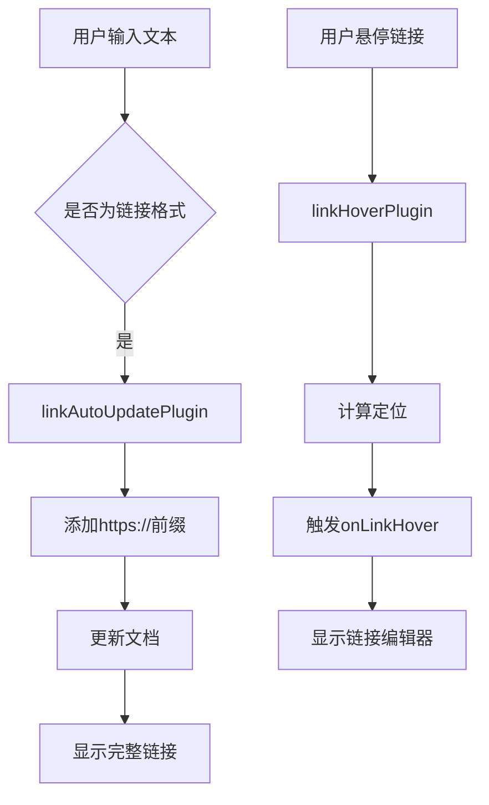
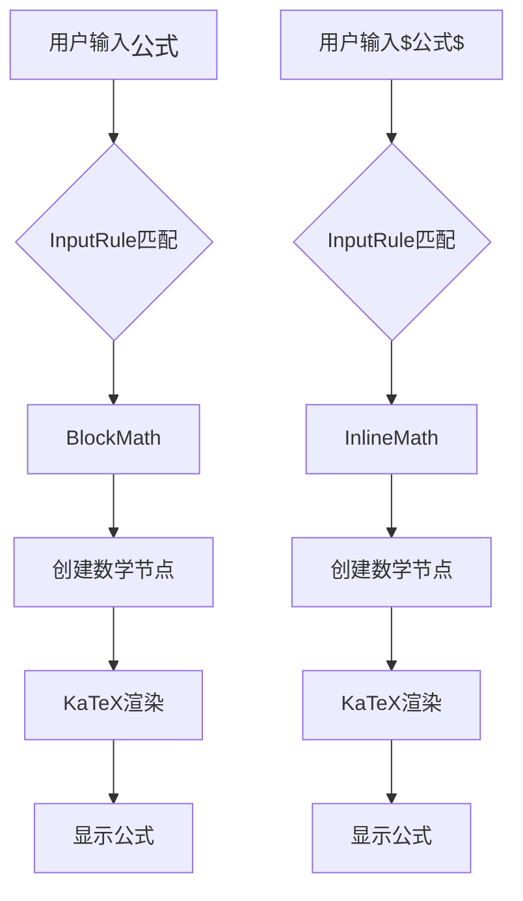
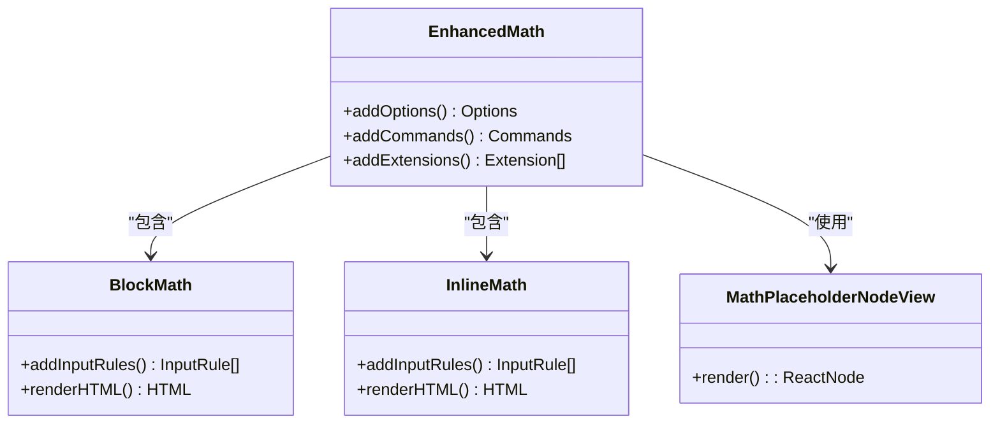
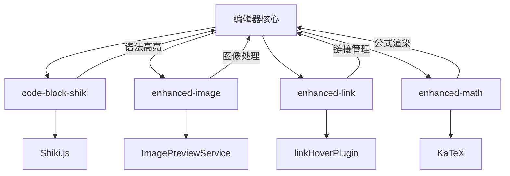

# 编辑器扩展功能

<cite>
**本文档引用的文件**  
- [code-block-shiki.ts](file://src/renderer/src/components/RichEditor/extensions/code-block-shiki/code-block-shiki.ts)
- [shikijsPlugin.ts](file://src/renderer/src/components/RichEditor/extensions/code-block-shiki/shikijsPlugin.ts)
- [CodeBlockNodeView.tsx](file://src/renderer/src/components/RichEditor/extensions/code-block-shiki/CodeBlockNodeView.tsx)
- [enhanced-image.ts](file://src/renderer/src/components/RichEditor/extensions/enhanced-image.ts)
- [ImageUploader.tsx](file://src/renderer/src/components/RichEditor/components/ImageUploader.tsx)
- [ImagePreviewService.ts](file://src/renderer/src/services/ImagePreviewService.ts)
- [enhanced-link.ts](file://src/renderer/src/components/RichEditor/extensions/enhanced-link.ts)
- [linkConverter.ts](file://src/renderer/src/utils/linkConverter.ts)
- [enhanced-math.ts](file://src/renderer/src/components/RichEditor/extensions/enhanced-math.ts)
- [markdownConverter.ts](file://src/renderer/src/utils/markdownConverter.ts)
- [useRichEditor.ts](file://src/renderer/src/components/RichEditor/useRichEditor.ts)
- [CodeStyleProvider.tsx](file://src/renderer/src/context/CodeStyleProvider.tsx)
</cite>

## 目录
1. [简介](#简介)
2. [代码块扩展](#代码块扩展)
3. [图像扩展](#图像扩展)
4. [链接扩展](#链接扩展)
5. [数学公式扩展](#数学公式扩展)
6. [扩展协作关系](#扩展协作关系)

## 简介
本文档详细介绍了富文本编辑器的四个核心扩展功能：代码块、图像、链接和数学公式。这些扩展基于 Tiptap 框架构建，为编辑器提供了丰富的功能和交互体验。文档将深入分析每个扩展的实现机制、配置选项、API 接口和使用示例，并解释它们之间的协作关系和潜在冲突的解决方案。

## 代码块扩展

代码块扩展 `code-block-shiki` 集成了 Shiki.js 实现语法高亮功能。该扩展继承自 Tiptap 的 `CodeBlock` 扩展，并添加了 Shiki.js 集成、语言选择器和复制按钮等增强功能。

### 实现机制
代码块扩展通过 `ShikiPlugin` ProseMirror 插件实现语法高亮。该插件在编辑器状态中维护一个装饰器集合，为代码块中的每个 token 添加内联样式。高亮过程在 `getDecorations` 函数中实现，该函数遍历文档中的所有代码块节点，使用 Shiki.js 的 `codeToTokens` 方法将代码转换为带有颜色信息的 token，然后创建相应的装饰器。



**Diagram sources**
- [shikijsPlugin.ts](file://src/renderer/src/components/RichEditor/extensions/code-block-shiki/shikijsPlugin.ts#L17-L84)
- [code-block-shiki.ts](file://src/renderer/src/components/RichEditor/extensions/code-block-shiki/code-block-shiki.ts#L94-L129)

### 配置选项
代码块扩展提供了以下配置选项：

| 配置项 | 类型 | 默认值 | 描述 |
|--------|------|--------|------|
| defaultLanguage | string | 'text' | 默认代码语言 |
| theme | string | 'one-light' | 代码高亮主题 |
| languageClassPrefix | string | 'language-' | 语言类名前缀 |
| exitOnTripleEnter | boolean | true | 三重回车退出代码块 |
| exitOnArrowDown | boolean | true | 向下箭头退出代码块 |

**Section sources**
- [code-block-shiki.ts](file://src/renderer/src/components/RichEditor/extensions/code-block-shiki/code-block-shiki.ts#L8-L24)

### API 接口
代码块扩展继承了 Tiptap `CodeBlock` 扩展的所有命令，并通过节点视图提供了额外的交互功能。



**Diagram sources**
- [code-block-shiki.ts](file://src/renderer/src/components/RichEditor/extensions/code-block-shiki/code-block-shiki.ts#L12-L142)
- [CodeBlockNodeView.tsx](file://src/renderer/src/components/RichEditor/extensions/code-block-shiki/CodeBlockNodeView.tsx#L8-L88)

### 使用示例
代码块扩展支持多种方式创建代码块：
- 输入 ``` 后跟语言名（如 ```javascript）
- 输入 ~~~ 后跟语言名（如 ~~~python）
- 通过编辑器菜单插入代码块

代码块顶部显示语言选择器和复制按钮，用户可以更改代码语言或复制代码内容。

**Section sources**
- [code-block-shiki.ts](file://src/renderer/src/components/RichEditor/extensions/code-block-shiki/code-block-shiki.ts#L27-L53)
- [CodeBlockNodeView.tsx](file://src/renderer/src/components/RichEditor/extensions/code-block-shiki/CodeBlockNodeView.tsx#L58-L77)

## 图像扩展

图像扩展 `enhanced-image` 增强了 Tiptap 原生图像功能，支持 Base64 图像、图像上传和预览等功能。

### 实现机制
图像扩展继承自 Tiptap 的 `Image` 扩展，并添加了 `imagePlaceholder` 节点类型。当用户插入图像时，首先创建一个占位符节点，然后通过 `ImageUploader` 组件处理图像上传。上传完成后，占位符被替换为实际的图像节点。

图像预览功能由 `ImagePreviewService` 提供，该服务使用 `TopView` 组件显示图像预览对话框。预览服务支持多种输入类型，包括 URL、Blob、HTMLImageElement 和 SVGElement。



**Diagram sources**
- [enhanced-image.ts](file://src/renderer/src/components/RichEditor/extensions/enhanced-image.ts#L16-L124)
- [ImageUploader.tsx](file://src/renderer/src/components/RichEditor/components/ImageUploader.tsx#L84-L161)
- [ImagePreviewService.ts](file://src/renderer/src/services/ImagePreviewService.ts#L43-L87)

### 配置选项
图像扩展提供了以下配置选项：

| 配置项 | 类型 | 默认值 | 描述 |
|--------|------|--------|------|
| allowBase64 | boolean | true | 是否允许 Base64 图像 |
| HTMLAttributes | object | {class: 'rich-editor-image'} | 图像元素的 HTML 属性 |

**Section sources**
- [enhanced-image.ts](file://src/renderer/src/components/RichEditor/extensions/enhanced-image.ts#L17-L24)

### API 接口
图像扩展提供了以下命令：

| 命令 | 参数 | 描述 |
|------|------|------|
| insertImagePlaceholder | 无 | 插入图像占位符 |



**Diagram sources**
- [enhanced-image.ts](file://src/renderer/src/components/RichEditor/extensions/enhanced-image.ts#L16-L124)

### 使用示例
用户可以通过以下方式插入图像：
- 拖放图像文件到编辑器
- 点击工具栏的图像按钮打开上传对话框
- 粘贴剪贴板中的图像
- 输入图像 URL

插入的图像可以点击预览，支持缩放和导航操作。

**Section sources**
- [ImageUploader.tsx](file://src/renderer/src/components/RichEditor/components/ImageUploader.tsx#L84-L161)
- [ImagePreviewService.ts](file://src/renderer/src/services/ImagePreviewService.ts#L43-L87)

## 链接扩展

链接扩展 `enhanced-link` 增强了 Tiptap 原生链接功能，提供了悬停交互、自动链接更新等特性。

### 实现机制
链接扩展基于 Tiptap 的 `Link` 扩展构建，添加了两个 ProseMirror 插件：`linkHoverPlugin` 和 `linkAutoUpdatePlugin`。

`linkHoverPlugin` 处理链接悬停交互，当用户将鼠标悬停在链接上时，触发 `onLinkHover` 回调，显示链接编辑器。插件使用智能定位算法，确保编辑器不会被视口边界遮挡。

`linkAutoUpdatePlugin` 实现自动链接更新功能，当用户输入文本链接时，自动添加 `https://` 前缀。插件通过 `appendTransaction` 钩子监听文档变化，检测需要更新的链接并自动修正。



**Diagram sources**
- [enhanced-link.ts](file://src/renderer/src/components/RichEditor/extensions/enhanced-link.ts#L50-L281)
- [linkConverter.ts](file://src/renderer/src/utils/linkConverter.ts#L41-L127)

### 配置选项
链接扩展提供了以下配置选项：

| 配置项 | 类型 | 默认值 | 描述 |
|--------|------|--------|------|
| protocols | string[] | ['http','https','mailto','tel'] | 支持的协议 |
| openOnClick | boolean | true | 点击时是否打开链接 |
| onLinkHover | function | undefined | 链接悬停回调 |
| onLinkHoverEnd | function | undefined | 链接悬停结束回调 |
| editable | boolean | true | 是否可编辑 |
| hoverDelay | number | 500 | 悬停延迟（毫秒） |

**Section sources**
- [enhanced-link.ts](file://src/renderer/src/components/RichEditor/extensions/enhanced-link.ts#L309-L318)

### API 接口
链接扩展提供了以下命令：

| 命令 | 参数 | 描述 |
|------|------|------|
| setEnhancedLink | {href: string, title?: string} | 设置链接 |
| toggleEnhancedLink | {href: string, title?: string} | 切换链接 |
| unsetEnhancedLink | 无 | 移除链接 |
| updateLinkText | string | 更新链接文本 |

```mermaid
classDiagram
class EnhancedLink {
+addOptions() Options
+addCommands() Commands
+addProseMirrorPlugins() Plugin[]
+renderHTML() HTML
+addAttributes() Attributes
}
class linkHoverPlugin {
+handleDOMEvents : {mouseover, mouseout}
+calculateSmartPosition() : DOMRect
}
class linkAutoUpdatePlugin {
+appendTransaction() : Transaction
}
EnhancedLink --> linkHoverPlugin : "使用"
EnhancedLink --> linkAutoUpdatePlugin : "使用"
```

**Diagram sources**
- [enhanced-link.ts](file://src/renderer/src/components/RichEditor/extensions/enhanced-link.ts#L306-L406)

### 使用示例
用户可以通过以下方式使用链接功能：
- 选中文本后点击链接按钮插入链接
- 直接输入 URL，系统自动转换为链接
- 悬停链接查看和编辑链接属性
- 点击链接在新窗口打开

**Section sources**
- [enhanced-link.ts](file://src/renderer/src/components/RichEditor/extensions/enhanced-link.ts#L321-L351)

## 数学公式扩展

数学公式扩展 `enhanced-math` 支持 LaTeX 公式渲染，包括行内公式和块级公式。

### 实现机制
数学公式扩展使用 Tiptap 的 `Extension.create` 方法创建，内部集成了 `BlockMath` 和 `InlineMath` 扩展。扩展通过输入规则（InputRule）实现 LaTeX 语法的自动转换：

- `$$...$$` 语法创建块级数学公式
- `$...$` 语法创建行内数学公式

公式渲染使用 KaTeX 库，通过 `katexOptions` 配置项传递渲染选项。扩展还提供了 `mathPlaceholder` 节点类型，用于在公式编辑时显示占位符。



**Diagram sources**
- [enhanced-math.ts](file://src/renderer/src/components/RichEditor/extensions/enhanced-math.ts#L41-L75)
- [markdownConverter.ts](file://src/renderer/src/utils/markdownConverter.ts#L450-L495)

### 配置选项
数学公式扩展提供了以下配置选项：

| 配置项 | 类型 | 默认值 | 描述 |
|--------|------|--------|------|
| inlineOptions | object | undefined | 行内公式选项 |
| blockOptions | object | undefined | 块级公式选项 |
| katexOptions | object | undefined | KaTeX 渲染选项 |

**Section sources**
- [enhanced-math.ts](file://src/renderer/src/components/RichEditor/extensions/enhanced-math.ts#L18-L23)

### API 接口
数学公式扩展提供了以下命令：

| 命令 | 参数 | 描述 |
|------|------|------|
| insertMathPlaceholder | {mathType?: 'block' | 'inline'} | 插入公式占位符 |



**Diagram sources**
- [enhanced-math.ts](file://src/renderer/src/components/RichEditor/extensions/enhanced-math.ts#L15-L123)

### 使用示例
用户可以通过以下方式插入数学公式：
- 输入 `$$` 后跟公式内容，再输入 `$$` 结束（块级公式）
- 输入 `$` 后跟公式内容，再输入 `$` 结束（行内公式）
- 使用工具栏按钮插入公式占位符

**Section sources**
- [enhanced-math.ts](file://src/renderer/src/components/RichEditor/extensions/enhanced-math.ts#L43-L75)
- [useRichEditor.ts](file://src/renderer/src/components/RichEditor/useRichEditor.ts#L283-L301)

## 扩展协作关系

四个核心扩展在编辑器中协同工作，共同提供丰富的编辑体验。它们通过 Tiptap 的扩展系统集成，共享编辑器状态和视图。

### 协作机制
扩展之间的协作主要通过以下方式实现：
1. **共享状态**：所有扩展访问相同的编辑器状态，可以相互影响
2. **事件通信**：通过自定义事件（如 `openMathDialog`）进行跨扩展通信
3. **样式协调**：通过统一的 CSS 类名和样式系统确保视觉一致性



**Diagram sources**
- [useRichEditor.ts](file://src/renderer/src/components/RichEditor/useRichEditor.ts#L31-L301)
- [CodeStyleProvider.tsx](file://src/renderer/src/context/CodeStyleProvider.tsx#L136-L165)

### 潜在冲突及解决方案
尽管扩展设计时考虑了兼容性，但仍可能存在一些潜在冲突：

1. **输入规则冲突**：多个扩展可能监听相同的输入模式
   - 解决方案：通过精确的正则表达式和执行顺序控制

2. **样式冲突**：不同扩展可能应用相互冲突的样式
   - 解决方案：使用 BEM 命名约定和 CSS 作用域

3. **性能影响**：多个装饰器和插件可能影响编辑器性能
   - 解决方案：懒加载、节流和缓存机制

4. **事件处理冲突**：多个扩展可能监听相同的 DOM 事件
   - 解决方案：事件委托和优先级控制

通过合理的设计和实现，这些扩展能够和谐共存，为用户提供流畅的编辑体验。

**Section sources**
- [useRichEditor.ts](file://src/renderer/src/components/RichEditor/useRichEditor.ts#L283-L329)
- [CodeStyleProvider.tsx](file://src/renderer/src/context/CodeStyleProvider.tsx#L136-L165)