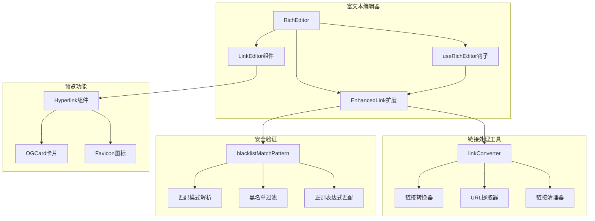
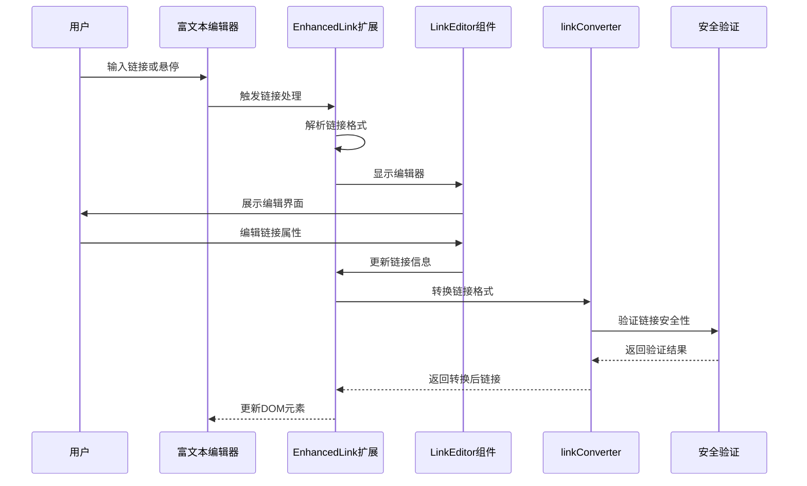
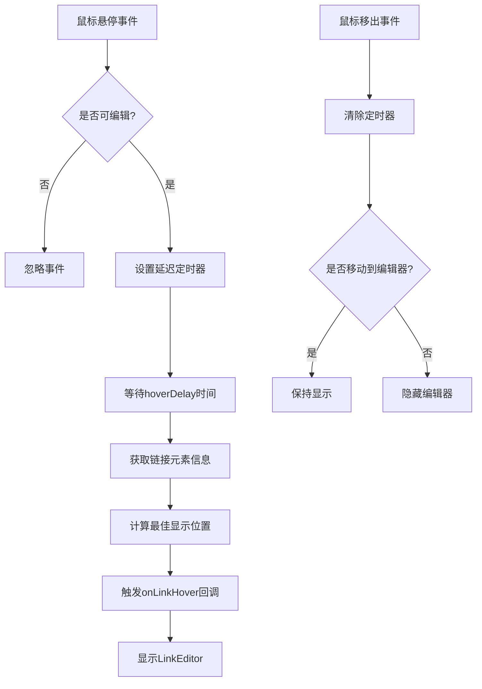
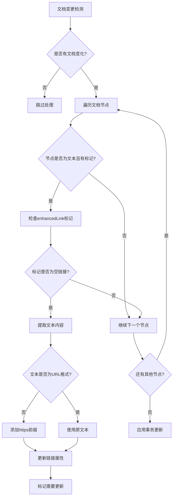
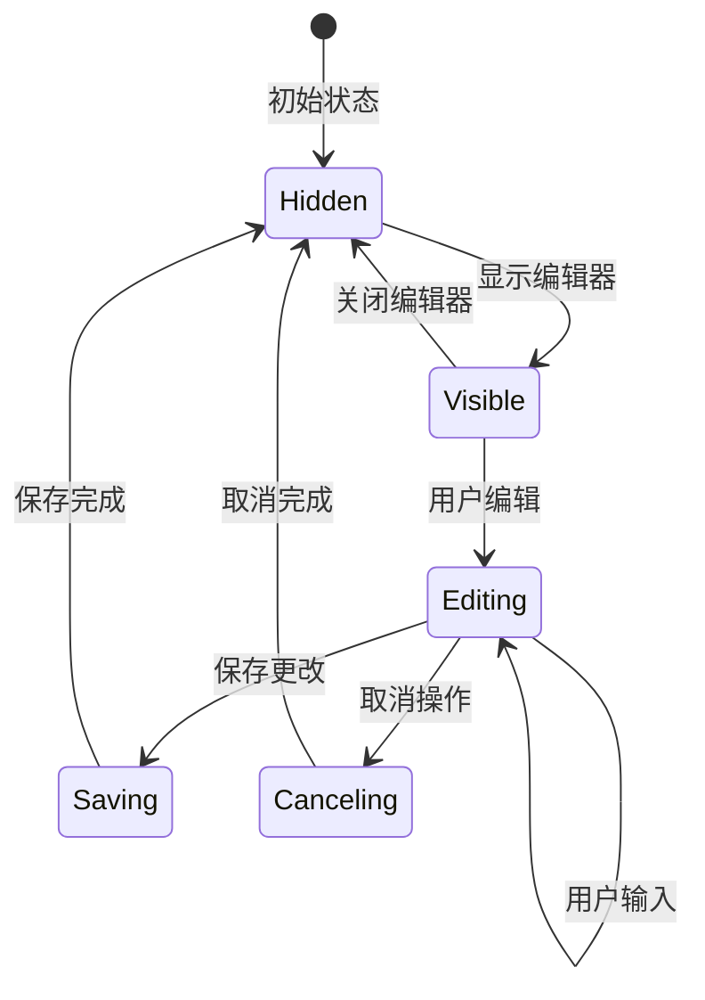
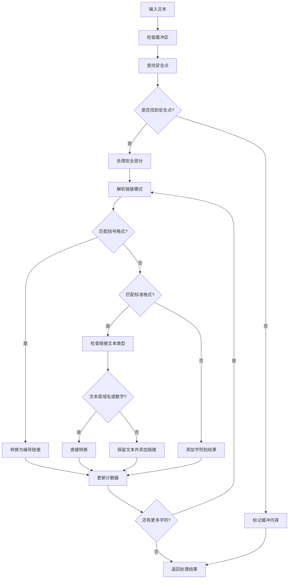
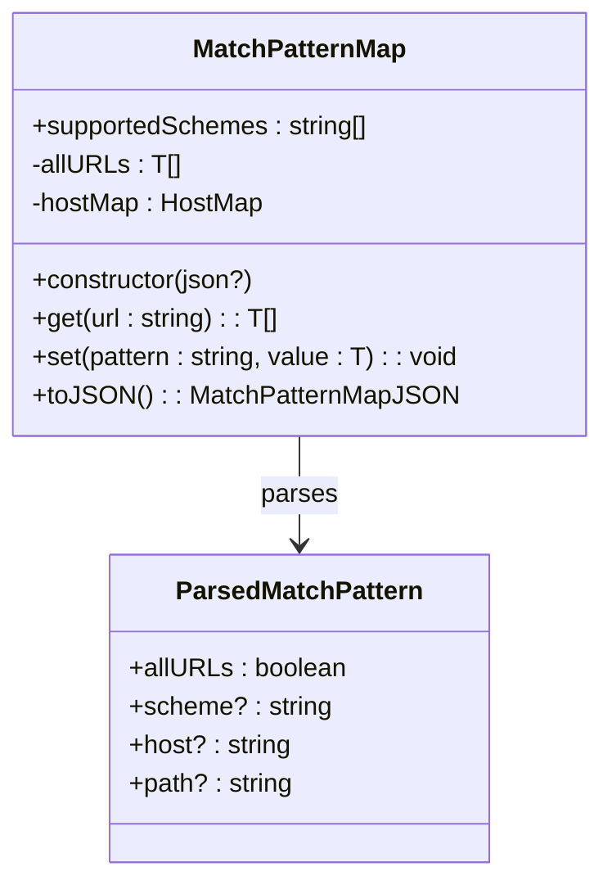
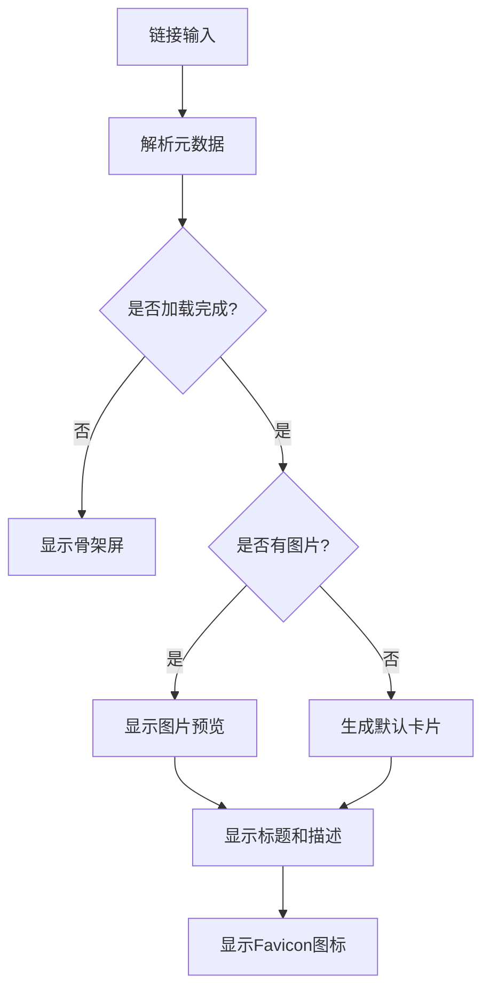
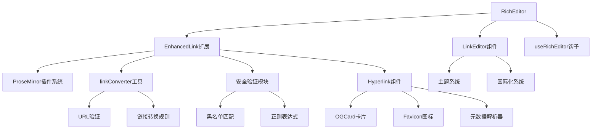

# 链接扩展功能

<cite>
**本文档中引用的文件**
- [enhanced-link.ts](file://src/renderer/src/components/RichEditor/extensions/enhanced-link.ts)
- [linkConverter.ts](file://src/renderer/src/utils/linkConverter.ts)
- [LinkEditor.tsx](file://src/renderer/src/components/RichEditor/components/LinkEditor.tsx)
- [Hyperlink.tsx](file://src/renderer/src/pages/home/Markdown/Hyperlink.tsx)
- [blacklistMatchPattern.ts](file://src/renderer/src/utils/blacklistMatchPattern.ts)
- [OGCard.tsx](file://src/renderer/src/components/OGCard.tsx)
- [index.tsx](file://src/renderer/src/components/RichEditor/index.tsx)
- [useRichEditor.ts](file://src/renderer/src/components/RichEditor/useRichEditor.ts)
- [linkConverter.test.ts](file://src/renderer/src/utils/__tests__/linkConverter.test.ts)
</cite>

## 目录
1. [简介](#简介)
2. [项目结构](#项目结构)
3. [核心组件](#核心组件)
4. [架构概览](#架构概览)
5. [详细组件分析](#详细组件分析)
6. [依赖关系分析](#依赖关系分析)
7. [性能考虑](#性能考虑)
8. [故障排除指南](#故障排除指南)
9. [结论](#结论)

## 简介

Cherry Studio的链接扩展功能是一个智能的Markdown编辑器链接处理系统，提供了先进的链接解析、自动识别、安全验证和预览功能。该系统通过EnhancedLink扩展实现了智能链接处理，LinkEditor组件提供了直观的链接编辑界面，并结合linkConverter工具实现了复杂的链接转换逻辑。

## 项目结构

链接扩展功能的核心文件分布在以下目录结构中：



**图表来源**
- [index.tsx](file://src/renderer/src/components/RichEditor/index.tsx#L1-L50)
- [enhanced-link.ts](file://src/renderer/src/components/RichEditor/extensions/enhanced-link.ts#L1-L50)

## 核心组件

### EnhancedLink扩展

EnhancedLink扩展是整个链接系统的核心，基于Tiptap的Link扩展进行了增强，提供了智能链接处理能力。

**主要特性：**
- 智能链接识别和自动更新
- 延迟悬停显示链接编辑器
- 多协议支持（HTTP、HTTPS、mailto、tel）
- 自动链接转换和验证

**支持的协议类型：**
- `http://` - 标准HTTP协议
- `https://` - 安全HTTPS协议  
- `mailto:` - 邮件链接协议
- `tel:` - 电话链接协议

**节来源**
- [enhanced-link.ts](file://src/renderer/src/components/RichEditor/extensions/enhanced-link.ts#L306-L320)

### LinkEditor组件

LinkEditor提供了直观的链接编辑界面，当用户悬停在链接上时自动显示。

**核心功能：**
- 实时链接编辑
- 文本和URL字段分离
- 快捷键支持（Ctrl/Cmd+Enter保存，Esc取消）
- 主题适配（深色/浅色模式）

**节来源**
- [LinkEditor.tsx](file://src/renderer/src/components/RichEditor/components/LinkEditor.tsx#L27-L40)

### linkConverter工具

linkConverter是一个强大的链接转换引擎，负责处理各种Markdown链接格式并进行智能转换。

**转换规则：**
1. `([host](url))` → `[cnt](url)` - 括号格式转换
2. `[host](url)` → `[cnt](url)` - 域名链接转换  
3. `[任意文本](url)` → `任意文本[cnt](url)` - 保留文本格式

**节来源**
- [linkConverter.ts](file://src/renderer/src/utils/linkConverter.ts#L18-L26)

## 架构概览

链接扩展系统的整体架构采用模块化设计，各组件之间通过清晰的接口进行通信：



**图表来源**
- [enhanced-link.ts](file://src/renderer/src/components/RichEditor/extensions/enhanced-link.ts#L50-L220)
- [LinkEditor.tsx](file://src/renderer/src/components/RichEditor/components/LinkEditor.tsx#L27-L143)

## 详细组件分析

### EnhancedLink扩展详细分析

EnhancedLink扩展通过两个核心插件实现其功能：

#### 链接悬停插件（Link Hover Plugin）



**图表来源**
- [enhanced-link.ts](file://src/renderer/src/components/RichEditor/extensions/enhanced-link.ts#L50-L220)

#### 链接自动更新插件（Link Auto Update Plugin）

该插件监控文档变化，自动更新空链接的URL属性：



**图表来源**
- [enhanced-link.ts](file://src/renderer/src/components/RichEditor/extensions/enhanced-link.ts#L223-L280)

**节来源**
- [enhanced-link.ts](file://src/renderer/src/components/RichEditor/extensions/enhanced-link.ts#L50-L375)

### LinkEditor组件详细分析

LinkEditor组件提供了完整的链接编辑功能：

#### 组件状态管理



**图表来源**
- [LinkEditor.tsx](file://src/renderer/src/components/RichEditor/components/LinkEditor.tsx#L27-L143)

#### 键盘快捷键支持

| 快捷键组合 | 功能描述 |
|-----------|----------|
| Ctrl/Cmd+Enter | 保存链接编辑 |
| Escape | 取消链接编辑 |
| Tab | 在输入框间切换焦点 |

**节来源**
- [LinkEditor.tsx](file://src/renderer/src/components/RichEditor/components/LinkEditor.tsx#L92-L103)

### linkConverter工具详细分析

linkConverter提供了强大的链接转换和处理能力：

#### 链接转换算法



**图表来源**
- [linkConverter.ts](file://src/renderer/src/utils/linkConverter.ts#L84-L166)

#### URL验证机制

linkConverter包含严格的URL验证逻辑：

```mermaid
flowchart TD
A[待验证URL] --> B[new URL(url)]
B --> C{是否抛出异常?}
C --> |是| D[返回false]
C --> |否| E[返回true]
```

**图表来源**
- [linkConverter.ts](file://src/renderer/src/utils/linkConverter.ts#L220-L226)

**节来源**
- [linkConverter.ts](file://src/renderer/src/utils/linkConverter.ts#L28-L249)

### 安全验证系统

#### 黑名单匹配模式

系统使用MatchPatternMap类实现高效的URL匹配：



**图表来源**
- [blacklistMatchPattern.ts](file://src/renderer/src/utils/blacklistMatchPattern.ts#L72-L140)

#### 防钓鱼策略

系统通过多层防护机制防止钓鱼攻击：

1. **URL格式验证** - 使用URL构造函数验证格式
2. **协议白名单** - 仅允许HTTP/HTTPS协议
3. **主机名检查** - 验证域名有效性
4. **路径匹配** - 精确匹配URL路径
5. **正则表达式过滤** - 支持复杂模式匹配

**节来源**
- [blacklistMatchPattern.ts](file://src/renderer/src/utils/blacklistMatchPattern.ts#L242-L318)

### 预览功能系统

#### OGCard卡片组件

OGCard提供了丰富的社交媒体预览功能：



**图表来源**
- [OGCard.tsx](file://src/renderer/src/components/OGCard.tsx#L15-L87)

**节来源**
- [OGCard.tsx](file://src/renderer/src/components/OGCard.tsx#L15-L87)

## 依赖关系分析

链接扩展功能的依赖关系图展示了各组件之间的相互依赖：



**图表来源**
- [index.tsx](file://src/renderer/src/components/RichEditor/index.tsx#L1-L50)
- [enhanced-link.ts](file://src/renderer/src/components/RichEditor/extensions/enhanced-link.ts#L1-L10)

**节来源**
- [index.tsx](file://src/renderer/src/components/RichEditor/index.tsx#L1-L626)
- [enhanced-link.ts](file://src/renderer/src/components/RichEditor/extensions/enhanced-link.ts#L1-L406)

## 性能考虑

### 延迟处理机制

系统采用多种延迟处理机制优化性能：

1. **悬停延迟** - 默认500ms延迟避免频繁显示
2. **缓冲区管理** - 智能处理流式文本的不完整链接
3. **DOM坐标缓存** - 避免重复计算元素位置
4. **事件节流** - 限制高频事件的处理频率

### 内存管理

- **定时器清理** - 及时清除悬停定时器
- **事件监听器卸载** - 组件销毁时移除事件监听
- **状态重置** - 组件卸载时重置内部状态

### 计算优化

- **正则表达式预编译** - 避免重复编译相同的正则模式
- **URL对象复用** - 复用URL解析结果
- **字符串拼接优化** - 使用高效的方法处理大量文本

## 故障排除指南

### 常见问题及解决方案

#### 链接无法正常显示

**问题症状：** 链接文本显示为纯文本而非可点击链接

**可能原因：**
1. EnhancedLink扩展未正确初始化
2. 编辑器配置中禁用了链接功能
3. 文档内容格式不符合预期

**解决方案：**
- 检查编辑器扩展配置
- 验证链接格式是否符合Markdown规范
- 查看浏览器控制台错误信息

#### 链接编辑器不显示

**问题症状：** 悬停链接时没有出现编辑器弹窗

**可能原因：**
1. editable选项设置为false
2. hoverDelay配置过高
3. 编辑器处于只读模式

**解决方案：**
- 检查editable配置选项
- 调整hoverDelay参数
- 验证编辑器的可编辑状态

#### 链接转换不生效

**问题症状：** 输入的链接没有按照预期规则转换

**可能原因：**
1. linkConverter工具未正确调用
2. 缓冲区处理逻辑出错
3. 正则表达式匹配失败

**解决方案：**
- 检查linkConverter的调用时机
- 验证输入文本格式
- 查看测试用例确认预期行为

**节来源**
- [linkConverter.test.ts](file://src/renderer/src/utils/__tests__/linkConverter.test.ts#L1-L294)

## 结论

Cherry Studio的链接扩展功能提供了一个完整、智能且安全的链接处理解决方案。通过EnhancedLink扩展的智能解析、LinkEditor组件的直观编辑界面、linkConverter工具的强大转换能力和完善的安全验证机制，系统能够处理各种复杂的链接场景。

### 主要优势

1. **智能识别** - 自动识别和转换多种链接格式
2. **用户体验** - 直观的编辑界面和流畅的交互体验
3. **安全性** - 多层防护机制防止恶意链接
4. **性能优化** - 高效的算法和合理的资源管理
5. **扩展性** - 模块化设计便于功能扩展

### 技术特色

- 基于ProseMirror的现代富文本编辑器架构
- TypeScript类型安全保证
- React Hooks驱动的状态管理
- 组件化的设计模式
- 全面的单元测试覆盖

该链接扩展功能为Cherry Studio提供了强大的Markdown编辑能力，使用户能够更高效地创建和管理包含丰富链接内容的文档。