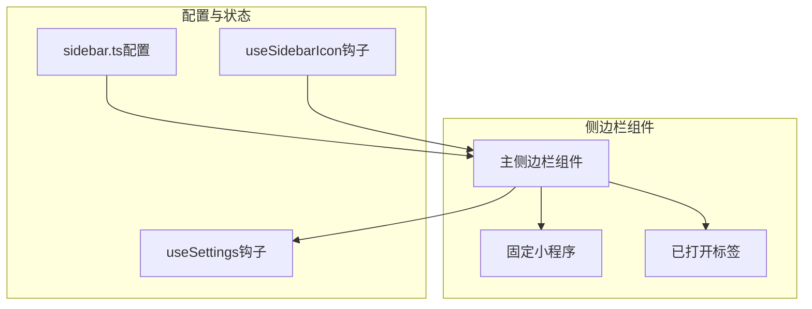
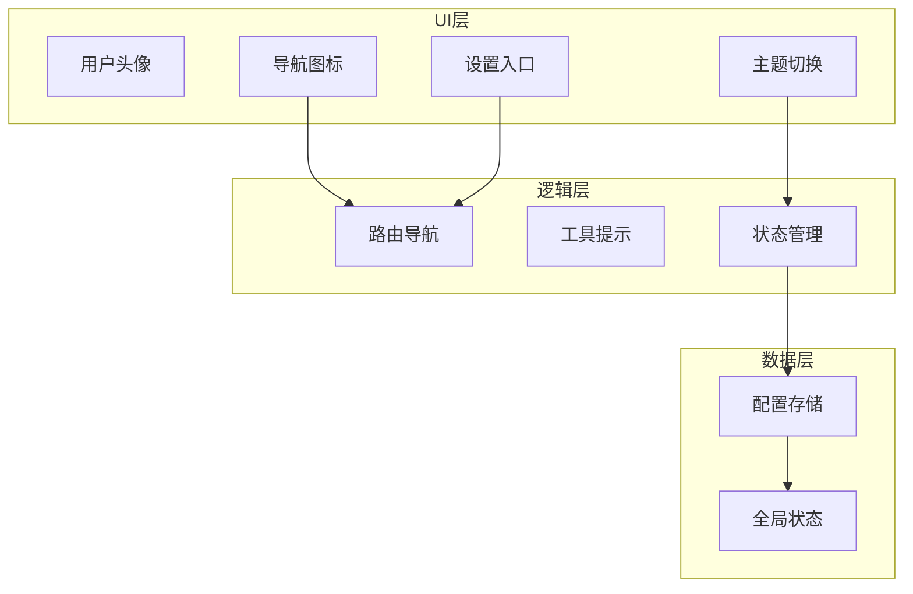
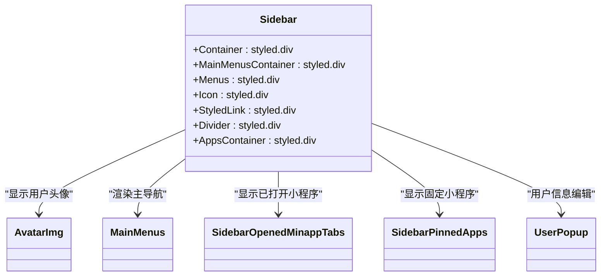
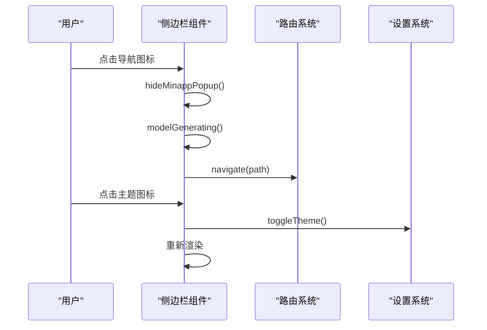
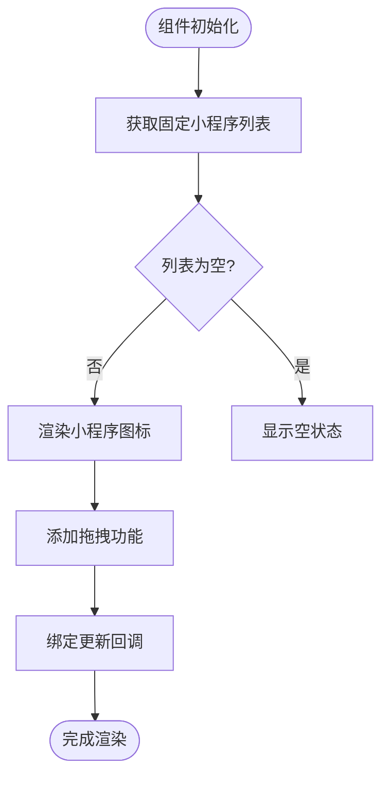
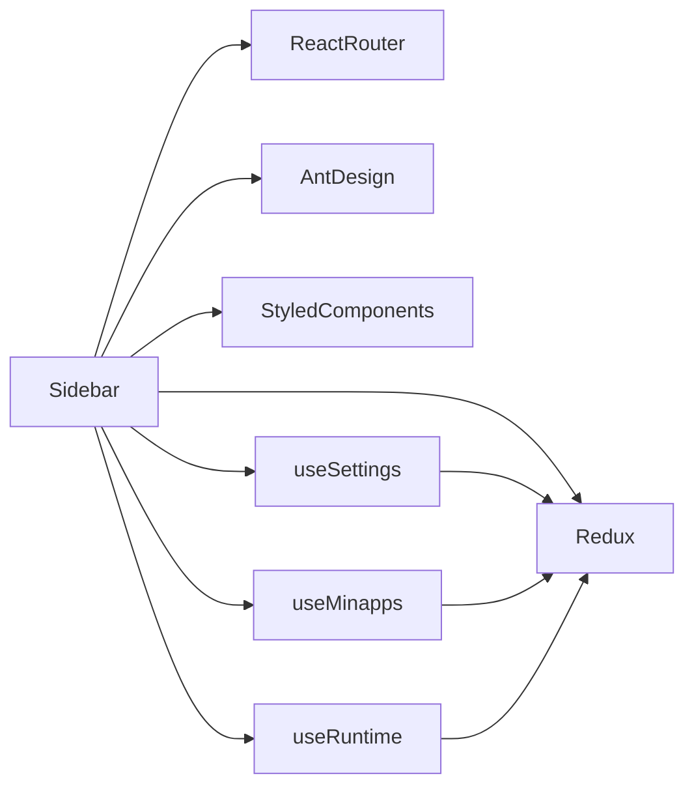

# 侧边栏组件

<cite>
**本文档中引用的文件**  
- [Sidebar.tsx](file://src/renderer/src/components/app/Sidebar.tsx)
- [sidebar.ts](file://src/renderer/src/config/sidebar.ts)
- [PinnedMinapps.tsx](file://src/renderer/src/components/app/PinnedMinapps.tsx)
- [useSettings.ts](file://src/renderer/src/hooks/useSettings.ts)
- [useSidebarIcon.ts](file://src/renderer/src/hooks/useSidebarIcon.ts)
- [types/index.ts](file://src/renderer/src/types/index.ts)
- [responsive.css](file://src/renderer/src/assets/styles/responsive.css)
</cite>

## 目录
1. [简介](#简介)
2. [项目结构](#项目结构)
3. [核心组件](#核心组件)
4. [架构概述](#架构概述)
5. [详细组件分析](#详细组件分析)
6. [依赖分析](#依赖分析)
7. [性能考虑](#性能考虑)
8. [故障排除指南](#故障排除指南)
9. [结论](#结论)

## 简介
侧边栏组件是Cherry Studio应用的核心导航界面，为用户提供快速访问主要功能模块的入口。该组件采用现代化的React架构设计，结合TypeScript类型系统和styled-components样式方案，实现了高度可配置和响应式的用户界面。侧边栏支持多种交互模式，包括主功能导航、小程序固定和主题切换等功能，为用户提供了灵活的个性化体验。

## 项目结构
侧边栏相关组件主要分布在`src/renderer/src/components/app/`目录下，其结构设计遵循功能分离原则。核心组件包括主侧边栏(Sidebar)、固定小程序(SidebarPinnedApps)和已打开小程序标签(SidebarOpenedMinappTabs)。配置文件位于`src/renderer/src/config/`目录，而相关状态管理则通过`src/renderer/src/hooks/`目录下的自定义hooks实现。这种组织方式确保了代码的可维护性和可扩展性。

**Diagram sources**
- [Sidebar.tsx](file://src/renderer/src/components/app/Sidebar.tsx)
- [PinnedMinapps.tsx](file://src/renderer/src/components/app/PinnedMinapps.tsx)
- [sidebar.ts](file://src/renderer/src/config/sidebar.ts)

**Section sources**
- [Sidebar.tsx](file://src/renderer/src/components/app/Sidebar.tsx)
- [PinnedMinapps.tsx](file://src/renderer/src/components/app/PinnedMinapps.tsx)

## 核心组件
侧边栏组件的核心功能包括主导航图标管理、用户头像显示、主题切换和设置访问。组件通过`useSettings`钩子获取用户配置，动态渲染可见的导航图标。每个图标都集成了工具提示(Tooltip)和路由导航功能，确保用户能够轻松访问不同功能模块。特别地，"assistants"图标被设计为必需显示项，确保用户始终能够访问核心助手功能。

**Section sources**
- [Sidebar.tsx](file://src/renderer/src/components/app/Sidebar.tsx#L39-L118)
- [sidebar.ts](file://src/renderer/src/config/sidebar.ts#L7-L25)

## 架构概述
侧边栏组件采用分层架构设计，上层为主容器和用户交互元素，中层为动态导航菜单，下层为系统功能入口。组件通过React Router实现页面导航，利用Ant Design的Tooltip组件提供交互反馈，并通过styled-components实现样式定制。状态管理采用Redux结合自定义hooks的模式，确保配置变更能够实时反映在UI上。

**Diagram sources**
- [Sidebar.tsx](file://src/renderer/src/components/app/Sidebar.tsx#L39-L118)
- [Router.tsx](file://src/renderer/src/Router.tsx#L25-L47)

## 详细组件分析

### 主侧边栏分析
主侧边栏组件负责整体布局和主要功能的集成。它通过flex布局实现垂直排列，包含用户头像、主导航菜单、已打开的小程序标签和系统功能入口。组件根据全屏状态和操作系统类型调整尺寸和位置，确保在不同环境下都能提供一致的用户体验。

#### 组件结构

**Diagram sources**
- [Sidebar.tsx](file://src/renderer/src/components/app/Sidebar.tsx#L39-L304)

#### 交互流程

**Diagram sources**
- [Sidebar.tsx](file://src/renderer/src/components/app/Sidebar.tsx#L58-L61)
- [useRuntime.ts](file://src/renderer/src/hooks/useRuntime.ts)

### 固定小程序分析
固定小程序功能允许用户将常用的小程序固定在侧边栏中，实现快速访问。该功能通过`DraggableList`组件实现拖拽排序，用户可以通过右键菜单取消固定。组件利用`useMinapps`钩子管理固定小程序列表，并通过`updatePinnedMinapps`函数实现列表更新。

#### 状态管理

**Diagram sources**
- [PinnedMinapps.tsx](file://src/renderer/src/components/app/PinnedMinapps.tsx#L107-L144)

**Section sources**
- [PinnedMinapps.tsx](file://src/renderer/src/components/app/PinnedMinapps.tsx#L1-L239)
- [useMinapps.ts](file://src/renderer/src/hooks/useMinapps.ts)

### 已打开小程序标签分析
已打开小程序标签区域显示当前处于活动状态的小程序，为用户提供快速切换的便利。该组件通过`useRuntime`钩子监听当前活动的小程序，并利用CSS变量实现切换指示器的动画效果。当用户点击标签时，会触发`openMinappKeepAlive`函数，激活相应的小程序。

**Section sources**
- [PinnedMinapps.tsx](file://src/renderer/src/components/app/PinnedMinapps.tsx#L18-L105)
- [useRuntime.ts](file://src/renderer/src/hooks/useRuntime.ts)

## 依赖分析
侧边栏组件依赖于多个核心系统和第三方库。主要依赖包括React生态系统(React Router、Ant Design)、状态管理(Redux)和样式系统(styled-components)。组件通过自定义hooks与应用的其他部分进行交互，确保了低耦合和高内聚的设计原则。

**Diagram sources**
- [Sidebar.tsx](file://src/renderer/src/components/app/Sidebar.tsx#L2-L34)
- [useSettings.ts](file://src/renderer/src/hooks/useSettings.ts)
- [store.ts](file://src/renderer/src/store/settings.ts)

## 性能考虑
侧边栏组件在设计时充分考虑了性能优化。通过使用React.memo和useMemo等优化技术，减少了不必要的重新渲染。图标渲染采用虚拟化技术，确保在大量小程序情况下仍能保持流畅的交互体验。此外，组件利用CSS硬件加速和transform属性优化动画性能，提供流畅的视觉效果。

## 故障排除指南
常见问题包括侧边栏不显示、图标点击无响应和样式错乱等。对于侧边栏不显示的问题，应检查`navbarPosition`设置是否正确配置为"left"。对于图标点击无响应，需要验证路由配置和`navigate`函数是否正确导入。样式错乱问题通常与CSS变量定义有关，应检查`responsive.css`文件中的变量设置。

**Section sources**
- [Router.tsx](file://src/renderer/src/Router.tsx#L49-L57)
- [responsive.css](file://src/renderer/src/assets/styles/responsive.css#L1-L27)

## 结论
Cherry Studio的侧边栏组件是一个功能丰富、设计精良的导航系统，为用户提供了直观高效的应用访问方式。通过合理的架构设计和状态管理，组件实现了高度的可配置性和可扩展性。未来可以考虑增加更多个性化选项，如自定义图标大小和布局方向，进一步提升用户体验。