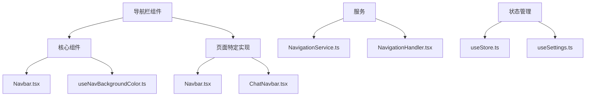
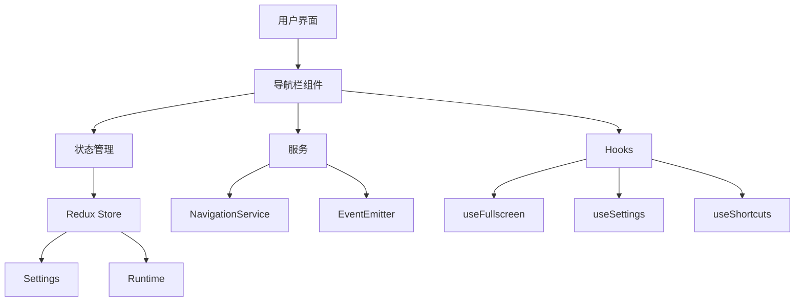
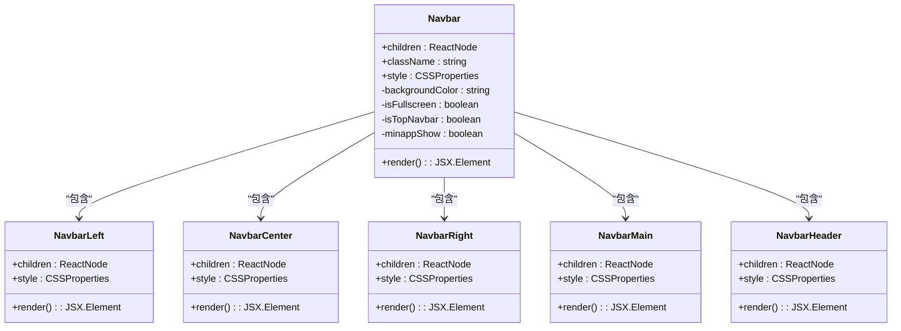
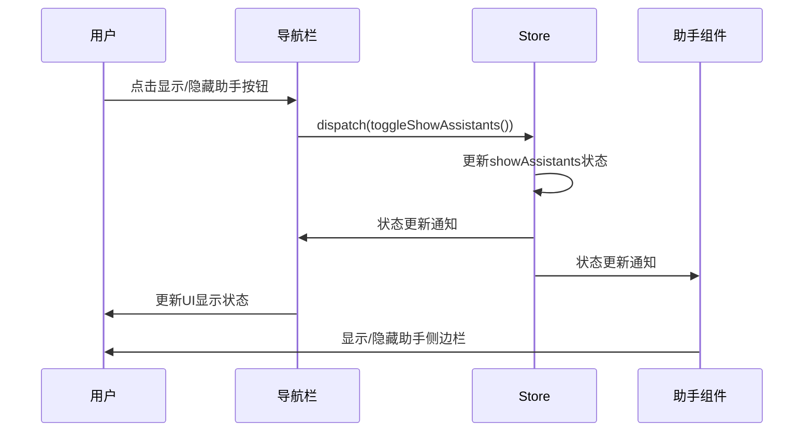
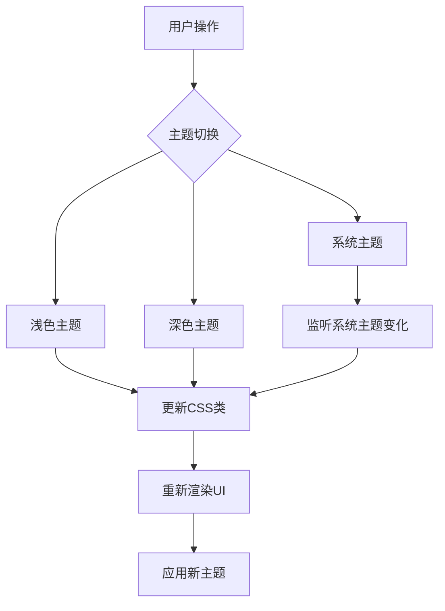
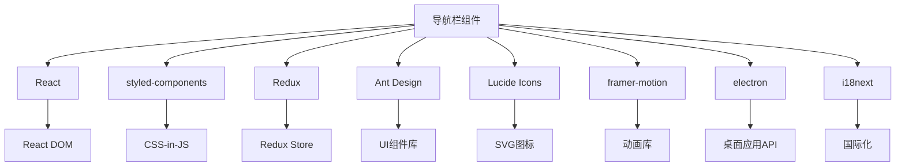

# 导航栏组件

<cite>
**本文档引用的文件**  
- [Navbar.tsx](file://src/renderer/src/components/app/Navbar.tsx)
- [Navbar.tsx](file://src/renderer/src/pages/home/Navbar.tsx)
- [NavigationService.ts](file://src/renderer/src/services/NavigationService.ts)
- [NavigationHandler.tsx](file://src/renderer/src/handler/NavigationHandler.tsx)
- [useStore.ts](file://src/renderer/src/hooks/useStore.ts)
- [useSettings.ts](file://src/renderer/src/hooks/useSettings.ts)
- [ThemeProvider.tsx](file://src/renderer/src/context/ThemeProvider.tsx)
- [useNavBackgroundColor.ts](file://src/renderer/src/hooks/useNavBackgroundColor.ts)
- [constant.ts](file://src/renderer/src/config/constant.ts)
</cite>

## 目录
1. [简介](#简介)
2. [项目结构](#项目结构)
3. [核心组件](#核心组件)
4. [架构概述](#架构概述)
5. [详细组件分析](#详细组件分析)
6. [依赖分析](#依赖分析)
7. [性能考虑](#性能考虑)
8. [故障排除指南](#故障排除指南)
9. [结论](#结论)

## 简介
Cherry Studio的导航栏组件是应用程序的核心UI元素，负责管理用户界面的主要导航功能。该组件实现了动态行为，能够根据不同的页面状态进行响应式调整，并集成了AI会话、助手管理和主题切换等关键功能。导航栏的设计考虑了跨平台兼容性，针对macOS、Windows和Linux系统进行了优化，确保在各种设备上都能提供一致的用户体验。

## 项目结构
Cherry Studio的导航栏组件分布在多个文件中，形成了一个模块化的架构。主要组件位于`src/renderer/src/components/app/`目录下，而特定页面的导航栏实现则位于`src/renderer/src/pages/home/`目录中。这种分离设计使得导航栏的核心功能与具体页面的实现解耦，提高了代码的可维护性和复用性。

**图示来源**  
- [Navbar.tsx](file://src/renderer/src/components/app/Navbar.tsx)
- [Navbar.tsx](file://src/renderer/src/pages/home/Navbar.tsx)
- [NavigationService.ts](file://src/renderer/src/services/NavigationService.ts)
- [NavigationHandler.tsx](file://src/renderer/src/handler/NavigationHandler.tsx)
- [useStore.ts](file://src/renderer/src/hooks/useStore.ts)
- [useSettings.ts](file://src/renderer/src/hooks/useSettings.ts)

**本节来源**  
- [Navbar.tsx](file://src/renderer/src/components/app/Navbar.tsx)
- [Navbar.tsx](file://src/renderer/src/pages/home/Navbar.tsx)

## 核心组件
导航栏组件由多个核心部分组成，包括左侧、中心和右侧区域，每个区域都有特定的功能和职责。组件使用React的函数式组件和Hooks来管理状态和副作用，确保了代码的简洁性和可测试性。通过使用styled-components，导航栏实现了灵活的样式定制，能够根据应用程序的主题和用户设置动态调整外观。

**本节来源**  
- [Navbar.tsx](file://src/renderer/src/components/app/Navbar.tsx)
- [useNavBackgroundColor.ts](file://src/renderer/src/hooks/useNavBackgroundColor.ts)

## 架构概述
Cherry Studio的导航栏架构采用了分层设计，将UI组件、状态管理和业务逻辑分离。这种架构使得组件更易于维护和扩展，同时也提高了代码的可读性和可测试性。导航栏的实现依赖于多个Hooks来获取应用程序的状态，如全屏状态、主题设置和用户偏好，这些状态的变化会触发导航栏的重新渲染，确保UI始终与应用程序的状态保持同步。

**图示来源**  
- [Navbar.tsx](file://src/renderer/src/components/app/Navbar.tsx)
- [useStore.ts](file://src/renderer/src/hooks/useStore.ts)
- [useSettings.ts](file://src/renderer/src/hooks/useSettings.ts)
- [NavigationService.ts](file://src/renderer/src/services/NavigationService.ts)

**本节来源**  
- [Navbar.tsx](file://src/renderer/src/components/app/Navbar.tsx)
- [useStore.ts](file://src/renderer/src/hooks/useStore.ts)
- [useSettings.ts](file://src/renderer/src/hooks/useSettings.ts)

## 详细组件分析
### 导航栏组件分析
导航栏组件是Cherry Studio用户界面的核心部分，负责提供主要的导航功能和用户交互。组件的设计考虑了跨平台兼容性，针对不同的操作系统进行了优化，确保在macOS、Windows和Linux上都能提供一致的用户体验。

#### 对象导向组件

**图示来源**  
- [Navbar.tsx](file://src/renderer/src/components/app/Navbar.tsx)

**本节来源**  
- [Navbar.tsx](file://src/renderer/src/components/app/Navbar.tsx)

### 助手管理集成
导航栏组件与助手管理功能紧密集成，允许用户通过点击按钮来显示或隐藏助手侧边栏。这种集成通过使用Redux Store来管理应用程序的状态，确保了状态的一致性和可预测性。当用户点击显示/隐藏助手的按钮时，组件会触发相应的action，更新Store中的状态，从而触发UI的重新渲染。

**图示来源**  
- [Navbar.tsx](file://src/renderer/src/pages/home/Navbar.tsx)
- [useStore.ts](file://src/renderer/src/hooks/useStore.ts)

**本节来源**  
- [Navbar.tsx](file://src/renderer/src/pages/home/Navbar.tsx)
- [useStore.ts](file://src/renderer/src/hooks/useStore.ts)

### 主题切换机制
导航栏组件支持动态主题切换，允许用户在浅色、深色和系统主题之间进行切换。这一功能通过ThemeProvider和useTheme Hook实现，确保了主题变化能够全局生效，并且能够响应操作系统的主题设置。

**图示来源**  
- [ThemeProvider.tsx](file://src/renderer/src/context/ThemeProvider.tsx)
- [useSettings.ts](file://src/renderer/src/hooks/useSettings.ts)

**本节来源**  
- [ThemeProvider.tsx](file://src/renderer/src/context/ThemeProvider.tsx)
- [useSettings.ts](file://src/renderer/src/hooks/useSettings.ts)

## 依赖分析
导航栏组件依赖于多个内部和外部模块，形成了一个复杂的依赖网络。这些依赖包括状态管理、UI库、平台特定功能和第三方服务。通过分析这些依赖关系，可以更好地理解组件的架构和潜在的优化方向。

**图示来源**  
- [Navbar.tsx](file://src/renderer/src/components/app/Navbar.tsx)
- [package.json](file://package.json)

**本节来源**  
- [Navbar.tsx](file://src/renderer/src/components/app/Navbar.tsx)
- [package.json](file://package.json)

## 性能考虑
在设计和实现导航栏组件时，性能是一个重要的考虑因素。通过使用React的memoization、懒加载和代码分割等技术，可以显著提高组件的性能。此外，避免不必要的重新渲染和优化状态管理也是提升性能的关键策略。

**本节来源**  
- [Navbar.tsx](file://src/renderer/src/components/app/Navbar.tsx)
- [useSettings.ts](file://src/renderer/src/hooks/useSettings.ts)

## 故障排除指南
在使用导航栏组件时，可能会遇到一些常见问题，如按钮无响应、样式错乱或状态不同步。以下是一些常见的故障排除步骤：

1. 检查Redux Store中的状态是否正确更新
2. 确认事件监听器是否正确绑定
3. 验证样式文件是否正确加载
4. 检查浏览器控制台是否有错误信息
5. 确认依赖项版本是否兼容

**本节来源**  
- [NavigationHandler.tsx](file://src/renderer/src/handler/NavigationHandler.tsx)
- [useStore.ts](file://src/renderer/src/hooks/useStore.ts)

## 结论
Cherry Studio的导航栏组件是一个功能丰富、设计精良的UI元素，它不仅提供了基本的导航功能，还集成了助手管理、主题切换等高级特性。通过采用模块化设计和现代前端技术，该组件实现了高性能、高可维护性和良好的用户体验。未来的工作可以集中在进一步优化性能、增强可访问性和扩展功能上，以满足不断变化的用户需求。