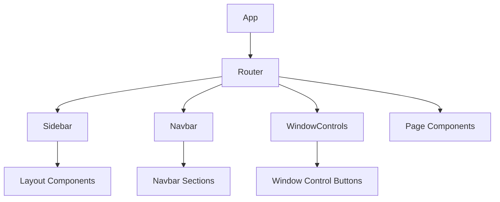
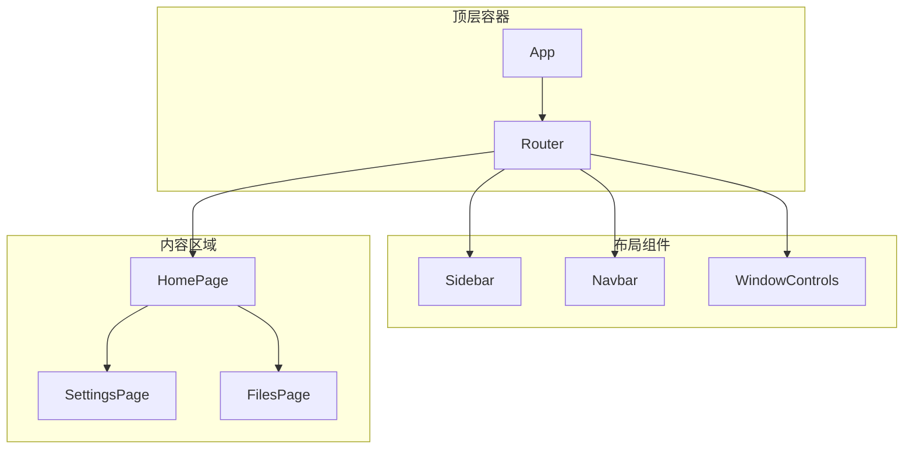
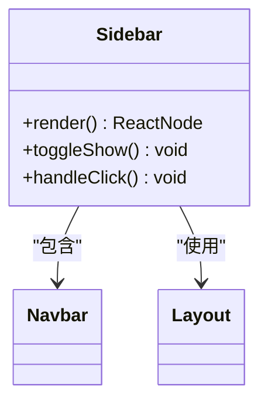
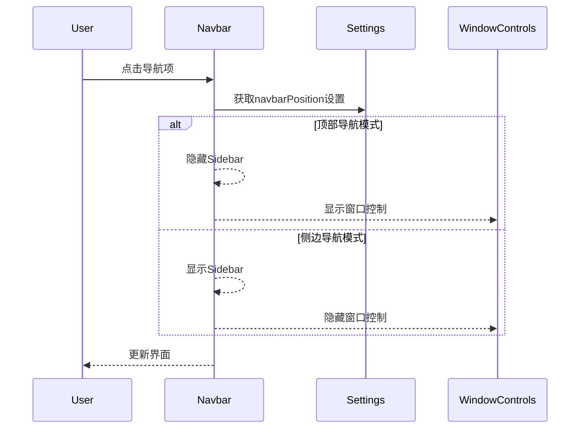
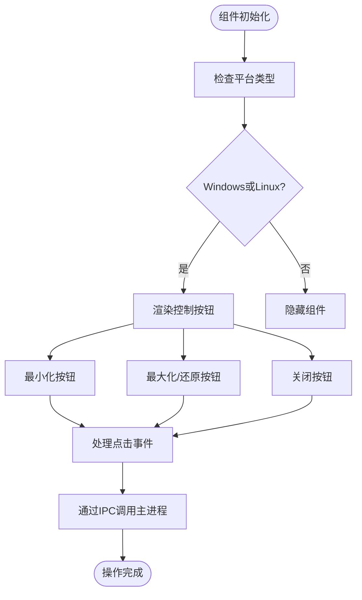
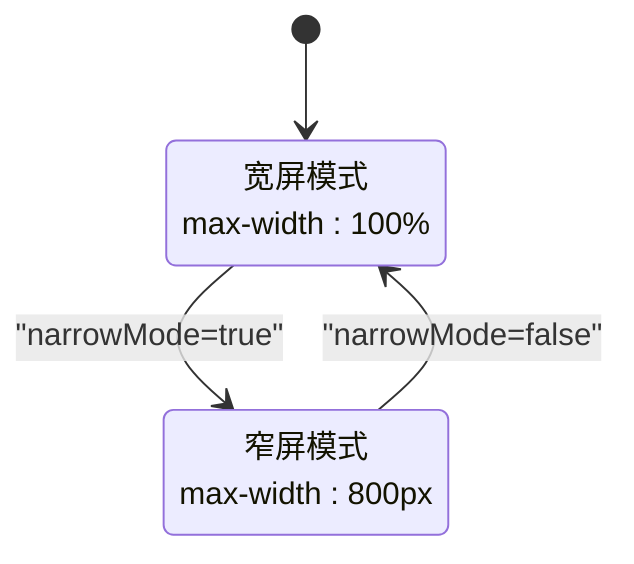
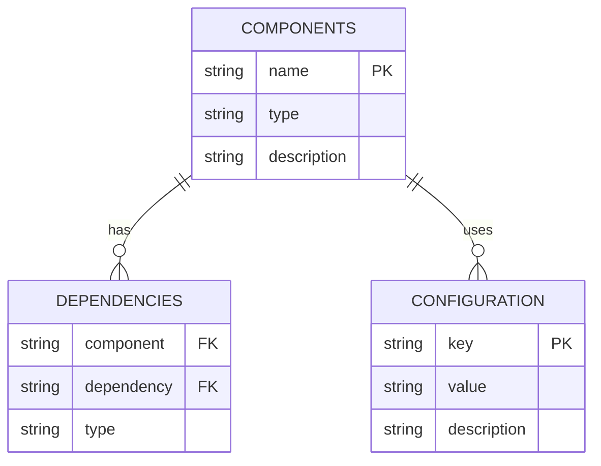

# 布局组件

<cite>
**本文档引用的文件**  
- [App.tsx](file://src/renderer/src/App.tsx)
- [Router.tsx](file://src/renderer/src/Router.tsx)
- [Sidebar.tsx](file://src/renderer/src/components/app/Sidebar.tsx)
- [Navbar.tsx](file://src/renderer/src/components/app/Navbar.tsx)
- [WindowControls.styled.ts](file://src/renderer/src/components/WindowControls/WindowControls.styled.ts)
- [index.tsx](file://src/renderer/src/components/WindowControls/index.tsx)
- [Layout/index.ts](file://src/renderer/src/components/Layout/index.ts)
- [HomePage.tsx](file://src/renderer/src/pages/home/HomePage.tsx)
- [NarrowLayout.tsx](file://src/renderer/src/pages/home/Messages/NarrowLayout.tsx)
- [useSettings.ts](file://src/renderer/src/hooks/useSettings.ts)
</cite>

## 目录
1. [简介](#简介)
2. [项目结构](#项目结构)
3. [核心组件](#核心组件)
4. [架构概述](#架构概述)
5. [详细组件分析](#详细组件分析)
6. [依赖分析](#依赖分析)
7. [性能考虑](#性能考虑)
8. [故障排除指南](#故障排除指南)
9. [结论](#结论)

## 简介
本文档全面介绍了Cherry Studio应用的布局组件系统，包括Sidebar、Navbar和WindowControls等核心组件的实现。文档详细解释了响应式设计策略、布局调整机制以及组件间的通信方式，并提供了完整的配置示例和性能优化建议。

## 项目结构
Cherry Studio的布局组件主要位于`src/renderer/src/components/app/`目录下，采用模块化设计，各组件职责分明。布局系统基于React和styled-components构建，通过CSS变量和Flexbox实现灵活的布局控制。

**图示来源**  
- [App.tsx](file://src/renderer/src/App.tsx#L1-L56)
- [Router.tsx](file://src/renderer/src/Router.tsx#L1-L68)

## 核心组件
布局系统由三个核心组件构成：Sidebar（侧边栏）、Navbar（导航栏）和WindowControls（窗口控制）。这些组件通过React Context和状态管理实现通信和同步，支持多种布局模式和响应式设计。

**章节来源**  
- [Sidebar.tsx](file://src/renderer/src/components/app/Sidebar.tsx)
- [Navbar.tsx](file://src/renderer/src/components/app/Navbar.tsx)
- [WindowControls/index.tsx](file://src/renderer/src/components/WindowControls/index.tsx)

## 架构概述
Cherry Studio的布局架构采用分层设计，顶层为应用容器，中间层为导航和控制组件，底层为内容页面。布局系统通过CSS变量和媒体查询实现响应式设计，支持不同屏幕尺寸下的自适应布局。

**图示来源**  
- [App.tsx](file://src/renderer/src/App.tsx#L1-L56)
- [Router.tsx](file://src/renderer/src/Router.tsx#L1-L68)

## 详细组件分析

### Sidebar分析
Sidebar组件作为应用的主要导航入口，提供全局导航功能。组件支持显示/隐藏切换，通过CSS过渡动画实现平滑的展开和收起效果。

**图示来源**  
- [Sidebar.tsx](file://src/renderer/src/components/app/Sidebar.tsx)
- [Navbar.tsx](file://src/renderer/src/components/app/Navbar.tsx)

### Navbar分析
Navbar组件实现顶部或侧边导航栏，支持多种布局模式。组件根据系统平台（macOS、Windows、Linux）调整样式和行为，确保跨平台一致性。

**图示来源**  
- [Navbar.tsx](file://src/renderer/src/components/app/Navbar.tsx#L1-L129)
- [useSettings.ts](file://src/renderer/src/hooks/useSettings.ts)

### WindowControls分析
WindowControls组件为Windows和Linux平台提供窗口控制按钮（最小化、最大化/还原、关闭），macOS平台使用系统原生标题栏。

**图示来源**  
- [WindowControls/index.tsx](file://src/renderer/src/components/WindowControls/index.tsx#L1-L111)
- [WindowControls.styled.ts](file://src/renderer/src/components/WindowControls/WindowControls.styled.ts#L1-L46)

### 响应式布局分析
布局系统通过NarrowLayout组件实现窄屏模式，根据用户设置动态调整内容区域宽度。

**图示来源**  
- [NarrowLayout.tsx](file://src/renderer/src/pages/home/Messages/NarrowLayout.tsx#L1-L31)
- [useSettings.ts](file://src/renderer/src/hooks/useSettings.ts)

## 依赖分析
布局组件依赖于多个核心模块，包括状态管理、主题系统和IPC通信。组件间通过React Props和Context进行数据传递，确保松耦合和高内聚。

**图示来源**  
- [App.tsx](file://src/renderer/src/App.tsx#L1-L56)
- [Router.tsx](file://src/renderer/src/Router.tsx#L1-L68)

## 性能考虑
布局组件在性能优化方面采取了多项措施，包括：

1. **初始渲染优化**：使用React.memo对静态组件进行记忆化，避免不必要的重渲染。
2. **事件处理优化**：对窗口控制事件使用useCallback进行记忆化，减少函数创建开销。
3. **状态管理优化**：通过useEffect的依赖数组精确控制副作用执行时机。
4. **CSS过渡优化**：使用CSS transition而非JavaScript动画，利用硬件加速提升性能。

**章节来源**  
- [WindowControls/index.tsx](file://src/renderer/src/components/WindowControls/index.tsx#L50-L63)
- [Navbar.tsx](file://src/renderer/src/components/app/Navbar.tsx#L15-L18)

## 故障排除指南
### 常见问题及解决方案

| 问题现象 | 可能原因 | 解决方案 |
|---------|--------|---------|
| 窗口控制按钮不显示 | 在macOS平台 | 正常行为，macOS使用系统原生标题栏 |
| Sidebar无法切换显示 | 状态更新问题 | 检查useSettings Hook的narrowMode状态 |
| 布局错位 | CSS变量未正确设置 | 确保--sidebar-width等CSS变量已定义 |
| 响应式布局失效 | 媒体查询问题 | 检查浏览器窗口尺寸和CSS媒体查询条件 |

**章节来源**  
- [WindowControls/index.tsx](file://src/renderer/src/components/WindowControls/index.tsx)
- [NarrowLayout.tsx](file://src/renderer/src/pages/home/Messages/NarrowLayout.tsx)

## 结论
Cherry Studio的布局组件系统设计合理，具有良好的可扩展性和维护性。通过模块化设计和清晰的职责划分，系统能够灵活应对不同的布局需求。建议在使用时遵循最佳实践，充分利用提供的配置选项和响应式特性，以创建一致且用户友好的界面体验。