# 窗口控制组件

<cite>
**本文档中引用的文件**
- [index.tsx](file://src/renderer/src/components/WindowControls/index.tsx)
- [WindowControls.styled.ts](file://src/renderer/src/components/WindowControls/WindowControls.styled.ts)
- [ipc.ts](file://src/main/ipc.ts)
- [IpcChannel.ts](file://packages/shared/IpcChannel.ts)
- [constant.ts](file://src/renderer/src/config/constant.ts)
- [Navbar.tsx](file://src/renderer/src/components/app/Navbar.tsx)
- [ThemeProvider.tsx](file://src/renderer/src/context/ThemeProvider.tsx)
- [useNavBackgroundColor.ts](file://src/renderer/src/hooks/useNavBackgroundColor.ts)
</cite>

## 目录
1. [简介](#简介)
2. [项目结构](#项目结构)
3. [核心组件](#核心组件)
4. [架构概览](#架构概览)
5. [详细组件分析](#详细组件分析)
6. [跨平台实现](#跨平台实现)
7. [IPC通信机制](#ipc通信机制)
8. [样式定制指南](#样式定制指南)
9. [主题系统集成](#主题系统集成)
10. [无障碍访问支持](#无障碍访问支持)
11. [性能优化建议](#性能优化建议)
12. [故障排除指南](#故障排除指南)
13. [结论](#结论)

## 简介

WindowControls组件是Cherry Studio应用程序中的关键UI组件，负责提供标准的窗口控制功能（最小化、最大化/还原、关闭）。该组件采用跨平台设计理念，针对Windows、Mac和Linux系统提供一致的用户体验，同时通过Electron的IPC机制与主进程进行通信，确保窗口操作的正确执行。

该组件的设计充分考虑了不同操作系统的窗口管理差异，实现了智能的平台适配策略，并提供了丰富的样式定制选项和无障碍访问支持。

## 项目结构

WindowControls组件在项目中的组织结构如下：

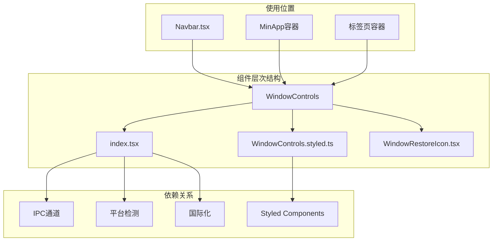

**图表来源**
- [index.tsx](file://src/renderer/src/components/WindowControls/index.tsx#L1-L111)
- [WindowControls.styled.ts](file://src/renderer/src/components/WindowControls/WindowControls.styled.ts#L1-L47)

**章节来源**
- [index.tsx](file://src/renderer/src/components/WindowControls/index.tsx#L1-L111)
- [WindowControls.styled.ts](file://src/renderer/src/components/WindowControls/WindowControls.styled.ts#L1-L47)

## 核心组件

WindowControls组件的核心功能包括三个基本窗口控制按钮：最小化、最大化/还原和关闭。组件采用函数式组件设计，利用React Hooks管理状态和生命周期。

### 主要特性

- **跨平台兼容性**：仅在Windows和Linux系统上显示，在Mac系统上隐藏
- **状态同步**：实时跟踪窗口的最大化状态
- **IPC通信**：通过Electron IPC与主进程交互
- **无障碍支持**：提供ARIA标签和键盘导航支持
- **样式定制**：基于CSS变量的主题适配

**章节来源**
- [index.tsx](file://src/renderer/src/components/WindowControls/index.tsx#L49-L108)

## 架构概览

WindowControls组件采用了分层架构设计，清晰地分离了表现层、业务逻辑层和通信层：

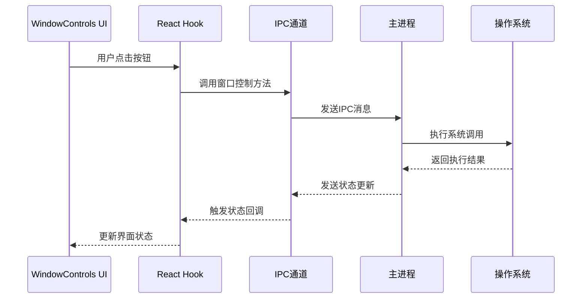

**图表来源**
- [index.tsx](file://src/renderer/src/components/WindowControls/index.tsx#L70-L84)
- [ipc.ts](file://src/main/ipc.ts#L707-L739)

## 详细组件分析

### 组件结构分析

WindowControls组件采用简洁的结构设计，主要包含以下部分：

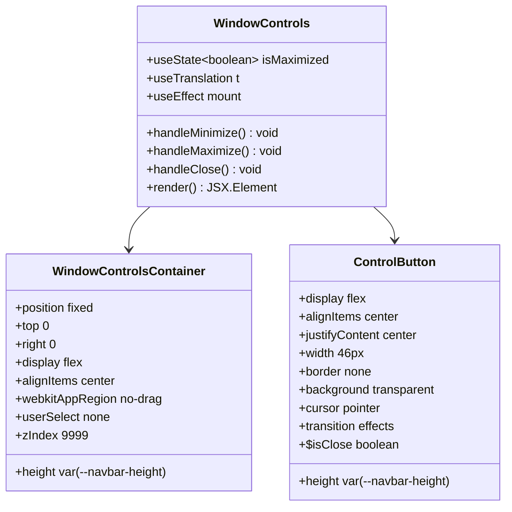

**图表来源**
- [index.tsx](file://src/renderer/src/components/WindowControls/index.tsx#L49-L108)
- [WindowControls.styled.ts](file://src/renderer/src/components/WindowControls/WindowControls.styled.ts#L3-L46)

### 状态管理机制

组件使用React的`useState`和`useEffect`钩子来管理窗口状态：

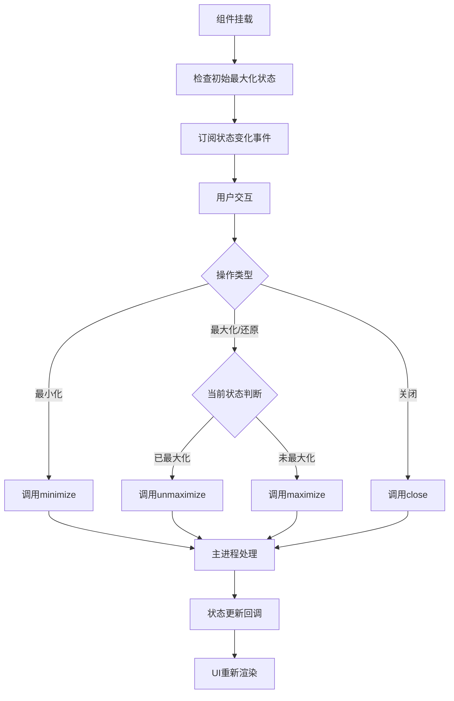

**图表来源**
- [index.tsx](file://src/renderer/src/components/WindowControls/index.tsx#L53-L62)
- [index.tsx](file://src/renderer/src/components/WindowControls/index.tsx#L70-L84)

**章节来源**
- [index.tsx](file://src/renderer/src/components/WindowControls/index.tsx#L49-L108)

## 跨平台实现

### 平台检测机制

WindowControls组件通过平台检测来决定是否显示窗口控制按钮：

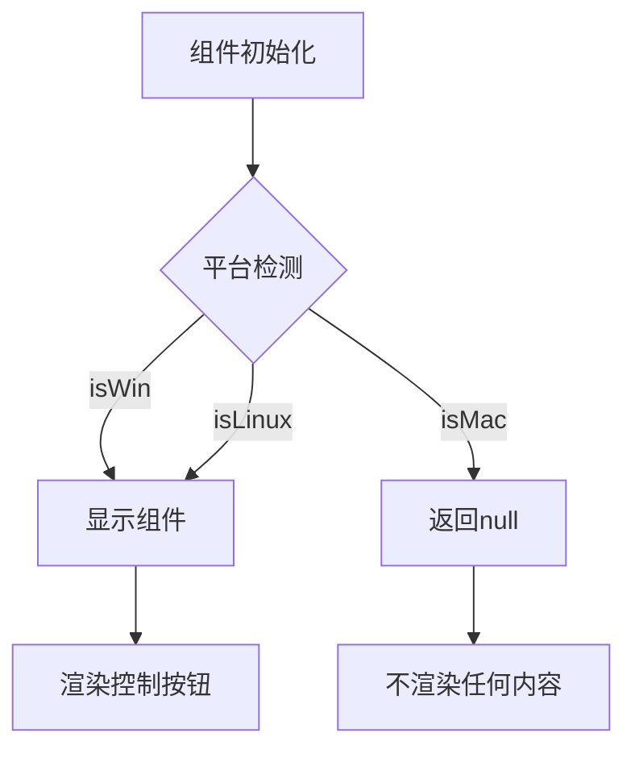

**图表来源**
- [index.tsx](file://src/renderer/src/components/WindowControls/index.tsx#L65-L68)
- [constant.ts](file://src/renderer/src/config/constant.ts#L10-L12)

### Mac系统特殊处理

在Mac系统上，窗口控制按钮被隐藏，因为Mac的窗口控制元素位于窗口标题栏的左侧：

- **标题栏区域**：使用`env(titlebar-area-height)`和`env(titlebar-area-x)`CSS变量
- **拖拽区域**：通过`-webkit-app-region: drag`实现窗口拖拽
- **透明窗口**：支持透明窗口模式下的背景色透明度

**章节来源**
- [constant.ts](file://src/renderer/src/config/constant.ts#L10-L12)
- [Navbar.tsx](file://src/renderer/src/components/app/Navbar.tsx#L64-L73)

## IPC通信机制

### 通信架构

WindowControls组件通过Electron的IPC机制与主进程进行通信，实现窗口操作的正确执行：

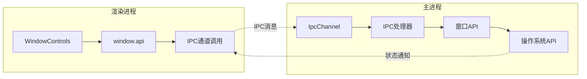

**图表来源**
- [ipc.ts](file://src/main/ipc.ts#L707-L739)
- [IpcChannel.ts](file://packages/shared/IpcChannel.ts#L136-L145)

### IPC通道定义

组件使用的IPC通道包括：

| 通道名称 | 功能描述 | 参数类型 | 返回值 |
|---------|----------|----------|--------|
| `Windows_Minimize` | 最小化窗口 | 无 | void |
| `Windows_Maximize` | 最大化窗口 | 无 | void |
| `Windows_Unmaximize` | 取消最大化 | 无 | void |
| `Windows_Close` | 关闭窗口 | 无 | void |
| `Windows_IsMaximized` | 检查最大化状态 | 无 | boolean |
| `Windows_MaximizedChanged` | 状态变化通知 | boolean | 无 |

**章节来源**
- [ipc.ts](file://src/main/ipc.ts#L707-L739)
- [IpcChannel.ts](file://packages/shared/IpcChannel.ts#L136-L145)

## 样式定制指南

### 基础样式结构

WindowControls组件使用styled-components库实现样式定制，支持CSS变量和主题适配：

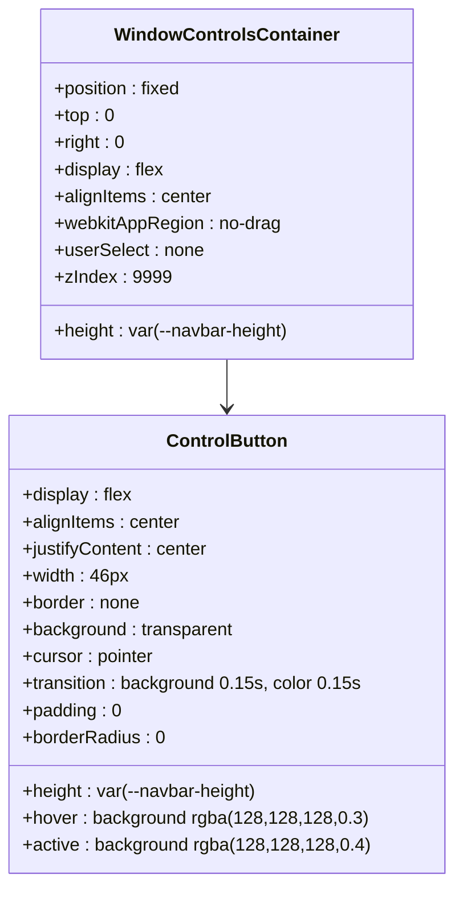

**图表来源**
- [WindowControls.styled.ts](file://src/renderer/src/components/WindowControls/WindowControls.styled.ts#L3-L46)

### 尺寸和布局调整

组件的尺寸和布局可以通过以下CSS变量进行调整：

| CSS变量 | 默认值 | 描述 |
|---------|--------|------|
| `--navbar-height` | 动态计算 | 导航栏高度 |
| `width` | 46px | 控制按钮宽度 |
| `height` | var(--navbar-height) | 控制按钮高度 |

### 颜色定制方案

组件支持多种颜色定制选项：

```mermaid
flowchart TD
A[颜色定制] --> B[普通状态]
A --> C[悬停状态]
A --> D[激活状态]
A --> E[关闭按钮特殊]
B --> F[background: transparent]
B --> G[color: var(--color-text)]
C --> H[background: rgba(128,128,128,0.3)]
C --> I[color: var(--color-text)]
D --> J[background: rgba(128,128,128,0.4)]
D --> K[color: var(--color-text)]
E --> L[background: #e81123]
E --> M[color: #ffffff]
```

**图表来源**
- [WindowControls.styled.ts](file://src/renderer/src/components/WindowControls/WindowControls.styled.ts#L33-L45)

**章节来源**
- [WindowControls.styled.ts](file://src/renderer/src/components/WindowControls/WindowControls.styled.ts#L1-L47)

## 主题系统集成

### 主题上下文

WindowControls组件与Cherry Studio的主题系统深度集成，通过ThemeProvider提供主题支持：

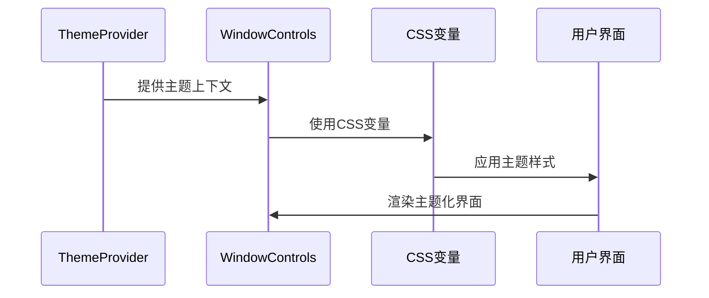

**图表来源**
- [ThemeProvider.tsx](file://src/renderer/src/context/ThemeProvider.tsx#L33-L95)
- [WindowControls.styled.ts](file://src/renderer/src/components/WindowControls/WindowControls.styled.ts#L23-L24)

### 主题变量映射

组件使用以下CSS变量来实现主题适配：

| CSS变量 | 用途 | 默认值 |
|---------|------|--------|
| `--color-text` | 文本颜色 | 动态根据主题 |
| `--navbar-height` | 导航栏高度 | 动态计算 |
| `--color-background` | 背景颜色 | 动态根据主题 |
| `--color-border` | 边框颜色 | 动态根据主题 |

### 夜间模式支持

组件完全支持夜间模式，通过CSS变量自动切换颜色方案：

- **浅色主题**：使用较亮的颜色组合
- **深色主题**：使用较暗的颜色组合  
- **系统主题**：跟随操作系统主题设置

**章节来源**
- [ThemeProvider.tsx](file://src/renderer/src/context/ThemeProvider.tsx#L1-L96)
- [WindowControls.styled.ts](file://src/renderer/src/components/WindowControls/WindowControls.styled.ts#L23-L24)

## 无障碍访问支持

### ARIA标签和语义化

WindowControls组件为每个按钮都提供了适当的ARIA标签，确保屏幕阅读器能够正确识别：

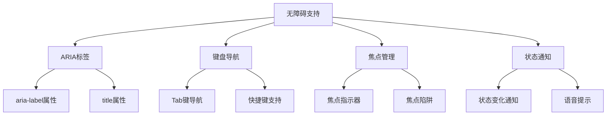

### 键盘导航实现

组件支持完整的键盘导航：

- **Tab键**：在控制按钮之间循环导航
- **Enter/Space**：激活当前选中的按钮
- **鼠标悬停**：显示工具提示和视觉反馈
- **延迟设置**：使用1秒延迟避免意外触发

### 状态变化通知

当窗口状态发生变化时，组件会通过以下方式通知辅助技术：

- **视觉反馈**：按钮状态的即时更新
- **工具提示**：显示当前操作的说明
- **状态栏**：在支持的环境中提供状态更新

**章节来源**
- [index.tsx](file://src/renderer/src/components/WindowControls/index.tsx#L88-L105)

## 性能优化建议

### 组件性能优化

为了确保WindowControls组件的最佳性能，建议采用以下优化策略：

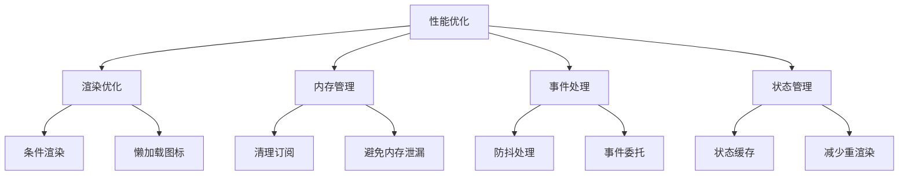

### 具体优化措施

1. **条件渲染优化**
   - 仅在Windows和Linux系统上渲染组件
   - 避免不必要的DOM节点创建

2. **事件处理优化**
   - 使用箭头函数避免重复绑定
   - 在组件卸载时清理事件监听器

3. **状态管理优化**
   - 合理使用useState和useEffect
   - 避免在渲染过程中进行复杂计算

4. **样式性能优化**
   - 使用CSS变量减少重排重绘
   - 利用硬件加速提升动画性能

### 内存泄漏防护

组件实现了完整的清理机制：

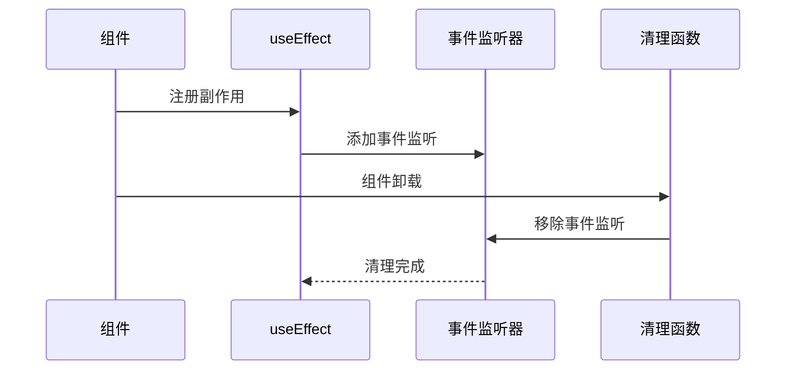

**图表来源**
- [index.tsx](file://src/renderer/src/components/WindowControls/index.tsx#L57-L62)

**章节来源**
- [index.tsx](file://src/renderer/src/components/WindowControls/index.tsx#L49-L108)

## 故障排除指南

### 常见问题及解决方案

#### 1. 窗口控制按钮不显示

**问题症状**：在Windows或Linux系统上看不到窗口控制按钮

**可能原因**：
- 平台检测逻辑出错
- 条件渲染逻辑异常
- CSS样式被覆盖

**解决方案**：
- 检查平台检测代码：`isWin || isLinux`
- 验证条件渲染逻辑
- 检查CSS优先级和样式覆盖

#### 2. 窗口操作无响应

**问题症状**：点击控制按钮后窗口没有反应

**可能原因**：
- IPC通信失败
- 主进程窗口对象不存在
- 权限问题

**解决方案**：
- 检查主进程日志
- 验证窗口对象状态
- 确认IPC通道注册

#### 3. 主题样式不生效

**问题症状**：窗口控制按钮颜色不符合当前主题

**可能原因**：
- CSS变量未正确设置
- 主题上下文未正确传递
- 样式优先级问题

**解决方案**：
- 检查CSS变量定义
- 验证ThemeProvider配置
- 调整样式优先级

### 调试技巧

1. **开发者工具**：使用Electron的开发者工具检查DOM和网络请求
2. **日志输出**：在关键位置添加console.log语句
3. **断点调试**：在IPC处理器中设置断点
4. **状态检查**：验证组件状态和props

**章节来源**
- [index.tsx](file://src/renderer/src/components/WindowControls/index.tsx#L65-L68)
- [ipc.ts](file://src/main/ipc.ts#L707-L739)

## 结论

WindowControls组件作为Cherry Studio的重要UI组件，成功实现了跨平台的窗口控制功能。通过精心设计的架构和完善的实现，该组件不仅提供了良好的用户体验，还具备了优秀的可维护性和扩展性。

### 主要优势

1. **跨平台兼容性**：智能的平台适配确保在不同操作系统上的一致体验
2. **IPC通信机制**：可靠的进程间通信保证窗口操作的正确执行
3. **样式定制能力**：灵活的CSS变量系统支持丰富的主题定制
4. **无障碍访问**：完整的ARIA标签和键盘导航支持
5. **性能优化**：合理的架构设计和优化策略确保良好的性能表现

### 未来发展方向

- **动画效果增强**：添加更流畅的过渡动画
- **手势支持**：支持触摸屏和手势操作
- **多窗口支持**：扩展到多窗口场景
- **自定义主题**：提供更多主题定制选项

WindowControls组件的设计和实现为Cherry Studio的用户界面奠定了坚实的基础，展现了现代桌面应用开发的最佳实践。