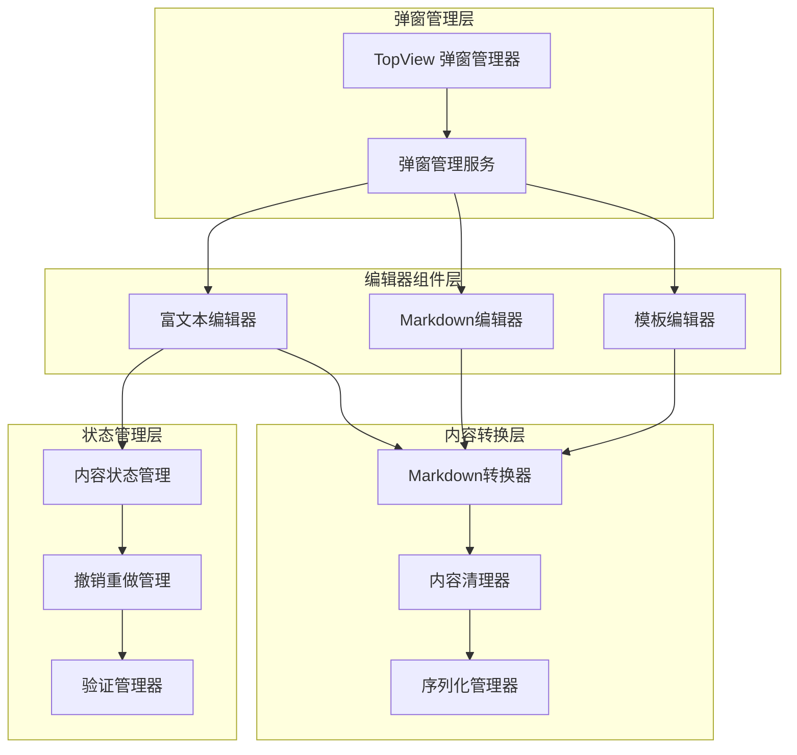
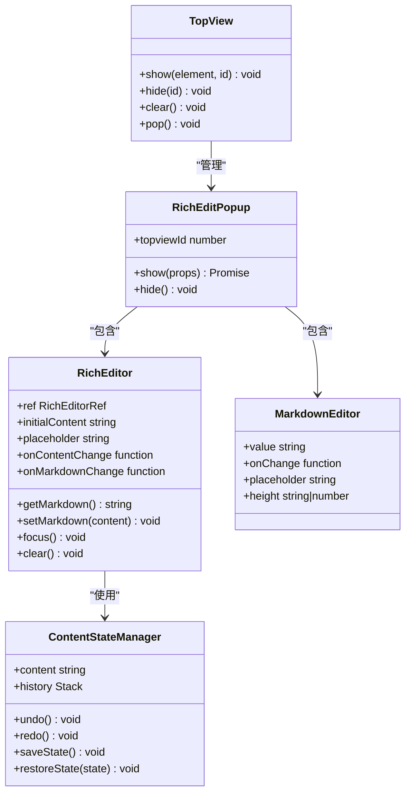
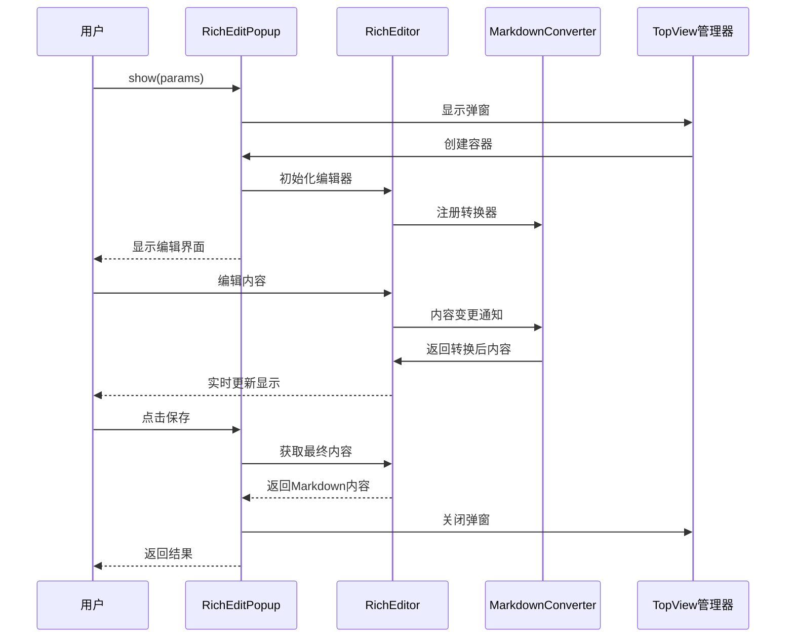
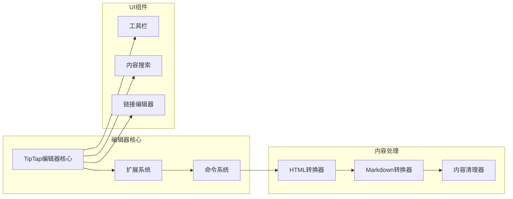
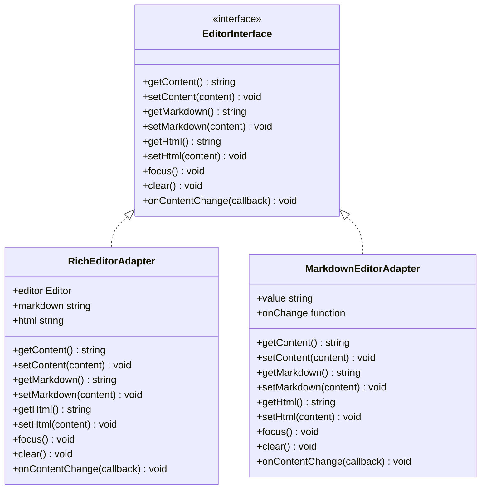
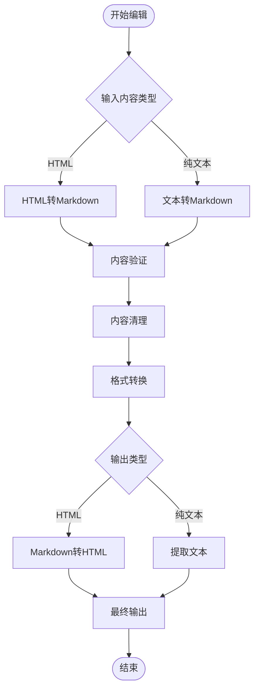
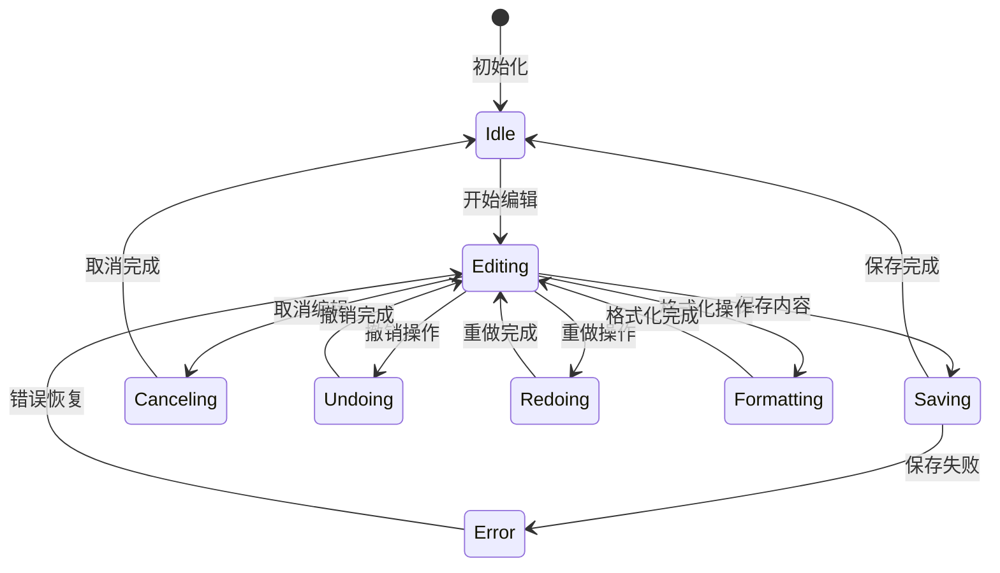
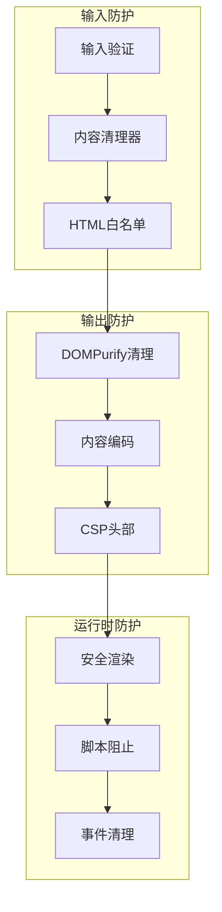

# 内容编辑弹窗技术文档

<cite>
**本文档引用的文件**
- [RichEditPopup.tsx](file://src/renderer/src/components/Popups/RichEditPopup.tsx)
- [RichEditor/index.tsx](file://src/renderer/src/components/RichEditor/index.tsx)
- [RichEditor/types.ts](file://src/renderer/src/components/RichEditor/types.ts)
- [RichEditor/useRichEditor.ts](file://src/renderer/src/components/RichEditor/useRichEditor.ts)
- [MarkdownEditor/index.tsx](file://src/renderer/src/components/MarkdownEditor/index.tsx)
- [TopView/index.tsx](file://src/renderer/src/components/TopView/index.tsx)
- [TemplatePopup.tsx](file://src/renderer/src/components/Popups/TemplatePopup.tsx)
- [GeneralPopup.tsx](file://src/renderer/src/components/Popups/GeneralPopup.tsx)
- [markdownConverter.ts](file://src/renderer/src/utils/markdownConverter.ts)
- [export.ts](file://src/renderer/src/utils/export.ts)
- [markdown.ts](file://src/renderer/src/utils/markdown.ts)
</cite>

## 目录
1. [概述](#概述)
2. [系统架构](#系统架构)
3. [核心组件分析](#核心组件分析)
4. [编辑器集成机制](#编辑器集成机制)
5. [内容序列化与转换](#内容序列化与转换)
6. [状态管理与生命周期](#状态管理与生命周期)
7. [安全机制与防护](#安全机制与防护)
8. [实际应用场景](#实际应用场景)
9. [最佳实践指南](#最佳实践指南)
10. [故障排除](#故障排除)

## 概述

Cherry Studio 的内容编辑弹窗系统是一个高度集成的富文本编辑解决方案，支持多种内容类型的编辑、预览和管理。该系统通过统一的弹窗框架，集成了富文本编辑器（RichEditor）、Markdown编辑器等多种编辑组件，为用户提供灵活的内容编辑体验。

### 主要特性

- **多格式支持**：支持富文本、Markdown、纯文本等多种内容格式
- **实时预览**：提供所见即所得的编辑体验
- **安全防护**：内置XSS防护和内容验证机制
- **状态管理**：完善的撤销/重做功能和内容状态跟踪
- **模板管理**：支持内容模板的创建、编辑和应用
- **弹窗框架**：基于TopView的统一弹窗管理系统

## 系统架构

### 整体架构图



**架构图来源**
- [TopView/index.tsx](file://src/renderer/src/components/TopView/index.tsx#L114-L121)
- [RichEditor/index.tsx](file://src/renderer/src/components/RichEditor/index.tsx#L183-L205)

### 组件关系图



**类图来源**
- [TopView/index.tsx](file://src/renderer/src/components/TopView/index.tsx#L114-L121)
- [RichEditPopup.tsx](file://src/renderer/src/components/Popups/RichEditPopup.tsx#L142-L161)
- [RichEditor/types.ts](file://src/renderer/src/components/RichEditor/types.ts#L87-L131)

## 核心组件分析

### RichEditPopup 富文本编辑弹窗

RichEditPopup 是系统的核心弹窗组件，提供了完整的富文本编辑功能。

#### 主要功能特性

- **内容编辑**：支持富文本格式的内容编辑
- **Markdown转换**：自动在富文本和Markdown之间转换
- **命令管理**：动态注册和管理编辑命令
- **实时预览**：提供编辑过程中的内容预览
- **焦点控制**：智能的焦点管理和键盘事件处理

#### 实现机制



**序列图来源**
- [RichEditPopup.tsx](file://src/renderer/src/components/Popups/RichEditPopup.tsx#L147-L161)
- [RichEditor/index.tsx](file://src/renderer/src/components/RichEditor/index.tsx#L206-L227)

**章节来源**
- [RichEditPopup.tsx](file://src/renderer/src/components/Popups/RichEditPopup.tsx#L1-L162)

### RichEditor 富文本编辑器

RichEditor 是基于 TipTap 架构的高级富文本编辑器，提供了丰富的编辑功能。

#### 核心架构



**架构图来源**
- [RichEditor/index.tsx](file://src/renderer/src/components/RichEditor/index.tsx#L206-L227)
- [RichEditor/useRichEditor.ts](file://src/renderer/src/components/RichEditor/useRichEditor.ts#L224-L386)

#### 编辑器扩展系统

RichEditor 通过 TipTap 的扩展系统实现了丰富的功能：

- **增强链接**：支持自定义链接属性和交互
- **增强图片**：支持图片上传、压缩和本地存储
- **数学公式**：支持 LaTeX 数学公式的编辑和渲染
- **表格**：支持复杂的表格操作和样式
- **任务列表**：支持待办事项功能

**章节来源**
- [RichEditor/index.tsx](file://src/renderer/src/components/RichEditor/index.tsx#L1-L626)
- [RichEditor/useRichEditor.ts](file://src/renderer/src/components/RichEditor/useRichEditor.ts#L1-L870)

### MarkdownEditor 纯文本编辑器

MarkdownEditor 提供了简洁的Markdown编辑体验，适合需要快速编辑Markdown内容的场景。

#### 设计特点

- **双栏布局**：左侧编辑区，右侧实时预览
- **语法高亮**：支持多种编程语言的语法高亮
- **数学公式支持**：集成KaTeX渲染数学公式
- **响应式设计**：适应不同的屏幕尺寸

**章节来源**
- [MarkdownEditor/index.tsx](file://src/renderer/src/components/MarkdownEditor/index.tsx#L1-L94)

## 编辑器集成机制

### 统一接口设计

所有编辑器组件都遵循统一的接口规范，确保在弹窗中的无缝集成：



**类图来源**
- [RichEditor/types.ts](file://src/renderer/src/components/RichEditor/types.ts#L87-L131)

### 内容同步机制

编辑器之间的内容同步通过以下机制实现：

1. **双向绑定**：编辑器状态与外部状态保持同步
2. **防抖处理**：避免频繁的状态更新影响性能
3. **格式转换**：自动在不同格式间转换
4. **错误恢复**：处理转换失败的情况

**章节来源**
- [RichEditor/useRichEditor.ts](file://src/renderer/src/components/RichEditor/useRichEditor.ts#L449-L467)

## 内容序列化与转换

### Markdown 转换流程

系统提供了完整的 Markdown 内容转换链路：



**流程图来源**
- [markdownConverter.ts](file://src/renderer/src/utils/markdownConverter.ts#L561-L936)

### 序列化配置

系统支持多种序列化配置选项：

| 配置项 | 类型 | 默认值 | 描述 |
|--------|------|--------|------|
| preserveFormatting | boolean | true | 是否保留原始格式 |
| sanitizeHTML | boolean | true | 是否清理HTML标签 |
| escapeSpecialChars | boolean | true | 是否转义特殊字符 |
| maxLength | number | 无限 | 最大内容长度 |
| encoding | string | utf-8 | 字符编码格式 |

**章节来源**
- [markdownConverter.ts](file://src/renderer/src/utils/markdownConverter.ts#L1-L936)

## 状态管理与生命周期

### 编辑状态管理

RichEditor 提供了完整的内容状态管理机制：



**状态图来源**
- [RichEditor/useRichEditor.ts](file://src/renderer/src/components/RichEditor/useRichEditor.ts#L667-L754)

### 生命周期钩子

编辑器组件提供了多个生命周期钩子：

- **onMount**：组件挂载时触发
- **onUnmount**：组件卸载时触发  
- **onContentChange**：内容变更时触发
- **onFocus**：获得焦点时触发
- **onBlur**：失去焦点时触发
- **onPaste**：粘贴内容时触发

**章节来源**
- [RichEditor/useRichEditor.ts](file://src/renderer/src/components/RichEditor/useRichEditor.ts#L468-L476)

## 安全机制与防护

### XSS 防护体系

系统实现了多层次的 XSS 防护机制：



**防护图来源**
- [export.ts](file://src/renderer/src/utils/export.ts#L47-L119)

### 内容验证规则

系统定义了严格的内容验证规则：

| 验证类型 | 规则描述 | 处理方式 |
|----------|----------|----------|
| HTML标签 | 仅允许安全标签 | DOMPurify清理 |
| JavaScript | 禁止JavaScript代码 | 完全移除 |
| 协议限制 | 仅允许http/https协议 | 协议验证 |
| 图片来源 | 限制图片来源范围 | URL验证 |
| 链接目标 | 限制链接目标 | 属性清理 |

**章节来源**
- [export.ts](file://src/renderer/src/utils/export.ts#L47-L119)

### 输入验证机制

系统提供了多层次的输入验证：

1. **前端验证**：实时输入验证
2. **后端验证**：服务器端二次验证
3. **格式验证**：内容格式一致性检查
4. **大小限制**：文件大小和内容长度限制

**章节来源**
- [markdown.ts](file://src/renderer/src/utils/markdown.ts#L73-L109)

## 实际应用场景

### 助手描述编辑

在助手设置页面，用户可以编辑助手的描述信息：

```typescript
// 示例：助手描述编辑场景
const assistantDescriptionEditor = {
  type: 'rich',
  content: assistant.description,
  placeholder: '请输入助手描述...',
  commands: ['bold', 'italic', 'link', 'image'],
  onContentChange: (content) => {
    updateAssistant({ description: content })
  }
}
```

### 系统提示编辑

系统提示的编辑支持复杂的Markdown格式：

```typescript
// 示例：系统提示编辑场景
const systemPromptEditor = {
  type: 'markdown',
  content: systemPrompt,
  placeholder: '请输入系统提示...',
  commands: ['code', 'table', 'math'],
  onContentChange: (content) => {
    updateSystemPrompt(content)
  }
}
```

### 模板内容编辑

模板编辑支持变量替换和预览功能：

```typescript
// 示例：模板编辑场景
const templateEditor = {
  type: 'template',
  content: templateContent,
  variables: templateVariables,
  onVariableChange: (variable, value) => {
    updateTemplateVariable(variable, value)
  }
}
```

**章节来源**
- [RichEditPopup.tsx](file://src/renderer/src/components/Popups/RichEditPopup.tsx#L147-L161)

## 最佳实践指南

### 性能优化建议

1. **懒加载编辑器**：只在需要时初始化编辑器实例
2. **防抖处理**：对频繁的输入事件进行防抖处理
3. **内存管理**：及时清理不需要的编辑器实例
4. **内容缓存**：合理使用内容缓存减少重复计算

### 用户体验优化

1. **即时反馈**：提供即时的内容预览和验证反馈
2. **快捷键支持**：支持常用的编辑快捷键
3. **无障碍访问**：确保编辑器支持键盘导航和屏幕阅读器
4. **响应式设计**：适配不同屏幕尺寸和设备

### 安全最佳实践

1. **输入验证**：对所有用户输入进行严格验证
2. **内容清理**：使用专业的HTML清理库
3. **权限控制**：根据用户权限限制编辑功能
4. **审计日志**：记录重要的编辑操作

### 错误处理策略

1. **优雅降级**：在功能不可用时提供备选方案
2. **错误提示**：提供清晰的错误信息和解决建议
3. **状态恢复**：在错误后能够恢复到正常状态
4. **数据备份**：定期备份重要编辑内容

## 故障排除

### 常见问题及解决方案

#### 编辑器无法初始化

**问题现象**：编辑器组件加载失败或显示空白

**可能原因**：
- TipTap依赖未正确安装
- 编辑器配置参数错误
- 浏览器兼容性问题

**解决方案**：
1. 检查依赖包版本是否匹配
2. 验证编辑器初始化参数
3. 查看浏览器控制台错误信息
4. 尝试在其他浏览器中测试

#### 内容转换失败

**问题现象**：富文本与Markdown转换过程中出现错误

**可能原因**：
- 内容格式不标准
- 转换器配置错误
- 内存不足

**解决方案**：
1. 检查输入内容的格式规范性
2. 重置转换器配置到默认值
3. 减少同时处理的内容量
4. 增加系统内存分配

#### XSS攻击防护失效

**问题现象**：恶意脚本仍然能够执行

**可能原因**：
- 防护配置过于宽松
- 新出现的安全漏洞
- 第三方库存在漏洞

**解决方案**：
1. 更新DOMPurify到最新版本
2. 加强HTML白名单配置
3. 启用更严格的CSP策略
4. 对用户输入进行二次验证

### 调试技巧

1. **启用调试模式**：在开发环境中启用详细的日志记录
2. **使用浏览器开发者工具**：监控网络请求和JavaScript错误
3. **内容快照**：定期保存编辑器状态用于问题重现
4. **单元测试**：编写针对编辑器功能的自动化测试

**章节来源**
- [RichEditor/index.tsx](file://src/renderer/src/components/RichEditor/index.tsx#L31-L42)
- [markdownConverter.ts](file://src/renderer/src/utils/markdownConverter.ts#L561-L575)