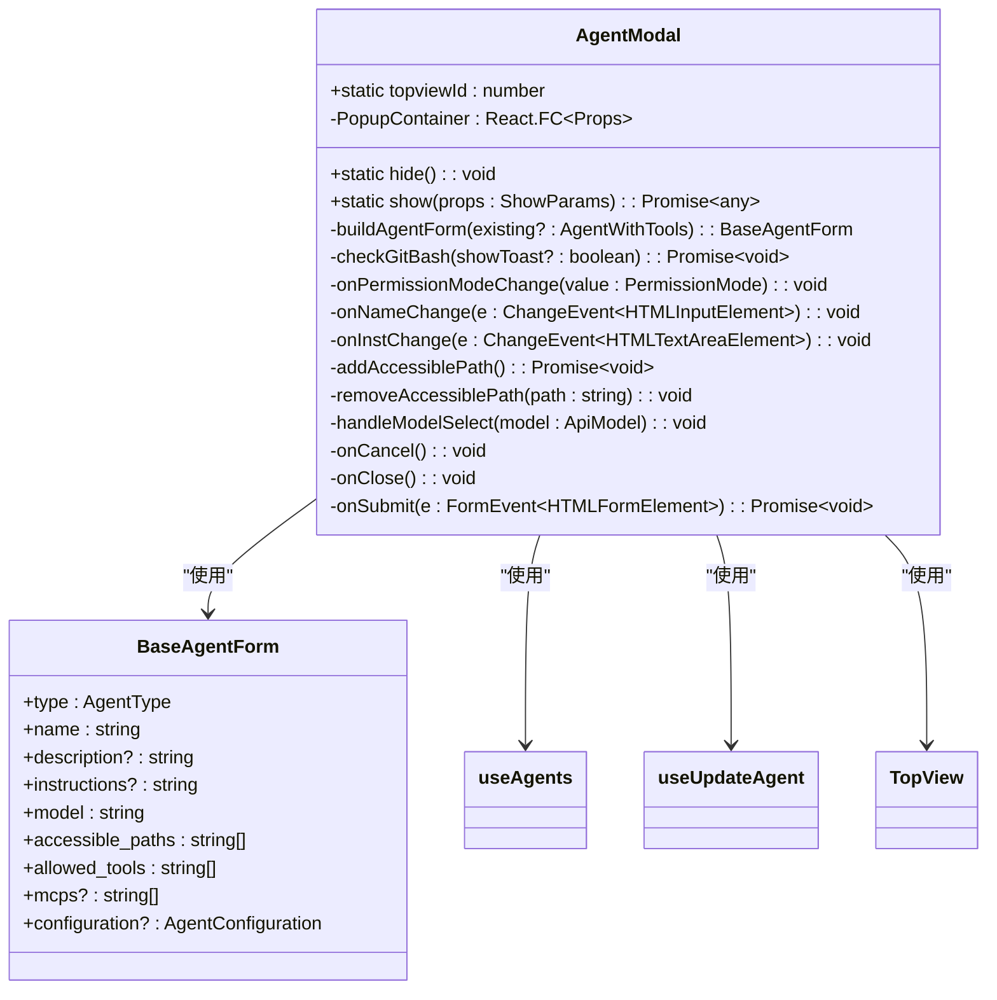
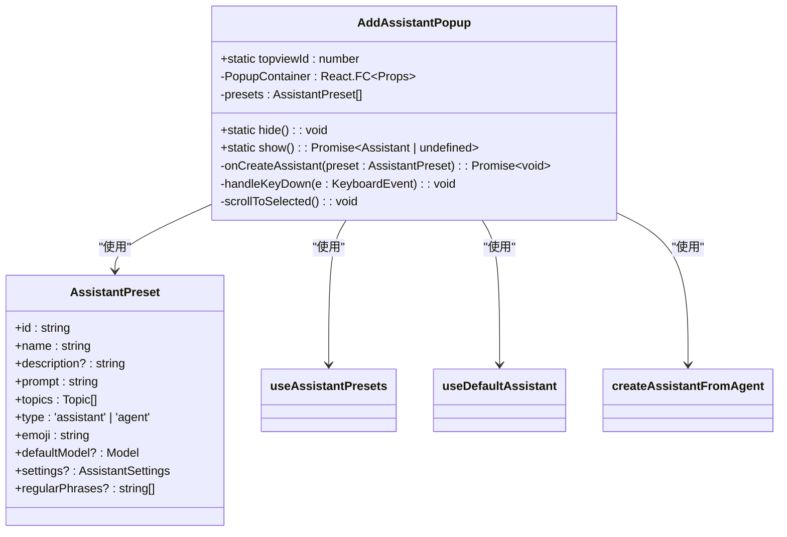
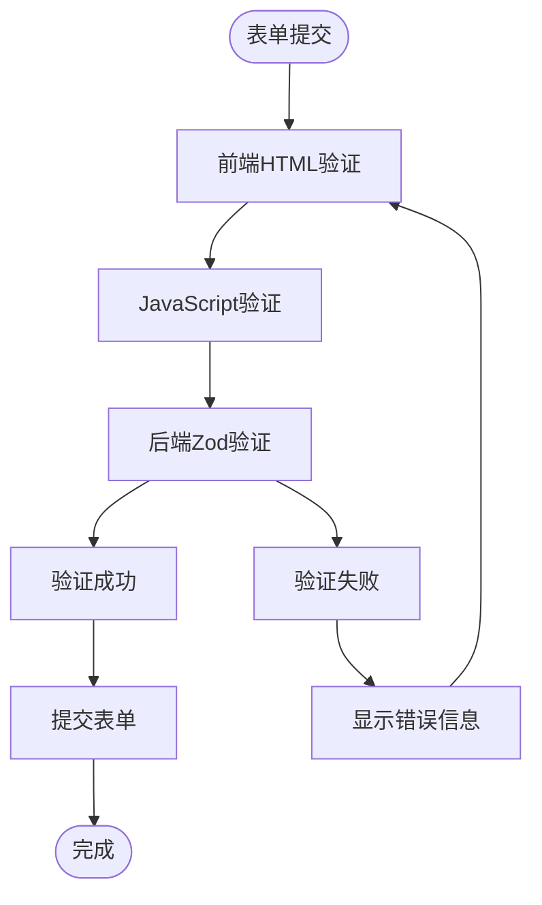
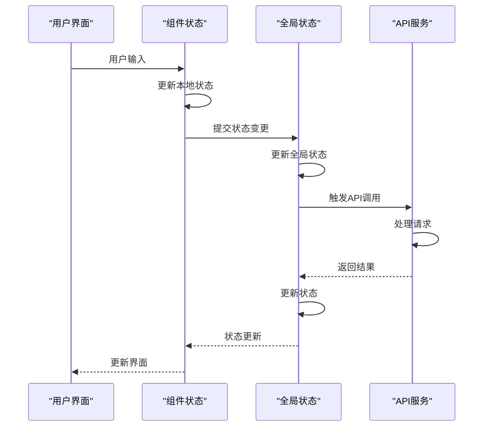
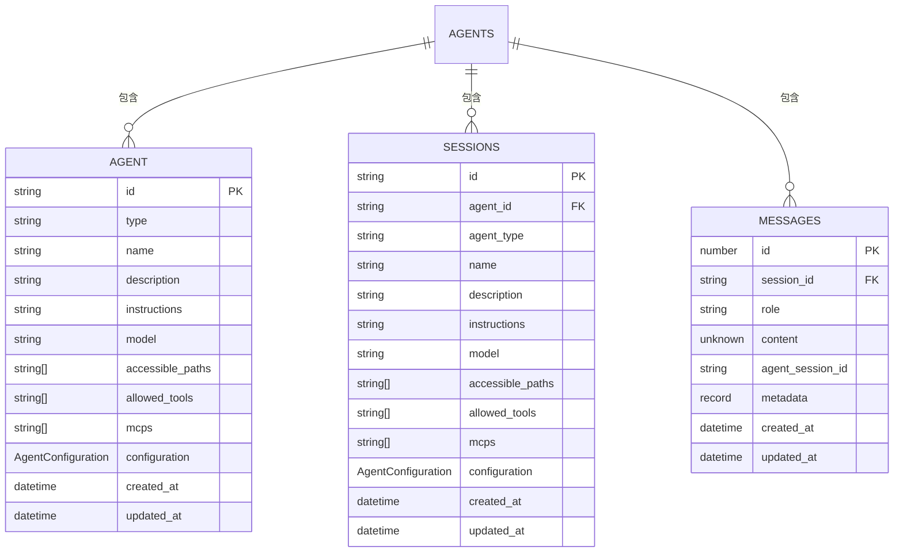
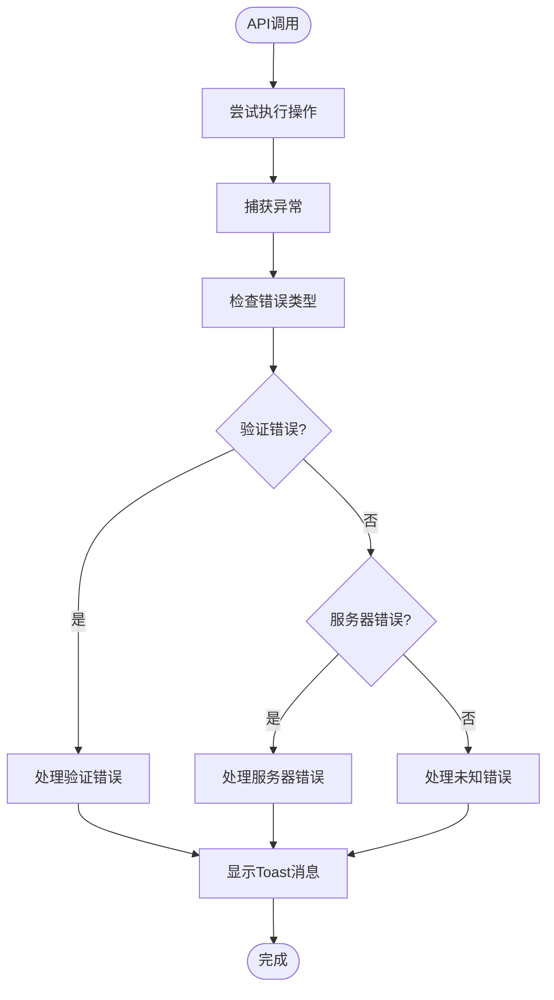
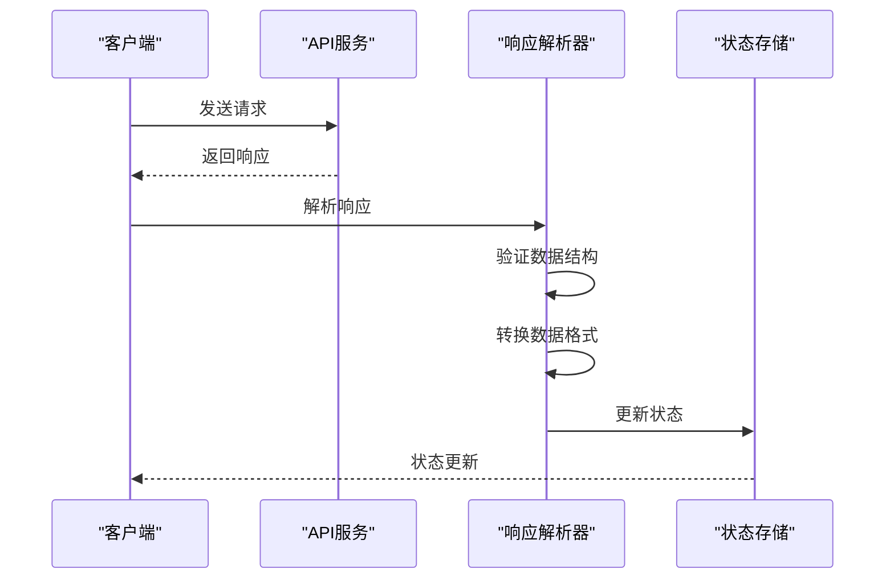
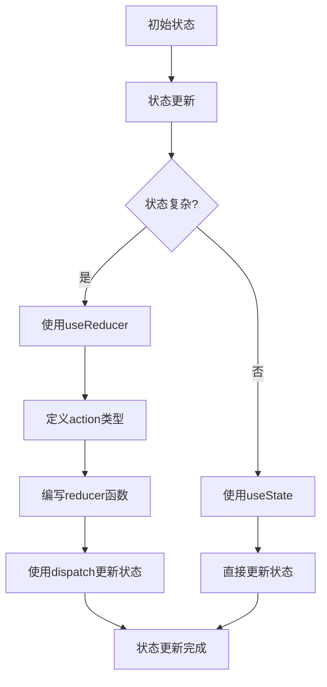

# 助手管理弹窗

<cite>
**本文档引用的文件**   
- [AgentModal.tsx](file://src/renderer/src/components/Popups/agent/AgentModal.tsx)
- [AddAssistantPopup.tsx](file://src/renderer/src/components/Popups/AddAssistantPopup.tsx)
- [AddAssistantOrAgentPopup.tsx](file://src/renderer/src/components/Popups/AddAssistantOrAgentPopup.tsx)
- [AssistantService.ts](file://src/renderer/src/services/AssistantService.ts)
- [agents.ts](file://src/main/apiServer/routes/agents/handlers/agents.ts)
- [agent.ts](file://src/renderer/src/types/agent.ts)
- [agents.ts](file://src/main/apiServer/routes/agents/index.ts)
- [useAgents.ts](file://src/renderer/src/hooks/agents/useAgents.ts)
</cite>

## 目录
1. [简介](#简介)
2. [核心组件](#核心组件)
3. [表单验证与状态管理](#表单验证与状态管理)
4. [与AgentService的交互模式](#与agentservice的交互模式)
5. [使用示例与集成场景](#使用示例与集成场景)
6. [最佳实践指南](#最佳实践指南)
7. [结论](#结论)

## 简介
助手管理弹窗系统是Cherry Studio中用于创建、编辑和管理AI助手的核心用户界面组件。该系统提供了一套完整的弹窗组件，包括`AgentModal`用于创建和编辑智能体，`AddAssistantPopup`用于从预设中添加助手，以及`AddAssistantOrAgentPopup`用于在助手和智能体之间进行选择。这些组件共同构成了助手生命周期管理的完整解决方案，支持从创建、配置到删除的全功能操作。

**Section sources**
- [AgentModal.tsx](file://src/renderer/src/components/Popups/agent/AgentModal.tsx#L1-L609)
- [AddAssistantPopup.tsx](file://src/renderer/src/components/Popups/AddAssistantPopup.tsx#L1-L272)
- [AddAssistantOrAgentPopup.tsx](file://src/renderer/src/components/Popups/AddAssistantOrAgentPopup.tsx#L1-L119)

## 核心组件

### AgentModal组件
`AgentModal`是用于创建和编辑智能体的主要弹窗组件。该组件提供了一个完整的表单界面，允许用户配置智能体的各种属性，包括名称、模型、权限模式、可访问路径和指令等。组件采用React函数式组件设计，结合了Ant Design的Modal组件和自定义样式，实现了现代化的用户界面。

组件的核心功能包括：
- **创建模式**：当没有传入现有智能体时，组件进入创建模式，允许用户配置新智能体
- **编辑模式**：当传入现有智能体时，组件进入编辑模式，允许用户修改智能体配置
- **状态管理**：使用useState和useMemo等React Hooks管理表单状态
- **Git Bash检查**：在Windows系统上检查Git Bash的安装状态，确保智能体能够正常运行



**Diagram sources**
- [AgentModal.tsx](file://src/renderer/src/components/Popups/agent/AgentModal.tsx#L1-L609)

**Section sources**
- [AgentModal.tsx](file://src/renderer/src/components/Popups/agent/AgentModal.tsx#L1-L609)

### AddAssistantPopup组件
`AddAssistantPopup`是用于从预设中添加助手的弹窗组件。该组件提供了一个搜索和选择界面，允许用户从系统预设、用户预设或默认助手中选择一个来创建新的助手实例。组件支持键盘导航和搜索过滤功能，提升了用户体验。

组件的主要特性包括：
- **预设管理**：整合系统预设、用户预设和默认助手
- **搜索过滤**：支持按名称和描述进行搜索过滤
- **键盘导航**：支持使用方向键和回车键进行导航和选择
- **新助手创建**：当搜索文本不为空时，提供创建新助手的选项



**Diagram sources**
- [AddAssistantPopup.tsx](file://src/renderer/src/components/Popups/AddAssistantPopup.tsx#L1-L272)

**Section sources**
- [AddAssistantPopup.tsx](file://src/renderer/src/components/Popups/AddAssistantPopup.tsx#L1-L272)

### AddAssistantOrAgentPopup组件
`AddAssistantOrAgentPopup`是一个选择性弹窗，用于在创建助手或智能体之间进行选择。该组件提供了一个直观的界面，让用户选择是要创建一个简单的助手还是一个功能更强大的智能体。

组件的特点包括：
- **双选项设计**：提供助手和智能体两个选项
- **悬停效果**：鼠标悬停时显示视觉反馈
- **图标指示**：使用不同的图标区分助手和智能体

```mermaid
classDiagram
class AddAssistantOrAgentPopup {
+static topviewId : number
+static hide() : void
+static show(props : ShowParams) : Promise~{ type? : OptionType }~
-PopupContainer : React.FC~Props~
-handleSelect(type : OptionType) : void
}
AddAssistantOrAgentPopup --> TopView : "使用"
```

**Diagram sources**
- [AddAssistantOrAgentPopup.tsx](file://src/renderer/src/components/Popups/AddAssistantOrAgentPopup.tsx#L1-L119)

**Section sources**
- [AddAssistantOrAgentPopup.tsx](file://src/renderer/src/components/Popups/AddAssistantOrAgentPopup.tsx#L1-L119)

## 表单验证与状态管理

### 表单验证机制
助手管理弹窗系统实现了多层次的表单验证机制，确保用户输入的数据符合要求。验证主要在以下几个层面进行：

1. **前端HTML验证**：使用HTML5的原生表单验证属性，如`required`，提供即时反馈
2. **JavaScript验证**：在提交前进行额外的验证检查，确保数据的安全性和完整性
3. **后端验证**：通过API路由的Zod验证器进行严格的输入验证

对于`AgentModal`组件，关键的验证规则包括：
- 名称字段为必填项
- 模型字段为必填项
- 至少需要配置一个可访问路径
- 智能体类型必须是有效的类型



**Diagram sources**
- [AgentModal.tsx](file://src/renderer/src/components/Popups/agent/AgentModal.tsx#L208-L223)
- [agents.ts](file://src/main/apiServer/routes/agents/validators/agents.ts#L1-L24)

**Section sources**
- [AgentModal.tsx](file://src/renderer/src/components/Popups/agent/AgentModal.tsx#L208-L223)
- [agents.ts](file://src/main/apiServer/routes/agents/validators/agents.ts#L1-L24)

### 默认值处理
系统在多个层面实现了默认值处理策略，确保用户体验的一致性和数据的完整性。

#### 组件层面默认值
在`AgentModal`组件中，通过`buildAgentForm`函数为表单设置默认值：
```typescript
const buildAgentForm = (existing?: AgentWithTools): BaseAgentForm => ({
  type: existing?.type ?? 'claude-code',
  name: existing?.name ?? 'Agent',
  description: existing?.description,
  instructions: existing?.instructions,
  model: existing?.model ?? '',
  accessible_paths: existing?.accessible_paths ? [...existing.accessible_paths] : [],
  allowed_tools: existing?.allowed_tools ? [...existing.allowed_tools] : [],
  mcps: existing?.mcps ? [...existing.mcps] : [],
  configuration: AgentConfigurationSchema.parse(existing?.configuration ?? {})
})
```

#### 服务层面默认值
在`AssistantService`中，定义了助手的默认设置：
```typescript
export const DEFAULT_ASSISTANT_SETTINGS: AssistantSettings = {
  temperature: DEFAULT_TEMPERATURE,
  enableTemperature: true,
  contextCount: DEFAULT_CONTEXTCOUNT,
  enableMaxTokens: false,
  maxTokens: 0,
  streamOutput: true,
  topP: 1,
  enableTopP: false,
  toolUseMode: 'function',
  customParameters: []
} as const
```

### 状态同步策略
系统采用了一套完整的状态同步策略，确保UI状态与应用状态保持一致。

#### 状态管理流程


**Diagram sources**
- [AgentModal.tsx](file://src/renderer/src/components/Popups/agent/AgentModal.tsx#L60-L67)
- [AssistantService.ts](file://src/renderer/src/services/AssistantService.ts#L210-L212)

**Section sources**
- [AgentModal.tsx](file://src/renderer/src/components/Popups/agent/AgentModal.tsx#L60-L67)
- [AssistantService.ts](file://src/renderer/src/services/AssistantService.ts#L210-L212)

## 与AgentService的交互模式

### API调用架构
助手管理弹窗系统通过清晰的API调用架构与后端服务进行交互。系统采用RESTful API设计，通过HTTP方法对应CRUD操作。



**Diagram sources**
- [agents.ts](file://src/main/apiServer/routes/agents/index.ts#L364-L562)
- [agent.ts](file://src/renderer/src/types/agent.ts#L109-L117)

**Section sources**
- [agents.ts](file://src/main/apiServer/routes/agents/index.ts#L364-L562)
- [agent.ts](file://src/renderer/src/types/agent.ts#L109-L117)

### HTTP端点映射
系统定义了完整的HTTP端点，对应智能体的CRUD操作：

| HTTP方法 | 路径 | 操作 | 请求体 | 响应 |
|--------|-----|-----|-------|------|
| POST | /v1/agents | 创建智能体 | CreateAgentRequest | AgentEntity |
| GET | /v1/agents | 列出智能体 | 无 | ListAgentsResponse |
| GET | /v1/agents/{agentId} | 获取智能体 | 无 | AgentEntity |
| PUT | /v1/agents/{agentId} | 替换智能体 | ReplaceAgentRequest | AgentEntity |
| PATCH | /v1/agents/{agentId} | 部分更新智能体 | UpdateAgentRequest | AgentEntity |
| DELETE | /v1/agents/{agentId} | 删除智能体 | 无 | 204 No Content |

### 错误处理机制
系统实现了全面的错误处理机制，确保用户能够获得清晰的错误反馈。

#### 错误处理流程


**Diagram sources**
- [agents.ts](file://src/main/apiServer/routes/agents/handlers/agents.ts#L273-L282)
- [useAgents.ts](file://src/renderer/src/hooks/agents/useAgents.ts#L85-L87)

**Section sources**
- [agents.ts](file://src/main/apiServer/routes/agents/handlers/agents.ts#L273-L282)
- [useAgents.ts](file://src/renderer/src/hooks/agents/useAgents.ts#L85-L87)

### 响应解析
系统对API响应进行标准化解析，确保数据的一致性和可用性。

#### 响应解析流程


**Diagram sources**
- [agents.ts](file://src/main/apiServer/routes/agents/handlers/agents.ts#L271-L272)
- [useAgents.ts](file://src/renderer/src/hooks/agents/useAgents.ts#L95-L96)

**Section sources**
- [agents.ts](file://src/main/apiServer/routes/agents/handlers/agents.ts#L271-L272)
- [useAgents.ts](file://src/renderer/src/hooks/agents/useAgents.ts#L95-L96)

## 使用示例与集成场景

### 在设置页面中的集成
在设置页面中，`AddAssistantPopup`被用于添加新的助手。用户点击"添加助手"按钮后，弹出选择界面，允许用户从预设中选择或创建新助手。

```typescript
// 示例：在设置页面中使用AddAssistantPopup
const handleAddAssistant = async () => {
  const assistant = await AddAssistantPopup.show()
  if (assistant) {
    // 处理新创建的助手
    console.log('New assistant created:', assistant)
  }
}
```

### 在会话界面中的集成
在会话界面中，`AddAssistantOrAgentPopup`被用于选择创建助手或智能体。这种设计允许用户根据需求选择合适的AI实体类型。

```typescript
// 示例：在会话界面中使用AddAssistantOrAgentPopup
const handleCreateEntity = async () => {
  const result = await AddAssistantOrAgentPopup.show()
  if (result.type === 'assistant') {
    // 创建助手
    await AddAssistantPopup.show()
  } else if (result.type === 'agent') {
    // 创建智能体
    await AgentModal.show()
  }
}
```

### 在助手预设页面中的集成
在助手预设页面中，`AddAssistantPopup`被用于从预设库中添加助手。用户可以选择系统预设或自定义预设来快速创建助手。

```typescript
// 示例：在助手预设页面中使用AddAssistantPopup
const onAddPresetConfirm = async (preset: AssistantPreset) => {
  const assistant = await AddAssistantPopup.show()
  if (assistant) {
    // 使用预设创建助手
    console.log('Assistant created from preset:', preset)
  }
}
```

**Section sources**
- [AddAssistantPopup.tsx](file://src/renderer/src/components/Popups/AddAssistantPopup.tsx#L267-L270)
- [AddAssistantOrAgentPopup.tsx](file://src/renderer/src/components/Popups/AddAssistantOrAgentPopup.tsx#L106-L118)
- [AssistantPresetsPage.tsx](file://src/renderer/src/pages/store/assistants/presets/AssistantPresetsPage.tsx#L304-L308)

## 最佳实践指南

### 复杂表单状态管理
对于复杂的表单状态管理，建议采用以下最佳实践：

1. **使用useReducer**：对于复杂的状态逻辑，使用useReducer而不是多个useState
2. **状态规范化**：将表单状态结构化，便于管理和更新
3. **防抖处理**：对于频繁更新的状态，使用防抖技术减少不必要的渲染



### 多步骤创建流程
对于多步骤的创建流程，建议采用以下模式：

1. **分步引导**：将复杂的创建过程分解为多个简单的步骤
2. **进度指示**：显示当前步骤和总步骤数，让用户了解进度
3. **状态暂存**：在用户完成所有步骤前，暂存已输入的数据


### 性能优化建议
1. **懒加载**：对于大型预设列表，实现懒加载以提高性能
2. **虚拟滚动**：使用虚拟滚动技术处理大量列表项
3. **记忆化**：使用useMemo和React.memo避免不必要的重新渲染

### 用户体验优化
1. **键盘导航**：确保所有功能都可以通过键盘访问
2. **即时反馈**：提供即时的验证反馈和操作结果
3. **错误恢复**：在错误发生后，提供清晰的恢复路径

**Section sources**
- [AgentModal.tsx](file://src/renderer/src/components/Popups/agent/AgentModal.tsx#L118-L137)
- [AddAssistantPopup.tsx](file://src/renderer/src/components/Popups/AddAssistantPopup.tsx#L93-L126)
- [TopView/index.tsx](file://src/renderer/src/components/TopView/index.tsx#L114-L119)

## 结论
助手管理弹窗系统为Cherry Studio提供了一套完整、灵活且用户友好的助手管理解决方案。通过`AgentModal`、`AddAssistantPopup`和`AddAssistantOrAgentPopup`等组件的协同工作，系统实现了从创建、编辑到删除的全生命周期管理功能。系统的表单验证机制、状态管理策略和与AgentService的交互模式都经过精心设计，确保了数据的完整性和用户体验的流畅性。通过遵循本文档提供的最佳实践指南，开发者可以有效地集成和扩展这些弹窗组件，满足各种复杂的使用场景需求。