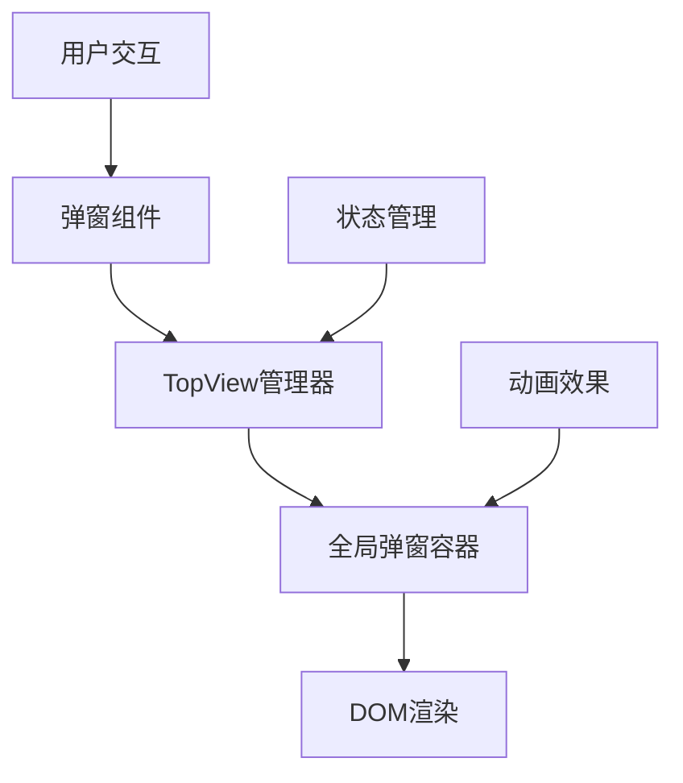
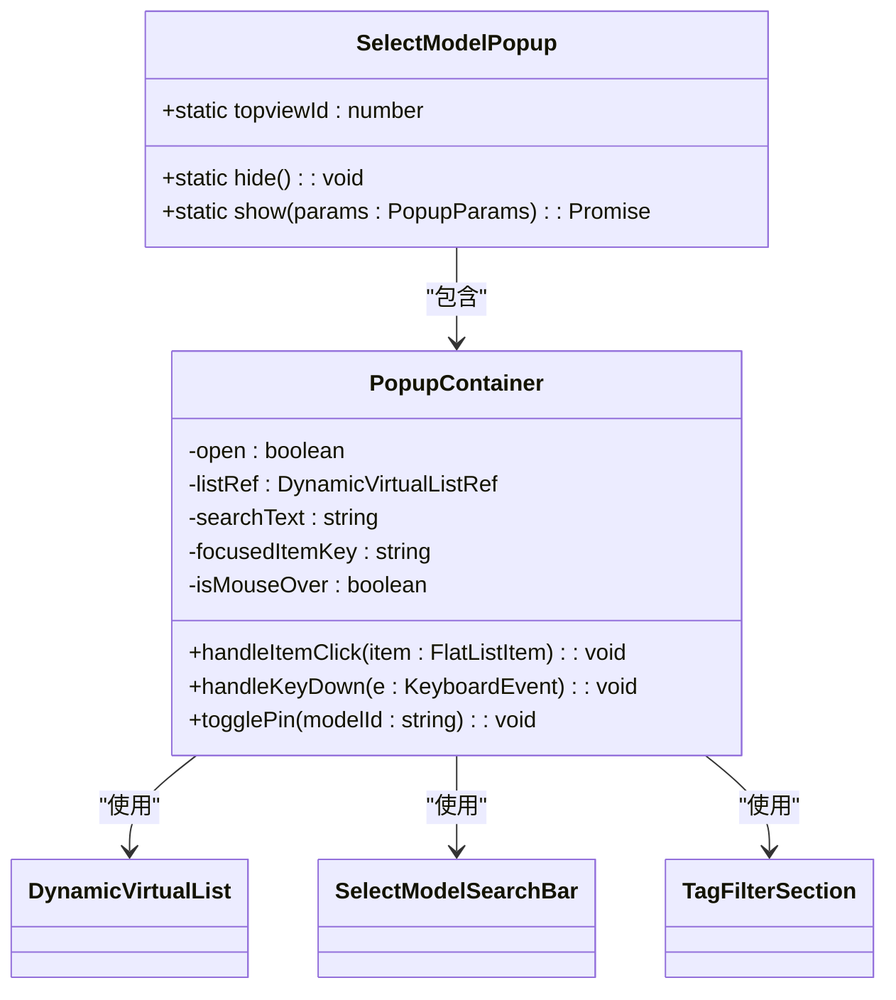
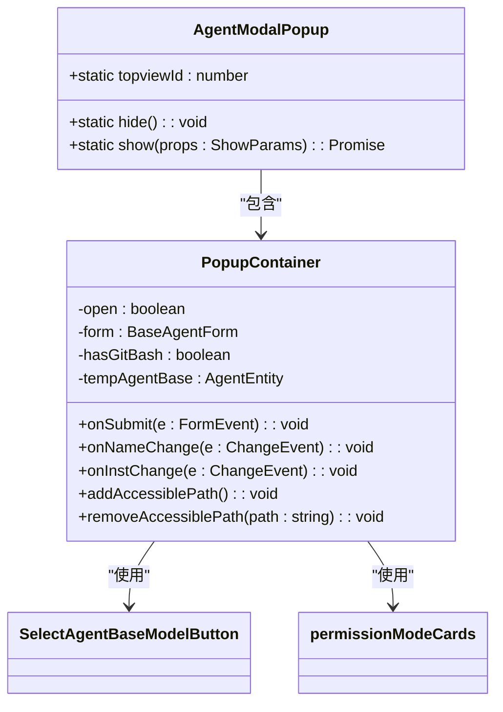
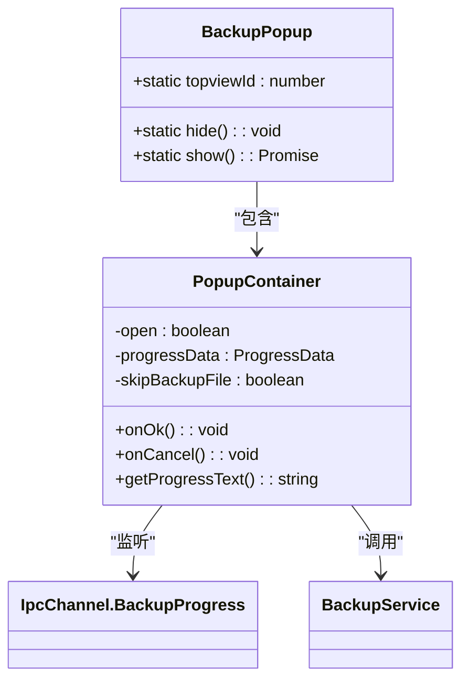
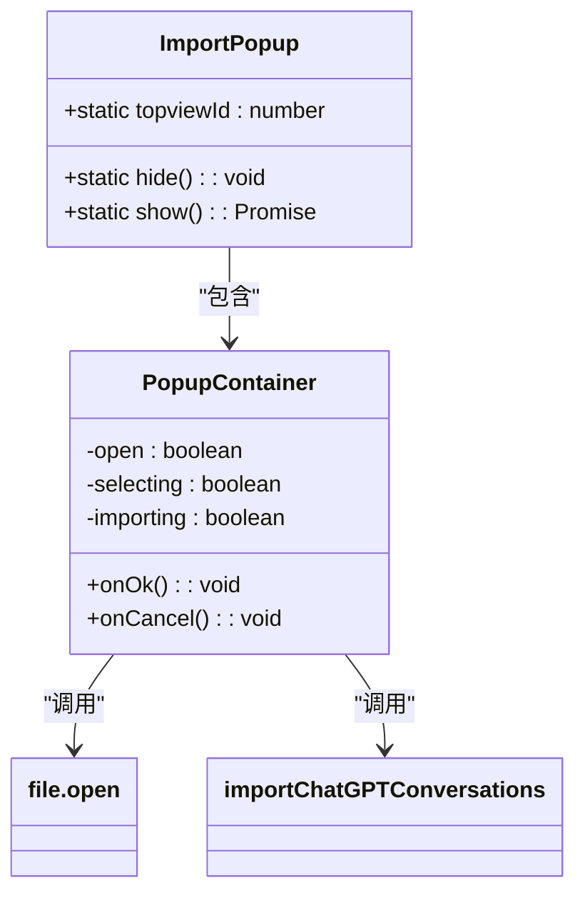
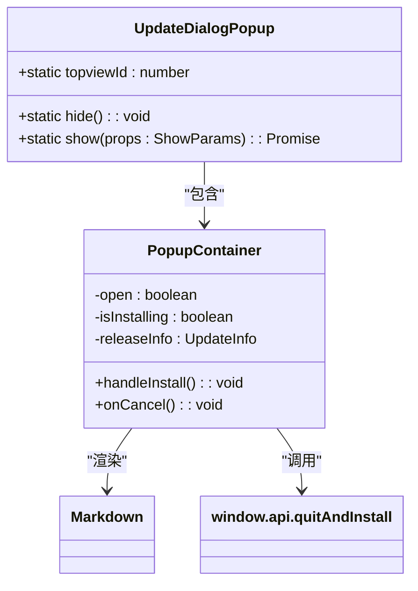
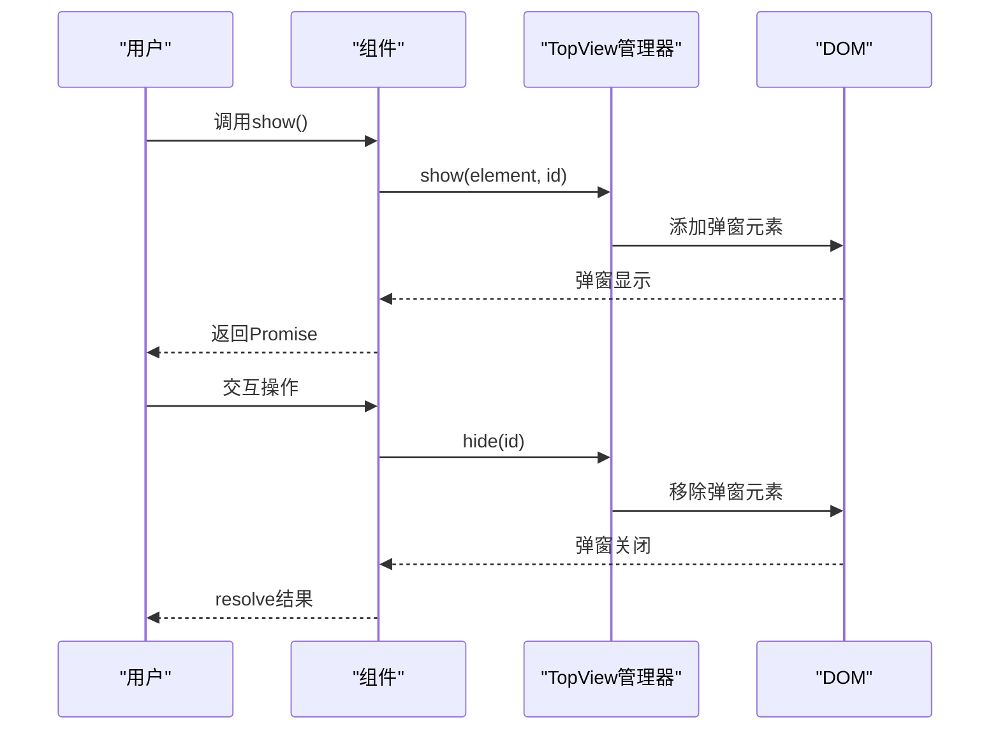
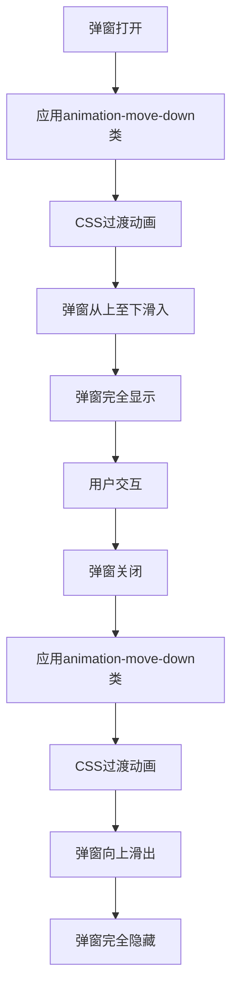

# 弹窗组件

<cite>
**本文档中引用的文件**  
- [SelectModelPopup.tsx](file://src/renderer/src/components/Popups/SelectModelPopup/popup.tsx)
- [AgentModal.tsx](file://src/renderer/src/components/Popups/agent/AgentModal.tsx)
- [BackupPopup.tsx](file://src/renderer/src/components/Popups/BackupPopup.tsx)
- [ImportPopup.tsx](file://src/renderer/src/components/Popups/ImportPopup.tsx)
- [UpdateDialogPopup.tsx](file://src/renderer/src/components/Popups/UpdateDialogPopup.tsx)
- [TopView.tsx](file://src/renderer/src/components/TopView/index.tsx)
</cite>

## 目录
1. [简介](#简介)
2. [弹窗架构与核心机制](#弹窗架构与核心机制)
3. [主要弹窗组件分析](#主要弹窗组件分析)
   - [SelectModelPopup](#selectmodelpopup)
   - [AgentModal](#agentmodal)
   - [BackupPopup](#backuppopup)
   - [ImportPopup](#importpopup)
   - [UpdateDialogPopup](#updatedialogpopup)
4. [弹窗管理与状态控制](#弹窗管理与状态控制)
5. [动画与响应式设计](#动画与响应式设计)
6. [使用示例与集成方式](#使用示例与集成方式)
7. [弹窗堆叠与焦点管理](#弹窗堆叠与焦点管理)
8. [移动端适配与无障碍访问](#移动端适配与无障碍访问)
9. [结论](#结论)

## 简介

Cherry Studio的弹窗组件系统为应用程序提供了统一、可复用的模态对话框解决方案。该系统基于Ant Design的Modal组件构建，通过TopView管理器实现弹窗的全局显示与隐藏控制。主要弹窗组件包括SelectModelPopup（模型选择）、AgentModal（代理设置）、BackupPopup（备份）、ImportPopup（导入）和UpdateDialogPopup（更新对话框），每个组件都针对特定功能进行了优化设计，提供了良好的用户体验和交互逻辑。

**Section sources**
- [SelectModelPopup.tsx](file://src/renderer/src/components/Popups/SelectModelPopup/popup.tsx#L1-L605)
- [AgentModal.tsx](file://src/renderer/src/components/Popups/agent/AgentModal.tsx#L1-L609)
- [BackupPopup.tsx](file://src/renderer/src/components/Popups/BackupPopup.tsx#L1-L116)
- [ImportPopup.tsx](file://src/renderer/src/components/Popups/ImportPopup.tsx#L1-L142)
- [UpdateDialogPopup.tsx](file://src/renderer/src/components/Popups/UpdateDialogPopup.tsx#L1-L206)

## 弹窗架构与核心机制

Cherry Studio的弹窗系统采用了一种基于TopView的集中式管理架构。所有弹窗组件都通过TopView.show()和TopView.hide()方法进行显示和隐藏控制，确保了弹窗状态的一致性和可管理性。这种架构模式使得弹窗的打开、关闭和堆叠管理变得更加简单和可靠。



**Diagram sources**
- [TopView.tsx](file://src/renderer/src/components/TopView/index.tsx#L114-L119)
- [SelectModelPopup.tsx](file://src/renderer/src/components/Popups/SelectModelPopup/popup.tsx#L593-L604)

**Section sources**
- [TopView.tsx](file://src/renderer/src/components/TopView/index.tsx#L114-L119)

## 主要弹窗组件分析

### SelectModelPopup

SelectModelPopup是用于选择AI模型的核心组件，提供了丰富的筛选和搜索功能。该组件支持按标签（如视觉、嵌入、推理等）进行过滤，并集成了虚拟滚动以优化大量模型的渲染性能。



**Diagram sources**
- [SelectModelPopup.tsx](file://src/renderer/src/components/Popups/SelectModelPopup/popup.tsx#L593-L604)
- [searchbar.tsx](file://src/renderer/src/components/Popups/SelectModelPopup/searchbar.tsx#L1-L79)
- [filters.ts](file://src/renderer/src/components/Popups/SelectModelPopup/filters.ts#L1-L81)

**Section sources**
- [SelectModelPopup.tsx](file://src/renderer/src/components/Popups/SelectModelPopup/popup.tsx#L1-L605)
- [searchbar.tsx](file://src/renderer/src/components/Popups/SelectModelPopup/searchbar.tsx#L1-L79)
- [filters.ts](file://src/renderer/src/components/Popups/SelectModelPopup/filters.ts#L1-L81)

### AgentModal

AgentModal组件用于创建和编辑AI代理，提供了完整的表单输入和验证功能。该组件支持Git Bash检测、权限模式选择、可访问路径配置等高级功能，确保了代理配置的安全性和灵活性。



**Diagram sources**
- [AgentModal.tsx](file://src/renderer/src/components/Popups/agent/AgentModal.tsx#L447-L466)
- [AgentModal.tsx](file://src/renderer/src/components/Popups/agent/AgentModal.tsx#L52-L287)

**Section sources**
- [AgentModal.tsx](file://src/renderer/src/components/Popups/agent/AgentModal.tsx#L1-L609)

### BackupPopup

BackupPopup组件用于执行数据备份操作，提供了实时的进度反馈。该组件通过IPC通道监听备份进度事件，动态更新进度条和状态文本，让用户清晰了解备份过程的当前状态。



**Diagram sources**
- [BackupPopup.tsx](file://src/renderer/src/components/Popups/BackupPopup.tsx#L97-L115)
- [BackupPopup.tsx](file://src/renderer/src/components/Popups/BackupPopup.tsx#L26-L71)

**Section sources**
- [BackupPopup.tsx](file://src/renderer/src/components/Popups/BackupPopup.tsx#L1-L116)

### ImportPopup

ImportPopup组件用于导入ChatGPT对话记录，提供了文件选择、内容解析和导入状态反馈功能。该组件在导入过程中显示加载动画，并在完成后提供成功或错误提示。



**Diagram sources**
- [ImportPopup.tsx](file://src/renderer/src/components/Popups/ImportPopup.tsx#L123-L141)
- [ImportPopup.tsx](file://src/renderer/src/components/Popups/ImportPopup.tsx#L16-L74)

**Section sources**
- [ImportPopup.tsx](file://src/renderer/src/components/Popups/ImportPopup.tsx#L1-L142)

### UpdateDialogPopup

UpdateDialogPopup组件用于提示用户应用程序更新，显示版本信息和更新日志。该组件支持Markdown格式的更新日志渲染，并提供立即安装和稍后提醒选项。



**Diagram sources**
- [UpdateDialogPopup.tsx](file://src/renderer/src/components/Popups/UpdateDialogPopup.tsx#L99-L117)
- [UpdateDialogPopup.tsx](file://src/renderer/src/components/Popups/UpdateDialogPopup.tsx#L21-L57)

**Section sources**
- [UpdateDialogPopup.tsx](file://src/renderer/src/components/Popups/UpdateDialogPopup.tsx#L1-L206)

## 弹窗管理与状态控制

Cherry Studio的弹窗系统通过TopView对象提供统一的管理接口。每个弹窗组件都实现了静态的show和hide方法，这些方法内部调用TopView的相应方法来控制弹窗的显示状态。弹窗的状态（如打开/关闭）通过React的useState Hook进行管理，并在适当的时候通过resolve回调通知调用方。



**Diagram sources**
- [TopView.tsx](file://src/renderer/src/components/TopView/index.tsx#L114-L119)
- [SelectModelPopup.tsx](file://src/renderer/src/components/Popups/SelectModelPopup/popup.tsx#L600-L603)

**Section sources**
- [TopView.tsx](file://src/renderer/src/components/TopView/index.tsx#L114-L119)

## 动画与响应式设计

所有弹窗组件都使用了"animation-move-down"过渡动画，提供了平滑的显示和隐藏效果。组件的尺寸和布局都采用了响应式设计，确保在不同屏幕尺寸下都能良好显示。例如，SelectModelPopup的宽度设置为"min(800px, 70vw)"，既保证了足够的显示空间，又不会在小屏幕上溢出。



**Diagram sources**
- [SelectModelPopup.tsx](file://src/renderer/src/components/Popups/SelectModelPopup/popup.tsx#L411)
- [AgentModal.tsx](file://src/renderer/src/components/Popups/agent/AgentModal.tsx#L297)
- [BackupPopup.tsx](file://src/renderer/src/components/Popups/BackupPopup.tsx#L82)

**Section sources**
- [SelectModelPopup.tsx](file://src/renderer/src/components/Popups/SelectModelPopup/popup.tsx#L411)
- [AgentModal.tsx](file://src/renderer/src/components/Popups/agent/AgentModal.tsx#L297)
- [BackupPopup.tsx](file://src/renderer/src/components/Popups/BackupPopup.tsx#L82)

## 使用示例与集成方式

弹窗组件的使用非常简单，通常通过调用其静态show方法来显示。该方法返回一个Promise，可以在弹窗关闭后获取用户操作的结果。例如，要显示模型选择弹窗，可以这样调用：

```typescript
const selectedModel = await SelectModelPopup.show({
  model: currentModel,
  filter: (m) => m.type === 'text',
  showTagFilter: true
});
```

对于需要传递额外参数的场景，可以通过props传递。例如，显示代理设置弹窗：

```typescript
await AgentModal.show({
  agent: selectedAgent,
  afterSubmit: (updatedAgent) => {
    // 处理更新后的代理
  }
});
```

**Section sources**
- [SelectModelPopup.tsx](file://src/renderer/src/components/Popups/SelectModelPopup/popup.tsx#L599-L603)
- [AgentModal.tsx](file://src/renderer/src/components/Popups/agent/AgentModal.tsx#L452-L465)

## 弹窗堆叠与焦点管理

Cherry Studio的弹窗系统支持弹窗堆叠，即可以同时显示多个弹窗。TopView管理器通过维护一个弹窗元素栈来实现这一功能。当新的弹窗被显示时，它会被添加到栈顶；当弹窗被关闭时，它会从栈中移除。焦点管理通过键盘事件监听实现，支持使用方向键在选项间导航，Enter键确认选择，Escape键关闭弹窗。

```mermaid
graph TD
A[初始状态] --> B[显示第一个弹窗]
B --> C[弹窗栈: [Popup1]]
C --> D[显示第二个弹窗]
D --> E[弹窗栈: [Popup1, Popup2]]
E --> F[关闭第二个弹窗]
F --> G[弹窗栈: [Popup1]]
G --> H[关闭第一个弹窗]
H --> I[弹窗栈: []]
```

**Diagram sources**
- [TopView.tsx](file://src/renderer/src/components/TopView/index.tsx#L58-L67)
- [SelectModelPopup.tsx](file://src/renderer/src/components/Popups/SelectModelPopup/popup.tsx#L271-L335)

**Section sources**
- [TopView.tsx](file://src/renderer/src/components/TopView/index.tsx#L58-L67)

## 移动端适配与无障碍访问

虽然当前弹窗组件主要针对桌面端设计，但其响应式布局和语义化HTML结构为移动端适配提供了良好基础。为了提高无障碍访问性，组件使用了适当的ARIA标签和键盘导航支持。例如，所有可交互元素都支持键盘操作，重要的状态变化会通过Toast通知用户。

**Section sources**
- [GeneralPopup.tsx](file://src/renderer/src/components/Popups/GeneralPopup.tsx#L33-L40)
- [SelectModelPopup.tsx](file://src/renderer/src/components/Popups/SelectModelPopup/popup.tsx#L406-L412)

## 结论

Cherry Studio的弹窗组件系统提供了一套完整、灵活且易于使用的模态对话框解决方案。通过统一的TopView管理器和一致的设计模式，各个弹窗组件能够协同工作，为用户提供流畅的交互体验。系统的模块化设计使得添加新的弹窗类型变得简单，而基于Promise的异步API则简化了弹窗结果的处理。未来可以进一步优化移动端适配和无障碍访问特性，以满足更广泛用户的需求。